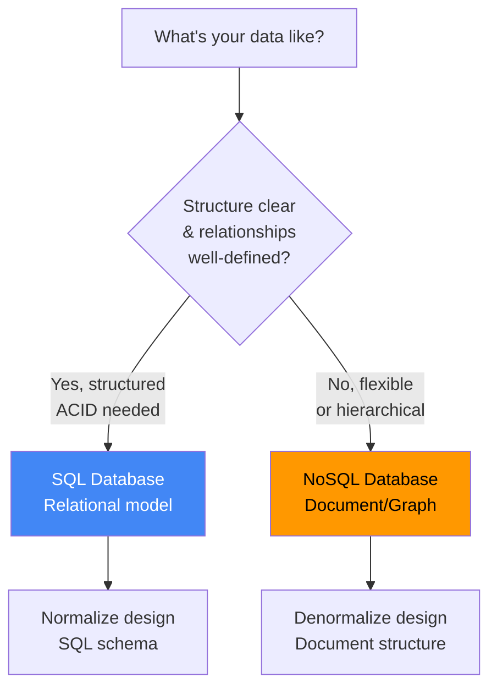

# Data Modeling Framework: Database Design & Schema

**Level:** L4-L5
**Time to read:** ~20 min

Comprehensive guide to designing database schemas that scale, are normalized, and handle real-world requirements.

---

## Data Modeling Decision Tree



---

## SQL Database Design

### Normalization Levels

**1NF (First Normal Form):**
- All values are atomic (no arrays in columns)
- Each row has unique identifier (primary key)

```sql
-- ✗ Bad (1NF violation)
CREATE TABLE users (
    id INT PRIMARY KEY,
    name VARCHAR(100),
    phone_numbers VARCHAR(100)  -- Contains "555-1234,555-5678"
);

-- ✓ Good (1NF)
CREATE TABLE users (
    id INT PRIMARY KEY,
    name VARCHAR(100)
);

CREATE TABLE phone_numbers (
    id INT PRIMARY KEY,
    user_id INT,
    phone VARCHAR(20),
    FOREIGN KEY (user_id) REFERENCES users(id)
);
```

**2NF (Second Normal Form):**
- Meets 1NF
- Non-key attributes depend on ENTIRE primary key

```sql
-- ✗ Bad (2NF violation)
CREATE TABLE order_items (
    order_id INT,
    item_id INT,
    item_name VARCHAR(100),  -- Depends only on item_id, not order_id
    quantity INT,
    PRIMARY KEY (order_id, item_id)
);

-- ✓ Good (2NF)
CREATE TABLE items (
    item_id INT PRIMARY KEY,
    item_name VARCHAR(100)
);

CREATE TABLE order_items (
    order_id INT,
    item_id INT,
    quantity INT,
    PRIMARY KEY (order_id, item_id),
    FOREIGN KEY (item_id) REFERENCES items(id)
);
```

**3NF (Third Normal Form):**
- Meets 2NF
- Non-key attributes depend ONLY on primary key, not on other non-key attributes

```sql
-- ✗ Bad (3NF violation)
CREATE TABLE employees (
    emp_id INT PRIMARY KEY,
    name VARCHAR(100),
    dept_id INT,
    dept_name VARCHAR(100)  -- Depends on dept_id, not emp_id
);

-- ✓ Good (3NF)
CREATE TABLE departments (
    dept_id INT PRIMARY KEY,
    dept_name VARCHAR(100)
);

CREATE TABLE employees (
    emp_id INT PRIMARY KEY,
    name VARCHAR(100),
    dept_id INT,
    FOREIGN KEY (dept_id) REFERENCES departments(id)
);
```

**BCNF (Boyce-Codd Normal Form):**
- Stricter 3NF
- Every determinant is a candidate key
- Used in complex scenarios with multiple overlapping candidate keys

### SQL Schema Design Template

```sql
-- Users table
CREATE TABLE users (
    id BIGINT PRIMARY KEY AUTO_INCREMENT,
    username VARCHAR(50) UNIQUE NOT NULL,
    email VARCHAR(100) UNIQUE NOT NULL,
    password_hash VARCHAR(255) NOT NULL,
    created_at TIMESTAMP DEFAULT CURRENT_TIMESTAMP,
    updated_at TIMESTAMP DEFAULT CURRENT_TIMESTAMP ON UPDATE CURRENT_TIMESTAMP,
    deleted_at TIMESTAMP NULL,  -- Soft delete
    INDEX idx_username (username),
    INDEX idx_email (email),
    INDEX idx_created_at (created_at)
);

-- Posts table (references Users)
CREATE TABLE posts (
    id BIGINT PRIMARY KEY AUTO_INCREMENT,
    user_id BIGINT NOT NULL,
    title VARCHAR(255) NOT NULL,
    content LONGTEXT NOT NULL,
    status ENUM('draft', 'published', 'archived') DEFAULT 'draft',
    view_count INT DEFAULT 0,
    created_at TIMESTAMP DEFAULT CURRENT_TIMESTAMP,
    updated_at TIMESTAMP DEFAULT CURRENT_TIMESTAMP ON UPDATE CURRENT_TIMESTAMP,
    deleted_at TIMESTAMP NULL,
    FOREIGN KEY (user_id) REFERENCES users(id),
    INDEX idx_user_id (user_id),
    INDEX idx_status (status),
    INDEX idx_created_at (created_at),
    UNIQUE KEY uk_user_title (user_id, title)
);

-- Comments table
CREATE TABLE comments (
    id BIGINT PRIMARY KEY AUTO_INCREMENT,
    post_id BIGINT NOT NULL,
    user_id BIGINT NOT NULL,
    content TEXT NOT NULL,
    created_at TIMESTAMP DEFAULT CURRENT_TIMESTAMP,
    updated_at TIMESTAMP DEFAULT CURRENT_TIMESTAMP ON UPDATE CURRENT_TIMESTAMP,
    FOREIGN KEY (post_id) REFERENCES posts(id),
    FOREIGN KEY (user_id) REFERENCES users(id),
    INDEX idx_post_id (post_id),
    INDEX idx_user_id (user_id),
    INDEX idx_created_at (created_at)
);

-- Likes table (for many-to-many: users like posts)
CREATE TABLE likes (
    user_id BIGINT NOT NULL,
    post_id BIGINT NOT NULL,
    created_at TIMESTAMP DEFAULT CURRENT_TIMESTAMP,
    PRIMARY KEY (user_id, post_id),
    FOREIGN KEY (user_id) REFERENCES users(id),
    FOREIGN KEY (post_id) REFERENCES posts(id),
    INDEX idx_post_id (post_id)
);
```

### Indexing Strategy

**When to Index:**

| Scenario | Index Type |
|----------|-----------|
| **Foreign keys** | B-tree (always) |
| **Frequent WHERE** | B-tree on column(s) |
| **Frequent ORDER BY** | B-tree in same order |
| **Frequent LIKE** | B-tree (helps with prefix search) |
| **Range queries** | B-tree (efficient ranges) |
| **DISTINCT/GROUP BY** | B-tree on grouping column |
| **Full-text search** | FULLTEXT index |
| **Geo coordinates** | SPATIAL index |

**When NOT to Index:**

- Columns with low cardinality (few unique values): STATUS, GENDER
- Columns rarely used in WHERE: EMAIL_ALTERNATE
- Columns with many NULL values (unless querying NOT NULL)
- Columns that are updated frequently (write cost)

**Composite Index Design:**

```sql
-- Query: SELECT * FROM users WHERE status = 'active' AND created_at > '2024-01-01'
CREATE INDEX idx_status_created (status, created_at);  -- ✓ Good order

-- Query: SELECT * FROM orders WHERE user_id = 123 AND amount > 50 ORDER BY created_at
CREATE INDEX idx_user_amount_created (user_id, amount, created_at);
```

### Handling Many-to-Many Relationships

```sql
-- Many-to-many: Users have many Teams, Teams have many Users

CREATE TABLE users (
    id BIGINT PRIMARY KEY,
    name VARCHAR(100)
);

CREATE TABLE teams (
    id BIGINT PRIMARY KEY,
    name VARCHAR(100)
);

-- Junction table
CREATE TABLE user_team (
    user_id BIGINT NOT NULL,
    team_id BIGINT NOT NULL,
    role ENUM('member', 'admin') DEFAULT 'member',
    joined_at TIMESTAMP DEFAULT CURRENT_TIMESTAMP,
    PRIMARY KEY (user_id, team_id),
    FOREIGN KEY (user_id) REFERENCES users(id),
    FOREIGN KEY (team_id) REFERENCES teams(id),
    INDEX idx_team_id (team_id),
    INDEX idx_role (role)
);
```

---

## NoSQL Document Design

### Document Structure

```javascript
// Users collection
{
  _id: ObjectId("507f1f77bcf86cd799439011"),
  username: "alice",
  email: "alice@example.com",
  profile: {
    fullName: "Alice Smith",
    avatar: "https://...",
    bio: "Software engineer"
  },
  preferences: {
    theme: "dark",
    emailNotifications: true,
    language: "en"
  },
  createdAt: ISODate("2024-01-15T10:30:00Z"),
  updatedAt: ISODate("2024-01-15T10:30:00Z")
}

// Posts collection
{
  _id: ObjectId("507f1f77bcf86cd799439012"),
  userId: ObjectId("507f1f77bcf86cd799439011"),
  title: "Learning GraphQL",
  content: "GraphQL is great because...",
  tags: ["graphql", "api", "backend"],
  metadata: {
    viewCount: 1523,
    likeCount: 45,
    commentCount: 8
  },
  comments: [
    {
      commentId: ObjectId("507f1f77bcf86cd799439013"),
      userId: ObjectId("507f1f77bcf86cd799439014"),
      text: "Great post!",
      createdAt: ISODate("2024-01-15T12:00:00Z")
    }
  ],
  createdAt: ISODate("2024-01-15T10:30:00Z"),
  updatedAt: ISODate("2024-01-15T10:30:00Z")
}
```

### Normalization vs Denormalization in NoSQL

**Normalized (avoid redundancy):**
```javascript
// Posts reference user
{
  _id: ObjectId(...),
  userId: ObjectId(...),  // Reference to user
  title: "...",
  content: "..."
}

// Query requires JOIN
db.posts.aggregate([
  { $lookup: { from: "users", localField: "userId", foreignField: "_id", as: "user" } }
])
```

**Denormalized (duplicate data for speed):**
```javascript
// Posts embed user info
{
  _id: ObjectId(...),
  user: {
    id: ObjectId(...),
    username: "alice",
    avatar: "https://..."
  },
  title: "...",
  content: "..."
}

// Query is fast (no JOIN), but update burden (if user changes, update all posts)
```

**When to Denormalize:**
- Data is read frequently, updated rarely
- Query performance is critical
- Storage is cheap, query speed is expensive

### Indexing in MongoDB

```javascript
// Single field index
db.posts.createIndex({ createdAt: -1 })  // 1 = ascending, -1 = descending

// Compound index
db.posts.createIndex({ userId: 1, createdAt: -1 })

// Text index (for search)
db.posts.createIndex({ title: "text", content: "text" })

// Sparse index (only documents with field)
db.users.createIndex({ email: 1 }, { sparse: true })

// TTL index (auto-delete after time)
db.sessions.createIndex({ createdAt: 1 }, { expireAfterSeconds: 3600 })
```

---

## Handling Large Data (Sharding & Partitioning)

### Sharding Strategy

**Shard by User ID (most common):**
```
User 1-100 million → Shard 1
User 101-200 million → Shard 2
User 201-300 million → Shard 3
```

Pros: User data is colocated. Queries by user_id are fast.
Cons: Uneven distribution if data skews.

**Shard by Range (time-based):**
```
Logs Jan 2024 → Shard 1
Logs Feb 2024 → Shard 2
Logs Mar 2024 → Shard 3
```

Pros: Easy to archive old shards. Archive March 2023 shard.
Cons: Queries across time require multi-shard queries.

**Shard by Geographic Location:**
```
Users in US → Shard in us-east-1
Users in EU → Shard in eu-west-1
Users in Asia → Shard in ap-southeast-1
```

Pros: Low latency, data locality.
Cons: Load imbalance if populations skew.

### Partitioning at Query Level

```sql
-- Partition by date (Apache Spark example)
SELECT * FROM logs
WHERE year = 2024 AND month = 3
-- Only scans partition for March 2024, not entire table
```

---

## Data Modeling Patterns

### Event Sourcing

```
Immutable log of all state changes.

users_events:
- Event 1: UserCreated(user_id=1, name="Alice", email="alice@example.com")
- Event 2: UserUpdated(user_id=1, name="Alice Chen")
- Event 3: UserDeleted(user_id=1)

Current state = replay all events
Benefit: Complete audit trail, time-travel capability
Cost: More complex queries
```

### CQRS (Command Query Responsibility Segregation)

```
Write model (write-optimized):
- Accept commands
- Store events
- Fast writes

Read model (read-optimized):
- Materialized views
- Denormalized data
- Fast reads

Benefits: Optimize read and write independently
Cost: Eventual consistency between models
```

### Soft Delete Pattern

```sql
CREATE TABLE users (
    id BIGINT PRIMARY KEY,
    name VARCHAR(100),
    deleted_at TIMESTAMP NULL  -- NULL = active, NOT NULL = deleted
);

-- Soft delete
UPDATE users SET deleted_at = NOW() WHERE id = 123;

-- Query only active
SELECT * FROM users WHERE deleted_at IS NULL;

-- Benefit: Can recover deleted data, audit trail
-- Cost: Queries must filter deleted_at, space overhead
```

---

## Data Modeling Checklist

- ✓ Normalized to at least 3NF (SQL) or appropriate denormalization (NoSQL)
- ✓ Primary keys defined and indexed
- ✓ Foreign keys with referential integrity
- ✓ Timestamps (created_at, updated_at) on all main tables
- ✓ Soft delete column if needed (deleted_at)
- ✓ Appropriate indexes on foreign keys, frequent WHERE/ORDER BY
- ✓ Composite indexes in correct order
- ✓ Many-to-many relationships via junction tables (SQL)
- ✓ Enum/constraints for fixed set of values
- ✓ Appropriate data types (INT vs BIGINT, VARCHAR size, DECIMAL for money)
- ✓ Nullable vs NOT NULL decisions made intentionally
- ✓ Partitioning/sharding strategy for large tables
- ✓ Audit trail for important data (created_by, updated_by, version)
- ✓ No redundant data (unless explicitly denormalized for performance)
- ✓ Handles growth (space, performance) as data scales 10x, 100x

