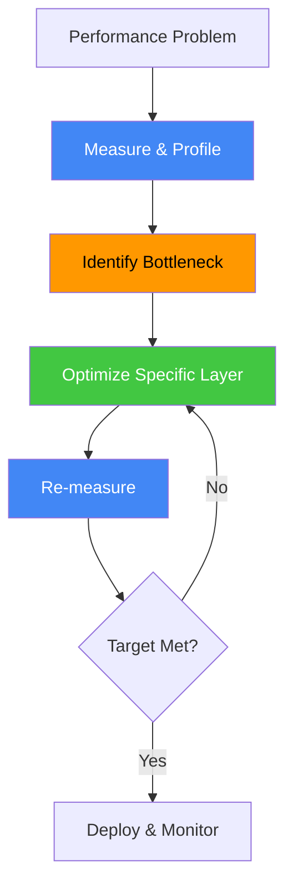
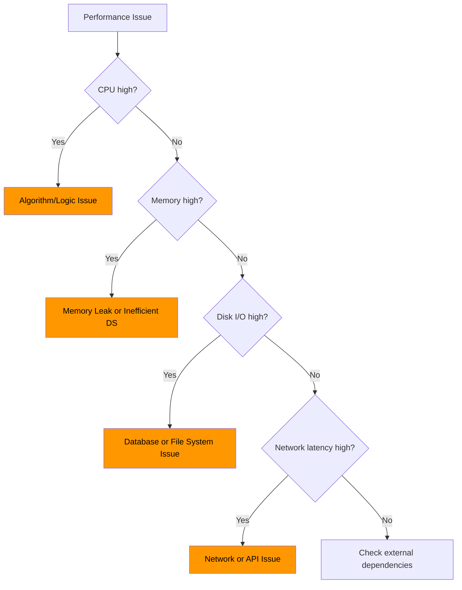

# Performance Optimization Framework: Profiling to Tuning

**Level:** L5
**Time to read:** ~20 min

Systematic approach to identifying bottlenecks, measuring performance, and optimizing systems.

---

## Performance Optimization Workflow



---

## Phase 1: Measure & Profile

### Application Performance Monitoring (APM)

**Metrics to Track:**

| Metric | Target | Tool |
|--------|--------|------|
| **Response time** | P50 < 200ms, P99 < 1s | APM (DataDog, New Relic) |
| **CPU usage** | < 80% sustained | System monitor (htop, top) |
| **Memory usage** | < 80% available | System monitor |
| **Disk I/O** | < 1000 IOPS | iostat, vmstat |
| **Network** | < 100ms latency, > 100Mbps | Network tools |
| **Error rate** | < 0.1% | Application logs |
| **Database queries** | < 100ms p99 | Query profiler |

### Profiling Tools

**CPU Profiling:**
```bash
# Python
python -m cProfile -s cumulative script.py

# Java
jprofile, YourKit

# Go
go test -cpuprofile=cpu.prof
go tool pprof cpu.prof
```

**Memory Profiling:**
```bash
# Python
pip install memory-profiler
python -m memory_profiler script.py

# Java
jmap, JProfiler
```

**Database Query Profiling:**
```sql
-- MySQL: Enable slow query log
SET GLOBAL slow_query_log = 'ON';
SET GLOBAL long_query_time = 0.5;  -- Log queries > 0.5s

-- PostgreSQL: EXPLAIN ANALYZE
EXPLAIN ANALYZE SELECT * FROM users WHERE created_at > '2024-01-01';
```

---

## Phase 2: Identify Bottleneck

### Bottleneck Decision Tree



### Common Bottlenecks by Layer

| Layer | Symptom | Likely Cause |
|-------|---------|-------------|
| **Algorithm** | CPU 100%, no wait | O(n²) algorithm, inefficient loop |
| **Data Structure** | Memory high, slow lookups | Array instead of HashMap, deep object graph |
| **Database** | Slow queries (>1s), high I/O | Missing index, N+1 query, full table scan |
| **Cache** | High latency despite cache | Low hit ratio, incorrect TTL, cache churn |
| **Network** | High latency | Regional separation, packet loss, bandwidth |
| **Serialization** | High CPU, high memory | JSON parsing, Protocol Buffer overhead |
| **Locking** | High CPU, thread waits | Contention on locks, lock hold time |

---

## Phase 3: Optimize Specific Layer

### Algorithm Optimization

**Example: Find duplicate in array**

```python
# ❌ O(n²) - nested loops
def has_duplicate_slow(arr):
    for i in range(len(arr)):
        for j in range(i+1, len(arr)):
            if arr[i] == arr[j]:
                return True
    return False

# ✓ O(n) - hash set
def has_duplicate_fast(arr):
    seen = set()
    for num in arr:
        if num in seen:
            return True
        seen.add(num)
    return False

# For sorted array: O(n)
def has_duplicate_sorted(arr):
    for i in range(1, len(arr)):
        if arr[i] == arr[i-1]:
            return True
    return False
```

**Optimization techniques:**
- Replace O(n²) with O(n) or O(n log n)
- Use hash maps instead of nested loops
- Exploit data properties (sorted, range, etc.)
- Memoization for repeated subproblems

### Database Optimization

**1. Index Missing Columns**

```sql
-- Slow: full table scan
SELECT * FROM users WHERE email = 'alice@example.com';

-- Add index
CREATE INDEX idx_email ON users(email);

-- Now fast: index lookup
SELECT * FROM users WHERE email = 'alice@example.com';
```

**2. Avoid N+1 Queries**

```python
# ❌ N+1: 1 query for users + 100 queries for each user's posts
users = db.query(User).all()  # 1 query
for user in users:
    posts = db.query(Post).filter_by(user_id=user.id).all()  # 100 queries

# ✓ 1 query with JOIN
users_with_posts = db.query(User).join(Post).all()

# Or use ORM eager loading
users = db.query(User).options(joinedload(User.posts)).all()
```

**3. Optimize WHERE Clause**

```sql
-- ❌ Slow: calculation on column prevents index usage
SELECT * FROM orders WHERE MONTH(created_at) = 3 AND YEAR(created_at) = 2024;

-- ✓ Fast: range query uses index
SELECT * FROM orders 
WHERE created_at >= '2024-03-01' AND created_at < '2024-04-01';
```

**4. Use LIMIT with OFFSET Carefully**

```sql
-- ❌ Slow: OFFSET 1M scans 1M rows
SELECT * FROM users LIMIT 1000000, 10;

-- ✓ Fast: Cursor-based pagination
SELECT * FROM users WHERE id > :last_id LIMIT 10;
```

### Caching Optimization

**Cache Hit Ratio Formula:**
```
Hit Ratio = Cache Hits / (Cache Hits + Cache Misses)
Target: > 80% for read-heavy systems
```

**Optimization:**

```python
# ❌ Low hit ratio: cache 1 hour TTL but data changes every 10 min
cache.set(f"user:{user_id}", user_data, ttl=3600)

# ✓ Higher hit ratio: cache for 1 day, invalidate on update
cache.set(f"user:{user_id}", user_data, ttl=86400)
# On user update, invalidate immediately
cache.delete(f"user:{user_id}")

# ✓ Or: use cache-aside pattern with versioning
version = cache.get(f"user:{user_id}:version") or 1
user_data = cache.get(f"user:{user_id}:v{version}") or fetch_from_db()
```

**Cache Strategies:**

| Strategy | Benefit | Drawback |
|----------|---------|----------|
| **Cache-Aside** | Simple, flexible TTL | Cache misses → DB load |
| **Write-Through** | Consistent cache | Slower writes (wait for cache) |
| **Write-Behind** | Fast writes | Risk of data loss |
| **Refresh-Ahead** | No stale data | Precompute cost |

### Network Optimization

**1. Reduce Payload Size**

```json
// ❌ Sending everything
{
  "user": {
    "id": 123,
    "name": "Alice",
    "email": "alice@example.com",
    "phone": "+1-555-1234",
    "address": {...},
    "billing_address": {...},
    "all_orders": [...]  // 1000 orders
  }
}

// ✓ Sparse fieldsets (return only needed)
?fields=id,name,email
{
  "user": {
    "id": 123,
    "name": "Alice",
    "email": "alice@example.com"
  }
}
```

**2. Compression**

```
Without: 100KB response
With gzip: ~20KB response (5x smaller)

Enable in HTTP header:
Accept-Encoding: gzip, deflate
```

**3. CDN for Static Content**

```
Without CDN:
User in Tokyo → request to US server → 200ms latency

With CDN:
User in Tokyo → request to Tokyo CDN edge → 10ms latency
```

---

## Phase 4: Re-measure & Verify

### Benchmarking Before/After

```python
import time

# Before optimization
start = time.time()
result = has_duplicate_slow(arr)
before = time.time() - start
print(f"Slow: {before:.3f}s")  # 5.234s

# After optimization
start = time.time()
result = has_duplicate_fast(arr)
after = time.time() - start
print(f"Fast: {after:.3f}s")  # 0.023s

improvement = (before - after) / before * 100
print(f"Improvement: {improvement:.1f}%")  # 99.6%
```

### Amdahl's Law (Don't Optimize Wrong Thing)

```
Speedup = 1 / ((1 - f) + f / s)

Where:
f = fraction of time in optimized part
s = speedup of that part

Example:
- Database takes 80% of time, cache takes 10%, other 10%
- If you optimize cache (10%) by 10x: 
  Overall speedup = 1 / (0.9 + 0.1/10) = 1.08x (8% faster)
- If you optimize database (80%) by 2x:
  Overall speedup = 1 / (0.2 + 0.8/2) = 1.43x (43% faster)

Lesson: Optimize bottleneck (largest time consumer), not cache
```

---

## Phase 5: Deploy & Monitor

### Rollout Strategy

```
1. Deploy to canary (1% of users)
2. Monitor metrics for 1 hour
3. If OK: deploy to 10% (1 hour)
4. If OK: deploy to 100%
5. If issue detected: rollback to previous version
```

### Monitoring Dashboard

**Key Metrics to Display:**

- Response time: P50, P95, P99
- Error rate: % of requests failing
- Throughput: requests/second
- CPU/Memory: usage %
- Database query time: p99, slow queries
- Cache hit ratio

**Alert Thresholds:**

```
- Response time P99 > 1000ms → Alert
- Error rate > 1% → Alert
- CPU > 80% sustained → Alert
- Memory > 85% → Alert
- Cache hit ratio < 70% → Alert
```

---

## Performance Optimization Checklist

- ✓ Identified actual bottleneck (measured, not guessed)
- ✓ Algorithm is optimal complexity
- ✓ Database queries use indexes, no N+1
- ✓ Cache hit ratio > 80% if caching
- ✓ Response payloads are minimal (sparse fieldsets)
- ✓ Network uses compression (gzip)
- ✓ Static content on CDN
- ✓ Connection pooling configured
- ✓ Timeouts set on external API calls
- ✓ Lazy loading for large objects
- ✓ Benchmarked before/after
- ✓ Monitored in production (didn't regress)
- ✓ Improvements don't compromise correctness
- ✓ Trade-offs documented (e.g., cache stale data)

