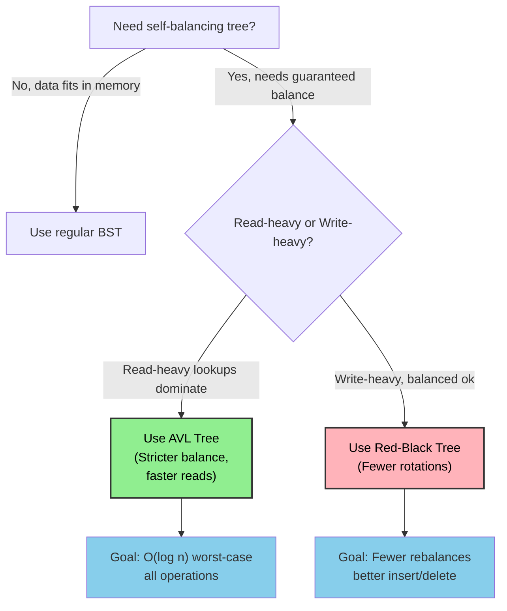
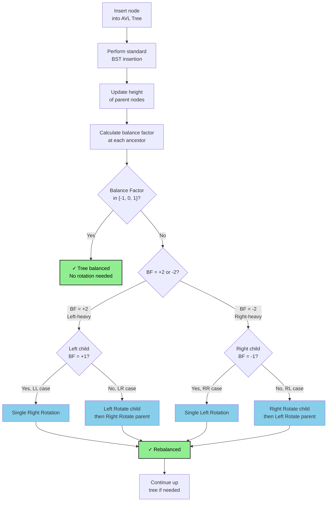
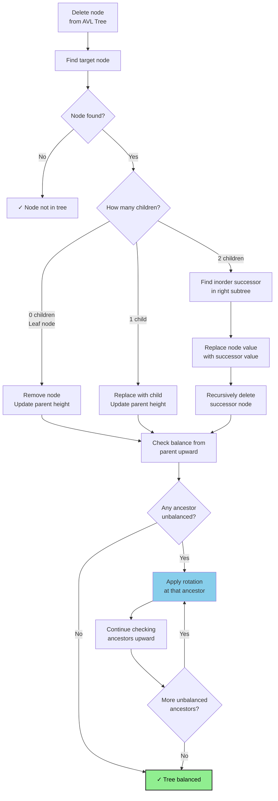

# AVL Tree (Self-Balancing BST)

## Overview

An **AVL Tree** (Adelson-Velsky and Landis, 1962) is a self-balancing BST where the heights of the two child subtrees of any node differ by at most 1. After every insertion or deletion, rotations are performed to restore balance.

**When to use:**
- Need guaranteed O(log n) worst-case for all operations (not just average)
- Read-heavy workloads where lookups dominate (AVL is more strictly balanced than Red-Black)
- Implementing ordered maps/sets with strict performance guarantees
- Database indexing scenarios

---

## Flowcharts

### When to Use AVL Tree



### AVL Insertion & Rotation Decision Tree



### AVL Deletion Decision Tree



---

## Visualization

### Balance Factor

```
balance_factor(node) = height(left subtree) - height(right subtree)

Valid balance factors: -1, 0, +1
Invalid (triggers rotation): -2 or +2

         10 [bf=0]
        /         \
    5 [bf=1]    15 [bf=0]
   /    \
2[bf=0] 7[bf=0]

height(left of 5) = 1, height(right of 5) = 1 → bf = 0
height(left of 10) = 2, height(right of 10) = 1 → bf = 1  ✓ valid
```

### Four Rotation Cases

#### Case 1: Left-Left (LL) → Right Rotation

```
Unbalanced (insert 1):        After Right Rotation at z:

      z (bf=+2)                     y (bf=0)
     /                             / \
    y (bf=+1)          →          x   z
   /                             (1) (5)
  x (bf=0)
 (1)

z=5, y=3, x=1

Before:                       After:
    5 [bf=2]                     3 [bf=0]
   /                            / \
  3 [bf=1]        →            1   5
 /
1
```

#### Case 2: Right-Right (RR) → Left Rotation

```
Unbalanced (insert 9):        After Left Rotation at z:

  z (bf=-2)                       y (bf=0)
   \                             / \
    y (bf=-1)          →        z   x
     \
      x (bf=0)

z=3, y=5, x=9

Before:                       After:
  3 [bf=-2]                      5 [bf=0]
   \                            / \
    5 [bf=-1]       →          3   9
     \
      9
```

#### Case 3: Left-Right (LR) → Left Rotate at y, then Right Rotate at z

```
Unbalanced (insert 4):

      z (bf=+2)
     /
    x (bf=-1)
     \
      y (bf=0)

z=5, x=2, y=4

Step 1: Left rotate at x (2):     Step 2: Right rotate at z (5):

      5 [bf=2]                           4 [bf=0]
     /                                  / \
    4 [bf=1]             →             2   5
   /
  2

Visual flow:
Before:        Left-rotate x:     Right-rotate z:
   5               5                  4
  /               /                  / \
 2       →       4        →         2   5
  \             /
   4           2
```

#### Case 4: Right-Left (RL) → Right Rotate at y, then Left Rotate at z

```
Unbalanced (insert 4):

  z (bf=-2)
   \
    x (bf=+1)
   /
  y (bf=0)

z=1, x=6, y=4

Step 1: Right rotate at x (6):    Step 2: Left rotate at z (1):

  1 [bf=-2]                              4 [bf=0]
   \                                    / \
    4 [bf=-1]             →            1   6
     \
      6

Visual flow:
Before:        Right-rotate x:    Left-rotate z:
  1                1                  4
   \                \                / \
    6      →         4      →       1   6
   /                  \
  4                    6
```

### Full Insertion Example

```
Insert sequence: 10, 20, 30, 15, 25

Step 1: Insert 10          Step 2: Insert 20
         10                        10
                                     \
                                      20

Step 3: Insert 30 → RR violation at 10
         10 [bf=-2]        Left rotate at 10:
           \                       20
            20 [bf=-1]            /  \
              \                  10   30
               30

Step 4: Insert 15
               20
              /  \
             10   30
               \
                15

Step 5: Insert 25 → bf=-2 at 20, bf=+1 at 30 → RL case
               20 [bf=-2]
              /  \
             10   30 [bf=+1]
               \  /
               15 25

  Right rotate 30:              Left rotate 20:
       20                             25
      /  \                           /  \
     10   25          →            20   30
       \    \                     /  \
       15   30                   10  15
```

---

## Operations & Complexity

| Operation   | Time (Avg) | Time (Worst) | Space  |
|-------------|:----------:|:------------:|:------:|
| Search      | O(log n)   | O(log n)     | O(log n) |
| Insert      | O(log n)   | O(log n)     | O(log n) |
| Delete      | O(log n)   | O(log n)     | O(log n) |
| Rotation    | O(1)       | O(1)         | O(1)   |
| Space       | —          | —            | O(n)   |

> AVL guarantees O(log n) worst case unlike plain BST. Height is always ≤ 1.44 * log₂(n+2).

---

## Key Properties / Invariants

1. **BST property**: left < node < right at every node.
2. **Balance factor ∈ {-1, 0, +1}**: |height(left) - height(right)| ≤ 1 at every node.
3. **Height bound**: For n nodes, height h ≤ 1.44 log₂(n+2) − 0.328.
4. **Rotation preserves BST property**: All four rotation types maintain the BST ordering.
5. **At most O(log n) rotations per insertion**, but deletion can require O(log n) rotations up the path.

---

## Common Interview Patterns

### Pattern 1: Understand When Rotation is Needed
Memorize the four cases: LL → single right, RR → single left, LR → left then right, RL → right then left.

### Pattern 2: Height-Balanced Check
Given a binary tree, check if it's height-balanced (same logic as AVL validation).

```
def is_balanced(root):
    def height(node):
        if not node: return 0
        lh = height(node.left)
        if lh == -1: return -1
        rh = height(node.right)
        if rh == -1: return -1
        if abs(lh - rh) > 1: return -1
        return 1 + max(lh, rh)
    return height(root) != -1
```

### Pattern 3: AVL vs Red-Black Tree Trade-offs
AVL: faster lookups (stricter balance), more rotations on insert/delete.
Red-Black: fewer rotations (better for write-heavy), used in Java TreeMap, C++ std::map.

### Pattern 4: Augmented AVL for Order Statistics
Store subtree size at each node to answer "find k-th element" in O(log n).

### Pattern 5: Balanced BST from Sorted Array
Not strictly AVL, but related — always pick midpoint as root for perfect balance.

---

## Interview Tips

- **You rarely implement AVL from scratch in interviews** — but you must understand the rotation logic, balance factors, and why it's better than plain BST.
- **The rotation diagrams are the key**: Interviewers want to see you know LL/RR/LR/RL cases.
- **Height vs depth**: Height of a node = longest path to a leaf. Be precise with terminology.
- **Balance factor sign convention**: Some sources use right - left; clarify your convention.
- **After deletion**: The rebalancing may propagate all the way to the root (unlike insertion, which stops after one rotation).
- **AVL is rarely asked to be implemented** but "is this tree balanced?" (LC 110) is very common.

---

## Example Problems

| Problem                                        | Pattern                         |
|------------------------------------------------|---------------------------------|
| Balanced Binary Tree (LC 110)                  | Height + balance check          |
| Balance a Binary Search Tree (LC 1382)         | Inorder + rebuild balanced BST  |
| Height of Binary Tree After Subtree Removal (LC 2458) | Height computation         |
| Closest Binary Search Tree Value (LC 270)      | Leverages O(log n) BST search   |
| Count of Smaller Numbers After Self (LC 315)   | Augmented BST / BIT             |

---

## Python Quick Reference

```python
class AVLNode:
    def __init__(self, val):
        self.val = val
        self.left = self.right = None
        self.height = 1

# ── Height helper ─────────────────────────────────────────────────────────────
def height(node):
    return node.height if node else 0

# ── Balance factor ────────────────────────────────────────────────────────────
def get_balance(node):
    return height(node.left) - height(node.right) if node else 0

def update_height(node):
    node.height = 1 + max(height(node.left), height(node.right))

# ── Rotations ─────────────────────────────────────────────────────────────────
def right_rotate(z):
    y = z.left
    T3 = y.right
    y.right = z
    z.left = T3
    update_height(z)
    update_height(y)
    return y  # new root

def left_rotate(z):
    y = z.right
    T2 = y.left
    y.left = z
    z.right = T2
    update_height(z)
    update_height(y)
    return y  # new root

# ── Insert ────────────────────────────────────────────────────────────────────
def insert(root, val):
    # 1. Standard BST insert
    if not root:
        return AVLNode(val)
    if val < root.val:
        root.left = insert(root.left, val)
    elif val > root.val:
        root.right = insert(root.right, val)
    else:
        return root  # duplicate

    # 2. Update height
    update_height(root)

    # 3. Get balance factor
    bf = get_balance(root)

    # 4. Rebalance if needed
    # LL case
    if bf > 1 and val < root.left.val:
        return right_rotate(root)
    # RR case
    if bf < -1 and val > root.right.val:
        return left_rotate(root)
    # LR case
    if bf > 1 and val > root.left.val:
        root.left = left_rotate(root.left)
        return right_rotate(root)
    # RL case
    if bf < -1 and val < root.right.val:
        root.right = right_rotate(root.right)
        return left_rotate(root)

    return root

# ── Check if balanced (LC 110 style) ─────────────────────────────────────────
def is_balanced(root):
    def check(node):
        if not node:
            return 0
        lh = check(node.left)
        if lh == -1: return -1
        rh = check(node.right)
        if rh == -1: return -1
        if abs(lh - rh) > 1: return -1
        return 1 + max(lh, rh)
    return check(root) != -1
```

---

## Java Quick Reference

```java
class AVLNode {
    int val, height;
    AVLNode left, right;
    AVLNode(int val) { this.val = val; this.height = 1; }
}

// ── Helpers ───────────────────────────────────────────────────────────────────
int height(AVLNode n) { return n == null ? 0 : n.height; }

int getBalance(AVLNode n) {
    return n == null ? 0 : height(n.left) - height(n.right);
}

void updateHeight(AVLNode n) {
    n.height = 1 + Math.max(height(n.left), height(n.right));
}

// ── Rotations ─────────────────────────────────────────────────────────────────
AVLNode rightRotate(AVLNode z) {
    AVLNode y = z.left, T3 = y.right;
    y.right = z; z.left = T3;
    updateHeight(z); updateHeight(y);
    return y;
}

AVLNode leftRotate(AVLNode z) {
    AVLNode y = z.right, T2 = y.left;
    y.left = z; z.right = T2;
    updateHeight(z); updateHeight(y);
    return y;
}

// ── Insert ────────────────────────────────────────────────────────────────────
AVLNode insert(AVLNode root, int val) {
    if (root == null) return new AVLNode(val);
    if      (val < root.val) root.left  = insert(root.left,  val);
    else if (val > root.val) root.right = insert(root.right, val);
    else return root;

    updateHeight(root);
    int bf = getBalance(root);

    if (bf >  1 && val < root.left.val)  return rightRotate(root);          // LL
    if (bf < -1 && val > root.right.val) return leftRotate(root);           // RR
    if (bf >  1 && val > root.left.val)  { root.left  = leftRotate(root.left);  return rightRotate(root); } // LR
    if (bf < -1 && val < root.right.val) { root.right = rightRotate(root.right); return leftRotate(root); } // RL

    return root;
}

// ── Balanced check (LC 110) ───────────────────────────────────────────────────
boolean isBalanced(TreeNode root) {
    return checkHeight(root) != -1;
}
int checkHeight(TreeNode node) {
    if (node == null) return 0;
    int lh = checkHeight(node.left);  if (lh == -1) return -1;
    int rh = checkHeight(node.right); if (rh == -1) return -1;
    if (Math.abs(lh - rh) > 1) return -1;
    return 1 + Math.max(lh, rh);
}
```
