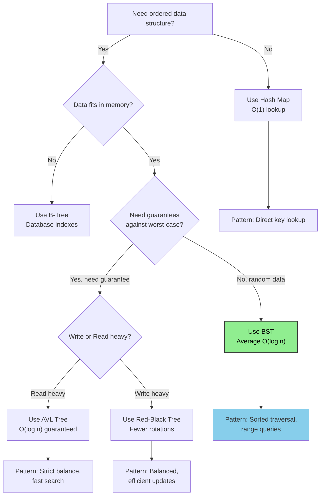
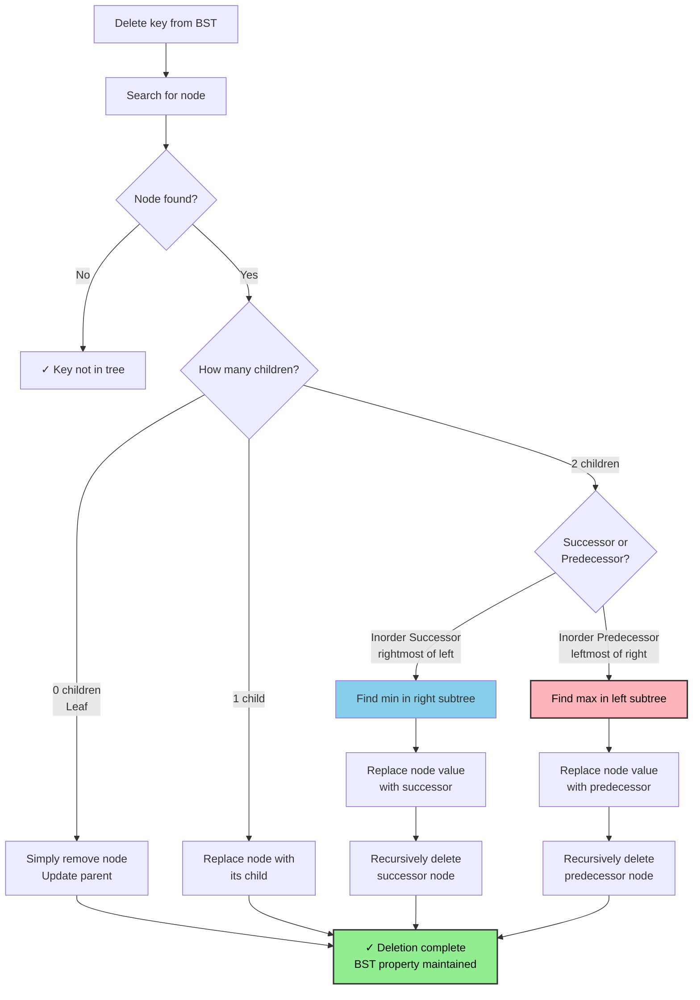

# Binary Search Tree (BST)

## Overview

A **Binary Search Tree** is a binary tree where each node satisfies the BST property: every node in the left subtree has a value less than the node, and every node in the right subtree has a value greater than the node. This ordering property enables efficient search, insertion, and deletion in O(log n) average time.

**When to use:**
- Need sorted data with dynamic insertions/deletions
- Need to find k-th smallest/largest element
- Need range queries on dynamic data
- Need predecessor/successor queries
- Implementing a sorted map or set

---

## Flowcharts

### When to Use BST



### BST Deletion Strategy Decision Tree



### BST Search Optimization Decision Tree

```mermaid
graph TD
    A["Problem: Search in BST"] --> B{"What type of query?"}
    B -->|Find exact value| C["Binary search<br/>left/right comparison<br/>O(log n) avg"]
    B -->|Find k-th smallest| D["Augment with<br/>subtree sizes<br/>O(log n)"]
    B -->|Range query [L, R]| E["Inorder traversal<br/>with early termination<br/>O(k) where k = result"]
    B -->|Successor/Predecessor| F["Navigate smartly<br/>left/right<br/>O(log n)"]
    
    C --> G["Validate BST first<br/>using min/max bounds"]
    D --> H["Each node stores<br/>count of left subtree"]
    E --> I["Return all values<br/>in [L, R]"]
    F --> J["Successor: go right then left<br/>Predecessor: go left then right"]
    
    style C fill:#90ee90,color:#000,stroke:#333,stroke-width:2px
    style D fill:#90ee90,color:#000,stroke:#333,stroke-width:2px
    style E fill:#90ee90,color:#000,stroke:#333,stroke-width:2px
    style F fill:#90ee90,color:#000,stroke:#333,stroke-width:2px
```

---

## Visualization

### Structure

```
              8
           /     \
          3       10
         / \        \
        1   6        14
           / \       /
          4   7     13

BST Property at every node:
  left subtree values < node value < right subtree values

Node 6: left subtree {4} < 6 < right subtree {7} ✓
Node 8: left subtree {1,3,4,6,7} < 8 < right subtree {10,13,14} ✓
```

### Insertion: Insert 5

```
Step 1: Start at root 8        Step 2: Go left (5 < 8)
              8                              8
           /     \                        /     \
          3       10                     3       10
         / \        \      →            / \        \
        1   6        14                1   6        14
           / \       /                    / \       /
          4   7     13                   4   7     13

Step 3: Go right (5 > 3)       Step 4: Go right (5 > 4)
              8                              8
           /     \                        /     \
          3       10                     3       10
         / \        \      →            / \        \
        1   6        14                1   6        14
           / \       /                    / \       /
          4   7     13                   4   7     13
                                          \
                                           5  ← inserted here
```

### Deletion: Delete 6 (node with two children)

```
Original:                Find inorder successor of 6
      8                  (smallest in right subtree = 7)
   /     \
  3       10                    8
 / \        \                /     \
1   6        14     →       3       10
   / \       /             / \        \
  4   7     13            1   7        14
                             /        /
                            4        13
                  (replace 6 with 7, delete original 7)
```

### Inorder Traversal (gives sorted output)

```
Tree:          Inorder: Left → Root → Right
      8
   /     \        Visit: 1 → 3 → 4 → 6 → 7 → 8 → 10 → 13 → 14
  3       10
 / \        \     Sorted output: [1, 3, 4, 6, 7, 8, 10, 13, 14]
1   6        14
   / \       /
  4   7     13
```

---

## Operations & Complexity

| Operation        | Average Time | Worst Time (skewed) | Space  |
|------------------|:------------:|:-------------------:|:------:|
| Search           | O(log n)     | O(n)                | O(h)   |
| Insert           | O(log n)     | O(n)                | O(h)   |
| Delete           | O(log n)     | O(n)                | O(h)   |
| Min / Max        | O(log n)     | O(n)                | O(h)   |
| Successor/Pred.  | O(log n)     | O(n)                | O(h)   |
| Inorder Traversal| O(n)         | O(n)                | O(h)   |
| Space (tree)     | —            | —                   | O(n)   |

> h = tree height. Average case h = O(log n) for random data; worst case h = O(n) for sorted input.

---

## Key Properties / Invariants

1. **BST Property**: `left.val < node.val < right.val` at every node (strict inequality for no duplicates).
2. **Inorder = Sorted**: Inorder traversal always produces a sorted sequence.
3. **Unique keys**: Standard BST assumes unique keys (duplicates require a convention: e.g., go right).
4. **No cycles**: It's a tree — no node is visited twice in traversal.
5. **Height determines performance**: Balanced BST gives O(log n); skewed gives O(n).

---

## Common Interview Patterns

### Pattern 1: Validate BST
Use min/max bounds propagated top-down. Do NOT just check parent vs child.

```
isValid(node, min=-∞, max=+∞):
    if node is None: return True
    if node.val <= min or node.val >= max: return False
    return isValid(node.left, min, node.val) and
           isValid(node.right, node.val, max)
```

### Pattern 2: K-th Smallest Element
Inorder traversal counts nodes. Use a counter or Morris traversal for O(1) space.

```
Inorder gives sorted order → k-th element = k-th visited node
Use iterative inorder with a stack to avoid recursion stack overflow
```

### Pattern 3: Lowest Common Ancestor (LCA)
Both left and right guide the search — use BST property.

```
if p.val and q.val < node.val → LCA is in left subtree
if p.val and q.val > node.val → LCA is in right subtree
else → current node is LCA (one value on each side, or one equals node)
```

### Pattern 4: BST Iterator / Flatten BST
Use a stack to simulate inorder traversal lazily — gives next() in O(log n) amortized.

### Pattern 5: Convert Sorted Array to Balanced BST
Always pick the middle element as root to minimize height.

```
buildBST(arr, lo, hi):
    if lo > hi: return None
    mid = (lo + hi) // 2
    node = TreeNode(arr[mid])
    node.left  = buildBST(arr, lo, mid - 1)
    node.right = buildBST(arr, mid + 1, hi)
    return node
```

---

## Interview Tips

- **Skewed tree gotcha**: If input is sorted, naive BST becomes a linked list — mention AVL or Red-Black in follow-up.
- **Range queries**: Use inorder traversal with early termination or augment nodes with subtree min/max.
- **Delete with two children**: The tricky case — replace with inorder successor (or predecessor), then delete that node from right subtree.
- **Iterative vs recursive**: Interviewers often ask for iterative versions to avoid stack overflow on skewed trees.
- **Duplicate handling**: Always clarify — most LeetCode problems assume unique values.
- **Augmented BST**: Adding subtree size enables order-statistics queries in O(log n).

---

## Example Problems

| Problem                                   | Pattern                    |
|-------------------------------------------|----------------------------|
| Validate Binary Search Tree (LC 98)       | Min/max bounds validation  |
| Kth Smallest Element in a BST (LC 230)    | Inorder counting           |
| Lowest Common Ancestor of BST (LC 235)    | BST property navigation    |
| Convert Sorted Array to BST (LC 108)      | Divide and conquer         |
| Recover Binary Search Tree (LC 99)        | Inorder anomaly detection  |

---

## Python Quick Reference

```python
class TreeNode:
    def __init__(self, val=0, left=None, right=None):
        self.val = val
        self.left = left
        self.right = right

# ── Search ────────────────────────────────────────────────────────────────────
def search(root, target):
    if not root or root.val == target:
        return root
    if target < root.val:
        return search(root.left, target)
    return search(root.right, target)

# ── Insert ────────────────────────────────────────────────────────────────────
def insert(root, val):
    if not root:
        return TreeNode(val)
    if val < root.val:
        root.left = insert(root.left, val)
    elif val > root.val:
        root.right = insert(root.right, val)
    return root

# ── Delete ────────────────────────────────────────────────────────────────────
def delete(root, key):
    if not root:
        return None
    if key < root.val:
        root.left = delete(root.left, key)
    elif key > root.val:
        root.right = delete(root.right, key)
    else:
        if not root.left:
            return root.right
        if not root.right:
            return root.left
        # Two children: find inorder successor (min of right subtree)
        successor = root.right
        while successor.left:
            successor = successor.left
        root.val = successor.val
        root.right = delete(root.right, successor.val)
    return root

# ── Inorder (iterative) ───────────────────────────────────────────────────────
def inorder(root):
    result, stack, curr = [], [], root
    while curr or stack:
        while curr:
            stack.append(curr)
            curr = curr.left
        curr = stack.pop()
        result.append(curr.val)
        curr = curr.right
    return result

# ── Validate BST ──────────────────────────────────────────────────────────────
def is_valid_bst(root, lo=float('-inf'), hi=float('inf')):
    if not root:
        return True
    if not (lo < root.val < hi):
        return False
    return (is_valid_bst(root.left, lo, root.val) and
            is_valid_bst(root.right, root.val, hi))

# ── LCA ───────────────────────────────────────────────────────────────────────
def lca(root, p, q):
    if p.val < root.val and q.val < root.val:
        return lca(root.left, p, q)
    if p.val > root.val and q.val > root.val:
        return lca(root.right, p, q)
    return root

# ── Kth Smallest ──────────────────────────────────────────────────────────────
def kth_smallest(root, k):
    stack, curr = [], root
    while curr or stack:
        while curr:
            stack.append(curr)
            curr = curr.left
        curr = stack.pop()
        k -= 1
        if k == 0:
            return curr.val
        curr = curr.right
```

---

## Java Quick Reference

```java
class TreeNode {
    int val;
    TreeNode left, right;
    TreeNode(int val) { this.val = val; }
}

// ── Search ────────────────────────────────────────────────────────────────────
TreeNode search(TreeNode root, int target) {
    if (root == null || root.val == target) return root;
    if (target < root.val) return search(root.left, target);
    return search(root.right, target);
}

// ── Insert ────────────────────────────────────────────────────────────────────
TreeNode insert(TreeNode root, int val) {
    if (root == null) return new TreeNode(val);
    if (val < root.val)       root.left  = insert(root.left,  val);
    else if (val > root.val)  root.right = insert(root.right, val);
    return root;
}

// ── Inorder (iterative) ───────────────────────────────────────────────────────
List<Integer> inorder(TreeNode root) {
    List<Integer> result = new ArrayList<>();
    Deque<TreeNode> stack = new ArrayDeque<>();
    TreeNode curr = root;
    while (curr != null || !stack.isEmpty()) {
        while (curr != null) { stack.push(curr); curr = curr.left; }
        curr = stack.pop();
        result.add(curr.val);
        curr = curr.right;
    }
    return result;
}

// ── Validate BST ──────────────────────────────────────────────────────────────
boolean isValidBST(TreeNode root, long lo, long hi) {
    if (root == null) return true;
    if (root.val <= lo || root.val >= hi) return false;
    return isValidBST(root.left, lo, root.val) &&
           isValidBST(root.right, root.val, hi);
}
// Call: isValidBST(root, Long.MIN_VALUE, Long.MAX_VALUE)

// ── LCA ───────────────────────────────────────────────────────────────────────
TreeNode lca(TreeNode root, TreeNode p, TreeNode q) {
    if (p.val < root.val && q.val < root.val) return lca(root.left,  p, q);
    if (p.val > root.val && q.val > root.val) return lca(root.right, p, q);
    return root;
}

// ── Kth Smallest ──────────────────────────────────────────────────────────────
int kthSmallest(TreeNode root, int k) {
    Deque<TreeNode> stack = new ArrayDeque<>();
    TreeNode curr = root;
    while (curr != null || !stack.isEmpty()) {
        while (curr != null) { stack.push(curr); curr = curr.left; }
        curr = stack.pop();
        if (--k == 0) return curr.val;
        curr = curr.right;
    }
    return -1;
}
```
