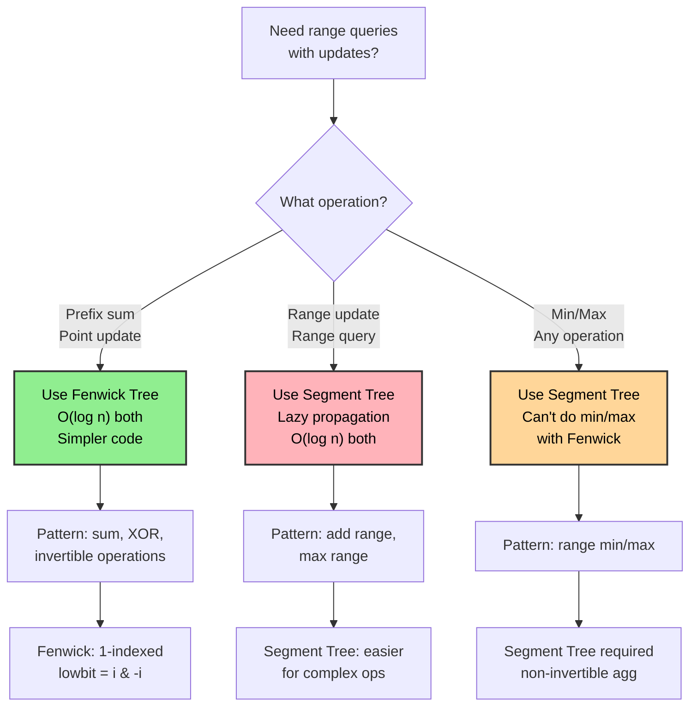
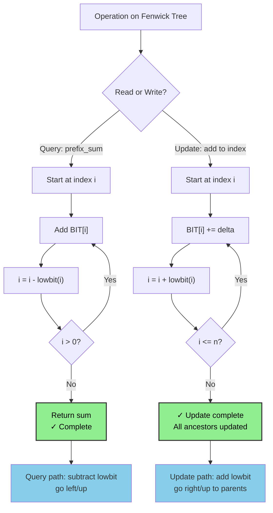
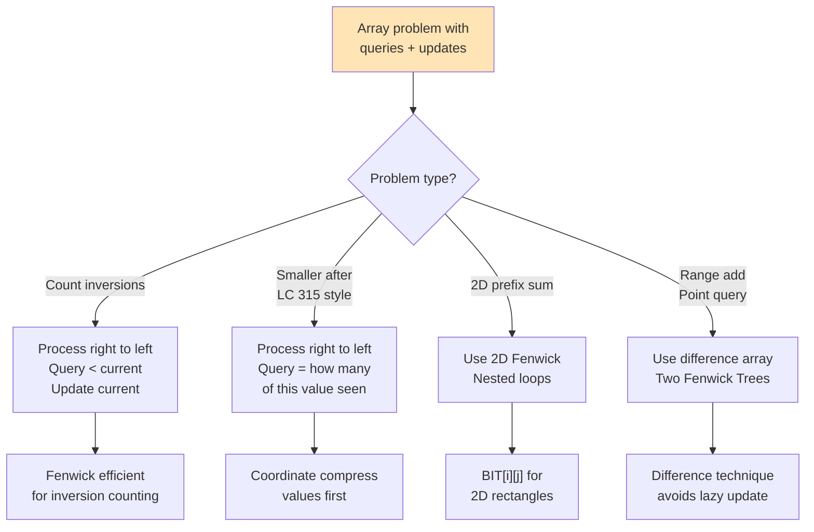

# Fenwick Tree / Binary Indexed Tree (BIT)

## Overview

A **Fenwick Tree** (also called a Binary Indexed Tree or BIT), invented by Peter Fenwick in 1994, is a data structure that supports prefix sum queries and point updates in O(log n) time using O(n) space. It is simpler and more cache-friendly than a segment tree for prefix sum problems.

**When to use:**
- Prefix sum queries with point updates
- Counting inversions
- Frequency tables with range sum queries
- 2D prefix sums
- When you need O(log n) both for update and prefix query, and the operation is invertible (subtraction exists, e.g., sum — not min/max without modification)

---

## Flowcharts

### When to Use Fenwick Tree vs Segment Tree



### Fenwick Tree Query vs Update Path



### Fenwick Tree Problem Pattern Recognition



---

## Visualization

### Structure and Responsibility Ranges

```
Original array (1-indexed): [1, 2, 3, 4, 5, 6, 7, 8]
Index:                        1  2  3  4  5  6  7  8

BIT array:
Index  1  2  3  4  5  6  7  8
BIT  [ 1| 3| 3|10| 5|11| 7|36]

Each BIT[i] stores the sum of a specific range:
  BIT[i] covers i - lowbit(i) + 1  to  i
  where lowbit(i) = i & (-i)  (lowest set bit of i)

Index  Lowbit  Range covered       Value = sum of range
  1      1     [1..1]              1
  2      2     [1..2]              1+2 = 3
  3      1     [3..3]              3
  4      4     [1..4]              1+2+3+4 = 10
  5      1     [5..5]              5
  6      2     [5..6]              5+6 = 11
  7      1     [7..7]              7
  8      8     [1..8]              1+2+3+4+5+6+7+8 = 36

BIT coverage diagram:
  8: ████████████████ (covers 1..8)
  4: ████████         (covers 1..4)
  6: ████             (covers 5..6)
  2: ████             (covers 1..2)
  7: ██               (covers 7..7)
  5: ██               (covers 5..5)
  3: ██               (covers 3..3)
  1: ██               (covers 1..1)
  Index: 1 2 3 4 5 6 7 8
```

### lowbit (Lowest Set Bit) — Core Operation

```
lowbit(i) = i & (-i)

i  binary  -i (two's comp)  i & (-i)  lowbit
1  0001    1111             0001        1
2  0010    1110             0010        2
3  0011    1101             0001        1
4  0100    1100             0100        4
5  0101    1011             0001        1
6  0110    1010             0010        2
7  0111    1001             0001        1
8  1000    0111             1000        8

BIT[i] stores sum of elements in range [i - lowbit(i) + 1, i]
```

### Prefix Sum Query: prefix_sum(6)

```
prefix_sum(6) = arr[1] + arr[2] + ... + arr[6]

Start at index 6:
  Add BIT[6] = 11  (covers [5..6])
  Move: 6 - lowbit(6) = 6 - 2 = 4
  Add BIT[4] = 10  (covers [1..4])
  Move: 4 - lowbit(4) = 4 - 4 = 0 → stop

  Result: 11 + 10 = 21  ✓  (1+2+3+4+5+6 = 21)

Query path visualized:
  6 → 4 → 0 (stop)
  Strip lowest set bit each step: 110 → 100 → 000

prefix_sum(7) = ?
  BIT[7] = 7  (covers [7..7])
  7 - lowbit(7) = 7 - 1 = 6
  BIT[6] = 11  (covers [5..6])
  6 - lowbit(6) = 4
  BIT[4] = 10  (covers [1..4])
  4 - lowbit(4) = 0 → stop
  Result: 7 + 11 + 10 = 28  ✓  (1+2+3+4+5+6+7 = 28)
```

### Point Update: update(3, +5) — add 5 to index 3

```
Start at index 3:
  Update BIT[3] += 5  → BIT[3] = 3+5 = 8
  Move: 3 + lowbit(3) = 3 + 1 = 4
  Update BIT[4] += 5  → BIT[4] = 10+5 = 15
  Move: 4 + lowbit(4) = 4 + 4 = 8
  Update BIT[8] += 5  → BIT[8] = 36+5 = 41
  Move: 8 + lowbit(8) = 8 + 8 = 16 > n=8 → stop

Update path: 3 → 4 → 8 → (stop)
Add lowbit at each step: 011 → 100 → 1000

BIT after update:
Index  1  2  3  4  5  6  7  8
BIT  [ 1| 3| 8|15| 5|11| 7|41]
          ↑  ↑           ↑
       changed nodes (all ancestors of index 3)
```

### Range Query: range_sum(3, 6)

```
range_sum(l, r) = prefix_sum(r) - prefix_sum(l-1)

range_sum(3, 6) = prefix_sum(6) - prefix_sum(2)
  prefix_sum(6) = BIT[6] + BIT[4] = 11 + 10 = 21
  prefix_sum(2) = BIT[2] = 3
  result = 21 - 3 = 18  ✓  (3+4+5+6 = 18)
```

### 2D Fenwick Tree Structure

```
For a 2D array, BIT is built over a 2D matrix.
Each BIT[i][j] covers a 2D rectangle.

Query prefix sum (1,1) to (r,c):
  for i = r; i > 0; i -= lowbit(i):
    for j = c; j > 0; j -= lowbit(j):
      sum += BIT[i][j]
```

---

## Operations & Complexity

| Operation         | Time     | Space  | Notes                                   |
|-------------------|:--------:|:------:|-----------------------------------------|
| Build             | O(n log n) OR O(n) | O(n) | O(n) method: direct construction  |
| Point Update      | O(log n) | O(1)   | Traverse ancestors                      |
| Prefix Sum Query  | O(log n) | O(1)   | Traverse toward root                    |
| Range Sum Query   | O(log n) | O(1)   | prefix(r) - prefix(l-1)                 |
| Point Query       | O(log n) | O(1)   | point(i) = prefix(i) - prefix(i-1)      |
| Space             | —        | O(n)   | 1D array                                |

> BIT uses ~half the space of a segment tree and has better cache locality. But it only supports "invertible" aggregate functions (sum, XOR, etc.) not min/max without workarounds.

---

## Key Properties / Invariants

1. **1-indexed**: BIT is 1-indexed. Index 0 is unused (it's a sentinel).
2. **BIT[i] covers [i - lowbit(i) + 1, i]**: The range each cell is responsible for.
3. **lowbit(i) = i & (-i)**: The lowest set bit isolates the responsibility range.
4. **Query traversal**: Subtract lowbit to move toward index 0.
5. **Update traversal**: Add lowbit to move toward index n (propagate to all covering nodes).
6. **Query + Update paths are complementary**: Together they cover all bits 1 to log n.

---

## Common Interview Patterns

### Pattern 1: Count of Smaller Numbers After Self
Build a BIT over value coordinates. Process right to left; query prefix sum of values less than current.

```
For each number (right to left):
  count[i] = query(num - 1)   # how many smaller values already inserted
  update(num, 1)               # mark this value as seen
```

### Pattern 2: Inversions Count
Two elements (i, j) with i < j and arr[i] > arr[j] form an inversion.
Process left to right: for each element, count how many previously-seen elements are greater.

```
inversions = 0
for num in arr:
    inversions += (inserted_count - query(num))   # elements > num
    update(num, 1)
```

### Pattern 3: Range Sum with Lazy-Style Range Updates (BIT Difference Array)
Use two BITs to support range add + range sum queries.

```
# Range add [l, r] += val:
  update(BIT1, l, val)
  update(BIT1, r+1, -val)
  update(BIT2, l, val * (l-1))
  update(BIT2, r+1, -val * r)

# Prefix sum query [1..x]:
  query(BIT1, x) * x - query(BIT2, x)
```

### Pattern 4: 2D BIT for Rectangle Sum Queries
Extend BIT to 2D for matrix prefix sums with updates.

### Pattern 5: Order Statistics (k-th smallest)
Binary search on BIT to find the k-th set bit — O(log²n) or O(log n) with binary lifting.

---

## Interview Tips

- **Always use 1-indexing**: BIT breaks with 0-indexed arrays.
- **BIT vs Segment Tree**: BIT is simpler and faster in practice for prefix sums, but can't do range updates natively without the two-BIT trick, and can't do min/max.
- **The lowbit trick is the key**: `i & (-i)` gives the lowest set bit. Understand WHY query subtracts it (moving left/up) and update adds it (moving right/up to parents).
- **Building in O(n)**: Rather than n updates, use `BIT[i] += arr[i]; if i + lowbit(i) <= n: BIT[i + lowbit(i)] += BIT[i]`.
- **Coordinate compression**: If values are large (e.g., up to 10^9), compress them to ranks 1..n first.
- **Off-by-one**: range_sum(l, r) = query(r) - query(l-1). Don't forget the l-1.

---

## Example Problems

| Problem                                           | Pattern                          |
|---------------------------------------------------|----------------------------------|
| Range Sum Query - Mutable (LC 307)                | BIT with point update            |
| Count of Smaller Numbers After Self (LC 315)      | BIT + coordinate compression     |
| Reverse Pairs (LC 493)                            | BIT inversion counting           |
| Create Sorted Array through Instructions (LC 1649)| BIT prefix sum                   |
| Number of Longest Increasing Subsequences (LC 673)| BIT on DP optimization           |

---

## Python Quick Reference

```python
# ── 1D Fenwick Tree ───────────────────────────────────────────────────────────
class FenwickTree:
    def __init__(self, n):
        self.n = n
        self.bit = [0] * (n + 1)  # 1-indexed

    # ── Point update: add val to index i (1-indexed) ──────────────────────────
    def update(self, i, val):
        while i <= self.n:
            self.bit[i] += val
            i += i & (-i)          # move to next responsible ancestor

    # ── Prefix sum [1..i] ─────────────────────────────────────────────────────
    def query(self, i):
        total = 0
        while i > 0:
            total += self.bit[i]
            i -= i & (-i)          # strip lowest set bit
        return total

    # ── Range sum [l..r] ──────────────────────────────────────────────────────
    def range_query(self, l, r):
        return self.query(r) - self.query(l - 1)

    # ── Build in O(n) from array ───────────────────────────────────────────────
    def build(self, arr):
        # arr is 0-indexed; we map to 1-indexed BIT
        for i, val in enumerate(arr, 1):
            self.bit[i] += val
            j = i + (i & -i)
            if j <= self.n:
                self.bit[j] += self.bit[i]

    # ── Point query: value at index i ─────────────────────────────────────────
    def point_query(self, i):
        return self.range_query(i, i)

# Usage:
ft = FenwickTree(8)
for i, v in enumerate([1, 2, 3, 4, 5, 6, 7, 8], 1):
    ft.update(i, v)

print(ft.query(6))         # prefix sum [1..6] → 21
print(ft.range_query(3, 6))# range sum [3..6]  → 18
ft.update(3, 5)            # add 5 to index 3
print(ft.query(6))         # → 26

# ── Count inversions using BIT ────────────────────────────────────────────────
def count_inversions(arr):
    # Coordinate compress
    sorted_unique = sorted(set(arr))
    rank = {v: i + 1 for i, v in enumerate(sorted_unique)}
    n = len(arr)
    ft = FenwickTree(len(sorted_unique))
    inversions = 0
    for i in range(n - 1, -1, -1):
        r = rank[arr[i]]
        inversions += ft.query(r - 1)   # count smaller elements to the right
        ft.update(r, 1)
    return inversions

# ── Count of Smaller Numbers After Self (LC 315) ──────────────────────────────
def count_smaller(nums):
    sorted_unique = sorted(set(nums))
    rank = {v: i + 1 for i, v in enumerate(sorted_unique)}
    ft = FenwickTree(len(sorted_unique))
    result = []
    for num in reversed(nums):
        r = rank[num]
        result.append(ft.query(r - 1))
        ft.update(r, 1)
    return result[::-1]

# ── 2D Fenwick Tree ───────────────────────────────────────────────────────────
class FenwickTree2D:
    def __init__(self, rows, cols):
        self.rows = rows
        self.cols = cols
        self.bit = [[0] * (cols + 1) for _ in range(rows + 1)]

    def update(self, r, c, val):
        i = r
        while i <= self.rows:
            j = c
            while j <= self.cols:
                self.bit[i][j] += val
                j += j & (-j)
            i += i & (-i)

    def query(self, r, c):
        total = 0
        i = r
        while i > 0:
            j = c
            while j > 0:
                total += self.bit[i][j]
                j -= j & (-j)
            i -= i & (-i)
        return total

    def range_query(self, r1, c1, r2, c2):
        return (self.query(r2, c2) - self.query(r1 - 1, c2)
              - self.query(r2, c1 - 1) + self.query(r1 - 1, c1 - 1))
```

---

## Java Quick Reference

```java
class FenwickTree {
    private int[] bit;
    private int n;

    FenwickTree(int n) {
        this.n = n;
        this.bit = new int[n + 1];
    }

    // Point update: add val to index i (1-indexed)
    public void update(int i, int val) {
        for (; i <= n; i += i & (-i))
            bit[i] += val;
    }

    // Prefix sum [1..i]
    public int query(int i) {
        int sum = 0;
        for (; i > 0; i -= i & (-i))
            sum += bit[i];
        return sum;
    }

    // Range sum [l..r]
    public int rangeQuery(int l, int r) {
        return query(r) - query(l - 1);
    }

    // Build from array in O(n)
    public void build(int[] arr) {
        for (int i = 0; i < arr.length; i++) {
            int idx = i + 1;
            bit[idx] += arr[i];
            int j = idx + (idx & -idx);
            if (j <= n) bit[j] += bit[idx];
        }
    }
}

// Usage:
FenwickTree ft = new FenwickTree(8);
int[] arr = {1, 2, 3, 4, 5, 6, 7, 8};
for (int i = 0; i < arr.length; i++)
    ft.update(i + 1, arr[i]);

System.out.println(ft.query(6));           // 21
System.out.println(ft.rangeQuery(3, 6));   // 18
ft.update(3, 5);                           // arr[3] += 5
System.out.println(ft.query(6));           // 26
```
