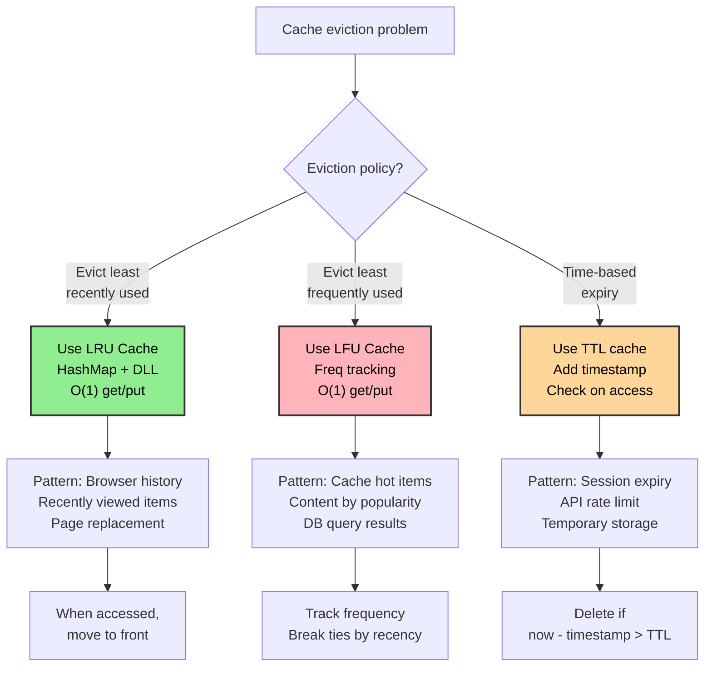
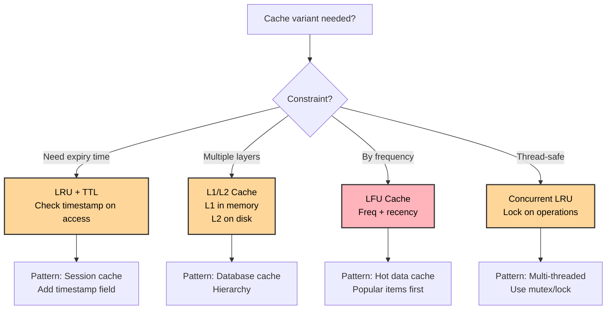

# LRU Cache (Least Recently Used Cache)

## Overview

An **LRU Cache** evicts the least recently used entry when the cache reaches its capacity. It combines a **hash map** (for O(1) key lookup) with a **doubly linked list** (for O(1) insertion, deletion, and ordering of access recency). Together they give O(1) for both `get` and `put`.

**When to use:**
- Page replacement in operating systems
- Browser history / tab caching
- Database query result caching
- CDN and DNS caching
- Any scenario where you want to keep the most recently accessed items

---

## Flowcharts

### LRU vs LFU: When to Use Each



### LRU get() and put() Decision Tree

```mermaid
graph TD
    A["LRU operation"] --> B{"get() or put()?"}
    
    B -->|get(key)| C{"Key in cache?"}
    C -->|No| D["Return -1"]
    C -->|Yes| E["Get value from node"]
    E --> F["Move node to MRU<br/>right after HEAD"]
    F --> G["Return value"]
    
    B -->|put(key,val)| H{"Key exists?"}
    H -->|Yes| I["Update value"]
    I --> J["Move node to MRU"]
    J --> K["Return"]
    
    H -->|No| L{"Cache full?<br/>size == capacity"}
    L -->|No| M["Create new node"]
    L -->|Yes| N["Evict LRU<br/>node before TAIL"]
    N --> O["Delete from HashMap"]
    O --> M
    M --> P["Insert at MRU<br/>right after HEAD"]
    P --> Q["Add to HashMap"]
    Q --> R["Return"]
    
    style D fill:#ffb3ba,color:#000,stroke:#333,stroke-width:2px
    style G fill:#90ee90,color:#000,stroke:#333,stroke-width:2px
    style K fill:#90ee90,color:#000,stroke:#333,stroke-width:2px
    style R fill:#90ee90,color:#000,stroke:#333,stroke-width:2px
```

### LRU Variant Patterns



---

## Visualization

### Structure: HashMap + Doubly Linked List

```
capacity = 3, current cache: {1:A, 2:B, 3:C}

  HashMap:               Doubly Linked List (MRU → LRU):
  {                      HEAD ↔ [3:C] ↔ [2:B] ↔ [1:A] ↔ TAIL
    1 → Node(1,A),         ↑                               ↑
    2 → Node(2,B),        MRU                             LRU
    3 → Node(3,C)
  }

  Sentinel nodes HEAD and TAIL simplify insert/delete edge cases.
  MRU (Most Recently Used) = just after HEAD
  LRU (Least Recently Used) = just before TAIL
  On eviction: remove node just before TAIL
```

### Operation: get(2) — key 2 exists

```
Before:
  HEAD ↔ [3:C] ↔ [2:B] ↔ [1:A] ↔ TAIL

Step 1: Found key 2 in HashMap → value = B
Step 2: Remove node [2:B] from current position
Step 3: Insert [2:B] at MRU position (right after HEAD)

After get(2):
  HEAD ↔ [2:B] ↔ [3:C] ↔ [1:A] ↔ TAIL
           ↑
          MRU (just accessed)
```

### Operation: put(4, D) — new key, cache is full

```
Before: (capacity=3, full)
  HEAD ↔ [2:B] ↔ [3:C] ↔ [1:A] ↔ TAIL

Step 1: Key 4 not in HashMap
Step 2: Cache is full → evict LRU (node just before TAIL = [1:A])
        Remove [1:A] from list and delete from HashMap
Step 3: Create new node [4:D]
Step 4: Insert [4:D] at MRU position (right after HEAD)
Step 5: Add key 4 → Node(4,D) to HashMap

After put(4, D):
  HEAD ↔ [4:D] ↔ [2:B] ↔ [3:C] ↔ TAIL
           ↑                       ↑
          MRU                     LRU = [3:C]

HashMap: {2:B_node, 3:C_node, 4:D_node}  (1 removed)
```

### Operation: put(3, X) — update existing key

```
Before:
  HEAD ↔ [4:D] ↔ [2:B] ↔ [3:C] ↔ TAIL

Step 1: Key 3 exists in HashMap
Step 2: Update value of node [3:C] → [3:X]
Step 3: Move [3:X] to MRU position

After put(3, X):
  HEAD ↔ [3:X] ↔ [4:D] ↔ [2:B] ↔ TAIL
```

### Node Operations (Doubly Linked List)

```
Remove a node:
  prev ↔ [node] ↔ next   →   prev ↔ next
  node.prev.next = node.next
  node.next.prev = node.prev

Insert after HEAD:
  HEAD ↔ [first] ↔ ...   →   HEAD ↔ [node] ↔ [first] ↔ ...
  node.next = HEAD.next
  node.prev = HEAD
  HEAD.next.prev = node
  HEAD.next = node

Move to MRU = remove + insert after HEAD
```

### Full Trace: capacity=2, operations: put(1,1), put(2,2), get(1), put(3,3), get(2)

```
put(1,1): HEAD ↔ [1:1] ↔ TAIL

put(2,2): HEAD ↔ [2:2] ↔ [1:1] ↔ TAIL

get(1):   Move 1 to MRU
          HEAD ↔ [1:1] ↔ [2:2] ↔ TAIL
          → returns 1

put(3,3): Full, evict LRU = 2
          Remove [2:2], insert [3:3] at MRU
          HEAD ↔ [3:3] ↔ [1:1] ↔ TAIL
          HashMap: {1:node1, 3:node3}

get(2):   Key 2 not found
          → returns -1
```

---

## Operations & Complexity

| Operation  | Time  | Space  | Notes                                      |
|------------|:-----:|:------:|---------------------------------------------|
| get(key)   | O(1)  | O(1)   | HashMap lookup + node move to front         |
| put(key, val) | O(1) | O(1) | HashMap update/insert + list reorder/evict |
| Space      | —     | O(capacity) | HashMap + doubly linked list           |

---

## Key Properties / Invariants

1. **Two data structures**: HashMap for O(1) key lookup; DLL for O(1) ordering maintenance.
2. **Sentinel HEAD/TAIL**: Dummy nodes eliminate null checks for insert/delete at boundaries.
3. **MRU = just after HEAD**: Most recently used node is always inserted here.
4. **LRU = just before TAIL**: When evicting, always remove the node just before TAIL.
5. **HashMap stores node references**: Not values — it stores pointers to DLL nodes for direct O(1) removal.
6. **Every get moves the node to MRU**: Access = recency update.

---

## Common Interview Patterns

### Pattern 1: LRU Cache (Classic)
The core problem — implement get and put in O(1).

### Pattern 2: LFU Cache (Least Frequently Used)
Harder variant — evict by frequency, not recency. Uses a HashMap of frequency → DLL + a HashMap of key → (value, freq).

### Pattern 3: LRU with Expiry (TTL)
Add a timestamp to each node; consider a node expired if `now - timestamp > TTL`.

### Pattern 4: Thread-Safe LRU
Wrap operations in a lock (mutex). Or use a concurrent LRU with fine-grained locking.

### Pattern 5: Two-Tier Cache (L1/L2)
Combine an in-memory LRU (L1) with a disk-backed LRU (L2). On L1 miss, check L2.

---

## Interview Tips

- **The key insight**: You need BOTH a hash map AND a doubly linked list. A hash map alone can't evict in O(1); a list alone can't look up in O(1).
- **Why doubly linked?**: You need to remove a node given only a pointer to it (no traversal). Doubly linked allows O(1) removal.
- **Sentinel nodes**: Using dummy HEAD and TAIL nodes eliminates boundary conditions (empty list, insert at front, remove at back). Always use them.
- **Python has `OrderedDict`**: `collections.OrderedDict` maintains insertion order and has `move_to_end()` — you can implement LRU in ~10 lines. Interviewers usually ask you to implement from scratch anyway.
- **Java has `LinkedHashMap`**: Has `removeEldestEntry()` hook for LRU. Same caveat as above.
- **Don't forget to update the map**: When evicting, also delete the key from the HashMap.

---

## Example Problems

| Problem                                  | Pattern                          |
|------------------------------------------|----------------------------------|
| LRU Cache (LC 146)                       | Classic HashMap + DLL            |
| LFU Cache (LC 460)                       | Frequency-based eviction         |
| Design In-Memory File System (LC 588)    | Cache + hierarchical structure   |
| All O'one Data Structure (LC 432)        | Min/max with constant-time ops   |
| Design Twitter (LC 355)                  | Feed caching with recency        |

---

## Python Quick Reference

```python
# ── LRU Cache: HashMap + Doubly Linked List ───────────────────────────────────

class DLinkedNode:
    def __init__(self, key=0, val=0):
        self.key  = key
        self.val  = val
        self.prev = None
        self.next = None

class LRUCache:
    def __init__(self, capacity: int):
        self.cap   = capacity
        self.cache = {}            # key → DLinkedNode

        # Sentinel nodes — simplify boundary cases
        self.head = DLinkedNode()  # dummy HEAD (MRU side)
        self.tail = DLinkedNode()  # dummy TAIL (LRU side)
        self.head.next = self.tail
        self.tail.prev = self.head

    def _remove(self, node: DLinkedNode):
        """Remove node from its current position in the list."""
        node.prev.next = node.next
        node.next.prev = node.prev

    def _insert_after_head(self, node: DLinkedNode):
        """Insert node right after HEAD (MRU position)."""
        node.next       = self.head.next
        node.prev       = self.head
        self.head.next.prev = node
        self.head.next      = node

    def get(self, key: int) -> int:
        if key not in self.cache:
            return -1
        node = self.cache[key]
        self._remove(node)
        self._insert_after_head(node)
        return node.val

    def put(self, key: int, value: int) -> None:
        if key in self.cache:
            node = self.cache[key]
            node.val = value
            self._remove(node)
            self._insert_after_head(node)
        else:
            if len(self.cache) == self.cap:
                # Evict LRU: node just before tail
                lru = self.tail.prev
                self._remove(lru)
                del self.cache[lru.key]
            node = DLinkedNode(key, value)
            self.cache[key] = node
            self._insert_after_head(node)

# ── LRU Cache using OrderedDict (concise, for reference) ─────────────────────
from collections import OrderedDict

class LRUCacheOD:
    def __init__(self, capacity: int):
        self.cap   = capacity
        self.cache = OrderedDict()

    def get(self, key: int) -> int:
        if key not in self.cache:
            return -1
        self.cache.move_to_end(key)   # mark as recently used
        return self.cache[key]

    def put(self, key: int, value: int) -> None:
        if key in self.cache:
            self.cache.move_to_end(key)
        self.cache[key] = value
        if len(self.cache) > self.cap:
            self.cache.popitem(last=False)  # remove LRU (first item)

# ── LFU Cache ─────────────────────────────────────────────────────────────────
from collections import defaultdict

class LFUCache:
    def __init__(self, capacity: int):
        self.cap     = capacity
        self.min_freq = 0
        self.key_to_val  = {}      # key → value
        self.key_to_freq = {}      # key → frequency
        self.freq_to_keys = defaultdict(OrderedDict)  # freq → {key: None} (ordered)

    def _update_freq(self, key):
        freq = self.key_to_freq[key]
        self.key_to_freq[key] = freq + 1
        del self.freq_to_keys[freq][key]
        if not self.freq_to_keys[freq]:
            del self.freq_to_keys[freq]
            if self.min_freq == freq:
                self.min_freq += 1
        self.freq_to_keys[freq + 1][key] = None

    def get(self, key: int) -> int:
        if key not in self.key_to_val:
            return -1
        self._update_freq(key)
        return self.key_to_val[key]

    def put(self, key: int, value: int) -> None:
        if self.cap <= 0: return
        if key in self.key_to_val:
            self.key_to_val[key] = value
            self._update_freq(key)
        else:
            if len(self.key_to_val) == self.cap:
                # Evict LFU (and among ties, LRU)
                evict_key, _ = self.freq_to_keys[self.min_freq].popitem(last=False)
                if not self.freq_to_keys[self.min_freq]:
                    del self.freq_to_keys[self.min_freq]
                del self.key_to_val[evict_key]
                del self.key_to_freq[evict_key]
            self.key_to_val[key]  = value
            self.key_to_freq[key] = 1
            self.freq_to_keys[1][key] = None
            self.min_freq = 1
```

---

## Java Quick Reference

```java
import java.util.HashMap;

class LRUCache {
    // ── Doubly linked list node ───────────────────────────────────────────────
    private static class Node {
        int key, val;
        Node prev, next;
        Node(int key, int val) { this.key = key; this.val = val; }
    }

    private final int capacity;
    private final HashMap<Integer, Node> cache = new HashMap<>();
    private final Node head = new Node(0, 0);  // dummy HEAD
    private final Node tail = new Node(0, 0);  // dummy TAIL

    LRUCache(int capacity) {
        this.capacity = capacity;
        head.next = tail;
        tail.prev = head;
    }

    // ── Remove node from list ─────────────────────────────────────────────────
    private void remove(Node node) {
        node.prev.next = node.next;
        node.next.prev = node.prev;
    }

    // ── Insert right after HEAD ───────────────────────────────────────────────
    private void insertAfterHead(Node node) {
        node.next       = head.next;
        node.prev       = head;
        head.next.prev  = node;
        head.next       = node;
    }

    public int get(int key) {
        if (!cache.containsKey(key)) return -1;
        Node node = cache.get(key);
        remove(node);
        insertAfterHead(node);
        return node.val;
    }

    public void put(int key, int value) {
        if (cache.containsKey(key)) {
            Node node = cache.get(key);
            node.val = value;
            remove(node);
            insertAfterHead(node);
        } else {
            if (cache.size() == capacity) {
                Node lru = tail.prev;
                remove(lru);
                cache.remove(lru.key);
            }
            Node node = new Node(key, value);
            cache.put(key, node);
            insertAfterHead(node);
        }
    }
}

// ── LRU using LinkedHashMap (built-in, concise) ───────────────────────────────
import java.util.LinkedHashMap;
import java.util.Map;

class LRUCacheLinkedHashMap extends LinkedHashMap<Integer, Integer> {
    private final int capacity;

    LRUCacheLinkedHashMap(int capacity) {
        super(capacity, 0.75f, true);  // accessOrder = true → LRU order
        this.capacity = capacity;
    }

    public int get(int key) {
        return super.getOrDefault(key, -1);
    }

    public void put(int key, int value) {
        super.put(key, value);
    }

    @Override
    protected boolean removeEldestEntry(Map.Entry<Integer, Integer> eldest) {
        return size() > capacity;  // auto-evict when over capacity
    }
}
```
