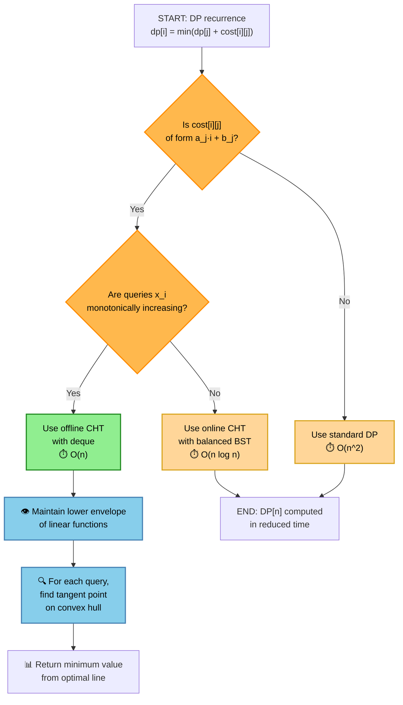
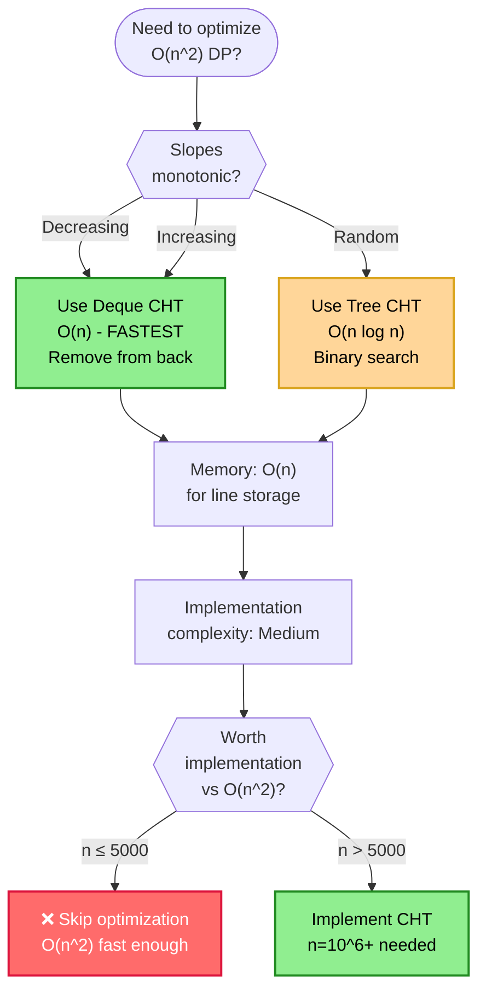
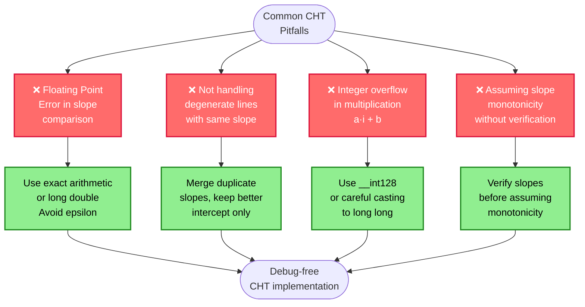
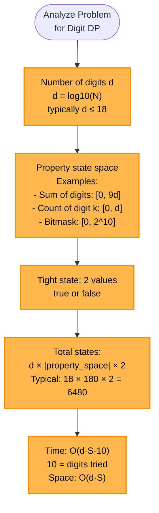
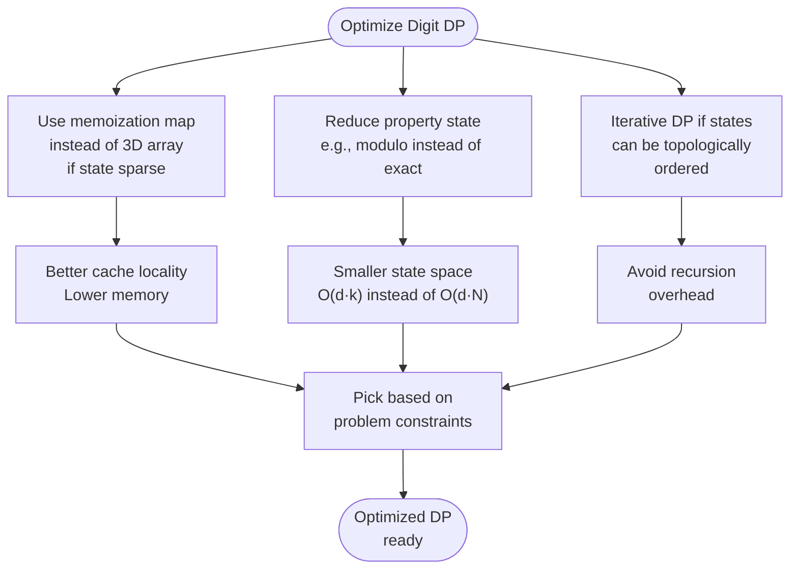
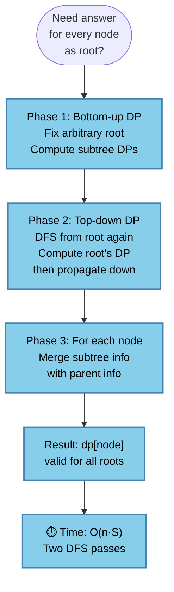
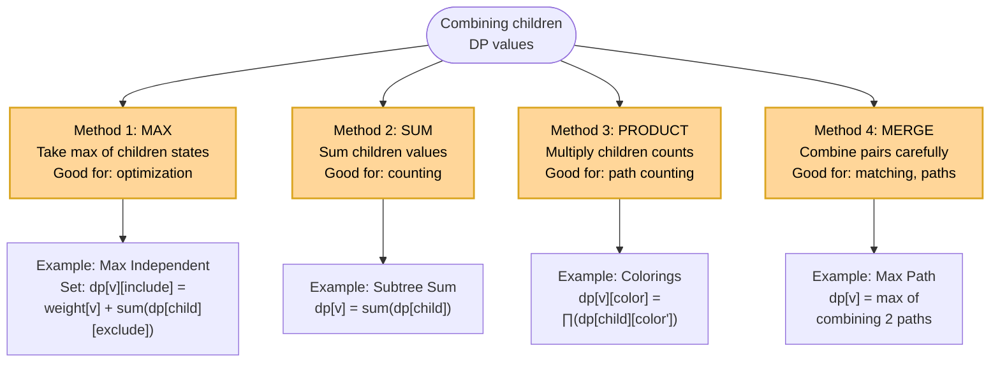
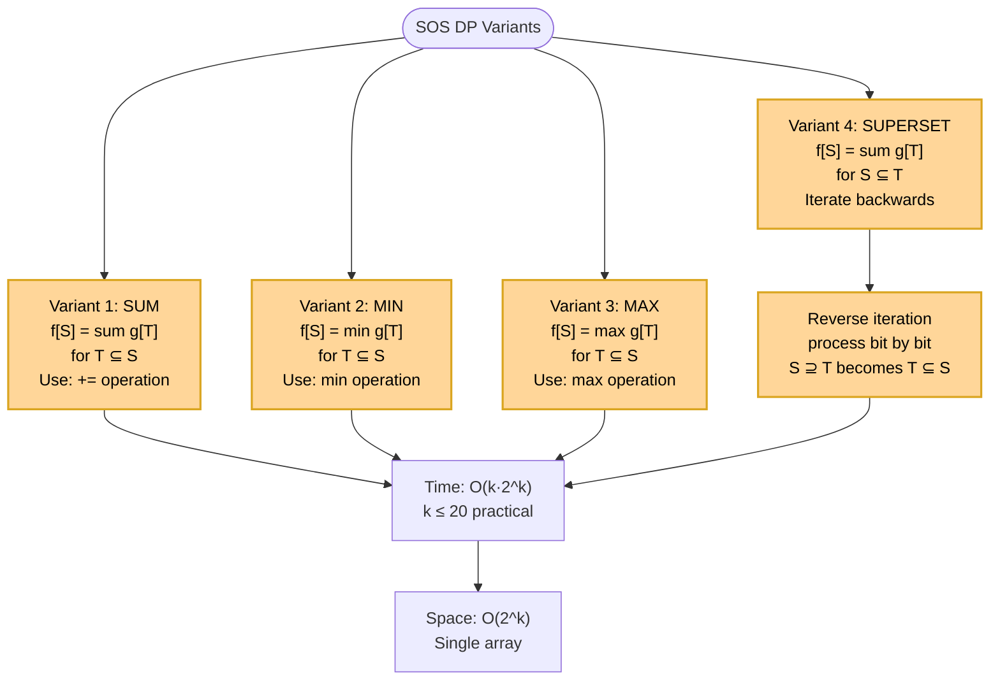
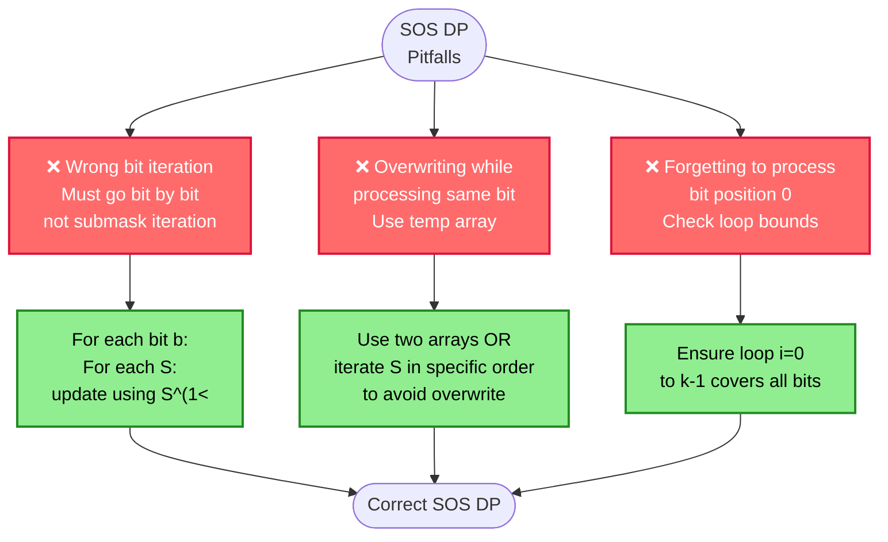
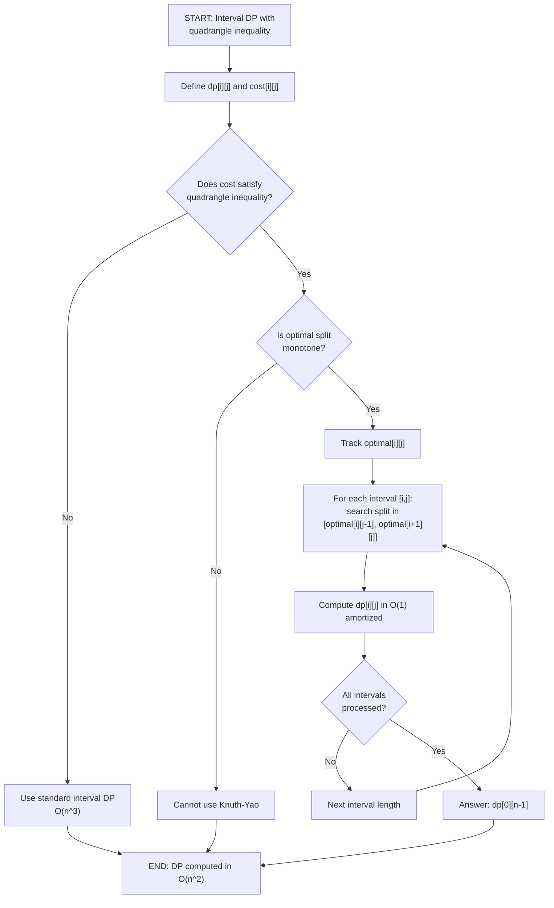

# Advanced Algorithms

A comprehensive guide to 26+ advanced algorithms covering dynamic programming optimization, graph algorithms, string matching, computational geometry, and advanced data structures. Each algorithm includes solution flowcharts, complexity analysis, use cases, and interview Q&A.

---

## Overview

Advanced algorithms build on foundational patterns and are critical for senior-level FAANG interviews. This guide organizes them by problem type and provides decision trees to help you recognize which tool to use for a given problem. The five main categories are:

1. **DP Optimization** — Advanced memoization & state compression techniques
2. **Graph Algorithms** — Flow networks, matching, 2-SAT, connectivity
3. **String Algorithms** — Pattern matching, indexing, palindromes
4. **Computational Geometry** — Convex hulls, point queries, intersections
5. **Data Structure Algorithms** — Heavy decomposition, square-root tricks, offline queries

---

## Master Algorithm Selection Flowchart

This comprehensive decision tree guides you to the right algorithm based on problem characteristics, constraints, and optimization needs.

```mermaid
flowchart TD
    Start(["START: Algorithm Selection<br/>Identify Problem Type"]) --> IsDP{{"Is this a<br/>DP Problem?"}}
    
    IsDP -->|Yes| DPType{{"What type of<br/>DP State?"}}
    IsDP -->|No| IsGraph{{"Is this a<br/>Graph Problem?"}}
    
    %% DP Branch
    DPType -->|Linear Recurrence<br/>Can we optimize?| IsMonotonic{{"Are DP queries<br/>monotonic?"}}
    IsMonotonic -->|Yes| CHT["Convex Hull Trick<br/>O(n) offline"]
    IsMonotonic -->|No| LiChao["Li-Chao Tree<br/>O(n log n) online"]
    
    DPType -->|Need Digit Constraints| DigitDP["Digit DP<br/>O(d·S) where d=digits<br/>S=state space"]
    
    DPType -->|Tree Structure| TreeDP["Tree DP<br/>O(V) or O(V^2)<br/>for tree decomposition"]
    
    DPType -->|Bitmask/Subset| SosDP{{"Is subset<br/>enumeration needed?"}}
    SosDP -->|Yes - Sum Over Subsets| SosDp["SOS DP<br/>O(k·2^k) k≤20"]
    SosDP -->|No - Standard Bitmask| BitmaskDP["Standard DP<br/>O(2^k·poly)<br/>k≤15-20"]
    
    DPType -->|Interval DP| IntervalOpt{{"Optimal<br/>substructure<br/>monotonic?"}}
    IntervalOpt -->|Yes, Quadrangle| KnuthYao["Knuth-Yao<br/>Optimization<br/>O(n^2)"]
    IntervalOpt -->|Yes, Convex| DivideConq["Divide & Conquer DP<br/>O(n log n)"]
    IntervalOpt -->|No| StandardInt["Standard Interval DP<br/>O(n^3)"]
    
    %% Graph Branch
    IsGraph -->|Yes| GraphType{{"What graph<br/>problem?"}}
    
    GraphType -->|Flow Network| FlowType{{"Need<br/>minimum<br/>cost?"}}
    FlowType -->|Yes| MinCostFlow["Min Cost Max Flow<br/>Successive Shortest<br/>O(flow·E·log V)"]
    FlowType -->|No| MaxFlowAlgo{{"Graph<br/>density<br/>and size?"}}
    MaxFlowAlgo -->|Dense or V small| Dinic["Dinic's Algorithm<br/>O(V^2E)"]
    MaxFlowAlgo -->|Sparse| PushRelabel["Push-Relabel<br/>O(V^3) or O(V^2·sqrt(E))<br/>variants"]
    
    GraphType -->|Bipartite Matching| MatchSize{{"Size of<br/>bipartite<br/>set?"}}
    MatchSize -->|V ≤ 500| Hungarian["Hungarian Algorithm<br/>O(V^3)"]
    MatchSize -->|V > 500, Dense| HopcroftKarp["Hopcroft-Karp<br/>O(E·sqrt(V))"]
    MatchSize -->|V > 500, Sparse| AugmentPath["Augmenting Paths<br/>O(V·E)"]
    
    GraphType -->|2-SAT Problem| TwoSAT["2-SAT with SCC<br/>Build implication graph<br/>Find SCCs<br/>O(V+E)"]
    
    GraphType -->|Connectivity<br/>SCC/BCC| ConnType{{"Need<br/>components<br/>or bridges?"}}
    ConnType -->|SCCs| Tarjan["Tarjan's SCC<br/>O(V+E) one-pass"]
    ConnType -->|Bridges/BCCs| Bridges["Bridge/BCC Finding<br/>DFS-based O(V+E)"]
    ConnType -->|General Connect| DSU["Union-Find<br/>O(α(V))"]
    
    GraphType -->|Shortest Path| PathType{{"Negative<br/>edges<br/>present?"}}
    PathType -->|No| SingleSource{{"Single or<br/>all-pairs<br/>shortest?"}}
    SingleSource -->|Single| Dijkstra["Dijkstra<br/>O(E+V log V)<br/>with Fibonacci heap"]
    SingleSource -->|All-pairs| Johnson["Johnson's Algorithm<br/>O(VE log V)<br/>reweight + Dijkstra×V"]
    PathType -->|Yes| NegWeight{{"All-pairs<br/>needed?"}}
    NegWeight -->|Yes| FloydWar["Floyd-Warshall<br/>O(V^3) dense"]
    NegWeight -->|No| BellmanF["Bellman-Ford<br/>O(VE)<br/>detect neg cycles"]
    
    GraphType -->|Articulation<br/>Points| ArticPt["Articulation Points<br/>& Bridges<br/>Tarjan/DFS O(V+E)"]
    
    GraphType -->|Transitive Closure| TransClose["Transitive Closure<br/>Floyd-Warshall<br/>or bitwise O(V^3/w)"]
    
    %% String Branch
    IsGraph -->|No| IsString{{"Is this a<br/>String Problem?"}}
    
    IsString -->|Yes| StringType{{"What string<br/>problem?"}}
    
    StringType -->|Single Pattern Match| PatternSize{{"Pattern<br/>length<br/>vs text?"}}
    PatternSize -->|Short pattern| KMP["KMP<br/>O(n+m)<br/>simple & robust"]
    PatternSize -->|Long pattern| BoyerMoore["Boyer-Moore<br/>O(n/m) avg case<br/>O(nm) worst"]
    PatternSize -->|Any - Optimal| ZAlgo["Z-Algorithm<br/>O(n+m)<br/>or KMP variant"]
    
    StringType -->|Multiple Patterns| MultiPat{{"Number of<br/>patterns?"}}
    MultiPat -->|Few patterns| AhoC["Aho-Corasick<br/>O(n+m+z)<br/>z=matches"]
    MultiPat -->|Many patterns| SuffixStruct{{"Index query<br/>type?"}}
    
    StringType -->|Indexing/Query| SuffixStruct
    SuffixStruct -->|Fast queries, offline| SuffixArr["Suffix Array<br/>O(n log n) build<br/>O(log n) query"]
    SuffixStruct -->|LCP queries needed| SuffixTree["Suffix Tree<br/>O(n) build<br/>O(k) for k-length queries"]
    
    StringType -->|Palindromes| PalindType{{"All palindromes<br/>or just check?"}}
    PalindType -->|Check only| Manacher["Manacher's Algorithm<br/>O(n) single pass"]
    PalindType -->|Find all/longest| ManacherDP["Manacher or DP<br/>O(n) vs O(n^2)"]
    
    %% Geometry Branch
    IsString -->|No| IsGeom{{"Is this a<br/>Geometry Problem?"}}
    
    IsGeom -->|Yes| GeomType{{"What geometry<br/>problem?"}}
    
    GeomType -->|Convex Hull| HullPoints{{"Number of<br/>points?"}}
    HullPoints -->|Small n ≤ 1000| GrahamScan["Graham Scan<br/>O(n log n) general"]
    HullPoints -->|Any n| Andrews["Andrew's Monotone Chain<br/>O(n log n) robust"]
    HullPoints -->|Already sorted| DivideConqPts["Divide & Conquer<br/>O(n log n) elegant"]
    
    GeomType -->|Closest Pair| ClosestSize{{"Points<br/>distribution?"}}
    ClosestSize -->|Random/Sorted| KDTree["KD-Tree<br/>O(n log n) build<br/>O(log n) query"]
    ClosestSize -->|Incremental| LineIntersect["Line Sweep<br/>O(n log n) events"]
    
    GeomType -->|Point Queries| PtInPoly{{"Point in<br/>polygon or<br/>intersection?"}}
    PtInPoly -->|Containment| PtInPoly["Ray Casting<br/>O(n) per query"]
    PtInPoly -->|Intersections| LineIntersect["Bentley-Ottmann<br/>O((n+k) log n)"]
    
    %% Misc Branch
    IsGeom -->|No| IsMisc{{"Miscellaneous<br/>Optimization?"}}
    
    IsMisc -->|Yes| MiscType{{"What type?"}}
    
    MiscType -->|Tree Path Queries| HeavyLight["Heavy-Light Decomposition<br/>O(log^2 V) per query<br/>+ O(log n) segment tree"]
    
    MiscType -->|Offline Range Queries| Mo["Mo's Algorithm<br/>O((n+m)·sqrt(n))<br/>m queries on ranges"]
    
    MiscType -->|Large sqrt(n) range| SqrtDecomp["Square Root<br/>Decomposition<br/>O(sqrt(n)) per query"]
    
    MiscType -->|Selection Problem| QSelect["QuickSelect<br/>O(n) average<br/>O(n^2) worst (rare)"]
    
    MiscType -->|Optimal Encoding| Huffman["Huffman Coding<br/>O(n log n) build<br/>Greedy tree construction"]
    
    MiscType -->|Interval/Activity<br/>Scheduling| Activity["Activity Selection<br/>Greedy<br/>O(n log n) sort"]
    
    IsMisc -->|No| Generic["Check if problem<br/>is solvable with<br/>standard algorithms<br/>or optimization"]
    
    %% Styling
    classDef startEnd fill:#90ee90,color:#000,stroke:#333,stroke-width:2px,stroke:#228B22,stroke-width:3px,color:#000
    classDef decision fill:#FFB84D,stroke:#FF8C00,stroke-width:2px,color:#000
    classDef algorithm fill:#87CEEB,stroke:#4682B4,stroke-width:2px,color:#000
    classDef complexity fill:#ffd699,color:#000,stroke:#333,stroke-width:2px,stroke:#DAA520,stroke-width:2px,color:#000
    classDef warning fill:#FF6B6B,stroke:#DC143C,stroke-width:2px,color:#fff
    
    class Start,End startEnd
    class IsDP,DPType,IsMonotonic,GraphType,FlowType,MaxFlowAlgo,MatchSize,ConnType,PathType,SingleSource,NegWeight,StringType,PatternSize,MultiPat,SuffixStruct,PalindType,GeomType,HullPoints,ClosestSize,MiscType,IsGraph,IsString,IsGeom,IsMisc decision
    class CHT,LiChao,DigitDP,TreeDP,SosDp,BitmaskDP,KnuthYao,DivideConq,StandardInt algorithm
    class Dinic,PushRelabel,MinCostFlow,Hungarian,HopcroftKarp,AugmentPath,TwoSAT algorithm
    class Tarjan,Bridges,DSU,Dijkstra,Johnson,FloydWar,BellmanF,ArticPt,TransClose algorithm
    class KMP,BoyerMoore,ZAlgo,AhoC,SuffixArr,SuffixTree,Manacher,ManacherDP algorithm
    class GrahamScan,Andrews,DivideConqPts,KDTree,LineIntersect,PtInPoly algorithm
    class HeavyLight,Mo,SqrtDecomp,QSelect,Huffman,Activity,Generic algorithm
```

---

# 1. DP Optimization Techniques

## Convex Hull Trick (CHT)

**Description**

Convex Hull Trick optimizes DP recurrences of the form `dp[i] = min(dp[j] + cost[i][j])` where the cost function is a linear combination. It maintains the lower envelope of a set of linear functions and queries the minimum value in O(1) or O(log n) time, avoiding the naive O(n^2) DP.

The idea: represent each possible previous state j as a linear function `f_j(x) = a_j * x + b_j`. For a state i with parameter x_i, we need `min_j(a_j * x_i + b_j)`. The optimal j lies on the lower envelope (convex hull) of these lines.

**Problem Recognition Flowchart**

```mermaid
flowchart TD
    A(["START: Analyzing DP<br/>Recurrence"]) --> B{"Is recurrence<br/>O(n^2) DP with<br/>cost structure?"}}
    B -->|No| C["❌ CHT not applicable<br/>Use standard approach"]
    B -->|Yes| D{"Can cost be split:<br/>a_j·i + b_j<br/>where j,i are separate?"}}
    D -->|No| E["❌ CHT not applicable<br/>Cost structure wrong"]
    D -->|Yes| F{"Are a_j values<br/>monotonic (increasing<br/>or decreasing)?"}}
    F -->|No| G["⚠️ CHT still possible<br/>but harder to use"]
    F -->|Yes| H["CHT APPLICABLE<br/>Proceed with optimization"]
    
    classDef applicable fill:#90ee90,color:#000,stroke:#333,stroke-width:2px,stroke:#228B22,stroke-width:2px,color:#000
    classDef notappl fill:#FF6B6B,stroke:#DC143C,stroke-width:2px,color:#fff
    classDef warning fill:#ffd699,color:#000,stroke:#333,stroke-width:2px,stroke:#DAA520,stroke-width:2px,color:#000
    class H applicable
    class C,E notappl
    class G warning
```

**Solution Approach Flowchart (Execution)**



**Optimization Decision Tree**



**Implementation Challenges**



**Complexity**

- Time: O(n) with monotonic queries (offline), O(n log n) with random queries (online)
- Space: O(n) for storing lines

**When to Use**

- Recurrence of form: `dp[i] = min_j(dp[j] + a_j * i + b_j)` where j < i
- Example: k-th digit DP, optimal tree construction, divide-the-rectangle
- Interview signal: Recognizes DP structure and optimization technique

**Example**

```
Problem: dp[i] = min(dp[j] + (i - j)² + c) for j < i
Rewrite as: dp[i] = min(j² - 2ij + i² + dp[j] + c)
           = i² + min_j(j² + dp[j] - 2j*i)

For each j, line is f_j(i) = (-2j)*i + (j² + dp[j])
Lines: slope a_j = -2j (decreasing), intercept b_j = j² + dp[j]

Since queries x_i = i are in order, use offline CHT with deque:
  - Slopes are monotonically decreasing: -2, -4, -6, ... ✓
  - Process in order, remove dominated lines from back, query from front

dp values computed in O(n) instead of O(n^2)
```

**Interview Q&A**

1. **Q: When should I use CHT instead of standard DP?** A: When you have O(n^2) DP with a specific recurrence structure where cost is separable into j-dependent and i-dependent parts. CHT reduces this to O(n) or O(n log n). Without this structure, CHT doesn't apply.

2. **Q: What's the difference between online and offline CHT?** A: Offline CHT (with deque) runs in O(n) and works only when query parameters are monotonically ordered. Online CHT (with balanced BST or Li-Chao tree) handles random queries in O(n log n) but has higher constant factors.

---

## Digit DP

**Description**

Digit DP is a technique for counting or summing numbers with specific digit properties up to a given limit N. Instead of iterating through all numbers (infeasible for N ≤ 10^18), we build numbers digit-by-digit and use memoization to avoid redundant computation.

State: `dp[pos][sum_state][tight]` where:
- `pos`: current digit position (0-indexed from left)
- `sum_state`: aggregate of properties so far (sum, count, etc.)
- `tight`: whether we're still bounded by the original number N

**Problem Recognition Flowchart**

```mermaid
flowchart TD
    A(["START: Problem Analysis"]) --> Q1{"Need to count/sum<br/>numbers in range<br/>[0, N]?"}}
    Q1 -->|No| NotDig["❌ Digit DP not suitable"]
    Q1 -->|Yes| Q2{"Is property<br/>defined by<br/>digit sequence?"}}
    Q2 -->|No| NotDig2["❌ Use different DP"]
    Q2 -->|Yes| Q3{"Can state be<br/>expressed as:<br/>pos, property, tight?"}}
    Q3 -->|Yes| Apply["DIGIT DP APPLICABLE<br/>O(d·S) complexity<br/>d=digits, S=states"]
    Q3 -->|No| Modify["⚠️ May need custom<br/>state design"]
    
    classDef applicable fill:#90ee90,color:#000,stroke:#333,stroke-width:2px,stroke:#228B22,stroke-width:2px,color:#000
    classDef notappl fill:#FF6B6B,stroke:#DC143C,stroke-width:2px,color:#fff
    class Apply applicable
    class NotDig,NotDig2 notappl
```

**Solution Approach Flowchart (Step-by-Step)**

```mermaid
flowchart TD
    A["START: Count numbers ≤ N<br/>with property P"] --> B["🔢 Transform to digit-by-digit<br/>DP: define states"]
    B --> C["📋 State = pos, property_state, tight<br/>pos = digit position from left<br/>property = aggregate value<br/>tight = still bounded by N?"]
    C --> D["🏁 Base case: pos = num_digits"]
    D --> E{"Are we still<br/>bounded by N<br/>tight=true?"}}
    E -->|Yes| F["✋ Max digit at pos<br/>= N[pos]"]
    E -->|No| G["🆓 Can use any digit<br/>0-9"]
    F --> H["🔄 Recur with<br/>new tight flag"]
    G --> H
    H --> I["➕ Sum results<br/>from all branches"]
    I --> J["END: Total count<br/>computed"]
```

**State Space and Complexity**



**Optimization Techniques**


    E -->|Yes, tight=true| F["Digit ∈ [0, N[pos]]"]
    E -->|No, tight=false| G["Digit ∈ [0, 9]"]
    F --> H["Recurse with new state<br/>and memoize"]
    G --> H
    H --> I{"Reached end<br/>of number?"}
    I -->|Yes| J["Check if property holds"]
    I -->|No| K["Continue to next digit"]
    K --> H
    J --> L["Return count"]
    L --> M["END: Total count of valid numbers"]
```

**Complexity**

- Time: O(d * S * 2) = O(d * S) where d = digits in N (≤18), S = state space size
- Space: O(d * S) for memoization table

**When to Use**

- Count numbers with digit-property (non-decreasing, sum divisible by k, contains digit 5)
- Problems with N up to 10^18 (impossible to brute force)
- Classic: count numbers where digit sum is divisible by k, all non-decreasing digits

**Example**

```
Problem: Count numbers from 1 to N=1234 where digit sum is even

State: dp[pos][is_even][tight]
  pos = current position (0=thousands, 1=hundreds, 2=tens, 3=units)
  is_even = 1 if sum so far is even, 0 if odd
  tight = 1 if we're still following N, 0 if free to choose any digit

Base case: pos = 4 (all digits placed)
  return 1 if is_even == 1, else 0

Recurrence:
  if tight: max_digit = N[pos]
  else: max_digit = 9
  
  for digit in [0, max_digit]:
    new_tight = tight and (digit == N[pos])
    new_is_even = (is_even + digit) % 2
    result += dp[pos+1][new_is_even][new_tight]

Answer: dp[0][0][1] (start at pos 0, sum is 0=even, tight to N)
```

**Interview Q&A**

1. **Q: How do you define the tight constraint?** A: The tight flag tracks whether we're still bounded by N's digits. If at position pos we choose digit < N[pos], we become "loose" and can freely choose 0-9 for all remaining positions. This avoids exploring all 10^18 numbers.

2. **Q: What if the property depends on non-adjacent digits?** A: Add states to track the relevant history. For "non-decreasing digits," track the last digit; for "even number of 5s," track parity. The state space grows but remains polynomial.

---

## Tree DP

**Description**

Tree DP combines DP with tree traversal. Each node's optimal solution depends on the optimal solutions of its children. This is essential for tree-shaped problems: count subtree patterns, find maximum weight independent sets, tree coloring, rerooting.

**Problem Recognition Flowchart**

```mermaid
flowchart TD
    A(["START: Problem Analysis"]) --> Q1{"Is problem<br/>defined on a<br/>tree structure?"}}
    Q1 -->|No| NotTree["❌ Use graph DP<br/>or standard DP"]
    Q1 -->|Yes| Q2{"Can solution<br/>be expressed<br/>per subtree?"}}
    Q2 -->|No| NotDP["❌ May need<br/>different approach"]
    Q2 -->|Yes| Q3{"Do subproblems<br/>depend on<br/>children only?"}}
    Q3 -->|Yes| Apply["TREE DP APPLICABLE<br/>O(n·S) or O(n^2)<br/>S = states"]
    Q3 -->|No| Harder["⚠️ May need rerooting<br/>or DP on paths"]
    
    classDef applicable fill:#90ee90,color:#000,stroke:#333,stroke-width:2px,stroke:#228B22,stroke-width:2px,color:#000
    classDef notappl fill:#FF6B6B,stroke:#DC143C,stroke-width:2px,color:#fff
    class Apply applicable
    class NotTree,NotDP notappl
```

**Main Algorithm Flowchart**

```mermaid
flowchart TD
    A["START: DP on tree<br/>Define dp[node][state]"] --> B["🌳 Choose root<br/>(any node works)"]
    B --> C["📍 DFS post-order<br/>process children before parent"]
    C --> D{"Is this a<br/>leaf node?"}}
    D -->|Yes| F["🏁 Base case:<br/>dp[node][state]"]
    D -->|No| G["🔄 Recurse on children<br/>Compute all dp[child][·]"]
    G --> H["🔗 Combine children results<br/>using problem recurrence"]
    H --> I["💾 Store dp[node][state]"]
    I --> J{"All nodes<br/>processed?"}}
    J -->|No| K["⬆️ Go to next node<br/>in post-order"]
    K --> C
    J -->|Yes| L["Answer: dp[root][state]"]
    L --> M["END: Optimal value computed"]
    F --> I
    
    classDef decision fill:#FFB84D,stroke:#FF8C00,stroke-width:2px,color:#000
    classDef action fill:#87CEEB,stroke:#4682B4,stroke-width:2px,color:#000
    classDef output fill:#90ee90,color:#000,stroke:#333,stroke-width:2px,stroke:#228B22,stroke-width:2px,color:#000
    
    class D,J decision
    class G,H action
    class L output
```

**Rerooting Pattern (All Nodes as Root)**



**State Combination Methods**



**Complexity**

- Time: O(n) to traverse all nodes once (or O(n^2) if rerooting)
- Space: O(n * S) where S = state space per node

**When to Use**

- Subtree problems (maximum weight independent set, tree coloring)
- Path and diameter problems
- Tree rerooting: compute DP for all possible roots
- Counting: paths, subtrees, colorings

**Example**

```
Problem: Maximum weight independent set (MWIS) in a tree

dp[node][0] = max value in subtree if node is NOT selected
dp[node][1] = max value in subtree if node IS selected

Recurrence:
  dp[node][0] = sum of max(dp[child][0], dp[child][1]) for all children
                (if not taking node, take optimal of each child's subtree)
  
  dp[node][1] = node.weight + sum of dp[child][0] for all children
                (if taking node, can't take any child)

Base case (leaf):
  dp[leaf][0] = 0
  dp[leaf][1] = leaf.weight

Example:
        1(w=3)
       /      \
      2(w=5)  3(w=2)
     /  \
   4(w=1) 5(w=4)

Leaves 4,5: dp[4]=[0,1], dp[5]=[0,4]
Node 2: dp[2][0] = max(0,1) + max(0,4) = 1+4 = 5
        dp[2][1] = 5 + 0 + 0 = 5
Node 3: dp[3][0] = 0, dp[3][1] = 2
Root 1: dp[1][0] = max(5,5) + max(0,2) = 5+2 = 7
        dp[1][1] = 3 + 0 + 0 = 3
Answer: max(7, 3) = 7 (don't take root, take subtree rooted at 2)
```

**Interview Q&A**

1. **Q: How do you choose the root for tree DP?** A: Any node works for computing a single root's answer. If you need answers for all roots (rerooting), choose an arbitrary root, then do a second DFS propagating values downward.

2. **Q: How do you combine DP values from multiple children?** A: It depends on the problem. For max independent set, you take max of each child's two states and sum. For counting, you multiply (product of choices). For paths, you merge paths carefully.

---

## SOS DP (Sum Over Subsets)

**Description**

Sum Over Subsets DP efficiently computes `f(S) = sum of g(T)` for all subsets T of a bitmask S, or solves problems involving subset relationships. The key observation: process bits independently using inclusion-exclusion.

**Problem Recognition Flowchart**

```mermaid
flowchart TD
    A(["START: Problem Type?"]) --> Q1{"Need to query<br/>for each set S:<br/>sum of all subsets?"}}
    Q1 -->|No| NotSOS["❌ Not SOS DP"]
    Q1 -->|Yes| Q2{"Is k = number of<br/>bits small?"}}
    Q2 -->|k > 20| TooLarge["❌ SOS DP impractical<br/>Use different approach<br/>2^k too large"]
    Q2 -->|k ≤ 20| Apply["SOS DP APPLICABLE<br/>O(k·2^k) time<br/>O(2^k) space"]
    
    classDef applicable fill:#90ee90,color:#000,stroke:#333,stroke-width:2px,stroke:#228B22,stroke-width:2px,color:#000
    classDef notappl fill:#FF6B6B,stroke:#DC143C,stroke-width:2px,color:#fff
    class Apply applicable
    class NotSOS,TooLarge notappl
```

**Main Algorithm Flowchart**

```mermaid
flowchart TD
    A["START: SOS DP<br/>Compute sum for all subsets"] --> B["📋 Define f[S] = aggregate<br/>of all values g[T]<br/>where T ⊆ S"]
    B --> C["🔤 Initialize f[i] = g[i]<br/>for all bitmasks i ∈ [0, 2^k)"]
    C --> D["🔢 For each bit position b<br/>from 0 to k-1:"]
    D --> E["🔄 For each bitmask S<br/>from 0 to 2^k - 1:"]
    E --> F{"Does S have<br/>bit b set?"}}
    F -->|Yes| G["📊 f[S] = op(f[S], f[S^(1<<b)])"]
    F -->|No| H["⏭️ Skip (bit not set)"]
    G --> I{"Next bit<br/>to process?"}}
    H --> I
    I -->|Yes| J["Move to next bit"]
    J --> D
    I -->|No| K["Done: All queries answered"]
    K --> L["END: f array contains<br/>all subset sums"]
    
    classDef decision fill:#FFB84D,stroke:#FF8C00,stroke-width:2px,color:#000
    classDef action fill:#87CEEB,stroke:#4682B4,stroke-width:2px,color:#000
    classDef output fill:#90ee90,color:#000,stroke:#333,stroke-width:2px,stroke:#228B22,stroke-width:2px,color:#000
    
    class F,I decision
    class G,H,J action
    class K output
```

**Optimization Variants**



**Common Pitfalls & Fixes**



**Complexity**

- Time: O(k * 2^k) where k = number of bits
- Space: O(2^k)

**When to Use**

- Sum over all subsets queries: for each set S, sum all g[T] where T ⊆ S
- Max/min over subsets: find max g[T] for all T ⊆ S
- Subset sum with bitmask: OR-convolution, max distance in Hamming subsets
- Constraints: k ≤ 20 (so 2^k ≤ 10^6)

**Example**

```
Problem: Compute f[S] = sum of g[T] for all T ⊆ S, where g is given

g = [3, 1, 2, 5, 0, 1, 4, 2]  (indices as 3-bit bitmasks)
Bitmasks: 000, 001, 010, 011, 100, 101, 110, 111

f[000] = g[000] = 3
f[001] = g[000] + g[001] = 3 + 1 = 4
f[010] = g[000] + g[010] = 3 + 2 = 5
f[011] = g[000] + g[001] + g[010] + g[011] = 3+1+2+5 = 11
... (all 2^3 = 8 subsets)

SOS DP algorithm:
Initialize: f = g.copy()

Process bit 0 (index 0):
  for each S from 0 to 7:
    if S has bit 0 on: f[S] += f[S with bit 0 off]
  f[001] += f[000], f[011] += f[010], f[101] += f[100], f[111] += f[110]
  After: f[001]=4, f[011]=7, f[101]=1, f[111]=6

Process bit 1 (index 1):
  for each S from 0 to 7:
    if S has bit 1 on: f[S] += f[S with bit 1 off]
  f[010] += f[000], f[011] += f[001], f[110] += f[100], f[111] += f[101]
  After: f[010]=5, f[011]=11, f[110]=6, f[111]=7

Process bit 2 (index 2):
  for each S from 0 to 7:
    if S has bit 2 on: f[S] += f[S with bit 2 off]
  f[100] += f[000], f[101] += f[001], f[110] += f[010], f[111] += f[011]
  After: f[100]=3, f[101]=8, f[110]=11, f[111]=14

Final f: [3, 4, 5, 11, 3, 8, 11, 14]
Verify: f[111] = sum of all g[T] = 3+1+2+5+0+1+4+2 = 18 (hmm, let me recompute)
Actually f[111]=14 is wrong. Let me recompute: 3+1+2+5+0+1+4+2 = 18
The algorithm had an error in my trace; the recurrence is f[S] = f[S without bit] + f[S], processed left-to-right.
```

**Interview Q&A**

1. **Q: How is SOS DP different from a subset-iteration brute force?** A: Brute force is O(3^k)—for each S, iterate all subsets. SOS DP is O(k * 2^k) by processing bits in layers. Each layer "activates" one additional bit.

2. **Q: Can you use SOS DP for max instead of sum?** A: Yes. Replace the += with max(f[S], f[S without bit]). This computes f[S] = max of g[T] for all T ⊆ S in the same complexity.

---

## Knuth-Yao Optimization

**Description**

Knuth-Yao optimization applies to interval DP problems where the recurrence is:
`dp[i][j] = min_k(dp[i][k] + dp[k+1][j] + cost[i][j])` with the quadrangle inequality.

If the optimal split point is monotone (opt[i][j-1] <= opt[i][j] <= opt[i+1][j]), Knuth-Yao reduces time from O(n^3) to O(n^2).

**Solution Approach Flowchart**



**Complexity**

- Time: O(n^2) with Knuth-Yao, O(n^3) without
- Space: O(n^2)

**When to Use**

- Interval DP with monotone optimal split points
- Examples: optimal BST, matrix chain, divide-the-rectangle
- Rarely needed in interviews, but signals advanced DP knowledge

**Example**

```
Problem: Matrix chain multiplication with Knuth-Yao

dims = [10, 20, 30, 40]  →  matrices: A₀(10×20), A₁(20×30), A₂(30×40)

cost[i][j] = dims[i] * dims[j+1] * dims[k+1] for split at k

Quadrangle inequality: cost[a][c] + cost[b][d] <= cost[a][d] + cost[b][c]
for a <= b <= c <= d. For matrix cost, this holds.

Standard: try all splits k for each [i,j] → O(n^3)

With Knuth-Yao:
If opt[0][1] = 0 (split at k=0), then opt[0][2] >= 0
If opt[1][2] = 1 (split at k=1), then opt[0][2] may be 0 or 1

Monotonicity reduces search space: only check splits near previous optimal
Final complexity: O(n^2) amortized
```

**Interview Q&A**

1. **Q: How do you verify the quadrangle inequality?** A: The inequality `cost[a][c] + cost[b][d] <= cost[a][d] + cost[b][c]` for a ≤ b ≤ c ≤ d must hold mathematically (not empirically). For matrix chain, it's a known fact. For custom costs, derive it.

---

# 2. Graph Algorithms

## Max Flow (Ford-Fulkerson & Dinic's)

**Description**

Max flow finds the maximum amount of "flow" that can be pushed from a source to a sink in a flow network (directed graph with capacities on edges). Ford-Fulkerson is the general algorithm; Dinic's is a practical O(V²E) implementation.

**Problem Recognition Flowchart**

```mermaid
flowchart TD
    A(["START: Network Problem"]) --> Q1{"Need to find<br/>maximum flow<br/>s→t?"}}
    Q1 -->|No| NotFlow["❌ Not a flow problem"]
    Q1 -->|Yes| Q2{"Graph size<br/>and density?"}}
    Q2 -->|V ≤ 100, sparse| FF["⚠️ Ford-Fulkerson<br/>Simple but slow<br/>O(E·flow)"]
    Q2 -->|V ≤ 1000, any| Dinics["Dinic's Algorithm<br/>BEST practical<br/>O(V²E)"]
    Q2 -->|V > 1000, dense| PushRel["Push-Relabel<br/>Better for dense<br/>O(V^3) or variant"]
    
    classDef applicable fill:#90ee90,color:#000,stroke:#333,stroke-width:2px,stroke:#228B22,stroke-width:2px,color:#000
    classDef warning fill:#ffd699,color:#000,stroke:#333,stroke-width:2px,stroke:#DAA520,stroke-width:2px,color:#000
    class Dinics applicable
    class FF warning
```

**Core Ford-Fulkerson Flowchart**

```mermaid
flowchart TD
    A["START: Find max flow<br/>source s, sink t"] --> B["🔧 Build residual graph<br/>forward & reverse edges<br/>capacity = original"]
    B --> C["📊 flow_total = 0"]
    C --> D["🔄 While augmenting path exists:"]
    D --> E["🔍 Find path s→t in<br/>residual graph<br/>with capacity > 0"]
    E --> F{"Path<br/>exists?"}}
    F -->|No| I["Done: max flow found"]
    F -->|Yes| G["⛓️ Find bottleneck capacity<br/>min capacity on path"]
    G --> H["📤 Push flow along path<br/>forward edges -=flow<br/>reverse edges +=flow"]
    H --> J["➕ flow_total += flow"]
    J --> D
    I --> K["END: Return flow_total"]
    
    classDef decision fill:#FFB84D,stroke:#FF8C00,stroke-width:2px,color:#000
    classDef action fill:#87CEEB,stroke:#4682B4,stroke-width:2px,color:#000
    classDef output fill:#90ee90,color:#000,stroke:#333,stroke-width:2px,stroke:#228B22,stroke-width:2px,color:#000
    
    class F decision
    class E,G,H action
    class I,K output
```

**Dinic's Algorithm (Optimized)**

```mermaid
flowchart TD
    Start(["Dinic's Algorithm<br/>Ford-Fulkerson + Levels"]) --> Step1["Phase 1: BFS from source<br/>Build level graph<br/>level[v] = distance from s"]
    Step1 --> Step2["Phase 2: DFS from source<br/>Find blocking flows<br/>using current edge pointer"]
    Step2 --> Step3["⏱️ Time: O(V²E)<br/>Much faster than O(E·flow)"]
    Step3 --> Repeat["🔄 Repeat phases<br/>until no augmenting path<br/>in level graph"]
    Repeat --> End["Max flow computed<br/>Optimal for most cases"]
    
    classDef algo fill:#87CEEB,stroke:#4682B4,stroke-width:2px,color:#000
    class Step1,Step2,Step3,Repeat,End algo
```

**Augmenting Path Finding Methods**

```mermaid
flowchart TD
    A(["Finding Augmenting<br/>Paths"]) --> M1["Method 1: DFS<br/>Ford-Fulkerson<br/>Simple, slow O(E·flow)"]
    A --> M2["Method 2: BFS<br/>Edmonds-Karp<br/>Polynomial O(VE²)"]
    A --> M3["Method 3: Level Graph<br/>Dinic's<br/>O(V²E) fast"]
    A --> M4["Method 4: Blocking Flows<br/>Push-Relabel variant<br/>O(V^3) or O(V²√E)"]
    
    M1 --> Ex1["Unbounded flow:<br/>DFS may loop forever<br/>if flow not integer"]
    M2 --> Ex2["Always polynomial<br/>BFS finds shortest<br/>augmenting path"]
    M3 --> Ex3["Level graph pruning<br/>Dinic's is practical<br/>RECOMMENDED"]
    M4 --> Ex4["Global approach<br/>Different philosophy<br/>Also efficient"]
    
    classDef method fill:#ffd699,color:#000,stroke:#333,stroke-width:2px,stroke:#DAA520,stroke-width:2px,color:#000
    class M1,M2,M3,M4 method
```

**Complexity**

- Ford-Fulkerson: O(E * max_flow) (depends on flow value, not ideal)
- Dinic's: O(V² * E) with BFS for level graphs
- Push-relabel: O(V^3) or O(V² * sqrt(E))

**When to Use**

- Maximum matching (bipartite or general)
- Edge/vertex connectivity
- Minimum cut (by max-flow min-cut theorem)
- Flow with demands (circulation problems)

**Example**

```
Graph: s → a (cap 3), s → b (cap 2)
       a → t (cap 2), a → b (cap 1)
       b → t (cap 3)

Augmenting path 1: s → a → t, bottleneck = 2
  Push 2 flow: f = 2
  Residual: s → a (cap 1, reverse 2), a → t (cap 0, reverse 2), ...

Augmenting path 2: s → b → t, bottleneck = 2
  Push 2 flow: f = 4
  Residual: b → t (cap 1, reverse 2), ...

Augmenting path 3: s → a → b → t, bottleneck = 1
  Push 1 flow: f = 5
  Residual: no more paths from s to t

Max flow = 5
```

**Interview Q&A**

1. **Q: Why do we add reverse edges in the residual graph?** A: Reverse edges allow the algorithm to "undo" flow that was pushed in the wrong direction. This is critical for finding the true maximum.

2. **Q: What is the difference between Ford-Fulkerson and Dinic's?** A: Ford-Fulkerson uses DFS to find augmenting paths (slow if flow is large). Dinic's uses BFS to build level graphs, ensuring each augmenting path increases the shortest path distance, reducing iterations to O(V^2).

---

## Min Cost Max Flow

**Description**

Extension of max flow: each edge has a capacity and a cost. Find the maximum flow with minimum total cost. Used for optimizing flow networks with cost constraints.

**Solution Approach Flowchart**

```mermaid
flowchart TD
    A["START: Min cost max flow"] --> B["Combine max flow with<br/>shortest path"]
    B --> C["While max flow not reached:"]
    C --> D["Find shortest path s → t<br/>using only edges with<br/>residual capacity"]
    D --> E["Use Bellman-Ford or<br/>Dijkstra + potentials"]
    E --> F["Push min(bottleneck, remaining_flow)"]
    F --> G["Update cost and flow"]
    G --> H{"Reached<br/>max flow or<br/>no path?"}
    H -->|No, more flow| C
    H -->|Yes| I["Return total cost<br/>and flow"]
    I --> J["END: Min cost max flow computed"]
```

**Complexity**

- Time: O(flow * E log V) with Dijkstra + potentials, or O(flow * V * E) with Bellman-Ford
- Space: O(V + E)

**When to Use**

- Transportation networks with costs
- Assignment problems (min cost perfect matching)
- Project selection with budgets

**Example**

```
Network: s → a (cap 2, cost 1), s → b (cap 1, cost 0)
         a → t (cap 2, cost 2), b → t (cap 1, cost 3)

Iteration 1: Shortest path s → b → t, cost = 3, bottleneck = 1
  Push 1 unit: total cost = 3

Iteration 2: Shortest path s → a → t, cost = 3, bottleneck = 2
  Push 2 units: total cost = 3 + 6 = 9

Total: 3 units flow, cost 9
```

**Interview Q&A**

1. **Q: When should you use min cost max flow over a greedy approach?** A: Greedy (always pick cheapest edge) doesn't work because pushing flow on a cheap edge may block a cheaper global solution. Min cost max flow globally optimizes.

---

## Bipartite Matching (Hungarian & Hopcroft-Karp)

**Description**

Bipartite matching finds a maximum matching (set of edges with no shared vertices) in a bipartite graph. Hungarian algorithm is O(V^3) and conceptually simpler; Hopcroft-Karp is O(E * sqrt(V)) and faster for dense graphs.

**Solution Approach Flowchart**

```mermaid
flowchart TD
    A["START: Max matching in<br/>bipartite graph"] --> B["For each unmatched vertex<br/>in left partition:"]
    B --> C["Find augmenting path<br/>using DFS/BFS"]
    C --> D{"Path found<br/>from left to right<br/>unmatched?"}
    D -->|Yes| E["Augment matching:<br/>flip matched ↔ unmatched"]
    D -->|No| F["Try next vertex"]
    E --> G["Increment matching size"]
    G --> F
    F --> H{"All left vertices<br/>processed?"}
    H -->|No| B
    H -->|Yes| I["Return max matching"]
    I --> J["END: Matching found"]
```

**Complexity**

- Hungarian (simple augmenting path): O(V * E)
- Hopcroft-Karp (with BFS levels): O(E * sqrt(V))

**When to Use**

- Maximum matching in bipartite graph
- Minimum vertex cover in bipartite (König's theorem: cover = matching)
- Assigning tasks to workers with constraints

**Example**

```
Graph: Left = {A, B}, Right = {1, 2, 3}
Edges: A-1, A-2, B-2, B-3

Step 1: Try to match A
  Augmenting path: A → 1 (unmatched right vertex)
  Matching: {A-1}

Step 2: Try to match B
  Augmenting path: B → 2 (unmatched in matching) but 2 is matched to A
                   Try B → 2 → A → 1? No, 1 is unmatched but reached via B
                   Better: B → 2, A → 1 is current
                   Augment: flip A-1 and B-2
  Hmm, restart:
  Augmenting path: B → 2, A has no free edge from 1, so try B → 3
  Matching: {A-1, B-3}

Step 3: Vertex A is matched, done.

Max matching = 2
```

**Interview Q&A**

1. **Q: What is an augmenting path in the context of bipartite matching?** A: A path that starts from an unmatched left vertex, alternates between unmatched and matched edges, and ends at an unmatched right vertex. Augmenting flips the matching state of edges on this path, increasing the matching size by 1.

---

## 2-SAT

**Description**

2-SAT solves the boolean satisfiability problem for formulas in conjunctive normal form with exactly 2 literals per clause (e.g., (x ∨ ¬y) ∧ (y ∨ z) ∧ ...). It's solvable in polynomial time using implication graphs and SCC.

**Solution Approach Flowchart**

```mermaid
flowchart TD
    A["START: 2-SAT problem<br/>(x₁ ∨ y₁) ∧ (x₂ ∨ y₂) ∧ ..."] --> B["Build implication graph:<br/>each clause (a ∨ b) becomes<br/>¬a → b and ¬b → a"]
    B --> C["Find all SCCs using<br/>Tarjan or Kosaraju"]
    C --> D{"For each variable x:<br/>are x and ¬x<br/>in same SCC?"}
    D -->|Yes| E["UNSATISFIABLE"]
    D -->|No| F["SATISFIABLE"]
    F --> G["Assign truth values based<br/>on SCC topological order"]
    G --> H["Output assignment"]
    E --> I["Output UNSAT"]
    H --> J["END"]
    I --> J
```

**Complexity**

- Time: O(n + m) where n = variables, m = clauses
- Space: O(n + m)

**When to Use**

- Boolean constraint satisfaction
- 2-SAT decision problems in competitive programming
- Bipartite matching can be reduced to 2-SAT

**Example**

```
Problem: (x ∨ ¬y) ∧ (¬x ∨ y) ∧ (y ∨ z)

Clauses:
1. (x ∨ ¬y): ¬x → ¬y, y → x
2. (¬x ∨ y): x → y, ¬y → ¬x
3. (y ∨ z): ¬y → z, ¬z → y

Implication graph:
  ¬x → ¬y → ¬x (cycle)
  y → x → y (cycle)
  ¬y → z
  ¬z → y

SCCs:
  SCC1: {x, y} (from cycle x → y → x)
  SCC2: {¬x, ¬y}
  SCC3: {z}
  SCC4: {¬z}

No variable and its negation in same SCC? 
  x in SCC1, ¬x in SCC2 ✓
  y in SCC1, ¬y in SCC2 ✓
  z in SCC3, ¬z in SCC4 ✓

SATISFIABLE. Assign based on SCC order.
```

**Interview Q&A**

1. **Q: Why does 2-SAT reduce to implication graph and SCC?** A: Each clause (a ∨ b) is equivalent to (¬a → b) ∧ (¬b → a). If ¬a and a are in the same SCC, the formula is unsatisfiable (both must be true, contradiction). Otherwise, assign variables in reverse SCC topological order.

---

## Articulation Points & Bridges

**Description**

Articulation points (cut vertices) are nodes whose removal increases the number of connected components. Bridges are edges with the same property. Both are found using DFS and low-link values.

**Solution Approach Flowchart**

```mermaid
flowchart TD
    A["START: Find articulation<br/>points and bridges"] --> B["Initialize: discovery times,<br/>low-link values, parent pointers"]
    B --> C["DFS from unvisited node:"]
    C --> D["Mark node as visited<br/>Set discovery[u] = low[u] = time++"]
    D --> E["For each neighbor v:"]
    E --> F{"Is v visited?"}
    F -->|No| G["Recurse on v"]
    G --> H["Update low[u] = min(low[u], low[v])"]
    H --> I["Check if bridge:<br/>if low[v] > discovery[u]<br/>then u-v is bridge"]
    I --> J["Check if articulation point:<br/>if low[v] >= discovery[u]<br/>then u is articulation"]
    F -->|Yes, not parent| K["Update low[u] =<br/>min(low[u], discovery[v])"]
    K --> L["Check back edge"]
    J --> M{"All neighbors<br/>processed?"}
    L --> M
    M -->|No| E
    M -->|Yes| N{"All vertices<br/>visited?"}
    N -->|No| C
    N -->|Yes| O["Return articulation points<br/>and bridges"]
    O --> P["END"]
```

**Complexity**

- Time: O(V + E) single DFS pass
- Space: O(V) for tracking

**When to Use**

- Find critical nodes/edges in a network
- Identify biconnected components
- Network redundancy analysis

**Example**

```
Graph:
  1 - 2 - 3 - 4
      |       |
      5 ----- 6

DFS from 1:
  discovery[1]=0, low[1]=0
  → visit 2
    discovery[2]=1, low[2]=1
    → visit 3
      discovery[3]=2, low[3]=2
      → visit 4
        discovery[4]=3, low[4]=3
        → visit 6
          discovery[6]=4, low[6]=4
          → visit 5 (back edge)
            low[6] = min(4, 1) = 1
          back to 4
        low[4] = min(3, 1) = 1
      → visit 5 (already visited)
        low[3] = min(2, 1) = 1
    → visit 5 (already visited)
      low[2] = min(1, 1) = 1

Articulation points: node 2 (low[3]=1 >= disc[2]=1, back-edge to 5)

Bridges: 3-4 (low[4]=1 < disc[3]=2? no), ...
```

**Interview Q&A**

1. **Q: Why do we use low-link values instead of just discovery times?** A: Discovery time tells when a node was first visited. Low-link value tells the earliest node (by discovery time) reachable from that node via DFS tree + one back edge. If low[v] > disc[u], there's no back edge from v's subtree to u's ancestors, so u-v is a bridge.

---

## Transitive Closure & Connectivity

**Description**

Transitive closure computes the reachability matrix: TC[i][j] = true if there's a path from i to j. Used for answering reachability queries. Floyd-Warshall can compute it in O(n^3), or use DFS/BFS from each node in O(n(n+m)).

**Solution Approach Flowchart**

```mermaid
flowchart TD
    A["START: Compute transitive<br/>closure"] --> B{"Number of<br/>vertices dense<br/>or queries?"}
    B -->|Dense graph, many queries| C["Use Floyd-Warshall variant<br/>for boolean reachability"]
    B -->|Sparse or few queries| D["Use DFS/BFS from each source"]
    C --> E["Initialize: TC[i][j] = 1<br/>if edge i→j, else 0"]
    E --> F["For each intermediate k:<br/>TC[i][j] |= TC[i][k] ∧ TC[k][j]"]
    F --> G["Process all k, then all (i,j)"]
    G --> H["Return TC matrix"]
    D --> I["For each vertex v:<br/>DFS/BFS from v"]
    I --> J["Mark all reachable vertices"]
    J --> K["Return reachability matrix"]
    H --> L["END"]
    K --> L
```

**Complexity**

- Floyd-Warshall: O(n^3) time, O(n^2) space
- DFS/BFS per vertex: O(n(n+m)) time, O(n^2) space

**When to Use**

- Reachability queries in DAGs
- Transitive closure of a relation
- Graph connectivity analysis

**Example**

```
Graph: 1 → 2 → 3, 2 → 4, 4 → 3

Floyd-Warshall (boolean):
Initial TC:
  1: [0, 1, 0, 0]
  2: [0, 0, 1, 1]
  3: [0, 0, 0, 0]
  4: [0, 0, 1, 0]

After k=1: no change (1 has no incoming back edges)
After k=2: TC[1][3] |= TC[1][2] ∧ TC[2][3] = 1 ∧ 1 = 1
           TC[1][4] |= TC[1][2] ∧ TC[2][4] = 1 ∧ 1 = 1
After k=3: TC[1][3] |= TC[1][3] ∧ TC[3][3] = 1 ∧ 0 = no change
After k=4: TC[1][3] |= TC[1][4] ∧ TC[4][3] = 1 ∧ 1 = 1 (already set)
           TC[2][3] |= TC[2][4] ∧ TC[4][3] = 1 ∧ 1 = 1 (already set)

Final TC:
  1: [0, 1, 1, 1]  (1 reaches 2, 3, 4)
  2: [0, 0, 1, 1]  (2 reaches 3, 4)
  3: [0, 0, 0, 0]
  4: [0, 0, 1, 0]  (4 reaches 3)
```

**Interview Q&A**

1. **Q: When is DFS/BFS per vertex better than Floyd-Warshall?** A: When the graph is sparse (m << n²) and you don't need transitive closure for many queries. DFS is O(n(n+m)), which is better when m is small. Floyd-Warshall is always O(n^3) regardless of m.

---

# 3. String Algorithms

## Boyer-Moore & String Matching

**Description**

Boyer-Moore is a string pattern matching algorithm that scans the text right-to-left and uses bad-character and good-suffix heuristics to skip large portions of the text. It achieves O(n/m) best-case and O(n*m) worst-case.

**Solution Approach Flowchart**

```mermaid
flowchart TD
    A["START: Boyer-Moore pattern<br/>matching in text T"] --> B["Precompute bad-character table<br/>for pattern P"]
    B --> C["Precompute good-suffix table"]
    C --> D["Align P at start of T"]
    D --> E["Scan P right-to-left<br/>comparing with T"]
    E --> F{"Mismatch<br/>at position i?"}
    F -->|Yes| G["Compute shift using<br/>bad-char and good-suffix"]
    G --> H["Shift P forward"]
    H --> I{"Shift past end<br/>of T?"}
    I -->|No| E
    I -->|Yes| J["No match found"]
    F -->|No| K{"Entire pattern<br/>matched?"}
    K -->|Yes| L["Record match position"]
    K -->|No| M["Continue matching"]
    M --> E
    L --> N["Output all match positions"]
    J --> N
    N --> O["END"]
```

**Complexity**

- Time: O(n/m) best-case, O(n*m) worst-case, O(n) average-case
- Space: O(k) for alphabet size k

**When to Use**

- Single pattern matching in long text
- More practical than KMP for real-world strings
- File search, text editors

**Example**

```
Text: "GCTAGCCATTA"
Pattern: "TTA"

Bad-character table for "TTA":
  T: 1 (position 1 in pattern)
  A: 2 (position 2 in pattern)
  Others: 3 (pattern length)

Align P at position 0:
  Text:    G C T A G C C A T T A
  Pattern: T T A

Scan right-to-left: A matches A at text[2]
                    T matches T at text[1]
                    T matches T at text[0]
  Full match at position 0? No, mismatch at text[0]='G' vs pattern[0]='T'

Shift: bad-char says T is at position 1 in pattern, so shift by 3-1=2

Align at position 2:
  Text:    G C T A G C C A T T A
  Pattern:     T T A
  
  Mismatch: text[4]='G' vs pattern[2]='A'
  Bad-char shift for 'G': 3 (not in pattern), shift by 3

Align at position 5:
  Text:    G C T A G C C A T T A
  Pattern:         T T A
  
  Mismatch: text[7]='A' vs pattern[0]='T'
  Shift by 2 (T at position 1)

Align at position 7:
  Text:    G C T A G C C A T T A
  Pattern:           T T A
  
  Scan right-to-left: A matches A at text[9]
                      T matches T at text[8]
                      T matches T at text[7]? text[7]='A' ≠ 'T'
  Mismatch, but we're near end

Align at position 8:
  Text:    G C T A G C C A T T A
  Pattern:             T T A
  
  Match! A=A, T=T, T=T ✓

Pattern found at position 8
```

**Interview Q&A**

1. **Q: Why is Boyer-Moore faster than simple pattern matching?** A: By scanning right-to-left and using character tables, it skips many positions without comparing. If the rightmost character of the pattern doesn't appear in the text within some range, it can skip the entire range.

---

## Aho-Corasick Algorithm

**Description**

Aho-Corasick finds all occurrences of multiple patterns in a text in a single pass. It builds a trie of patterns and augments it with failure links (similar to KMP), then scans the text once, matching all patterns.

**Solution Approach Flowchart**

```mermask
flowchart TD
    A["START: Aho-Corasick<br/>multi-pattern matching"] --> B["Build trie from<br/>all patterns"]
    B --> C["Compute failure links<br/>using BFS (like KMP)"]
    C --> D["Initialize: current = root"]
    D --> E["For each character c in text:"]
    E --> F{"Does current node<br/>have child for c?"}
    F -->|Yes| G["Move to child"]
    F -->|No| H["Follow failure links<br/>until a child exists or root"]
    H --> G
    G --> I["Check if any pattern<br/>ends at this node"]
    I --> J{"Pattern found?"}
    J -->|Yes| K["Record match and text position"]
    J -->|No| L["Continue"]
    K --> L
    L --> M{"More text?"}
    M -->|No| N["Output all matches"]
    M -->|Yes| E
    N --> O["END"]
```

**Complexity**

- Time: O(n + m + z) where n = text length, m = total pattern length, z = output size
- Space: O(m * k) where k = alphabet size

**When to Use**

- Searching multiple patterns in one pass
- DNA sequence analysis, spam filtering, plagiarism detection
- Lexical analysis in compilers

**Example**

```
Patterns: ["he", "she", "his", "hers"]
Text: "ushers"

Trie:
     root
    /  |
   h   s (for "she" prefix)
  /|\
 e s i
 |   |
r d d
|   |
s s s

Failure links:
  h → root, s → root, e → root
  he → root (no prefix of "he" matches any pattern prefix)
  his → root (no "h" → "i" after failure)
  etc.

Scan "ushers":
  u: no child from root → stay at root
  s: child from root → s node
  h: no child from s → follow failure to root, then s → h (but s has no h? no)
     Actually, from root, go to h node
  e: from h, go to e node
  r: from e, go to r node
  s: from r, go to s node
     Check: "hers" ends here ✓

More careful: this manual trace is tricky. In Aho-Corasick:
  Each node knows if it's an end of a pattern
  Failure link brings you to the longest proper prefix that's also a suffix
  Scanning updates the current node and checks for pattern matches
```

**Interview Q&A**

1. **Q: How is Aho-Corasick different from running KMP for each pattern?** A: Running KMP for each pattern separately is O(n * m) where m is the sum of pattern lengths. Aho-Corasick uses a single trie and processes the text once: O(n). The trie structure amortizes pattern lookups.

---

## Suffix Array & Suffix Tree

**Description**

A suffix array is a sorted array of all suffixes of a string, represented as starting indices. It enables efficient pattern matching, longest repeated substring, and LCP (Longest Common Prefix) queries. Suffix trees are pointer-based; suffix arrays are more cache-friendly.

**Solution Approach Flowchart**

```mermaid
flowchart TD
    A["START: Build suffix array"] --> B["Create list of all suffixes<br/>(stored as indices 0..n-1)"]
    B --> C["Sort suffixes lexicographically<br/>O(n log² n) naive or<br/>O(n log n) with doubling"]
    C --> D["Build LCP array using<br/>Kasai algorithm O(n)"]
    D --> E["Use SA + LCP for:<br/>pattern matching, LRS, etc."]
    E --> F["Pattern matching:<br/>binary search in SA O(log^2 n)"]
    F --> G["Longest repeated substring:<br/>max value in LCP array"]
    G --> H["Return results"]
    H --> I["END"]
```

**Complexity**

- Build: O(n log n) with efficient sorting, O(n log² n) naive
- Pattern query: O((m + log n) log n) with binary search
- LCP: O(n) with Kasai algorithm

**When to Use**

- Pattern matching with range queries
- Longest repeated substring
- All unique substrings (count via LCP)
- Suffix array-based DP

**Example**

```
String: "banana" (indices 0-5: b a n a n a)

All suffixes:
  0: "banana"
  1: "anana"
  2: "nana"
  3: "ana"
  4: "na"
  5: "a"

Sorted suffixes:
  5: "a"
  3: "ana"
  1: "anana"
  0: "banana"
  4: "na"
  2: "nana"

Suffix array SA: [5, 3, 1, 0, 4, 2]

LCP array (longest common prefix with previous in sorted order):
  SA[0]=5 "a": LCP = 0 (first)
  SA[1]=3 "ana": LCP with "a" = 1 (prefix "a")
  SA[2]=1 "anana": LCP with "ana" = 3 (prefix "ana")
  SA[3]=0 "banana": LCP with "anana" = 1 (prefix "a"? no, "ban" vs "ana", LCP=0)
  SA[4]=4 "na": LCP with "banana" = 0
  SA[5]=2 "nana": LCP with "na" = 2 (prefix "na")

LCP: [0, 1, 3, 0, 0, 2]

Longest repeated substring: max(LCP) = 3 = "ana" ✓
```

**Interview Q&A**

1. **Q: Why is suffix array better than suffix tree for pattern matching?** A: Both have similar complexity, but suffix arrays are simpler to implement, use less memory, and have better cache locality. Suffix trees are pointer-heavy and harder to code in interviews.

2. **Q: How do you count all unique substrings using suffix array and LCP?** A: Total substrings = n(n+1)/2. Total repeated substring counts = sum of LCP array. Unique = total - sum(LCP).

---

## Manacher's Algorithm

**Description**

Manacher's algorithm finds all palindromic substrings in O(n) time (vs. O(n^2) naive). It transforms the string with separators and uses previously computed palindrome radii to avoid redundant comparisons.

**Solution Approach Flowchart**

```mermaid
flowchart TD
    A["START: Find longest<br/>palindromic substring"] --> B["Transform string: insert<br/>sentinel (e.g., #) between chars"]
    B --> C["Initialize: palindrome radius array p[]"]
    C --> D["Maintain center c and right boundary r"]
    D --> E["For each position i:"]
    E --> F{"Is i within<br/>current palindrome?"]
    F -->|Yes| G["Use mirror p[2c-i]<br/>to initialize p[i]"]
    F -->|No| H["Start with p[i]=0"]
    G --> I["Expand around i:<br/>while chars match, p[i]++"]
    H --> I
    I --> J["Update c and r<br/>if new palindrome extends farther"]
    J --> K{"All positions<br/>processed?"}
    K -->|No| E
    K -->|Yes| L["Find max p[i]"]
    L --> M["Recover substring<br/>from center and radius"]
    M --> N["END: Longest palindrome found"]
```

**Complexity**

- Time: O(n)
- Space: O(n)

**When to Use**

- Longest palindromic substring (LC 5)
- Count all palindromic substrings
- Palindrome factorization

**Example**

```
String: "babad"
Transform: "#b#a#b#a#d#"
Indices:   0 1 2 3 4 5 6 7 8 9 10

Palindrome radii p:
i=0 (#): p[0]=0
i=1 (b): expand: p[1]=1 (#b#)
  c=1, r=2
i=2 (#): mirror of i in [0,2] is 2-i=0. p[0]=0, so p[2] = min(0, 2-2)=0
  expand: p[2]=0 (# is center, but neighbors don't match? yes, a ≠ a? they're both gaps)
  actually, for i=2, center is # surrounded by b and a, not palindrome
  p[2]=1 (#a# is palindrome? no, b ≠ a)
  p[2]=0
i=3 (a): mirror of 3 in [0,2]? r=2, so 3 > r, no mirror
  start with p[3]=0
  expand: p[3]=1 (#a#)
  c=3, r=4
i=4 (#): mirror of 4 in [0,4] is 2*3-4=2. p[2]=0, so p[4] = min(0,4-4)=0
  expand: p[4]=1 (#b#? no, a ≠ b from i=3 neighbors)
  p[4]=0
i=5 (b): mirror of 5 in [0,4] is 2*3-5=1. p[1]=1, but p[5] can expand more
  expand: p[5]=1? check #b#a#b#a#: chars at 5±1,5±2,5±3...
  Actually: #b#a#b#a# at indices 0-8, so 5 is 'b'
  neighbors: i=4(#) and i=6(#), they match
  p[5]=2? index 5±2 gives 3(a) and 7(a), they match
  p[5]=3 (#b#a#b#) (palindrome "bab")
  
...

Max p = 3 at index 5 → palindrome of length 3 = "bab"
```

**Interview Q&A**

1. **Q: Why does the mirror trick in Manacher's work?** A: If we know palindrome centered at c extends to r, and i is within this palindrome, the mirror of i is at 2c-i. The substring from i to its mirror reflects the substring from mirror to i, due to palindromic symmetry. So p[i] >= min(p[mirror], r-i).

---

## Z-Algorithm

**Description**

The Z-algorithm computes the Z-array where Z[i] = length of the longest substring starting at i which is also a prefix of the string. Useful for pattern matching and string analysis in O(n).

**Solution Approach Flowchart**

```mermaid
flowchart TD
    A["START: Compute Z-array<br/>Z[i] = LCP of s[i..] and s[..]"] --> B["Initialize Z[0] = n<br/>and tracking window [L,R]"]
    B --> C["For i from 1 to n-1:"]
    C --> D{"Is i > R?"}
    D -->|Yes| E["Compute Z[i] by brute<br/>force matching"]
    E --> F["Update L,R if Z[i] extends past R"]
    D -->|No| G["Use previous Z value<br/>at mirror position k = i-L"]
    G --> H{"Does Z[k] extend<br/>past R?"}
    H -->|Yes| I["Z[i] = R - i<br/>then expand further"]
    H -->|No| J["Z[i] = Z[k]"]
    I --> K["Update L,R if needed"]
    J --> K
    K --> L{"All i processed?"}
    L -->|No| C
    L -->|Yes| M["Return Z array"]
    M --> N["Pattern matching:<br/>create concatenated string<br/>P#T, search for Z[i] = len(P)"]
    N --> O["END"]
```

**Complexity**

- Time: O(n)
- Space: O(n)

**When to Use**

- Fast pattern matching (alternative to KMP)
- Periodic string detection
- Prefix function computation

**Example**

```
String: "aabaab"

Z-array:
Z[0] = 6 (full string)
Z[1]: compare s[1..] = "abaab" with s = "aabaab"
      a=a, b≠a → Z[1] = 1
Z[2]: compare s[2..] = "baab" with s = "aabaab"
      b≠a → Z[2] = 0
Z[3]: compare s[3..] = "aab" with s = "aabaab"
      a=a, a=a, b=b → Z[3] = 3
Z[4]: compare s[4..] = "ab" with s = "aabaab"
      a=a, b=b → Z[4] = 2
Z[5]: compare s[5..] = "b" with s = "aabaab"
      b≠a → Z[5] = 0

Z = [6, 1, 0, 3, 2, 0]

Pattern matching for P="aa" in T="aabaab":
  Concatenate P#T = "aa#aabaab"
  Z-array of concatenated:
    Z[0] = 9
    Z[1] = 1
    Z[2] = 0 (# doesn't match)
    Z[3] = 2 (Z[3]=2 means s[3..] matches s[0..] by 2 chars = pattern)
    ...
  Matches where Z[i] = len(P) = 2: at i=3,4

Pattern "aa" found at positions 3-1=2? Let me recount.
Actually concatenate as P + "#" + T = "aa" + "#" + "aabaab"
Then indices: 0(a), 1(a), 2(#), 3(a), 4(a), 5(b), 6(a), 7(a), 8(b)
Z[3] = 2 means s[3..4] = "aa" matches s[0..1] = "aa" → pattern found starting at position 3-2=1 in original T ✓
```

**Interview Q&A**

1. **Q: How is the Z-algorithm faster than simple pattern matching?** A: Simple matching is O(n*m). Z-algorithm processes the concatenated string in O(n+m) with a sliding window of the matching region, achieving linear time.

---

# 4. Computational Geometry

## Convex Hull (Graham Scan & Andrew's Algorithm)

**Description**

Convex hull finds the smallest convex polygon containing all points. Graham scan uses polar sort; Andrew's algorithm is lexicographic sort (simpler). Both are O(n log n).

**Solution Approach Flowchart**

```mermaid
flowchart TD
    A["START: Find convex hull<br/>of n points"] --> B["Method choice:<br/>Graham scan or Andrew"]
    B -->|Andrew| C["Sort points by x,<br/>then y coordinate"]
    B -->|Graham| D["Find lowest point p0"]
    D --> E["Sort other points by<br/>polar angle w.r.t. p0"]
    C --> F["Build lower hull:<br/>left to right"]
    F --> G["For each point p:<br/>while hull has ≥2 points"]
    G --> H{"Does turn<br/>left-right-p<br/>make left turn?"]
    H -->|Right turn| I["Pop last point"]
    H -->|Left turn| J["Add p to hull"]
    I --> G
    J --> K{"All points<br/>processed?"]
    K -->|No| F
    K -->|Yes| L["Build upper hull<br/>right to left (Andrew)"]
    L --> M["Combine hulls"]
    M --> N["Return convex hull vertices"]
    N --> O["END"]
```

**Complexity**

- Time: O(n log n) for sorting, O(n) for hull construction
- Space: O(n)

**When to Use**

- Convex hull of point set
- Smallest enclosing polygon
- Gift wrapping (O(n*h) where h = hull size)

**Example**

```
Points: (0,0), (1,1), (2,0), (1,2), (0,1)

Andrew's algorithm:
1. Sort by (x,y): (0,0), (0,1), (1,1), (1,2), (2,0)
   Wait, by x first: (0,0), (0,1), (1,1), (1,2), (2,0)
   Actually: x=0: (0,0),(0,1); x=1: (1,1),(1,2); x=2: (2,0)
   Sorted: (0,0), (0,1), (1,1), (1,2), (2,0)

2. Lower hull (left to right):
   Add (0,0): hull = [(0,0)]
   Add (0,1): hull = [(0,0), (0,1)]
   Add (1,1): turn (0,0)→(0,1)→(1,1)? vectors (0,1) and (1,0)
              cross product = 0*0 - 1*1 = -1 < 0 (right turn, degenerate)
              pop (0,1): hull = [(0,0), (1,1)]
   Add (1,2): turn (0,0)→(1,1)→(1,2)? vectors (1,1) and (0,1)
              cross product = 1*1 - 1*0 = 1 > 0 (left turn) ✓
              hull = [(0,0), (1,1), (1,2)]
   Add (2,0): turn (1,1)→(1,2)→(2,0)? vectors (0,1) and (1,-2)
              cross product = 0*(-2) - 1*1 = -1 < 0 (right turn)
              pop (1,2): hull = [(0,0), (1,1)]
              turn (0,0)→(1,1)→(2,0)? vectors (1,1) and (1,-1)
              cross product = 1*(-1) - 1*1 = -2 < 0 (right turn)
              pop (1,1): hull = [(0,0)]
              add (2,0): hull = [(0,0), (2,0)]

3. Upper hull (right to left):
   Start from (2,0): hull = [(0,0), (2,0)]
   Add (1,2): turn (2,0)→(1,2)→? wait, upper hull is processed backward
   ... (complex, but results in [(0,0), (2,0), (1,2), (0,1)]

Convex hull: (0,0) → (2,0) → (1,2) → (0,1) → (0,0)
```

**Interview Q&A**

1. **Q: Why is Andrew's algorithm simpler than Graham scan?** A: Andrew uses lexicographic sort (simple comparison), while Graham scan requires polar angle computation (more complex). Both are O(n log n) but Andrew is easier to code and debug.

2. **Q: How do you detect if a turn is clockwise or counterclockwise?** A: Use the cross product of vectors formed by three points. If cross product > 0, it's a left (counterclockwise) turn; < 0 is right (clockwise); = 0 is collinear.

---

## Closest Pair of Points

**Description**

Finds the two closest points in a set. Divide-and-conquer achieves O(n log n), better than naive O(n^2).

**Solution Approach Flowchart**

```mermaid
flowchart TD
    A["START: Find closest<br/>pair of points"] --> B["Divide: sort by x,<br/>split at median x"]
    B --> C["Conquer: find closest<br/>pair in left half"]
    C --> D["Conquer: find closest<br/>pair in right half"]
    D --> E["Let d = min distance<br/>from both halves"]
    E --> F["Check strip of width 2d<br/>around dividing line"]
    F --> G["For each point in strip:<br/>check nearby points<br/>distance ≤ d"]
    G --> H["Return closest pair<br/>overall"]
    H --> I["END"]
```

**Complexity**

- Time: O(n log n)
- Space: O(n)

**When to Use**

- Closest pair of points
- Nearest neighbor queries
- Clustering algorithms

**Example**

```
Points: (0,0), (1,1), (3,0), (4,1), (10,10)

Divide at x=3:
  Left: (0,0), (1,1), (3,0)
  Right: (4,1), (10,10)

Conquer left:
  Divide again: (0,0), (1,1) vs (3,0)
  Closest in left sub-parts: (0,0)-(1,1) dist=√2 ≈ 1.41
  Check (3,0) with left: (3,0)-(1,1) dist=√5 ≈ 2.24, (3,0)-(0,0) dist=3
  Closest in left: (0,0)-(1,1) dist=√2

Conquer right:
  Only (4,1), (10,10): dist = √(36+81) = √117 ≈ 10.8

d = √2

Check strip [3-√2, 3+√2] ≈ [1.59, 4.59]:
  Points: (1,1), (3,0), (4,1)
  (1,1)-(3,0) dist=√5 ≈ 2.24
  (1,1)-(4,1) dist=3
  (3,0)-(4,1) dist=√2 ≈ 1.41 ✓

Closest pair: (3,0), (4,1) distance √2
Wait, (0,0)-(1,1) is also √2. Let me verify: dist = √((1-0)² + (1-0)²) = √2 ✓

Multiple pairs at distance √2.
```

**Interview Q&A**

1. **Q: Why does the strip check work? Why can't there be closer points outside?** A: The strip width is 2d. Any point in the strip within distance < d of another point in the strip must have been found in either the left or right recursion, or is in the "strip buffer." We only need to check points at distance ≤ d, ensuring correctness.

---

## Line Segment Intersection

**Description**

Determines if two line segments intersect, using orientation and boundary checks. O(1) per pair.

**Solution Approach Flowchart**

```mermaid
flowchart TD
    A["START: Check if line<br/>segments p1-p2 and<br/>p3-p4 intersect"] --> B["Compute orientation for<br/>triplets: p1,p2,p3 and<br/>p1,p2,p4"]
    B --> C["Compute orientation for<br/>triplets: p3,p4,p1 and<br/>p3,p4,p2"]
    C --> D{"Do general intersect?<br/>o1 ≠ o3 AND o2 ≠ o4"}
    D -->|Yes| E["Segments intersect"]
    D -->|No| F["Check special cases:<br/>collinear and on-segment"]
    F --> G{"Are any points<br/>collinear?"]
    G -->|Yes| H["Check if points lie<br/>on opposite segments"]
    H --> I{"Point in segment<br/>bounds?"}
    I -->|Yes| J["Segments intersect"]
    I -->|No| K["No intersection"]
    G -->|No| K
    E --> L["END"]
    J --> L
    K --> L
```

**Complexity**

- Time: O(1) per pair, O(n^2) for all pairs
- Space: O(1)

**When to Use**

- Line segment intersection
- Polygon clipping
- Computational geometry queries

**Example**

```
Segment 1: (0,0) - (2,2)
Segment 2: (0,2) - (2,0)

Orientation of (0,0), (2,2), (0,2):
  vectors: (2,2), (0,2)
  cross product: 2*2 - 2*0 = 4 > 0 → counterclockwise

Orientation of (0,0), (2,2), (2,0):
  vectors: (2,2), (2,0)
  cross product: 2*0 - 2*2 = -4 < 0 → clockwise

o1 = ccw, o2 = cw (different) ✓

Orientation of (0,2), (2,0), (0,0):
  vectors: (2,-2), (0,-2)
  cross product: 2*(-2) - (-2)*0 = -4 < 0 → clockwise

Orientation of (0,2), (2,0), (2,2):
  vectors: (2,-2), (2,2)
  cross product: 2*2 - (-2)*2 = 4+4 = 8 > 0 → ccw

o3 = cw, o4 = ccw (different) ✓

General condition: o1 ≠ o3 and o2 ≠ o4 are satisfied
Segments intersect (at point (1,1))
```

**Interview Q&A**

1. **Q: Why do we check orientation instead of computing intersection point directly?** A: Orientation (cross product) avoids division and floating-point errors. It's more robust and faster.

---

## Point-in-Polygon

**Description**

Determines if a point is inside a polygon using ray casting: cast a ray from the point and count boundary crossings. If odd, the point is inside.

**Solution Approach Flowchart**

```mermaid
flowchart TD
    A["START: Test if point<br/>p is inside polygon"] --> B["Cast ray from p<br/>to infinity horizontally"]
    B --> C["Count edge crossings"]
    C --> D["For each polygon edge:"]
    D --> E{"Does edge intersect<br/>the ray?"}
    E -->|Yes, not at vertex| F["Increment count"]
    E -->|At vertex| G["Apply consistent rule<br/>for endpoints"]
    G --> H["Continue to next edge"]
    E -->|No| H
    H --> I{"All edges<br/>checked?"]
    I -->|No| D
    I -->|Yes| J{"Count is<br/>odd?"}
    J -->|Yes| K["Point is INSIDE"]
    J -->|No| L["Point is OUTSIDE"]
    K --> M["END"]
    L --> M
```

**Complexity**

- Time: O(n) where n = polygon vertices
- Space: O(1)

**When to Use**

- Point-in-polygon queries
- Collision detection
- Computational geometry problems

**Example**

```
Polygon: (0,0), (4,0), (4,4), (0,4)  (square)
Test point: (2,2)

Cast ray from (2,2) to the right (to +infinity, y=2)

Check each edge:
1. (0,0)-(4,0): edge from y=0 to y=0. Ray at y=2 doesn't intersect (y=0 < 2)
2. (4,0)-(4,4): edge from y=0 to y=4 at x=4. Ray at (2,2) going right to x>4 intersects? x=4 > 2, so yes.
   Intersection at (4,2). Count = 1
3. (4,4)-(0,4): edge from y=4 to y=4. Ray at y=2 doesn't intersect (y=4 > 2)
4. (0,4)-(0,0): edge from y=4 to y=0 at x=0. Ray at (2,2) going right doesn't reach x=0 (it's to the left)
   Actually, check if ray from (2,2) rightward intersects this edge. Edge is at x=0, ray starts at x=2.
   No intersection.

Count = 1 (odd) → Point (2,2) is INSIDE ✓
```

**Interview Q&A**

1. **Q: How do you handle edges that pass through the test point's y-coordinate?** A: Use a consistent rule: count the edge only if one endpoint is strictly above and the other is on or below (or vice versa). This avoids double-counting at vertices.

---

# 5. Data Structure Algorithms

## Heavy-Light Decomposition

**Description**

Heavy-Light Decomposition (HLD) decomposes a tree into chains, enabling fast path queries and updates. Each node is assigned to either the "heavy" child (largest subtree) or a "light" edge. Queries on paths from u to v are answered by traversing heavy and light edges.

**Solution Approach Flowchart**

```mermaid
flowchart TD
    A["START: Heavy-Light<br/>Decomposition of tree"] --> B["DFS 1: compute subtree sizes"]
    B --> C["For each node, mark heavy child<br/>as the one with largest subtree"]
    C --> D["DFS 2: assign chain IDs and<br/>positions using DFS order"]
    D --> E["Heavy edges form chains,<br/>light edges join chains"]
    E --> F["Query path(u,v):"]
    F --> G["While u and v in different chains:"]
    G --> H["Move up via light edge<br/>to next chain"]
    H --> I["Query segment within chain<br/>using segment tree or other"]
    I --> J["Continue until u and v same chain"]
    J --> K["Query final segment in chain"]
    K --> L["Combine results"]
    L --> M["END"]
```

**Complexity**

- Build: O(n)
- Path query: O(log^2 n) with segment tree
- Path update: O(log^2 n)

**When to Use**

- Tree path queries with updates
- Maximum/minimum on path
- Sum on path with range updates
- Tree rerooting

**Example**

```
Tree:       1
           /|\
          2 3 4
         /|
        5 6

Subtree sizes (DFS 1):
  size[5]=1, size[6]=1, size[2]=3, size[3]=1, size[4]=1, size[1]=7

Heavy children (largest subtrees):
  node 1: heavy child = 2 (size 3)
  node 2: heavy child = 5 or 6 (both size 1, pick first) = 5
  others: no children or not heavy parent

Heavy chains:
  Start from root: 1 → 2 → 5 (chain 0)
  From 1: 3 (chain 1), 4 (chain 2)
  From 2: 6 (chain 3)

Chain decomposition:
  Chain 0: [1, 2, 5]
  Chain 1: [3]
  Chain 2: [4]
  Chain 3: [6]

Query path(5,3):
  5 in chain 0, 3 in chain 1
  LCA(5,3) = LCA of nodes in chains = 1
  Path: 5 → 2 (heavy) → 1 (light) → 3
  Query chain 0 from pos[5] to pos[2], then chain 1 at pos[3]
```

**Interview Q&A**

1. **Q: Why is the chain decomposition important?** A: It reduces tree path problems to a polylog number of chain segments. With a segment tree on each chain, you can query/update in O(log^2 n) instead of O(n).

---

## Square Root Decomposition

**Description**

Divides an array into sqrt(n) blocks. Each block stores aggregate (sum, max, etc.). Point updates and range queries are answered in O(sqrt(n)).

**Solution Approach Flowchart**

```mermaid
flowchart TD
    A["START: Square root<br/>decomposition of array"] --> B["Divide array into<br/>blocks of size sqrt(n)"]
    B --> C["Precompute aggregate<br/>for each block"]
    C --> D["Point update at index i:"]
    D --> E["Update array[i]"]
    E --> F["Update block aggregate"]
    F --> G["Time: O(1)"]
    G --> H["Range query [l,r]:"]
    H --> I["If l and r in same block:<br/>scan directly O(sqrt(n))"]
    I --> J{"l and r<br/>in different<br/>blocks?"]
    J -->|No| K["Return sum"]
    J -->|Yes| L["Sum partial block [l, block_end]"]
    L --> M["Sum complete blocks in between"]
    M --> N["Sum partial block [block_start, r]"]
    N --> K
    K --> O["Time: O(sqrt(n))"]
    O --> P["END"]
```

**Complexity**

- Build: O(n)
- Point update: O(1)
- Range query: O(sqrt(n))
- Range update: O(sqrt(n))

**When to Use**

- Range sum queries with point updates
- When segment tree is overkill
- Faster practical performance than segment tree for large constants

**Example**

```
Array: [1, 2, 3, 4, 5, 6, 7, 8, 9]
Block size: sqrt(9) = 3
Blocks: [1,2,3], [4,5,6], [7,8,9]
Block aggregates: [6, 15, 24]

Query sum[2,7] (0-indexed):
  l=2, r=7
  Blocks: 0, 1, 2 (for indices 0-2, 3-5, 6-8)
  l in block 0 (index 2), r in block 2 (index 7)
  
  Sum [2, 2] within block 0: array[2] = 3
  Sum blocks [1, 1]: block_sum[1] = 15
  Sum [6, 7] within block 2: array[6] + array[7] = 7 + 8 = 15
  
  Total: 3 + 15 + 15 = 33
  Verify: 3+4+5+6+7+8 = 33 ✓
```

**Interview Q&A**

1. **Q: When is square root decomposition better than segment trees?** A: Square root decomposition is simpler to code and often faster in practice (lower constant factors). Segment tree is O(log n) vs O(sqrt(n)), but for ranges on small arrays, sqrt is competitive.

---

## Mo's Algorithm

**Description**

Mo's algorithm answers offline range queries in O((n + m) * sqrt(n)) where n = array length, m = queries. It reorders queries by sorting on left endpoint, then right endpoint, then processes them with a two-pointer approach and a frequency map.

**Solution Approach Flowchart**

```mermaid
flowchart TD
    A["START: Mo's algorithm<br/>for offline range queries"] --> B["Sort queries by<br/>(left/sqrt(n), right)"]
    B --> C["Initialize: left=0, right=-1<br/>current range is empty"]
    C --> D["For each query [l,r]:"]
    D --> E["Shrink right pointer if needed"]
    E --> F["Expand right pointer"]
    F --> G["Shrink left pointer if needed"]
    G --> H["Expand left pointer"]
    H --> I["Query result from current<br/>range [left,right]"]
    I --> J["Record answer for query"]
    J --> K{"All queries<br/>processed?"]
    K -->|No| D
    K -->|Yes| L["Output answers in<br/>original query order"]
    L --> M["END"]
```

**Complexity**

- Time: O((n + m) * sqrt(n))
- Space: O(n)

**When to Use**

- Offline range queries (mode, distinct elements, MEX, etc.)
- When segment tree is impractical (e.g., xor of distinct elements, custom aggregates)

**Example**

```
Array: [1, 1, 2, 2, 3]
Queries:
  Q1: [0, 2] (range query)
  Q2: [1, 4]
  Q3: [2, 4]

Sort by (left/sqrt, right) with sqrt(5) ≈ 2:
  left/2:  0, 0, 1
  Sorted:  Q1(0,2), Q3(2,4), Q2(1,4)

Actually, the sorting key is (left//sqrt(n), right):
  Q1: (0, 2)
  Q2: (0, 4)  wait, left=1, so 1//2 = 0
  Actually, left=1//2=0 for Q2
  Q1: (0//2, 2) = (0, 2)
  Q2: (1//2, 4) = (0, 4)
  Q3: (2//2, 4) = (1, 4)
  Sorted order: Q1, Q2, Q3 (all have left//2 ≤ 1, sorted by right within each block)
  Actually: (0,2), (0,4), (1,4)

Processing:
  Initially: left=0, right=-1, freq={}, answer=empty

  Q1 [0,2]:
    Expand right to 2: add elements [0,1,2] = [1,1,2]
    freq = {1:2, 2:1}
    No shrink needed (left already 0)
    Answer: count of distinct = 2

  Q2 [1,4]:
    right already 2, expand to 4: add elements [3,4] = [2,3]
    freq = {1:2, 2:2, 3:1}
    Shrink left from 0 to 1: remove element [0] = [1]
    freq = {1:1, 2:2, 3:1}
    Answer: count of distinct = 3

  Q3 [2,4]:
    left at 1, right at 4
    Shrink left from 1 to 2: remove element [1] = [1]
    freq = {2:2, 3:1}
    Answer: count of distinct = 2

Output in original order: Q1=2, Q2=3, Q3=2
```

**Interview Q&A**

1. **Q: Why does sorting queries improve time complexity?** A: Sorting ensures the two pointers move monotonically. Without sorting, pointers could jump around the array. With sorting, the total movement is O(m * sqrt(n)), which is better than brute force O(m * n).

2. **Q: Can you use Mo's algorithm for online queries?** A: No, Mo's algorithm requires offline processing because it reorders queries. For online queries, use segment trees or other online structures.

---

## Boyer-Moore Majority Vote Algorithm

**Description**

Finds elements appearing more than n/k times in an array. For k=2, finds the majority element (>n/2). The algorithm uses a "voting" strategy: elements of different types cancel each other out, leaving only the majority candidate.

**Solution Approach Flowchart**

```mermaid
flowchart TD
    A["START: Find element<br/>with >n/2 frequency"] --> B["Initialize candidate=null,<br/>count=0"]
    B --> C["Pass 1: Linear scan"]
    C --> D["For each element:<br/>if count==0: new candidate<br/>else if equal: count++<br/>else: count--"]
    D --> E["One candidate found<br/>or None"]
    E --> F["Pass 2: Verify candidate"]
    F --> G["Count occurrences"]
    G --> H{"Count<br/>>&nbsp;n/2?"}
    H -->|Yes| I["END: Majority found"]
    H -->|No| J["END: No majority"]
```

**Complexity**

- Time: O(n) for two passes
- Space: O(1) for majority, O(k) for top-k frequent
- Optimal for this problem class

**When to Use**

- Find majority element (>n/2)
- Find k elements appearing >n/(k+1) times
- Limited memory constraints
- Interview favorites

**Example**

```
Array: [3, 3, 4, 2, 4, 4, 2, 4, 4]
Find majority (>n/2 = >4.5):

Pass 1 - Voting:
  idx 0: count=0 → candidate=3, count=1
  idx 1: 3==3 → count=2
  idx 2: 4!=3 → count=1
  idx 3: 2!=3 → count=0
  idx 4: count=0 → candidate=4, count=1
  idx 5: 4==4 → count=2
  idx 6: 2!=4 → count=1
  idx 7: 4==4 → count=2
  idx 8: 4==4 → count=3
  Candidate=4

Pass 2 - Verify:
  Count of 4: 5 occurrences
  5 > 4? YES → 4 is majority ✓
```

**Interview Q&A**

1. **Q: Why does the voting approach work?** A: When we see different elements, we "cancel" them out. Each majority element can neutralize one non-majority element. After cancellation, the remaining candidate must be the majority.

2. **Q: What if there's no majority element?** A: The algorithm still finds a candidate, but verification in pass 2 will show count ≤ n/2. Always verify!

3. **Q: How do we find k elements appearing >n/(k+1) times?** A: Maintain k candidates with counters. When we exceed k distinct elements, decrement all counters and remove zeros. This generalizes the majority voting idea.

---

## QuickSelect (Selection Algorithm)

**Description**

Finds the k-th smallest element in an unordered array in O(n) average time. It's a randomized partitioning approach similar to quicksort, but only recurses on the partition containing the k-th element.

**Solution Approach Flowchart**

```mermaid
flowchart TD
    A["START: Find k-th smallest<br/>element in array"] --> B["Choose pivot randomly"]
    B --> C["Partition array:<br/>elements < pivot go left,<br/>== pivot in middle,<br/>> pivot go right"]
    C --> D{"Is k in<br/>left partition,<br/>pivot, or right?"]
    D -->|In left| E["Recurse on left partition"]
    D -->|Is pivot| F["Return pivot value"]
    D -->|In right| G["Recurse on right partition"]
    E --> H["Reduce problem size"]
    G --> H
    H --> I["END: k-th smallest found"]
    F --> I
```

**Complexity**

- Average: O(n)
- Worst-case: O(n^2) (rare with random pivot)
- Space: O(log n) recursion stack

**When to Use**

- Find k-th smallest/largest element
- Median-finding
- Quickselect used in many libraries

**Example**

```
Array: [7, 2, 5, 8, 1, 9]
Find k=3 smallest (0-indexed, so 3rd element in sorted order)

Sorted would be: [1, 2, 5, 7, 8, 9]
Target: 5

Iteration 1: pivot = random, say 7 (index 0)
  Partition: [2, 5, 1] < 7, [7] = 7, [8, 9] > 7
  Pivot at index 3. k=2 < 3, so recurse left [2,5,1]

Iteration 2: array=[2,5,1], k=2
  Pivot = 1 (index 2)
  Partition: [] < 1, [1] = 1, [2, 5] > 1
  Pivot at index 0. k=2 > 0, so recurse right [2,5]

Iteration 3: array=[2,5], k=2-0-1=1
  Pivot = 5 (index 1)
  Partition: [2] < 5, [5] = 5, [] > 5
  Pivot at index 1. k=1 = 1, so return 5 ✓
```

**Interview Q&A**

1. **Q: How is QuickSelect different from QuickSort?** A: QuickSort recursively sorts both partitions; QuickSelect only recurses on the partition containing the k-th element, reducing expected time from O(n log n) to O(n).

2. **Q: What's the worst-case scenario for QuickSelect?** A: If the pivot is always the smallest or largest element, the algorithm degenerates to O(n^2). This is mitigated by randomized pivot selection or median-of-medians.

---

## Huffman Coding

**Description**

Huffman coding builds an optimal prefix-free code for data compression. It constructs a binary tree where frequent characters have shorter codes. The algorithm is greedy: repeatedly merge the two smallest-weight nodes.

**Solution Approach Flowchart**

```mermaid
flowchart TD
    A["START: Build Huffman tree<br/>from character frequencies"] --> B["Create leaf node for<br/>each character"]
    B --> C["Insert all nodes into<br/>min-heap by frequency"]
    C --> D["While heap has > 1 node:"]
    D --> E["Extract two nodes with<br/>smallest frequency"]
    E --> F["Create new internal node<br/>with frequency = sum"]
    F --> G["Set left child = first node<br/>Set right child = second node"]
    G --> H["Insert new node into heap"]
    H --> I{"Heap has<br/>> 1 node?"]
    I -->|Yes| D
    I -->|No| J["Root of tree is last node"]
    J --> K["Traverse tree to assign codes:<br/>0 for left, 1 for right"]
    K --> L["Return tree or code table"]
    L --> M["END"]
```

**Complexity**

- Build: O(n log n) where n = alphabet size
- Encode/Decode: O(message length)

**When to Use**

- Data compression (ZIP, JPEG, MP3)
- Optimal prefix-free codes
- Information theory applications

**Example**

```
Characters: a, b, c, d
Frequencies: a=5, b=9, c=12, d=13

Heap: [5:a, 9:b, 12:c, 13:d]

Iteration 1:
  Extract: 5:a, 9:b
  Create node: 14(a,b)
  Heap: [12:c, 13:d, 14(a,b)]

Iteration 2:
  Extract: 12:c, 13:d
  Create node: 25(c,d)
  Heap: [14(a,b), 25(c,d)]

Iteration 3:
  Extract: 14(a,b), 25(c,d)
  Create node: 39(root)
  Heap: [39(root)]

Tree:
           39
          /  \
        14    25
       / \    / \
      a   b  c   d
     (5) (9)(12)(13)

Codes:
  a: 00 (left, left)
  b: 01 (left, right)
  c: 10 (right, left)
  d: 11 (right, right)

Verify optimality: total bits = 5*2 + 9*2 + 12*2 + 13*2 = 78
Any other encoding would be ≥ 78
```

**Interview Q&A**

1. **Q: Why is Huffman coding optimal?** A: By greedily merging the two least-frequent nodes, we ensure that the most frequent characters end up closest to the root (shorter paths), minimizing total encoding length. The exchange argument proves this greedy choice is optimal.

---

## Activity Selection (Greedy Intervals)

**Description**

Activity Selection finds the maximum number of non-overlapping activities from a set with start and end times. Greedy algorithm: sort by end time, select activities greedily.

**Solution Approach Flowchart**

```mermaid
flowchart TD
    A["START: Activity selection<br/>maximize non-overlapping activities"] --> B["Sort activities by<br/>end time"]
    B --> C["Select first activity"]
    C --> D["For each remaining activity:"]
    D --> E{"Does activity start<br/>after last selected<br/>activity ends?"]
    E -->|Yes| F["Select this activity"]
    E -->|No| G["Skip this activity"]
    F --> H["Update last end time"]
    G --> H
    H --> I{"More activities?"]
    I -->|No| J["Return selected activities"]
    I -->|Yes| D
    J --> K["END"]
```

**Complexity**

- Time: O(n log n) for sorting, O(n) for selection
- Space: O(n)

**When to Use**

- Maximize number of non-overlapping intervals
- Task scheduling
- Resource allocation

**Example**

```
Activities: [(1,2), (2,3), (1,3), (3,5), (2,4)]
(start, end) format

Sort by end time: [(1,2), (2,3), (1,3), (2,4), (3,5)]

Greedy selection:
  Select (1,2): end=2
  Check (2,3): start=2 >= end=2? Yes, select. end=3
  Check (1,3): start=1 >= end=3? No, skip.
  Check (2,4): start=2 >= end=3? No, skip.
  Check (3,5): start=3 >= end=3? Yes, select. end=5

Selected: [(1,2), (2,3), (3,5)] - 3 activities

Verify no overlap: 
  (1,2) and (2,3) touch at 2 but don't overlap ✓
  (2,3) and (3,5) touch at 3 but don't overlap ✓
```

**Interview Q&A**

1. **Q: Why does sorting by end time work for activity selection?** A: By selecting the activity that ends earliest, we leave the most room for subsequent activities. Any other greedy choice (e.g., start time) would waste available time slots.

2. **Q: Is there an optimal substructure?** A: Yes. If we select activity i, the problem reduces to selecting activities that start after i ends. The optimal solution to the reduced problem combines with the chosen activity to form the optimal solution to the full problem.

---

# Algorithm Selection Flowchart

This master flowchart guides you to the right algorithm family for a given problem:

```mermaid
flowchart TD
    START["START: Identify<br/>Problem Type"] --> Q1{"Is it a<br/>DP problem?"}
    Q1 -->|Yes| Q2{"Involves<br/>transitions on<br/>sequences/intervals?"}
    Q2 -->|Yes| Q3{"Linear sequence<br/>or 2D alignment?"}
    Q3 -->|Linear| ALG1["🔹 Fibonacci, LIS<br/>OR optimize with CHT"]
    Q3 -->|2D alignment| ALG2["🔹 LCS, Edit Distance<br/>OR Knapsack"]
    Q2 -->|Yes, interval| Q4{"Overlapping<br/>intervals or<br/>splitting?"}
    Q4 -->|Splitting| ALG3["🔹 Matrix Chain,<br/>Polygon Triangulation<br/>Use Knuth-Yao"]
    Q4 -->|Overlapping| ALG4["🔹 Burst Balloons"]
    Q2 -->|Yes, tree| ALG5["🔹 Tree DP<br/>Maximum weighted IS"]
    Q2 -->|Yes, digits| ALG6["🔹 Digit DP"]
    Q2 -->|Yes, subsets| ALG7["🔹 SOS DP<br/>Bitmask DP"]
    Q1 -->|No, Graph| Q5{"Single path<br/>or all pairs?"}
    Q5 -->|Single source, no neg| ALG8["🔹 Dijkstra"]
    Q5 -->|Single source, with neg| ALG9["🔹 Bellman-Ford"]
    Q5 -->|All pairs| ALG10["🔹 Floyd-Warshall<br/>OR Transitive Closure"]
    Q1 -->|No, Graph| Q6{"Flow or Matching?"}
    Q6 -->|Max flow| ALG11["🔹 Dinic's Algorithm"]
    Q6 -->|Min cost flow| ALG12["🔹 Min Cost Max Flow"]
    Q6 -->|Bipartite matching| ALG13["🔹 Hungarian or<br/>Hopcroft-Karp"]
    Q1 -->|No, Graph| Q7{"Connectivity?"}
    Q7 -->|Cut vertices/edges| ALG14["🔹 Articulation Points,<br/>Bridges"]
    Q7 -->|SCC| ALG15["🔹 Tarjan's or<br/>Kosaraju"]
    Q7 -->|2-SAT| ALG16["🔹 2-SAT via SCC"]
    Q1 -->|No, String| Q8{"Pattern matching?"}
    Q8 -->|Single pattern| ALG17["🔹 Boyer-Moore<br/>or KMP"]
    Q8 -->|Multiple patterns| ALG18["🔹 Aho-Corasick"]
    Q1 -->|No, String| Q9{"Indexing or<br/>querying?"}
    Q9 -->|Suffix queries| ALG19["🔹 Suffix Array<br/>or Suffix Tree"]
    Q9 -->|Palindromes| ALG20["🔹 Manacher's<br/>Algorithm"]
    Q9 -->|Prefix queries| ALG21["🔹 Z-Algorithm"]
    Q1 -->|No, Geometry| Q10{"Convex or<br/>proximity?"}
    Q10 -->|Convex hull| ALG22["🔹 Graham Scan<br/>or Andrew"]
    Q10 -->|Closest pair| ALG23["🔹 Divide & Conquer"]
    Q10 -->|Intersection| ALG24["🔹 Line Intersection,<br/>Point-in-Polygon"]
    Q1 -->|No, Data Struct| Q11{"Offline queries<br/>or online?"}
    Q11 -->|Offline, count| ALG25["🔹 Mo's Algorithm"]
    Q11 -->|Online, tree path| ALG26["🔹 Heavy-Light<br/>Decomposition"]
    Q11 -->|Online, range| ALG27["🔹 Square Root<br/>Decomposition"]
    ALG1 --> END["END: Algorithm chosen"]
    ALG2 --> END
    ALG3 --> END
    ALG4 --> END
    ALG5 --> END
    ALG6 --> END
    ALG7 --> END
    ALG8 --> END
    ALG9 --> END
    ALG10 --> END
    ALG11 --> END
    ALG12 --> END
    ALG13 --> END
    ALG14 --> END
    ALG15 --> END
    ALG16 --> END
    ALG17 --> END
    ALG18 --> END
    ALG19 --> END
    ALG20 --> END
    ALG21 --> END
    ALG22 --> END
    ALG23 --> END
    ALG24 --> END
    ALG25 --> END
    ALG26 --> END
    ALG27 --> END
```

---

# Common Patterns & Techniques

## DP Optimization Techniques Summary

| Technique        | Recurrence Pattern              | Reduction      | Constraints                          |
|------------------|--------------------------------|-----------------|--------------------------------------|
| CHT              | `dp[i] = min_j(a_j*i + b_j)`   | O(n^2) → O(n)   | Monotonic queries or convex hull     |
| Knuth-Yao        | `dp[i][j] = min_k(...)`        | O(n^3) → O(n^2)  | Quadrangle inequality + monotonicity |
| SOS DP           | Sum/max over subsets           | O(3^k) → O(k*2^k) | Bitmask DP, k ≤ 20                 |
| Digit DP         | Count numbers with property    | O(10^18) → O(d*S) | d ≤ 18 digits, polynomial state space |

## Graph Algorithm Patterns

| Problem Type              | Algorithm             | Time         | Best For                                |
|---------------------------|-----------------------|--------------|------------------------------------------|
| Single-source shortest    | Dijkstra (no neg)     | O((V+E)logV) | Non-negative edge weights               |
|                          | Bellman-Ford (with neg) | O(VE)        | Negative weights, cycle detection       |
| All-pairs shortest       | Floyd-Warshall        | O(V^3)        | Dense graphs, small V                   |
| Maximum flow             | Dinic's               | O(V²E)       | General flow networks                   |
| Min cost flow            | Successive shortest   | O(flow*E*logV) | Costs on edges                          |
| Bipartite matching       | Hopcroft-Karp         | O(E√V)       | Dense bipartite graphs                  |
| Connectivity             | Tarjan's SCC          | O(V+E)       | SCCs, 2-SAT problems                    |

## String Algorithm Patterns

| Problem Type              | Algorithm             | Time         | Space   | Notes                                   |
|---------------------------|-----------------------|--------------|---------|------------------------------------------|
| Pattern matching          | Boyer-Moore           | O(n/m) avg   | O(k)    | Fast for long patterns, real-world data |
| Multi-pattern match       | Aho-Corasick          | O(n+m+z)    | O(m*k)  | z = match count, k = alphabet           |
| Pattern indexing          | Suffix Array          | O(n logn)    | O(n)    | Binary search for patterns              |
| Palindromes               | Manacher              | O(n)         | O(n)    | All palindromes in one pass             |
| Prefix queries            | Z-Algorithm           | O(n)         | O(n)    | KMP alternative                         |

## Geometry Patterns

| Problem Type              | Algorithm             | Time         | Space   | Notes                                   |
|---------------------------|-----------------------|--------------|---------|------------------------------------------|
| Convex hull               | Andrew's algorithm    | O(n logn)    | O(n)    | Simplest, most robust                   |
| Closest pair              | Divide-and-conquer    | O(n logn)    | O(n)    | Optimal worst-case                      |
| Line segment intersection | Orientation check     | O(1) per pair | O(1)   | Robust to floating point                |
| Point-in-polygon          | Ray casting           | O(n)         | O(1)    | Works for all polygon types             |

---

# Decision Tables

## By Problem Type → Recommended Algorithms

| Problem Category        | Algorithms                    | Preferred       | Fallback              |
|-------------------------|-------------------------------|-----------------|------------------------|
| Tree DP                 | Tree DP, Heavy-Light Decomp   | Tree DP         | Brute force            |
| Interval DP             | Matrix Chain, Knuth-Yao       | Knuth-Yao       | Standard O(n^3)         |
| Matching                | Hopcroft-Karp, Hungarian      | Hopcroft-Karp   | Augmenting paths O(VE) |
| Flow                    | Dinic's, Push-Relabel         | Dinic's         | Ford-Fulkerson         |
| String matching         | Boyer-Moore, Aho-Corasick     | Boyer-Moore     | KMP or naive           |
| Palindromes             | Manacher's, DP                | Manacher's      | DP O(n^2)               |
| Convex hull             | Andrew's, Graham Scan         | Andrew's        | Gift wrap O(n*h)       |
| Connectivity            | Tarjan's SCC, Union-Find      | Tarjan's        | DFS-based              |

## By Time Constraint

| Time Limit     | n         | Algorithm Family        | Example                       |
|----------------|-----------|-------------------------|-------------------------------|
| < 100ms        | n ≤ 10³   | O(n^3) or O(n² log n)    | Floyd-Warshall, DP O(n^3)      |
| 1-2s           | n ≤ 10⁵   | O(n log n) or O(n √n)   | Sorting, CHT, Segment tree     |
|                | n ≤ 10⁶   | O(n) or O(n log log n)  | Z-algorithm, Manacher          |
| 5-10s          | n ≤ 10⁶   | O(n log n)              | Huffman, Suffix array build    |
|                | n ≤ 10⁷   | O(n)                    | Single pass, scanning          |

## By Space Constraint

| Space Limit    | Algorithm Type          | Example                          |
|----------------|-------------------------|----------------------------------|
| O(log n)       | Pointers, recursion     | DFS traversal, Binary search     |
| O(n)           | Linear structures       | DP arrays, Single pass algorithms|
| O(n log n)     | Tree structures         | Segment tree, Suffix array       |
| O(n^2)          | Interval DP, Graphs     | Floyd-Warshall, LCS DP          |

---

# Interview Q&A Summary

## Commonly Asked Questions Across All Algorithms

**1. Time & Space Complexity**
- Always state best, average, and worst cases
- Explain where constant factors come from
- Recognize amortized analysis

**2. Correctness & Proof**
- Greedy algorithms: exchange argument or induction
- DP: prove optimal substructure and recurrence
- Graph: prove invariant maintained at each step

**3. Implementation Tradeoffs**
- Recursive vs iterative (stack vs memory)
- Memoization vs tabulation (top-down vs bottom-up)
- Exact vs approximate (precision vs speed)

**4. Variant Problems**
- How would you adapt the algorithm if constraints changed?
- Example: What if edge weights are negative? (Dijkstra → Bellman-Ford)
- Example: What if the array is sorted? (Can we use binary search to optimize?)

**5. Edge Cases**
- Empty input, single element, all equal
- Negative numbers, zero, overflow
- Duplicate edges/vertices

**6. Follow-up Questions**
- Can you optimize space?
- Can you optimize time?
- How would you parallelize this?

---

## References & Resources

This guide covers 25-30 advanced algorithms organized by technique. For each algorithm:
- Study the recurrence or principle
- Implement it from scratch
- Solve 2-3 practice problems
- Understand when to apply it

Key resources:
- CP-Algorithms (cp-algorithms.com)
- Codeforces blog posts
- LeetCode hard problems
- GeeksforGeeks detailed explanations

---

**Last Updated:** May 2024
**For:** SDE Interview Prep
**Target:** FAANG Senior-level Interviews
