# DP Optimization Techniques

Advanced dynamic programming optimization patterns that reduce O(n²) or O(n³) DP recurrences to O(n) or O(n²). Essential for competitive programming and FAANG senior interviews. Covers Convex Hull Trick, Digit DP, Tree DP, SOS DP, and Knuth-Yao Optimization.

---

## Quick Reference

| Technique   | From        | To           | Condition                              |
|-------------|-------------|--------------|----------------------------------------|
| CHT         | O(n²)       | O(n) or O(n log n) | Separable linear cost structure  |
| Digit DP    | O(10^18)    | O(d · S)     | Property defined digit-by-digit        |
| Tree DP     | O(n · S)    | O(n)         | Subtree-independent subproblems        |
| SOS DP      | O(3^k)      | O(k · 2^k)  | Subset sum queries, k ≤ 20             |
| Knuth-Yao   | O(n³)       | O(n²)        | Quadrangle inequality + monotonicity   |

---

## Convex Hull Trick (CHT)

**Description**

Convex Hull Trick optimizes DP recurrences of the form `dp[i] = min(dp[j] + cost[i][j])` where the cost function is a linear combination. It maintains the lower envelope of a set of linear functions and queries the minimum value in O(1) or O(log n) time, avoiding the naive O(n²) DP.

The idea: represent each possible previous state j as a linear function `f_j(x) = a_j * x + b_j`. For a state i with parameter x_i, we need `min_j(a_j * x_i + b_j)`. The optimal j lies on the lower envelope (convex hull) of these lines.

**Problem Recognition Flowchart**

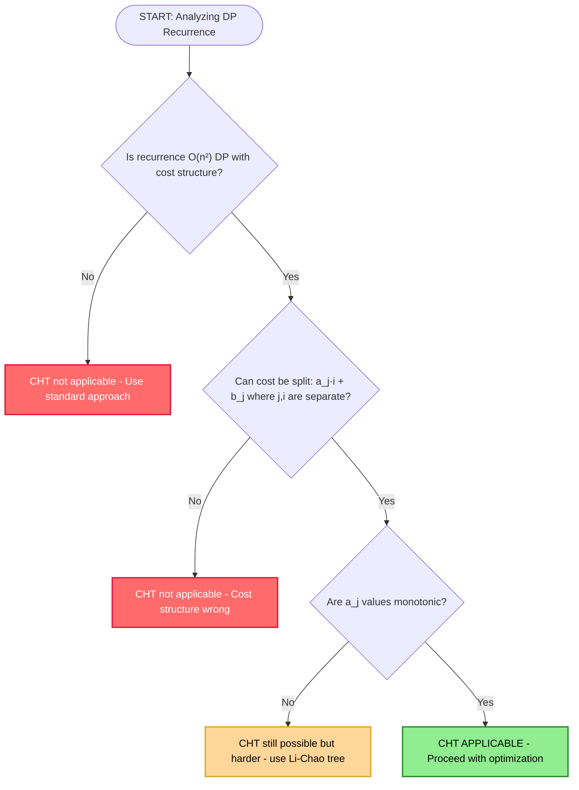

**Execution Flowchart**

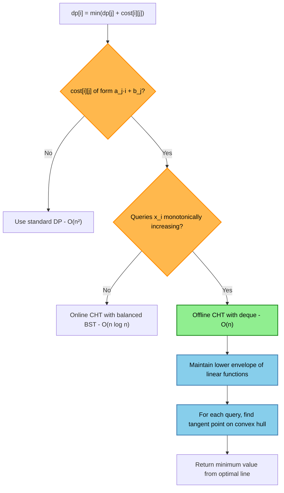

**Complexity**

- Time: O(n) offline with monotonic queries, O(n log n) online with random queries
- Space: O(n) for line storage

**When to Use**

- Recurrence: `dp[i] = min_j(dp[j] + a_j * i + b_j)` where j < i
- Slopes a_j are monotone → use deque; otherwise → use Li-Chao tree
- Classic problems: weighted job scheduling, train trip, divide-the-rectangle

**Step-by-step Example**

```
Problem: dp[i] = min(dp[j] + (i - j)² + c) for j < i
Rewrite: dp[i] = i² + min_j(j² + dp[j] - 2j*i)

For each j, line is f_j(i) = (-2j)*i + (j² + dp[j])
Lines: slope a_j = -2j (strictly decreasing), intercept b_j = j² + dp[j]

Since queries x_i = i are in order and slopes are monotone, use offline CHT with deque:
  - Process j=0: line f_0(i) = 0·i + 0 = 0
  - Process j=1: line f_1(i) = -2·i + 1
  - Process j=2: line f_2(i) = -4·i + 4
  - For query i=3: deque front gives min, check if front is still optimal

dp values computed in O(n) instead of O(n²)
```

**Python Implementation**

```python
from collections import deque

def convex_hull_trick_min(n: int, costs: list) -> list:
    """
    Solve dp[i] = min over j<i of (dp[j] + cost[j][i])
    where cost has a linear-separable structure.
    Returns dp array.
    
    Assumes slopes (a[j]) are monotonically decreasing.
    """
    # Lines stored as (slope, intercept)
    # f_j(x) = slope * x + intercept
    lines = deque()  # deque of (slope, intercept)
    dp = [float('inf')] * n
    dp[0] = 0

    def bad(l1, l2, l3):
        """Return True if l2 is never the minimum (l2 is 'above' envelope)."""
        # Intersection of l1 and l3 is to the left of intersection of l1 and l2
        a1, b1 = l1
        a2, b2 = l2
        a3, b3 = l3
        return (b3 - b1) * (a1 - a2) <= (b2 - b1) * (a1 - a3)

    def query(x):
        """Query minimum value at x from current deque."""
        while len(lines) > 1:
            a1, b1 = lines[0]
            a2, b2 = lines[1]
            if a1 * x + b1 >= a2 * x + b2:
                lines.popleft()
            else:
                break
        a, b = lines[0]
        return a * x + b

    def add_line(slope, intercept):
        """Add a new line to the deque (slopes must be decreasing)."""
        new_line = (slope, intercept)
        while len(lines) >= 2 and bad(lines[-2], lines[-1], new_line):
            lines.pop()
        lines.append(new_line)

    # Example: dp[i] = min_j(dp[j] - 2*j*i + j^2) + i^2
    for i in range(1, n):
        j = i - 1  # Add line for j = i-1
        slope = -2 * j
        intercept = j * j + dp[j]
        add_line(slope, intercept)

        # Query for current i
        val = query(i)
        dp[i] = val + i * i  # Add the i-dependent part

    return dp


class LiChaoTree:
    """
    Li-Chao Tree for online CHT (arbitrary query order).
    Supports adding lines f(x) = a*x + b and querying min at x.
    """
    def __init__(self, x_min: int, x_max: int):
        self.x_min = x_min
        self.x_max = x_max
        self.tree = {}  # sparse: node -> (slope, intercept)

    def _eval(self, line, x):
        if line is None:
            return float('inf')
        a, b = line
        return a * x + b

    def add_line(self, slope: int, intercept: int, node=1, lo=None, hi=None):
        if lo is None:
            lo, hi = self.x_min, self.x_max
        if lo > hi:
            return
        mid = (lo + hi) // 2
        cur = self.tree.get(node)
        new_line = (slope, intercept)
        left_better = self._eval(new_line, lo) < self._eval(cur, lo)
        mid_better = self._eval(new_line, mid) < self._eval(cur, mid)
        if mid_better:
            self.tree[node] = new_line
            cur, new_line = new_line, cur
        if lo == hi:
            return
        if left_better != mid_better:
            self.add_line(new_line[0], new_line[1], 2*node, lo, mid)
        else:
            self.add_line(new_line[0], new_line[1], 2*node+1, mid+1, hi)

    def query(self, x: int, node=1, lo=None, hi=None) -> int:
        if lo is None:
            lo, hi = self.x_min, self.x_max
        res = self._eval(self.tree.get(node), x)
        if lo == hi:
            return res
        mid = (lo + hi) // 2
        if x <= mid:
            return min(res, self.query(x, 2*node, lo, mid))
        else:
            return min(res, self.query(x, 2*node+1, mid+1, hi))
```

**Java Implementation**

```java
import java.util.*;

public class ConvexHullTrick {
    
    // Offline CHT with monotone slopes (decreasing) and monotone queries (increasing)
    static long[] solveCHT(int n, long[] cost) {
        long[] dp = new long[n];
        Arrays.fill(dp, Long.MAX_VALUE / 2);
        dp[0] = 0;
        
        // Deque stores lines as {slope, intercept}
        long[][] lines = new long[n][2];
        int head = 0, tail = 0;
        
        // Returns true if line l2 is redundant given l1 and l3
        // All lines: y = slope*x + intercept
        // l1, l2, l3 in order of decreasing slope
        // l2 never optimal if intersection(l1,l3) <= intersection(l1,l2)
        
        // Add line for j=0
        lines[tail][0] = 0;       // slope = -2*j = 0
        lines[tail][1] = dp[0];   // intercept = j^2 + dp[j] = 0
        tail++;
        
        for (int i = 1; i < n; i++) {
            // Query: find min line at x = i
            while (head + 1 < tail) {
                long a1 = lines[head][0], b1 = lines[head][1];
                long a2 = lines[head+1][0], b2 = lines[head+1][1];
                if (a1 * i + b1 >= a2 * i + b2) {
                    head++;
                } else {
                    break;
                }
            }
            long bestVal = lines[head][0] * i + lines[head][1];
            dp[i] = bestVal + (long)i * i; // add i-dependent part
            
            // Add line for j = i
            long newSlope = -2L * i;
            long newIntercept = (long)i * i + dp[i];
            while (tail - head >= 2) {
                long a1 = lines[tail-2][0], b1 = lines[tail-2][1];
                long a2 = lines[tail-1][0], b2 = lines[tail-1][1];
                long a3 = newSlope, b3 = newIntercept;
                // Check if lines[tail-1] is redundant
                if ((b3 - b1) * (a1 - a2) <= (b2 - b1) * (a1 - a3)) {
                    tail--;
                } else {
                    break;
                }
            }
            lines[tail][0] = newSlope;
            lines[tail][1] = newIntercept;
            tail++;
        }
        return dp;
    }
    
    public static void main(String[] args) {
        // Example: compute dp[i] = min(dp[j] + (i-j)^2) for n=6
        int n = 6;
        long[] dp = solveCHT(n, null);
        System.out.println("DP values: " + Arrays.toString(dp));
    }
}
```

**Interview Q&A**

1. **Q: When should I use CHT instead of standard DP?**
   A: When you have O(n²) DP with a recurrence `dp[i] = min_j(f(j) + g(i) + h(i,j))` where h(i,j) = a(j) * i is separable. CHT reduces this to O(n) or O(n log n). Without this structure, CHT doesn't apply.

2. **Q: What's the difference between offline and online CHT?**
   A: Offline CHT (deque) runs in O(n) and works only when query parameters are monotonically ordered. Online CHT (Li-Chao tree) handles random queries in O(n log n) but has higher constant factors. Always try offline first.

3. **Q: How do you detect that CHT applies to an interview problem?**
   A: Look for O(n²) DP where each transition uses `cost[i][j] = a·j + b` where a and b don't depend on i together. Rewrite the cost to separate j-terms from i-terms. If you get lines in slope-intercept form, CHT applies.

4. **Q: What is the Li-Chao tree and when do you need it?**
   A: A segment tree on the x-axis where each node stores the "dominant" line for that range's midpoint. Use it when slopes are not monotone (random order), giving O(log n) per query instead of O(1). Trades simplicity for generality.

5. **Q: Can CHT be used for maximization instead of minimization?**
   A: Yes — just maintain the upper convex hull (upper envelope) instead of the lower one, and flip the "bad" line check condition. Everything else is symmetric.

6. **Q: How do integer overflow arise in CHT and how to prevent them?**
   A: The product `a_j * x_i` can overflow int if both are around 10^9. Use `long long` (C++) or `long` (Java). In Python, integers are arbitrary precision so no overflow occurs.

---

## Digit DP

**Description**

Digit DP is a technique for counting or summing numbers with specific digit properties up to a given limit N. Instead of iterating through all numbers (infeasible for N ≤ 10^18), we build numbers digit-by-digit and use memoization to avoid redundant computation.

State: `dp[pos][sum_state][tight]` where:
- `pos`: current digit position (0-indexed from left)
- `sum_state`: aggregate of properties so far (sum, count, etc.)
- `tight`: whether we're still bounded by the original number N

**Problem Recognition Flowchart**

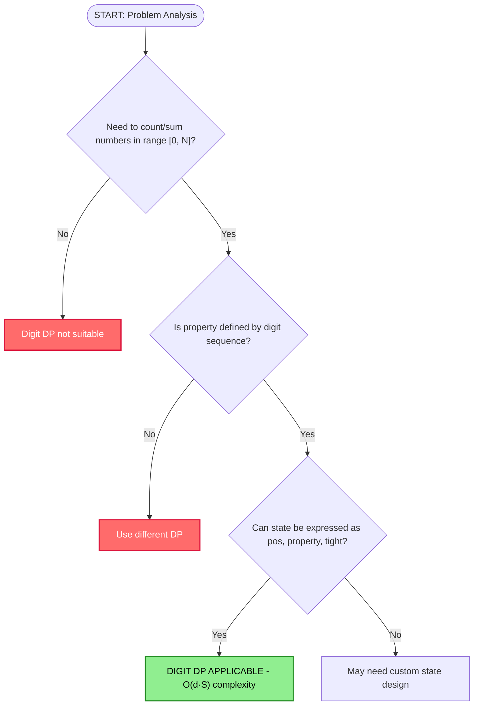

**Execution Flowchart**

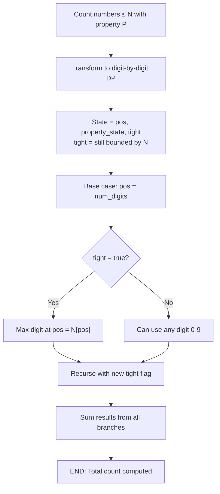

**Complexity**

- Time: O(d × S × 10) where d = digits in N (≤18), S = state space size
- Space: O(d × S) for memoization

**Step-by-step Example**

```
Problem: Count numbers from 1 to N=1234 where digit sum is even.

State: dp[pos][is_even][tight]
  pos = 0..3 (thousands, hundreds, tens, units)
  is_even = 1 if digit sum so far is even
  tight = 1 if still bounded by N

Base case: pos == 4 → return 1 if is_even == 1, else 0

Recurrence:
  max_digit = N[pos] if tight else 9
  for digit in [0, max_digit]:
    new_tight = tight and (digit == N[pos])
    new_is_even = (is_even XOR (digit % 2))
    result += dp(pos+1, new_is_even, new_tight)

Answer: dp(0, 0, 1) — start at pos 0, sum 0 = even (is_even=1), tight=True
  (Note: sum=0 is even, we count it in is_even=1 initially)
```

**Python Implementation**

```python
from functools import lru_cache
from typing import Tuple

def count_with_even_digit_sum(N: int) -> int:
    """
    Count numbers in [1, N] where the digit sum is even.
    Uses Digit DP with memoization.
    """
    digits = [int(d) for d in str(N)]
    n = len(digits)

    @lru_cache(maxsize=None)
    def dp(pos: int, digit_sum_parity: int, tight: bool) -> int:
        """
        pos: current digit position (0-indexed)
        digit_sum_parity: 0 if sum so far is even, 1 if odd
        tight: True if still bounded by N
        Returns: count of valid numbers from this state
        """
        if pos == n:
            return 1 if digit_sum_parity == 0 else 0  # sum is even

        max_digit = digits[pos] if tight else 9
        result = 0
        for digit in range(0, max_digit + 1):
            new_tight = tight and (digit == max_digit)
            new_parity = (digit_sum_parity + digit) % 2
            result += dp(pos + 1, new_parity, new_tight)
        return result

    # Count [0, N] with even digit sum, subtract 1 to exclude 0
    total = dp(0, 0, True)
    # 0 has digit sum 0 (even), so subtract it if we don't want it
    return total - 1  # exclude 0


def general_digit_dp(N: int, divisor: int) -> int:
    """
    Count numbers in [1, N] where digit sum is divisible by divisor.
    More general Digit DP template.
    """
    digits = [int(d) for d in str(N)]
    n = len(digits)
    memo = {}

    def dp(pos: int, remainder: int, tight: bool, started: bool) -> int:
        """
        started: True if we've placed a non-zero digit (handles leading zeros)
        """
        if pos == n:
            return 1 if (remainder == 0 and started) else 0

        if (pos, remainder, tight, started) in memo:
            return memo[(pos, remainder, tight, started)]

        max_digit = digits[pos] if tight else 9
        result = 0

        for digit in range(0, max_digit + 1):
            new_tight = tight and (digit == max_digit)
            new_started = started or (digit > 0)
            new_remainder = (remainder + digit) % divisor if new_started else 0
            result += dp(pos + 1, new_remainder, new_tight, new_started)

        memo[(pos, remainder, tight, started)] = result
        return result

    return dp(0, 0, True, False)
```

**Java Implementation**

```java
import java.util.*;

public class DigitDP {
    
    static int[] digits;
    static int n;
    static long[][][] memo;
    
    // Count numbers in [1, N] where digit sum is divisible by k
    static long countDivisibleDigitSum(long N, int k) {
        digits = new int[18];
        n = 0;
        long temp = N;
        while (temp > 0) {
            digits[n++] = (int)(temp % 10);
            temp /= 10;
        }
        // Reverse digits (now digits[0] is most significant)
        for (int i = 0; i < n / 2; i++) {
            int t = digits[i];
            digits[i] = digits[n - 1 - i];
            digits[n - 1 - i] = t;
        }
        
        // memo[pos][remainder][tight]
        memo = new long[n][k][2];
        for (long[][] a : memo) for (long[] b : a) Arrays.fill(b, -1);
        
        return dp(0, 0, 1, k);
    }
    
    static long dp(int pos, int remainder, int tight, int k) {
        if (pos == n) {
            return remainder == 0 ? 1 : 0;
        }
        if (memo[pos][remainder][tight] != -1) {
            return memo[pos][remainder][tight];
        }
        int maxDigit = tight == 1 ? digits[pos] : 9;
        long result = 0;
        for (int digit = 0; digit <= maxDigit; digit++) {
            int newTight = (tight == 1 && digit == maxDigit) ? 1 : 0;
            int newRem = (remainder + digit) % k;
            result += dp(pos + 1, newRem, newTight, k);
        }
        memo[pos][remainder][tight] = result;
        return result;
    }
    
    public static void main(String[] args) {
        // Count numbers in [1, 1000] where digit sum % 3 == 0
        long count = countDivisibleDigitSum(1000, 3);
        System.out.println("Count: " + count); // Expected: 333
    }
}
```

**Interview Q&A**

1. **Q: How do you define the tight constraint?**
   A: The tight flag tracks whether we're still bounded by N's digits. At each position, if tight=true, the max digit we can place is N[pos]; otherwise we can place 0–9. Once we place a digit strictly less than N[pos], tight becomes false for all subsequent positions, opening all choices.

2. **Q: What if the property depends on non-adjacent digits?**
   A: Add states to track relevant history. For "non-decreasing digits," track last digit placed. For "no two consecutive same digits," track the previous digit. For "even number of 5s," track parity. State space grows but stays polynomial.

3. **Q: When does Digit DP fail?**
   A: When the state space is too large (e.g., tracking exact digit frequencies as a tuple). Use it only when you can aggregate the property into a compact state (sum mod k, single digit count, etc.).

4. **Q: How do you handle the range [L, R] instead of [0, N]?**
   A: Compute count(R) - count(L-1). This is the standard "prefix sum" trick for digit DP — define a function for [0, N] and subtract.

5. **Q: How do leading zeros affect Digit DP?**
   A: Add a "started" flag that becomes true once you place the first non-zero digit. Before started=true, you can place a "0" meaning the number hasn't started yet (skip). This avoids counting 0007 as "7" and correctly handles one-digit numbers.

6. **Q: Give an example where digit DP beats all other approaches.**
   A: "Count integers from 1 to 10^18 with a strictly non-decreasing digit sequence." Brute force is impossible. Digit DP with state = (pos, last_digit, tight) has 18 × 10 × 2 = 360 states — instant.

---

## Tree DP

**Description**

Tree DP combines DP with tree traversal. Each node's optimal solution depends on the optimal solutions of its children. Essential for tree-shaped problems: maximum weight independent sets, tree coloring, diameter, rerooting.

**Problem Recognition Flowchart**

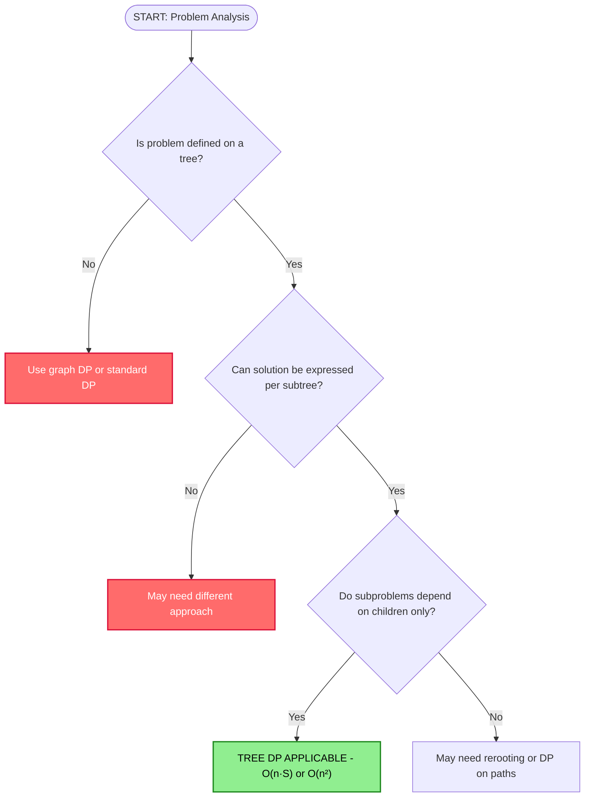

**Execution Flowchart**

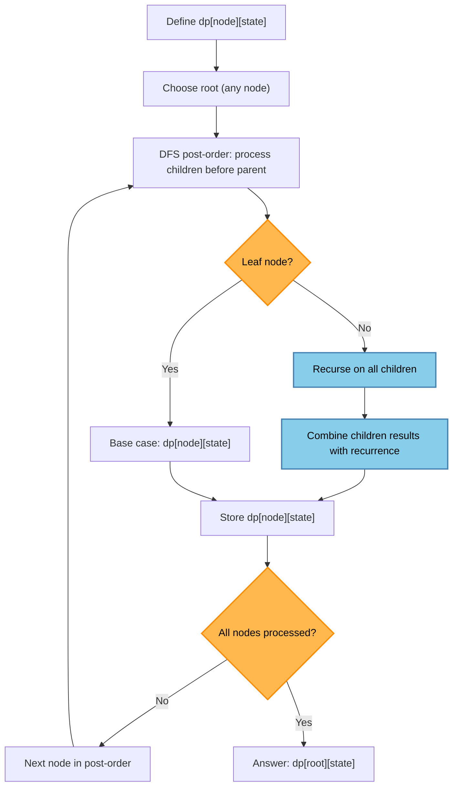

**Rerooting Pattern**

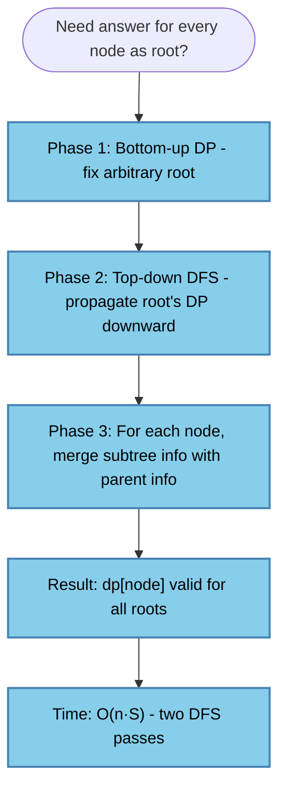

**Complexity**

- Time: O(n) to traverse all nodes once (O(n²) if rerooting with state merge)
- Space: O(n × S) where S = state space per node

**Step-by-step Example**

```
Problem: Maximum weight independent set (MWIS) in a tree.

dp[node][0] = max value in subtree if node is NOT selected
dp[node][1] = max value in subtree if node IS selected

Recurrence:
  dp[node][0] = sum of max(dp[child][0], dp[child][1]) for all children
  dp[node][1] = node.weight + sum of dp[child][0] for all children

Example tree (weight in parentheses):
        1(w=3)
       /      \
      2(w=5)  3(w=2)
     /  \
   4(w=1) 5(w=4)

Leaves 4,5: dp[4]=[0,1], dp[5]=[0,4]
Node 2:
  dp[2][0] = max(0,1) + max(0,4) = 1+4 = 5
  dp[2][1] = 5 + dp[4][0] + dp[5][0] = 5 + 0 + 0 = 5
Node 3:
  dp[3][0] = 0, dp[3][1] = 2
Root 1:
  dp[1][0] = max(dp[2][0], dp[2][1]) + max(dp[3][0], dp[3][1])
           = max(5,5) + max(0,2) = 5 + 2 = 7
  dp[1][1] = 3 + dp[2][0] + dp[3][0] = 3 + 5 + 0 = 8
Answer: max(7, 8) = 8 (select root=1 and child node 2, not their children)
Wait, dp[1][1]=8 means select node 1 (weight 3) + best of children NOT selected
  = 3 + 5 + 0 = 8: select 1, then from node 2's subtree without node 2:
  max(dp[4][*], dp[5][*]) independently = max(0,1)+max(0,4)=5
Correct answer = 8.
```

**Python Implementation**

```python
from collections import defaultdict
from typing import List, Tuple

def max_weight_independent_set(n: int, weights: List[int], edges: List[Tuple[int,int]]) -> int:
    """
    Find the maximum weight independent set in a tree.
    n: number of nodes (1-indexed)
    weights: weights[i] = weight of node i
    edges: list of (u, v) undirected edges
    Returns: maximum sum of weights of non-adjacent nodes
    """
    adj = defaultdict(list)
    for u, v in edges:
        adj[u].append(v)
        adj[v].append(u)

    # dp[node] = (not_selected_max, selected_max)
    dp = [(0, 0)] * (n + 1)

    def dfs(node: int, parent: int) -> None:
        not_sel = 0  # max value if node NOT selected
        sel = weights[node - 1]  # max value if node IS selected

        for child in adj[node]:
            if child == parent:
                continue
            dfs(child, node)
            child_not, child_sel = dp[child]
            not_sel += max(child_not, child_sel)  # child can be either
            sel += child_not  # if node is selected, child cannot be

        dp[node] = (not_sel, sel)

    dfs(1, -1)
    return max(dp[1])


def tree_diameter(n: int, edges: List[Tuple[int, int, int]]) -> int:
    """
    Find the diameter (longest path) in a weighted tree.
    Returns the length of the longest path.
    """
    adj = defaultdict(list)
    for u, v, w in edges:
        adj[u].append((v, w))
        adj[v].append((u, w))

    diameter = [0]

    def dfs(node: int, parent: int) -> int:
        """Returns the longest path starting at node going downward."""
        top2 = [0, 0]  # two longest paths from this node downward
        for child, w in adj[node]:
            if child == parent:
                continue
            child_len = dfs(child, node) + w
            if child_len > top2[0]:
                top2[1] = top2[0]
                top2[0] = child_len
            elif child_len > top2[1]:
                top2[1] = child_len

        # Potential diameter through this node
        diameter[0] = max(diameter[0], top2[0] + top2[1])
        return top2[0]

    dfs(1, -1)
    return diameter[0]


def tree_dp_rerooting(n: int, edges: List[Tuple[int,int]]) -> List[int]:
    """
    Compute sum of distances from each node to all other nodes.
    Classic rerooting template.
    """
    adj = defaultdict(list)
    for u, v in edges:
        adj[u].append(v)
        adj[v].append(u)

    # Phase 1: bottom-up DP from root=1
    # subtree_sum[v] = sum of distances from v to all nodes in its subtree
    # subtree_cnt[v] = count of nodes in subtree of v
    subtree_sum = [0] * (n + 1)
    subtree_cnt = [0] * (n + 1)
    order = []  # topological order (BFS)
    parent = [-1] * (n + 1)

    from collections import deque
    q = deque([1])
    visited = [False] * (n + 1)
    visited[1] = True
    while q:
        node = q.popleft()
        order.append(node)
        for child in adj[node]:
            if not visited[child]:
                visited[child] = True
                parent[child] = node
                q.append(child)

    for node in reversed(order):  # post-order
        subtree_cnt[node] = 1
        for child in adj[node]:
            if child != parent[node]:
                subtree_cnt[node] += subtree_cnt[child]
                subtree_sum[node] += subtree_sum[child] + subtree_cnt[child]

    # Phase 2: top-down DP
    ans = [0] * (n + 1)
    ans[1] = subtree_sum[1]

    for node in order:  # pre-order
        for child in adj[node]:
            if child == parent[node]:
                continue
            # When root moves from node to child:
            # distances to child's subtree nodes decrease by 1 each: -subtree_cnt[child]
            # distances to nodes outside child's subtree increase by 1: +(n - subtree_cnt[child])
            ans[child] = ans[node] - subtree_cnt[child] + (n - subtree_cnt[child])

    return ans[1:]  # 1-indexed to 0-indexed
```

**Java Implementation**

```java
import java.util.*;

public class TreeDP {
    
    static List<Integer>[] adj;
    static int[] weights;
    static int[][] dp; // dp[node][0/1] = not_selected / selected
    
    @SuppressWarnings("unchecked")
    static int maxWeightIS(int n, int[] w, int[][] edges) {
        adj = new ArrayList[n + 1];
        for (int i = 1; i <= n; i++) adj[i] = new ArrayList<>();
        for (int[] e : edges) {
            adj[e[0]].add(e[1]);
            adj[e[1]].add(e[0]);
        }
        weights = w;
        dp = new int[n + 1][2];
        dfs(1, -1, n);
        return Math.max(dp[1][0], dp[1][1]);
    }
    
    static void dfs(int node, int parent, int n) {
        dp[node][0] = 0;
        dp[node][1] = weights[node - 1];
        for (int child : adj[node]) {
            if (child == parent) continue;
            dfs(child, node, n);
            dp[node][0] += Math.max(dp[child][0], dp[child][1]);
            dp[node][1] += dp[child][0];
        }
    }
    
    // Tree diameter using two DFS passes
    static int[] distFromNode;
    
    static int treeDiameter(int n, int[][] edges) {
        adj = new ArrayList[n + 1];
        for (int i = 1; i <= n; i++) adj[i] = new ArrayList<>();
        for (int[] e : edges) {
            adj[e[0]].add(e[1]);
            adj[e[1]].add(e[0]);
        }
        distFromNode = new int[n + 1];
        
        // First BFS from node 1, find farthest node u
        int u = bfs(1, n);
        // Second BFS from u, find farthest node v → diameter
        int v = bfs(u, n);
        return distFromNode[v];
    }
    
    static int bfs(int start, int n) {
        Arrays.fill(distFromNode, -1);
        Queue<Integer> q = new LinkedList<>();
        q.add(start);
        distFromNode[start] = 0;
        int farthest = start;
        while (!q.isEmpty()) {
            int node = q.poll();
            for (int next : adj[node]) {
                if (distFromNode[next] == -1) {
                    distFromNode[next] = distFromNode[node] + 1;
                    q.add(next);
                    if (distFromNode[next] > distFromNode[farthest]) {
                        farthest = next;
                    }
                }
            }
        }
        return farthest;
    }
    
    public static void main(String[] args) {
        // Example: tree with nodes 1-5
        int n = 5;
        int[] w = {3, 5, 2, 1, 4};
        int[][] edges = {{1,2},{1,3},{2,4},{2,5}};
        System.out.println("Max IS: " + maxWeightIS(n, w, edges)); // Expected: 8
    }
}
```

**Interview Q&A**

1. **Q: How do you choose the root for tree DP?**
   A: Any node works for computing a single root's answer. If you need answers for all roots (rerooting), choose an arbitrary root, do bottom-up DP, then do a second DFS propagating parent information downward.

2. **Q: How do you combine DP values from multiple children?**
   A: It depends on the problem. For max independent set: take max of each child's two states and sum. For counting: multiply (product of independent choices). For paths (diameter): track top-2 longest paths through each node.

3. **Q: What is rerooting and when do you need it?**
   A: Rerooting computes the DP answer for every possible root in O(n) total. Needed when the answer at each node depends on the entire tree (e.g., sum of distances). Two-pass: bottom-up to compute subtree values, top-down to propagate the "upward" contribution.

4. **Q: When does tree DP become O(n²)?**
   A: When merging children requires quadratic work — for example, combining histograms of subtree path lengths. This is the "tree knapsack" pattern. Can sometimes be optimized with careful bookkeeping.

---

## SOS DP (Sum Over Subsets)

**Description**

Sum Over Subsets DP efficiently computes `f(S) = sum of g(T)` for all subsets T of a bitmask S. The key: process bits independently using a layer-by-layer approach, reducing O(3^k) brute force to O(k × 2^k).

**Problem Recognition Flowchart**

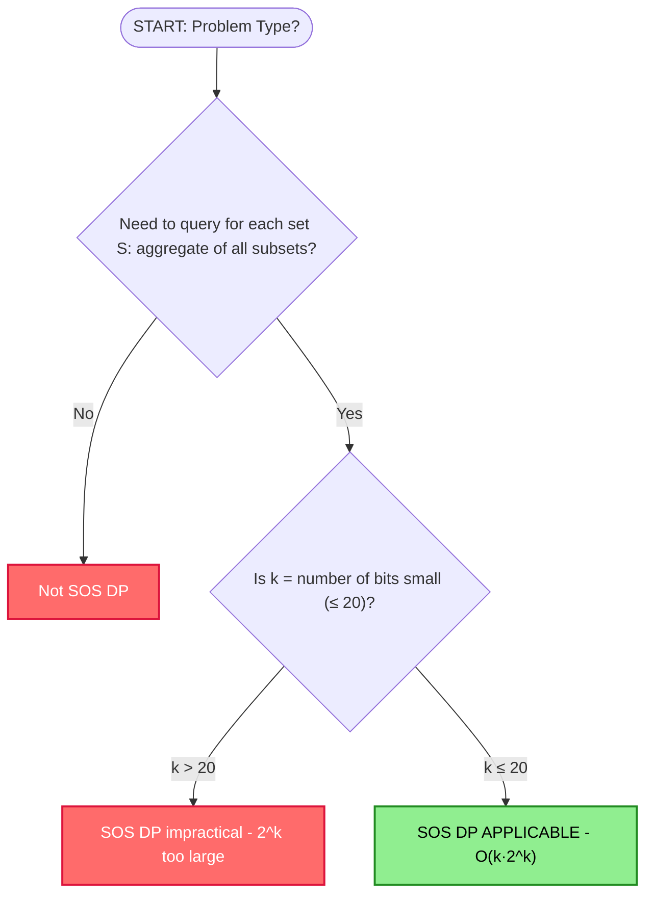

**Execution Flowchart**

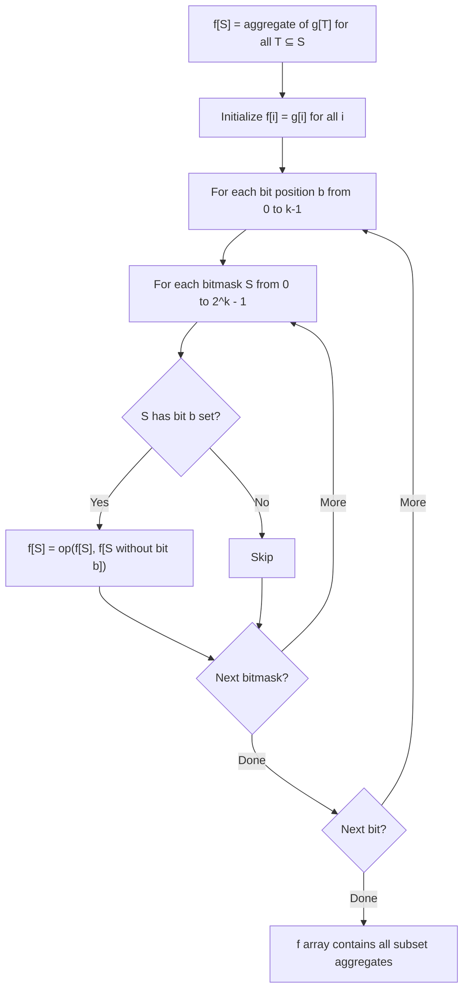

**Complexity**

- Time: O(k × 2^k) where k = number of bits
- Space: O(2^k)

**Step-by-step Example**

```
Problem: f[S] = sum of g[T] for all T ⊆ S, k=3 bits.

g = [3, 1, 2, 5, 0, 1, 4, 2]
    000 001 010 011 100 101 110 111

Initialize f = g.copy()

Process bit 0:
  For each S with bit 0 set:
    S=001: f[001] += f[000] → 1+3 = 4
    S=011: f[011] += f[010] → 5+2 = 7
    S=101: f[101] += f[100] → 1+0 = 1
    S=111: f[111] += f[110] → 2+4 = 6
  f = [3, 4, 2, 7, 0, 1, 4, 6]

Process bit 1:
  For each S with bit 1 set:
    S=010: f[010] += f[000] → 2+3 = 5
    S=011: f[011] += f[001] → 7+4 = 11
    S=110: f[110] += f[100] → 4+0 = 4
    S=111: f[111] += f[101] → 6+1 = 7
  f = [3, 4, 5, 11, 0, 1, 4, 7]

Process bit 2:
  For each S with bit 2 set:
    S=100: f[100] += f[000] → 0+3 = 3
    S=101: f[101] += f[001] → 1+4 = 5
    S=110: f[110] += f[010] → 4+5 = 9
    S=111: f[111] += f[011] → 7+11 = 18
  f = [3, 4, 5, 11, 3, 5, 9, 18]

Verify f[111] = sum of all g[T] = 3+1+2+5+0+1+4+2 = 18 ✓
Verify f[011] = g[000]+g[001]+g[010]+g[011] = 3+1+2+5 = 11 ✓
```

**Python Implementation**

```python
from typing import List

def sos_dp_sum(g: List[int], k: int) -> List[int]:
    """
    Sum Over Subsets DP.
    Computes f[S] = sum of g[T] for all T ⊆ S.
    g: values indexed by bitmask, length = 2^k
    k: number of bits
    Returns f array of same length.
    """
    f = g.copy()
    for b in range(k):           # for each bit position
        for S in range(1 << k):  # for each bitmask
            if S >> b & 1:       # if bit b is set in S
                f[S] += f[S ^ (1 << b)]  # add contribution from S with bit b cleared
    return f


def sos_dp_max(g: List[int], k: int) -> List[int]:
    """
    Max Over Subsets DP.
    Computes f[S] = max of g[T] for all T ⊆ S.
    """
    f = g.copy()
    for b in range(k):
        for S in range(1 << k):
            if S >> b & 1:
                f[S] = max(f[S], f[S ^ (1 << b)])
    return f


def sos_dp_superset(g: List[int], k: int) -> List[int]:
    """
    Sum Over Supersets DP.
    Computes f[S] = sum of g[T] for all T ⊇ S.
    (reverse: iterate bit inclusion in opposite direction)
    """
    f = g.copy()
    for b in range(k):
        for S in range((1 << k) - 1, -1, -1):  # iterate backward
            if not (S >> b & 1):  # if bit b is NOT set in S
                f[S] += f[S | (1 << b)]  # add contribution from S with bit b set
    return f


def subset_sum_exists(arr: List[int], target: int) -> bool:
    """
    Using SOS DP to answer: does any subset of arr sum to target?
    Only works when arr values are small integers.
    """
    possible = {0}
    for x in arr:
        possible = possible | {s + x for s in possible}
    return target in possible
```

**Java Implementation**

```java
public class SOSDP {
    
    // Sum Over Subsets
    static int[] sosDpSum(int[] g, int k) {
        int size = 1 << k;
        int[] f = g.clone();
        for (int b = 0; b < k; b++) {
            for (int S = 0; S < size; S++) {
                if ((S >> b & 1) == 1) {
                    f[S] += f[S ^ (1 << b)];
                }
            }
        }
        return f;
    }
    
    // Max Over Subsets
    static int[] sosDpMax(int[] g, int k) {
        int size = 1 << k;
        int[] f = g.clone();
        for (int b = 0; b < k; b++) {
            for (int S = 0; S < size; S++) {
                if ((S >> b & 1) == 1) {
                    f[S] = Math.max(f[S], f[S ^ (1 << b)]);
                }
            }
        }
        return f;
    }
    
    public static void main(String[] args) {
        int k = 3;
        int[] g = {3, 1, 2, 5, 0, 1, 4, 2};
        int[] f = sosDpSum(g, k);
        System.out.print("f[111] = " + f[7]); // Expected: 18
    }
}
```

**Interview Q&A**

1. **Q: How is SOS DP different from a subset-iteration brute force?**
   A: Brute force is O(3^k) — for each of 2^k sets, iterate all subsets (average 1.5^k per set). SOS DP is O(k × 2^k) by processing bits in layers. For k=20: brute force ≈ 3.5 billion, SOS ≈ 20 million — 170x faster.

2. **Q: Can you use SOS DP for min instead of sum?**
   A: Yes — replace `+=` with `min()`. Initialize f[S] = g[S] and let f[S] = min(f[S], f[S without bit b]).

3. **Q: Can SOS DP handle superset queries (sum over all supersets)?**
   A: Yes — reverse the bit direction: iterate bit b, but update f[S] when bit b is NOT set, adding f[S | (1<<b)]. This computes f[S] = sum of g[T] for all T that contain S.

4. **Q: What problems in competitive programming use SOS DP?**
   A: OR-convolution (count pairs with (A|B) = all 1s), AND-convolution, Hamming distance subset queries, TSP-like bitmask DP with subset aggregation, and some graph coloring problems.

---

## Knuth-Yao Optimization

**Description**

Knuth-Yao optimization applies to interval DP where `dp[i][j] = min_k(dp[i][k] + dp[k+1][j]) + cost[i][j]` and cost satisfies the quadrangle inequality. The optimal split point is then monotone, reducing O(n³) to O(n²).

**Execution Flowchart**

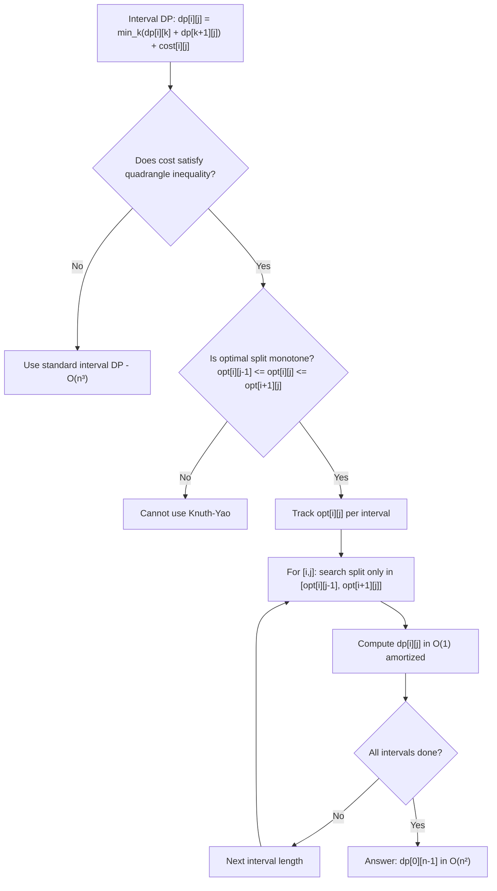

**Complexity**

- Time: O(n²) with Knuth-Yao vs O(n³) without
- Space: O(n²)

**Step-by-step Example**

```
Problem: Optimal BST (minimize expected search cost)
Keys with probabilities: p1=0.15, p2=0.10, p3=0.05, p4=0.10, p5=0.20

dp[i][j] = min expected search cost for keys[i..j]
cost[i][j] = sum of all probabilities in [i..j] (weight of subtree)

Quadrangle inequality holds for "sum of weights" cost. 
opt[i][j] is the root of optimal BST for keys[i..j].

Standard O(n³): for each (i,j), try all k as root.
With Knuth-Yao: for interval of length l, opt[i][j] is
monotone non-decreasing in i (for fixed j-i=l).

This means instead of O(n) choices per interval, amortized O(1).
Total work: O(n²) instead of O(n³).

Example intervals (length 2):
  opt[1][2] search range: [opt[1][1], opt[2][2]] = [1, 2]
  opt[2][3] search range: [opt[2][2], opt[3][3]] = [2, 3]
  These ranges shift right monotonically.
```

**Python Implementation**

```python
from typing import List
import sys

def interval_dp_standard(n: int, cost: List[List[int]]) -> int:
    """Standard O(n³) interval DP."""
    INF = float('inf')
    dp = [[INF] * n for _ in range(n)]
    for i in range(n):
        dp[i][i] = 0

    for length in range(2, n + 1):
        for i in range(n - length + 1):
            j = i + length - 1
            for k in range(i, j):
                dp[i][j] = min(dp[i][j], dp[i][k] + dp[k+1][j] + cost[i][j])
    return dp[0][n - 1]


def interval_dp_knuth_yao(n: int, cost: List[List[int]]) -> int:
    """
    O(n²) interval DP with Knuth-Yao optimization.
    Requires quadrangle inequality: cost[a][c] + cost[b][d] <= cost[a][d] + cost[b][c]
    for a <= b <= c <= d.
    """
    INF = float('inf')
    dp = [[INF] * n for _ in range(n)]
    opt = [[0] * n for _ in range(n)]  # optimal split points

    for i in range(n):
        dp[i][i] = 0
        opt[i][i] = i

    for length in range(2, n + 1):
        for i in range(n - length + 1):
            j = i + length - 1
            # Search k only in [opt[i][j-1], opt[i+1][j]]
            lo = opt[i][j - 1]
            hi = opt[i + 1][j] if i + 1 <= j else j
            best = INF
            best_k = lo
            for k in range(lo, hi + 1):
                left = dp[i][k] if k >= i else 0
                right = dp[k + 1][j] if k + 1 <= j else 0
                val = left + right + cost[i][j]
                if val < best:
                    best = val
                    best_k = k
            dp[i][j] = best
            opt[i][j] = best_k

    return dp[0][n - 1]
```

**Java Implementation**

```java
public class KnuthYao {
    
    static int intervalDPKnuthYao(int n, int[][] cost) {
        final int INF = Integer.MAX_VALUE / 2;
        int[][] dp = new int[n][n];
        int[][] opt = new int[n][n];
        
        for (int i = 0; i < n; i++) {
            dp[i][i] = 0;
            opt[i][i] = i;
        }
        
        for (int len = 2; len <= n; len++) {
            for (int i = 0; i <= n - len; i++) {
                int j = i + len - 1;
                dp[i][j] = INF;
                int lo = opt[i][j - 1];
                int hi = (i + 1 <= j) ? opt[i + 1][j] : j;
                for (int k = lo; k <= hi; k++) {
                    int left = (k >= i) ? dp[i][k] : 0;
                    int right = (k + 1 <= j) ? dp[k + 1][j] : 0;
                    int val = left + right + cost[i][j];
                    if (val < dp[i][j]) {
                        dp[i][j] = val;
                        opt[i][j] = k;
                    }
                }
            }
        }
        return dp[0][n - 1];
    }
    
    public static void main(String[] args) {
        int n = 4;
        // cost[i][j] = number of elements in range = j - i + 1 (for illustration)
        int[][] cost = new int[n][n];
        for (int i = 0; i < n; i++)
            for (int j = i; j < n; j++)
                cost[i][j] = j - i + 1;
        
        System.out.println(intervalDPKnuthYao(n, cost));
    }
}
```

**Interview Q&A**

1. **Q: How do you verify the quadrangle inequality?**
   A: The inequality `cost[a][c] + cost[b][d] <= cost[a][d] + cost[b][c]` for a ≤ b ≤ c ≤ d must hold analytically (not by testing). For matrix chain with dimension product cost, this is a known fact. For custom costs, derive it algebraically.

2. **Q: When is Knuth-Yao worth implementing in an interview?**
   A: Rarely — only when the interviewer explicitly asks for O(n²) interval DP, or when n is large enough that O(n³) TLEs. Mentioning its existence and the quadrangle inequality condition is usually enough.

3. **Q: What is the difference between Knuth-Yao and Divide-and-Conquer DP?**
   A: Both reduce O(n³) to O(n²). Knuth-Yao requires a monotone opt for the interval DP form `dp[i][j] = min_k(dp[i][k] + dp[k+1][j]) + cost`. Divide-and-Conquer DP applies to 1D recurrences `dp[i] = min_j(dp[j] + cost[j][i])` where the optimal j is monotone in i.

---

## Summary: Choosing the Right DP Optimization

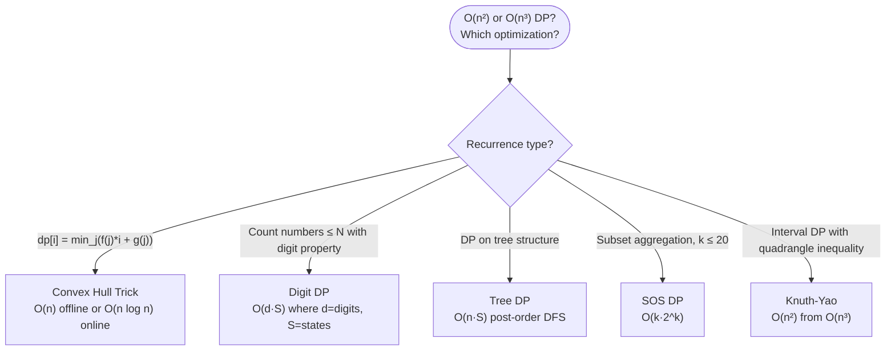

---

## References

- CP-Algorithms: dp-optimizations, convex-hull-trick
- USACO Guide: Platinum DP
- Codeforces: editorial blogs for CHT, SOS DP problems
- MIT 6.851 (Advanced Data Structures): Li-Chao trees
