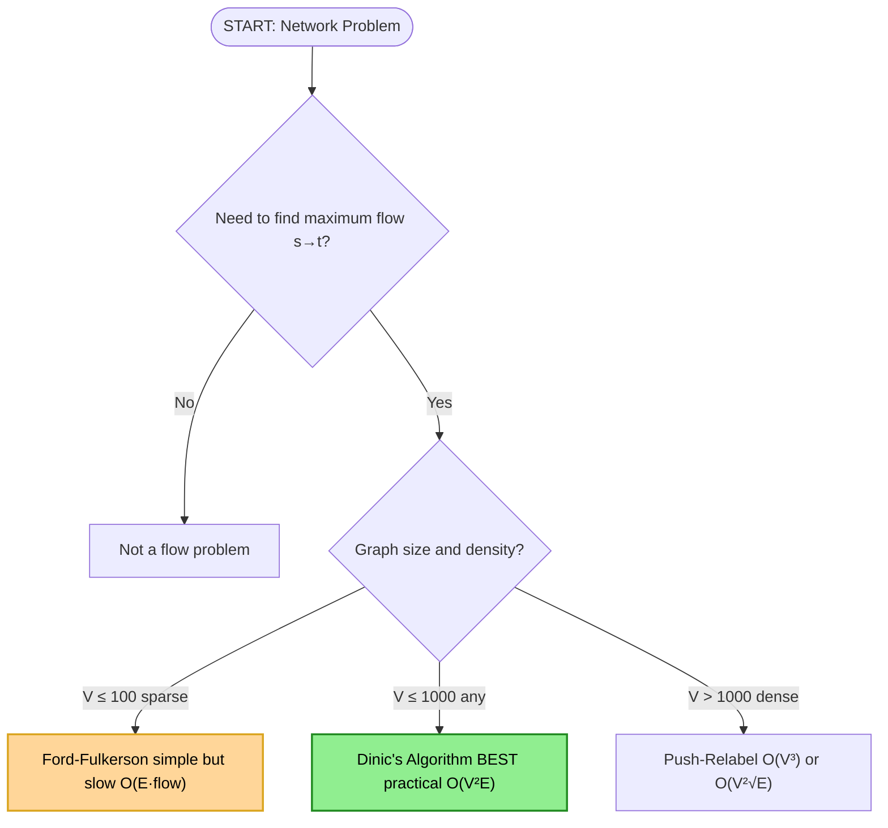
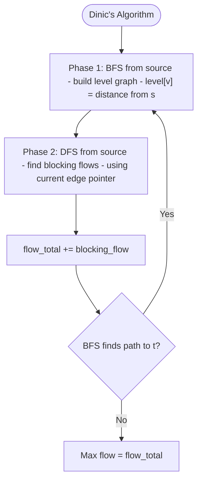
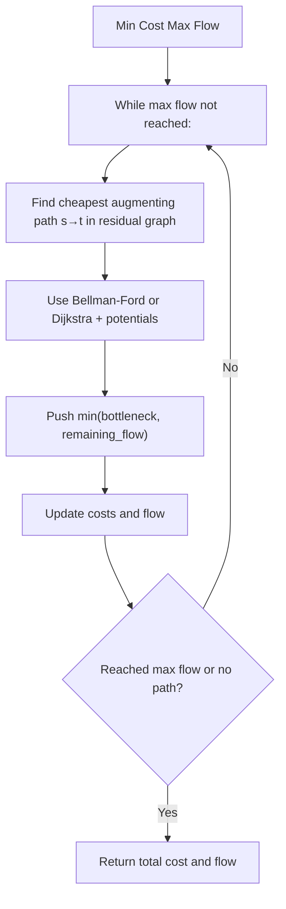
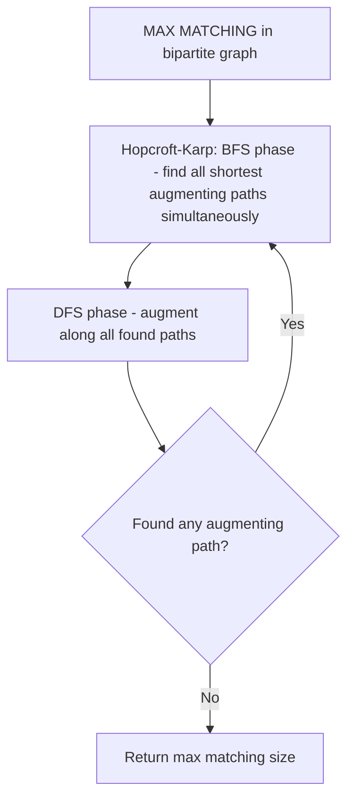
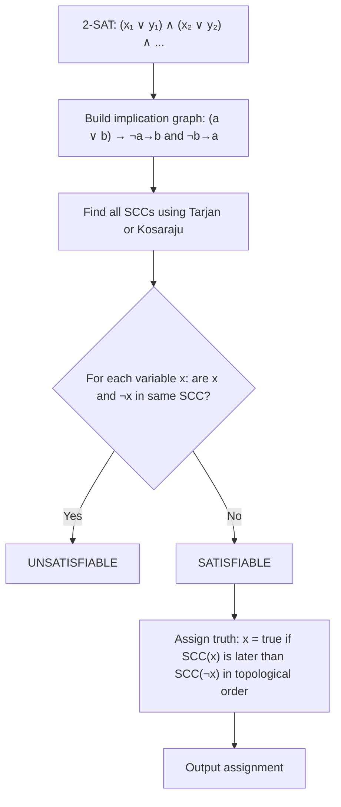

# Graph Algorithms: Flow, Matching, Connectivity

Advanced graph algorithms covering network flow, bipartite matching, 2-SAT, articulation points, and transitive closure. Essential for FAANG senior-level interviews where optimization problems map to flow networks.

---

## Quick Reference

| Algorithm              | Time              | Use Case                                  |
|------------------------|-------------------|-------------------------------------------|
| Dinic's Max Flow       | O(V²E)            | Maximum flow in network                   |
| Min Cost Max Flow      | O(flow × E log V) | Optimal flow with edge costs              |
| Hopcroft-Karp          | O(E√V)            | Maximum bipartite matching                |
| 2-SAT via SCC          | O(V+E)            | Boolean satisfiability (2 literals/clause)|
| Articulation Points    | O(V+E)            | Critical nodes in network                 |
| Transitive Closure     | O(n³) or O(n(n+m))| Reachability queries                     |

---

## Max Flow (Ford-Fulkerson & Dinic's)

**Description**

Max flow finds the maximum amount of "flow" that can be pushed from a source s to a sink t in a directed capacity graph. Ford-Fulkerson is the framework; Dinic's is the practical O(V²E) implementation using level graphs.

**Problem Recognition Flowchart**



**Dinic's Algorithm Flowchart**



**Complexity**

- Ford-Fulkerson: O(E × max_flow)
- Dinic's: O(V² × E)
- Push-relabel: O(V³) or O(V² × √E)

**Step-by-step Example**

```
Graph: s → a (cap 3), s → b (cap 2)
       a → t (cap 2), a → b (cap 1)
       b → t (cap 3)

Augmenting path 1: s → a → t, bottleneck = 2, total flow = 2
Residual: s→a (cap 1, rev 2), a→t (cap 0, rev 2)

Augmenting path 2: s → b → t, bottleneck = 2, total flow = 4
Residual: s→b (cap 0, rev 2), b→t (cap 1, rev 2)

Augmenting path 3: s → a → b → t, bottleneck = 1, total flow = 5
Residual: no more s→t paths

Max flow = 5
Min cut: {a→t, b→t} with capacity 2+3=5 (by max-flow min-cut theorem)
```

**Python Implementation**

```python
from collections import deque, defaultdict
from typing import List

class MaxFlow:
    """Dinic's algorithm for maximum flow."""

    def __init__(self, n: int):
        self.n = n
        self.graph = [[] for _ in range(n)]

    def add_edge(self, u: int, v: int, cap: int) -> None:
        """Add directed edge u → v with capacity cap."""
        self.graph[u].append([v, cap, len(self.graph[v])])
        self.graph[v].append([u, 0, len(self.graph[u]) - 1])  # reverse edge

    def _bfs(self, s: int, t: int, level: List[int]) -> bool:
        """Build level graph using BFS. Returns True if t is reachable."""
        level[:] = [-1] * self.n
        level[s] = 0
        q = deque([s])
        while q:
            u = q.popleft()
            for v, cap, _ in self.graph[u]:
                if cap > 0 and level[v] == -1:
                    level[v] = level[u] + 1
                    q.append(v)
        return level[t] != -1

    def _dfs(self, u: int, t: int, pushed: int, level: List[int], iter_: List[int]) -> int:
        """Find blocking flow using DFS with current-edge optimization."""
        if u == t:
            return pushed
        while iter_[u] < len(self.graph[u]):
            v, cap, rev = self.graph[u][iter_[u]]
            if cap > 0 and level[v] == level[u] + 1:
                d = self._dfs(v, t, min(pushed, cap), level, iter_)
                if d > 0:
                    self.graph[u][iter_[u]][1] -= d
                    self.graph[v][rev][1] += d
                    return d
            iter_[u] += 1
        return 0

    def max_flow(self, s: int, t: int) -> int:
        """Compute maximum flow from s to t."""
        flow = 0
        level = [-1] * self.n
        while self._bfs(s, t, level):
            iter_ = [0] * self.n
            while True:
                f = self._dfs(s, t, float('inf'), level, iter_)
                if f == 0:
                    break
                flow += f
        return flow


def solve_example():
    # s=0, a=1, b=2, t=3
    mf = MaxFlow(4)
    mf.add_edge(0, 1, 3)  # s→a
    mf.add_edge(0, 2, 2)  # s→b
    mf.add_edge(1, 3, 2)  # a→t
    mf.add_edge(1, 2, 1)  # a→b
    mf.add_edge(2, 3, 3)  # b→t
    print(mf.max_flow(0, 3))  # Expected: 5
```

**Java Implementation**

```java
import java.util.*;

public class MaxFlow {
    int n;
    List<int[]>[] graph; // each edge: {to, cap, rev_idx}
    
    @SuppressWarnings("unchecked")
    MaxFlow(int n) {
        this.n = n;
        graph = new ArrayList[n];
        for (int i = 0; i < n; i++) graph[i] = new ArrayList<>();
    }
    
    void addEdge(int u, int v, int cap) {
        graph[u].add(new int[]{v, cap, graph[v].size()});
        graph[v].add(new int[]{u, 0, graph[u].size() - 1});
    }
    
    int[] level, iter;
    
    boolean bfs(int s, int t) {
        level = new int[n];
        Arrays.fill(level, -1);
        level[s] = 0;
        Queue<Integer> q = new LinkedList<>();
        q.add(s);
        while (!q.isEmpty()) {
            int u = q.poll();
            for (int[] e : graph[u]) {
                if (e[1] > 0 && level[e[0]] == -1) {
                    level[e[0]] = level[u] + 1;
                    q.add(e[0]);
                }
            }
        }
        return level[t] != -1;
    }
    
    int dfs(int u, int t, int pushed) {
        if (u == t) return pushed;
        for (; iter[u] < graph[u].size(); iter[u]++) {
            int[] e = graph[u].get(iter[u]);
            int v = e[0];
            if (e[1] > 0 && level[v] == level[u] + 1) {
                int d = dfs(v, t, Math.min(pushed, e[1]));
                if (d > 0) {
                    e[1] -= d;
                    graph[v].get(e[2])[1] += d;
                    return d;
                }
            }
        }
        return 0;
    }
    
    int maxFlow(int s, int t) {
        int flow = 0;
        while (bfs(s, t)) {
            iter = new int[n];
            int f;
            while ((f = dfs(s, t, Integer.MAX_VALUE)) > 0) {
                flow += f;
            }
        }
        return flow;
    }
    
    public static void main(String[] args) {
        MaxFlow mf = new MaxFlow(4);
        mf.addEdge(0, 1, 3); // s→a
        mf.addEdge(0, 2, 2); // s→b
        mf.addEdge(1, 3, 2); // a→t
        mf.addEdge(1, 2, 1); // a→b
        mf.addEdge(2, 3, 3); // b→t
        System.out.println(mf.maxFlow(0, 3)); // Expected: 5
    }
}
```

**Interview Q&A**

1. **Q: Why do we add reverse edges in the residual graph?**
   A: Reverse edges allow the algorithm to "undo" previously pushed flow. Without them, a wrong greedy choice at one step cannot be corrected, and the algorithm might miss the true maximum.

2. **Q: What is the difference between Ford-Fulkerson and Dinic's?**
   A: Ford-Fulkerson uses DFS, which may push along long paths. Dinic's uses BFS to build a level graph, guaranteeing each augmenting path uses the shortest s→t distance. After each BFS phase, the shortest path length strictly increases, bounding the number of phases at O(V), giving O(V²E) total.

3. **Q: What problems reduce to max flow?**
   A: Maximum bipartite matching, edge-disjoint paths, network reliability, project selection, baseball elimination, and many assignment problems. The max-flow min-cut theorem is key.

4. **Q: When does the max-flow min-cut theorem apply?**
   A: Always. For any flow network, the maximum flow value equals the minimum cut capacity. The min-cut partitions nodes into S (containing source) and T (containing sink), and capacity is the sum of capacities of edges going from S to T.

5. **Q: How do you handle multiple sources or sinks?**
   A: Add a super-source s' connected to each source with edge capacity ∞, and a super-sink t' from each sink with capacity ∞. Then solve single-source single-sink max flow from s' to t'.

6. **Q: What is the time complexity of Dinic's on unit-capacity graphs?**
   A: O(E × √V) — a much better bound. This is why Hopcroft-Karp (bipartite matching via Dinic's on unit-capacity graph) runs in O(E√V).

---

## Min Cost Max Flow

**Description**

Extension of max flow where each edge has a capacity AND a cost per unit of flow. Find the maximum flow with minimum total cost. Uses successive shortest paths in the residual graph.

**Execution Flowchart**



**Complexity**

- Time: O(flow × E log V) with Dijkstra + potentials (Johnson's reweighting)
- Space: O(V + E)

**When to Use**

- Transportation networks with costs
- Assignment problems (minimum cost perfect matching)
- Scheduling with resource costs

**Python Implementation**

```python
import heapq
from typing import Tuple, List

class MinCostMaxFlow:
    """MCMF using SPFA (Bellman-Ford with queue) for finding cheapest augmenting paths."""

    def __init__(self, n: int):
        self.n = n
        self.graph = [[] for _ in range(n)]

    def add_edge(self, u: int, v: int, cap: int, cost: int) -> None:
        """Add edge u→v with capacity and cost."""
        self.graph[u].append([v, cap, cost, len(self.graph[v])])
        self.graph[v].append([u, 0, -cost, len(self.graph[u]) - 1])

    def min_cost_flow(self, s: int, t: int, max_flow: int) -> Tuple[int, int]:
        """
        Returns (total_flow, total_cost) pushing up to max_flow units.
        Uses SPFA to find min cost augmenting paths.
        """
        flow = cost = 0
        while flow < max_flow:
            # SPFA (Bellman-Ford with queue for negative edges)
            dist = [float('inf')] * self.n
            dist[s] = 0
            in_queue = [False] * self.n
            parent_edge = [-1] * self.n
            parent_node = [-1] * self.n
            q = deque([s])
            in_queue[s] = True
            while q:
                u = q.popleft()
                in_queue[u] = False
                for i, (v, cap, c, _) in enumerate(self.graph[u]):
                    if cap > 0 and dist[u] + c < dist[v]:
                        dist[v] = dist[u] + c
                        parent_edge[v] = i
                        parent_node[v] = u
                        if not in_queue[v]:
                            q.append(v)
                            in_queue[v] = True
            if dist[t] == float('inf'):
                break  # No augmenting path
            # Find bottleneck
            path_flow = max_flow - flow
            v = t
            while v != s:
                u = parent_node[v]
                e = parent_edge[v]
                path_flow = min(path_flow, self.graph[u][e][1])
                v = u
            # Augment
            v = t
            while v != s:
                u = parent_node[v]
                e = parent_edge[v]
                self.graph[u][e][1] -= path_flow
                self.graph[v][self.graph[u][e][3]][1] += path_flow
                v = u
            flow += path_flow
            cost += path_flow * dist[t]
        return flow, cost
```

**Java Implementation**

```java
import java.util.*;

public class MinCostMaxFlow {
    int n;
    List<int[]>[] graph; // {to, cap, cost, rev_idx}
    
    @SuppressWarnings("unchecked")
    MinCostMaxFlow(int n) {
        this.n = n;
        graph = new ArrayList[n];
        for (int i = 0; i < n; i++) graph[i] = new ArrayList<>();
    }
    
    void addEdge(int u, int v, int cap, int cost) {
        graph[u].add(new int[]{v, cap, cost, graph[v].size()});
        graph[v].add(new int[]{u, 0, -cost, graph[u].size() - 1});
    }
    
    int[] minCostFlow(int s, int t, int maxFlow) {
        int flow = 0, totalCost = 0;
        while (flow < maxFlow) {
            int[] dist = new int[n];
            Arrays.fill(dist, Integer.MAX_VALUE);
            dist[s] = 0;
            boolean[] inQ = new boolean[n];
            int[] parentEdge = new int[n];
            int[] parentNode = new int[n];
            Arrays.fill(parentEdge, -1);
            Queue<Integer> q = new LinkedList<>();
            q.add(s); inQ[s] = true;
            while (!q.isEmpty()) {
                int u = q.poll(); inQ[u] = false;
                for (int i = 0; i < graph[u].size(); i++) {
                    int[] e = graph[u].get(i);
                    if (e[1] > 0 && dist[u] != Integer.MAX_VALUE && dist[u] + e[2] < dist[e[0]]) {
                        dist[e[0]] = dist[u] + e[2];
                        parentEdge[e[0]] = i;
                        parentNode[e[0]] = u;
                        if (!inQ[e[0]]) { q.add(e[0]); inQ[e[0]] = true; }
                    }
                }
            }
            if (dist[t] == Integer.MAX_VALUE) break;
            int pathFlow = maxFlow - flow;
            for (int v = t; v != s; ) {
                int u = parentNode[v];
                pathFlow = Math.min(pathFlow, graph[u].get(parentEdge[v])[1]);
                v = u;
            }
            for (int v = t; v != s; ) {
                int u = parentNode[v];
                int[] e = graph[u].get(parentEdge[v]);
                e[1] -= pathFlow;
                graph[v].get(e[3])[1] += pathFlow;
                v = u;
            }
            flow += pathFlow;
            totalCost += pathFlow * dist[t];
        }
        return new int[]{flow, totalCost};
    }
}
```

**Interview Q&A**

1. **Q: When should you use min cost max flow over a greedy approach?**
   A: Greedy (always pick cheapest edge) fails because pushing on a cheap edge may block cheaper global solutions. MCMF globally optimizes by considering all future flow paths.

2. **Q: What is the "successive shortest paths" idea?**
   A: Each iteration finds the cheapest augmenting path (measured by edge costs) using Bellman-Ford or Dijkstra with potentials. Augmenting along this path guarantees monotone cost increase per unit of flow, proving optimality.

---

## Bipartite Matching (Hopcroft-Karp)

**Description**

Finds maximum matching (set of edges with no shared vertices) in a bipartite graph. Hopcroft-Karp uses BFS to find multiple augmenting paths simultaneously, achieving O(E√V).

**Execution Flowchart**



**Complexity**

- Hopcroft-Karp: O(E√V)
- Simple augmenting paths (Hungarian): O(V × E)

**Python Implementation**

```python
from collections import deque
from typing import List

class BipartiteMatching:
    """Hopcroft-Karp algorithm for maximum bipartite matching."""

    def __init__(self, left_n: int, right_n: int):
        self.left_n = left_n
        self.right_n = right_n
        self.adj = [[] for _ in range(left_n + 1)]
        self.match_l = [-1] * (left_n + 1)  # match for left nodes
        self.match_r = [-1] * (right_n + 1)  # match for right nodes

    def add_edge(self, u: int, v: int) -> None:
        """Add edge from left node u to right node v (1-indexed)."""
        self.adj[u].append(v)

    def _bfs(self) -> bool:
        """BFS to find all shortest augmenting paths."""
        self.dist = [0] * (self.left_n + 1)
        queue = deque()
        for u in range(1, self.left_n + 1):
            if self.match_l[u] == -1:
                self.dist[u] = 0
                queue.append(u)
            else:
                self.dist[u] = float('inf')
        found = False
        while queue:
            u = queue.popleft()
            for v in self.adj[u]:
                w = self.match_r[v]
                if w == -1:
                    found = True
                elif self.dist[w] == float('inf'):
                    self.dist[w] = self.dist[u] + 1
                    queue.append(w)
        return found

    def _dfs(self, u: int) -> bool:
        """DFS to augment along one augmenting path."""
        for v in self.adj[u]:
            w = self.match_r[v]
            if w == -1 or (self.dist[w] == self.dist[u] + 1 and self._dfs(w)):
                self.match_l[u] = v
                self.match_r[v] = u
                return True
        self.dist[u] = float('inf')
        return False

    def max_matching(self) -> int:
        """Returns the size of maximum matching."""
        result = 0
        while self._bfs():
            for u in range(1, self.left_n + 1):
                if self.match_l[u] == -1:
                    if self._dfs(u):
                        result += 1
        return result
```

**Java Implementation**

```java
import java.util.*;

public class BipartiteMatching {
    int leftN, rightN;
    List<Integer>[] adj;
    int[] matchL, matchR, dist;
    
    @SuppressWarnings("unchecked")
    BipartiteMatching(int leftN, int rightN) {
        this.leftN = leftN;
        this.rightN = rightN;
        adj = new ArrayList[leftN + 1];
        for (int i = 1; i <= leftN; i++) adj[i] = new ArrayList<>();
        matchL = new int[leftN + 1];
        matchR = new int[rightN + 1];
        Arrays.fill(matchL, -1);
        Arrays.fill(matchR, -1);
        dist = new int[leftN + 1];
    }
    
    void addEdge(int u, int v) { adj[u].add(v); }
    
    boolean bfs() {
        Queue<Integer> q = new LinkedList<>();
        for (int u = 1; u <= leftN; u++) {
            if (matchL[u] == -1) { dist[u] = 0; q.add(u); }
            else dist[u] = Integer.MAX_VALUE;
        }
        boolean found = false;
        while (!q.isEmpty()) {
            int u = q.poll();
            for (int v : adj[u]) {
                int w = matchR[v];
                if (w == -1) found = true;
                else if (dist[w] == Integer.MAX_VALUE) {
                    dist[w] = dist[u] + 1;
                    q.add(w);
                }
            }
        }
        return found;
    }
    
    boolean dfs(int u) {
        for (int v : adj[u]) {
            int w = matchR[v];
            if (w == -1 || (dist[w] == dist[u] + 1 && dfs(w))) {
                matchL[u] = v; matchR[v] = u;
                return true;
            }
        }
        dist[u] = Integer.MAX_VALUE;
        return false;
    }
    
    int maxMatching() {
        int res = 0;
        while (bfs())
            for (int u = 1; u <= leftN; u++)
                if (matchL[u] == -1 && dfs(u)) res++;
        return res;
    }
    
    public static void main(String[] args) {
        BipartiteMatching bm = new BipartiteMatching(3, 3);
        bm.addEdge(1, 1); bm.addEdge(1, 2);
        bm.addEdge(2, 2); bm.addEdge(2, 3);
        bm.addEdge(3, 1);
        System.out.println("Max matching: " + bm.maxMatching()); // 3
    }
}
```

**Interview Q&A**

1. **Q: What is an augmenting path in bipartite matching?**
   A: A path that starts at an unmatched left vertex, alternates between unmatched and matched edges, and ends at an unmatched right vertex. Flipping matched/unmatched along this path increases the matching size by 1.

2. **Q: How does Hopcroft-Karp improve over simple augmenting paths?**
   A: Simple augmenting paths (Hungarian) finds one path per iteration: O(V × E) total. Hopcroft-Karp finds ALL shortest augmenting paths in one BFS+DFS phase. Each phase increases the shortest augmenting path length by at least 2, giving at most √V phases.

3. **Q: What is König's theorem?**
   A: In bipartite graphs, minimum vertex cover = maximum matching. This means the minimum number of vertices needed to cover all edges equals the maximum matching size.

4. **Q: How does bipartite matching relate to max flow?**
   A: A bipartite matching instance can be modeled as a unit-capacity flow network: super-source connected to all left nodes, all right nodes connected to super-sink, each edge as a directed edge with capacity 1. Max flow = max matching.

---

## 2-SAT

**Description**

2-SAT solves boolean satisfiability for formulas where each clause has exactly 2 literals: (x ∨ ¬y) ∧ (y ∨ z) ∧ .... Solvable in O(V+E) using implication graphs and strongly connected components.

**Execution Flowchart**



**Complexity**

- Time: O(n + m) where n = variables, m = clauses
- Space: O(n + m)

**Python Implementation**

```python
from typing import List, Optional, Tuple

class TwoSAT:
    """2-SAT solver using Tarjan's SCC."""

    def __init__(self, n: int):
        """n = number of boolean variables (0-indexed)."""
        self.n = n
        # Nodes 0..n-1 = variable x_i = true
        # Nodes n..2n-1 = variable x_i = false (negation)
        self.graph = [[] for _ in range(2 * n)]
        self.rev_graph = [[] for _ in range(2 * n)]

    def _var(self, i: int, negate: bool = False) -> int:
        """Return node id for variable i (or its negation)."""
        return i + self.n if negate else i

    def add_clause(self, u: int, u_neg: bool, v: int, v_neg: bool) -> None:
        """Add clause (u_val ∨ v_val) where u_neg/v_neg indicate if literal is negated."""
        # (a ∨ b) = (¬a → b) ∧ (¬b → a)
        a = self._var(u, u_neg)
        na = self._var(u, not u_neg)
        b = self._var(v, v_neg)
        nb = self._var(v, not v_neg)
        self.graph[na].append(b)
        self.graph[nb].append(a)
        self.rev_graph[b].append(na)
        self.rev_graph[a].append(nb)

    def solve(self) -> Optional[List[bool]]:
        """
        Returns list of truth values for each variable, or None if UNSAT.
        Uses Kosaraju's SCC algorithm.
        """
        N = 2 * self.n
        visited = [False] * N
        order = []

        def dfs1(u):
            visited[u] = True
            for v in self.graph[u]:
                if not visited[v]:
                    dfs1(v)
            order.append(u)

        # First pass on original graph
        for i in range(N):
            if not visited[i]:
                dfs1(i)

        comp = [-1] * N
        num_comp = 0

        def dfs2(u, c):
            comp[u] = c
            for v in self.rev_graph[u]:
                if comp[v] == -1:
                    dfs2(v, c)

        # Second pass on reverse graph
        for u in reversed(order):
            if comp[u] == -1:
                dfs2(u, num_comp)
                num_comp += 1

        # Check satisfiability
        result = [False] * self.n
        for i in range(self.n):
            if comp[i] == comp[i + self.n]:
                return None  # x_i and ¬x_i in same SCC → UNSAT
            # x_i is true if its SCC comes later in topological order
            # (Kosaraju assigns SCCs in reverse topological order)
            result[i] = comp[i] > comp[i + self.n]

        return result


# Example: (x0 ∨ ¬x1) ∧ (¬x0 ∨ x1) ∧ (x1 ∨ x2)
solver = TwoSAT(3)
solver.add_clause(0, False, 1, True)   # x0 ∨ ¬x1
solver.add_clause(0, True, 1, False)   # ¬x0 ∨ x1
solver.add_clause(1, False, 2, False)  # x1 ∨ x2
result = solver.solve()
print(result)  # Some satisfying assignment, e.g., [True, True, True]
```

**Java Implementation**

```java
import java.util.*;

public class TwoSAT {
    int n;
    List<Integer>[] graph, revGraph;
    int[] comp;
    
    @SuppressWarnings("unchecked")
    TwoSAT(int n) {
        this.n = n;
        graph = new ArrayList[2 * n];
        revGraph = new ArrayList[2 * n];
        for (int i = 0; i < 2 * n; i++) {
            graph[i] = new ArrayList<>();
            revGraph[i] = new ArrayList<>();
        }
    }
    
    int pos(int i) { return i; }       // x_i = true
    int neg(int i) { return i + n; }  // x_i = false
    
    void addClause(int u, boolean uNeg, int v, boolean vNeg) {
        int a = uNeg ? neg(u) : pos(u);
        int na = uNeg ? pos(u) : neg(u);
        int b = vNeg ? neg(v) : pos(v);
        int nb = vNeg ? pos(v) : neg(v);
        graph[na].add(b);  graph[nb].add(a);
        revGraph[b].add(na); revGraph[a].add(nb);
    }
    
    boolean[] solve() {
        int N = 2 * n;
        boolean[] visited = new boolean[N];
        int[] order = new int[N];
        int[] idx = {0};
        
        for (int i = 0; i < N; i++)
            if (!visited[i]) dfs1(i, visited, order, idx);
        
        comp = new int[N];
        Arrays.fill(comp, -1);
        int c = 0;
        for (int i = N - 1; i >= 0; i--)
            if (comp[order[i]] == -1) dfs2(order[i], c++);
        
        boolean[] result = new boolean[n];
        for (int i = 0; i < n; i++) {
            if (comp[pos(i)] == comp[neg(i)]) return null; // UNSAT
            result[i] = comp[pos(i)] > comp[neg(i)];
        }
        return result;
    }
    
    Stack<Integer> stack = new Stack<>();
    void dfs1(int u, boolean[] visited, int[] order, int[] idx) {
        visited[u] = true;
        for (int v : graph[u]) if (!visited[v]) dfs1(v, visited, order, idx);
        order[idx[0]++] = u;
    }
    void dfs2(int u, int c) {
        comp[u] = c;
        for (int v : revGraph[u]) if (comp[v] == -1) dfs2(v, c);
    }
}
```

**Interview Q&A**

1. **Q: Why does 2-SAT reduce to implication graph and SCC?**
   A: Each clause (a ∨ b) is logically equivalent to (¬a → b) ∧ (¬b → a). If both x and ¬x are reachable from each other (same SCC), we need both true simultaneously — a contradiction. Otherwise, assign based on which SCC comes later in topological order.

2. **Q: Why is 3-SAT NP-complete but 2-SAT polynomial?**
   A: In 3-SAT, a clause (a ∨ b ∨ c) cannot be expressed as a chain of implications with unit propagation completing the proof. The implication structure exploitable by SCC doesn't generalize to 3+ literals.

3. **Q: How do you force a variable to be true or false in 2-SAT?**
   A: Add clause (x ∨ x) to force x=true, or (¬x ∨ ¬x) to force x=false. These are unit clauses disguised as 2-literal clauses.

---

## Articulation Points & Bridges

**Description**

Articulation points (cut vertices) are nodes whose removal increases connected components. Bridges are edges with the same property. Both found via DFS low-link values in O(V+E).

**Python Implementation**

```python
from typing import Set, List, Tuple
from collections import defaultdict

def find_articulation_and_bridges(
    n: int, edges: List[Tuple[int, int]]
) -> Tuple[Set[int], Set[Tuple[int, int]]]:
    """
    Find all articulation points and bridges in an undirected graph.
    n: number of nodes (1-indexed)
    Returns: (articulation_points, bridges)
    """
    adj = defaultdict(list)
    for u, v in edges:
        adj[u].append(v)
        adj[v].append(u)

    disc = [0] * (n + 1)       # discovery time
    low = [0] * (n + 1)        # low-link value
    visited = [False] * (n + 1)
    timer = [0]
    articulation = set()
    bridges = set()

    def dfs(u: int, parent: int) -> None:
        visited[u] = True
        timer[0] += 1
        disc[u] = low[u] = timer[0]
        children = 0  # children in DFS tree (for root check)

        for v in adj[u]:
            if not visited[v]:
                children += 1
                dfs(v, u)
                low[u] = min(low[u], low[v])

                # Articulation point check (non-root case)
                if parent != -1 and low[v] >= disc[u]:
                    articulation.add(u)

                # Bridge check
                if low[v] > disc[u]:
                    bridges.add((min(u, v), max(u, v)))

            elif v != parent:  # Back edge
                low[u] = min(low[u], disc[v])

        # Root is articulation point if it has >1 DFS children
        if parent == -1 and children > 1:
            articulation.add(u)

    for i in range(1, n + 1):
        if not visited[i]:
            dfs(i, -1)

    return articulation, bridges
```

**Java Implementation**

```java
import java.util.*;

public class ArticulationBridges {
    int n, timer;
    List<Integer>[] adj;
    int[] disc, low;
    boolean[] visited;
    Set<Integer> articulations;
    List<int[]> bridges;
    
    @SuppressWarnings("unchecked")
    ArticulationBridges(int n) {
        this.n = n;
        adj = new ArrayList[n + 1];
        for (int i = 1; i <= n; i++) adj[i] = new ArrayList<>();
        disc = new int[n + 1]; low = new int[n + 1];
        visited = new boolean[n + 1];
        articulations = new HashSet<>();
        bridges = new ArrayList<>();
    }
    
    void addEdge(int u, int v) { adj[u].add(v); adj[v].add(u); }
    
    void dfs(int u, int parent) {
        visited[u] = true;
        disc[u] = low[u] = ++timer;
        int children = 0;
        for (int v : adj[u]) {
            if (!visited[v]) {
                children++;
                dfs(v, u);
                low[u] = Math.min(low[u], low[v]);
                if (parent != -1 && low[v] >= disc[u]) articulations.add(u);
                if (low[v] > disc[u]) bridges.add(new int[]{u, v});
            } else if (v != parent) {
                low[u] = Math.min(low[u], disc[v]);
            }
        }
        if (parent == -1 && children > 1) articulations.add(u);
    }
    
    void solve() {
        for (int i = 1; i <= n; i++)
            if (!visited[i]) dfs(i, -1);
    }
}
```

**Interview Q&A**

1. **Q: Why do we use low-link values?**
   A: Discovery time tells when a node was first visited. Low-link tells the earliest node (by discovery time) reachable from a subtree via one back edge. If low[v] > disc[u], the edge u-v is a bridge: removing it disconnects v's subtree.

2. **Q: How do you handle multigraphs (multiple edges between same nodes)?**
   A: Track edge indices, not just parent nodes. Use the edge index to detect if you're traversing the same edge back or a parallel edge.

3. **Q: What is a biconnected component?**
   A: A maximal subgraph with no articulation points. Two vertices are in the same BCC if they lie on a common simple cycle. Found by tracking edges on a stack during DFS.

---

## Transitive Closure

**Description**

Computes TC[i][j] = true if there's a path from i to j. Use Floyd-Warshall for dense graphs or DFS/BFS per source for sparse graphs.

**Python Implementation**

```python
from typing import List

def transitive_closure_floyd(n: int, edges: List[List[int]]) -> List[List[bool]]:
    """Floyd-Warshall based transitive closure. O(n³)."""
    tc = [[False] * n for _ in range(n)]
    for i in range(n):
        tc[i][i] = True
    for u, v in edges:
        tc[u][v] = True

    for k in range(n):
        for i in range(n):
            for j in range(n):
                tc[i][j] = tc[i][j] or (tc[i][k] and tc[k][j])
    return tc


def transitive_closure_bfs(n: int, adj: List[List[int]]) -> List[List[bool]]:
    """BFS-per-source transitive closure. O(n(n+m)), better for sparse graphs."""
    from collections import deque
    tc = [[False] * n for _ in range(n)]
    for s in range(n):
        tc[s][s] = True
        q = deque([s])
        while q:
            u = q.popleft()
            for v in adj[u]:
                if not tc[s][v]:
                    tc[s][v] = True
                    q.append(v)
    return tc
```

**Interview Q&A**

1. **Q: When is DFS/BFS per vertex better than Floyd-Warshall?**
   A: When the graph is sparse (m << n²). DFS/BFS is O(n(n+m)), which beats O(n³) when m is small. Floyd-Warshall is always O(n³) regardless of edge count.

2. **Q: How can you use bitsets to speed up transitive closure?**
   A: Store each row of TC as a bitset (64 bits per word). The OR operation `tc[i] |= tc[k]` processes 64 nodes at once, reducing O(n³) to O(n³/64). Practical for n up to ~10,000.

---

## References

- CLRS: Network Flow, Matching chapters
- CP-Algorithms: max-flow, bipartite-matching, 2-sat, articulation-points
- MIT 6.006: Graph Algorithms lectures
