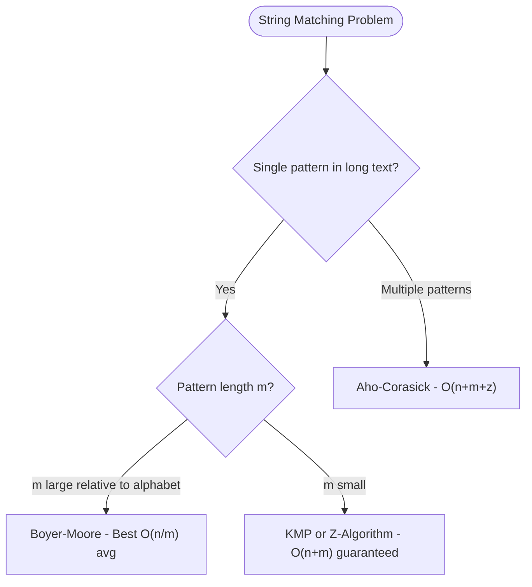
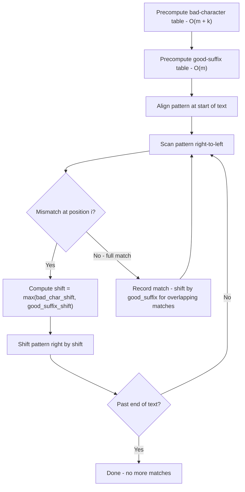
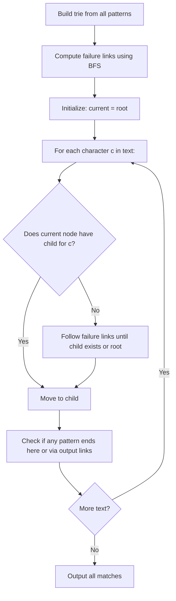
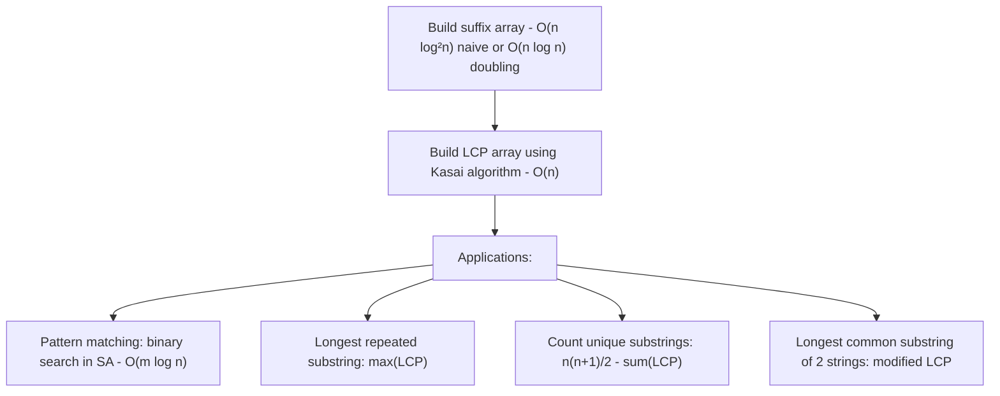
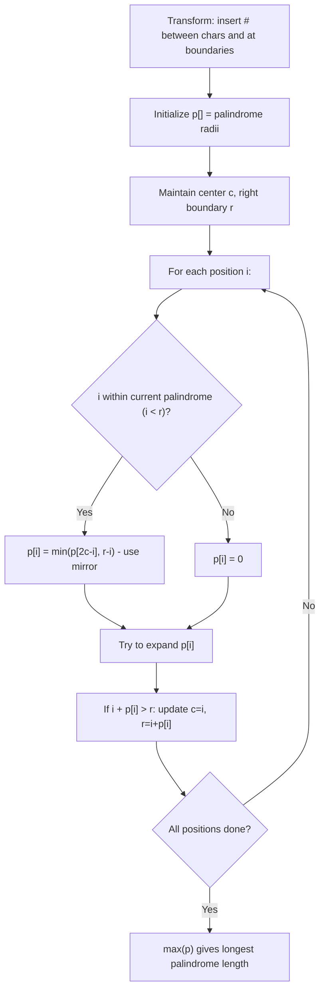
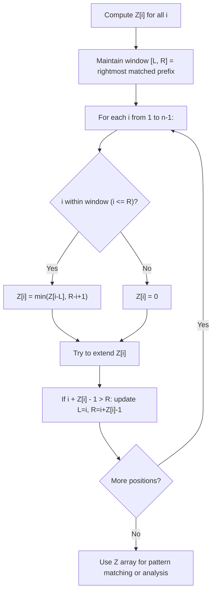
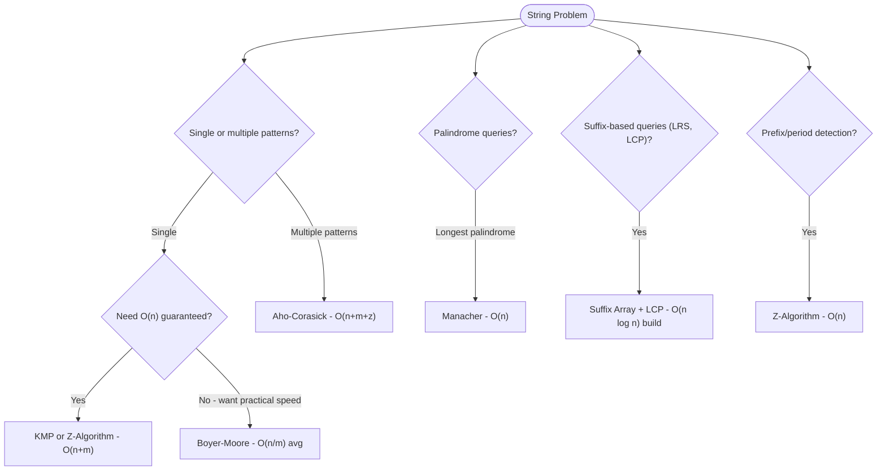

# Advanced String Algorithms

Covers Boyer-Moore, Aho-Corasick, Suffix Arrays, Manacher's Algorithm, and the Z-Algorithm. Each algorithm includes pattern recognition guides, Python and Java implementations, step-by-step examples, and interview Q&A.

---

## Quick Reference

| Algorithm       | Time Build    | Time Query       | Use Case                              |
|-----------------|---------------|------------------|---------------------------------------|
| Boyer-Moore     | O(m + k)      | O(n/m) avg       | Single pattern, long text             |
| Aho-Corasick    | O(m·k)        | O(n + m + z)     | Multiple patterns in one pass         |
| Suffix Array    | O(n log n)    | O((m + log n) log n) | Pattern indexing, LRS queries    |
| Manacher's      | O(n)          | —                | All palindromic substrings            |
| Z-Algorithm     | O(n)          | —                | Prefix matching, period detection     |

> k = alphabet size, z = number of matches, m = pattern length, n = text length

---

## Boyer-Moore

**Description**

Boyer-Moore scans the text right-to-left and uses two heuristics to skip large portions:
- **Bad character rule**: when mismatch at text[i], align so the last occurrence of text[i] in pattern is at position i.
- **Good suffix rule**: use the pattern's suffix structure to skip.

Achieves O(n/m) average-case (sublinear), O(nm) worst-case.

**Problem Recognition Flowchart**



**Execution Flowchart**



**Step-by-step Example**

```
Text:    "GCTAGCCATTA"
Pattern: "TTA" (m=3)

Bad-character table for "TTA":
  T → 1 (rightmost T is at index 1 in pattern)
  A → 2 (rightmost A is at index 2)
  Others → -1 (not in pattern)

Alignment 1 (pos=0): T C G A G C C A T T A
                      T T A
Scan right-to-left: A vs T → mismatch at i=0 in pattern.
  text[0+0]='T'. T is in pattern at idx 1.
  Bad-char shift = max(1, 0-(1)) = 2. Move to pos=2.

Alignment 2 (pos=2): ... T A G C C A T T A
                              T T A
Scan: A vs G → mismatch. G not in pattern → shift = 3. Move to pos=5.

Alignment 3 (pos=5): ... C C A T T A
                              T T A
Scan: A vs C → mismatch. C not in pattern → shift = 3. Move to pos=8.

Alignment 4 (pos=8):     T T A
Pattern: T T A → full match at position 8!
```

**Python Implementation**

```python
from typing import List

def boyer_moore(text: str, pattern: str) -> List[int]:
    """
    Boyer-Moore string matching with bad-character rule.
    Returns list of all match positions.
    Time: O(nm) worst, O(n/m) average.
    """
    n, m = len(text), len(pattern)
    if m == 0:
        return []
    if m > n:
        return []

    # Build bad-character table
    # bad_char[c] = rightmost position of c in pattern, or -1
    bad_char = {}
    for i, c in enumerate(pattern):
        bad_char[c] = i

    matches = []
    shift = 0  # shift of pattern w.r.t. text

    while shift <= n - m:
        j = m - 1  # scan from right

        # Scan right-to-left
        while j >= 0 and pattern[j] == text[shift + j]:
            j -= 1

        if j < 0:
            # Pattern found at shift
            matches.append(shift)
            # Shift to look for next occurrence
            next_char = text[shift + m] if shift + m < n else None
            shift += m - bad_char.get(next_char, -1) if next_char else 1
        else:
            # Mismatch at position j
            mismatch_char = text[shift + j]
            bc_shift = j - bad_char.get(mismatch_char, -1)
            shift += max(1, bc_shift)

    return matches


def boyer_moore_full(text: str, pattern: str) -> List[int]:
    """
    Boyer-Moore with both bad-character and good-suffix rules.
    More complete implementation.
    """
    n, m = len(text), len(pattern)
    if m == 0 or m > n:
        return []

    # Bad-character table
    bad_char = {c: i for i, c in enumerate(pattern)}

    # Good-suffix table
    # shift[j] = shift when mismatch at position j
    suffix = [0] * (m + 1)
    shift_gs = [m] * (m + 1)

    # Compute suffix lengths
    i, j = m, m + 1
    f = [0] * (m + 2)
    f[i] = j
    while i > 0:
        while j <= m and pattern[i - 1] != pattern[j - 1]:
            if shift_gs[j] == m:
                shift_gs[j] = j - i
            j = f[j]
        i -= 1
        j -= 1
        f[i] = j
    for i in range(m + 1):
        if shift_gs[i] == m:
            shift_gs[i] = j
        j = f[j] if j > 0 else j

    matches = []
    shift = 0
    while shift <= n - m:
        j = m - 1
        while j >= 0 and pattern[j] == text[shift + j]:
            j -= 1
        if j < 0:
            matches.append(shift)
            shift += shift_gs[0]
        else:
            bc_shift = j - bad_char.get(text[shift + j], -1)
            gs_shift = shift_gs[j + 1]
            shift += max(bc_shift, gs_shift)
    return matches
```

**Java Implementation**

```java
import java.util.*;

public class BoyerMoore {
    
    // Simple bad-character only version
    static List<Integer> search(String text, String pattern) {
        int n = text.length(), m = pattern.length();
        List<Integer> matches = new ArrayList<>();
        if (m == 0 || m > n) return matches;
        
        // Bad-character table
        int[] badChar = new int[256];
        Arrays.fill(badChar, -1);
        for (int i = 0; i < m; i++) {
            badChar[(int) pattern.charAt(i)] = i;
        }
        
        int shift = 0;
        while (shift <= n - m) {
            int j = m - 1;
            while (j >= 0 && pattern.charAt(j) == text.charAt(shift + j)) {
                j--;
            }
            if (j < 0) {
                matches.add(shift);
                int nextIdx = shift + m;
                int nextChar = (nextIdx < n) ? text.charAt(nextIdx) : -1;
                shift += (nextChar >= 0) ? m - badChar[nextChar] : 1;
            } else {
                int bc = j - badChar[(int) text.charAt(shift + j)];
                shift += Math.max(1, bc);
            }
        }
        return matches;
    }
    
    public static void main(String[] args) {
        System.out.println(search("GCTAGCCATTA", "TTA")); // [8]
        System.out.println(search("AABABAB", "ABAB"));   // [1, 3]
    }
}
```

**Interview Q&A**

1. **Q: Why is Boyer-Moore faster than simple pattern matching?**
   A: By scanning right-to-left and using character tables, it skips many positions without comparing. When the rightmost character of the pattern doesn't appear in the current window of text, it skips the entire window (length m positions). Average case is O(n/m) — sublinear.

2. **Q: When does Boyer-Moore degrade to O(nm)?**
   A: On binary strings with many matches, the good-suffix shift is small and bad-character doesn't help. Example: pattern "aaa" in text "aaaaaaa" — every position is a match and the shifts are small.

3. **Q: What's the difference between bad-character and good-suffix rules?**
   A: Bad-character aligns the mismatching text character with its rightmost occurrence in the pattern (or shifts past it). Good-suffix aligns the matched suffix of the pattern with its next occurrence in the pattern. Take the max of both shifts.

4. **Q: For an interview, which string matching algorithm should I default to?**
   A: KMP or Z-Algorithm for guaranteed O(n+m) without complex preprocessing. Mention Boyer-Moore for real-world performance if the interviewer asks for optimizations.

---

## Aho-Corasick Algorithm

**Description**

Aho-Corasick finds all occurrences of multiple patterns in a text in a single pass. Builds a trie of patterns augmented with failure links (like KMP), then scans text once matching all patterns simultaneously.

**Execution Flowchart**



**Complexity**

- Build: O(m × k) where m = total pattern length, k = alphabet size
- Search: O(n + m + z) where n = text length, z = number of matches

**Step-by-step Example**

```
Patterns: ["he", "she", "his", "hers"]
Text: "ushers"

Trie nodes:
  root → h → e → r → s (end: "hers")
                  ↑ end: "he"
       → s → h → e (end: "she")
       → h → i → s (end: "his")

Failure links (BFS order from root):
  fail["h"] = root
  fail["s"] = root
  fail["he"] = root (no shorter proper suffix of "he" is a trie prefix)
  fail["sh"] = "h" (suffix "h" of "sh" IS a trie prefix)
  fail["she"] = "he"
  fail["hi"] = root ("i" not a prefix)
  fail["his"] = "s" ... (no "is" in trie; try "s" → yes "s" is root child)
  fail["her"] = root

Output links (propagate matches through failure links):
  "she" → via fail → "he": also outputs "he" when "she" is matched

Scan "ushers":
  u: go to root (no u child)
  s: root → s
  h: s → sh (via child)
  e: sh → she → output "she" at pos 3; output link → "he" at pos 3
  r: fail(she) = he, he → her
  s: her → hers → output "hers" at pos 6

All matches: "she" at [1,3], "he" at [2,3], "hers" at [2,6]
(positions are start indices, 0-based)
```

**Python Implementation**

```python
from collections import deque
from typing import List, Tuple, Dict

class AhoCorasick:
    """Aho-Corasick multi-pattern string matching."""

    def __init__(self):
        self.goto = [{}]       # goto[node][char] = next_node
        self.fail = [0]        # failure link
        self.output = [[]]     # pattern IDs ending at each node
        self.patterns = []

    def add_pattern(self, pattern: str) -> None:
        """Add a pattern to the automaton."""
        pid = len(self.patterns)
        self.patterns.append(pattern)
        cur = 0
        for c in pattern:
            if c not in self.goto[cur]:
                self.goto[cur][c] = len(self.goto)
                self.goto.append({})
                self.fail.append(0)
                self.output.append([])
            cur = self.goto[cur][c]
        self.output[cur].append(pid)

    def build(self) -> None:
        """Build failure links and output links using BFS."""
        q = deque()
        for c, nxt in self.goto[0].items():
            self.fail[nxt] = 0
            q.append(nxt)

        while q:
            u = q.popleft()
            for c, v in self.goto[u].items():
                # Failure link: longest proper suffix of goto(u,c) that is a prefix
                f = self.fail[u]
                while f != 0 and c not in self.goto[f]:
                    f = self.fail[f]
                self.fail[v] = self.goto[f].get(c, 0)
                if self.fail[v] == v:
                    self.fail[v] = 0
                # Propagate output through failure link
                self.output[v] = self.output[v] + self.output[self.fail[v]]
                q.append(v)

    def search(self, text: str) -> List[Tuple[int, int]]:
        """
        Search text for all patterns.
        Returns list of (start_pos, pattern_id) matches.
        """
        results = []
        cur = 0
        for i, c in enumerate(text):
            while cur != 0 and c not in self.goto[cur]:
                cur = self.fail[cur]
            cur = self.goto[cur].get(c, 0)
            for pid in self.output[cur]:
                start = i - len(self.patterns[pid]) + 1
                results.append((start, pid))
        return results


# Example usage
ac = AhoCorasick()
for p in ["he", "she", "his", "hers"]:
    ac.add_pattern(p)
ac.build()
matches = ac.search("ushers")
for pos, pid in matches:
    print(f"Pattern '{ac.patterns[pid]}' at position {pos}")
```

**Java Implementation**

```java
import java.util.*;

public class AhoCorasick {
    int[][] goto_;
    int[] fail;
    List<Integer>[] output;
    List<String> patterns;
    static final int ALPHA = 26;
    int size;
    
    @SuppressWarnings("unchecked")
    AhoCorasick(int maxNodes) {
        goto_ = new int[maxNodes][ALPHA];
        for (int[] row : goto_) Arrays.fill(row, -1);
        fail = new int[maxNodes];
        output = new ArrayList[maxNodes];
        for (int i = 0; i < maxNodes; i++) output[i] = new ArrayList<>();
        patterns = new ArrayList<>();
        size = 1; // root = 0
    }
    
    void addPattern(String pattern) {
        int pid = patterns.size();
        patterns.add(pattern);
        int cur = 0;
        for (char ch : pattern.toCharArray()) {
            int c = ch - 'a';
            if (goto_[cur][c] == -1) {
                goto_[cur][c] = size++;
            }
            cur = goto_[cur][c];
        }
        output[cur].add(pid);
    }
    
    void build() {
        Queue<Integer> q = new LinkedList<>();
        for (int c = 0; c < ALPHA; c++) {
            if (goto_[0][c] == -1) goto_[0][c] = 0;
            else { fail[goto_[0][c]] = 0; q.add(goto_[0][c]); }
        }
        while (!q.isEmpty()) {
            int u = q.poll();
            for (int c = 0; c < ALPHA; c++) {
                if (goto_[u][c] == -1) {
                    goto_[u][c] = goto_[fail[u]][c];
                } else {
                    fail[goto_[u][c]] = goto_[fail[u]][c];
                    output[goto_[u][c]].addAll(output[fail[goto_[u][c]]]);
                    q.add(goto_[u][c]);
                }
            }
        }
    }
    
    List<int[]> search(String text) { // returns {start, patternId}
        List<int[]> results = new ArrayList<>();
        int cur = 0;
        for (int i = 0; i < text.length(); i++) {
            cur = goto_[cur][text.charAt(i) - 'a'];
            for (int pid : output[cur]) {
                results.add(new int[]{i - patterns.get(pid).length() + 1, pid});
            }
        }
        return results;
    }
}
```

**Interview Q&A**

1. **Q: How is Aho-Corasick different from running KMP for each pattern?**
   A: KMP for k patterns is O(n × k + sum(m)). Aho-Corasick processes the text once in O(n) after O(sum(m) × alphabet) preprocessing. The trie shares prefixes across patterns, and failure links enable simultaneous matching.

2. **Q: What are output links?**
   A: A node v may not directly end a pattern, but via its failure chain it might reach a node that does. Output links short-circuit this chain, letting us report all patterns matching at position i in O(z) without traversing the full failure chain each time.

3. **Q: What is the space complexity?**
   A: O(m × k) where m = total pattern length, k = alphabet size. For large alphabets (unicode), use hash maps instead of arrays for the goto table to reduce to O(m) space.

---

## Suffix Array & Suffix Tree

**Description**

A suffix array is the sorted order of all suffixes. With an LCP array (Longest Common Prefix), it enables O(log n) pattern queries, O(n) longest repeated substring, and counting unique substrings.

**Execution Flowchart**



**Complexity**

- Build SA: O(n log n) with efficient doubling
- LCP array: O(n) with Kasai
- Pattern query: O(m log n) with binary search

**Step-by-step Example**

```
String: "banana" (n=6, indices 0-5: b=0, a=1, n=2, a=3, n=4, a=5)

All suffixes:
  0: "banana"
  1: "anana"
  2: "nana"
  3: "ana"
  4: "na"
  5: "a"

Sorted (lexicographically):
  Rank 0: suffix[5] = "a"
  Rank 1: suffix[3] = "ana"
  Rank 2: suffix[1] = "anana"
  Rank 3: suffix[0] = "banana"
  Rank 4: suffix[4] = "na"
  Rank 5: suffix[2] = "nana"

Suffix array SA = [5, 3, 1, 0, 4, 2]

LCP array (Kasai):
  LCP[0] = 0 (no previous)
  LCP[1] = 1 ("a" vs "ana" share "a")
  LCP[2] = 3 ("ana" vs "anana" share "ana")
  LCP[3] = 0 ("anana" vs "banana" share nothing)
  LCP[4] = 0 ("banana" vs "na" share nothing)
  LCP[5] = 2 ("na" vs "nana" share "na")

LCP = [0, 1, 3, 0, 0, 2]
Longest repeated substring: max(LCP) = 3 → "ana" ✓
Unique substrings: 6*7/2 - (0+1+3+0+0+2) = 21 - 6 = 15
```

**Python Implementation**

```python
from typing import List, Tuple

def build_suffix_array(s: str) -> List[int]:
    """
    Build suffix array using O(n log n) prefix-doubling algorithm.
    Returns SA where SA[i] = start index of i-th lexicographically smallest suffix.
    """
    n = len(s)
    if n == 0:
        return []

    # Initial ranking by first character
    sa = sorted(range(n), key=lambda i: s[i])
    rank = {sa[i]: i for i in range(n)}

    gap = 1
    while gap < n:
        def sort_key(i):
            r1 = rank[i]
            r2 = rank[i + gap] if i + gap < n else -1
            return (r1, r2)

        sa = sorted(sa, key=sort_key)
        # Rerank
        new_rank = [0] * n
        for i in range(1, n):
            new_rank[sa[i]] = new_rank[sa[i - 1]]
            if sort_key(sa[i]) != sort_key(sa[i - 1]):
                new_rank[sa[i]] += 1
        rank = {i: new_rank[i] for i in range(n)}
        if new_rank[sa[n - 1]] == n - 1:
            break  # All ranks unique, done
        gap *= 2

    return sa


def build_lcp_array(s: str, sa: List[int]) -> List[int]:
    """
    Kasai algorithm: build LCP array from string and suffix array in O(n).
    LCP[i] = length of longest common prefix of SA[i-1] and SA[i].
    """
    n = len(s)
    rank = [0] * n
    for i, suf in enumerate(sa):
        rank[suf] = i

    lcp = [0] * n
    h = 0  # current match length
    for i in range(n):
        if rank[i] > 0:
            j = sa[rank[i] - 1]  # previous suffix in sorted order
            while i + h < n and j + h < n and s[i + h] == s[j + h]:
                h += 1
            lcp[rank[i]] = h
            if h > 0:
                h -= 1  # next i will share h-1 prefix chars
    return lcp


def pattern_search_sa(text: str, pattern: str, sa: List[int]) -> Tuple[int, int]:
    """
    Binary search in suffix array for pattern.
    Returns (lo, hi) range in SA where suffixes start with pattern.
    Returns (-1, -1) if not found.
    """
    m = len(pattern)
    n = len(text)

    # Binary search for leftmost occurrence
    lo, hi = 0, n
    while lo < hi:
        mid = (lo + hi) // 2
        if text[sa[mid]:sa[mid] + m] < pattern:
            lo = mid + 1
        else:
            hi = mid
    left = lo

    # Binary search for rightmost occurrence
    hi = n
    while lo < hi:
        mid = (lo + hi) // 2
        if text[sa[mid]:sa[mid] + m] <= pattern:
            lo = mid + 1
        else:
            hi = mid
    right = lo

    if left >= right:
        return -1, -1
    return left, right  # SA[left:right] are all matches


def longest_repeated_substring(s: str) -> str:
    """Find the longest repeated (non-overlapping) substring."""
    sa = build_suffix_array(s)
    lcp = build_lcp_array(s, sa)
    max_lcp = max(lcp)
    idx = lcp.index(max_lcp)
    return s[sa[idx]:sa[idx] + max_lcp]
```

**Java Implementation**

```java
import java.util.*;

public class SuffixArray {
    
    static int[] build(String s) {
        int n = s.length();
        Integer[] sa = new Integer[n];
        for (int i = 0; i < n; i++) sa[i] = i;
        
        int[] rank = new int[n];
        for (int i = 0; i < n; i++) rank[i] = s.charAt(i);
        
        int[] tmp = new int[n];
        for (int gap = 1; gap < n; gap *= 2) {
            final int[] r = rank, g = {gap};
            Arrays.sort(sa, (a, b) -> {
                if (r[a] != r[b]) return r[a] - r[b];
                int ra2 = a + g[0] < n ? r[a + g[0]] : -1;
                int rb2 = b + g[0] < n ? r[b + g[0]] : -1;
                return ra2 - rb2;
            });
            tmp[sa[0]] = 0;
            for (int i = 1; i < n; i++) {
                tmp[sa[i]] = tmp[sa[i-1]];
                int ra1 = r[sa[i]], ra2 = sa[i]+gap < n ? r[sa[i]+gap] : -1;
                int rb1 = r[sa[i-1]], rb2 = sa[i-1]+gap < n ? r[sa[i-1]+gap] : -1;
                if (ra1 != rb1 || ra2 != rb2) tmp[sa[i]]++;
            }
            rank = tmp.clone();
        }
        int[] result = new int[n];
        for (int i = 0; i < n; i++) result[i] = sa[i];
        return result;
    }
    
    static int[] buildLCP(String s, int[] sa) {
        int n = s.length();
        int[] rank = new int[n];
        for (int i = 0; i < n; i++) rank[sa[i]] = i;
        int[] lcp = new int[n];
        int h = 0;
        for (int i = 0; i < n; i++) {
            if (rank[i] > 0) {
                int j = sa[rank[i] - 1];
                while (i + h < n && j + h < n && s.charAt(i+h) == s.charAt(j+h)) h++;
                lcp[rank[i]] = h;
                if (h > 0) h--;
            }
        }
        return lcp;
    }
    
    public static void main(String[] args) {
        String s = "banana";
        int[] sa = build(s);
        int[] lcp = buildLCP(s, sa);
        System.out.println("SA: " + Arrays.toString(sa));  // [5,3,1,0,4,2]
        System.out.println("LCP: " + Arrays.toString(lcp)); // [0,1,3,0,0,2]
    }
}
```

**Interview Q&A**

1. **Q: Why is suffix array better than suffix tree for pattern matching?**
   A: Both have similar asymptotic complexity, but suffix arrays are simpler to implement, cache-friendly (contiguous memory), and use less memory. Suffix trees are pointer-heavy and harder to code in 45-minute interviews.

2. **Q: How do you count all unique substrings using suffix array and LCP?**
   A: Total substrings = n(n+1)/2. Total repeated substrings (counted with multiplicity) = sum of LCP. Unique substrings = n(n+1)/2 - sum(LCP).

3. **Q: What is the Kasai algorithm and why is it O(n)?**
   A: Kasai builds the LCP array by using the insight: if suffix starting at i has LCP value h with the previous suffix in sorted order, then suffix starting at i+1 has LCP value ≥ h-1. This allows h to only decrease by at most 1 per step, giving O(n) total.

4. **Q: How would you find the longest common substring of two strings using suffix arrays?**
   A: Concatenate s1 + "$" + s2 ($ is a separator not in either string), build one suffix array, then find the maximum LCP[i] where SA[i] and SA[i-1] come from different strings.

---

## Manacher's Algorithm

**Description**

Manacher's finds all palindromic substrings in O(n) by using previously computed radii to avoid redundant comparisons. Key insight: palindromes within a known palindrome share symmetry.

**Execution Flowchart**



**Step-by-step Example**

```
String: "babad"
Transformed: "#b#a#b#a#d#"
Indices:      0 1 2 3 4 5 6 7 8 9 10

Compute p[i]:
i=0 (#): p[0]=0
i=1 (b): expand: "b" → p[1]=1. c=1, r=2.
i=2 (#): mirror of 2 in c=1 is 2*1-2=0. p[0]=0. p[2]=min(0,2-2)=0. Try expand: # vs # → no (b≠a). p[2]=0.
i=3 (a): i=3>r=2. Start fresh p[3]=0. Expand: "#a#" matches → p[3]=1. c=3, r=4.
i=4 (#): mirror=2*3-4=2. p[2]=0. p[4]=min(0,4-4)=0. Try expand: b≠a. p[4]=0.
i=5 (b): mirror=2*3-5=1. p[1]=1. p[5]=min(1,4-5)=min(1,-1)=... i=5>r=4.
  Start fresh p[5]=0. Expand: i=5 is 'b'. Check i±1: chars at 4(#) and 6(#) match.
  Check i±2: chars at 3(a) and 7(a) match.
  Check i±3: chars at 2(#) and 8(#) match.
  Check i±4: chars at 1(b) and 9(d) → NO. p[5]=3. c=5, r=8.
  Palindrome "bab" centered at index 5 in transformed = centered at "b" = "bab".
i=6 (#): mirror=2*5-6=4. p[4]=0. p[6]=min(0, 8-6)=0. Expand: a≠b. p[6]=0.
i=7 (a): mirror=2*5-7=3. p[3]=1. p[7]=min(1, 8-7)=1. Expand: position 7±2: chars at 5(b) and 9(d) → NO. p[7]=1.
i=8 (#): mirror=2*5-8=2. p[2]=0. p[8]=min(0, 8-8)=0. Expand: a≠d. p[8]=0.
i=9 (d): i=9>r=8. p[9]=0. Expand: d is isolated. p[9]=1. c=9, r=10.
i=10(#): p[10]=0.

p = [0, 1, 0, 1, 0, 3, 0, 1, 0, 1, 0]
Max p = 3 at index 5 → palindrome length = 3, center index in original = (5-1)//2 = 2
Longest palindrome: s[(5-3)//2 : (5+3)//2] = s[1:4] = "aba" ... 
Actually: center_orig = (5-1)//2 = 2, length = 3, substring = s[2-1:2+2] = s[1:4] = "aba"
Wait, "babad" → longest palindrome is "bab" (indices 0-2) or "aba" (indices 1-3), both length 3.
```

**Python Implementation**

```python
def manacher(s: str) -> str:
    """
    Find the longest palindromic substring using Manacher's algorithm.
    Time: O(n), Space: O(n).
    """
    # Transform: "abba" → "#a#b#b#a#"
    t = '#' + '#'.join(s) + '#'
    n = len(t)
    p = [0] * n  # palindrome radii
    c = r = 0    # center and right boundary of rightmost palindrome

    for i in range(n):
        if i < r:
            mirror = 2 * c - i
            p[i] = min(p[mirror], r - i)

        # Expand around center i
        left, right = i - (p[i] + 1), i + (p[i] + 1)
        while left >= 0 and right < n and t[left] == t[right]:
            p[i] += 1
            left -= 1
            right += 1

        # Update rightmost palindrome
        if i + p[i] > r:
            c, r = i, i + p[i]

    # Find the maximum palindrome
    max_len = max(p)
    center = p.index(max_len)
    start = (center - max_len) // 2
    return s[start:start + max_len]


def manacher_all(s: str) -> list:
    """
    Return all palindromic substrings with their start and length.
    Uses p[] array to enumerate all palindromes.
    """
    t = '#' + '#'.join(s) + '#'
    n = len(t)
    p = [0] * n
    c = r = 0

    for i in range(n):
        if i < r:
            p[i] = min(p[2 * c - i], r - i)
        while i - p[i] - 1 >= 0 and i + p[i] + 1 < n and t[i - p[i] - 1] == t[i + p[i] + 1]:
            p[i] += 1
        if i + p[i] > r:
            c, r = i, i + p[i]

    palindromes = []
    for i in range(n):
        if p[i] > 0:
            length = p[i]
            start = (i - length) // 2
            palindromes.append((start, length))
    return palindromes


def count_palindromic_substrings(s: str) -> int:
    """Count all palindromic substrings (including single characters)."""
    t = '#' + '#'.join(s) + '#'
    n = len(t)
    p = [0] * n
    c = r = 0

    for i in range(n):
        if i < r:
            p[i] = min(p[2 * c - i], r - i)
        while i - p[i] - 1 >= 0 and i + p[i] + 1 < n and t[i - p[i] - 1] == t[i + p[i] + 1]:
            p[i] += 1
        if i + p[i] > r:
            c, r = i, i + p[i]

    return sum((pi + 1) // 2 for pi in p)
```

**Java Implementation**

```java
public class Manacher {
    
    static String longestPalindrome(String s) {
        StringBuilder sb = new StringBuilder("#");
        for (char c : s.toCharArray()) { sb.append(c); sb.append('#'); }
        String t = sb.toString();
        int n = t.length();
        int[] p = new int[n];
        int center = 0, right = 0;
        int maxLen = 0, maxCenter = 0;
        
        for (int i = 0; i < n; i++) {
            if (i < right) {
                p[i] = Math.min(p[2 * center - i], right - i);
            }
            while (i - p[i] - 1 >= 0 && i + p[i] + 1 < n 
                   && t.charAt(i - p[i] - 1) == t.charAt(i + p[i] + 1)) {
                p[i]++;
            }
            if (i + p[i] > right) {
                center = i; right = i + p[i];
            }
            if (p[i] > maxLen) {
                maxLen = p[i]; maxCenter = i;
            }
        }
        int start = (maxCenter - maxLen) / 2;
        return s.substring(start, start + maxLen);
    }
    
    public static void main(String[] args) {
        System.out.println(longestPalindrome("babad")); // "bab" or "aba"
        System.out.println(longestPalindrome("cbbd"));  // "bb"
        System.out.println(longestPalindrome("a"));     // "a"
    }
}
```

**Interview Q&A**

1. **Q: Why does the mirror trick in Manacher's work?**
   A: If we know palindrome centered at c extends to r, and i < r, then the mirror of i is at 2c-i. The substring from mirror to c mirrors the substring from c to i (palindromic symmetry). So p[i] ≥ min(p[mirror], r-i). We then try to extend further.

2. **Q: Why do we transform the string with #?**
   A: The transformation makes all palindromes (even-length and odd-length) uniform. Every character position in the original string corresponds to an odd-index position in the transformed string, and every gap corresponds to an even-index position. This eliminates the even/odd case distinction.

3. **Q: What is the time complexity, and why is it O(n)?**
   A: The right boundary r only moves right (never left). Each time we expand p[i], r increases. Each time we use the mirror shortcut, we don't expand. Total expansions across all i is O(n) since r can increase at most n times.

---

## Z-Algorithm

**Description**

Z[i] = length of the longest substring starting at i that is also a prefix of s. Enables O(n+m) pattern matching via string concatenation. Simpler to implement than KMP.

**Execution Flowchart**



**Step-by-step Example**

```
String: "aabxaa"
Z[0] = 6 (by definition)

i=1: not in window. Compare s[1..] = "abxaa" with s[0..] = "aabxaa"
     a=a, b≠a → Z[1]=1. Update L=1, R=1.

i=2: i>R=1. Compare s[2..] = "bxaa" with s = "aabxaa"
     b≠a → Z[2]=0.

i=3: i>R. Compare s[3..] = "xaa" with s: x≠a → Z[3]=0.

i=4: i>R. Compare s[4..] = "aa" with s = "aabxaa"
     a=a, a=a, b≠x → Z[4]=2. Update L=4, R=5.

i=5: i<=R=5. mirror = 5-L=5-4=1. Z[1]=1, R-i=5-5=0. Z[5]=min(1,0)=0.
     Try extend: Z[5] already 0, but can we expand?
     s[5+0]='a' vs s[0]='a' → match. Z[5]=1. R=5+1-1=5 (no change since R already 5).
     s[5+1] out of bounds → stop. Z[5]=1.

Z = [6, 1, 0, 0, 2, 1]

Pattern matching for P="aa" in T="aabxaa":
  Concatenate: "aa" + "#" + "aabxaa" = "aa#aabxaa"
  Indices:      01  2 3456789
  Z = [9, 1, 0, 2, 1, 0, 0, 2, 1]
  Matches where Z[i] >= len(P) = 2:
    i=3: Z[3]=2, position in T = 3 - 3 = 0 (match at T[0..1])
    i=7: Z[7]=2, position in T = 7 - 3 = 4 (match at T[4..5])
  Pattern "aa" found at positions 0 and 4. ✓
```

**Python Implementation**

```python
from typing import List

def z_function(s: str) -> List[int]:
    """
    Compute Z-array where Z[i] = length of longest substring starting at i
    that is also a prefix of s.
    Z[0] = len(s) by convention.
    Time: O(n), Space: O(n).
    """
    n = len(s)
    z = [0] * n
    z[0] = n
    L = R = 0  # window [L, R] of the rightmost matching prefix

    for i in range(1, n):
        if i <= R:
            z[i] = min(z[i - L], R - i + 1)
        # Try to extend
        while i + z[i] < n and s[z[i]] == s[i + z[i]]:
            z[i] += 1
        # Update window
        if i + z[i] - 1 > R:
            L, R = i, i + z[i] - 1

    return z


def z_pattern_search(text: str, pattern: str) -> List[int]:
    """
    Find all occurrences of pattern in text using Z-algorithm.
    Time: O(n + m).
    """
    concat = pattern + '#' + text
    z = z_function(concat)
    m = len(pattern)
    return [i - m - 1 for i in range(m + 1, len(concat)) if z[i] >= m]


def find_period(s: str) -> int:
    """
    Find the smallest period of string s.
    A string s has period p if s[i] = s[i % p] for all i.
    Returns: smallest period length.
    """
    n = len(s)
    z = z_function(s)
    for p in range(1, n + 1):
        if n % p == 0 and (p == n or z[p] == n - p):
            return p
    return n  # String itself is the only period
```

**Java Implementation**

```java
import java.util.*;

public class ZAlgorithm {
    
    static int[] zFunction(String s) {
        int n = s.length();
        int[] z = new int[n];
        z[0] = n;
        int L = 0, R = 0;
        for (int i = 1; i < n; i++) {
            if (i <= R) {
                z[i] = Math.min(z[i - L], R - i + 1);
            }
            while (i + z[i] < n && s.charAt(z[i]) == s.charAt(i + z[i])) {
                z[i]++;
            }
            if (i + z[i] - 1 > R) {
                L = i; R = i + z[i] - 1;
            }
        }
        return z;
    }
    
    static List<Integer> search(String text, String pattern) {
        String concat = pattern + "#" + text;
        int[] z = zFunction(concat);
        int m = pattern.length();
        List<Integer> matches = new ArrayList<>();
        for (int i = m + 1; i < concat.length(); i++) {
            if (z[i] >= m) matches.add(i - m - 1);
        }
        return matches;
    }
    
    public static void main(String[] args) {
        System.out.println(search("aabxaa", "aa")); // [0, 4]
        System.out.println(Arrays.toString(zFunction("aabxaa"))); // [6,1,0,0,2,1]
    }
}
```

**Interview Q&A**

1. **Q: How is the Z-algorithm faster than simple pattern matching?**
   A: Simple matching is O(nm). Z-algorithm processes the concatenated string P#T in O(n+m) with a sliding window, avoiding redundant comparisons via the [L,R] window.

2. **Q: Is Z-algorithm or KMP easier to implement?**
   A: Z-algorithm is generally considered simpler — it has one array and the window update logic is straightforward. KMP requires understanding failure functions (partial match table) which is less intuitive.

3. **Q: How does the Z-algorithm detect string periodicity?**
   A: A string s of length n has period p if Z[p] = n-p (the suffix starting at p matches the prefix of length n-p). The smallest such p is the minimal period.

4. **Q: Can Z-algorithm find all occurrences of pattern in text?**
   A: Yes — concatenate as P + "#" + T, compute Z, then all positions i (offset by m+1) where Z[i] ≥ m are match positions in T. The "#" separator ensures Z values don't cross the boundary.

---

## Summary: Choosing the Right String Algorithm



---

## References

- CP-Algorithms: string-matching, suffix-array, aho-corasick, manacher
- Sedgewick & Wayne: Strings chapter
- LeetCode: #5 (longest palindrome), #14 (longest common prefix), #28 (strStr)
