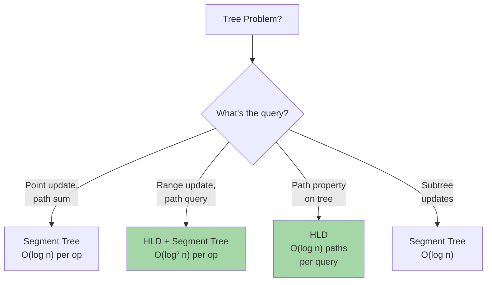

# Heavy-Light Decomposition: Tree Path Queries & Updates

Heavy-Light Decomposition (HLD) decomposes a tree into disjoint paths, enabling O(log² n) path queries/updates on trees. It's more elegant than segment trees for tree problems.

---

## When to Use HLD



**HLD is ideal for:**
- Path sum/min/max on tree
- Range updates on paths
- Path queries in dynamic trees
- Decomposing tree into paths for processing

---

## HLD Basics

### Concept

Every path in a tree can be decomposed into O(log n) disjoint heavy paths.

**Heavy Edge:** The edge to the child with the largest subtree.
**Heavy Path:** Path formed by following heavy edges.

```
Tree:
       1
      /|\
     2 3 4
    /|
   5 6 (subtree size 5, so 2→5 is heavy)
   |
   7

Heavy paths:
  1→2→5→7 (heavy path 1)
  1→3, 1→4 (light edges)
  2→6 (light edge)

Any path from node A to B uses ≤ log n heavy paths
(each time we go up via light edge, subtree size halves)
```

### Key Properties

| Property | Value |
|----------|-------|
| Heavy paths | O(log n) per path in tree |
| Path decomposition | O(n) preprocessing |
| Query time | O(log² n) with segment tree |
| Update time | O(log² n) |
| Space | O(n) |

---

## 1. Basic Heavy-Light Decomposition

**Algorithm:**
1. DFS to compute subtree sizes
2. Greedily assign heavy edges (to child with max subtree)
3. DFS again to compute depth in heavy path chain

```python
# Pseudocode
def hld_decompose(tree):
    # Phase 1: Compute subtree sizes
    for node in postorder_dfs(tree):
        size[node] = 1 + sum(size[child] for child in node.children)
    
    # Phase 2: Assign heavy edges and chains
    chain_id = 0
    for node in dfs(tree):
        if not visited[node]:
            start_chain(node, chain_id)
            for child in node.children:
                if is_heavy_edge(node, child):
                    hld_decompose(child)  # Continue chain
                else:
                    hld_decompose(child)  # New chain
        chain_id += 1
```

### Implementation

**Python:**
```python
class HeavyLightDecomposition:
    def __init__(self, n, adj):
        self.n = n
        self.adj = adj
        self.size = [0] * n
        self.parent = [-1] * n
        self.depth = [0] * n
        self.chain_id = [-1] * n
        self.position_in_chain = [0] * n
        self.chain_head = []
        self.chain_nodes = []
        
        self.dfs1(0, -1)
        self.dfs2(0, -1, 0)
    
    def dfs1(self, u, p):
        """Compute subtree sizes and parents"""
        self.parent[u] = p
        self.size[u] = 1
        for v in self.adj[u]:
            if v != p:
                self.depth[v] = self.depth[u] + 1
                self.dfs1(v, u)
                self.size[u] += self.size[v]
    
    def dfs2(self, u, p, chain):
        """Assign chain IDs and positions"""
        self.chain_id[u] = chain
        self.position_in_chain[u] = len(self.chain_nodes)
        self.chain_nodes.append(u)
        
        # Find child with max subtree (heavy child)
        heavy_child = -1
        for v in self.adj[u]:
            if v != p and (heavy_child == -1 or self.size[v] > self.size[heavy_child]):
                heavy_child = v
        
        # Continue chain for heavy child
        if heavy_child != -1:
            self.dfs2(heavy_child, u, chain)
        
        # Start new chains for light children
        for v in self.adj[u]:
            if v != p and v != heavy_child:
                self.dfs2(v, u, len(self.chain_head))
                self.chain_head.append(v)
    
    def lca(self, u, v):
        """Find lowest common ancestor"""
        while self.chain_id[u] != self.chain_id[v]:
            if self.depth[self.chain_head[self.chain_id[u]]] > self.depth[self.chain_head[self.chain_id[v]]]:
                u = self.parent[self.chain_head[self.chain_id[u]]]
            else:
                v = self.parent[self.chain_head[self.chain_id[v]]]
        
        if self.depth[u] > self.depth[v]:
            return v
        return u
    
    def path_decompose(self, u, v):
        """Decompose path from u to v into chain segments"""
        path_segments = []
        
        while self.chain_id[u] != self.chain_id[v]:
            if self.depth[self.chain_head[self.chain_id[u]]] > self.depth[self.chain_head[self.chain_id[v]]]:
                # Go up from u
                chain_head = self.chain_head[self.chain_id[u]]
                path_segments.append((self.position_in_chain[chain_head], 
                                     self.position_in_chain[u]))
                u = self.parent[chain_head]
            else:
                # Go up from v
                chain_head = self.chain_head[self.chain_id[v]]
                path_segments.append((self.position_in_chain[chain_head], 
                                     self.position_in_chain[v]))
                v = self.parent[chain_head]
        
        # Same chain
        if self.depth[u] > self.depth[v]:
            u, v = v, u
        path_segments.append((self.position_in_chain[u], self.position_in_chain[v]))
        
        return path_segments
```

**Java:**
```java
public class HeavyLightDecomposition {
    int n;
    List<Integer>[] adj;
    int[] size, parent, depth, chainId, posInChain;
    List<Integer> chainHead, chainNodes;
    
    public HeavyLightDecomposition(int n, List<Integer>[] adj) {
        this.n = n;
        this.adj = adj;
        this.size = new int[n];
        this.parent = new int[n];
        this.depth = new int[n];
        this.chainId = new int[n];
        this.posInChain = new int[n];
        this.chainHead = new ArrayList<>();
        this.chainNodes = new ArrayList<>();
        
        dfs1(0, -1);
        dfs2(0, -1, 0);
    }
    
    void dfs1(int u, int p) {
        parent[u] = p;
        size[u] = 1;
        for (int v : adj[u]) {
            if (v != p) {
                depth[v] = depth[u] + 1;
                dfs1(v, u);
                size[u] += size[v];
            }
        }
    }
    
    void dfs2(int u, int p, int chain) {
        chainId[u] = chain;
        posInChain[u] = chainNodes.size();
        chainNodes.add(u);
        
        int heavyChild = -1;
        for (int v : adj[u]) {
            if (v != p && (heavyChild == -1 || size[v] > size[heavyChild])) {
                heavyChild = v;
            }
        }
        
        if (heavyChild != -1) {
            dfs2(heavyChild, u, chain);
        }
        
        for (int v : adj[u]) {
            if (v != p && v != heavyChild) {
                chainHead.add(v);
                dfs2(v, u, chainHead.size() - 1);
            }
        }
    }
    
    public int lca(int u, int v) {
        while (chainId[u] != chainId[v]) {
            if (depth[chainHead.get(chainId[u])] > depth[chainHead.get(chainId[v])]) {
                u = parent[chainHead.get(chainId[u])];
            } else {
                v = parent[chainHead.get(chainId[v])];
            }
        }
        return depth[u] > depth[v] ? v : u;
    }
}
```

---

## 2. Path Query with Segment Tree

Combine HLD with segment tree for O(log² n) path queries.

```python
def path_query_sum(u, v, seg_tree):
    """Sum of values on path from u to v"""
    path_segs = hld.path_decompose(u, v)
    result = 0
    for chain_id, start_pos, end_pos in path_segs:
        # Query segment tree on this chain
        result += seg_tree.query(start_pos, end_pos)
    return result
```

---

## HLD vs Alternatives

| Problem | HLD | Segment Tree | LCA + Binary Lifting |
|---------|-----|--------------|---------------------|
| Path sum | O(log² n) | O(n log n) per path | O(log n) per depth |
| Path min | O(log² n) | O(n log n) per path | O(log n) per depth |
| LCA | O(log n) | - | O(log n) |
| Subtree sum | - | O(log n) | - |
| Simplicity | ★★★ | ★★★★★ | ★★★★ |

**Use HLD when:**
- Path queries on large trees
- Need decomposition insight
- Competitive programming

**Use Segment Tree when:**
- Subtree operations
- Simpler code preferred
- Memory budget tight

---

## Common Interview Questions

- **"Sum of values on path from u to v in a tree."** Use HLD to decompose path into O(log n) chains. Use segment tree on each chain. Total: O(log² n).

- **"Update all nodes on path u→v."** Same decomposition, use range update with lazy propagation on segment tree.

- **"Why is HLD O(log n) paths per query?"** Each heavy edge goes to child with >50% of subtree. Going up via light edge to parent halves remaining subtree. Max log n light edges before reaching root.

- **"Can you find LCA with HLD?"** Yes, decompose until same chain, then use depth comparison. O(log n).

---

## HLD Checklist

- ✓ Understand heavy edge (to child with max subtree)
- ✓ DFS1: compute subtree sizes
- ✓ DFS2: assign chains and positions
- ✓ Path decomposition: repeatedly jump to chain head of heavier chain
- ✓ Combine with segment tree for range queries
- ✓ LCA by comparing chain depths
- ✓ Test on small trees first
- ✓ O(log n) chains guaranteed by subtree size argument
