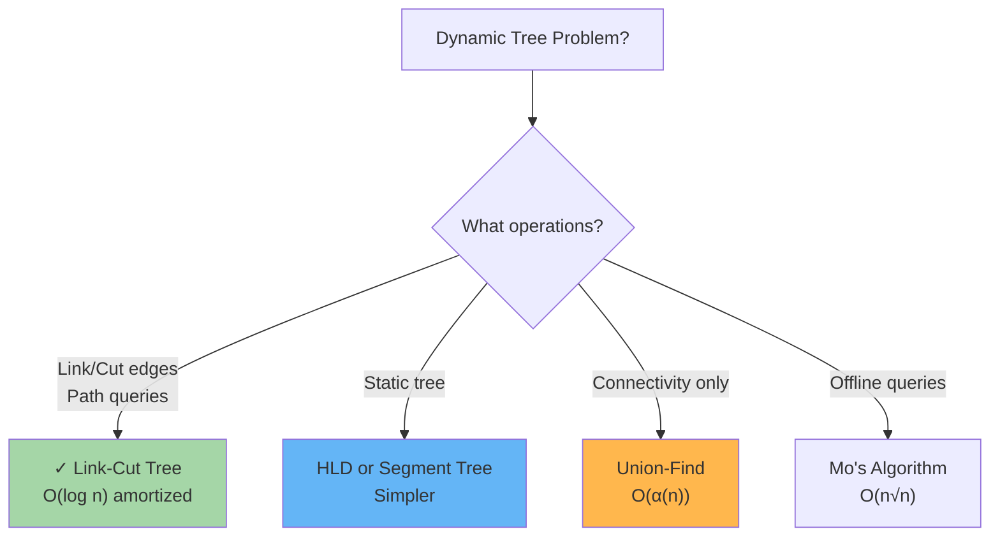

# Link-Cut Trees: Dynamic Tree Operations

Link-Cut Trees (LCT) are sophisticated dynamic data structures supporting dynamic connectivity with path aggregation queries in O(log n) amortized time per operation.

---

## When to Use Link-Cut Trees



**Link-Cut Trees excel at:**
- Dynamic forest connectivity (add/remove edges)
- Path aggregation (sum, min, max on paths)
- Offline dynamic graph problems
- Competitive programming heavy lifting

---

## LCT Basics: Splay Trees + Solid/Dashed Edges

### Concept

- **Solid Edges:** Edges in the splay tree (form a heavy path)
- **Dashed Edges:** Edges not in splay tree (connect to other splay trees)

Each component is a splay tree (compressed path), and dashed edges connect components.

```
Example tree:
  1---2---3
   \ 
    4

Represent as splay forest:
  Splay tree 1: 1-2-3 (chain via solid edges)
  Dashed edge: 1 to 4 (connects to another splay tree)
```

### Operations (O(log n) amortized)

| Operation | Meaning | Time |
|-----------|---------|------|
| **link(u, v)** | Connect subtree at u to v via edge | O(log n) |
| **cut(u, v)** | Remove edge between u and v | O(log n) |
| **connected(u, v)** | Check if u and v in same tree | O(log n) |
| **path_query(u, v)** | Aggregate value on path u→v | O(log n) |
| **path_update(u, v, x)** | Update all nodes on path u→v | O(log n) |

---

## 1. Splay Tree Foundation

LCT is built on splay trees. Splay: move accessed node to root via rotations.

```python
class SplayNode:
    def __init__(self, val):
        self.val = val
        self.left = self.right = self.parent = None
        self.flip = False  # Lazy propagation flag
    
    def splay(self):
        """Move this node to root of splay tree"""
        while self.parent:
            p = self.parent
            if not p.parent:  # p is root
                self.zig()
            elif (self is p.left) == (p is p.parent.left):
                p.zig_zig()
            else:
                self.zig_zag()
    
    def zig(self):
        """Single rotation to move to root"""
        if self is self.parent.left:
            # Right rotate
            p = self.parent
            p.left = self.right
            if self.right:
                self.right.parent = p
            self.parent = p.parent
            if p.parent:
                if p is p.parent.left:
                    p.parent.left = self
                else:
                    p.parent.right = self
            self.right = p
            p.parent = self
        else:
            # Left rotate (symmetric)
            p = self.parent
            p.right = self.left
            if self.left:
                self.left.parent = p
            self.parent = p.parent
            if p.parent:
                if p is p.parent.left:
                    p.parent.left = self
                else:
                    p.parent.right = self
            self.left = p
            p.parent = self
    
    def zig_zig(self):
        """Double rotation (zig then zig)"""
        if self is self.parent.left:
            self.parent.zig()
            self.zig()
        else:
            self.parent.zig()
            self.zig()
    
    def zig_zag(self):
        """Double rotation (zig then opposite)"""
        self.zig()
        self.zig()
```

---

## 2. Link-Cut Tree Operations

**High-level sketch (simplified):**

```python
class LinkCutTree:
    def link(self, u, v):
        """Connect subtree at u to v"""
        # Splay u to root
        u.splay()
        # v becomes parent of u
        u.parent = v
    
    def cut(self, u, v):
        """Remove edge u-v"""
        # Splay u, then remove right child
        u.splay()
        if u.right:
            u.right.parent = None
            u.right = None
    
    def connected(self, u, v):
        """Check if u and v in same tree"""
        u.splay()
        v.splay()
        # If u is in subtree rooted at v, they're connected
        return u.parent is not None or u is v
    
    def path_aggregate(self, u, v):
        """Get aggregation (sum, min, max) on path u→v"""
        u.splay()
        # Access all nodes on path from u to v
        return get_path_value(u, v)
```

---

## 3. Practical Example: Dynamic Connectivity + Path Sum

**Problem:** Forest of trees. Support:
- link(u, v): Add edge
- cut(u, v): Remove edge  
- query(u, v): Sum of values on path

**Solution:** Use Link-Cut Tree with path aggregation.

```python
class DynamicPathSum:
    def __init__(self, n):
        self.lct = LinkCutTree()
        self.nodes = [LCTNode(i) for i in range(n)]
    
    def link(self, u, v):
        """Connect edge u-v"""
        self.lct.link(self.nodes[u], self.nodes[v])
    
    def cut(self, u, v):
        """Remove edge u-v"""
        self.lct.cut(self.nodes[u], self.nodes[v])
    
    def path_sum(self, u, v):
        """Sum of values on path u→v"""
        return self.lct.path_aggregate(self.nodes[u], self.nodes[v])
```

---

## LCT vs Alternatives

| Problem | LCT | Union-Find | HLD + SegTree |
|---------|-----|-----------|--------------|
| **Dynamic link** | O(log n) | O(α(n)) | N/A |
| **Dynamic cut** | O(log n) | N/A | N/A |
| **Path query** | O(log n) | N/A | O(log² n) |
| **LCA** | O(log n) | N/A | O(log n) |
| **Code complexity** | ★★★☆☆ | ★★★★★ | ★★★★☆ |
| **Amortized time** | Proven | Proven | Proved |

**Use LCT when:**
- Need dynamic edge additions/deletions
- Path queries on dynamic forest
- Willing to implement complex structure

**Use simpler alternatives when:**
- Static trees (use HLD)
- Only connectivity (use Union-Find)
- Time pressure in interviews

---

## Common Interview Questions

- **"Maintain a dynamic forest with link/cut/query operations."** Link-Cut Tree with splay forests. O(log n) amortized per operation.

- **"Why is LCT O(log n) amortized?"** Splaying is O(log n) amortized (each access is O(log n) after amortized analysis). Rotations are local, maintaining balance.

- **"Can you use Link-Cut Tree for MST?"** Yes, for **dynamic MST** problem. Maintain forest of MST edges, support dynamic edge weight updates.

- **"Difference between LCT and HLD?"** HLD is static decomposition; LCT is dynamic. HLD is simpler; LCT is more powerful. HLD: O(log² n) with segment tree; LCT: O(log n) native.

- **"How do you update path values in LCT?"** Splay endpoints, update aggregation on path. Lazy propagation for range updates.

---

## Implementation Complexity

Link-Cut Trees are **notoriously hard to implement**. Key challenges:
- Splay tree rotations are error-prone
- Managing solid/dashed edges correctly
- Path queries require careful aggregation
- Debugging is difficult

**Use only if:**
- Problem explicitly requires dynamic trees
- Other solutions don't work
- Prepared to spend hours debugging

**For interviews:** Mention understanding of LCT. Implement simpler alternatives if possible.

---

## LCT Checklist

- ✓ Understand splay trees (self-balancing via rotations)
- ✓ Zig, zig-zig, zig-zag rotations
- ✓ Solid edges (in splay tree) vs dashed edges (parent pointers)
- ✓ Each operation: splay to access, then modify
- ✓ Path aggregation: access path via splay operations
- ✓ Amortized analysis: O(log n) per op on average
- ✓ Test on small examples (track splay tree structure)
- ✓ Know when to use: dynamic trees with path queries

**Reality check:** If interviewer expects LCT, they want to see you know it exists and general strategy. Detailed implementation only if time permits.
