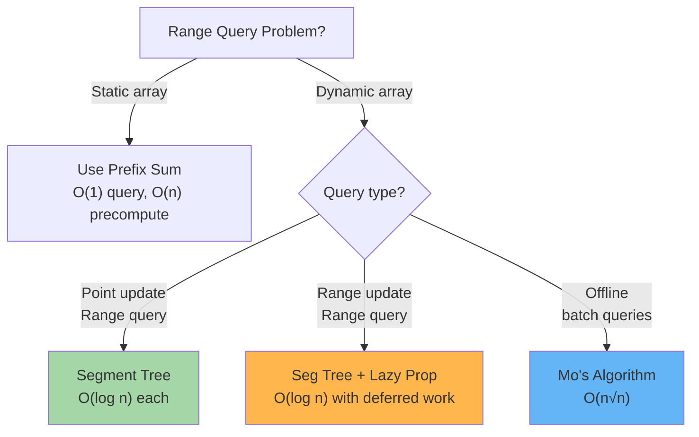

# Segment Trees: Range Queries & Updates

A segment tree is a binary tree where each node represents an interval and stores aggregate information (sum, min, max, etc.). It enables O(log n) range queries and point/range updates on large arrays.

---

## When to Use Segment Trees



**Segment Tree is ideal for:**
- Point updates + range queries (sum, min, max)
- Range updates + range queries (with lazy propagation)
- Interval tree problems (overlapping intervals)

---

## Segment Tree Basics

### Structure

A segment tree for array of size n:
- **Nodes:** 2n - 1 total
- **Height:** O(log n)
- **Index Convention:** 1-indexed, node i has children 2i and 2i+1

```
Array: [1, 3, 5, 7, 9]

Tree (sum):
           25 (0..4)
         /          \
      9 (0..2)    16 (3..4)
      /    \       /     \
    4      5     7       9
   / \    / \   /
  1   3  5   (empty)  7
```

### Core Operations

| Operation | Complexity | Use |
|-----------|-----------|-----|
| Build | O(n) | Construct tree from array |
| Point Update | O(log n) | Change single element |
| Range Query (sum/min/max) | O(log n) | Query interval |
| Range Update (lazy) | O(log n) | Deferred updates |

---

## 1. Basic Segment Tree (Point Update, Range Query)

**Problem:** Given array, answer queries like "sum of elements from index i to j" with ability to update single elements.

```
Array: [1, 3, 5, 7, 9]

Query: sum(1, 3) = 3 + 5 + 7 = 15
Update: arr[1] = 10
Query: sum(1, 3) = 10 + 5 + 7 = 22
```

### Implementation

**Python:**
```python
class SegmentTree:
    def __init__(self, arr):
        self.n = len(arr)
        self.tree = [0] * (4 * self.n)
        if self.n > 0:
            self.build(arr, 0, 0, self.n - 1)
    
    def build(self, arr, node, start, end):
        if start == end:
            self.tree[node] = arr[start]
        else:
            mid = (start + end) // 2
            left_child = 2 * node + 1
            right_child = 2 * node + 2
            self.build(arr, left_child, start, mid)
            self.build(arr, right_child, mid + 1, end)
            self.tree[node] = self.tree[left_child] + self.tree[right_child]
    
    def update(self, node, start, end, idx, val):
        if start == end:
            self.tree[node] = val
        else:
            mid = (start + end) // 2
            left_child = 2 * node + 1
            right_child = 2 * node + 2
            if idx <= mid:
                self.update(left_child, start, mid, idx, val)
            else:
                self.update(right_child, mid + 1, end, idx, val)
            self.tree[node] = self.tree[left_child] + self.tree[right_child]
    
    def query(self, node, start, end, l, r):
        if r < start or end < l:
            return 0  # No overlap
        if l <= start and end <= r:
            return self.tree[node]  # Complete overlap
        
        mid = (start + end) // 2
        left_child = 2 * node + 1
        right_child = 2 * node + 2
        left_sum = self.query(left_child, start, mid, l, r)
        right_sum = self.query(right_child, mid + 1, end, l, r)
        return left_sum + right_sum
    
    def update_point(self, idx, val):
        self.update(0, 0, self.n - 1, idx, val)
    
    def query_range(self, l, r):
        return self.query(0, 0, self.n - 1, l, r)
```

**Java:**
```java
public class SegmentTree {
    private int[] tree;
    private int n;
    
    public SegmentTree(int[] arr) {
        this.n = arr.length;
        this.tree = new int[4 * n];
        if (n > 0) {
            build(arr, 0, 0, n - 1);
        }
    }
    
    private void build(int[] arr, int node, int start, int end) {
        if (start == end) {
            tree[node] = arr[start];
        } else {
            int mid = (start + end) / 2;
            int leftChild = 2 * node + 1;
            int rightChild = 2 * node + 2;
            build(arr, leftChild, start, mid);
            build(arr, rightChild, mid + 1, end);
            tree[node] = tree[leftChild] + tree[rightChild];
        }
    }
    
    public void update(int idx, int val) {
        update(0, 0, n - 1, idx, val);
    }
    
    private void update(int node, int start, int end, int idx, int val) {
        if (start == end) {
            tree[node] = val;
        } else {
            int mid = (start + end) / 2;
            int leftChild = 2 * node + 1;
            int rightChild = 2 * node + 2;
            if (idx <= mid) {
                update(leftChild, start, mid, idx, val);
            } else {
                update(rightChild, mid + 1, end, idx, val);
            }
            tree[node] = tree[leftChild] + tree[rightChild];
        }
    }
    
    public int query(int l, int r) {
        return query(0, 0, n - 1, l, r);
    }
    
    private int query(int node, int start, int end, int l, int r) {
        if (r < start || end < l) {
            return 0;
        }
        if (l <= start && end <= r) {
            return tree[node];
        }
        int mid = (start + end) / 2;
        int leftChild = 2 * node + 1;
        int rightChild = 2 * node + 2;
        int leftSum = query(leftChild, start, mid, l, r);
        int rightSum = query(rightChild, mid + 1, end, l, r);
        return leftSum + rightSum;
    }
}
```

### Complexity
- **Build:** O(n)
- **Update:** O(log n)
- **Query:** O(log n)
- **Space:** O(n)

---

## 2. Range Update with Lazy Propagation

**Problem:** Support range updates (add value to all elements in range) + range queries efficiently.

**Key Idea:** Defer updates to children until needed. Mark parent as "dirty" and propagate lazily.

```
Array: [1, 3, 5, 7, 9]

RangeUpdate(1, 3, +10): Add 10 to arr[1..3]
  Instead of updating all children:
  Mark node as having pending update = +10
  Only push down when querying deeper

RangeQuery(1, 3):
  If node is completely covered and marked dirty:
    Return tree[node] + pending_update * range_size
  Else: push down pending to children first
```

### Implementation (Python)

**Python:**
```python
class LazySegmentTree:
    def __init__(self, arr):
        self.n = len(arr)
        self.tree = [0] * (4 * self.n)
        self.lazy = [0] * (4 * self.n)
        if self.n > 0:
            self.build(arr, 0, 0, self.n - 1)
    
    def build(self, arr, node, start, end):
        if start == end:
            self.tree[node] = arr[start]
        else:
            mid = (start + end) // 2
            left = 2 * node + 1
            right = 2 * node + 2
            self.build(arr, left, start, mid)
            self.build(arr, right, mid + 1, end)
            self.tree[node] = self.tree[left] + self.tree[right]
    
    def _push(self, node, start, end):
        if self.lazy[node] != 0:
            self.tree[node] += self.lazy[node] * (end - start + 1)
            
            if start != end:
                left = 2 * node + 1
                right = 2 * node + 2
                self.lazy[left] += self.lazy[node]
                self.lazy[right] += self.lazy[node]
            
            self.lazy[node] = 0
    
    def update_range(self, l, r, val):
        self._update_range(0, 0, self.n - 1, l, r, val)
    
    def _update_range(self, node, start, end, l, r, val):
        self._push(node, start, end)
        
        if start > r or end < l:
            return
        
        if l <= start and end <= r:
            self.lazy[node] += val
            self._push(node, start, end)
            return
        
        mid = (start + end) // 2
        left = 2 * node + 1
        right = 2 * node + 2
        self._update_range(left, start, mid, l, r, val)
        self._update_range(right, mid + 1, end, l, r, val)
        
        self._push(left, start, mid)
        self._push(right, mid + 1, end)
        self.tree[node] = self.tree[left] + self.tree[right]
    
    def query_range(self, l, r):
        return self._query_range(0, 0, self.n - 1, l, r)
    
    def _query_range(self, node, start, end, l, r):
        if start > r or end < l:
            return 0
        
        self._push(node, start, end)
        
        if l <= start and end <= r:
            return self.tree[node]
        
        mid = (start + end) // 2
        left = 2 * node + 1
        right = 2 * node + 2
        left_sum = self._query_range(left, start, mid, l, r)
        right_sum = self._query_range(right, mid + 1, end, l, r)
        return left_sum + right_sum
```

**Java:**
```java
public class LazySegmentTree {
    private int[] tree, lazy;
    private int n;
    
    public LazySegmentTree(int[] arr) {
        this.n = arr.length;
        this.tree = new int[4 * n];
        this.lazy = new int[4 * n];
        if (n > 0) {
            build(arr, 0, 0, n - 1);
        }
    }
    
    private void build(int[] arr, int node, int start, int end) {
        if (start == end) {
            tree[node] = arr[start];
        } else {
            int mid = (start + end) / 2;
            int left = 2 * node + 1;
            int right = 2 * node + 2;
            build(arr, left, start, mid);
            build(arr, right, mid + 1, end);
            tree[node] = tree[left] + tree[right];
        }
    }
    
    private void push(int node, int start, int end) {
        if (lazy[node] != 0) {
            tree[node] += lazy[node] * (end - start + 1);
            
            if (start != end) {
                int left = 2 * node + 1;
                int right = 2 * node + 2;
                lazy[left] += lazy[node];
                lazy[right] += lazy[node];
            }
            lazy[node] = 0;
        }
    }
    
    public void updateRange(int l, int r, int val) {
        updateRange(0, 0, n - 1, l, r, val);
    }
    
    private void updateRange(int node, int start, int end, int l, int r, int val) {
        push(node, start, end);
        
        if (start > r || end < l) return;
        
        if (l <= start && end <= r) {
            lazy[node] += val;
            push(node, start, end);
            return;
        }
        
        int mid = (start + end) / 2;
        int left = 2 * node + 1;
        int right = 2 * node + 2;
        updateRange(left, start, mid, l, r, val);
        updateRange(right, mid + 1, end, l, r, val);
        
        push(left, start, mid);
        push(right, mid + 1, end);
        tree[node] = tree[left] + tree[right];
    }
    
    public long queryRange(int l, int r) {
        return queryRange(0, 0, n - 1, l, r);
    }
    
    private long queryRange(int node, int start, int end, int l, int r) {
        if (start > r || end < l) return 0;
        
        push(node, start, end);
        
        if (l <= start && end <= r) {
            return tree[node];
        }
        
        int mid = (start + end) / 2;
        int left = 2 * node + 1;
        int right = 2 * node + 2;
        long leftSum = queryRange(left, start, mid, l, r);
        long rightSum = queryRange(right, mid + 1, end, l, r);
        return leftSum + rightSum;
    }
}
```

### Complexity
- **Build:** O(n)
- **Range Update:** O(log n)
- **Range Query:** O(log n)
- **Space:** O(n)

---

## 3. Min/Max Queries

Segment tree generalizes to any associative operation. Change the merge function:

```python
# Sum tree
def merge(left, right):
    return left + right

# Min tree
def merge(left, right):
    return min(left, right)

# Max tree
def merge(left, right):
    return max(left, right)

# GCD tree
def merge(left, right):
    return gcd(left, right)
```

---

## Segment Tree vs. Alternatives

| Data Structure | Point Update | Range Update | Range Query | Space |
|----------------|--------------|--------------|-------------|-------|
| Array | O(1) | O(n) | O(n) | O(n) |
| Prefix Sum | O(n) | O(n) | O(1) | O(n) |
| **Segment Tree** | **O(log n)** | **O(log n)** | **O(log n)** | **O(n)** |
| Fenwick Tree | O(log n) | O(log n) | O(log n) | O(n) |
| Sqrt Decomposition | O(√n) | O(√n) | O(√n) | O(n) |

**Choose Segment Tree when:**
- Both updates and range queries are needed
- Range updates are required
- Need to handle min/max/GCD queries
- Lazy propagation is beneficial

---

## Common Interview Questions

- **"Range sum queries with point updates."** Standard segment tree with sum merge. Build O(n), query/update O(log n).

- **"Range sum queries with range updates."** Lazy propagation. Mark parent as having pending update, push down only when needed.

- **"How many elements in range [L, R] are greater than X?"** Segment tree storing counts or separate segment tree for each value. Or offline with sorting.

- **"Difference between Segment Tree and Fenwick Tree?"** Segment trees are simpler but use more space (4n vs 2n). Fenwick is more efficient and elegant but harder to implement for complex operations. Both are O(log n).

- **"Can you do 2D range queries?"** Yes, 2D segment tree (tree of trees). Build outer tree on rows, each node has a segment tree on columns. O(log² n) per operation.

- **"Why store partial sums in leaf nodes?"** Allows efficient range queries. Without tree structure, querying range is O(n). With tree, decompose into O(log n) segments.

---

## Segment Tree Checklist

- ✓ Understand 1-indexed tree layout (node i has children 2i, 2i+1)
- ✓ Build: recursive, bottom-up merge
- ✓ Update: find leaf, update, merge back up
- ✓ Query: three cases (no overlap, complete overlap, partial overlap)
- ✓ Lazy propagation: push down pending updates only when needed
- ✓ Generalize merge function (sum, min, max, gcd, etc.)
- ✓ Test edge cases: single element, all elements, empty ranges
- ✓ Space: 4n is safe upper bound for 1-indexed tree
