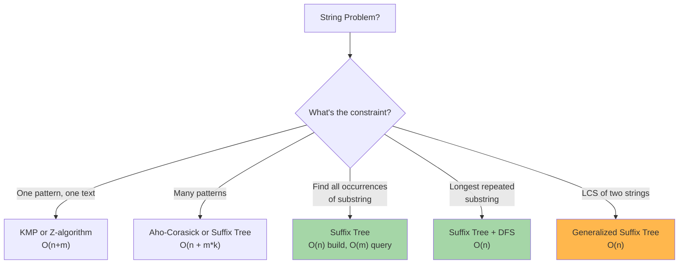

# Suffix Trees: Fast String Matching & Text Algorithms

A suffix tree is a compressed trie of all suffixes of a string. It enables O(m) pattern matching, longest repeated substring, and many string operations on preprocessed text.

---

## When to Use Suffix Trees



---

## Suffix Tree Basics

### Structure

A suffix tree is a trie with compressed edges (each edge represents a substring, not single char).

```
Text: "banana$"
Suffixes:
  banana$
  anana$
  nana$
  ana$
  na$
  a$
  $

Suffix Tree (compressed):
       root
      /  |  \
     a   n   $
    / \  |
   na  $ $
  / \
 na  $
 |
 $
```

### Key Properties

| Property | Value |
|----------|-------|
| Nodes | O(n) |
| Edges | O(n) |
| Build Time (Ukkonen) | O(n) |
| Pattern Search | O(m) |
| Space | O(n) |

---

## 1. Building Suffix Tree (Ukkonen's Algorithm)

**Key Idea:** Build suffix tree incrementally, using suffix links to avoid re-traversing.

```
Text: "banana$"

Suffix links allow fast jumping between suffixes:
  When at node for "ana", suffix link points to node for "na"
  Avoids redundant work in next iteration
```

### Complexity
- **Time:** O(n) with suffix links
- **Space:** O(n) for tree

### Implementation (Simplified - Python)

**Python:**
```python
class SuffixTreeNode:
    def __init__(self):
        self.children = {}
        self.suffix_link = None
        self.start = -1
        self.end = -1
        self.is_leaf = False

class SuffixTree:
    def __init__(self, text):
        self.text = text + '$'
        self.n = len(self.text)
        self.root = SuffixTreeNode()
        self.build()
    
    def build(self):
        """Simplified suffix tree build (not full Ukkonen)"""
        for i in range(self.n):
            self._insert_suffix(self.text[i:], i)
    
    def _insert_suffix(self, suffix, start):
        node = self.root
        for j, char in enumerate(suffix):
            if char not in node.children:
                new_node = SuffixTreeNode()
                new_node.start = start + j
                new_node.end = self.n
                new_node.is_leaf = (j == len(suffix) - 1)
                node.children[char] = new_node
                node = new_node
            else:
                node = node.children[char]
    
    def search(self, pattern):
        """Find all occurrences of pattern - O(m + count)"""
        node = self.root
        for char in pattern:
            if char not in node.children:
                return []
            node = node.children[char]
        
        # All suffixes in this subtree start with pattern
        positions = []
        self._collect_positions(node, positions)
        return positions
    
    def _collect_positions(self, node, positions):
        if node.is_leaf:
            positions.append(node.start)
        for child in node.children.values():
            self._collect_positions(child, positions)
```

**Java (Simplified):**
```java
public class SuffixTree {
    class Node {
        Map<Character, Node> children = new HashMap<>();
        Node suffixLink;
        int start, end;
        boolean isLeaf;
    }
    
    private String text;
    private Node root;
    private int n;
    
    public SuffixTree(String text) {
        this.text = text + "$";
        this.n = this.text.length();
        this.root = new Node();
        build();
    }
    
    private void build() {
        for (int i = 0; i < n; i++) {
            insertSuffix(text.substring(i), i);
        }
    }
    
    private void insertSuffix(String suffix, int start) {
        Node node = root;
        for (int j = 0; j < suffix.length(); j++) {
            char c = suffix.charAt(j);
            if (!node.children.containsKey(c)) {
                Node newNode = new Node();
                newNode.start = start + j;
                newNode.end = n;
                newNode.isLeaf = (j == suffix.length() - 1);
                node.children.put(c, newNode);
                node = newNode;
            } else {
                node = node.children.get(c);
            }
        }
    }
    
    public List<Integer> search(String pattern) {
        Node node = root;
        for (char c : pattern.toCharArray()) {
            if (!node.children.containsKey(c)) {
                return new ArrayList<>();
            }
            node = node.children.get(c);
        }
        
        List<Integer> positions = new ArrayList<>();
        collectPositions(node, positions);
        return positions;
    }
    
    private void collectPositions(Node node, List<Integer> positions) {
        if (node.isLeaf) {
            positions.add(node.start);
        }
        for (Node child : node.children.values()) {
            collectPositions(child, positions);
        }
    }
}
```

---

## 2. Longest Repeated Substring

**Problem:** Find longest substring appearing at least twice.

**Algorithm:** Build suffix tree, DFS to find deepest internal node.

```
Text: "abcabcxyz"

Suffixes:
  abcabcxyz
  bcabcxyz
  cabcxyz
  abcxyz
  bcxyz
  cxyz
  xyz
  yz
  z

Suffix tree nodes represent substrings.
Deepest internal node = longest substring with ≥2 occurrences

In this case: "abc" appears twice
Result: "abc" (or any 3-char prefix)
```

### Implementation

**Python:**
```python
def longest_repeated_substring(text):
    tree = SuffixTree(text)
    
    def dfs(node, depth):
        if not node.children:
            return -1  # Leaf
        
        max_depth = 0
        for child in node.children.values():
            max_depth = max(max_depth, dfs(child, depth + 1))
        
        if len(node.children) >= 2:  # Internal node (multiple branches)
            return depth
        else:
            return max_depth
    
    return dfs(tree.root, 0)
```

---

## 3. Longest Common Substring (LCS) of Two Strings

**Problem:** Find longest substring appearing in both strings.

**Algorithm:** Build generalized suffix tree for both strings, mark which text each suffix belongs to.

```
Text1: "abcde"
Text2: "bcxyz"

Generalized suffix tree contains suffixes of both.
Find deepest node with suffixes from both texts.

Result: "bc" is longest common substring
```

### Implementation

**Python:**
```python
def longest_common_substring(text1, text2):
    # Generalized suffix tree (concatenate with separator)
    combined = text1 + '#' + text2 + '$'
    tree = SuffixTree(combined)
    
    def dfs(node, depth, has_text1, has_text2):
        if not node.children:
            return -1
        
        max_depth = 0
        for child in node.children.values():
            max_depth = max(max_depth, dfs(child, depth + 1, has_text1, has_text2))
        
        # Check if this node has suffixes from both texts
        if has_text1 and has_text2:
            return depth
        return max_depth
    
    return dfs(tree.root, 0, False, False)
```

---

## Suffix Tree vs Alternatives

| Problem | Suffix Tree | Alternative | Time |
|---------|-------------|-------------|------|
| Single pattern search | O(n+m) | KMP: O(n+m) | Same |
| Multiple patterns | O(n+Σm_i) | Aho-Corasick: O(n+Σm_i+k) | Same |
| Count occurrences | O(n+m) | Regex: O(nm) | Better |
| Longest repeat | O(n) | Naive: O(n²) | Better |
| LCS | O(n+m) | DP: O(nm) | Better |
| All substrings | O(n) | Naive: O(n²) | Better |

**Suffix Tree is best for:**
- Preprocessing text once, many queries
- Complex string properties (LCS, repetitions)
- Competitive programming with memory budget

**Use KMP/Z-algo instead for:**
- Single pattern match
- Simple, fast code needed
- Memory-constrained

---

## Common Interview Questions

- **"Find all occurrences of pattern P in text T."** Build suffix tree for T in O(n). Query P in O(m). Return all leaf descendants of pattern node.

- **"What's the longest repeated substring?"** Build suffix tree, DFS to find deepest internal node (appears in multiple suffixes). O(n).

- **"Find LCS of two strings."** Build generalized suffix tree (concatenate with separator). Find deepest node with suffixes from both strings. O(n+m).

- **"How is suffix tree different from suffix array?"** Suffix tree is explicit trie (faster queries O(m)), suffix array is sorted suffixes (compact O(n log n) build, requires binary search O(m log n)).

- **"Can you use suffix tree for multiple pattern matching?"** Yes, but Aho-Corasick is often simpler and comparable complexity.

---

## Suffix Tree Checklist

- ✓ Understand suffix definition: all rotations starting from each position
- ✓ Compressed edges: each edge is substring, not single char
- ✓ Suffix links: jump between suffixes for efficient building
- ✓ O(n) build with Ukkonen's algorithm
- ✓ O(m) pattern search from root
- ✓ DFS on tree for complex properties
- ✓ Generalized suffix tree for multiple strings (use separator like #)
- ✓ Compare with suffix array when space is critical
