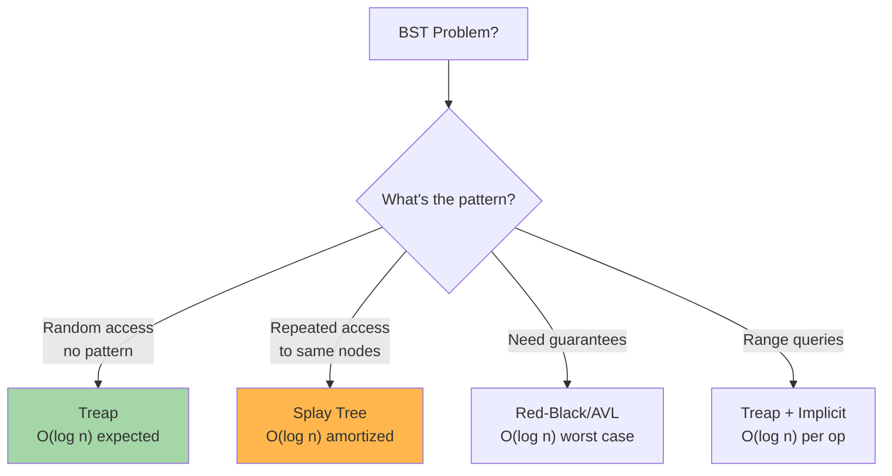

# Treaps & Balanced Trees: Randomized & Adaptive Data Structures

Treaps (Tree + Heap) are randomized balanced BSTs. Splay Trees are adaptive BSTs that self-optimize for accessed elements. Both maintain balance in O(log n) amortized/expected time.

---

## When to Use Treaps vs Splay Trees



---

## 1. Treap (Cartesian Tree)

A Treap combines:
- **BST property:** Left < parent < Right (by key)
- **Heap property:** Parent priority > Children priorities (by random priority)

```
Keys:    3, 1, 4, 1, 5
Treap:        
           4(p=100)           ← Max priority (root)
          /  \
      1(p=80) 5(p=70)
      /  \
    3    1
```

### Properties

| Property | Value |
|----------|-------|
| Balance guarantee | O(log n) height w.h.p |
| Insert | O(log n) expected |
| Delete | O(log n) expected |
| Search | O(log n) expected |
| Space | O(n) |
| Advantage | Simpler than red-black trees |

### Implementation

**Python:**
```python
import random

class TreapNode:
    def __init__(self, key, val=None):
        self.key = key
        self.val = val
        self.priority = random.random()  # Random priority
        self.left = self.right = None
        self.size = 1

class Treap:
    def __init__(self):
        self.root = None
    
    def insert(self, key, val=None):
        self.root = self._insert(self.root, key, val)
    
    def _insert(self, node, key, val):
        if not node:
            return TreapNode(key, val)
        
        if key < node.key:
            node.left = self._insert(node.left, key, val)
            if node.left.priority > node.priority:
                node = self._rotate_right(node)
        elif key > node.key:
            node.right = self._insert(node.right, key, val)
            if node.right.priority > node.priority:
                node = self._rotate_left(node)
        else:
            node.val = val  # Update existing key
        
        node.size = 1 + (node.left.size if node.left else 0) + (node.right.size if node.right else 0)
        return node
    
    def delete(self, key):
        self.root = self._delete(self.root, key)
    
    def _delete(self, node, key):
        if not node:
            return None
        
        if key < node.key:
            node.left = self._delete(node.left, key)
        elif key > node.key:
            node.right = self._delete(node.right, key)
        else:
            # Found node to delete
            if not node.left:
                return node.right
            if not node.right:
                return node.left
            
            # Both children: rotate higher priority child up
            if node.left.priority > node.right.priority:
                node = self._rotate_right(node)
                node.right = self._delete(node.right, key)
            else:
                node = self._rotate_left(node)
                node.left = self._delete(node.left, key)
        
        if node:
            node.size = 1 + (node.left.size if node.left else 0) + (node.right.size if node.right else 0)
        return node
    
    def search(self, key):
        node = self.root
        while node:
            if key == node.key:
                return node.val
            elif key < node.key:
                node = node.left
            else:
                node = node.right
        return None
    
    def _rotate_left(self, node):
        right = node.right
        node.right = right.left
        right.left = node
        right.size = node.size
        node.size = 1 + (node.left.size if node.left else 0) + (node.right.size if node.right else 0)
        return right
    
    def _rotate_right(self, node):
        left = node.left
        node.left = left.right
        left.right = node
        left.size = node.size
        node.size = 1 + (node.left.size if node.left else 0) + (node.right.size if node.right else 0)
        return left
    
    def kth_element(self, k):
        """Find k-th smallest element (0-indexed)"""
        return self._kth(self.root, k)
    
    def _kth(self, node, k):
        if not node:
            return None
        left_size = node.left.size if node.left else 0
        if k == left_size:
            return node.key
        elif k < left_size:
            return self._kth(node.left, k)
        else:
            return self._kth(node.right, k - left_size - 1)
```

**Java:**
```java
import java.util.*;

public class Treap {
    class Node {
        int key, val;
        double priority;
        Node left, right;
        int size = 1;
        
        Node(int key, int val) {
            this.key = key;
            this.val = val;
            this.priority = Math.random();
        }
    }
    
    private Node root;
    
    public void insert(int key, int val) {
        root = insert(root, key, val);
    }
    
    private Node insert(Node node, int key, int val) {
        if (node == null) {
            return new Node(key, val);
        }
        
        if (key < node.key) {
            node.left = insert(node.left, key, val);
            if (node.left.priority > node.priority) {
                node = rotateRight(node);
            }
        } else if (key > node.key) {
            node.right = insert(node.right, key, val);
            if (node.right.priority > node.priority) {
                node = rotateLeft(node);
            }
        } else {
            node.val = val;
        }
        
        node.size = 1 + (node.left != null ? node.left.size : 0) + (node.right != null ? node.right.size : 0);
        return node;
    }
    
    private Node rotateLeft(Node node) {
        Node right = node.right;
        node.right = right.left;
        right.left = node;
        right.size = node.size;
        node.size = 1 + (node.left != null ? node.left.size : 0) + (node.right != null ? node.right.size : 0);
        return right;
    }
    
    private Node rotateRight(Node node) {
        Node left = node.left;
        node.left = left.right;
        left.right = node;
        left.size = node.size;
        node.size = 1 + (node.left != null ? node.left.size : 0) + (node.right != null ? node.right.size : 0);
        return left;
    }
}
```

---

## 2. Splay Tree

A splay tree self-optimizes by splaying (moving accessed element to root).

```python
class SplayTree:
    def __init__(self):
        self.root = None
    
    def search(self, key):
        self.root = self._splay(self.root, key)
        if self.root and self.root.key == key:
            return self.root.val
        return None
    
    def _splay(self, node, key):
        if not node:
            return None
        
        if key < node.key:
            if not node.left:
                return node
            
            if key < node.left.key:
                # Zig-zig: left-left
                node.left.left = self._splay(node.left.left, key)
                node = self._rotate_right(node)
            else:
                # Zig-zag: left-right
                node.left = self._splay(node.left, key)
            
            return self._rotate_right(node) if node.left else node
        
        elif key > node.key:
            if not node.right:
                return node
            
            if key > node.right.key:
                # Zig-zig: right-right
                node.right.right = self._splay(node.right.right, key)
                node = self._rotate_left(node)
            else:
                # Zig-zag: right-left
                node.right = self._splay(node.right, key)
            
            return self._rotate_left(node) if node.right else node
        
        return node
    
    def insert(self, key, val):
        if not self.root:
            self.root = TreapNode(key, val)
            return
        
        self.root = self._splay(self.root, key)
        if self.root.key == key:
            self.root.val = val
        else:
            new_node = TreapNode(key, val)
            if key < self.root.key:
                new_node.right = self.root
                self.root = new_node
            else:
                new_node.left = self.root
                self.root = new_node
```

### Splay Tree Advantages

- **Adaptive:** Frequently accessed elements are near root (O(1) amortized)
- **No explicit balance:** Tree balances itself based on access pattern
- **Competitive:** Optimal for any sequence of operations up to constant factor
- **Space efficient:** Only pointers, no balance info

---

## Treap vs Splay Tree

| Aspect | Treap | Splay Tree |
|--------|-------|-----------|
| **Balance** | Random priorities | Access-driven |
| **Expected time** | O(log n) | O(log n) amortized |
| **Worst case** | O(log n) w.h.p | O(n) unlikely |
| **Adaptive** | No | Yes |
| **Implementation** | Simpler | Complex rotations |
| **Use case** | Random access | Cache-like patterns |

---

## Implicit Treap: Range Operations

Treaps can store indices implicitly (order statistics tree).

```python
class ImplicitTreap:
    """Treap for range operations without explicit keys"""
    
    def split(self, node, size):
        """Split treap: left has 'size' elements"""
        if not node:
            return None, None
        
        if node.left_size < size:
            left, right = self.split(node.right, size - node.left_size - 1)
            node.right = left
            return node, right
        else:
            left, right = self.split(node.left, size)
            node.left = right
            return left, node
    
    def merge(self, left, right):
        """Merge two treaps"""
        if not left:
            return right
        if not right:
            return left
        
        if left.priority > right.priority:
            left.right = self.merge(left.right, right)
            return left
        else:
            right.left = self.merge(left, right.left)
            return right
    
    def range_update(self, l, r, val):
        """Set all elements in range [l, r) to val"""
        left, right = self.split(self.root, l)
        mid, right = self.split(right, r - l)
        mid = self.set_all(mid, val)
        self.root = self.merge(self.merge(left, mid), right)
    
    def set_all(self, node, val):
        if node:
            node.val = val
            node.lazy = True
        return node
```

---

## Common Interview Questions

- **"Implement a balanced BST."** Treap is simpler than Red-Black. Random priorities guarantee O(log n) balance.

- **"Design a data structure for k-th smallest queries."** Use Treap with size augmentation. O(log n) per query.

- **"What's the difference between Treap and Splay Tree?"** Treap: random priorities, guaranteed balance. Splay: access-driven, adapts to usage pattern.

- **"Can you do range operations in Treap?"** Yes, use implicit Treap with split/merge. O(log n) per range operation.

- **"Why is Treap harder than Red-Black Tree in interviews?"** Requires understanding randomization + BST properties + rotations.

---

## Balanced Tree Checklist

- ✓ Treap: insert/delete/search O(log n) expected
- ✓ Random priorities prevent worst-case input
- ✓ Rotations maintain BST and heap properties
- ✓ Size augmentation for k-th queries
- ✓ Splay trees: move accessed to root
- ✓ Splay operations: zig, zig-zig, zig-zag
- ✓ Implicit Treap: split/merge for ranges
- ✓ Test on small examples
- ✓ Know when to use each variant
