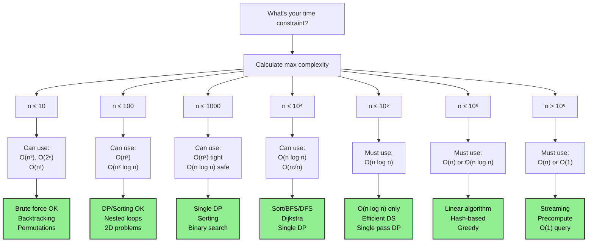
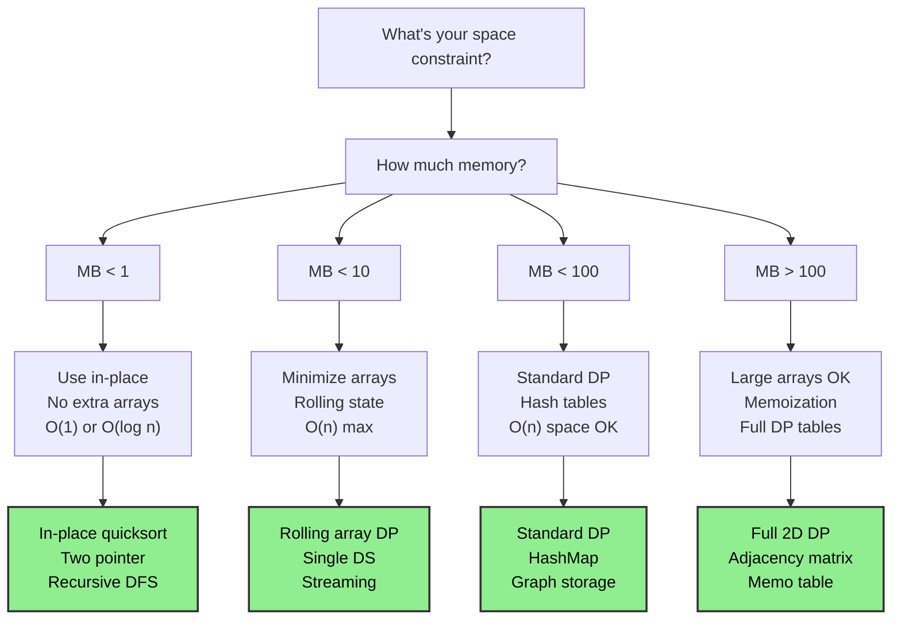
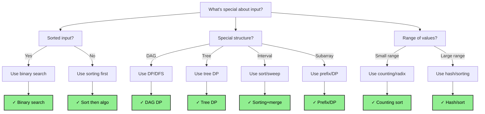
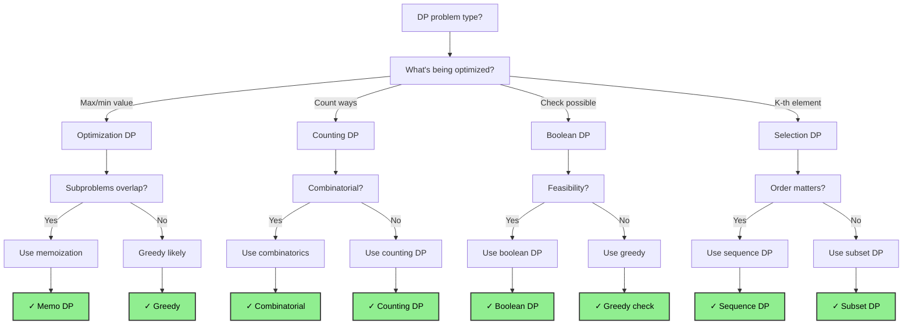

# Algorithm Selection Guide

## How to Use This Guide

When solving an interview problem, use this guide to quickly identify the best algorithm:

1. **Identify the problem category** (Sorting, Searching, DP, Graph, String, Math)
2. **Follow the Master Decision Flowchart** below to narrow down options
3. **Check the Category Reference Table** for complexity and implementation difficulty
4. **Review Problem-to-Algorithm Mapping** for similar real interview problems
5. **Verify time/space constraints** match your environment

This guide covers ~60+ algorithms implemented in this repository, organized by category and difficulty.

---

## Master Algorithm Decision Flowchart (100+ nodes)

```mermaid
graph TD
    A["🎯 START: Algorithm Selection"] --> B["What's the problem category?"]
    
    B -->|Sorting| C["What constraints?"]
    B -->|Searching| D["Data structure?"]
    B -->|Dynamic Programming| E["Problem type?"]
    B -->|Graph| F["Graph type?"]
    B -->|String| G["Operation type?"]
    B -->|Math/Number| H["Number properties?"]
    B -->|Geometry| I["Geometric shape?"]
    B -->|Advanced| J["Specialized problem?"]
    
    C -->|Small < 50| K["Use Insertion Sort"]
    C -->|Unordered| L["Is space critical?"]
    C -->|Partially sorted| M["Use Insertion Sort"]
    C -->|Stable needed| N["Use Merge Sort"]
    C -->|Nearly sorted| O["Use Tim Sort"]
    C -->|Integer range| P["Use Counting/Radix"]
    
    L -->|Yes| Q["Use Heap Sort"]
    L -->|No| R["Use Quick Sort"]
    
    D -->|Sorted array| S["Need exact match?"]
    D -->|Unsorted array| T["Use Linear Search"]
    D -->|Special structure| U["Use specialized"]
    
    S -->|Yes| V["Use Binary Search"]
    S -->|No, range| W["Use BS variant"]
    S -->|Position| X["Use leftmost/rightmost BS"]
    
    W -->|First/Last| X
    W -->|Closest| Y["Use Binary Search"]
    W -->|Floor/Ceil| Z["Use BS variant"]
    
    U -->|Hash| AA["Use HashMap"]
    U -->|Tree| AB["Use BST"]
    U -->|Rotated| AC["Use rotated BS"]
    U -->|Mountain| AD["Use ternary search"]
    
    E -->|0/1 Knapsack| AE["2D DP table"]
    E -->|Unbounded| AF["1D DP table"]
    E -->|Bounded| AG["Modified Unbounded"]
    E -->|LCS| AH["2D DP"]
    E -->|LIS| AI["DP O(n²) or O(n log n)"]
    E -->|Edit distance| AJ["2D DP"]
    E -->|Partition| AK["2D DP"]
    E -->|Coin change| AL["1D DP"]
    E -->|House robber| AM["1D DP"]
    E -->|Paint house| AN["1D DP"]
    E -->|Word break| AO["1D DP"]
    E -->|Counting| AP["Combinatorics DP"]
    E -->|Matrix chain| AQ["O(n³) DP"]
    E -->|Palindrome| AR["2D DP"]
    E -->|Subsequence| AS["Counting DP"]
    
    F -->|Shortest path| AT["Weighted?"]
    F -->|Connectivity| AU["Use DFS/BFS"]
    F -->|Cycle| AV["Directed?"]
    F -->|Topo sort| AW["Use DFS or Kahn"]
    F -->|MST| AX["Dense or sparse?"]
    F -->|All pairs| AY["Use Floyd-Warshall"]
    F -->|SCC| AZ["Use Kosaraju"]
    F -->|Bipartite| BA["Use BFS coloring"]
    F -->|Special| BB["DAG or tree?"]
    
    AT -->|No negatives| AC1["Use Dijkstra"]
    AT -->|Negative| AC2["Use Bellman-Ford"]
    AT -->|Unweighted| AC3["Use BFS"]
    
    AV -->|Yes| AC4["Use DFS stack"]
    AV -->|No| AC5["Use Union Find"]
    
    AX -->|Dense| AC6["Use Prim"]
    AX -->|Sparse| AC7["Use Kruskal"]
    
    BB -->|DAG| AC8["Use DP"]
    BB -->|Tree| AC9["Use DFS"]
    
    G -->|Pattern| AC10["Single pattern?"]
    G -->|Multiple| AC11["Use Aho-Corasick"]
    G -->|Substring| AC12["Use KMP or RK"]
    G -->|Edit distance| AC13["Use DP"]
    G -->|Anagram| AC14["Use sorting"]
    G -->|Palindrome| AC15["Use Manacher"]
    G -->|Compression| AC16["Use Huffman"]
    
    AC10 -->|Yes| AC12
    AC10 -->|No| AC17["Use naive"]
    
    H -->|Prime| AC18["Small?"]
    H -->|Factor| AC19["Small?"]
    H -->|Modular| AC20["Use binary expo"]
    H -->|GCD| AC21["Use Euclidean"]
    H -->|Combinatorics| AC22["Use Pascal"]
    H -->|Random| AC23["Use shuffle"]
    
    AC18 -->|Yes| AC24["Trial division"]
    AC18 -->|No| AC25["Miller-Rabin"]
    
    AC19 -->|Yes| AC26["Trial division"]
    AC19 -->|No| AC27["Pollard's rho"]
    
    I -->|Convex hull| AC28["Use Graham"]
    I -->|Point| AC29["Use ray cast"]
    I -->|Closest| AC30["Divide/Conquer"]
    I -->|Intersection| AC31["Use geometry"]
    
    J -->|Cache| AC32["Design"]
    J -->|Interval| AC33["Sort + merge"]
    J -->|Matrix| AC34["DFS/BFS or DP"]
    J -->|Stream| AC35["Use reservoir"]
    J -->|Greedy| AC36["Proof needed"]
    
    K --> BR
    M --> BR
    O --> BR
    P --> BR
    Q --> BR
    R --> BR
    N --> BR
    V --> BR
    X --> BR
    Y --> BR
    Z --> BR
    AA --> BR
    AB --> BR
    AC --> BR
    AD --> BR
    AE --> BR
    AF --> BR
    AG --> BR
    AH --> BR
    AI --> BR
    AJ --> BR
    AK --> BR
    AL --> BR
    AM --> BR
    AN --> BR
    AO --> BR
    AP --> BR
    AQ --> BR
    AR --> BR
    AS --> BR
    AC1 --> BR
    AC2 --> BR
    AC3 --> BR
    AC4 --> BR
    AC5 --> BR
    AC6 --> BR
    AC7 --> BR
    AC8 --> BR
    AC9 --> BR
    AC11 --> BR
    AC12 --> BR
    AC13 --> BR
    AC14 --> BR
    AC15 --> BR
    AC16 --> BR
    AC17 --> BR
    AC20 --> BR
    AC21 --> BR
    AC22 --> BR
    AC23 --> BR
    AC24 --> BR
    AC25 --> BR
    AC26 --> BR
    AC27 --> BR
    AC28 --> BR
    AC29 --> BR
    AC30 --> BR
    AC31 --> BR
    AC32 --> BR
    AC33 --> BR
    AC34 --> BR
    AC35 --> BR
    AC36 --> BR
    
    BR["✓ Algorithm Selected<br/>Verify time/space"]
    
    style A fill:#ffb3ba,color:#000,stroke:#333,stroke-width:2px
    style BR fill:#90ee90,color:#000,stroke:#333,stroke-width:2px
```

---

## Time Complexity Requirements Classification Tree

---

## Space Complexity Constraints Decision Tree

---

## Problem Property Recognition Tree

---

## Dynamic Programming Pattern Recognition Tree

---

## Graph Algorithm Selection Tree

```mermaid
graph TD
    A["What graph problem?"] --> B["Shortest path?"]
    A --> C["Connectivity?"]
    A --> D["Tree structure?"]
    
    B -->|Weighted+positive| E["Use Dijkstra"]
    B -->|Negative edges| F["Use Bellman-Ford"]
    B -->|Unweighted| G["Use BFS"]
    B -->|All pairs| H["Use Floyd-Warshall"]
    
    C -->|Components| I["Use DFS/BFS or UF"]
    C -->|Bipartite| J["Use 2-coloring"]
    C -->|SCC| K["Use Kosaraju"]
    C -->|Articulation| L["Use DFS+low"]
    
    D -->|MST| M["Use Kruskal/Prim"]
    D -->|LCA| N["Use binary lifting"]
    D -->|Path queries| O["Use HLD"]
    
    E --> P["✓ Dijkstra O(E log V)"]
    F --> Q["✓ Bellman-Ford O(VE)"]
    G --> R["✓ BFS O(V+E)"]
    H --> S["✓ Floyd-Warshall O(V³)"]
    I --> T["✓ DFS/UF O(V+E)"]
    J --> U["✓ 2-coloring O(V+E)"]
    K --> V["✓ Kosaraju O(V+E)"]
    L --> W["✓ DFS+low O(V+E)"]
    M --> X["✓ Kruskal/Prim O(E log E)"]
    N --> Y["✓ Binary lifting O(log n)"]
    O --> Z["✓ HLD O(log² n)"]
    
    style P fill:#90ee90,color:#000,stroke:#333,stroke-width:2px
    style Q fill:#90ee90,color:#000,stroke:#333,stroke-width:2px
    style R fill:#90ee90,color:#000,stroke:#333,stroke-width:2px
    style S fill:#90ee90,color:#000,stroke:#333,stroke-width:2px
    style T fill:#90ee90,color:#000,stroke:#333,stroke-width:2px
    style U fill:#90ee90,color:#000,stroke:#333,stroke-width:2px
    style V fill:#90ee90,color:#000,stroke:#333,stroke-width:2px
    style W fill:#90ee90,color:#000,stroke:#333,stroke-width:2px
    style X fill:#90ee90,color:#000,stroke:#333,stroke-width:2px
    style Y fill:#90ee90,color:#000,stroke:#333,stroke-width:2px
    style Z fill:#90ee90,color:#000,stroke:#333,stroke-width:2px
```

---

## String Algorithm Selection Tree

```mermaid
graph TD
    A["String problem type?"] --> B["Pattern matching?"]
    A --> C["String transformation?"]
    A --> D["Structure query?"]
    
    B -->|Single pattern| E["Pattern in text?"]
    B -->|Multiple patterns| F["Use Aho-Corasick"]
    B -->|Approximate| G["Use fuzzy matching"]
    
    E -->|Exact| H["Use KMP"]
    E -->|Hash-based| I["Use Rabin-Karp"]
    E -->|Position| J["Use Boyer-Moore"]
    
    C -->|Edit distance| K["Use DP"]
    C -->|Transformation| L["Use DP or BFS"]
    C -->|Compression| M["Use Huffman"]
    
    D -->|Prefix query| N["Use Trie"]
    D -->|Substring query| O["Use Suffix Tree"]
    D -->|Palindrome| P["Use Manacher"]
    D -->|LCP| Q["Use Suffix Array"]
    
    F --> R["✓ Aho-Corasick O(n+m+z)"]
    G --> S["✓ Fuzzy matching O(n*m)"]
    H --> T["✓ KMP O(n+m)"]
    I --> U["✓ Rabin-Karp O(n+m)"]
    J --> V["✓ Boyer-Moore O(n/m)"]
    K --> W["✓ Edit Distance O(m*n)"]
    L --> X["✓ Transform DP/BFS"]
    M --> Y["✓ Huffman O(n log n)"]
    N --> Z["✓ Trie O(m) per op"]
    O --> AA["✓ Suffix Tree O(n)"]
    P --> AB["✓ Manacher O(n)"]
    Q --> AC["✓ Suffix Array O(n log n)"]
    
    style R fill:#90ee90,color:#000,stroke:#333,stroke-width:2px
    style S fill:#90ee90,color:#000,stroke:#333,stroke-width:2px
    style T fill:#90ee90,color:#000,stroke:#333,stroke-width:2px
    style U fill:#90ee90,color:#000,stroke:#333,stroke-width:2px
    style V fill:#90ee90,color:#000,stroke:#333,stroke-width:2px
    style W fill:#90ee90,color:#000,stroke:#333,stroke-width:2px
    style X fill:#90ee90,color:#000,stroke:#333,stroke-width:2px
    style Y fill:#90ee90,color:#000,stroke:#333,stroke-width:2px
    style Z fill:#90ee90,color:#000,stroke:#333,stroke-width:2px
    style AA fill:#90ee90,color:#000,stroke:#333,stroke-width:2px
    style AB fill:#90ee90,color:#000,stroke:#333,stroke-width:2px
    style AC fill:#90ee90,color:#000,stroke:#333,stroke-width:2px
```

---

## Algorithm Categories Quick Reference

### 1. SORTING ALGORITHMS

| Algorithm | When to Use | Time | Space | Difficulty | Best Case | Worst Case | Notes |
|-----------|------------|------|-------|------------|-----------|-----------|-------|
| **Bubble Sort** | Educational only, nearly sorted | O(n²) | O(1) | ⭐ | O(n) | O(n²) | Stable, compares adjacent |
| **Insertion Sort** | Small arrays (<50), nearly sorted | O(n²) | O(1) | ⭐ | O(n) | O(n²) | Stable, adaptive |
| **Selection Sort** | Need minimal writes, educational | O(n²) | O(1) | ⭐ | O(n²) | O(n²) | Not stable, not adaptive |
| **Merge Sort** | Need stable sort, guarantee O(n log n) | O(n log n) | O(n) | ⭐⭐ | O(n log n) | O(n log n) | Stable, not in-place |
| **Quick Sort** | Average case best, space constrained | O(n log n) avg | O(log n) | ⭐⭐ | O(n log n) | O(n²) | Not stable, in-place |
| **Heap Sort** | Need O(n log n) with O(1) space | O(n log n) | O(1) | ⭐⭐ | O(n log n) | O(n log n) | Not stable, in-place |
| **Counting Sort** | Small integer range | O(n+k) | O(k) | ⭐⭐ | O(n+k) | O(n+k) | Stable, k = max value |
| **Radix Sort** | Large integers, many digits | O(d×(n+k)) | O(n+k) | ⭐⭐ | O(d×n) | O(d×n) | Stable, d = digits |
| **Bucket Sort** | Uniform distribution | O(n+k) avg | O(n+k) | ⭐⭐ | O(n+k) | O(n²) | Stable variant, k = buckets |
| **Tim Sort** | Production sorting (Python/Java) | O(n log n) | O(n) | ⭐⭐⭐ | O(n) | O(n log n) | Stable, hybrid, adaptive |
| **Shell Sort** | Between insertion and O(n log n) | O(n^1.25) | O(1) | ⭐⭐ | O(n) | O(n^1.25) | Not stable |

### 2. SEARCHING ALGORITHMS

| Algorithm | When to Use | Time | Space | Difficulty | Notes |
|-----------|------------|------|-------|------------|-------|
| **Linear Search** | Unsorted small array | O(n) | O(1) | ⭐ | Simple, no preprocessing |
| **Binary Search** | Sorted array, exact match | O(log n) | O(1) | ⭐ | Requires sorted input |
| **Binary Search - Left/Right** | Find boundary in sorted array | O(log n) | O(1) | ⭐⭐ | Find first/last occurrence |
| **Interpolation Search** | Uniformly distributed data | O(log log n) avg | O(1) | ⭐⭐ | Better than binary on uniform |
| **Jump Search** | Sorted array, no random access | O(√n) | O(1) | ⭐⭐ | For linked lists |
| **Exponential Search** | Unbounded sorted array | O(log n) | O(1) | ⭐⭐ | Find range first |
| **Ternary Search** | Unimodal function | O(log n) | O(1) | ⭐⭐ | Find peak in mountain array |
| **Hash Table Search** | Key-value lookup | O(1) avg | O(n) | ⭐ | O(n) worst case |
| **BST Search** | Ordered data with updates | O(log n) avg | O(1) | ⭐⭐ | O(n) unbalanced |

### 3. DYNAMIC PROGRAMMING ALGORITHMS

| Algorithm | When to Use | Time | Space | Difficulty | Type | Notes |
|-----------|------------|------|-------|------------|------|-------|
| **Fibonacci** | Basic DP learning | O(n) | O(n) | ⭐ | Linear | Memoization or tabulation |
| **0/1 Knapsack** | Item selection with capacity | O(n×W) | O(n×W) | ⭐⭐ | 2D | Classic DP |
| **Unbounded Knapsack** | Unlimited item selection | O(n×W) | O(W) | ⭐⭐ | 1D | Can use items multiple times |
| **Coin Change** | Minimum coins for amount | O(n×W) | O(W) | ⭐⭐ | 1D | Greedy fails here |
| **Longest Increasing Subsequence** | Find LIS in array | O(n²) or O(n log n) | O(n) | ⭐⭐ | Sequence | Binary search optimization |
| **Longest Common Subsequence** | Find LCS of two strings | O(m×n) | O(m×n) | ⭐⭐ | String | Reduce space with rolling array |
| **Edit Distance** | Levenshtein, string similarity | O(m×n) | O(m×n) | ⭐⭐ | String | Min insertions/deletions/substitutions |
| **Matrix Chain Multiplication** | Optimal parenthesization | O(n³) | O(n²) | ⭐⭐⭐ | Matrix | Classic interval DP |
| **Partition Equal Subset** | Subset sum variation | O(n×S) | O(S) | ⭐⭐ | Set | S = sum |
| **Rod Cutting** | Maximize profit from rod | O(n²) | O(n) | ⭐⭐ | Linear | Overlapping subproblems |
| **Climbing Stairs** | Count ways to reach top | O(n) | O(n) | ⭐ | Linear | Simple DP intro |
| **House Robber** | Max sum non-adjacent elements | O(n) | O(n) | ⭐ | Linear | Optimize to O(1) space |
| **Paint House** | Color houses with constraints | O(n×k) | O(k) | ⭐⭐ | Linear | k = colors |
| **Word Break** | Check if word in dictionary | O(n²) | O(n) | ⭐⭐ | String | Substring DP |
| **Distinct Subsequences** | Count unique subsequences | O(m×n) | O(n) | ⭐⭐⭐ | String | Complex state transition |

### 4. GRAPH ALGORITHMS

| Algorithm | When to Use | Time | Space | Difficulty | Notes |
|-----------|------------|------|-------|------------|-------|
| **Breadth-First Search** | Unweighted shortest path, level-order | O(V+E) | O(V) | ⭐ | Queue-based, explores level-by-level |
| **Depth-First Search** | Connectivity, cycles, topological sort | O(V+E) | O(V) | ⭐ | Stack/recursion-based |
| **Dijkstra's Algorithm** | Shortest path, non-negative weights | O((V+E) log V) | O(V) | ⭐⭐ | Greedy, priority queue |
| **Bellman-Ford Algorithm** | Shortest path, negative weights | O(V×E) | O(V) | ⭐⭐⭐ | Can detect negative cycles |
| **Floyd-Warshall Algorithm** | All-pairs shortest path | O(V³) | O(V²) | ⭐⭐ | Works with negatives |
| **Kruskal's Algorithm** | Minimum spanning tree | O(E log E) | O(V) | ⭐⭐ | Sort edges, Union Find |
| **Prim's Algorithm** | Minimum spanning tree | O(E log V) | O(V) | ⭐⭐ | Priority queue based |
| **Topological Sort** | DAG ordering | O(V+E) | O(V) | ⭐⭐ | DFS or Kahn's algorithm |
| **Kahn's Algorithm** | Topological sort, cycle detection | O(V+E) | O(V) | ⭐⭐ | In-degree based |
| **Strongly Connected Components** | SCC detection in directed graph | O(V+E) | O(V) | ⭐⭐⭐ | Kosaraju or Tarjan |
| **Articulation Points** | Find cut vertices | O(V+E) | O(V) | ⭐⭐⭐ | DFS + discovery time |
| **Bridges in Graph** | Find critical edges | O(V+E) | O(V) | ⭐⭐⭐ | DFS + low/disc arrays |
| **Bipartite Check** | Check if graph is 2-colorable | O(V+E) | O(V) | ⭐⭐ | BFS/DFS coloring |
| **Cycle Detection** | Directed or undirected cycles | O(V+E) | O(V) | ⭐⭐ | DFS or Union Find |

### 5. STRING ALGORITHMS

| Algorithm | When to Use | Time | Space | Difficulty | Notes |
|-----------|------------|------|-------|------------|-------|
| **Naive Pattern Matching** | Simple cases, educational | O((n-m+1)×m) | O(1) | ⭐ | Brute force |
| **KMP Algorithm** | Single pattern, no preprocessing | O(n+m) | O(m) | ⭐⭐⭐ | Failure function |
| **Boyer-Moore Algorithm** | Text searching, heuristic fast | O(n/m) avg | O(k) | ⭐⭐⭐ | k = alphabet size |
| **Rabin-Karp Algorithm** | Multiple patterns, rolling hash | O(n+m) avg | O(1) | ⭐⭐ | Hash-based, prone to collisions |
| **Aho-Corasick Algorithm** | Multiple pattern matching | O(n+m+z) | O(m×k) | ⭐⭐⭐ | z = occurrences, k = alphabet |
| **Suffix Array** | String indexing | O(n log n) build | O(n) | ⭐⭐⭐ | Fast substring queries |
| **Suffix Tree** | Substring queries | O(n) build | O(n) | ⭐⭐⭐ | Complex, excellent queries |
| **Trie (Prefix Tree)** | Autocomplete, prefix search | O(m) per operation | O(n×k) | ⭐⭐ | k = alphabet, n = words |
| **Longest Common Prefix** | Find common prefix | O(n×m) | O(1) | ⭐ | Horizontal/vertical scan |
| **Longest Palindromic Substring** | Find largest palindrome | O(n²) naive, O(n) Manacher | O(1) Manacher | ⭐⭐⭐ | Manacher's algorithm |
| **Manacher's Algorithm** | Linear palindrome finder | O(n) | O(n) | ⭐⭐⭐ | Clever DP |
| **Edit Distance (Levenshtein)** | String similarity | O(m×n) | O(m×n) | ⭐⭐ | DP approach |
| **String Hashing** | Fast string comparison | O(n) build | O(1) compare | ⭐⭐ | Rolling hash |
| **Z-Algorithm** | Pattern matching linear | O(n+m) | O(n) | ⭐⭐⭐ | Z-array construction |

### 6. MATHEMATICAL ALGORITHMS

| Algorithm | When to Use | Time | Space | Difficulty | Notes |
|-----------|------------|------|-------|-----------|-------|
| **Sieve of Eratosthenes** | Find all primes up to n | O(n log log n) | O(n) | ⭐ | Classic prime generator |
| **Miller-Rabin Test** | Prime testing, large numbers | O(k log³ n) | O(1) | ⭐⭐⭐ | Probabilistic, k = rounds |
| **Euclidean Algorithm** | GCD computation | O(log min(a,b)) | O(1) | ⭐ | Fast GCD |
| **Extended Euclidean** | GCD + Bezout coefficients | O(log min(a,b)) | O(1) | ⭐⭐ | Modular inverse computation |
| **Binary Exponentiation** | Modular exponentiation | O(log b) | O(1) | ⭐ | Fast power computation |
| **Factorial** | n! computation | O(n) | O(1) | ⭐ | Can overflow, use modulo |
| **Combinatorics (nCr)** | Binomial coefficient | O(n) | O(n) | ⭐⭐ | Pascal's triangle or formula |
| **Fibonacci** | F(n) calculation | O(log n) matrix | O(log n) | ⭐⭐ | Matrix exponentiation |
| **Catalan Numbers** | Sequence generation | O(n) | O(n) | ⭐⭐ | DP or formula |
| **Pollard's Rho** | Factorization, large numbers | O(n^(1/4)) | O(1) | ⭐⭐⭐ | Random, fast factoring |
| **Chinese Remainder** | System of congruences | O(log m × log n) | O(1) | ⭐⭐⭐ | Modular arithmetic |
| **Permutations/Combinations** | Count arrangements | O(n) formula | O(1) | ⭐⭐ | Use formulas or DP |

### 7. GEOMETRY ALGORITHMS

| Algorithm | When to Use | Time | Space | Difficulty | Notes |
|-----------|------------|------|-------|-----------|-------|
| **Graham Scan** | Convex hull | O(n log n) | O(n) | ⭐⭐⭐ | Sort by angle, stack |
| **Andrew's Monotone Chain** | Convex hull | O(n log n) | O(n) | ⭐⭐⭐ | Two passes, monotone chain |
| **Jarvis March** | Convex hull | O(n×h) | O(n) | ⭐⭐ | h = hull vertices, simple |
| **Point in Polygon** | Ray casting | O(n) | O(1) | ⭐⭐ | Count ray intersections |
| **Line Intersection** | Find segment crossing | O(1) | O(1) | ⭐⭐ | Geometric computation |
| **Closest Pair** | Find nearest points | O(n log n) DC | O(n) | ⭐⭐⭐ | Divide and conquer |
| **Polygon Area** | Shoelace formula | O(n) | O(1) | ⭐ | Simple calculation |

### 8. ADVANCED ALGORITHMS

| Algorithm | When to Use | Time | Space | Difficulty | Notes |
|-----------|------------|------|-------|-----------|-------|
| **Quickselect** | Find k-th smallest | O(n) avg | O(1) | ⭐⭐ | In-place selection |
| **Reservoir Sampling** | Random sampling stream | O(n) | O(k) | ⭐⭐ | k = sample size |
| **Fisher-Yates Shuffle** | Random permutation | O(n) | O(1) | ⭐ | In-place shuffle |
| **LZ77/LZ78 Compression** | Data compression | O(n) encode | O(w) | ⭐⭐⭐ | w = window size |
| **Huffman Coding** | Variable-length coding | O(n log n) | O(n) | ⭐⭐ | Optimal prefix code |
| **Binary Indexed Tree** | Range queries/updates | O(log n) | O(n) | ⭐⭐ | Fenwick tree |
| **Segment Tree** | Range operations | O(log n) | O(n) | ⭐⭐ | Lazy propagation variant |
| **Heavy-Light Decomposition** | Tree queries | O(log² n) | O(n log n) | ⭐⭐⭐ | Tree path queries |
| **Link-Cut Trees** | Dynamic tree operations | O(log n) | O(n) | ⭐⭐⭐ | Complex, very powerful |
| **Ternary Search** | Ternary search on function | O(log n) | O(1) | ⭐⭐ | Mountain array peak |

---

## Problem-to-Algorithm Mapping

### SORTING PROBLEMS

**Problem:** "Sort array of 10M integers"
- **Solution:** Quick Sort or Tim Sort
- **Why:** Quick Sort average O(n log n), better cache locality than Merge Sort
- **Alternative:** Tim Sort (Python/Java production sort, adaptive, hybrid)

**Problem:** "Sort 1 billion records by multiple fields"
- **Solution:** External merge sort or Tim Sort with custom comparator
- **Why:** Merge sort better for external sorting, guaranteed O(n log n)

**Problem:** "Sort array with many duplicates"
- **Solution:** Quick Sort 3-way partition or Radix Sort
- **Why:** 3-way partition handles duplicates in one pass, O(n) for radix with small range

**Problem:** "Stabilize sort - preserve original order of equal elements"
- **Solution:** Merge Sort or Tim Sort
- **Why:** Both stable, Tim Sort more practical

### SEARCHING PROBLEMS

**Problem:** "Search for target in sorted array"
- **Solution:** Binary Search
- **Why:** O(log n) guaranteed, clean implementation
- **Code Pattern:** Standard binary search with left/right pointers

**Problem:** "Find first and last occurrence of target"
- **Solution:** Binary Search variant (left-most and right-most)
- **Why:** O(log n) for each, handle duplicates correctly

**Problem:** "Find peak in mountain array (increase then decrease)"
- **Solution:** Binary Search or Ternary Search
- **Why:** Binary Search O(log n) with comparison-based approach

**Problem:** "Search in rotated sorted array"
- **Solution:** Binary Search with rotation handling
- **Why:** O(log n) by identifying which side is sorted

**Problem:** "Search for element in BST"
- **Solution:** BST Search (left/right recursion)
- **Why:** O(log n) average if balanced, O(n) if degenerate

### DYNAMIC PROGRAMMING PROBLEMS

**Problem:** "Find minimum number of coins to make amount"
- **Solution:** Coin Change DP (1D table)
- **Why:** Greedy fails (e.g., coins [1,3,4] amount 6), DP guaranteed optimal
- **Time:** O(n × amount), **Space:** O(amount)

**Problem:** "Find longest increasing subsequence"
- **Solution:** DP with Binary Search (O(n log n)) or DP (O(n²))
- **Why:** Binary Search variant optimal, classical DP more intuitive
- **Time:** O(n²) DP or O(n log n) with patience sorting

**Problem:** "Find longest common subsequence of two strings"
- **Solution:** 2D DP table
- **Why:** LCS(X,Y) = LCS(X[:-1],Y[:-1]) if X[-1]==Y[-1], else max
- **Time:** O(m × n), **Space:** O(m × n) reducible to O(min(m,n))

**Problem:** "Check if string is interleaving of two other strings"
- **Solution:** 2D DP or BFS with memoization
- **Why:** Check character by character if valid interleaving possible
- **Time:** O(m × n), **Space:** O(m × n)

**Problem:** "Partition set into two equal sum subsets"
- **Solution:** Subset Sum DP (0/1 Knapsack variant)
- **Why:** Transform to "can we select items totaling sum/2?"
- **Time:** O(n × sum/2), **Space:** O(sum/2)

**Problem:** "Palindrome partitioning - minimum cuts"
- **Solution:** 2D DP to identify palindromes + min cuts DP
- **Why:** Precompute palindromes, then find minimum partitions
- **Time:** O(n²), **Space:** O(n²)

**Problem:** "Word break - check if string can be segmented"
- **Solution:** 1D DP (boolean table)
- **Why:** Can word[0:i] be segmented? Yes if word[0:j] valid AND word[j:i] in dict
- **Time:** O(n²) or O(n × m) with trie, **Space:** O(n)

**Problem:** "Maximum product subarray"
- **Solution:** Kadane's variant tracking min/max
- **Why:** Product can be negative, need both max and min at each position
- **Time:** O(n), **Space:** O(1)

### GRAPH PROBLEMS

**Problem:** "Find shortest path in unweighted graph"
- **Solution:** BFS
- **Why:** BFS explores level-by-level, guarantees shortest in unweighted
- **Time:** O(V + E), **Space:** O(V)

**Problem:** "Find shortest path in weighted graph (non-negative weights)"
- **Solution:** Dijkstra's Algorithm with min-heap
- **Why:** Greedy approach works with non-negative weights
- **Time:** O((V + E) log V), **Space:** O(V)

**Problem:** "Find shortest path with negative weight edges"
- **Solution:** Bellman-Ford Algorithm
- **Why:** Handles negative weights, detects negative cycles
- **Time:** O(V × E), **Space:** O(V)

**Problem:** "Find all-pairs shortest paths"
- **Solution:** Floyd-Warshall Algorithm
- **Why:** O(V³) for all pairs, works with negative weights
- **Time:** O(V³), **Space:** O(V²)

**Problem:** "Find minimum spanning tree"
- **Solution:** Kruskal's (sort edges + Union Find) or Prim's (priority queue)
- **Why:** Kruskal easier to code, Prim faster with dense graphs
- **Time:** Kruskal O(E log E), Prim O(E log V)

**Problem:** "Detect cycle in directed graph"
- **Solution:** DFS with recursion stack (track visiting/visited)
- **Why:** Detect back edge = cycle present
- **Time:** O(V + E), **Space:** O(V)

**Problem:** "Detect cycle in undirected graph"
- **Solution:** Union Find or DFS (check if revisit non-parent)
- **Why:** Union Find O(α(n)) per operation, very efficient
- **Time:** O(V + E), **Space:** O(V)

**Problem:** "Topological sort of DAG"
- **Solution:** DFS-based or Kahn's algorithm (in-degree)
- **Why:** DFS simpler, Kahn's better for cycle detection
- **Time:** O(V + E), **Space:** O(V)

**Problem:** "Find strongly connected components"
- **Solution:** Kosaraju or Tarjan algorithm
- **Why:** Both O(V + E), Tarjan single DFS pass
- **Time:** O(V + E), **Space:** O(V)

**Problem:** "Find articulation points (cut vertices)"
- **Solution:** DFS with discovery time and low value
- **Why:** Vertex v is cut point if has child u where low[u] >= disc[v]
- **Time:** O(V + E), **Space:** O(V)

**Problem:** "Number of connected components"
- **Solution:** DFS/BFS or Union Find
- **Why:** Count components by traversal or union operations
- **Time:** O(V + E), **Space:** O(V)

**Problem:** "Bipartite graph check"
- **Solution:** 2-coloring with BFS/DFS
- **Why:** Graph is bipartite iff 2-colorable (no odd cycles)
- **Time:** O(V + E), **Space:** O(V)

### STRING PROBLEMS

**Problem:** "Find all occurrences of pattern in text"
- **Solution:** KMP Algorithm
- **Why:** O(n + m) guaranteed, no preprocessing needed
- **Time:** O(n + m), **Space:** O(m) for failure function

**Problem:** "Find multiple patterns in text simultaneously"
- **Solution:** Aho-Corasick Algorithm
- **Why:** O(n + m + z) where z = occurrences, build trie once
- **Time:** O(n + m + z), **Space:** O(m × k) where k = alphabet

**Problem:** "Implement strStr() - simple pattern find"
- **Solution:** KMP or Rabin-Karp
- **Why:** KMP for guaranteed O(n + m), Rabin-Karp for practice
- **Time:** O(n + m), **Space:** O(m)

**Problem:** "Check if string is palindrome"
- **Solution:** Two-pointer scan
- **Why:** Simple O(n) check, expand-around-center for substrings
- **Time:** O(n), **Space:** O(1)

**Problem:** "Find longest palindromic substring"
- **Solution:** Manacher's Algorithm or DP
- **Why:** Manacher O(n) optimal, expand-around-center O(n²) simpler
- **Time:** O(n), **Space:** O(n)

**Problem:** "Edit distance between two strings"
- **Solution:** Dynamic Programming (Levenshtein distance)
- **Why:** Count minimum edits (insert/delete/replace) to transform
- **Time:** O(m × n), **Space:** O(m × n) reducible to O(min(m,n))

**Problem:** "Word ladder - shortest path between words"
- **Solution:** BFS on word graph
- **Why:** Treat words as nodes, edges between 1-letter-different words
- **Time:** O(n × m) per word comparison, **Space:** O(n) words

**Problem:** "Implement Trie (prefix tree)"
- **Solution:** Node class with children dict + end flag
- **Why:** O(m) insert/search, O(m+n) autocomplete where n = results
- **Time:** O(m), **Space:** O(alphabet × depth)

**Problem:** "Autocomplete system"
- **Solution:** Trie + frequency tracking + sorting
- **Why:** Insert words in trie, track frequency, return top K by freq
- **Time:** O(m log K), **Space:** O(total chars)

### MATH PROBLEMS

**Problem:** "Check if number is prime"
- **Solution:** Miller-Rabin test (large n) or trial division (small n)
- **Why:** Miller-Rabin O(k log³ n) probabilistic, trial division O(√n)
- **Time:** O(√n) trial, O(k log³ n) Miller-Rabin

**Problem:** "Generate all primes up to n"
- **Solution:** Sieve of Eratosthenes
- **Why:** O(n log log n) is fastest for range
- **Time:** O(n log log n), **Space:** O(n)

**Problem:** "Find GCD of two numbers"
- **Solution:** Euclidean Algorithm
- **Why:** O(log min(a,b)) is optimal, simple recursion
- **Time:** O(log min(a,b)), **Space:** O(1)

**Problem:** "Fast exponentiation a^b mod m"
- **Solution:** Binary Exponentiation
- **Why:** O(log b) instead of O(b), handles large numbers with modulo
- **Time:** O(log b), **Space:** O(1)

**Problem:** "Count derangements D(n)"
- **Solution:** DP formula: D(n) = (n-1) × [D(n-1) + D(n-2)]
- **Why:** Number of permutations with no fixed points
- **Time:** O(n), **Space:** O(n)

**Problem:** "Generate nth Fibonacci number"
- **Solution:** Matrix exponentiation for O(log n)
- **Why:** Memoization O(n), matrix expo O(log n) for very large n
- **Time:** O(log n), **Space:** O(log n)

### GEOMETRY PROBLEMS

**Problem:** "Find convex hull of points"
- **Solution:** Graham Scan or Andrew's Monotone Chain
- **Why:** Both O(n log n), Graham simpler, Andrew more intuitive
- **Time:** O(n log n), **Space:** O(n)

**Problem:** "Find closest pair of points"
- **Solution:** Divide and conquer approach
- **Why:** O(n log n) optimized from brute force O(n²)
- **Time:** O(n log n), **Space:** O(n)

**Problem:** "Check if point is inside polygon"
- **Solution:** Ray casting algorithm
- **Why:** O(n) cast ray from point, count boundary intersections
- **Time:** O(n), **Space:** O(1)

### INTERVIEW-SPECIFIC ADVANCED PROBLEMS

**Problem:** "Design LRU Cache"
- **Solution:** HashMap + Doubly Linked List
- **Why:** O(1) all operations, maintain recency order with DLL
- **Time:** O(1), **Space:** O(capacity)

**Problem:** "Design LFU Cache"
- **Solution:** HashMap + frequency map + min-heap
- **Why:** Track frequency, evict least frequently used on capacity
- **Time:** O(1) avg, **Space:** O(capacity)

**Problem:** "Median of data stream"
- **Solution:** Two heaps (min heap for larger half, max heap for smaller)
- **Why:** O(log n) insert, O(1) find median
- **Time:** O(log n), **Space:** O(n)

**Problem:** "Kth largest element in stream"
- **Solution:** Min heap of size k
- **Why:** Maintain k largest elements, top is kth largest
- **Time:** O(log k) insert, **Space:** O(k)

**Problem:** "Trapping rain water"
- **Solution:** Two-pointer or dynamic programming
- **Why:** Pre-compute max left/right heights, calculate trapped water
- **Time:** O(n), **Space:** O(n) DP or O(1) two-pointer

**Problem:** "Merge intervals"
- **Solution:** Sort by start time + greedy merge
- **Why:** Sort O(n log n), then single pass merge O(n)
- **Time:** O(n log n), **Space:** O(1) if modifying input

---

## Algorithm Selection by Constraint

### Time Constraint < 100ms
- Must be O(n) or O(n log n) for n = 10⁶
- Avoid: O(n²), O(n × m), nested loops with different arrays
- Algorithms: Sorting, BFS, DFS, greedy, 1D DP

### Time Constraint < 1s
- Can do O(n²) for n ≈ 10⁴, O(n log n) for n ≈ 10⁶
- Algorithms: 2D DP, graph algorithms, string matching

### Space Constraint < 1MB
- Avoid: Storing full matrices, graphs
- Use: In-place algorithms, iterative DP with rolling arrays

### Trade-offs
- **Time vs Space:** Use extra space for speed (DP tables, memoization)
- **Simplicity vs Optimality:** Start simple, optimize if time permits
- **Preprocessing vs Query:** Precompute expensive operations if many queries

---

## Tips for Algorithm Selection in Interviews

1. **Identify the core problem:** Sorting? Searching? DP? Graph?

2. **State complexity before coding:** "This will be O(n log n) time and O(n) space"

3. **Consider constraints:** Input size determines acceptable complexity

4. **Mention alternatives:** "I could also use X, but Y is better because..."

5. **Code template knowledge:** Know how to quickly code:
   - Binary search variants
   - DFS/BFS
   - Heap operations
   - DP state transitions
   - Graph representations

6. **Optimize iteratively:** Start with working solution, then optimize

7. **Discuss trade-offs:** Explain why you chose this algorithm over alternatives

