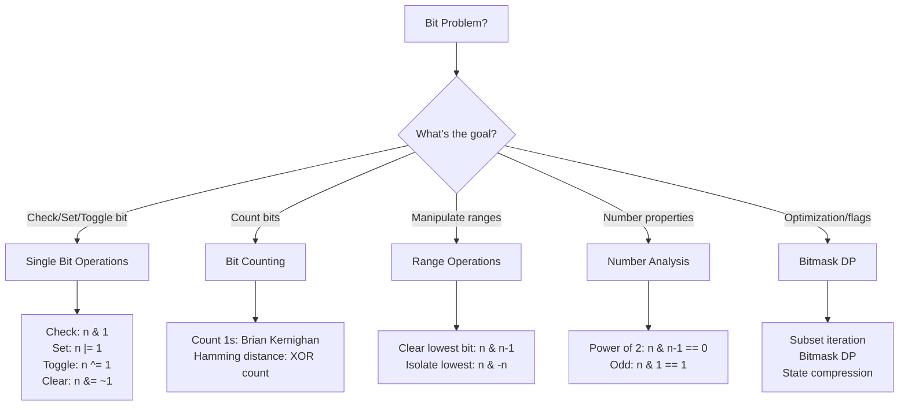

# Bit Manipulation: Essential Techniques & Patterns

Bit manipulation solves problems efficiently by operating directly on binary representations. It's crucial for optimization, setting flags, and interview "gotchas."

---

## Bitwise Operations Quick Reference

| Operation | Syntax | Meaning | Example |
|-----------|--------|---------|---------|
| AND | `a & b` | Both bits 1 | `0101 & 0011 = 0001` |
| OR | `a \| b` | Either bit 1 | `0101 \| 0011 = 0111` |
| XOR | `a ^ b` | Bits differ | `0101 ^ 0011 = 0110` |
| NOT | `~a` | Flip all bits | `~0101 = 1010` (in k-bit system) |
| Left Shift | `a << b` | Multiply by 2^b | `0101 << 1 = 1010` (5 → 10) |
| Right Shift | `a >> b` | Divide by 2^b (floor) | `0101 >> 1 = 0010` (5 → 2) |

---

## Master Bit Manipulation Patterns



---

## 1. Check, Set, Clear, Toggle Bit

**Pattern:** Manipulating individual bits at position i.

```
Number: 13 = 1101 (binary)

Check bit i=1:     (13 >> 1) & 1 = 0110 & 0001 = 0 → bit is 0
Set bit i=1:       13 | (1 << 1) = 1101 | 0010 = 1111 = 15
Clear bit i=1:     13 & ~(1 << 1) = 1101 & 1101 = 1101 = 13 (no change)
Toggle bit i=1:    13 ^ (1 << 1) = 1101 ^ 0010 = 1111 = 15
```

### Complexity
| Operation | Time | Space |
|-----------|------|-------|
| Any single bit op | O(1) | O(1) |

### Implementation

**Python:**
```python
def check_bit(n, i):
    return (n >> i) & 1 == 1

def set_bit(n, i):
    return n | (1 << i)

def clear_bit(n, i):
    return n & ~(1 << i)

def toggle_bit(n, i):
    return n ^ (1 << i)

def is_bit_set(n, i):
    return (n & (1 << i)) != 0
```

**Java:**
```java
public class BitOperations {
    public static boolean checkBit(int n, int i) {
        return ((n >> i) & 1) == 1;
    }
    
    public static int setBit(int n, int i) {
        return n | (1 << i);
    }
    
    public static int clearBit(int n, int i) {
        return n & ~(1 << i);
    }
    
    public static int toggleBit(int n, int i) {
        return n ^ (1 << i);
    }
}
```

---

## 2. Count Set Bits (Popcount)

**Problem:** Count number of 1s in binary representation.

**Naive:** Check each bit — O(log n).
**Optimal (Brian Kernighan):** `n & (n-1)` removes lowest 1-bit — O(k) where k = count.

```
n = 13 = 1101

Method 1 — Check each bit:
  Bits: 1, 0, 1, 1 → count = 3

Method 2 — Brian Kernighan (remove lowest bit):
  13 & 12 = 1101 & 1100 = 1100 = 12 → count = 1
  12 & 11 = 1100 & 1011 = 1000 = 8 → count = 1
  8 & 7   = 1000 & 0111 = 0000 = 0 → count = 1
  Total = 3 ✓
```

### Complexity
| Method | Time | Space |
|--------|------|-------|
| Check each bit | O(log n) | O(1) |
| Brian Kernighan | O(k) where k=popcount | O(1) |
| Hamming distance | O(log n) | O(1) |

### Implementation

**Python:**
```python
def count_set_bits_naive(n):
    count = 0
    while n:
        count += n & 1
        n >>= 1
    return count

def count_set_bits_kernighan(n):
    count = 0
    while n:
        n &= (n - 1)  # Remove lowest 1-bit
        count += 1
    return count

def hamming_distance(x, y):
    # Count differing bits in x and y
    xor = x ^ y
    return count_set_bits_kernighan(xor)

# Python built-in
def count_set_bits_builtin(n):
    return bin(n).count('1')
```

**Java:**
```java
public class BitCounting {
    public static int countSetBitsNaive(int n) {
        int count = 0;
        while (n > 0) {
            count += n & 1;
            n >>= 1;
        }
        return count;
    }
    
    public static int countSetBitsKernighan(int n) {
        int count = 0;
        while (n > 0) {
            n &= (n - 1);
            count++;
        }
        return count;
    }
    
    public static int hammingDistance(int x, int y) {
        return countSetBitsKernighan(x ^ y);
    }
    
    public static int countSetBitsBuiltin(int n) {
        return Integer.bitCount(n);
    }
}
```

---

## 3. Check/Find Power of 2

**Pattern:** Powers of 2 have exactly one 1-bit.

```
Powers of 2: 1, 2, 4, 8, 16, 32...
Binary:      1, 10, 100, 1000, 10000, 100000...

Check if power of 2:
  n & (n - 1) == 0  →  Remove lowest bit; if result is 0, was power of 2
  
  16 = 10000, 15 = 01111
  16 & 15 = 00000 ✓ (is power of 2)
  
  13 = 01101, 12 = 01100
  13 & 12 = 01100 ≠ 0 ✗ (not power of 2)

Find lowest power of 2 >= n:
  Find MSB position, shift to get next power
```

### Complexity
| Operation | Time |
|-----------|------|
| Check power of 2 | O(1) |
| Find MSB | O(log n) or O(1) with hardware |

### Implementation

**Python:**
```python
def is_power_of_2(n):
    return n > 0 and (n & (n - 1)) == 0

def lowest_power_of_2_gte(n):
    # Find next power of 2 >= n
    if is_power_of_2(n):
        return n
    power = 1
    while power < n:
        power <<= 1
    return power

def msb_position(n):
    # Find position of most significant bit
    pos = 0
    while n > 1:
        n >>= 1
        pos += 1
    return pos

def popcount_and_msb(n):
    return bin(n).count('1'), n.bit_length() - 1
```

**Java:**
```java
public class PowerOf2 {
    public static boolean isPowerOf2(int n) {
        return n > 0 && (n & (n - 1)) == 0;
    }
    
    public static int lowestPowerOf2Gte(int n) {
        if (isPowerOf2(n)) return n;
        int power = 1;
        while (power < n) {
            power <<= 1;
        }
        return power;
    }
    
    public static int msbPosition(int n) {
        int pos = 0;
        while (n > 1) {
            n >>= 1;
            pos++;
        }
        return pos;
    }
    
    public static int msbPositionBuiltin(int n) {
        return 31 - Integer.numberOfLeadingZeros(n);
    }
}
```

---

## 4. Isolate & Clear Lowest Bit

**Pattern:** Extract or remove the lowest 1-bit.

```
n = 12 = 1100

Isolate lowest bit:
  n & -n = 1100 & 0100 = 0100 = 4
  (Why -n? Two's complement: -n = ~n + 1)
  -12 = ~1100 + 1 = 0011 + 1 = 0100
  So 1100 & 0100 = 0100 ✓

Clear lowest bit:
  n & (n - 1) = 1100 & 1011 = 1000 = 8
  
Useful for iterating through all set bits:
  for (int bit = n & -n; n; n -= bit, bit = n & -n) {
    // Process each set bit
  }
```

### Complexity
| Operation | Time | Use Case |
|-----------|------|----------|
| Isolate lowest | O(1) | Extract single bit |
| Clear lowest | O(1) | Remove bit, subset iteration |

### Implementation

**Python:**
```python
def isolate_lowest_bit(n):
    return n & -n

def clear_lowest_bit(n):
    return n & (n - 1)

def iterate_set_bits(n):
    """Iterate through all set bits efficiently"""
    bits = []
    while n:
        bits.append(n & -n)
        n &= (n - 1)
    return bits

def subset_iteration(mask):
    """Iterate through all subsets of a bitmask"""
    subsets = []
    sub = mask
    while sub > 0:
        subsets.append(sub)
        sub = (sub - 1) & mask
    subsets.append(0)  # Include empty set
    return subsets
```

**Java:**
```java
public class BitManipulation {
    public static int isolateLowest(int n) {
        return n & -n;
    }
    
    public static int clearLowest(int n) {
        return n & (n - 1);
    }
    
    public static void iterateSetBits(int n) {
        while (n > 0) {
            int lowest = n & -n;
            System.out.println(lowest);  // Process bit
            n &= (n - 1);
        }
    }
    
    public static void iterateSubsets(int mask) {
        for (int sub = mask; sub > 0; sub = (sub - 1) & mask) {
            System.out.println(sub);  // Process subset
        }
    }
}
```

---

## 5. Bit Tricks for Common Problems

| Problem | Trick | Example |
|---------|-------|---------|
| **Single Number** (all appear 2x except one) | XOR all → duplicates cancel | 1^2^2^3^3 = 1 |
| **Two Missing Numbers** | XOR all, separate by bit, XOR each group | Partition by MSB |
| **Odd/Even** | `n & 1` → 1 if odd, 0 if even | - |
| **Divide by 2** | `n >> 1` | Faster than n/2 |
| **Multiply by 2** | `n << 1` | Faster than n*2 |
| **Absolute value** | `(n ^ (n >> 31)) - (n >> 31)` | Branch-free |
| **Swap two numbers** | `a ^= b; b ^= a; a ^= b;` | No temp var |
| **Check if ≤ power of 2** | `n & (n + 1) == 0` | For powers of 2 |

---

## Common Interview Questions

- **"Find the single number that appears once when all others appear twice."** XOR approach: duplicates XOR to 0, leaves the single number. Time O(n), space O(1).

- **"Reverse bits of a 32-bit integer."** Extract LSB, shift result left, add LSB. Repeat 32 times. O(1) time.

- **"Count number of 1-bits (popcount)."** Brian Kernighan's: `while n` with `n & (n-1)` removes bits. O(k) where k=popcount. Or use built-in `bitCount()` / `bin().count('1')`.

- **"Check if number is power of 2."** `n > 0 && (n & (n-1)) == 0`. Only power of 2 has exactly one 1-bit.

- **"How do you negate a number in binary?"** Two's complement: flip all bits and add 1. `-n = ~n + 1`. Why? Because `n + (~n + 1) = 0 (mod 2^32)`.

- **"Generate all subsets using bitmask."** For each number 0 to 2^n-1, bit i indicates whether element i is in subset. For each set bit in mask, add element.

- **"What's the difference between >> and >>>?"** In Java, `>>` is arithmetic (sign-extend), `>>>` is logical (zero-fill). In Python, `>>` is arithmetic; use `& ((1 << k) - 1)` for logical right shift.

---

## Bit Manipulation Checklist for Interviews

- ✓ Know basic operations (&, |, ^, ~, <<, >>)
- ✓ Know when to use XOR (duplicate elimination, parity)
- ✓ Brian Kernighan for bit counting
- ✓ Bitmask for subset enumeration
- ✓ Two's complement for negation
- ✓ `n & (n-1)` removes lowest bit
- ✓ `n & -n` isolates lowest bit
- ✓ Check power of 2: `n & (n-1) == 0`
- ✓ Avoid overflow: use `1L << 32` for 64-bit shifts
- ✓ Test with edge cases: 0, negative, max int
