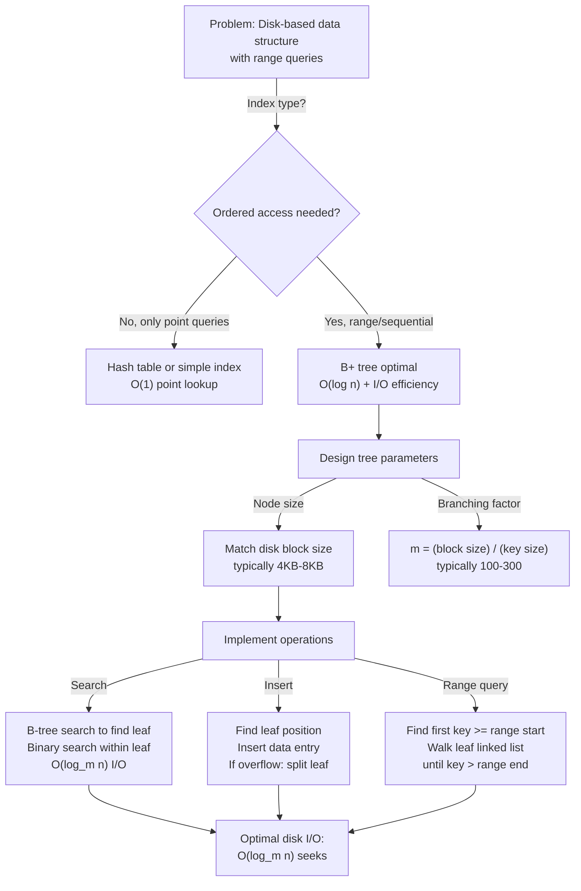

# B+ Tree

## Overview

A **B+ Tree** is a self-balancing search tree optimized for block-oriented storage (disks, SSDs). All data is stored in leaf nodes, and internal nodes contain only keys for navigation. This structure minimizes disk I/O by maximizing branching factor and keeping all leaves at the same depth, enabling efficient range queries, sequential access, and updates.

Invented by Bayer and McCreight (1972) and refined by many researchers, B+ trees are the de facto standard for database indexing in SQL engines (MySQL InnoDB, PostgreSQL), file systems (NTFS, ext4), and key-value stores (LevelDB, RocksDB). A B+ tree with order m (branching factor) has O(log_m n) height, and m can be 100-300 for disk blocks, resulting in very shallow trees (3-4 levels for billions of records).

## When to Use

- **Database indexing**: Primary/secondary indexes on disk-based storage
- **File systems**: Directory structures, extent allocation
- **Key-value stores**: Efficient ordered access and range queries
- **In-memory data structures**: When cache locality and predictable access patterns matter
- **Not ideal for**: In-memory-only applications where BSTs are simpler (B+ trees have larger overhead)

## ASCII Visualization

```
B+ Tree (order m = 3, max 2 keys/internal node, max 3 data entries/leaf):

                    [30, 70]
                   /    |    \
            [10, 20]  [40, 60]  [80, 90]
           /   |   \  /   |   \  /   |   \
         [data] [data] [data] [data] [data] [data]

Leaf nodes contain actual data (or row pointers in databases).
Internal nodes contain only keys for navigation.

Keys in internal nodes:
- 30 = smallest key in right child
- 70 = smallest key in rightmost child

Leaf structure (assuming linked list of leaves):
[10, 20] ← → [40, 60] ← → [80, 90]

Leaves are doubly-linked for efficient range queries.
```

### Range Query Example

```
Query: Find all records with key in [25, 75]

1. Start at root [30, 70]
2. 25 < 30 → go left? No, 25 >= something... go to [10, 20]? No.
   Actually: 25 >= 30? No. 25 >= 70? No. So go left.
   
   Wait, let me reconsider. The tree structure:
   root has keys [30, 70], meaning:
   - Left child contains keys < 30
   - Middle child contains keys >= 30 and < 70
   - Right child contains keys >= 70
   
3. 25 < 30 → go to left child [10, 20]
   25 >= 10 and 25 >= 20, so insert here (but we're searching)
   Not in [10, 20], move to next leaf via linked list
   
4. Next leaf: [40, 60]
   40, 60 in [25, 75], return both
   
5. Next leaf: [80, 90]
   80 >= 75, stop

Result: 40, 60 (entries in [25, 75])

Efficiency: Sequential access via leaf links is I/O-efficient.
```

## Operations & Complexity

| Operation          | Time Complexity | Disk I/O | Notes |
|-------------------|:---------------:|:--------:|-------|
| Search            | O(log_m n)      | O(log_m n) | m = branching factor |
| Insert            | O(log_m n)      | O(log_m n) | May cause splits |
| Delete            | O(log_m n)      | O(log_m n) | May cause merges |
| Range query       | O(log_m n + k)  | O(log_m n + k/m) | k = items returned |
| Sequential scan   | O(n)            | O(n/m)   | Leaf linked list |
| Space             | —               | O(n)     | All data in leaves |

> For disk-based storage, minimizing I/O is critical. With m = 100-300, height is just 3-4 for billions of records.

## Key Invariants

1. **Order constraint**: Each internal node has m children (except root), m/2 ≤ keys ≤ m-1 (except root).
2. **Leaf constraint**: Each leaf has d data entries, d/2 ≤ d ≤ d_max (d_max ≈ m for typical designs).
3. **Leaf links**: All leaves are linked together (doubly-linked list) for sequential access.
4. **Key distribution**: Keys in internal nodes are separator keys; duplicate keys never in internal nodes.
5. **Height balance**: All leaves are at the same depth; height is O(log_m n).
6. **Data in leaves**: Only leaf nodes contain actual data; internal nodes guide navigation.

## Solution Approach Flowchart



## Common Patterns

1. **Database Primary Key Index**: Build B+ tree on primary key. Insert returns row ID or pointer. Searches are point lookups: find leaf via B-tree search. Time: O(log_m n) disk I/O.

2. **Range Queries**: Build B+ tree. Search for first key >= range start, then walk the leaf linked list collecting all keys <= range end. Time: O(log_m n + k/m) I/O where k is result size.

3. **Disk-Block Aware Construction**: Design m such that each node fits in one disk block. Typically 4KB block / (8 byte key + 8 byte pointer) ≈ 250 keys per node. This minimizes I/O.

4. **Bulk Loading**: To insert n records into an empty B+ tree efficiently, sort them first, then build the tree bottom-up in O(n) time, avoiding the O(n log n) cost of repeated insertions.

## Interview Questions

1. **Why separate data in leaves from internal nodes?** Internal nodes guide navigation; data in leaves enables efficient sequential access via linked list. This is ideal for both random access (tree navigation) and sequential access (leaf scan).

2. **How do B+ trees differ from B-trees?** B-tree: data in internal and leaf nodes. B+ tree: data only in leaves. B+ tree is better for range queries and sequential access (via leaf links). B-tree may be better if data access patterns are random.

3. **What is the branching factor m, and how do you choose it?** m = number of children. For disk-based B+ tree, choose m to fit one node in one disk block. For in-memory, larger m reduces height. Typical m = 100-300 for disk-based systems.

4. **How does B+ tree splitting work?** When a leaf overflows (> max keys), split into two leaves. Promote middle key to parent. If parent overflows, recursively split up the tree. May create new root. Time: O(log_m n).

5. **Can you range query efficiently without leaf links?** Technically yes: search for start of range, then successor queries to traverse. But leaf links make it much more efficient: O(log_m n + k/m) I/O vs. O(log_m n · log_k) with successor queries.

6. **How do deletions work with underflow handling?** Delete entry from leaf. If leaf has too few entries (< d_min), merge with sibling or redistribute keys. If merging, remove key from parent. Recursively handle parent underflow. May reduce tree height.

7. **Why is B+ tree the default choice for databases?** O(log_m n) height (typically 3-4 for billions of records), excellent I/O efficiency, naturally supports range queries and sequential scans, and all leaves at same depth ensures predictable performance.

## Implementation Notes

- **Node Overflow/Underflow**: On insert, check if node exceeds max keys. On delete, check if node falls below min keys. Split or merge accordingly.
- **Key Promotion**: When splitting a leaf, promote middle key to parent. When splitting internal node, promote middle key (or highest key of left child, depending on design).
- **Sibling Pointers**: Maintain sibling pointers within internal nodes to enable efficient tree rebalancing.
- **Leaf Linked List**: Maintain doubly-linked list of leaf nodes. This enables sequential scan without tree traversal.
- **Bulk Loading**: If building from scratch with n sorted records, build leaves level, then recursively build parent levels. O(n) time.
- **Testing**: Verify all leaves at same depth. Verify key ordering within nodes. Test insertions and deletions causing splits/merges. Test range queries.

## References

1. Bayer, R., & McCreight, E. (1972). "Organization and maintenance of large ordered indices." *Acta Informatica*, 1(3), 173-189.
2. Cormen, T. H., Leiserson, C. E., Rivest, R. L., & Stein, C. (2009). *Introduction to Algorithms* (3rd ed.). MIT Press.
3. Database systems textbooks (e.g., Ramakrishnan & Gehrke, "Database Management Systems") for detailed B+ tree implementation.
