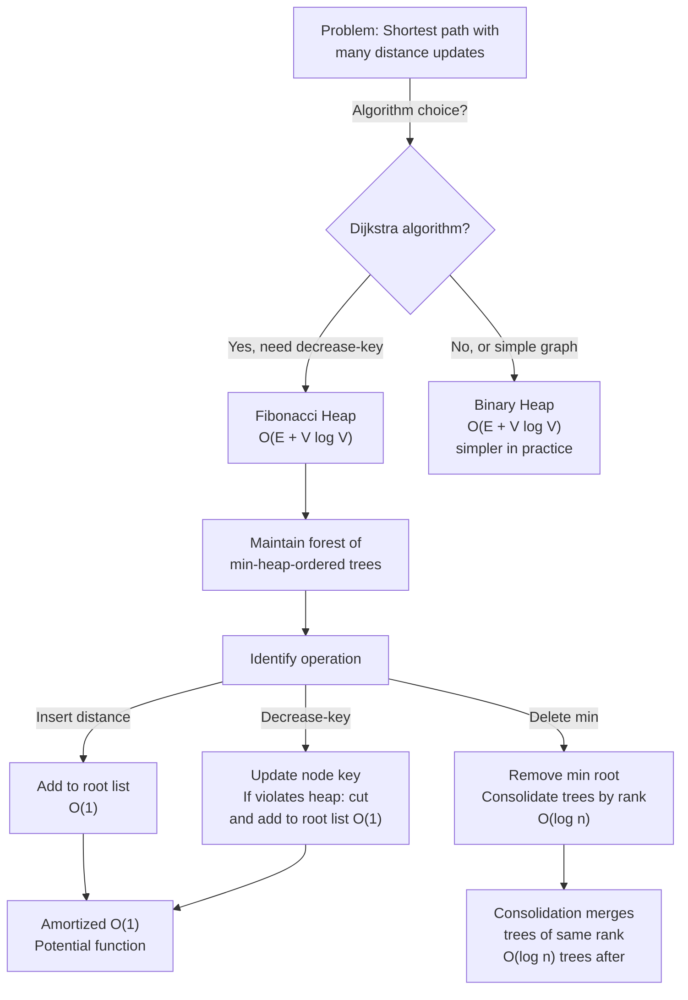

# Fibonacci Heap

## Overview

A **Fibonacci Heap** is an advanced heap data structure supporting decrease-key in O(1) amortized time, making it optimal for algorithms like Dijkstra's shortest path where decrease-key is frequent. It uses a forest of min-heap-ordered trees connected with potential-function analysis to achieve amortized O(1) for merge, insert, and decrease-key.

Invented by Fredman and Tarjan (1987), Fibonacci heaps are primarily theoretical — they have large constant factors and poor cache locality compared to binary heaps. However, they are theoretically important and used in advanced algorithms where asymptotic bounds matter (e.g., Dijkstra's O(E log V) becomes O(E + V log V)).

The "Fibonacci" name comes from the use of Fibonacci numbers in amortized analysis: the tree rank bounds are related to Fibonacci numbers.

## When to Use

- **Dijkstra's algorithm with many decrease-key operations**: O(E + V log V) vs. O((E + V) log V) with binary heap
- **Prim's MST algorithm**: Similarly benefits from O(1) decrease-key
- **Theoretical algorithm analysis**: When asymptotic bounds are critical
- **Not ideal for**: Practical implementations (use binary heaps), single-source shortest path on small graphs, random access queries

## ASCII Visualization

```
Fibonacci Heap: Forest of min-heap-ordered trees.

Example with elements: 7, 18, 3, 52, 38, 41, 17, 30, 26, 46, 39, 52

Forest (trees in the heap):
Tree 1:        3
              / | \
             7 17  30
                    /
                   26

Tree 2:        18
              / | \
            52 38 41

Tree 3:        39
              /
            46

Circular doubly-linked list of tree roots: 3 ← → 18 ← → 39

Each tree is min-heap-ordered: parent <= children.
Degree of each tree (number of children at root):
- Tree 1 (root 3): degree 3
- Tree 2 (root 18): degree 3
- Tree 3 (root 39): degree 1

Fibonacci Heap Property:
- Min pointer: points to 3 (the minimum element)
- No ranking constraints initially (unlike binomial heaps)
```

### Decrease-Key Operation

```
Decrease-key(x, k) where k < current key of x:

1. Update x.key = k
2. If x.key >= parent.key, done (heap property maintained)
3. Else: cut x from parent (cascading cuts)
4. Add x to root list (re-add to forest)
5. Update min pointer if needed

Example:
Before: 26 has key 26, parent is 30.
        Decrease-key(26, 8):
        - 26 > 8, update key
        - 8 < 30 (parent), so cut 26
        - 26 becomes root with key 8
        - Update min pointer to 8

Time: O(1) because we don't need to fix the heap above 26.
Consolidation happens lazily on next delete-min.
```

## Operations & Complexity

| Operation          | Time Complexity | Amortized | Notes |
|-------------------|:---------------:|:----------:|-------|
| Insert            | O(1)            | O(1)       | Add to root list |
| Delete min        | O(log n)        | O(log n)   | Consolidate trees by rank |
| Decrease-key      | O(1)            | O(1)       | Cut and re-add to root list |
| Delete            | O(log n)        | O(log n)   | Decrease to -∞, delete min |
| Merge            | O(1)            | O(1)       | Concatenate root lists |
| Peek min          | O(1)            | O(1)       | Return min pointer |
| Space             | —               | O(n)       | Forest of n nodes |

> Fibonacci heaps have excellent amortized bounds but poor constants. Practical use is rare; primarily theoretical importance.

## Key Invariants

1. **Min-heap property**: Parent <= children in each tree.
2. **No ranking constraints initially**: Trees can have any rank (degree) initially.
3. **Cascading cuts**: When a node has a child cut off, mark it. On second cut, cascade the cut up the tree.
4. **Potential function**: Φ = (number of trees) + 2 × (number of marked nodes). Amortized cost is actual cost + change in potential.
5. **Tree rank bound**: After consolidation, rank is at most O(log n); related to Fibonacci numbers.

## Solution Approach Flowchart



## Common Patterns

1. **Dijkstra with Fibonacci Heap**: Maintain a Fibonacci heap of (distance, node) pairs. When relaxing an edge, decrease-key the target node in O(1). After processing all nodes, delete-min is called V times, each O(log V). Total: O(E) decrease-keys + O(V log V) delete-mins = O(E + V log V).

2. **Prim's MST**: Similar to Dijkstra. Maintain Fibonacci heap of (key, node) pairs. Decrease-key when updating minimum weight edge. Time: O(E + V log V).

3. **Cascading Cuts Optimization**: When decreasing a key causes a violation, cut the node and recursively check the parent. Use a "mark" flag: if a marked node loses another child, cut it and cascade. This keeps the tree rank logarithmic.

4. **Lazy Consolidation**: Don't consolidate after every insert; defer until delete-min. This reduces amortized cost of multiple inserts before deletions.

## Interview Questions

1. **Why does Fibonacci heap support O(1) decrease-key when binary heaps don't?** Fibonacci heaps use cascading cuts: cut the node, add to root list. This avoids sifting up through the tree. Amortized cost is O(1) because the number of cascading cuts is bounded by Fibonacci numbers.

2. **What is "amortized analysis," and why is it important for Fibonacci heaps?** Amortized: average cost per operation over a sequence, not worst-case single operation. Fibonacci heap delete-min is O(log n) worst-case, but amortized O(log n). The "extra" cost from consolidations is paid by cheaper decrease-key operations.

3. **Why are Fibonacci heaps rarely used in practice?** Large constant factors (complex tree manipulations), poor cache locality (many pointers), and overhead of maintaining tree ranks make binary heaps faster on real hardware despite worse asymptotic bounds.

4. **How does consolidation work, and why is it O(log n)?** Consolidation merges trees of the same rank until all trees have distinct ranks. Since max rank is O(log n), there are O(log n) trees. Consolidation takes O(log n) merges = O(log n) time. No tree has duplicate ranks afterward.

5. **What are "marked" nodes, and how do cascading cuts use them?** A marked node has had one of its children cut (removed). When a second child is cut, the node itself is cut and cascaded upward. This limits the rank of any node to O(log n), crucial for amortized analysis.

6. **Can you prove Fibonacci heap operations are O(1) or O(log n) amortized?** Rigorous proof uses potential function Φ = t + 2m (t = trees, m = marked nodes). Decrease-key increases Φ slightly but achieves O(1) amortized cost. Delete-min decreases Φ but takes O(log n) time. See Fredman & Tarjan (1987) paper for full proof.

7. **How do Fibonacci heaps relate to binomial heaps?** Binomial heaps are stricter: each rank appears at most once, and trees are binomial trees of exact structure. Fibonacci heaps relax this: trees have arbitrary structure, consolidation is lazy. Fibonacci heaps are more flexible.

## Implementation Notes

- **Node Structure**: Store key, parent, child, sibling pointers, rank (degree), and mark flag. Circular doubly-linked lists for roots and children.
- **Consolidation**: Use an array of rank-indexed tree pointers. Iterate roots, merging same-rank trees. After consolidation, scan roots to update min pointer.
- **Cascading Cuts**: When cutting node x from parent y, mark y if not already marked. If y is marked and not root, cut y and cascade. Else, just mark y.
- **Decrease-Key with Cascading**: After updating key, if it violates heap property with parent, cut and cascade. Carefully maintain the mark flag.
- **Testing**: Verify min-heap property throughout. Verify rank bounds after consolidation. Test with Dijkstra's algorithm on a known graph.

## References

1. Fredman, M. L., & Tarjan, R. E. (1987). "Fibonacci heaps and their uses in improved network optimization algorithms." *Journal of the ACM*, 34(3), 596-615.
2. Cormen, T. H., Leiserson, C. E., Rivest, R. L., & Stein, C. (2009). *Introduction to Algorithms* (3rd ed.). MIT Press. (Chapter 19: Fibonacci heaps)
3. Tarjan, R. E. (1983). *Data Structures and Network Algorithms*. SIAM.
