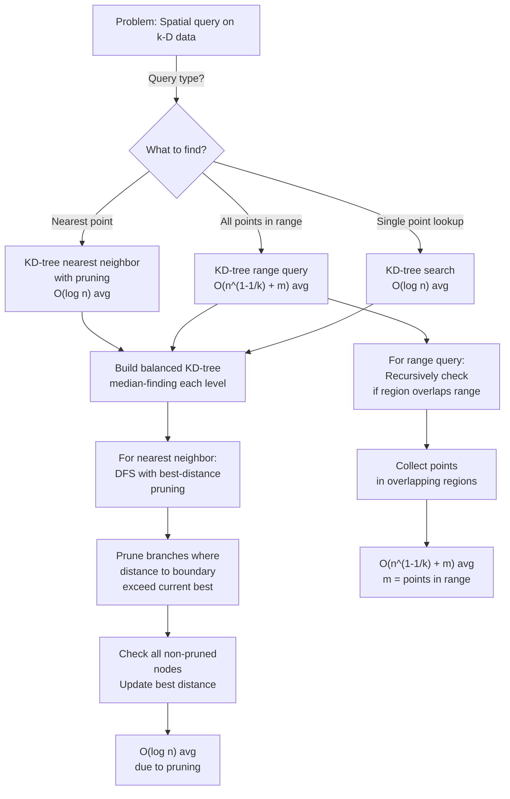

# KD-Tree

## Overview

A **KD-Tree** (k-dimensional tree) is a binary search tree for organizing data in k-dimensional space. It recursively partitions space along each dimension, enabling efficient range queries, nearest neighbor searches, and spatial analysis.

Invented by Bentley (1975), KD-trees are fundamental in computational geometry, graphics (spatial acceleration for ray tracing), robotics (collision detection), and database systems (spatial indexing). For 2D data, a KD-tree is often visualized as alternating vertical and horizontal splits; for 3D, it adds depth splits.

Unlike general tree structures, KD-trees exploit the spatial structure of data, enabling pruning of irrelevant regions during search.

## When to Use

- **Nearest neighbor search**: Find the closest point to a query point in k-D space
- **Range queries**: Find all points within a rectangular region
- **Spatial indexing**: Database indexes on multi-dimensional data
- **Graphics**: Collision detection, ray tracing acceleration
- **Not ideal for**: Very high dimensions (curse of dimensionality), dynamic updates with many insertions/deletions

## ASCII Visualization

```
2D KD-Tree example with points:
(5, 5), (8, 7), (2, 3), (7, 2), (9, 6)

Split at x=5 (root splits vertical):
           (5, 5)
          /      \
    (x < 5)    (x >= 5)

Left side splits at y=3 (split on y):
       (2, 3)
        /   \
    (y < 3) (y >= 3)
                |
              none

Right side at x=7, 8, 9:
          (8, 7)
         /       \
    (x < 8)    (x >= 8)
      |           |
    (7, 2)    (9, 6)

Resulting 2D Space Partition (visualization):

    (0,10) ┌──────────────────┐
           │                  │
           │      (8,7)       │
    (5,5)  ├──────┼───────────┤
           │      │    (9,6)  │
           │ (2,3)│           │
    (0,0)  └──────┴───────────┘ (10,0)
                 (7,2)

Vertical line at x=5, horizontal at y=3, vertical at x=8, etc.
```

### Range Query

```
Range query: find all points in rectangle [4, 9] x [1, 6]

At root (5, 5): inside rectangle → check subtree
At (2, 3): x=2 < 4 (left of rectangle) → prune entire left subtree
At (8, 7): y=7 > 6 (above rectangle) → outside, but children might not be
At (7, 2): inside rectangle → include in result
At (9, 6): inside rectangle → include in result

Result: (5, 5), (7, 2), (9, 6)
```

## Operations & Complexity

| Operation          | Time Complexity | Space Complexity | Notes |
|-------------------|:---------------:|:----------------:|-------|
| Build balanced     | O(n log n)      | O(n)             | Median-finding is O(n) per level |
| Build unbalanced   | O(n)            | O(n)             | Naive insertion may create skewed tree |
| Search / Lookup    | O(n)            | O(log n)         | Worst case: O(n). Average: O(log n). |
| Range query        | O(n^(1-1/k) + m)| O(log n)         | m = points in range. Pruning helps. |
| Nearest neighbor   | O(log n)        | O(log n)         | Average. Worst case: O(n). |
| Insert             | O(log n)        | O(1)             | Best case. Worst case: O(n). |
| Delete             | O(log n)        | O(1)             | Rebuilding the subtree: O(size). |
| Space             | —               | O(n)             | n nodes, k-dimensional data |

> High dimensions: range queries degrade to O(n). Typical for k > 20. Avoid for high-D data.

## Key Invariants

1. **Binary split on dimension**: Each level splits on one dimension, cycling through dimensions.
2. **BST on current dimension**: For the current dimension at that level, left subtree < node, right >= node.
3. **Axis-aligned boundaries**: Each split is perpendicular to one axis; regions are rectangular.
4. **Balanced iff median-selected**: Selecting median element at each level ensures O(log n) height.
5. **Unbalanced if insertion order matters**: Random insertion may create O(n) height tree.

## Solution Approach Flowchart



## Common Patterns

1. **Nearest Neighbor Search**: Build balanced KD-tree. For query point q: DFS from root, maintaining current-best distance. At each node, if the distance to the splitting axis is larger than current-best, prune that side. Time: O(log n) average, O(n) worst case.

2. **Range Search (Rectangle Query)**: Build KD-tree. DFS, checking if each node's region overlaps the query rectangle. If no overlap, prune entire subtree. Collect points in overlapping regions. Time: O(n^(1-1/k) + m) where m is result size.

3. **k-Nearest Neighbors (kNN)**: Extend nearest-neighbor search to keep a priority queue of k best points. Update queue as you traverse the tree. Time: O(log n + k log k) average on well-distributed data.

4. **Spatial Join**: Build KD-tree on one dataset, then insert points from another dataset and query for neighbors. Useful for finding matching points between two datasets.

## Interview Questions

1. **Why alternate dimensions in KD-tree construction?** Cycling through dimensions ensures balanced splits and good space partitioning. If you always split on the same dimension, you get a 1D tree (essentially a BST), losing spatial structure.

2. **How do you build a balanced KD-tree in O(n log n) time?** Select the median element along the current dimension at each level. This ensures each subtree has size ≈ n/2, giving O(log n) depth. Selecting median takes O(n) time per level, so total is O(n log n).

3. **Why does range query have complexity O(n^(1-1/k) + m)?** In k dimensions, a rectangular range intersects O(n^(1-1/k)) nodes. For each node, you do O(1) work; for m points in range, you report them in O(m). Total: O(n^(1-1/k) + m).

4. **What is the curse of dimensionality in KD-trees?** As k (number of dimensions) increases, the branching factor and number of nodes you must visit increases. For k=10 or higher, KD-trees often degrade to O(n) per query. Use other methods (e.g., locality-sensitive hashing) for very high dimensions.

5. **How do you handle dynamic updates (insertions/deletions)?** Insert: find the correct leaf, add node, tree becomes unbalanced over time. Delete: find node, replace with rightmost node from left subtree (or leftmost from right subtree), then recursively delete that replacement. Both risk creating unbalanced trees; periodic rebalancing needed.

6. **Can you use KD-tree for approximate nearest neighbor?** Yes. Stop the search after visiting k nodes or a timeout. This gives approximate NN faster than exact NN. Useful for large datasets or real-time applications.

7. **How does KD-tree compare to R-tree for spatial indexing?** KD-tree: simple, good for point data, worst-case O(n). R-tree: designed for rectangles/objects, better for very high dimensions, used in databases. Choose based on data type and application.

## Implementation Notes

- **Median Finding**: Use quickselect for O(n) median finding per level. Partition the points array in-place to avoid extra space.
- **Balanced Construction**: If building from n points, use median-selection to ensure O(log n) depth. Store the median, then recursively build left and right subtrees.
- **Dimension Cycling**: Use `(depth % k)` to determine which dimension to split on. Easy to get wrong for non-2D data.
- **Range Pruning**: For range queries, check if the current node's region intersects the query rectangle. If not, prune entire subtree.
- **Distance Pruning**: For nearest-neighbor, compute distance from query point to the splitting boundary. If this distance exceeds current-best, prune that subtree.
- **Testing**: Test on known datasets (e.g., 2D grid, random points). Verify nearest neighbor is correct. Verify range queries return all points in range.

## References

1. Bentley, J. L. (1975). "Multidimensional binary search trees used for associative searching." *Communications of the ACM*, 18(9), 509-517.
2. de Berg, M., Cheong, O., van Kreveld, M., & Overmars, M. (2008). *Computational Geometry: Algorithms and Applications* (3rd ed.). Springer.
3. Finkel, R. A., & Bentley, J. L. (1974). "Quad trees: A data structure for retrieval on composite keys." *Acta Informatica*, 4(1), 1-9.
