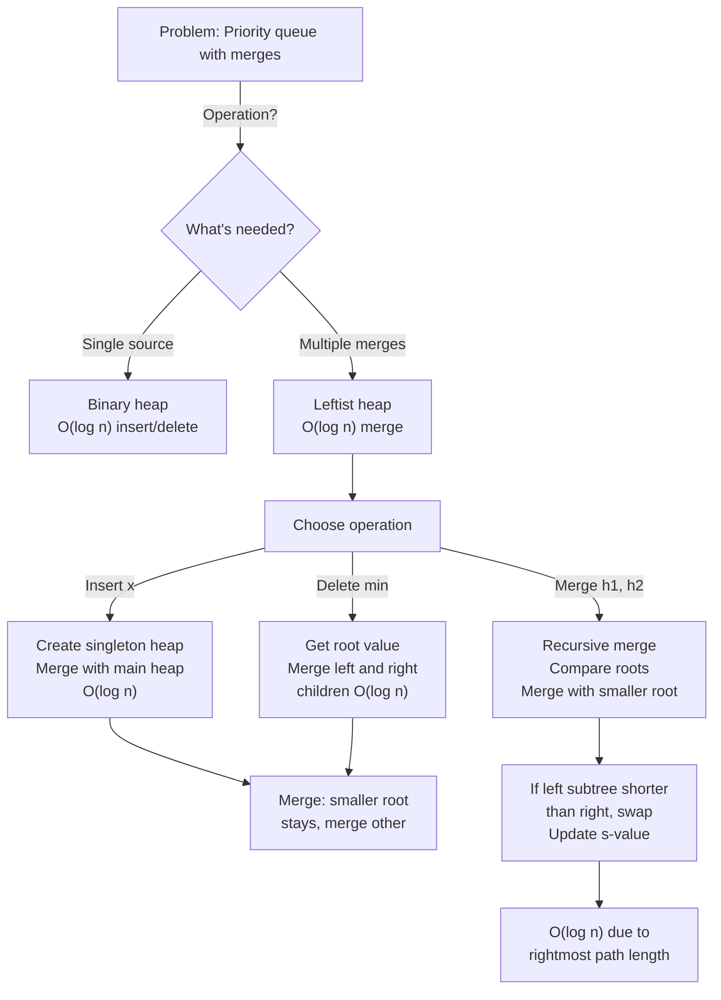

# Leftist Heap

## Overview

A **Leftist Heap** is a binary tree-based heap data structure where the left subtree is always at least as tall as the right subtree. This ensures O(log n) merge operation, making it ideal for priority queues in applications requiring frequent heap merges (e.g., Huffman coding, event simulation).

Invented by Clark Allan Crane (1972), leftist heaps combine the simplicity of heaps with efficient merging. Unlike binary heaps which require O(n) merge time, leftist heaps merge in O(log n) via recursive merging of subtrees.

The key insight is the "leftist property": each node stores the length of the shortest path to a leaf (called "rank" or "s-value"). This enables smart recursion: always merge into the left subtree, keeping it deeper than the right.

## When to Use

- **Priority queue with frequent merges**: O(log n) merge vs. O(n) for binary heap
- **Huffman coding**: Combine subtrees frequently; leftist heap efficient
- **Dijkstra with multiple sources**: Merge priority queues from different sources
- **Event simulation**: Multiple event streams, need to merge and dequeue efficiently
- **Not ideal for**: Single-source priority queues (binary heap simpler), random access (leftist heap doesn't support decrease-key efficiently)

## ASCII Visualization

```
Leftist Heap Property: left subtree >= right subtree in height.

Example: s-value = shortest path length to null + 1

           1 (s=2)
          / \
        2    3 (s=1)
       / \    \
      4   5    6 (s=1)

s-values (shortest path to a leaf):
- Node 1: left child has s=2, right child has s=1 → left >= right ✓
- Node 2: left child (4) has s=1, right child (5) has s=1 → 1 >= 1 ✓
- Node 3: left child ø (s=0), right child (6) has s=1 → 0 >= 0 ✗ (violates)

Wait, let me fix this:

Correct Leftist Heap:
           1 (s=2)
          / \
        2    3 (s=1)
       / \   /
      4   5 6 (s=1)

Now s-values:
- Node 1: s = min(s(left), s(right)) + 1 = min(2, 1) + 1 = 2
- Node 2: s = min(1, 1) + 1 = 2
- Node 3: s = min(1, 0) + 1 = 1  (right child is null)
- Node 4, 5, 6: leaves, s = 1
```

### Merge Operation

```
Merge two leftist heaps h1 and h2:

h1:        1              h2:         2
          / \                        / \
         3   4                      5   6

Merge step (assuming min-heap):
1. Compare roots: 1 < 2, so 1 is new root
2. Recursively merge h1.right with h2
3. h1.right = result
4. If left subtree becomes shorter, swap children
5. Update s-value

Result:           1
                 / \
                3   [merge(h1.right, h2)]
```

## Operations & Complexity

| Operation          | Time Complexity | Space Complexity | Notes |
|-------------------|:---------------:|:----------------:|-------|
| Insert            | O(log n)        | O(1)             | Create singleton, merge with heap |
| Delete min        | O(log n)        | O(1)             | Merge left and right children |
| Merge            | O(log n)        | O(1)             | Recursive merge on rightmost paths |
| Peek min          | O(1)            | O(1)             | Root element |
| Decrease-key      | O(n)            | O(1)             | No efficient support; use Fibonacci heap if needed |
| Space             | —               | O(n)             | Binary tree with n nodes |

> Leftist heaps provide O(log n) merge, a key advantage over binary heaps. The cost is slightly slower in practice due to tree imbalance.

## Key Invariants

1. **Heap property**: Parent <= children (for min-heap).
2. **Leftist property**: For each node, left subtree height >= right subtree height.
3. **s-value**: s[u] = (shortest path to null) + 1. For leaf: s=1. For internal node with right child: s = min(s[left], s[right]) + 1.
4. **Implicit merge tree**: The rightmost path is the spine; merging happens along this spine.
5. **Rank bound**: The rightmost path has length O(log n), enabling O(log n) operations.

## Solution Approach Flowchart



## Common Patterns

1. **Efficient Merging**: Build leftist heap of heaps. To merge two heaps: compare roots (take smaller), recursively merge the other heap with the smaller-rooted heap's right child. If left subtree becomes too short, swap children. Time: O(log n).

2. **Huffman Coding**: Insert all leaf nodes into leftist heap. Repeatedly delete two minimum-weight nodes, create parent, and insert back. Leftist heap's efficient merge makes this faster than binary heap for large inputs.

3. **Priority Queue for Dijkstra**: Maintain a leftist heap of (distance, node) pairs. When multiple sources are processed simultaneously, merge their priority queues efficiently. Time: O((V + E) log V) with efficient merges.

4. **Event Simulation**: Multiple event streams, each with its own priority queue (leftist heap). Merge heaps as streams are combined. Process events in order efficiently.

## Interview Questions

1. **What is the s-value, and why is it important?** s-value (or "rank") = shortest path to null + 1. It characterizes the height of the subtree. The leftist property ensures s[left] >= s[right], which guarantees the rightmost path is short (O(log n)), enabling O(log n) operations.

2. **Why can't binary heap merge in O(log n) time?** Binary heaps rely on array indexing and the shape property (complete binary tree). Merging requires comparing all elements or rebuilding the array, which is O(n). Leftist heaps use structural property (recursive merge along rightmost path).

3. **How do you compute s-values after an operation?** After merge or insertion, update s-values bottom-up: s[u] = min(s[left], s[right]) + 1. If s[left] < s[right], swap children to maintain leftist property.

4. **Can you decrease-key in a leftist heap efficiently?** No. Decreasing a key requires fixing the heap property, which may require percolating up or restructuring. Leftist heaps don't support this efficiently. Use Fibonacci heaps if decrease-key is needed.

5. **Is leftist heap more efficient than binary heap in practice?** Depends. Binary heaps have better cache locality (array-based). Leftist heaps have better asymptotic for merges but more pointer chasing. For pure priority queues without merges, binary heaps are often faster.

6. **How does leftist heap compare to skew heaps?** Both are O(log n) amortized for merge. Skew heaps are simpler (no s-value tracking), but leftist heaps guarantee O(log n) worst-case. Skew heaps are sometimes faster in practice due to simpler implementation.

7. **Can you implement leftist heap with lazy propagation for decrease-key?** Harder. Lazy propagation works well with tree structures (segment trees), but leftist heaps' merge-centric design doesn't naturally support it. For decrease-key, use Fibonacci heaps.

## Implementation Notes

- **s-value Computation**: s[null] = 0, s[leaf] = 1, s[internal] = min(s[left], s[right]) + 1. Cache s-values to avoid recomputation.
- **Merge Recursion**: Merge(h1, h2) where h1.key <= h2.key: return a new node with h1.key, h1.left, and Merge(h1.right, h2) as its right child. Swap if needed.
- **Swap Logic**: After merging, if s[left] < s[right], swap them. Update s-value after swap.
- **Insertion**: Create singleton (single node), then Merge(heap, singleton).
- **Deletion**: DeleteMin(h) = Merge(h.left, h.right).
- **Testing**: Verify heap property (parent <= children). Verify leftist property (s[left] >= s[right]). Test merge with various heap sizes.

## References

1. Crane, C. A. (1972). "Linear lists and priority queues as balanced trees." Ph.D. dissertation, Stanford University.
2. Cormen, T. H., Leiserson, C. E., Rivest, R. L., & Stein, C. (2009). *Introduction to Algorithms* (3rd ed.). MIT Press.
3. Okasaki, C. (1998). *Purely Functional Data Structures*. Cambridge University Press.
