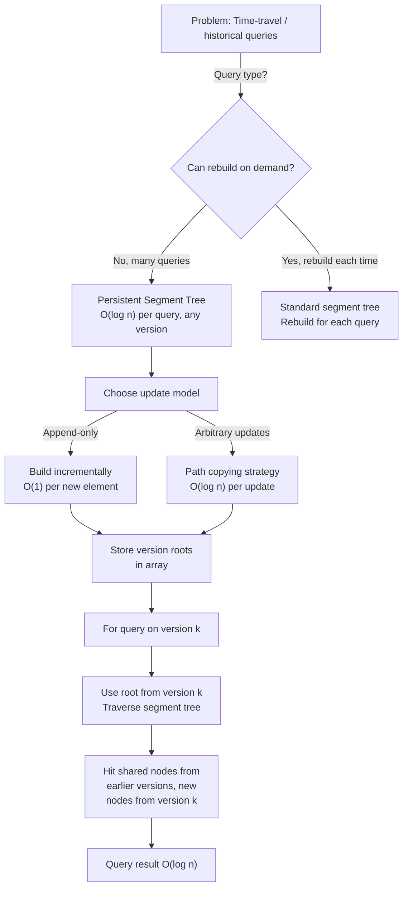

# Persistent Segment Tree

## Overview

A **Persistent Segment Tree** maintains multiple versions of a segment tree, where each update creates a new version without destroying previous ones. All versions coexist, enabling queries on any historical state in O(log n) time while using O(n log n) total space.

Persistence, introduced by Driscoll, Sarnak, Sleator, and Tarjan (1989), is a general technique applicable to many data structures. The key idea is to copy only the modified nodes along the update path, creating a new version that shares unchanged nodes with the previous version. This enables time-travel queries: "what was the answer at timestamp t?"

Persistent segment trees are used in competitive programming (dynamic kth element queries), bioinformatics (time-varying alignment), and game development (undo/redo systems).

## When to Use

- **Historical queries**: Answer queries on past versions of the data
- **Offline kth smallest element queries**: Build persistent segment tree on coordinate-compressed array
- **Undo/redo functionality**: Store versions, jump to any previous state
- **Temporal analysis**: Query data as it changed over time
- **Append-only data**: When updates only append new elements (less overhead than general persistence)

## ASCII Visualization

```
Original Segment Tree (v0):
        [1,8]:10
       /         \
    [1,4]:5    [5,8]:5
    / \         / \
  [1,2] [3,4] [5,6] [7,8]
  / \   / \   / \   / \
 [1] [2] [3] [4] [5] [6] [7] [8]
  1   2   3   4   5   6   7   8

After updating index 3 from 3 to 10 (v1):

New version v1 shares most of v0 but creates new nodes on the path:
        [1,8]:17  ← new node
       /         \
    [1,4]:12    [5,8]:5 ← shared with v0
    / \         / \
  [1,2] [3,4]' [5,6] [7,8]
  / \   / \    / \   / \
 [1] [2] [3]' [4] [5] [6] [7] [8]
  1   2   10   4   5   6   7   8

Nodes marked with ' are new copies; unmarked nodes are shared.
Version tree (for random access to all versions):

v0 → v1 → v2 → v3 → ...
      ↓    ↓    ↓
     roots of each version segment tree
```

### Path Copying

```
When updating element at index 3:
1. Query path: [1,8] → [1,4] → [3,4] → [3,3]
2. Create new node for [3,3] with updated value
3. Create new node for [3,4] merging old [3,3] with new value
4. Create new node for [1,4] combining new [3,4] with shared [1,2]
5. Create new root [1,8] combining new [1,4] with shared [5,8]
6. Store new root in version array
```

## Operations & Complexity

| Operation          | Time Complexity | Space per Version | Total Space | Notes |
|-------------------|:---------------:|:----------------:|:----------:|-------|
| Update (v[k])      | O(log n)        | O(log n)          | O(n log n) | Create log n new nodes |
| Query (v[k])       | O(log n)        | O(1)              | O(n log n) | Use snapshot root |
| Space per version  | —               | O(log n)          | —          | Only log n new nodes per update |
| Build all versions | O(n log n)      | —                 | O(n log n) | Build incrementally |

> Total space: O(n + n log n) = O(n log n) for n updates. Much better than storing full trees.

## Key Invariants

1. **No shared mutable state**: Each version has its own root; updating version k doesn't affect version k-1.
2. **Path sharing**: Nodes not on the update path are shared between versions (same pointer).
3. **Version independence**: Queries on version k use only version k's nodes and shared ancestors.
4. **Immutability**: Once created, a node is never modified; updates create new nodes.
5. **Space efficiency**: Only O(log n) new nodes per update; total space is O(n log n) for n updates.

## Solution Approach Flowchart



## Common Patterns

1. **Kth Smallest in Range**: Build persistent segment tree where each node stores count of elements ≤ some value (after coordinate compression). For query (l, r, k): query count difference between versions r and l-1. Time: O(log² n) with binary search.

2. **Time-Travel Query**: Store snapshots of segment tree after each update. Query "what was the answer at timestamp t?" Answer by querying the segment tree from time t. Time: O(log n) per query on any past time.

3. **Offline kth Element Queries**: Sort queries by timestamp. Process updates and queries in order, building persistent segment tree. At each timestamp, store the segment tree root. Answer queries by binary searching on the persistent tree. Time: O((n + q) log n).

4. **Undo/Redo System**: Store all versions. Undo jumps to the previous version; redo jumps to the next version. Supports arbitrary version jumps. Time: O(1) to switch versions, O(log n) to query.

## Interview Questions

1. **How does persistent data structure differ from a regular data structure?** Regular: updates modify the data, old state is lost. Persistent: updates create a new version; all old states coexist. Both versions can be queried.

2. **Why is path copying efficient for segment trees?** Segment trees have O(log n) depth. Each update only affects nodes on the root-to-leaf path: O(log n) nodes. We copy these nodes and share the rest. Total space: O(log n) per update.

3. **Can you make any data structure persistent?** In principle, yes, using "structural decomposition" techniques. But it's practical only for some structures. Segment trees, binary search trees, and balanced trees are common. Graphs and adjacency lists are harder.

4. **What's the difference between "full persistence" and "partial persistence"?** Full: any version can be queried and updated. Partial: only the latest version can be updated; old versions are immutable. Segment trees are typically "full persistent" because we can afford path copying.

5. **How do you handle kth smallest element in a range [l, r] query?** Build persistent segment tree on coordinate-compressed values. Version vᵢ stores segment tree after processing first i elements. To query range [l, r]: difference between (version r's segment tree) and (version l-1's segment tree). Binary search on counts to find kth smallest. Time: O(log² n).

6. **What if updates are not append-only but arbitrary?** Use path copying. Each update creates a new root and O(log n) new nodes. Store roots in a version array. Time: O(log n) per update, O(log n) per query on any version.

7. **How much space does a persistent segment tree really use?** O(n + k log n) where n is the array size and k is the number of updates. After k updates, total nodes = n (leaf nodes) + O(log n) per update = O(n + k log n). If k = n, total is O(n log n).

## Implementation Notes

- **Node Creation**: Every update must create a new segment tree node (or multiple nodes on the path). Don't reuse or modify old nodes.
- **Root Storage**: Maintain an array of roots, one per version. roots[k] points to the root of version k.
- **Path Copying**: When updating, recursively create new nodes for the current range, copying one child and recursing into the other. Both children can be shared or new, depending on which path contains the update index.
- **Lazy Propagation**: Combining persistence with lazy propagation is possible but complex. Creates more overhead; reserved for advanced problems.
- **Memory Management**: In competitive programming, use pools of pre-allocated nodes. In production, careful memory management or garbage collection is needed.
- **Testing**: Verify that querying any historical version gives the correct answer. Verify total space is O(n log n).

## References

1. Driscoll, J. R., Sarnak, N., Sleator, D. D., & Tarjan, R. E. (1989). "Making data structures persistent." *Journal of Computer and System Sciences*, 38(1), 86-124.
2. Gusfield, D. (1997). *Algorithms on Strings, Trees, and Sequences*. Cambridge University Press.
3. Competitive Programming resources (Codeforces, AtCoder) for practical problems and implementations.
