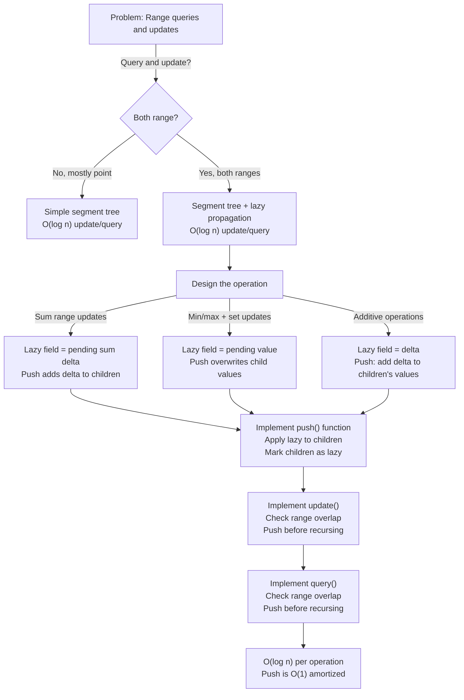

# Segment Tree with Lazy Propagation

## Overview

A **Segment Tree with Lazy Propagation** is a segment tree that defers range updates to child nodes until they are needed for queries. This enables O(log n) range updates instead of O(n) naive updates or O(n log n) individual element updates. Lazy propagation is essential for competitive programming and applications requiring frequent range modifications.

Built on segment trees (originated by Bentley in 1977), lazy propagation adds a "lazy" flag and deferred updates to each node. When updating a range, mark affected nodes as lazy instead of recursively updating all children. When querying, push pending updates down to children only when necessary.

Used extensively in competitive programming (range update + range query problems), it's also foundational for more advanced structures like link-cut trees and persistent segment trees.

## When to Use

- **Range updates + range queries**: Both O(log n) with lazy propagation
- **Interval scheduling**: Bulk assign values to intervals
- **Difference arrays alternative**: When updates/queries are non-overlapping
- **Competitive programming**: Almost every range operation problem
- **Not ideal for**: Point-only queries (simple segment tree sufficient), very sparse updates (simpler methods may be better)

## ASCII Visualization

```
Segment Tree with Lazy Propagation:

Array: [1, 2, 3, 4, 5, 6, 7, 8]

Tree structure (segment tree, range aggregates shown):
                  [1,8]:36
                 /        \
         [1,4]:10         [5,8]:26
        /      \         /      \
     [1,2]:3  [3,4]:7  [5,6]:11 [7,8]:15
     /  \     /  \    /  \     /  \
   [1] [2] [3] [4] [5] [6] [7] [8]
    1   2   3   4   5   6   7   8

Without lazy propagation:
To update range [2, 7] by +5: traverse to all 7 leaves, O(n log n).

With lazy propagation:
Mark nodes covering [2, 7] as lazy with +5 pending.
Nodes: [2], [3,4]:+5 (lazy), [5,6]:+5 (lazy), [7]

When querying range [3, 6]:
- Check [3,4] (lazy): push update down before querying
- Check [5,6] (lazy): push update down before querying
- Combine results from updated children

Only "active" nodes are updated; dormant nodes remain lazy.
```

### Lazy Update Mechanism

```
Update(l, r, delta):
1. If current node's range [L, R] is entirely in [l, r]:
   - Mark node as lazy with delta
   - Update node's value (sum/max/etc.)
   - Return (don't recurse into children yet)
2. Else if [L, R] partially overlaps [l, r]:
   - Push any pending lazy updates down to children
   - Recurse into left and right children
   - Merge results from children

Query(l, r):
1. If current node's range [L, R] is entirely in [l, r]:
   - Return node's value
2. Else if [L, R] partially overlaps [l, r]:
   - Push any pending lazy updates down to children
   - Recurse into left and right children
   - Merge results

Push(node):
1. If node has lazy update delta:
   - Apply delta to node's children
   - Mark children as lazy with delta
   - Clear node's lazy flag
```

## Operations & Complexity

| Operation          | Time Complexity | Space Complexity | Notes |
|-------------------|:---------------:|:----------------:|-------|
| Point update       | O(log n)        | O(1)             | Single element |
| Range update       | O(log n)        | O(1)             | Multiple elements, lazy propagation |
| Point query        | O(log n)        | O(1)             | Single element or range containing it |
| Range query        | O(log n)        | O(1)             | Sum/min/max of range |
| Build (bottom-up)  | O(n)            | O(1)             | O(n) time, builds in-place |
| Space             | —               | O(n)             | Tree with 4n nodes in worst case |

> Lazy propagation's key advantage: defers work until needed, achieving O(log n) for both update and query.

## Key Invariants

1. **Segment tree property**: Each node covers a range [L, R]; children cover [L, mid] and [mid+1, R].
2. **Lazy flag**: Each node has a lazy field indicating pending updates.
3. **Push-before-access**: Before querying or recursing into a child, push pending updates to children.
4. **Monotonicity**: Queries and updates must be computable from cached values (monotone functions like sum, min, max).
5. **Tree shape**: Complete binary tree; root covers [0, n-1]; leaves are individual elements.

## Solution Approach Flowchart



## Common Patterns

1. **Range Sum Update + Query**: Build segment tree where each node stores range sum. For update(l, r, delta): mark nodes covering [l, r] as lazy with +delta. For query(l, r): sum values, pushing down lazy updates as needed. Time: O(log n).

2. **Range Set Update + Query**: Each node stores range value. For update(l, r, val): mark nodes covering [l, r] as lazy with val (assignment, not addition). For query: retrieve values, pushing down lazy updates. This handles "set all elements in range to val" efficiently.

3. **Range Max Update + Range Min Query**: Nodes store max and min values. Updates set all elements in range to a value. Queries find min in range. Lazy propagation handles updates; push applies the set value to children.

4. **Additive Range Queries with Custom Operations**: Extend to any monotone operation (GCD, bitwise-AND, etc.). Lazy field stores pending delta. Push and query are customized to the operation.

## Interview Questions

1. **Why is lazy propagation O(log n) instead of O(n) for range updates?** Without lazy propagation, updating each leaf takes O(n) time. With lazy propagation, we mark internal nodes (not leaves) as lazy, deferring child updates. We only push updates to children when queried, and at most O(log n) nodes are visited per query.

2. **What is the push() operation, and why is it critical?** Push applies a node's pending lazy update to its children and marks them lazy. It's called before querying or recursing into children. This ensures all nodes represent correct values when accessed, while deferring updates to irrelevant nodes.

3. **Can you use lazy propagation with non-monotone operations (e.g., sort)?** No, lazy propagation requires operations that can be decomposed: a node's value must be computable from aggregating children's values. Sorting cannot be aggregated this way.

4. **How do you handle assignment (set) updates vs. additive (add) updates?** Assignment: lazy field stores the value to assign. Push overwrites children's values with this value. Additive: lazy field stores the delta. Push adds delta to children's values. Choose based on operation type.

5. **Can you combine lazy propagation with other optimizations like sqrt decomposition?** Yes, hybrid approaches exist. For example, use sqrt decomposition for outer structure, segment tree with lazy for inner ranges. This can improve constants but adds complexity.

6. **What's the difference between lazy propagation and segment tree difference arrays?** Segment tree with lazy propagation: O(log n) per operation, works for range queries. Difference arrays: O(1) update but O(n) query (must reconstruct via prefix sum). Choose based on whether you need fast queries.

7. **How do you debug lazy propagation code?** Test incrementally: verify simple updates work, then queries, then combined. Print tree state after operations. Compare against naive solution (update all elements, query all). Use small inputs (n=8) for manual verification.

## Implementation Notes

- **Lazy Field Type**: Matches the update type (int for sum delta, long for large sums, custom struct for multiple operations).
- **Push Function**: Apply lazy value to children, mark children as lazy, clear parent's lazy flag. Handle edge cases (leaf nodes don't push).
- **Update Function**: Check range overlap [L, R] with [l, r]. If fully contained, mark lazy and return (don't recurse). If partially, push then recurse. Merge children results.
- **Query Function**: Check range overlap. If fully contained, return value (after applying lazy if leaf). If partially, push then recurse. Merge results.
- **Initialization**: Build tree bottom-up in O(n) time, or initialize as lazy-zero and update element-by-element.
- **Testing**: Compare against naive updates on small inputs. Verify queries return correct answers. Test edge cases: single element, entire range, empty updates.

## References

1. Bentley, J. L. (1977). "Solutions to Klee's rectangle problems." Unpublished manuscript, referred to in academic literature.
2. Cormen, T. H., Leiserson, C. E., Rivest, R. L., & Stein, C. (2009). *Introduction to Algorithms* (3rd ed.). MIT Press.
3. Competitive Programming community resources (Codeforces blogs, GeeksforGeeks, TopCoder tutorials on lazy propagation).
