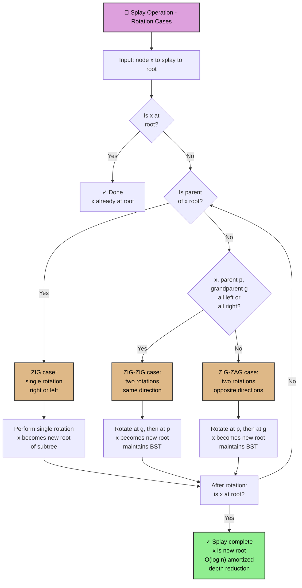
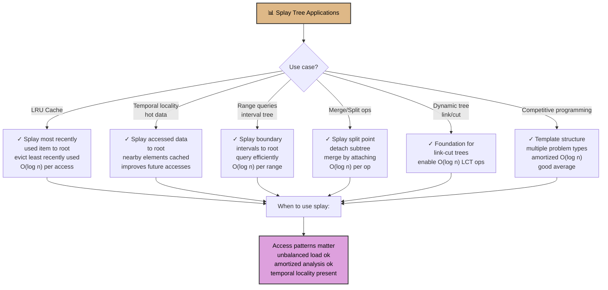

# Splay Tree

## Overview

A **Splay Tree** is a self-adjusting binary search tree where recently accessed nodes are moved to the root via a "splay" operation. Unlike AVL trees which maintain strict balance, splay trees use amortized analysis: O(log n) operations on average with O(n) worst case, but with excellent cache locality and no balance metadata.

Invented by Sleator and Tarjan (1985), splay trees are the foundation for link-cut trees, competitive programming, and systems that benefit from temporal locality (frequently accessed items become fast to access). They appear in web browser caches, database buffer pools, and network routing tables.

The key insight is that real-world access patterns are non-uniform; splay trees exploit this by reorganizing on access, reducing future costs for hot data.

## When to Use

- **Access patterns have temporal locality**: Recently accessed elements accessed again soon
- **Competitive programming**: Template-based problems where amortized O(log n) suffices
- **Foundation for advanced structures**: Link-cut trees, dynamic graphs
- **Cache locality matters**: Splay trees reorganize to improve cache performance
- **Not ideal when**: All elements have equal access probability (worst case is O(n)), or rigid worst-case bounds required (use AVL instead)

## ASCII Visualization

```
Initial BST:
        4
       / \
      2   6
     / \ / \
    1  3 5  7

After splay(1):
The zig-zig-zig operations move 1 to root while maintaining BST property.

Splay path: 1 ← 2 ← 4

Before splay(1):
        4           After splay(1):          1
       / \                                 / \
      2   6                               2   4
     /   / \                               \   \
    1   5   7                               3   6
                                             \  / \
                                              5 5  7

Rotations (zig, zig-zig, zig-zag) bring 1 to root.
```

### Splay Operations

```
Three cases for splay(x) where p = parent of x, g = grandparent:

1. ZIG (x is child of root p):
   Right rotate at p (if x is left child)
        p                 x
       / \      →        / \
      x   C            A   p
     / \                  / \
    A   B                B   C

2. ZIG-ZIG (x and p are both left children, or both right):
   Right rotate at g, then right rotate at p
        g                p                 x
       / \      →       / \      →        / \
      p   D           x   g              A   p
     / \            / \  / \               / \
    x   C          A   B C   D            B   g
   / \                                      / \
  A   B                                    C   D

3. ZIG-ZAG (x is right child, p is left child, or vice versa):
   Left rotate at p, then right rotate at g
        g                g                 x
       / \      →       / \      →        / \
      p   D           x   D              p   g
     / \            / \                / \   / \
    A   x          p   C              A   B C   D
       / \        / \
      B   C      A   B
```

## Operations & Complexity

| Operation          | Time Complexity | Amortized | Notes |
|-------------------|:---------------:|:--------:|-------|
| Search            | O(n)            | O(log n) | Worst case: skewed tree. Amortized: splay brings accessed node up. |
| Insert            | O(n)            | O(log n) | Insert then splay to root. |
| Delete            | O(n)            | O(log n) | Find, splay, then merge left and right subtrees. |
| Splay(x)          | O(n)            | O(log n) | Number of rotations ≤ O(log n) amortized. |
| Space             | —               | —        | O(n) |

> Amortized analysis: potential function Φ = Σ(log size[v]) for all v. Splay operations pay for rotations via potential decrease.

## Key Invariants

1. **BST property**: left < node < right at every node.
2. **No balance metadata**: Unlike AVL, splay trees store no height or balance information.
3. **Splay-to-root**: After access, the accessed node is always at the root.
4. **Amortized O(log n)**: Over a sequence of operations, average cost is O(log n), though one operation can be O(n).
5. **Self-optimizing**: Frequently accessed nodes remain high in the tree; infrequently accessed nodes sink.

## Solution Approach Flowchart

```mermaid
flowchart TD
    A["🎯 Problem: Ordered set / tree operations"] -->|Requirement?| B{Need worst-case<br/>guarantee?}
    B -->|Yes, O(log n) hard| C["✓ Use AVL/Red-Black<br/>Strict balance<br/>metadata required"]
    B -->|No, amortized ok| D["✓ Splay tree viable<br/>Simpler code"]
    D --> E["📋 Identify operation"]
    E -->|Find x| F["🔍 Search for x<br/>Then splay x to root"]
    E -->|Insert x| G["➕ Insert x as leaf<br/>Then splay x to root"]
    E -->|Delete x| H["➖ Find x by splay<br/>Delete root<br/>Merge left/right subtrees"]
    F --> I["✓ x now at root<br/>Future accesses to x<br/>O(1) best case"]
    G --> I
    H --> J["✓ Subtrees merged<br/>at new root<br/>O(log n) amortized"]
    I --> K["⏱ Amortized O(log n)<br/>per operation<br/>temporal locality gain"]
    J --> K
    
    style A fill:#deb887,color:#000,stroke:#333,stroke-width:2px
    style C fill:#add8e6,color:#000,stroke:#333,stroke-width:2px
    style D fill:#add8e6,color:#000,stroke:#333,stroke-width:2px
    style E fill:#dda0dd,color:#000,stroke:#333,stroke-width:2px
    style I fill:#90ee90,color:#000,stroke:#333,stroke-width:2px
    style J fill:#90ee90,color:#000,stroke:#333,stroke-width:2px
    style K fill:#90ee90,color:#000,stroke:#333,stroke-width:2px
```

## Splay Tree Rotation Cases Flowchart



## BST vs Splay vs AVL vs Red-Black Flowchart

```mermaid
flowchart TD
    A["🤔 Choosing balanced BST variant"] --> B{Requirements?}
    B -->|Worst-case O(log n)<br/>guaranteed| C["✓ Red-Black Tree<br/>most flexible<br/>1-2 metadata per node"]
    B -->|Educational<br/>strict balance| D["✓ AVL Tree<br/>2-3 balancing<br/>height metadata"]
    B -->|Temporal locality<br/>cache-friendly| E["✓ Splay Tree<br/>O(log n) amortized<br/>no metadata"]
    B -->|Simple structure<br/>not balanced| F["❌ BST<br/>O(n) worst case<br/>use if no structure"]
    B -->|Custom operations<br/>like link-cut| G["✓ Splay Tree<br/>foundation for LCT<br/>flexible structure"]
    C --> H["Trade-offs"]
    D --> H
    E --> H
    G --> H
    H --> I["Red-Black: production systems<br/>AVL: teaching/reference<br/>Splay: competitive programming<br/>BST: baseline understanding"]
    
    style A fill:#deb887,color:#000,stroke:#333,stroke-width:2px
    style C fill:#90ee90,color:#000,stroke:#333,stroke-width:2px
    style D fill:#add8e6,color:#000,stroke:#333,stroke-width:2px
    style E fill:#90ee90,color:#000,stroke:#333,stroke-width:2px
    style G fill:#90ee90,color:#000,stroke:#333,stroke-width:2px
    style I fill:#dda0dd,color:#000,stroke:#333,stroke-width:2px
```

## Splay Tree Application Patterns Flowchart



## Common Patterns

1. **Temporal Locality Exploitation**: Items accessed recently are accessed again soon. Splay trees move recently accessed items to root, making future accesses cheaper. Ideal for LRU caches, browser history, etc.

2. **Competitive Programming: Interval Trees**: Use splay tree to manage intervals. Splay the interval being queried to root; adjacent intervals are now accessible quickly. Time: O(log n) amortized per operation.

3. **Dynamic Connectivity**: Use splay trees as the underlying structure in link-cut trees. Splay ensures frequently accessed paths are high in the tree, improving amortized performance.

4. **Merge and Split**: Splay trees naturally support splitting (splay boundary element, detach left/right subtree) and merging (splay max of left tree, attach right as its right child). Time: O(log n) amortized each.

## Interview Questions

1. **Why use splay trees instead of AVL trees?** AVL: strict O(log n) worst-case, more metadata. Splay: O(log n) amortized, simpler code, better cache locality. Choose based on whether you need worst-case guarantees (AVL) or can tolerate amortized analysis (splay).

2. **What is amortized analysis and why does splay tree have O(log n) amortized time?** Amortized: average cost per operation over many operations, not worst-case single op. Splay uses potential function Φ = Σ log(size) per node. Splay operations rearrange the tree, reducing potential; the cost of rotations is "paid for" by potential decrease, yielding O(log n) average.

3. **Can a splay tree operation really take O(n) time?** Yes. Consider a single access to the leftmost node of a right-skewed tree. You must perform n-1 rotations, taking O(n) time. However, this reorganizes the tree, making future accesses faster. Over many operations, average is O(log n).

4. **What happens if you search for the same element repeatedly?** First search: O(log n) amortized. Subsequent searches: O(1) because the element is at root. This temporal locality is what splay trees exploit.

5. **How do you delete a node in a splay tree?** Splay the node to root. Delete it. Now merge left and right subtrees: splay the max element of the left subtree to root (making it have no right child), then attach the right subtree as its right child. Time: O(log n) amortized.

6. **Is splay tree construction from n elements O(n) or O(n log n)?** O(n log n) if you insert elements one-by-one. Some constructions (with specific patterns) could be optimized, but general insertion is O(log n) per element.

7. **Why are splay trees the foundation for link-cut trees?** Splay trees support rapid restructuring with no balance metadata. This flexibility enables link-cut trees to change edges (link/cut operations) efficiently while maintaining amortized O(log n) per operation.

## Implementation Notes

- **Splay Operation**: The core. Implement zig, zig-zig, and zig-zag cases carefully. Zig-zig must rotate at grandparent first, then parent (not the reverse!). Off-by-one errors in rotations are common.
- **No Balance Metadata**: Unlike AVL (height) or Red-Black (color), splay trees store only pointers and values. This simplifies code but requires understanding amortized analysis.
- **Lazy Propagation**: Splay trees don't naturally support lazy propagation like segment trees. If you need range updates, use a different structure.
- **Testing**: Verify BST property after each operation. Verify that accessed node is at root. Test unbalanced input (e.g., sorted sequences) to see behavior.
- **Cache Performance**: In practice, splay trees have excellent cache locality because recently accessed nodes are high in the tree (likely in L1/L2 cache).

## References

1. Sleator, D. D., & Tarjan, R. E. (1985). "Self-adjusting binary search trees." *Journal of the ACM*, 32(3), 652-686.
2. Tarjan, R. E. (1983). "Data structures and network algorithms." *SIAM*.
3. Competitive Programming resources (Codeforces, TopCoder) for problem examples.
