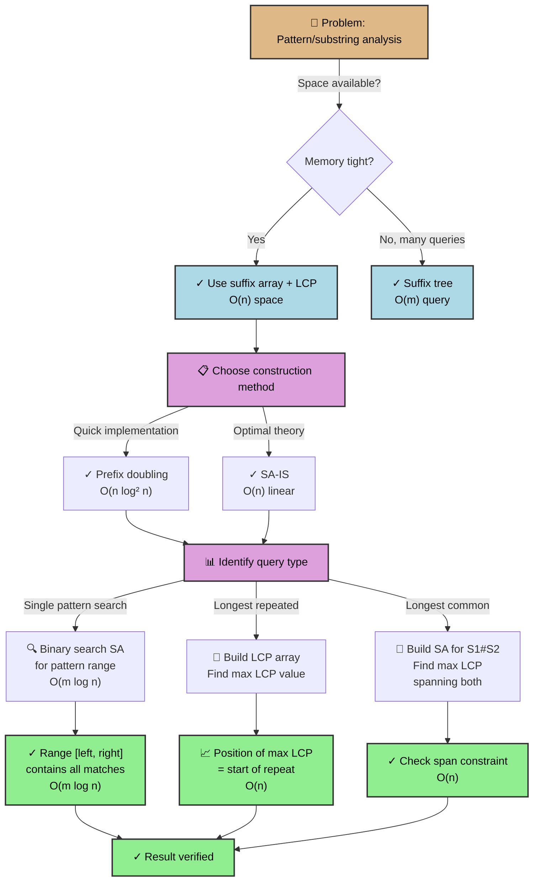
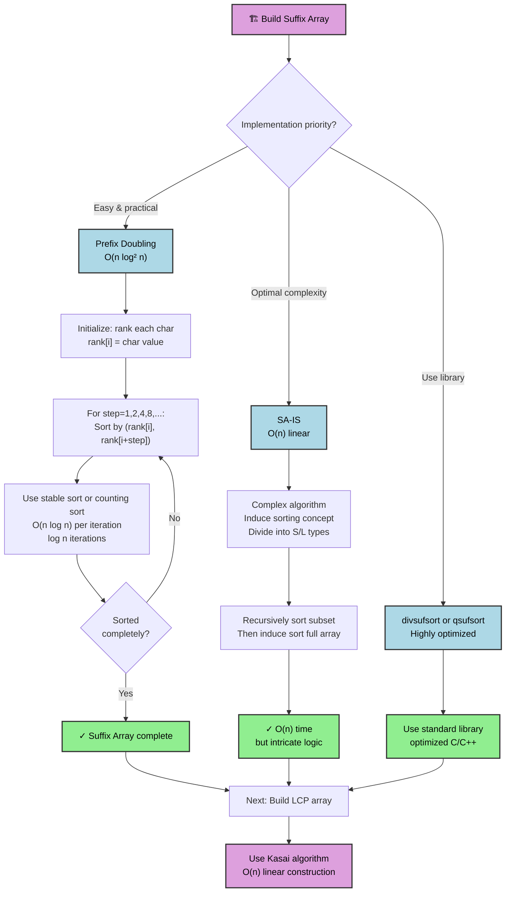
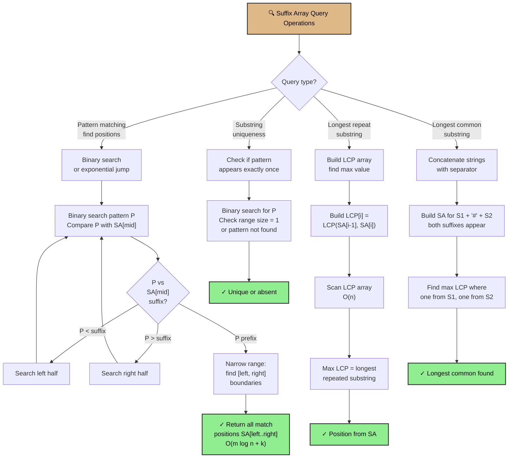
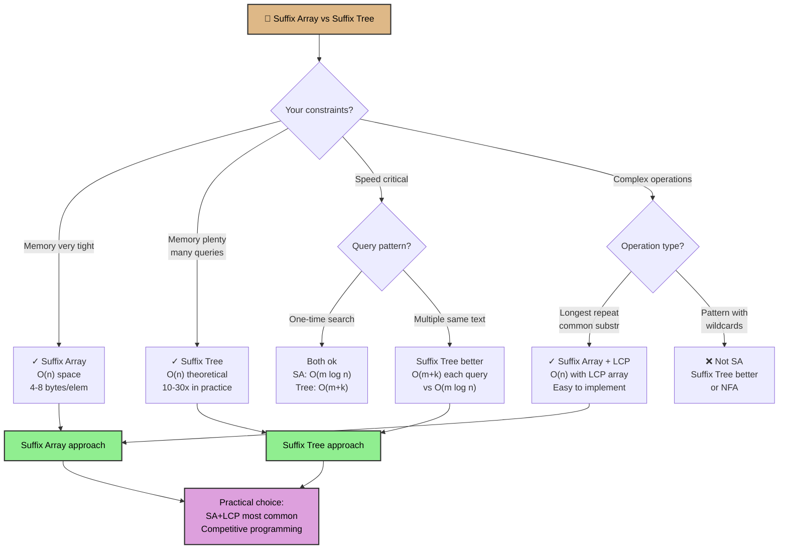

# Suffix Array

## Overview

A **Suffix Array** is an array of integers that stores the starting positions of all suffixes of a string in sorted order. It is a space-efficient alternative to suffix trees, requiring O(n log n) time to construct and only O(n) space (with an optional LCP array for more advanced queries).

Suffix arrays were introduced by Manber and Myers (1993) as a practical alternative to suffix trees. They are used in data compression (bzip2), DNA sequence analysis, and search engines. While slightly slower than suffix trees for some queries (requiring binary search), they use 3-10x less memory in practice.

The LCP (Longest Common Prefix) array, typically paired with suffix arrays, records the length of the longest common prefix between consecutive suffixes in the sorted array, enabling advanced queries like longest repeated substring in O(n) time.

## When to Use

- **Space-constrained environments**: Suffix array uses O(n) space; suffix tree often uses 10-30x more
- **Multiple pattern queries where binary search is acceptable**: O(log n) per query
- **Building compressed data structures**: LCP array enables advanced algorithms (longest repeat, compressed matching)
- **DNA/bioinformatics**: When processing large genomes with tight memory budgets
- **Competitive programming**: Suffix arrays are easier to implement correctly than suffix trees
- One-off searches don't justify the overhead; use KMP instead

## ASCII Visualization

```
Text: "banana$"

All 7 suffixes:
0: banana$
1: anana$
2: nana$
3: ana$
4: na$
5: a$
6: $

Sorted lexicographically:
Index  Suffix
0      $          (suffix starting at position 6)
1      a$         (suffix starting at position 5)
2      ana$       (suffix starting at position 3)
3      anana$     (suffix starting at position 1)
4      banana$    (suffix starting at position 0)
5      na$        (suffix starting at position 4)
6      nana$      (suffix starting at position 2)

Suffix Array: [6, 5, 3, 1, 0, 4, 2]
(represents positions in original string)

LCP Array (Longest Common Prefix between consecutive suffixes):
LCP[0] = 0    ($ has no prefix)
LCP[1] = 0    (a$ vs $ have no common prefix)
LCP[2] = 1    (ana$ vs a$ share 'a')
LCP[3] = 3    (anana$ vs ana$ share 'ana')
LCP[4] = 0    (banana$ vs anana$ share nothing)
LCP[5] = 1    (na$ vs banana$ share 'n')
LCP[6] = 2    (nana$ vs na$ share 'na')

LCP:    [0, 0, 1, 3, 0, 1, 2]
```

### Searching for Pattern "ana"

```
Binary search for "ana" in sorted suffixes:

Compare "ana" with middle suffix:
- "ana$" vs "ana" → match or ana is prefix
  Continue binary search with "ana..." to find range of all matches

Result: positions 3 and 1 in original string both have "ana"
```

## Operations & Complexity

| Operation          | Time Complexity | Space Complexity | Notes |
|-------------------|:---------------:|:----------------:|-------|
| Build (O(n log n))| O(n log n)      | O(n)             | Using prefix doubling or divsufsort |
| Build (Linear)    | O(n)            | O(n)             | SA-IS algorithm (complex to implement) |
| Build LCP array   | O(n)            | O(n)             | Using Kasai's algorithm |
| Pattern search    | O(m log n)      | O(1)             | m = pattern length; binary search |
| Longest repeat    | O(n)            | O(1)             | With LCP array, find max value |
| Space (SA only)   | —               | O(n)             | ~4-8 bytes per element (32/64-bit ints) |
| Space (SA + LCP)  | —               | O(n)             | Compact: ~8-12 bytes per element |

> Prefix doubling is O(n log n) but practical. SA-IS (Suffix Array Induced Sorting) is linear but complex. LCP construction via Kasai's algorithm is O(n) with clever use of suffix arrays.

## Key Invariants

1. **Sorted suffixes**: SA[i] < SA[i+1] lexicographically for 0 ≤ i < n-1.
2. **All n suffixes represented**: SA contains each position 0..n-1 exactly once.
3. **LCP[i]**: Length of longest common prefix between suffixes at SA[i-1] and SA[i].
4. **LCP[0] = 0**: By definition, the first suffix in sorted order has no predecessor.
5. **LCP monotonicity (with Kasai)**: LCP values do not increase arbitrarily; used for O(n) construction.
6. **Range of matches**: If pattern P matches, all matches form a contiguous range in the suffix array.

## Solution Approach Flowchart



## Suffix Array Construction Methods Flowchart



## Suffix Array Query Patterns Flowchart



## Suffix Array vs Suffix Tree Comparison Flowchart



## Common Patterns

1. **Binary Search Pattern Matching**: Build suffix array, use binary search to find the range [left, right] where all suffixes starting with the pattern lie. Return SA[left..right]. Time: O(m log n).

2. **Longest Repeated Substring with LCP**: Build LCP array via Kasai's algorithm. The maximum value in LCP array gives the length of the longest repeated substring. The position of that max value tells you which suffix and its predecessor share that prefix.

3. **Longest Common Substring (LCS)**: Build suffix array for S1 + "#" + S2. Build LCP array. Find the maximum LCP value where one suffix is from S1 and the other from S2 (mark suffixes accordingly). This is the LCS.

4. **Counting Distinct Substrings**: Every substring of S is a prefix of some suffix. Count = (total characters) - (sum of LCP array). Uses the fact that each suffix contributes (length - previous LCP) new prefixes.

## Interview Questions

1. **What is the space advantage of suffix arrays over suffix trees?** Suffix tree: 10-30x input size due to pointers and node overhead. Suffix array: ~4-8 bytes per element (just an integer index), plus ~4 bytes per element for LCP array. Total ~8-12 bytes per character.

2. **Why is binary search on suffix array O(m log n) instead of O(log n)?** Each comparison between pattern and suffix takes O(m) time. We do O(log n) comparisons, giving O(m log n).

3. **How does Kasai's algorithm build the LCP array in O(n) time?** It processes suffixes in the order they appear in the original string (via an inverse suffix array), using the LCP of the previous suffix to avoid redundant comparisons. Brilliant trick: if SA[i] = j, then SA[i-1] = k, the LCP of suffixes at j and k is related to LCP of suffixes at j+1 and k+1 (minus the first character).

4. **What is the inverse suffix array, and why is it useful?** Inverse[SA[i]] = i; tells you the rank/position of each suffix in the sorted array. Kasai uses it to iterate suffixes in original order while accessing their ranks.

5. **Can you implement pattern matching in O(log n + k) time using suffix array?** Not with standard suffix array. You need a **suffix tree** or an **augmented suffix array** with a data structure (like a suffix automaton or segment tree) to count matches in a range without iterating all matches.

6. **How do you handle multiple patterns efficiently?** Suffix array handles them one-by-one: O(Σ(mᵢ log n)) where mᵢ is the length of pattern i. Use Aho-Corasick if you want O(n + Σmᵢ).

7. **What are advantages/disadvantages vs. suffix tree?** Suffix array: simpler, less space, easier to implement. Suffix tree: O(m + k) pattern queries without binary search, built-in suffix links. For interviews: suffix arrays are safer; for production: depends on queries.

## Implementation Notes

- **Prefix Doubling**: Compare k-character prefixes, then 2k, 4k, etc. Use a radix sort per iteration for O(n log n) total. Stable sorting preserves lexicographic order.
- **Kasai's Algorithm**: Use an LCP stack and inverse suffix array. Easy to off-by-one error; carefully handle the transition between suffixes.
- **Binary Search Termination**: Compare the full pattern with the suffix at the mid-position. Be careful with string length differences.
- **Testing**: Verify suffix array is a valid permutation of 0..n-1. Verify LCP[0] = 0 and LCP[i] ≤ length of both suffixes at SA[i-1] and SA[i].
- **Edge Cases**: Empty string, single character, all identical characters, pattern longer than text.

## References

1. Manber, U., & Myers, G. (1993). "Suffix arrays: a new method for on-line string searches." *SIAM Journal on Computing*, 22(5), 935-948.
2. Kasai, T., Lee, G., Shibuya, H., Kasai, T., Sung, W., & Arikawa, S. (2001). "Linear-time longest-common-prefix computation in suffix arrays and its applications." *CPM*, 181-192.
3. Gusfield, D. (1997). *Algorithms on Strings, Trees, and Sequences*. Cambridge University Press.
