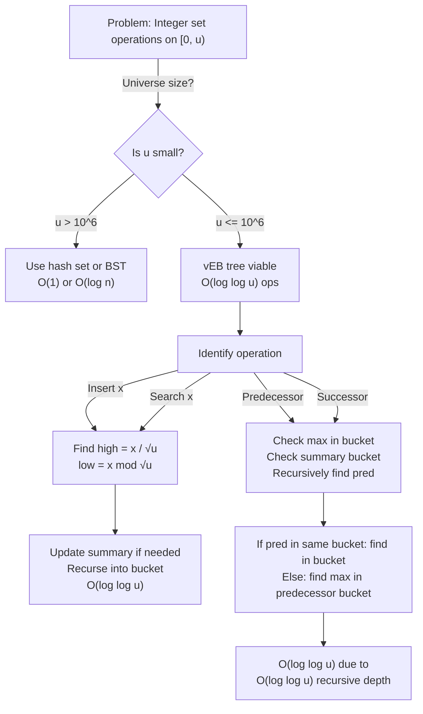

# van Emde Boas Tree

## Overview

A **van Emde Boas (vEB) Tree** is a data structure for maintaining a set of integers from a universe [0, u) where u is a power of 2. It supports insert, delete, search, predecessor, and successor in O(log log u) time, which is faster than comparison-based trees (O(log n)) when the universe is small.

Invented by van Emde Boas, Kaas, and Zijlstra (1975), vEB trees are used in advanced algorithms, competitive programming (shortest path with small edge weights), and theoretical computer science. They represent a bridge between comparison-based and non-comparison-based data structures.

The key insight is recursive subdivision: partition the universe into √u chunks, recursively store each chunk. This enables O(log log u) operations through clever use of auxiliary structures.

## When to Use

- **Integer range [0, u), small universe size**: vEB trees excel when u ≤ 2^20 or so
- **Predecessor/successor queries**: O(log log u) instead of O(log n)
- **Dynamic shortest path with small edge weights**: Dijkstra's algorithm becomes O((V + E) log log W)
- **Bit operations and low-level optimization**: When typical BSTs are too slow
- **Not ideal for**: Large sparse data (u >> n), very small u (hash tables better), comparison-only data

## ASCII Visualization

```
van Emde Boas Tree for u = 16 (universe [0, 15]):

Recursive structure:
- High √u = 4 "summary" buckets [0..3]
- Low √u = 4 elements per bucket
- Each bucket is itself a vEB tree for u' = √u = 4

vEB(16):
  Summary: vEB(4) covering which of 4 buckets are non-empty
  Buckets: 4 x vEB(4) for elements in ranges [0-3], [4-7], [8-11], [12-15]

Inserted elements: {0, 3, 5, 7, 8, 10, 14}

High (bucket indices): 0, 0, 1, 1, 2, 2, 3
Low (indices within buckets): 0, 3, 1, 3, 0, 2, 2

Summary vEB(4): {0, 1, 2, 3} (all buckets have something)

Bucket 0: vEB(4) containing {0, 3}
Bucket 1: vEB(4) containing {1, 3}
Bucket 2: vEB(4) containing {0, 2}
Bucket 3: vEB(4) containing {2}

Tree structure:
                    vEB(16)
                   /   |    \
            Summary   B0    B1    B2    B3
            vEB(4)   vEB(4) vEB(4) vEB(4) vEB(4)
           / | \ \
          0  1  2  3 (bucket IDs)
```

## Operations & Complexity

| Operation          | Time Complexity | Space Complexity | Notes |
|-------------------|:---------------:|:----------------:|-------|
| Search            | O(1)            | O(log u)         | Check bit vector or recursively search |
| Insert            | O(log log u)    | O(log u)         | Update summary and recursive structure |
| Delete            | O(log log u)    | O(log u)         | Similar to insert |
| Predecessor       | O(log log u)    | O(1)             | Recursive predecessor search |
| Successor         | O(log log u)    | O(1)             | Recursive successor search |
| Min / Max         | O(1)            | O(1)             | Maintain explicit min/max pointers |
| Space             | —               | O(u)             | √u buckets, each O(u) storage |

> O(log log u) is faster than O(log n) when u is small relative to n or when u is much larger than n. Space is O(u), which can be large.

## Key Invariants

1. **Recursive universe split**: Universe [0, u) split into √u buckets of size √u each.
2. **Summary structure**: vEB(√u) indicates which buckets are non-empty.
3. **Bucket structures**: vEB(√u) for each non-empty bucket.
4. **Min/Max cached**: Explicit min and max elements stored for O(1) access.
5. **Height bound**: vEB tree has O(log log u) recursive depth.

## Solution Approach Flowchart



## Common Patterns

1. **Predecessor/Successor Queries**: Use vEB tree to maintain dynamic set. For predecessor(x): check if x-1 is in current bucket's vEB tree. If not, find predecessor of ⌈(x-1)/√u⌉ in summary; recurse into that bucket and find max. Time: O(log log u).

2. **Bit-level Storage**: For small u (u ≤ 64), use a single 64-bit integer as a bit vector. Each operation is O(1) with bit operations. vEB tree becomes vEB tree with bit-vector base cases.

3. **Dijkstra with Integer Weights**: Use vEB tree as priority queue where keys are edge weights in [0, W). Dijkstra's algorithm runs in O((V + E) log log W) time, improving over O((V + E) log V) with binary heaps when W is small.

4. **Integer Sorting**: Use vEB tree to sort integers from [0, u) in O(n log log u) time, improving over O(n log n) comparison-based sorting when u is small.

## Interview Questions

1. **What is the universe vs. cardinality distinction?** Universe = range of possible values [0, u). Cardinality n = number of elements actually stored. vEB trees are good when u is small; when u >> n, hash tables are better.

2. **How does vEB tree achieve O(log log u) time?** Through recursive subdivision: depth is log_√u(u) = log(u) / log(√u) = 2 log(u) / log(u) = 2 (wait, that's wrong). Actually: depth = log_√u(u) = 2, so height is O(log log u). The recursion depth is O(log log u).

3. **Why is space O(u) instead of O(n)?** vEB tree must maintain a summary structure and buckets for all possible values in [0, u), not just stored elements. This is the space-time tradeoff: O(u) space for O(log log u) time.

4. **Can you use vEB trees for real-valued data?** No, vEB trees require a discrete universe of integers. For real-valued data, use BSTs, skip lists, or other comparison-based structures.

5. **How do you optimize vEB tree space usage?** Use implicit structures: only allocate buckets and summary nodes for non-empty ranges. This reduces space to O(n log u) with careful implementation. Downside: more complex code.

6. **What is a "hybrid" vEB tree?** Use vEB tree down to some depth, then switch to hash tables for the remaining levels. This balances time and space: O(u) space reduced to O(n · polylog(u)), operations still O(log log u) or O(log log u + ε).

7. **Why is vEB tree rarely used in practice despite being theoretically elegant?** Large constant factors, space overhead, and cache locality issues make BSTs and hash tables faster in practice on real machines. vEB trees shine in theoretical analysis and specific applications (e.g., Dijkstra with small weights).

## Implementation Notes

- **Bit Vector Base Case**: When u ≤ 64, use a single 64-bit integer. Bit operations (popcount, find-first-set, etc.) are O(1) hardware operations.
- **Recursive Indexing**: high = x / √u and low = x mod √u. Precompute √u to avoid repeated square root calculations.
- **Summary and Buckets**: Allocate summary vEB(√u) and √u buckets vEB(√u). Lazy allocation saves space when buckets are sparse.
- **Min/Max Caching**: Always maintain min and max. On insert, check against min/max. On delete, update if necessary.
- **Testing**: Verify predecessor/successor correctness on small u (e.g., u=16). Test edge cases: empty set, single element, all elements.

## References

1. van Emde Boas, P., Kaas, R., & Zijlstra, E. (1975). "Design and implementation of an efficient priority queue." *Mathematical Systems Theory*, 10, 99-127.
2. Cormen, T. H., Leiserson, C. E., Rivest, R. L., & Stein, C. (2009). *Introduction to Algorithms* (3rd ed.). MIT Press. (Chapter 20: van Emde Boas trees)
3. Willard, D. E. (1983). "Log-logarithmic worst-case range queries are possible in space Θ(n)." *Information Processing Letters*, 17(2), 81-84.
