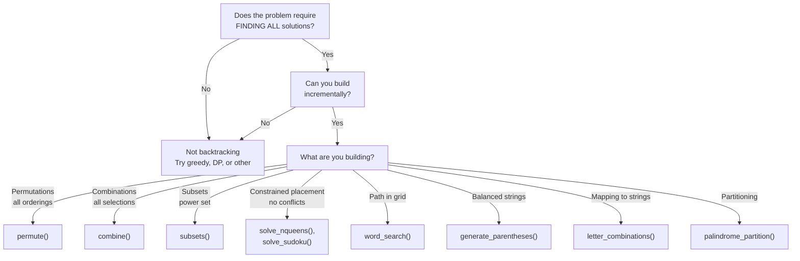
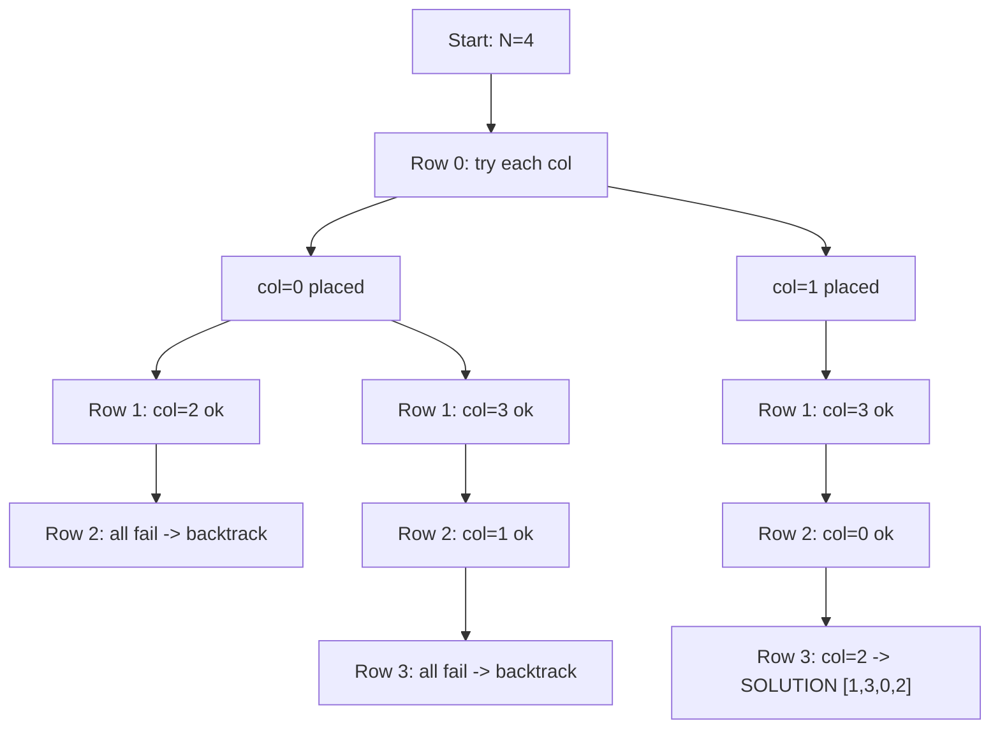
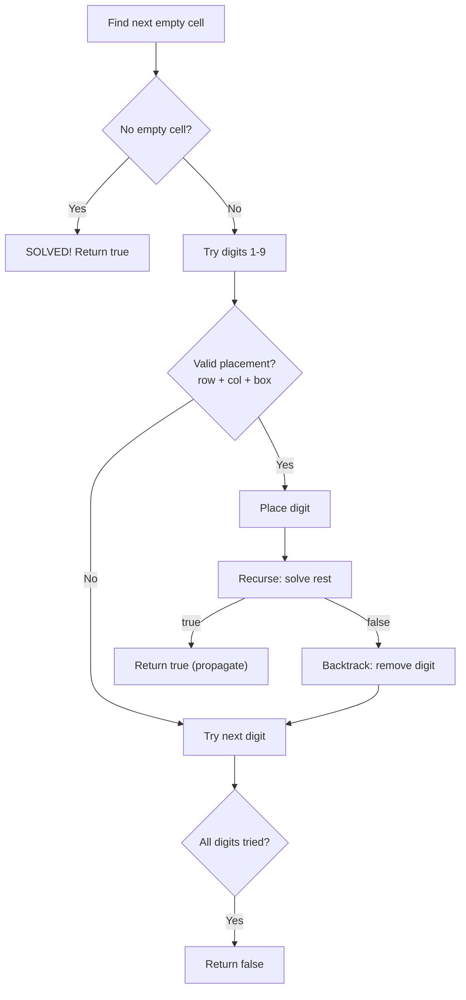
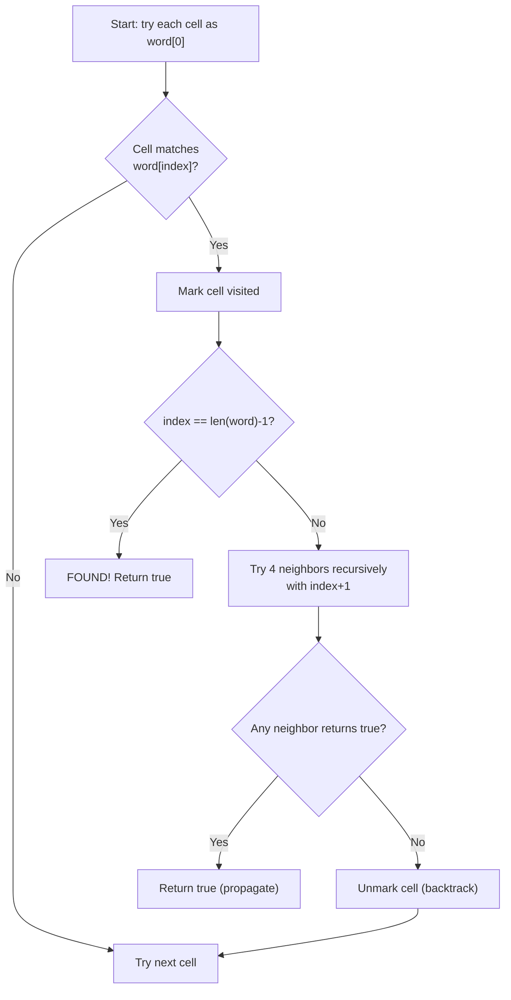
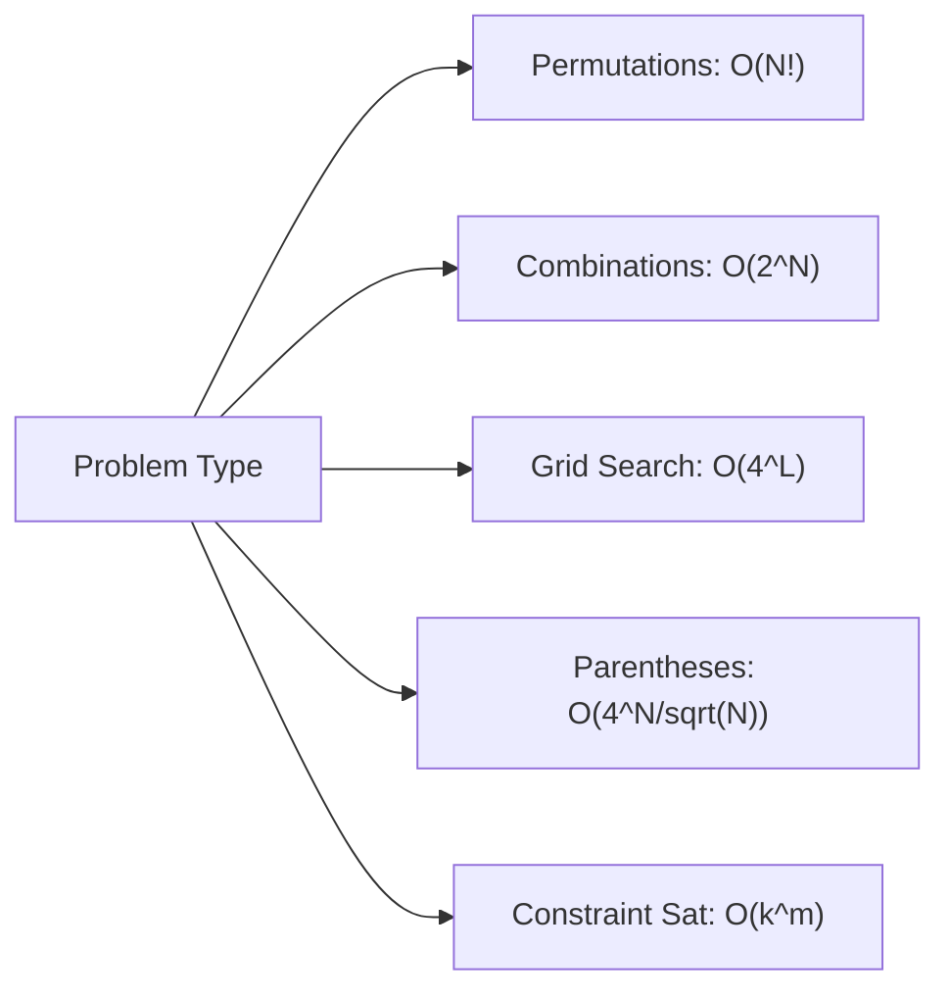

# Backtracking Algorithms: Decision Flowchart & Patterns

A comprehensive guide to backtracking algorithms for SDE interview preparation. Backtracking is a systematic exploration technique that explores all possible solutions through trial-and-error, abandoning (backtracking) when constraints are violated.

---

## When to Use Backtracking

1. **You need ALL solutions** — exhaustively explore the solution space
2. **Solutions can be built incrementally** — construct partial solutions and extend them
3. **You can prune branches early** — invalid branches can be identified and skipped
4. **The problem has constraints** — valid solutions must satisfy multiple constraints

**Key insight:** Backtracking = DFS on solution tree with early pruning.

---

## Decision Flowchart



---

## Algorithm Summary Table

| Algorithm | Problem | Time | Space | Key Insight |
|-----------|---------|------|-------|-------------|
| N-Queens | Place n queens, no conflicts | O(N!) | O(N) | Prune early if position invalid |
| Sudoku | Fill 9x9 grid, row/col/box unique | O(9^81) worst | O(1) | Constraint checking is key |
| Word Search | Find path in grid for word | O(N·M·4^L) | O(L) | Track visited cells per path |
| Permutations | All orderings of list | O(N! · N) | O(N!) | Use "used" array |
| Combinations | All k-selections from n | O(C(n,k)·k) | O(k) | Use start index |
| Subsets | Power set | O(N · 2^N) | O(2^N) | Binary decisions |
| Letter Combos | Keypad combinations | O(4^N · N) | O(4^N) | Phone pad mapping |
| Parentheses | Valid n-pair brackets | O(Cat_N) | O(N) | Track open vs closed count |
| Palindrome Partition | All palindrome splits | O(N · 2^N) | O(N) | Check palindrome at each split |
| Word Break II | All sentence decompositions | O(2^N) | O(N) | Memo + backtrack |

---

## Universal Backtracking Template

```python
def backtrack_template(input_data):
    result = []

    def backtrack(path, start_or_remaining):
        # Base case: solution is complete
        if is_complete(path):
            result.append(path[:])  # Always copy!
            return

        # Pruning: skip invalid branches early
        if not is_promising(path):
            return

        for choice in get_choices(start_or_remaining):
            # Build: make a choice
            path.append(choice)

            # Recurse with updated state
            backtrack(path, next_state(start_or_remaining, choice))

            # Backtrack: undo the choice
            path.pop()

    backtrack([], input_data)
    return result
```

---

## 1. N-Queens

**Problem:** Place N queens on an N×N board so no two queens attack each other.

### Execution Trace (N=4)

```
Board positions: columns 0..3, rows 0..3
We place one queen per row, tracking which columns/diagonals are used.

Row 0: Try col=0
  Row 1: Try col=0 -> col conflict, skip
  Row 1: Try col=1 -> diag conflict with (0,0), skip
  Row 1: Try col=2 -> valid. Place (1,2)
    Row 2: Try col=0 -> diag conflict, skip
    Row 2: Try col=1 -> diag conflict, skip
    Row 2: Try col=3 -> diag conflict with (1,2), skip
    Row 2: All fail -> BACKTRACK to row 1
  Row 1: Try col=3 -> valid. Place (1,3)
    Row 2: Try col=1 -> valid. Place (2,1)
      Row 3: Try col=3 -> diag conflict, skip
      Row 3: All fail -> BACKTRACK
    Row 2: Try col=2 -> diag conflict, skip
    Row 2: All fail -> BACKTRACK to row 1
  Row 1: All fail -> BACKTRACK to row 0
Row 0: Try col=1
  Row 1: Try col=3 -> valid. Place (1,3)
    Row 2: Try col=0 -> valid. Place (2,0)
      Row 3: Try col=2 -> valid! SOLUTION: [1,3,0,2]
    ...
  ...
Row 0: Try col=2 -> leads to solution [2,0,3,1]
...
Total solutions for N=4: 2
```



### Python Implementation

```python
def solve_n_queens(n: int) -> list[list[str]]:
    """
    Solve N-Queens problem using backtracking.
    Returns all valid board configurations.
    Time: O(N!), Space: O(N)
    """
    results = []
    # Track which columns and diagonals are occupied
    cols = set()
    diag1 = set()  # top-left to bottom-right: row - col
    diag2 = set()  # top-right to bottom-left: row + col
    queens = []    # queens[row] = col of queen in that row

    def backtrack(row: int):
        if row == n:
            # Build board from queens positions
            board = []
            for r in range(n):
                board.append('.' * queens[r] + 'Q' + '.' * (n - queens[r] - 1))
            results.append(board)
            return

        for col in range(n):
            # Prune: skip if column or diagonal already attacked
            if col in cols or (row - col) in diag1 or (row + col) in diag2:
                continue

            # Place queen
            queens.append(col)
            cols.add(col)
            diag1.add(row - col)
            diag2.add(row + col)

            backtrack(row + 1)

            # Backtrack: remove queen
            queens.pop()
            cols.remove(col)
            diag1.remove(row - col)
            diag2.remove(row + col)

    backtrack(0)
    return results

# Usage
solutions = solve_n_queens(4)
for board in solutions:
    for row in board:
        print(row)
    print()
```

### Java Implementation

```java
import java.util.*;

public class NQueens {
    private int n;
    private List<List<String>> results = new ArrayList<>();
    private boolean[] cols, diag1, diag2;
    private int[] queens;

    public List<List<String>> solveNQueens(int n) {
        this.n = n;
        cols = new boolean[n];
        diag1 = new boolean[2 * n]; // row - col + n to shift non-negative
        diag2 = new boolean[2 * n]; // row + col
        queens = new int[n];
        backtrack(0);
        return results;
    }

    private void backtrack(int row) {
        if (row == n) {
            List<String> board = new ArrayList<>();
            for (int r = 0; r < n; r++) {
                char[] rowChars = new char[n];
                Arrays.fill(rowChars, '.');
                rowChars[queens[r]] = 'Q';
                board.add(new String(rowChars));
            }
            results.add(board);
            return;
        }

        for (int col = 0; col < n; col++) {
            if (cols[col] || diag1[row - col + n] || diag2[row + col]) continue;

            // Place queen
            queens[row] = col;
            cols[col] = true;
            diag1[row - col + n] = true;
            diag2[row + col] = true;

            backtrack(row + 1);

            // Backtrack
            cols[col] = false;
            diag1[row - col + n] = false;
            diag2[row + col] = false;
        }
    }
}
```

**Complexity:** Time O(N!), Space O(N) for the queen positions and sets.

---

## 2. Sudoku Solver

**Problem:** Fill a 9×9 grid so every row, column, and 3×3 box contains digits 1-9 exactly once.

### Execution Trace (partial)

```
Initial board (. = empty):
5 3 . | . 7 . | . . .
6 . . | 1 9 5 | . . .
. 9 8 | . . . | . 6 .
------+-------+------
8 . . | . 6 . | . . 3
4 . . | 8 . 3 | . . 1
7 . . | . 2 . | . . 6
------+-------+------
. 6 . | . . . | 2 8 .
. . . | 4 1 9 | . . 5
. . . | . 8 . | . 7 9

Find first empty cell: (0,2)
  Try 1: row[0] has 5,3 -> ok; col[2] has 8 -> ok; box[0] has 5,3,6,9,8 -> ok
  Try 2: check constraints -> ok
  ...
  Try 4: place 4 at (0,2)
    Next empty: (0,3) ...
    ... eventually backtrack when stuck
```



### Python Implementation

```python
def solve_sudoku(board: list[list[str]]) -> None:
    """
    Solve Sudoku in-place using backtracking + constraint checking.
    Time: O(9^m) where m = number of empty cells. Space: O(m) recursion.
    """
    def is_valid(r: int, c: int, digit: str) -> bool:
        # Check row
        if digit in board[r]:
            return False
        # Check column
        if digit in [board[i][c] for i in range(9)]:
            return False
        # Check 3x3 box
        box_r, box_c = 3 * (r // 3), 3 * (c // 3)
        for i in range(box_r, box_r + 3):
            for j in range(box_c, box_c + 3):
                if board[i][j] == digit:
                    return False
        return True

    def backtrack() -> bool:
        for r in range(9):
            for c in range(9):
                if board[r][c] == '.':
                    for digit in '123456789':
                        if is_valid(r, c, digit):
                            board[r][c] = digit
                            if backtrack():
                                return True
                            board[r][c] = '.'  # backtrack
                    return False  # no valid digit found
        return True  # board fully filled

    backtrack()
```

### Java Implementation

```java
public class SudokuSolver {
    public void solveSudoku(char[][] board) {
        backtrack(board);
    }

    private boolean backtrack(char[][] board) {
        for (int r = 0; r < 9; r++) {
            for (int c = 0; c < 9; c++) {
                if (board[r][c] == '.') {
                    for (char d = '1'; d <= '9'; d++) {
                        if (isValid(board, r, c, d)) {
                            board[r][c] = d;
                            if (backtrack(board)) return true;
                            board[r][c] = '.';
                        }
                    }
                    return false;
                }
            }
        }
        return true;
    }

    private boolean isValid(char[][] board, int r, int c, char d) {
        for (int i = 0; i < 9; i++) {
            if (board[r][i] == d) return false;
            if (board[i][c] == d) return false;
            int br = 3 * (r / 3) + i / 3;
            int bc = 3 * (c / 3) + i % 3;
            if (board[br][bc] == d) return false;
        }
        return true;
    }
}
```

**Complexity:** Time O(9^m) worst case where m = empty cells. With good constraint propagation, typically much faster.

---

## 3. Permutations

**Problem:** Return all permutations of a list of distinct integers.

### Execution Trace ([1,2,3])

```
backtrack(path=[], used={})
  Use 1: backtrack(path=[1], used={0})
    Use 2: backtrack(path=[1,2], used={0,1})
      Use 3: backtrack(path=[1,2,3], used={0,1,2}) -> RESULT [1,2,3]
    Use 3: backtrack(path=[1,3], used={0,2})
      Use 2: backtrack(path=[1,3,2], used={0,1,2}) -> RESULT [1,3,2]
  Use 2: backtrack(path=[2], used={1})
    Use 1: -> [2,1,3]
    Use 3: -> [2,3,1]
  Use 3: -> [3,1,2], [3,2,1]

Total: 6 = 3!
```

### Python Implementation

```python
def permute(nums: list[int]) -> list[list[int]]:
    """
    Generate all permutations of distinct integers.
    Time: O(N! * N), Space: O(N! * N) for output.
    """
    results = []
    used = [False] * len(nums)

    def backtrack(path: list[int]):
        if len(path) == len(nums):
            results.append(path[:])
            return
        for i, num in enumerate(nums):
            if used[i]:
                continue
            used[i] = True
            path.append(num)
            backtrack(path)
            path.pop()
            used[i] = False

    backtrack([])
    return results


def permute_with_duplicates(nums: list[int]) -> list[list[int]]:
    """
    Generate all unique permutations when input may have duplicates.
    Key: Sort first, then skip duplicate elements at same level.
    Time: O(N! * N), Space: O(N)
    """
    results = []
    nums.sort()
    used = [False] * len(nums)

    def backtrack(path: list[int]):
        if len(path) == len(nums):
            results.append(path[:])
            return
        for i in range(len(nums)):
            if used[i]:
                continue
            # Skip duplicates: if same as previous and previous not used,
            # we already generated permutations with that slot
            if i > 0 and nums[i] == nums[i - 1] and not used[i - 1]:
                continue
            used[i] = True
            path.append(nums[i])
            backtrack(path)
            path.pop()
            used[i] = False

    backtrack([])
    return results
```

### Java Implementation

```java
import java.util.*;

public class Permutations {
    public List<List<Integer>> permute(int[] nums) {
        List<List<Integer>> result = new ArrayList<>();
        boolean[] used = new boolean[nums.length];
        backtrack(nums, used, new ArrayList<>(), result);
        return result;
    }

    private void backtrack(int[] nums, boolean[] used,
                           List<Integer> path, List<List<Integer>> result) {
        if (path.size() == nums.length) {
            result.add(new ArrayList<>(path));
            return;
        }
        for (int i = 0; i < nums.length; i++) {
            if (used[i]) continue;
            used[i] = true;
            path.add(nums[i]);
            backtrack(nums, used, path, result);
            path.remove(path.size() - 1);
            used[i] = false;
        }
    }

    // With duplicates
    public List<List<Integer>> permuteUnique(int[] nums) {
        List<List<Integer>> result = new ArrayList<>();
        Arrays.sort(nums);
        boolean[] used = new boolean[nums.length];
        backtrackUnique(nums, used, new ArrayList<>(), result);
        return result;
    }

    private void backtrackUnique(int[] nums, boolean[] used,
                                  List<Integer> path, List<List<Integer>> result) {
        if (path.size() == nums.length) {
            result.add(new ArrayList<>(path));
            return;
        }
        for (int i = 0; i < nums.length; i++) {
            if (used[i]) continue;
            if (i > 0 && nums[i] == nums[i - 1] && !used[i - 1]) continue;
            used[i] = true;
            path.add(nums[i]);
            backtrackUnique(nums, used, path, result);
            path.remove(path.size() - 1);
            used[i] = false;
        }
    }
}
```

---

## 4. Combinations and Combination Sum

**Problem:** Find all combinations of k numbers from [1..n] and all combinations summing to target.

### Execution Trace (Combination Sum, candidates=[2,3,6,7], target=7)

```
backtrack(start=0, path=[], remaining=7)
  Choose 2: backtrack(start=0, path=[2], remaining=5)
    Choose 2: backtrack(start=0, path=[2,2], remaining=3)
      Choose 2: backtrack(path=[2,2,2], remaining=1)
        Choose 2: remaining goes negative -> PRUNE
        Choose 3: remaining goes negative -> PRUNE
      Choose 3: backtrack(path=[2,2,3], remaining=0) -> RESULT [2,2,3]
    Choose 3: backtrack(path=[2,3], remaining=2)
      Choose 2: backtrack(path=[2,3,2] but start=1 so skip 2!) -> only >=3
      All >= 3 exceed remaining -> PRUNE
    Choose 7: 2+7>7, skip from here
  Choose 3: backtrack(start=1, path=[3], remaining=4)
    Choose 3: backtrack(path=[3,3], remaining=1) -> all exceed 1, prune
  Choose 7: backtrack(start=3, path=[7], remaining=0) -> RESULT [7]

Results: [[2,2,3], [7]]
```

### Python Implementation

```python
def combine(n: int, k: int) -> list[list[int]]:
    """
    All combinations of k numbers from 1..n.
    Time: O(C(n,k)*k), Space: O(k)
    """
    results = []

    def backtrack(start: int, path: list[int]):
        if len(path) == k:
            results.append(path[:])
            return
        # Pruning: not enough elements left to complete
        remaining_needed = k - len(path)
        for i in range(start, n - remaining_needed + 2):
            path.append(i)
            backtrack(i + 1, path)
            path.pop()

    backtrack(1, [])
    return results


def combination_sum(candidates: list[int], target: int) -> list[list[int]]:
    """
    All combinations that sum to target (reuse allowed).
    Time: O(N^(T/M)) where T=target, M=min candidate. Space: O(T/M)
    """
    results = []
    candidates.sort()

    def backtrack(start: int, path: list[int], remaining: int):
        if remaining == 0:
            results.append(path[:])
            return
        for i in range(start, len(candidates)):
            if candidates[i] > remaining:
                break  # sorted, so all further are too big
            path.append(candidates[i])
            backtrack(i, path, remaining - candidates[i])  # i not i+1: reuse allowed
            path.pop()

    backtrack(0, [], target)
    return results


def combination_sum_no_reuse(candidates: list[int], target: int) -> list[list[int]]:
    """
    Combination Sum II: each number used at most once, handle duplicates.
    Time: O(2^N), Space: O(N)
    """
    results = []
    candidates.sort()

    def backtrack(start: int, path: list[int], remaining: int):
        if remaining == 0:
            results.append(path[:])
            return
        for i in range(start, len(candidates)):
            if candidates[i] > remaining:
                break
            # Skip duplicates at same level
            if i > start and candidates[i] == candidates[i - 1]:
                continue
            path.append(candidates[i])
            backtrack(i + 1, path, remaining - candidates[i])
            path.pop()

    backtrack(0, [], target)
    return results
```

### Java Implementation

```java
import java.util.*;

public class CombinationSum {
    public List<List<Integer>> combinationSum(int[] candidates, int target) {
        List<List<Integer>> result = new ArrayList<>();
        Arrays.sort(candidates);
        backtrack(candidates, target, 0, new ArrayList<>(), result);
        return result;
    }

    private void backtrack(int[] candidates, int remaining, int start,
                           List<Integer> path, List<List<Integer>> result) {
        if (remaining == 0) {
            result.add(new ArrayList<>(path));
            return;
        }
        for (int i = start; i < candidates.length; i++) {
            if (candidates[i] > remaining) break;
            path.add(candidates[i]);
            backtrack(candidates, remaining - candidates[i], i, path, result);
            path.remove(path.size() - 1);
        }
    }
}
```

---

## 5. Subsets / Power Set

**Problem:** Return all subsets (power set) of a list.

### Binary Decision Tree Visualization

```
nums = [1, 2, 3]

Each element: include or exclude -> 2^N subsets

                       []
              /                \
           [1]                  []
         /     \              /    \
      [1,2]   [1]          [2]     []
      /  \    /  \         / \    /  \
  [1,2,3][1,2][1,3][1] [2,3][2][3]  []

Results (read leaves + all nodes at complete depth):
[], [3], [2], [2,3], [1], [1,3], [1,2], [1,2,3]
```

### Python Implementation

```python
def subsets(nums: list[int]) -> list[list[int]]:
    """
    Generate all 2^N subsets using backtracking.
    Time: O(N * 2^N), Space: O(N * 2^N)
    """
    results = []

    def backtrack(start: int, path: list[int]):
        results.append(path[:])  # Add current subset (empty or partial)
        for i in range(start, len(nums)):
            path.append(nums[i])
            backtrack(i + 1, path)
            path.pop()

    backtrack(0, [])
    return results


def subsets_with_duplicates(nums: list[int]) -> list[list[int]]:
    """
    Subsets II: handle duplicate elements.
    Sort first, then skip duplicates at same recursion level.
    """
    results = []
    nums.sort()

    def backtrack(start: int, path: list[int]):
        results.append(path[:])
        for i in range(start, len(nums)):
            if i > start and nums[i] == nums[i - 1]:
                continue  # skip duplicate
            path.append(nums[i])
            backtrack(i + 1, path)
            path.pop()

    backtrack(0, [])
    return results
```

### Java Implementation

```java
import java.util.*;

public class Subsets {
    public List<List<Integer>> subsets(int[] nums) {
        List<List<Integer>> result = new ArrayList<>();
        backtrack(nums, 0, new ArrayList<>(), result);
        return result;
    }

    private void backtrack(int[] nums, int start,
                           List<Integer> path, List<List<Integer>> result) {
        result.add(new ArrayList<>(path));
        for (int i = start; i < nums.length; i++) {
            path.add(nums[i]);
            backtrack(nums, i + 1, path, result);
            path.remove(path.size() - 1);
        }
    }
}
```

---

## 6. Word Search

**Problem:** Given a grid of characters, find if a word exists as a connected path (4-directional).

### Execution Trace

```
Grid:
A B C E
S F C S
A D E E

Word: "ABCCED"

Start at (0,0)='A' matches word[0]
  Mark (0,0) visited
  Try (0,1)='B' matches word[1]
    Mark (0,1) visited
    Try (0,2)='C' matches word[2]
      Mark (0,2) visited
      Try (0,3)='E' -> word[3]='C', no match
      Try (1,2)='C' matches word[3]
        Mark (1,2) visited
        Try (1,3)='S' -> word[4]='E', no match
        Try (2,2)='E' matches word[4]
          Mark (2,2) visited
          Try (2,1)='D' matches word[5] -> FOUND!
```



### Python Implementation

```python
def exist(board: list[list[str]], word: str) -> bool:
    """
    Word Search: does word exist as path in grid?
    Time: O(N*M*4^L) where L=len(word). Space: O(L) for recursion.
    """
    rows, cols = len(board), len(board[0])

    def backtrack(r: int, c: int, idx: int) -> bool:
        if idx == len(word):
            return True
        if r < 0 or r >= rows or c < 0 or c >= cols:
            return False
        if board[r][c] != word[idx]:
            return False

        # Mark visited by temporarily modifying cell
        temp = board[r][c]
        board[r][c] = '#'

        found = (backtrack(r + 1, c, idx + 1) or
                 backtrack(r - 1, c, idx + 1) or
                 backtrack(r, c + 1, idx + 1) or
                 backtrack(r, c - 1, idx + 1))

        board[r][c] = temp  # restore (backtrack)
        return found

    for r in range(rows):
        for c in range(cols):
            if backtrack(r, c, 0):
                return True
    return False
```

### Java Implementation

```java
public class WordSearch {
    private int[][] dirs = {{0,1},{0,-1},{1,0},{-1,0}};

    public boolean exist(char[][] board, String word) {
        int rows = board.length, cols = board[0].length;
        for (int r = 0; r < rows; r++) {
            for (int c = 0; c < cols; c++) {
                if (backtrack(board, word, r, c, 0)) return true;
            }
        }
        return false;
    }

    private boolean backtrack(char[][] board, String word,
                               int r, int c, int idx) {
        if (idx == word.length()) return true;
        if (r < 0 || r >= board.length || c < 0 || c >= board[0].length) return false;
        if (board[r][c] != word.charAt(idx)) return false;

        char temp = board[r][c];
        board[r][c] = '#';

        for (int[] d : dirs) {
            if (backtrack(board, word, r + d[0], c + d[1], idx + 1)) {
                board[r][c] = temp;
                return true;
            }
        }

        board[r][c] = temp;
        return false;
    }
}
```

---

## 7. Generate Parentheses

**Problem:** Generate all combinations of n pairs of valid parentheses.

### Pruning via Count Tracking

```
n=3, build string of length 2n=6

State: (current_string, open_count, close_count)

("", 0, 0)
  Add '(': ("(", 1, 0)
    Add '(': ("((", 2, 0)
      Add '(': ("(((", 3, 0)
        Can't add '(' (open==n), add ')': ("((()"), 3, 1)
          ...-> "((())) " RESULT
      Add ')': ("(()"), 2, 1)
        Add '(': ("(()(" ,3,1) ->  "(()())" RESULT
        Add ')': ("(())", 2, 2) -> "(())()" RESULT
    Add ')': ("()", 1, 1)
      Add '(': ("()(", 2, 1)
        ... -> "()(())" RESULT
      Add ')': illegal (close would exceed open)
      ... -> "()()()" RESULT

Rules:
  Add '(' if open < n
  Add ')' if close < open
```

### Python Implementation

```python
def generate_parentheses(n: int) -> list[str]:
    """
    Generate all valid combinations of n pairs of parentheses.
    Time: O(4^n / sqrt(n)) = Catalan number. Space: O(n).
    """
    results = []

    def backtrack(current: str, open_count: int, close_count: int):
        if len(current) == 2 * n:
            results.append(current)
            return
        # Can add '(' if we haven't used all n
        if open_count < n:
            backtrack(current + '(', open_count + 1, close_count)
        # Can add ')' only if there are unmatched '('
        if close_count < open_count:
            backtrack(current + ')', open_count, close_count + 1)

    backtrack('', 0, 0)
    return results
```

### Java Implementation

```java
import java.util.*;

public class GenerateParentheses {
    public List<String> generateParenthesis(int n) {
        List<String> result = new ArrayList<>();
        backtrack(result, new StringBuilder(), 0, 0, n);
        return result;
    }

    private void backtrack(List<String> result, StringBuilder current,
                           int open, int close, int n) {
        if (current.length() == 2 * n) {
            result.add(current.toString());
            return;
        }
        if (open < n) {
            current.append('(');
            backtrack(result, current, open + 1, close, n);
            current.deleteCharAt(current.length() - 1);
        }
        if (close < open) {
            current.append(')');
            backtrack(result, current, open, close + 1, n);
            current.deleteCharAt(current.length() - 1);
        }
    }
}
```

---

## 8. Letter Combinations of Phone Number

**Problem:** Given digits 2-9, return all possible letter combinations.

### Phone Pad Mapping + Trace

```
Phone map: 2->abc, 3->def, 4->ghi, ..., 9->wxyz
Input: "23"

backtrack(index=0, path="")
  digit='2', letters="abc"
  Choose 'a': backtrack(index=1, path="a")
    digit='3', letters="def"
    Choose 'd': backtrack(index=2, path="ad") -> RESULT "ad"
    Choose 'e': -> RESULT "ae"
    Choose 'f': -> RESULT "af"
  Choose 'b': -> "bd", "be", "bf"
  Choose 'c': -> "cd", "ce", "cf"

Total: 3*3 = 9 combinations
```

### Python Implementation

```python
def letter_combinations(digits: str) -> list[str]:
    """
    Generate all letter combinations from phone keypad.
    Time: O(4^N * N) where N=len(digits). Space: O(N).
    """
    if not digits:
        return []

    phone_map = {
        '2': 'abc', '3': 'def', '4': 'ghi', '5': 'jkl',
        '6': 'mno', '7': 'pqrs', '8': 'tuv', '9': 'wxyz'
    }
    results = []

    def backtrack(index: int, path: list[str]):
        if index == len(digits):
            results.append(''.join(path))
            return
        for letter in phone_map[digits[index]]:
            path.append(letter)
            backtrack(index + 1, path)
            path.pop()

    backtrack(0, [])
    return results
```

### Java Implementation

```java
import java.util.*;

public class LetterCombinations {
    private static final String[] PHONE = {
        "", "", "abc", "def", "ghi", "jkl", "mno", "pqrs", "tuv", "wxyz"
    };

    public List<String> letterCombinations(String digits) {
        List<String> result = new ArrayList<>();
        if (digits == null || digits.isEmpty()) return result;
        backtrack(digits, 0, new StringBuilder(), result);
        return result;
    }

    private void backtrack(String digits, int idx,
                           StringBuilder path, List<String> result) {
        if (idx == digits.length()) {
            result.add(path.toString());
            return;
        }
        for (char c : PHONE[digits.charAt(idx) - '0'].toCharArray()) {
            path.append(c);
            backtrack(digits, idx + 1, path, result);
            path.deleteCharAt(path.length() - 1);
        }
    }
}
```

---

## 9. Palindrome Partitioning

**Problem:** Partition a string such that every substring is a palindrome. Return all possible partitions.

### Execution Trace ("aab")

```
backtrack(start=0, path=[])
  Try "a" -> palindrome -> backtrack(start=1, path=["a"])
    Try "a" -> palindrome -> backtrack(start=2, path=["a","a"])
      Try "b" -> palindrome -> backtrack(start=3, path=["a","a","b"])
        start==len -> RESULT ["a","a","b"]
    Try "ab" -> not palindrome -> skip
  Try "aa" -> palindrome -> backtrack(start=2, path=["aa"])
    Try "b" -> palindrome -> backtrack(start=3, path=["aa","b"])
      start==len -> RESULT ["aa","b"]
  Try "aab" -> not palindrome -> skip

Results: [["a","a","b"], ["aa","b"]]
```

### Python Implementation

```python
def partition(s: str) -> list[list[str]]:
    """
    Palindrome Partitioning: all ways to partition s into palindromes.
    Time: O(N * 2^N), Space: O(N).
    Optimization: precompute palindrome check with DP.
    """
    n = len(s)
    results = []

    # Precompute palindrome table: is_pal[i][j] = True if s[i..j] is palindrome
    is_pal = [[False] * n for _ in range(n)]
    for i in range(n):
        is_pal[i][i] = True
    for length in range(2, n + 1):
        for i in range(n - length + 1):
            j = i + length - 1
            if s[i] == s[j]:
                is_pal[i][j] = (length == 2) or is_pal[i + 1][j - 1]

    def backtrack(start: int, path: list[str]):
        if start == n:
            results.append(path[:])
            return
        for end in range(start, n):
            if is_pal[start][end]:
                path.append(s[start:end + 1])
                backtrack(end + 1, path)
                path.pop()

    backtrack(0, [])
    return results
```

### Java Implementation

```java
import java.util.*;

public class PalindromePartitioning {
    public List<List<String>> partition(String s) {
        int n = s.length();
        boolean[][] isPal = new boolean[n][n];
        // Precompute palindromes
        for (int i = n - 1; i >= 0; i--) {
            for (int j = i; j < n; j++) {
                isPal[i][j] = s.charAt(i) == s.charAt(j)
                    && (j - i <= 2 || isPal[i + 1][j - 1]);
            }
        }

        List<List<String>> result = new ArrayList<>();
        backtrack(s, 0, new ArrayList<>(), isPal, result);
        return result;
    }

    private void backtrack(String s, int start, List<String> path,
                           boolean[][] isPal, List<List<String>> result) {
        if (start == s.length()) {
            result.add(new ArrayList<>(path));
            return;
        }
        for (int end = start; end < s.length(); end++) {
            if (isPal[start][end]) {
                path.add(s.substring(start, end + 1));
                backtrack(s, end + 1, path, isPal, result);
                path.remove(path.size() - 1);
            }
        }
    }
}
```

---

## 10. Word Break II

**Problem:** Given a string and a word dictionary, return all possible sentences by inserting spaces.

### Execution Trace ("catsanddog", dict=["cat","cats","and","sand","dog"])

```
wordBreak("catsanddog")
  Try "cat" -> wordBreak("sanddog")
    Try "sand" -> wordBreak("dog")
      Try "dog" -> wordBreak("") -> RESULT, propagate "dog"
      sentence: "cat sand dog"
    Try "san" -> not in dict
  Try "cats" -> wordBreak("anddog")
    Try "and" -> wordBreak("dog")
      Try "dog" -> RESULT, sentence: "cats and dog"
    Try "andd" -> not in dict
  -> Results: ["cat sand dog", "cats and dog"]
```

### Python Implementation

```python
def word_break(s: str, word_dict: list[str]) -> list[str]:
    """
    Word Break II: all ways to segment s into dictionary words.
    Time: O(N * 2^N) worst case. Space: O(N * 2^N) for results.
    Optimization: memoize results from each position.
    """
    word_set = set(word_dict)
    memo: dict[int, list[str]] = {}

    def backtrack(start: int) -> list[str]:
        if start in memo:
            return memo[start]
        if start == len(s):
            return ['']  # empty sentence marker

        sentences = []
        for end in range(start + 1, len(s) + 1):
            word = s[start:end]
            if word in word_set:
                for rest in backtrack(end):
                    if rest:
                        sentences.append(word + ' ' + rest)
                    else:
                        sentences.append(word)

        memo[start] = sentences
        return sentences

    return backtrack(0)
```

### Java Implementation

```java
import java.util.*;

public class WordBreakII {
    public List<String> wordBreak(String s, List<String> wordDict) {
        Set<String> wordSet = new HashSet<>(wordDict);
        Map<Integer, List<String>> memo = new HashMap<>();
        return backtrack(s, 0, wordSet, memo);
    }

    private List<String> backtrack(String s, int start,
                                    Set<String> wordSet,
                                    Map<Integer, List<String>> memo) {
        if (memo.containsKey(start)) return memo.get(start);
        List<String> result = new ArrayList<>();
        if (start == s.length()) {
            result.add("");
            return result;
        }
        for (int end = start + 1; end <= s.length(); end++) {
            String word = s.substring(start, end);
            if (wordSet.contains(word)) {
                for (String rest : backtrack(s, end, wordSet, memo)) {
                    result.add(word + (rest.isEmpty() ? "" : " " + rest));
                }
            }
        }
        memo.put(start, result);
        return result;
    }
}
```

---

## Backtracking Complexity Summary



| Algorithm | Time Complexity | Space Complexity | Pruning Effectiveness |
|-----------|-----------------|------------------|-----------------------|
| N-Queens | O(N!) upper, ~O(N!) actual | O(N) | High — diagonal/col checks |
| Sudoku | O(9^81) upper, much less actual | O(1) | Very High — 3-constraint check |
| Permutations | O(N! * N) | O(N) per recursion | Low — must explore all |
| Combinations | O(C(n,k) * k) | O(k) | Medium — start index pruning |
| Subsets | O(N * 2^N) | O(N) | Low — enumerate all |
| Word Search | O(N*M*4^L) | O(L) | Medium — visited + char match |
| Parentheses | O(Cat(N)) | O(N) | High — count-based pruning |
| Palindrome Part | O(N * 2^N) | O(N) | Medium — palindrome check |

---

## Interview Q&A

**Q1: What is the difference between backtracking and brute force?**

A: Brute force generates all candidates then filters. Backtracking prunes invalid branches early during construction, avoiding entire subtrees. For N-Queens, brute force would check all N^N placements (~16 million for N=4), while backtracking with column/diagonal pruning visits only ~O(N!) states.

**Q2: How do you handle duplicate elements in permutations/combinations?**

A: Sort the array first. Then at each recursion level, skip an element if it equals the previous element AND the previous element was NOT used (for permutations) or the current index equals start (for combinations). This ensures we don't generate the same subset/permutation from two different starting positions.

**Q3: When should you use `used[]` array vs start index?**

A: Use `used[]` for permutations (order matters, all elements considered). Use `start` index for combinations/subsets (order doesn't matter, avoid going backwards). The start index naturally prevents using an earlier element again.

**Q4: Why must you copy the path before adding to results?**

A: Python lists are passed by reference. If you append `path` directly, all results will point to the same list, which gets emptied at the end of backtracking. Use `path[:]` or `list(path)` to create a snapshot.

**Q5: How do you decide when to prune?**

A: Prune when you can determine the current partial solution cannot lead to any valid complete solution. For N-Queens: if a cell is attacked, no need to recurse. For Combination Sum: if remaining target goes negative, no need to try larger candidates (since array is sorted).

**Q6: What is the Catalan number and why does it appear in parentheses generation?**

A: The Nth Catalan number = C(2N,N)/(N+1). It counts the number of valid parentheses arrangements of N pairs. It appears because at each step, we make a binary choice (add '(' or ')'), but the constraint (close < open) massively prunes the tree, leaving exactly Cat(N) valid paths.

**Q7: How does memoization improve Word Break II?**

A: Without memo, the same suffix might be re-explored exponentially many times. With memo[start] = list of sentences from position start, each suffix is computed once. Time improves from O(2^N * N) to O(N^2 * output_size).

**Q8: What is the space complexity of backtracking algorithms?**

A: Recursion stack depth = maximum path length. For permutations: O(N). For word search: O(L). Additionally, output space can be O(N! * N) for permutations. Often interviewers care about auxiliary space (stack), not output space.

**Q9: How do you convert recursive backtracking to iterative?**

A: Use an explicit stack storing (path, next_choice_to_try). At each iteration, pop a state, try the next choice, push updated state. For most problems the recursive version is preferred in interviews for clarity.

**Q10: Why do grid backtracking problems mark cells as visited before recursing, not after?**

A: You must mark before recursing to prevent the current path from revisiting the same cell. If you mark after, the cell is still available when recursive calls start, allowing cycles. After recursion returns (backtrack), unmark to allow OTHER paths through that cell.

---

## Common Mistakes and Pitfalls

1. **Forgetting to copy path**: `result.append(path)` vs `result.append(path[:])` — always copy.
2. **Missing the backtrack step**: Must undo every change after recursion.
3. **Wrong start index for combinations**: Use `i + 1` for no-reuse, `i` for reuse-allowed.
4. **Not sorting for deduplication**: Must sort before checking `nums[i] == nums[i-1]`.
5. **Pruning too late**: Check constraints BEFORE recursing, not after.
6. **Stack overflow on large inputs**: Consider iterative or memoized approaches.
7. **Modifying shared state**: Be careful with sets/dicts modified across recursive calls.
