# Dynamic Programming — Index

This index covers all DP patterns across three specialized files. The master decision tree below routes you to the right file for any DP problem category.

## Sub-Files

| File | Topics |
|------|--------|
| [dp_fundamentals.md](dp_fundamentals.md) | Fibonacci, Coin Change, LIS (O(n²) and O(n log n)), 0/1 Knapsack variants, House Robber, Kadane's, Jump Game |
| [dp_strings.md](dp_strings.md) | LCS, Edit Distance, Longest Palindromic Substring, Palindromic Substrings, Distinct Subsequences, Interleaving String, Wildcard/Regex Matching |
| [dp_interval_advanced.md](dp_interval_advanced.md) | Matrix Chain Multiplication, Burst Balloons, Strange Printer, Merge Stones, Zuma Game, Bitmask DP (TSP), Digit DP |

---

## Master Algorithm Decision Tree

```mermaid
graph TD
    A["Is the problem optimal substructure?<br/>Can you break it into smaller states?"] -->|No| Z["Not DP<br/>Try greedy, math,<br/>or brute-force"]
    A -->|Yes| B["How many independent<br/>decision dimensions?"]
    
    B -->|One| C["1-D DP"]
    B -->|Two| D["2-D DP"]
    B -->|Two+ with<br/>interval splits| E["Interval DP"]
    
    C -->|Single sequence,<br/>maximize/minimize| F["Sequence DP<br/>LIS, Coin Change,<br/>Fibonacci"]
    C -->|Two sequences,<br/>alignment| G["Never 1-D<br/>Go to 2-D"]
    
    D -->|Two sequences<br/>match/diff| H["String Alignment DP<br/>LCS, Edit Distance,<br/>LPS"]
    D -->|Subset of items<br/>with capacity| I["Knapsack DP<br/>0/1 or Unbounded"]
    
    E -->|Chain of elements<br/>optimal split| J["Interval DP<br/>Matrix Chain,<br/>Burst Balloons"]
    
    F -->|Can reuse?| F1["Unbounded:<br/>Coin Change"]
    F -->|Each once?| F2["1-D bounded:<br/>Fibonacci"]
    F -->|Binary search<br/>optimization?| F3["O(n log n):<br/>LIS with bisect"]
    
    H -->|Characters match?| H1["LCS, LPS substring<br/>Similarity"]
    H -->|Edit operations?| H2["Edit Distance<br/>Levenshtein"]
    
    I -->|Maximize value?| I1["0/1 or Unbounded<br/>Knapsack"]
    
    J -->|Recurrence on<br/>dp[i][k] + dp[k+1][j]| J1["Interval DP:<br/>try all splits"]
    
    F1 --> K["Implementation choice"]
    F2 --> K
    F3 --> K
    H1 --> K
    H2 --> K
    I1 --> K
    J1 --> K
    
    K -->|State fits<br/>in memory?| K1["Memoization<br/>Top-down,<br/>avoids unused states"]
    K -->|Predict all<br/>states needed?| K2["Tabulation<br/>Bottom-up,<br/>space optimizable"]
```

---

## Algorithms Covered

| Algorithm                     | Time           | Space         | DP Dimension |
|-------------------------------|:--------------:|:-------------:|:------------:|
| Fibonacci                     | O(n)           | O(n) / O(1)   | 1-D          |
| 0/1 Knapsack                  | O(n * W)       | O(n * W)      | 2-D          |
| Longest Common Subsequence    | O(m * n)       | O(m * n)      | 2-D          |
| Longest Increasing Subsequence| O(n log n)     | O(n)          | 1-D + binary |
| Edit Distance                 | O(m * n)       | O(m * n)      | 2-D          |
| Coin Change                   | O(amount * k)  | O(amount)     | 1-D          |
| Matrix Chain Multiplication   | O(n³)          | O(n²)         | Interval     |
| Longest Palindromic Substring | O(n²) / O(n)   | O(n²) / O(n)  | 2-D / 1-D    |

> n = sequence length, m = second string length, W = knapsack capacity, k = number of coin denominations

---

## Fibonacci

Compute the nth Fibonacci number using three strategies: top-down memoization (recursive with cache), bottom-up tabulation (fill a table iteratively), and the space-optimized two-variable sliding window. All three produce the same result; they differ only in space usage and whether the call stack is involved.

### Implementation Strategy Flowchart
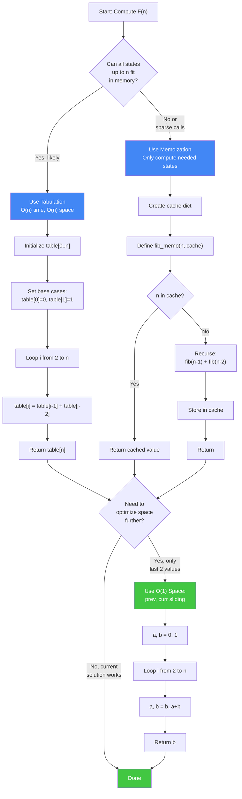

### State Definition & Transitions
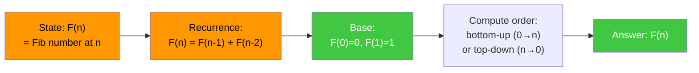

```
n = 7   (F(7) = 13)

--- Memoization (top-down) ---
Call tree (first call, cache cold):
  fib(7)
  = fib(6) + fib(5)
  = (fib(5) + fib(4)) + fib(5)   ← fib(5) computed once, then cached
  = ((fib(4) + fib(3)) + fib(4)) + fib(5)
  ...
  Cache after: {2:1, 3:2, 4:3, 5:5, 6:8, 7:13}

--- Tabulation (bottom-up) ---
index:  0  1  2  3  4  5  6  7
table: [0, 1, 1, 2, 3, 5, 8, 13]
       base  ↑  ↑  ↑  ↑  ↑  ↑
             each = prev + prev-prev

--- Space-optimized (O(1)) ---
a, b = 0, 1
step 1: a,b = 1, 0+1=1    (F1, F2)
step 2: a,b = 1, 1+1=2    (F2, F3)
step 3: a,b = 2, 1+2=3    (F3, F4)
step 4: a,b = 3, 2+3=5    (F4, F5)
step 5: a,b = 5, 3+5=8    (F5, F6)
step 6: a,b = 8, 5+8=13   (F6, F7)
step 7: a,b = 13, 8+13=21 (but n=7 loops end here; a=13 = F(7)) ✓
```

**Key insight:** Memoization avoids recomputing overlapping sub-problems by caching results — without it the call tree is exponential (O(2^n)). Tabulation fills from the base cases upward, guaranteeing no redundant computation. The space-optimized version recognizes that only the two most recent values are ever needed.

**When to use:** Fibonacci is the entry-level DP example. In interviews it is used to demonstrate understanding of the three DP implementation styles and the space vs. readability trade-off. The space-optimized O(1) version is always preferred in production.

---

## 0/1 Knapsack

Given n items each with a weight and value, and a knapsack of capacity W, determine the maximum total value achievable without exceeding W, where each item can be taken at most once. State: `dp[i][w]` = maximum value using the first i items with capacity w.

### Algorithm Flowchart
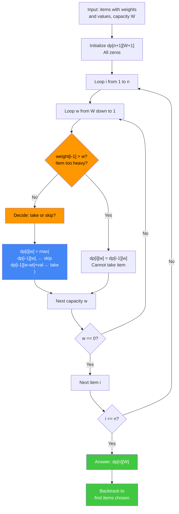

### Knapsack Type Decision Tree
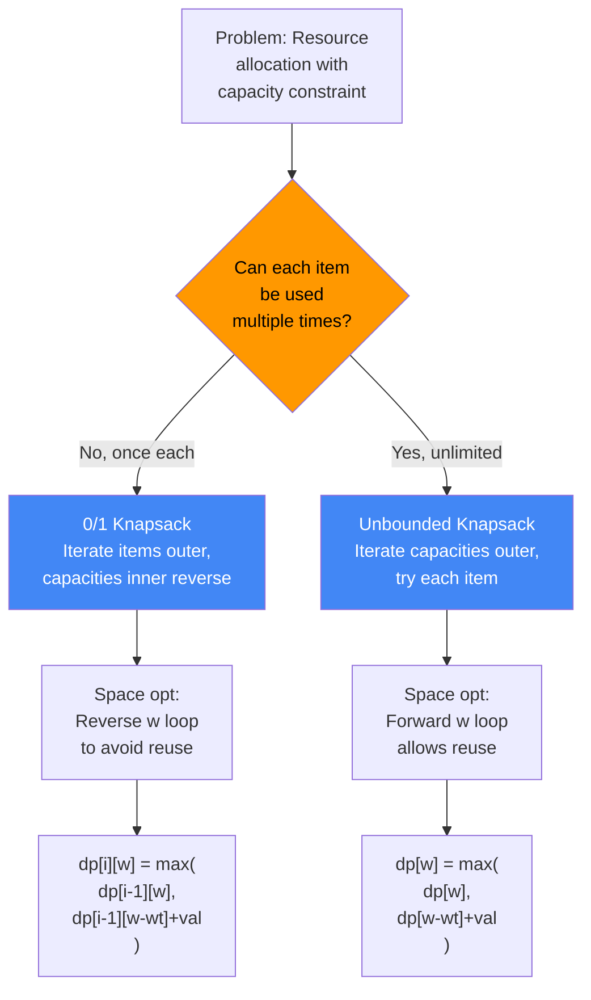

```
weights = [2, 3, 4, 5]
values  = [3, 4, 5, 6]
capacity W = 8

Recurrence:
  dp[i][w] = dp[i-1][w]                          if w < weights[i]
  dp[i][w] = max(dp[i-1][w],
                 dp[i-1][w - weights[i]] + values[i])   otherwise

dp table (rows = items 0..4, cols = capacity 0..8):

       w=0  w=1  w=2  w=3  w=4  w=5  w=6  w=7  w=8
i=0  [  0    0    0    0    0    0    0    0    0  ]  (no items)
i=1  [  0    0    3    3    3    3    3    3    3  ]  (item0: w=2,v=3)
i=2  [  0    0    3    4    4    7    7    7    7  ]  (item1: w=3,v=4)
i=3  [  0    0    3    4    5    7    8    9    9  ]  (item2: w=4,v=5)
i=4  [  0    0    3    4    5    7    8    9   10  ]  (item3: w=5,v=6)
                                                  ↑
                                          answer = 10

Backtrack from dp[4][8]:
  dp[4][8]=10 ≠ dp[3][8]=9 → item3 taken, w = 8-5 = 3
  dp[3][3]=4  = dp[2][3]=4 → item2 not taken
  dp[2][3]=4 ≠ dp[1][3]=3 → item1 taken, w = 3-3 = 0
  dp[1][0]=0  = dp[0][0]=0 → item0 not taken
  Chosen items: [1, 3] (0-indexed) → values 4+6=10 ✓
```

**Key insight:** The 2-D table encodes all sub-problems: "what is the best we can do with items 0..i-1 and capacity exactly w?" The key decision at each cell is binary: take item i or leave it. Backtracking recovers the actual items by retracing which decision was made.

**When to use:** Resource allocation with binary take/leave decisions and a capacity constraint. Classic patterns: task scheduling with deadlines, subset sum, partition equal subset sum (LC 416), target sum (LC 494).

---

## Longest Common Subsequence

Find the longest sequence of characters that appears (in order, but not necessarily contiguously) in both strings s1 and s2. State: `dp[i][j]` = LCS length of `s1[:i]` and `s2[:j]`.

### LCS Algorithm Flowchart
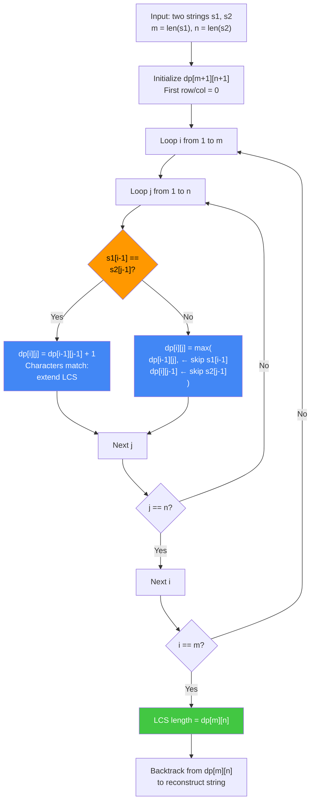

### String Comparison Pattern Recognition
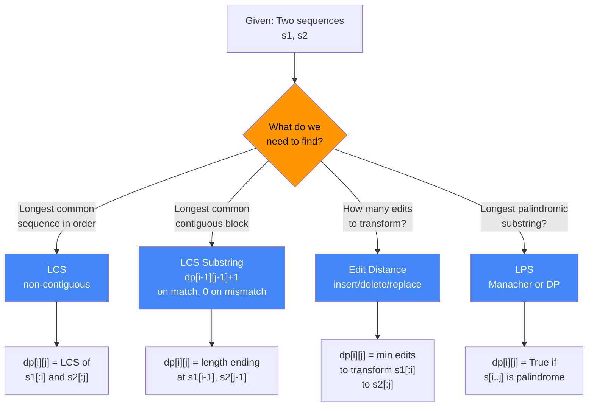

```
s1 = "ABCB"   s2 = "BDCAB"

Recurrence:
  if s1[i-1] == s2[j-1]:  dp[i][j] = dp[i-1][j-1] + 1
  else:                    dp[i][j] = max(dp[i-1][j], dp[i][j-1])

dp table (rows = s1 chars, cols = s2 chars):

       ""  B  D  C  A  B
  ""  [ 0  0  0  0  0  0 ]
   A  [ 0  0  0  0  1  1 ]
   B  [ 0  1  1  1  1  2 ]
   C  [ 0  1  1  2  2  2 ]
   B  [ 0  1  1  2  2  3 ]
                        ↑
                    LCS length = 3

Backtrack (start at dp[4][5]=3):
  s1[3]='B' == s2[4]='B' → take 'B', move to dp[3][4]
  s1[2]='C' == s2[2]='C' → take 'C', move to dp[2][2]
  s1[1]='B' ≠ s2[1]='D'  → dp[1][2]=0 < dp[2][1]=1 → move up
  s1[0]='A' == s2[3]='A' → take 'A', move to dp[0][2]
  dp[0][2] = 0 → done

LCS = "ACB" (reversed during backtrack: A, C, B)
```

**Key insight:** The diagonal move (`dp[i-1][j-1] + 1`) represents a match — both pointers advance together. The horizontal/vertical moves (`dp[i-1][j]` or `dp[i][j-1]`) skip one character in one of the strings. The table encodes all 2^(m+n) subsequence possibilities implicitly.

**When to use:** Diff tools, DNA sequence alignment, plagiarism detection, file synchronization. Related problems: LCS length, edit distance, shortest common supersequence.

---

## Longest Increasing Subsequence (O(n log n))

Find the length of the longest strictly increasing subsequence of an array. The patience sorting approach maintains a `tails` array where `tails[i]` holds the smallest possible tail value of all increasing subsequences of length `i+1` found so far. Binary search (bisect_left) positions each element.

### LIS Algorithm Flowchart (Optimized O(n log n))
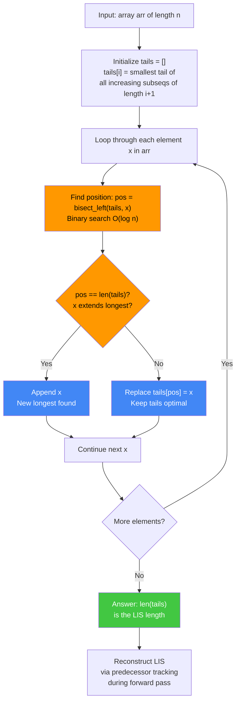

### Optimization Decision: O(n²) vs O(n log n)
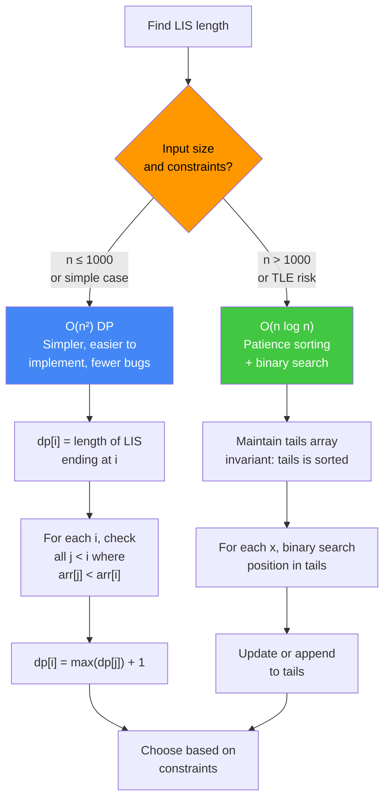

```
arr = [10, 9, 2, 5, 3, 7, 101, 18]

Process each element, maintaining tails:

x=10: tails=[]    → append → tails=[10]
x=9:  bisect_left([10],9)=0 → replace → tails=[9]
x=2:  bisect_left([9],2)=0  → replace → tails=[2]
x=5:  bisect_left([2],5)=1  → append  → tails=[2,5]
x=3:  bisect_left([2,5],3)=1 → replace → tails=[2,3]
x=7:  bisect_left([2,3],7)=2 → append  → tails=[2,3,7]
x=101:bisect_left([2,3,7],101)=3 → append → tails=[2,3,7,101]
x=18: bisect_left([2,3,7,101],18)=3 → replace → tails=[2,3,7,18]

LIS length = len(tails) = 4

Reconstruct: track predecessor indices
  x=7  at i=5, pred linked to x=3 at i=4
  x=3  at i=4, pred linked to x=2 at i=2
  x=2  at i=2, pred = -1
  LIS: [2, 3, 7, 18]  (one valid LIS; others exist)
```

**Key insight:** `tails` is always sorted. `bisect_left(tails, x)` in O(log n) finds where x belongs. If x extends the longest subsequence so far, append; otherwise, replace the first tail that is >= x to keep tails optimal. The length of `tails` is the LIS length, though `tails` itself is NOT the LIS.

**When to use:** LIS length: LC 300. Variants: number of LIS sequences, LIS with constraints, 2D variant (Russian doll envelopes, LC 354). The O(n log n) solution is expected at senior-level interviews; O(n²) DP is acceptable at junior level.

---

## Edit Distance (Levenshtein)

Find the minimum number of single-character operations (insert, delete, substitute) needed to transform string s1 into string s2. State: `dp[i][j]` = minimum edits to transform `s1[:i]` into `s2[:j]`.

### Edit Distance Algorithm Flowchart
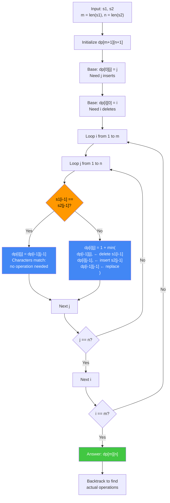

### Operation Decision Tree: 3-Way Choice
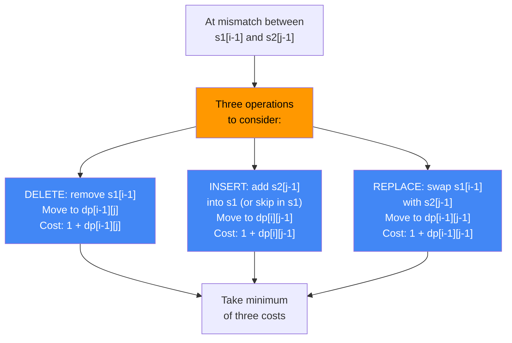

```
s1 = "kitten"   s2 = "sitting"

Recurrence:
  if s1[i-1] == s2[j-1]: dp[i][j] = dp[i-1][j-1]     (no op)
  else:                   dp[i][j] = 1 + min(
                              dp[i-1][j],    # delete s1[i]
                              dp[i][j-1],    # insert s2[j]
                              dp[i-1][j-1]   # substitute
                          )

dp table (cols = "sitting", rows = "kitten"):

       ""  s  i  t  t  i  n  g
  ""  [ 0  1  2  3  4  5  6  7 ]
   k  [ 1  1  2  3  4  5  6  7 ]
   i  [ 2  2  1  2  3  4  5  6 ]
   t  [ 3  3  2  1  2  3  4  5 ]
   t  [ 4  4  3  2  1  2  3  4 ]
   e  [ 5  5  4  3  2  2  3  4 ]
   n  [ 6  6  5  4  3  3  2  3 ]
                              ↑
                   Edit distance = 3

Operations (backtracked):
  substitute 'k' → 's'
  keep 'i'
  keep 't'
  keep 't'
  substitute 'e' → 'i'
  keep 'n'
  insert 'g'
```

**Key insight:** The three neighbors of each cell correspond to the three operations: the cell above is "delete from s1", the cell to the left is "insert into s1", the diagonal is "substitute (or keep if equal)". The answer at `dp[m][n]` represents the full transformation cost.

**When to use:** Spell checkers, DNA alignment, fuzzy string matching, autocorrect. LC 72. Variants: weighted edit distance, edit distance with only inserts/deletes (= LCS-based), approximate string matching.

---

## Coin Change

Find the minimum number of coins from a given set of denominations that sum to a target amount. State: `dp[a]` = minimum coins to make exactly amount a. This is an unbounded knapsack (coins can be reused).

### Coin Change Algorithm Flowchart
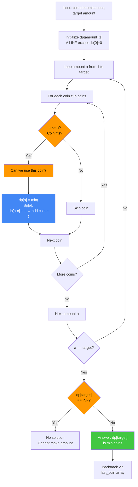

### Unbounded vs 0/1 Knapsack Loop Order
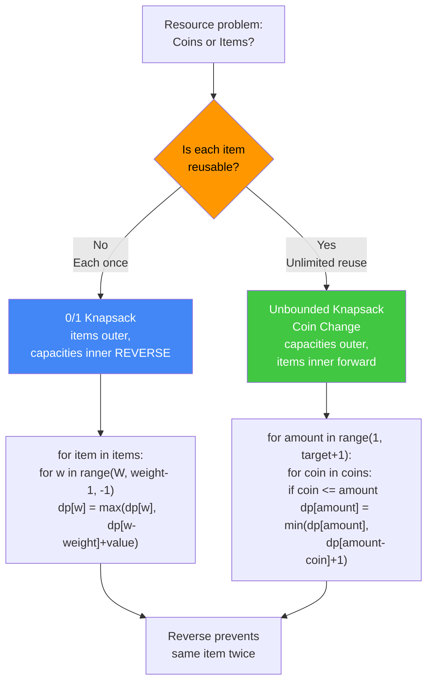

```
coins = [1, 5, 6, 9]   amount = 11

Recurrence:
  dp[0] = 0
  dp[a] = min(dp[a - c] + 1) for each coin c ≤ a

Build dp[0..11]:
  dp[0]  = 0
  dp[1]  = dp[0]+1 (c=1) = 1
  dp[2]  = dp[1]+1 = 2
  dp[3]  = 3
  dp[4]  = 4
  dp[5]  = dp[0]+1 (c=5) = 1         ← coin=5
  dp[6]  = dp[0]+1 (c=6) = 1         ← coin=6
  dp[7]  = min(dp[6]+1, dp[2]+1) = 2 (6+1 or 1+1+5)
  dp[8]  = min(dp[7]+1, dp[3]+1) = 3
  dp[9]  = dp[0]+1 (c=9) = 1         ← coin=9
  dp[10] = min(dp[9]+1, dp[5]+1, dp[4]+1) = 2  (9+1 or 5+5)
  dp[11] = min(dp[10]+1, dp[6]+1, dp[5]+1) = 2 (9+coin6? no=11; 6+5=11→2; 5+6=11→2)
         = dp[5]+1 (c=6) or dp[6]+1 (c=5) = 2  ← 5+6 or 6+5

Answer: 2 coins → [5, 6]

Backtrack via last_coin array:
  last_coin[11] = 6 → add 6, amount = 11-6 = 5
  last_coin[5]  = 5 → add 5, amount = 5-5  = 0
  Combination: [5, 6]
```

**Key insight:** Unlike 0/1 Knapsack, each coin denomination can be reused, so we iterate over amounts (not items) and try every coin at each amount. The answer `dp[amount] = INF` indicates the amount cannot be made.

**When to use:** LC 322 (minimum coins), LC 518 (number of ways). Variant: Coin Change 2 counts the number of distinct combinations rather than minimizing the count — the recurrence changes from `min(dp[a-c]+1)` to `dp[a] += dp[a-c]`.

---

## Matrix Chain Multiplication

Given a chain of n matrices where matrix i has dimensions `dims[i] × dims[i+1]`, find the parenthesization that minimizes the total number of scalar multiplications. State: `dp[i][j]` = minimum multiplications to compute the product of matrices i through j.

### Matrix Chain Algorithm Flowchart
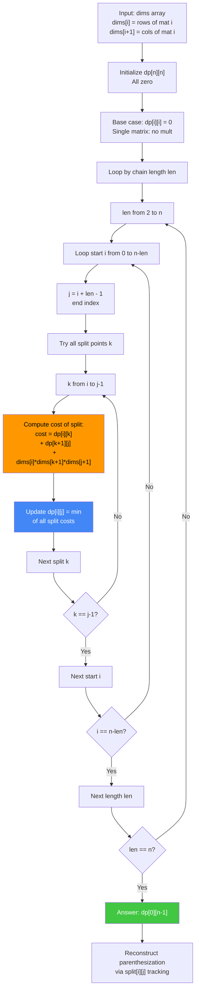

### Interval DP Pattern Recognition
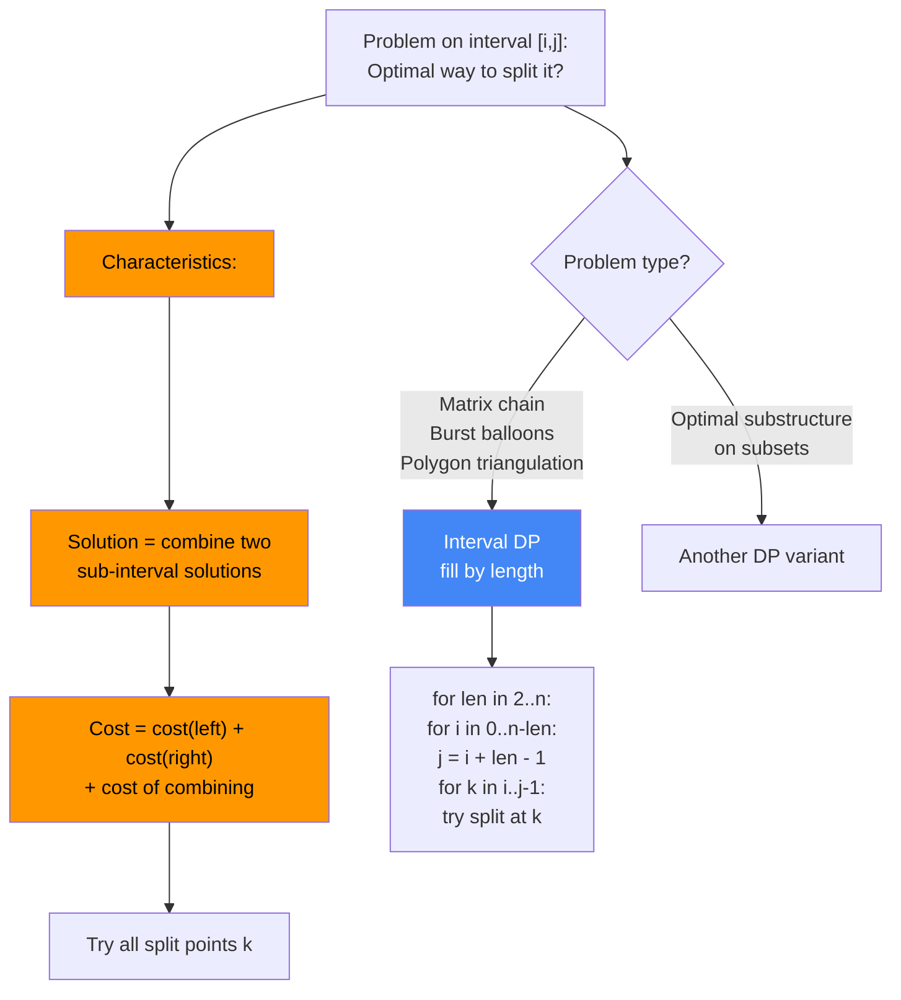

```
dims = [40, 20, 30, 10, 30]
Matrices: A0(40×20), A1(20×30), A2(30×10), A3(10×30)

Recurrence (chain length l = j - i + 1):
  dp[i][i] = 0   (single matrix: no multiplications)
  dp[i][j] = min over k in [i, j-1] of:
               dp[i][k] + dp[k+1][j] + dims[i]*dims[k+1]*dims[j+1]

Fill diagonals (by chain length):

Length 2 (adjacent pairs):
  dp[0][1] = dp[0][0]+dp[1][1]+40*20*30 = 0+0+24000 = 24000  split at k=0
  dp[1][2] = 0+0+20*30*10               = 6000               k=1
  dp[2][3] = 0+0+30*10*30               = 9000               k=2

Length 3:
  dp[0][2] = min(
    k=0: dp[0][0]+dp[1][2]+40*20*10 = 0+6000+8000 = 14000
    k=1: dp[0][1]+dp[2][2]+40*30*10 = 24000+0+12000 = 36000
  ) = 14000  split at k=0
  dp[1][3] = min(
    k=1: 0+9000+20*30*30 = 27000
    k=2: 6000+0+20*10*30 = 12000
  ) = 12000  split at k=2

Length 4 (full chain):
  dp[0][3] = min(
    k=0: dp[0][0]+dp[1][3]+40*20*30 = 0+12000+24000 = 36000
    k=1: dp[0][1]+dp[2][3]+40*30*30 = 24000+9000+36000 = 69000
    k=2: dp[0][2]+dp[3][3]+40*10*30 = 14000+0+12000 = 26000  ← minimum
  )
  min = 26000  split at k=2

Parenthesization: ((A0 x A1) x (A2 x A3))
   → meaning: multiply A0×A1 first, then A2×A3, then combine
```

**Key insight:** Interval DP fills the table by increasing chain length. The split point k divides the chain into left sub-chain (i..k) and right sub-chain (k+1..j), each already optimally parenthesized. The cost of the final multiplication is `dims[i] * dims[k+1] * dims[j+1]`.

**When to use:** Matrix chain multiplication, polygon triangulation, burst balloons (LC 312), minimum cost of tree construction. Any problem where you split an interval into two halves and combine their results.

---

## Longest Palindromic Substring

Find the longest substring of s that reads the same forwards and backwards. Two approaches: O(n²) DP table and O(n) Manacher's algorithm.

### Algorithm Choice: DP vs Manacher
```mermaid
graph TD
    A["Find longest<br/>palindromic substring"] --> B{"What is your<br/>priority?"}
    B -->|Simpler code,<br/>2D table OK| C["O(n²) DP<br/>Time: O(n²)<br/>Space: O(n²)"]
    B -->|Must have O(n)<br/>Linear time| D["Manacher's Algorithm<br/>Time: O(n)<br/>Space: O(n)"]
    
    C --> C1["dp[i][j] = True if<br/>s[i..j] is palindrome"]
    C1 --> C2["Base: dp[i][i] = True"]
    C2 --> C3["Fill by substring length"]
    C3 --> C4["If s[i]==s[j] and<br/>dp[i+1][j-1], then<br/>dp[i][j] = True"]
    
    D --> D1["Transform s with '#':<br/>s = '#a#b#a#'"]
    D1 --> D2["Compute p[i] =<br/>palindrome radius at i"]
    D2 --> D3["Use mirror trick:<br/>p[i] >= min(R-i, p[mirror])"]
    D3 --> D4["Expand from initial guess"]
    
    C4 --> E["Return longest found"]
    D4 --> E
    
    style B fill:#ff9800,color:#000
    style C fill:#4287f5,color:#fff
    style D fill:#42c742,color:#fff
```

### DP Approach: Substring Length Iteration
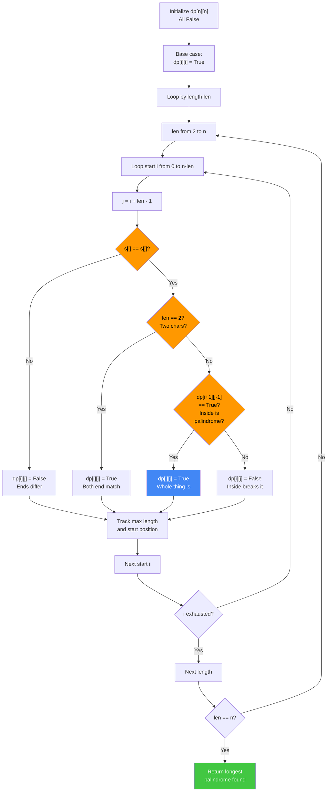

```
s = "babad"

--- DP approach ---
dp[i][j] = True if s[i..j] is a palindrome

Base cases (length 1): dp[i][i] = True for all i
  b  a  b  a  d
  T  T  T  T  T

Length 2 (i, i+1): s[i] == s[i+1]?
  dp[0][1]: 'b'=='a'? No
  dp[1][2]: 'a'=='b'? No
  dp[2][3]: 'b'=='a'? No
  dp[3][4]: 'a'=='d'? No

Length 3 (i, i+2): s[i]==s[i+2] and dp[i+1][i+1]?
  dp[0][2]: s[0]='b'==s[2]='b' and dp[1][1]=T → dp[0][2]=True  "bab" ✓
  dp[1][3]: s[1]='a'==s[3]='a' and dp[2][2]=T → dp[1][3]=True  "aba" ✓
  dp[2][4]: s[2]='b'==s[4]='d'? No

Length 4, 5: no palindromes longer than 3 found.

Result: "bab" (length 3, starts at index 0)

--- Manacher's algorithm ---
Transform: insert '#' separators to handle even-length palindromes uniformly
  "babad" → "#b#a#b#a#d#"
   idx:      0 1 2 3 4 5 6 7 8 9 10

Compute radius array p[] using mirror trick:
  i:  0  1  2  3  4  5  6  7  8  9  10
  t:  #  b  #  a  #  b  #  a  #  d  #
  p:  0  1  0  3  0  3  0  1  0  1  0
             ↑           ↑
             center=3    center=5 (length=2*3=6? no: p[5]=3 → palindrome length=3)

Max p[] = 3 at index 3 (center 'a') and index 5 (center 'b')
  p[3]=3: palindrome in t of radius 3, center at t[3]='a'
    In s: start = (3 - 3) // 2 = 0, length = 3 → "bab"
  p[5]=3: centre at t[5]='b'
    In s: start = (5 - 3) // 2 = 1, length = 3 → "aba"
Both length 3; return "bab" (first found).
```

**Key insight:** Manacher's algorithm reuses previously computed palindrome radii via a mirror argument: if `i` lies within the known rightmost palindrome (center=c, right=r), then `p[i] >= min(r - i, p[mirror])`. This avoids redundant character comparisons and achieves O(n). The `#` separators unify odd and even-length palindrome handling.

**When to use:** LC 5 (longest palindromic substring). Use DP when the full 2-D table is needed (e.g., for counting palindromes). Use Manacher's for pure length/string retrieval when O(n) is required.

---

## Backtracking Pattern Guide

> **See detailed guide:** [`backtracking_patterns.md`](backtracking_patterns.md)

### When to Choose Backtracking

Use backtracking when you need **all solutions** to a constraint satisfaction problem:
- **N-Queens**: Place n queens with no conflicts
- **Sudoku**: Fill grid with unique rows/cols/boxes
- **Word Search**: Find word path in grid
- **Permutations/Combinations**: All arrangements or selections
- **Subsets**: All subsequences (power set)

**Key insight:** Backtracking systematically explores all possibilities with early pruning of invalid branches.

### Backtracking Complexity Summary

| Algorithm | Time | Space | Type |
|-----------|------|-------|------|
| N-Queens | O(N!) | O(N²) | Constraint satisfaction |
| Sudoku | O(9^(n²)) | O(1) | Constraint satisfaction |
| Word Search | O(N·M·4^L) | O(L) | Grid path finding |
| Permutations | O(N!·N) | O(N!) | All arrangements |
| Combinations | O(C(n,k)·k) | O(k) | All selections |
| Subsets | O(N·2^N) | O(2^N) | Power set |
| Letter Combos | O(4^N·N) | O(4^N) | Mapping output |
| Parentheses | O(Catalan·N) | O(N) | Balanced strings |

---

## Grid & 2D DP Pattern Guide

> **See detailed guide:** [`grid_dp_patterns.md`](grid_dp_patterns.md)

### Grid Problem Categories

| Category | Algorithm | Pattern | Example |
|----------|-----------|---------|---------|
| Path Counting | unique_paths | DP[i][j] = DP[i-1][j] + DP[i][j-1] | m×n grid, right/down only |
| Constraint Optimization | bomb_enemy | Precompute per direction | Range queries per row/col |
| Connected Components | max_island_area | DFS/BFS all connected cells | Island maximum area |
| Reverse Constraint | dungeon_game | Process bottom-right to top-left | Minimum health requirement |
| Elevation/Boundaries | trapping_rain_water_2d | Priority queue + visited | Water level between boundaries |
| Path Finding | word_ladder | BFS on implicit graph | Shortest transformation path |
| Pattern Matching | word_pattern_match | Bijective backtracking | String-to-pattern assignment |

### Grid DP Complexity Summary

| Algorithm | Time | Space | Pattern |
|-----------|------|-------|---------|
| Unique Paths | O(m·n) | O(m·n) | Path counting |
| Bomb Enemy | O(m·n·(m+n)) | O(m·n) | Preprocessing |
| Max Island | O(m·n) | O(m·n) | Connected components |
| Dungeon Game | O(m·n) | O(m·n) | Reverse DP |
| Trapping Rain 2D | O(m·n·log(m·n)) | O(m·n) | Priority queue |
| Word Ladder | O(n·L²) | O(n·L) | Implicit graph BFS |
| Word Pattern | O(n·2^m) | O(m+n) | Bijective backtrack |

---

## Choosing the Right Algorithm

| Problem shape                                             | DP pattern               |
|-----------------------------------------------------------|--------------------------|
| Overlapping sub-problems with single integer state        | 1-D DP (Fibonacci, Coin Change) |
| Two sequences, alignment or matching                      | 2-D DP (LCS, Edit Distance) |
| Single sequence, optimal subset or length                 | 1-D DP + binary search (LIS) |
| Items with weights/values and a capacity bound            | 2-D Knapsack             |
| Splitting an interval into two sub-intervals              | Interval DP (Matrix Chain)|
| Substring / subarray with palindrome or window property   | 2-D DP or Manacher       |

**Recurrence identification checklist:**
1. Define what `dp[i]` or `dp[i][j]` represents precisely.
2. Identify how the optimal solution to the current state depends on smaller states.
3. Establish base cases (empty input, length 0 or 1).
4. Determine traversal order (left-to-right, diagonal, by length).

---

## Common Interview Questions

- **What is the difference between memoization and tabulation?** Memoization is top-down: start from the target, recurse, and cache results. Tabulation is bottom-up: fill a table from base cases to the target. Both achieve the same time complexity; tabulation avoids call-stack overhead, memoization avoids computing states you never reach.
- **How do you reduce the space complexity of 0/1 Knapsack from O(n·W) to O(W)?** Use a single 1-D `dp` array of size W+1 and iterate over capacities in reverse order (from W down to `weights[i]`). Reverse iteration ensures that each item is used at most once — if you iterate forward, you'd allow reuse (turning it into unbounded knapsack).
- **What is the difference between 0/1 Knapsack and Unbounded Knapsack?** In 0/1 each item is taken at most once; in Unbounded, items can be reused. The recurrence changes from `dp[i-1][w - weight[i]] + value[i]` (previous row, 0/1) to `dp[i][w - weight[i]] + value[i]` (current row, unbounded). Coin Change is unbounded knapsack.
- **How does LIS achieve O(n log n)?** The patience sorting approach maintains a sorted `tails` array. Binary search (`bisect_left`) in O(log n) finds the correct position for each element. The total work is O(n) elements × O(log n) per element = O(n log n).
- **Why is the LCS recurrence DP[i-1][j-1]+1 when characters match, rather than checking all sub-arrays?** Because any LCS of `s1[:i]` and `s2[:j]` that ends with the matching character `s1[i-1] == s2[j-1]` must have had its second-to-last character from an LCS of `s1[:i-1]` and `s2[:j-1]`. Optimal substructure holds: the LCS of a prefix pair decomposes into the LCS of shorter prefix pairs.
- **In edit distance, what do the three directions (diagonal, up, left) in the DP table represent?** Diagonal = no-op (characters match) or substitute (characters differ). Up = delete a character from s1. Left = insert a character from s2 into s1.
- **Explain Manacher's mirror trick.** If we know the palindrome centered at `c` extends to position `r`, and we're computing `p[i]` where `i < r`, the mirror of `i` through `c` is `mirror = 2c - i`. We already know `p[mirror]`. Since `i` is within the palindrome centered at `c`, at minimum `p[i] = min(r - i, p[mirror])`, then attempt to expand beyond that. This avoids re-scanning characters already known to match.
- **What is the space-optimized form of the LCS DP?** Since `dp[i][j]` only depends on `dp[i-1][j]`, `dp[i][j-1]`, and `dp[i-1][j-1]`, you can use two 1-D arrays (current row and previous row) to reduce space from O(m·n) to O(min(m, n)). String reconstruction requires the full table, so keep two rows only when you need the length and not the subsequence.
