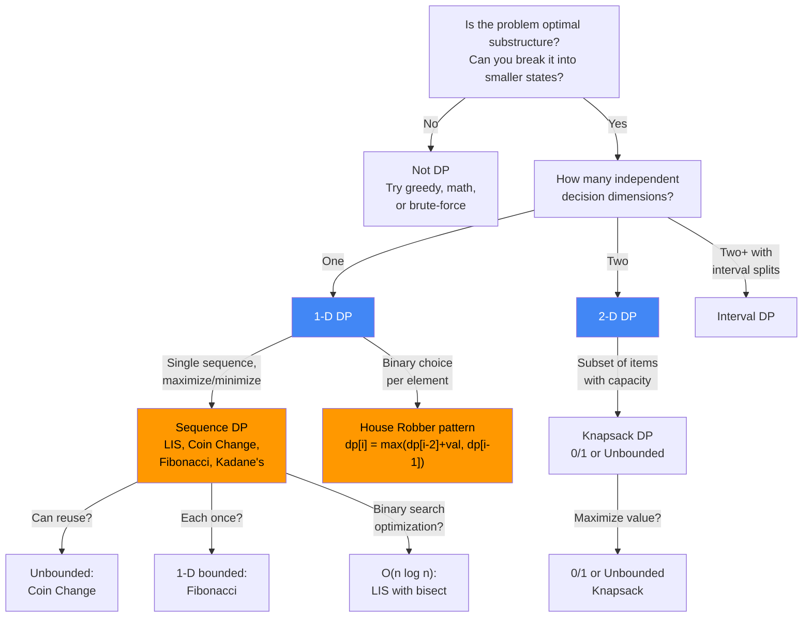
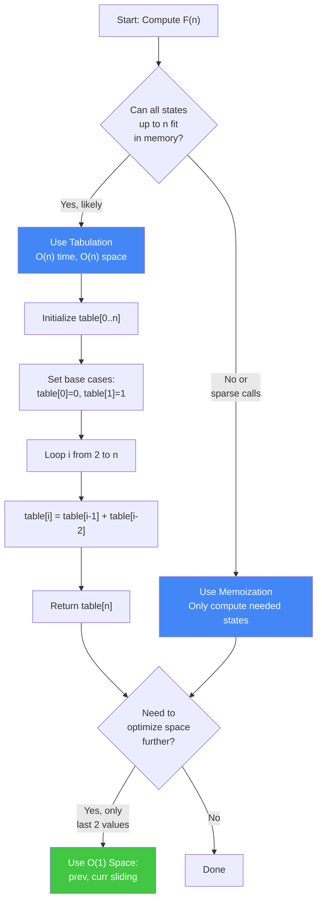
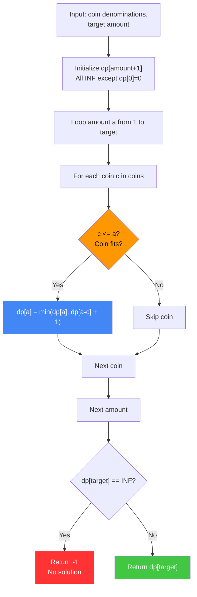
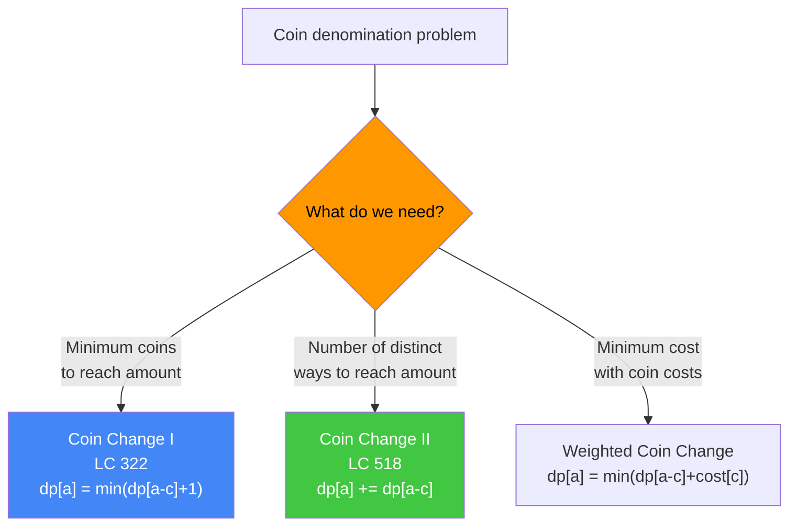
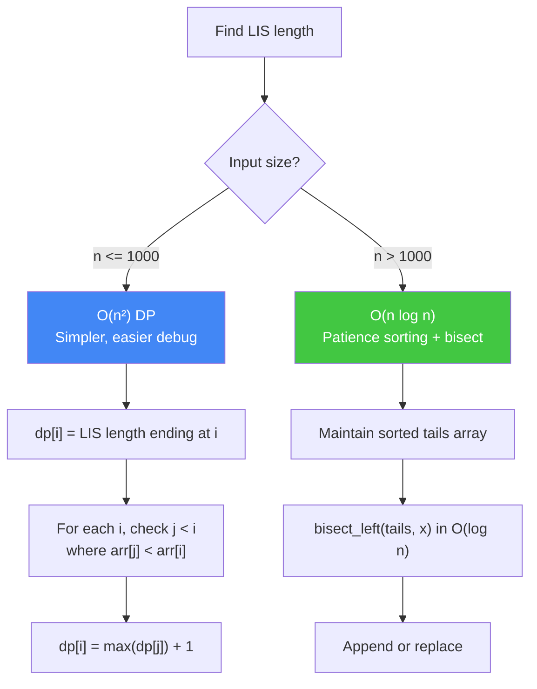
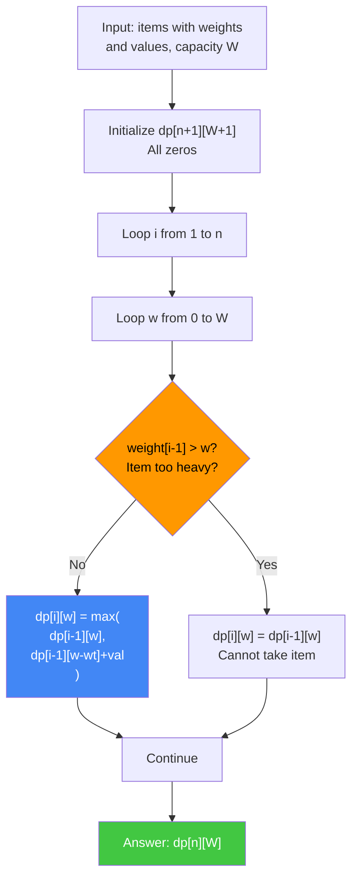
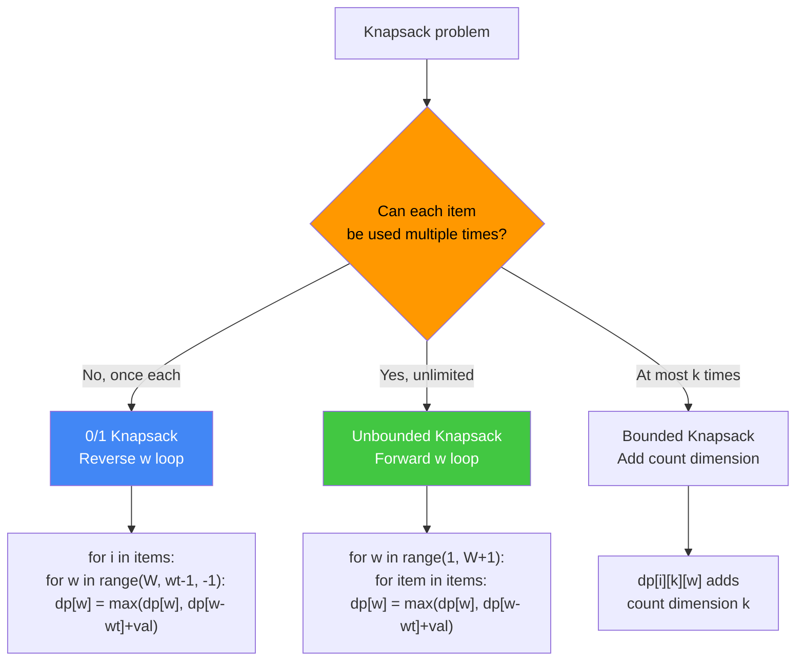
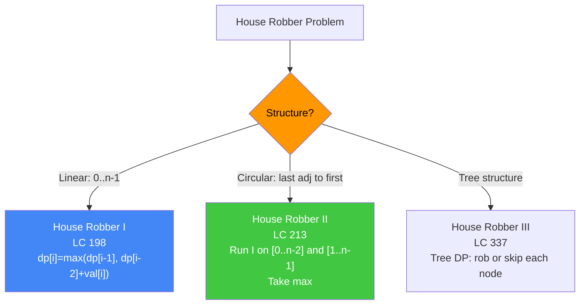
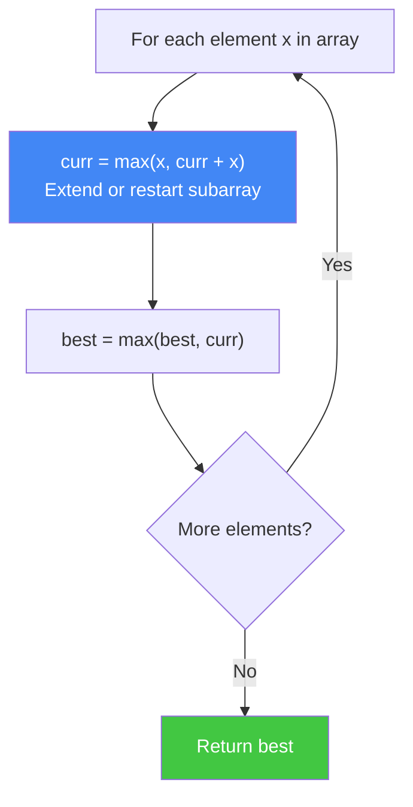

# DP Fundamentals: 1D DP, Sequences, and Knapsack

Core 1-D dynamic programming patterns covering Fibonacci variants, Coin Change, Longest Increasing Subsequence (both O(n²) and O(n log n)), 0/1 Knapsack and all its major variants, plus essential interview problems: House Robber, Maximum Subarray (Kadane's), and Jump Game.

---

## Master DP Decision Tree



---

## Algorithms Covered

| Algorithm                     | Time           | Space         | DP Dimension |
|-------------------------------|:--------------:|:-------------:|:------------:|
| Fibonacci                     | O(n)           | O(n) / O(1)   | 1-D          |
| Coin Change (min)             | O(amount × k)  | O(amount)     | 1-D          |
| Coin Change (ways)            | O(amount × k)  | O(amount)     | 1-D          |
| LIS O(n²)                     | O(n²)          | O(n)          | 1-D          |
| LIS O(n log n)                | O(n log n)     | O(n)          | 1-D + binary |
| 0/1 Knapsack                  | O(n × W)       | O(n × W)      | 2-D          |
| Unbounded Knapsack            | O(n × W)       | O(W)          | 1-D          |
| House Robber                  | O(n)           | O(1)          | 1-D          |
| Maximum Subarray (Kadane's)   | O(n)           | O(1)          | 1-D          |
| Jump Game I                   | O(n)           | O(1)          | 1-D greedy   |
| Jump Game II (min jumps)      | O(n)           | O(n)          | 1-D          |

---

## Fibonacci

Compute the nth Fibonacci number using three strategies: top-down memoization (recursive with cache), bottom-up tabulation (fill a table iteratively), and the space-optimized two-variable sliding window.

### Implementation Strategy Flowchart


```
n = 7   (F(7) = 13)

--- Tabulation (bottom-up) ---
index:  0  1  2  3  4  5  6  7
table: [0, 1, 1, 2, 3, 5, 8, 13]

--- Space-optimized (O(1)) ---
a, b = 0, 1
step 1: a,b = 1, 1    step 2: a,b = 1, 2
step 3: a,b = 2, 3    step 4: a,b = 3, 5
step 5: a,b = 5, 8    step 6: a,b = 8, 13   → F(7) = 13 ✓
```

### Python Implementation
```python
from functools import lru_cache

def fib_memo(n: int) -> int:
    """Top-down with memoization. O(n) time, O(n) space."""
    @lru_cache(None)
    def helper(k):
        if k <= 1:
            return k
        return helper(k - 1) + helper(k - 2)
    return helper(n)

def fib_tabulation(n: int) -> int:
    """Bottom-up tabulation. O(n) time, O(n) space."""
    if n <= 1:
        return n
    dp = [0] * (n + 1)
    dp[1] = 1
    for i in range(2, n + 1):
        dp[i] = dp[i - 1] + dp[i - 2]
    return dp[n]

def fib_optimized(n: int) -> int:
    """Space-optimized. O(n) time, O(1) space."""
    if n <= 1:
        return n
    a, b = 0, 1
    for _ in range(2, n + 1):
        a, b = b, a + b
    return b
```

### Java Implementation
```java
import java.util.HashMap;
import java.util.Map;

public class Fibonacci {
    // Top-down memoization
    private Map<Integer, Long> memo = new HashMap<>();

    public long fibMemo(int n) {
        if (n <= 1) return n;
        if (memo.containsKey(n)) return memo.get(n);
        long result = fibMemo(n - 1) + fibMemo(n - 2);
        memo.put(n, result);
        return result;
    }

    // Bottom-up tabulation
    public long fibTab(int n) {
        if (n <= 1) return n;
        long[] dp = new long[n + 1];
        dp[1] = 1;
        for (int i = 2; i <= n; i++) {
            dp[i] = dp[i - 1] + dp[i - 2];
        }
        return dp[n];
    }

    // Space-optimized O(1)
    public long fibOptimized(int n) {
        if (n <= 1) return n;
        long a = 0, b = 1;
        for (int i = 2; i <= n; i++) {
            long temp = a + b;
            a = b;
            b = temp;
        }
        return b;
    }
}
```

**Key insight:** Memoization avoids recomputing overlapping sub-problems — without it the call tree is exponential O(2^n). The space-optimized O(1) version recognizes only the two most recent values are ever needed.

---

## Coin Change

Find the minimum number of coins from a given set of denominations that sum to a target amount. State: `dp[a]` = minimum coins to make exactly amount a. This is an unbounded knapsack (coins can be reused).

### Coin Change Algorithm Flowchart


### Coin Change Variants Decision Tree


```
coins = [1, 5, 6, 9]   amount = 11

dp[0..11]:
  dp[0]  = 0
  dp[5]  = 1  (coin=5)      dp[6]  = 1  (coin=6)
  dp[9]  = 1  (coin=9)      dp[11] = 2  (5+6 or 6+5)

Answer: 2 coins → [5, 6]
```

### Python + Java Implementations
```python
def coin_change(coins: list, amount: int) -> int:
    """Minimum number of coins. O(amount * len(coins)) time, O(amount) space."""
    dp = [float('inf')] * (amount + 1)
    dp[0] = 0
    for a in range(1, amount + 1):
        for c in coins:
            if c <= a and dp[a - c] + 1 < dp[a]:
                dp[a] = dp[a - c] + 1
    return dp[amount] if dp[amount] != float('inf') else -1

def coin_change_ways(coins: list, amount: int) -> int:
    """Number of distinct combinations. Coin Change II."""
    dp = [0] * (amount + 1)
    dp[0] = 1
    for c in coins:           # items outer to avoid permutations
        for a in range(c, amount + 1):
            dp[a] += dp[a - c]
    return dp[amount]
```

```java
public class CoinChange {
    public int coinChange(int[] coins, int amount) {
        int[] dp = new int[amount + 1];
        Arrays.fill(dp, amount + 1);  // sentinel > any valid answer
        dp[0] = 0;
        for (int a = 1; a <= amount; a++) {
            for (int c : coins) {
                if (c <= a) {
                    dp[a] = Math.min(dp[a], dp[a - c] + 1);
                }
            }
        }
        return dp[amount] > amount ? -1 : dp[amount];
    }

    public int change(int amount, int[] coins) {
        // LC 518: number of combinations (coins outer to avoid duplicates)
        int[] dp = new int[amount + 1];
        dp[0] = 1;
        for (int c : coins) {
            for (int a = c; a <= amount; a++) {
                dp[a] += dp[a - c];
            }
        }
        return dp[amount];
    }
}
```

**Key insight:** For Coin Change I (min coins), iterate amounts outer; for Coin Change II (ways/combinations), iterate coins outer to prevent counting permutations as distinct combinations.

---

## Longest Increasing Subsequence (LIS)

Find the length of the longest strictly increasing subsequence of an array.

### LIS Algorithm Decision Flowchart


```
arr = [10, 9, 2, 5, 3, 7, 101, 18]

O(n²) DP:
  i=0: dp[0]=1 (base)
  i=1: arr[1]=9 > arr[j]? j=0: 9>10? No  → dp[1]=1
  i=2: arr[2]=2, no j < i with arr[j]<2   → dp[2]=1
  i=3: arr[3]=5 > arr[2]=2 → dp[3]=dp[2]+1=2
  i=4: arr[4]=3 > arr[2]=2 → dp[4]=2
  i=5: arr[5]=7 > arr[2]=2,arr[3]=5,arr[4]=3 → dp[5]=3
  i=6: arr[6]=101, all qualify → dp[6]=4
  i=7: arr[7]=18 > arr[2],arr[3],arr[4],arr[5] → dp[7]=4
  Max = 4

O(n log n) patience sort:
  x=10 → tails=[10]
  x=9  → replace tails[0]=9  → [9]
  x=2  → replace tails[0]=2  → [2]
  x=5  → append             → [2,5]
  x=3  → replace tails[1]=3 → [2,3]
  x=7  → append             → [2,3,7]
  x=101→ append             → [2,3,7,101]
  x=18 → replace tails[3]=18→ [2,3,7,18]
  LIS length = len(tails) = 4
```

### Python + Java Implementations
```python
from bisect import bisect_left

def lis_n2(nums: list) -> int:
    """O(n²) DP approach."""
    if not nums:
        return 0
    n = len(nums)
    dp = [1] * n
    for i in range(1, n):
        for j in range(i):
            if nums[j] < nums[i]:
                dp[i] = max(dp[i], dp[j] + 1)
    return max(dp)

def lis_nlogn(nums: list) -> int:
    """O(n log n) patience sort approach."""
    tails = []
    for x in nums:
        pos = bisect_left(tails, x)
        if pos == len(tails):
            tails.append(x)
        else:
            tails[pos] = x
    return len(tails)
```

```java
import java.util.ArrayList;
import java.util.Collections;
import java.util.List;

public class LIS {
    public int lisN2(int[] nums) {
        int n = nums.length;
        int[] dp = new int[n];
        Arrays.fill(dp, 1);
        int ans = 1;
        for (int i = 1; i < n; i++) {
            for (int j = 0; j < i; j++) {
                if (nums[j] < nums[i]) {
                    dp[i] = Math.max(dp[i], dp[j] + 1);
                }
            }
            ans = Math.max(ans, dp[i]);
        }
        return ans;
    }

    public int lisNLogN(int[] nums) {
        List<Integer> tails = new ArrayList<>();
        for (int x : nums) {
            int pos = Collections.binarySearch(tails, x);
            if (pos < 0) pos = -(pos + 1);  // insertion point
            if (pos == tails.size()) {
                tails.add(x);
            } else {
                tails.set(pos, x);
            }
        }
        return tails.size();
    }
}
```

**Key insight:** `tails` is always sorted. `bisect_left(tails, x)` in O(log n) finds where x belongs. Append if x extends the longest; otherwise replace to keep `tails` optimal. `tails` itself is NOT the LIS — it's a structural tool.

**When to use:** LC 300 (LIS length), LC 354 (Russian doll envelopes — 2D LIS variant). O(n log n) is expected at senior-level; O(n²) acceptable at junior level.

---

## 0/1 Knapsack

Given n items each with a weight and value, and a knapsack of capacity W, determine the maximum total value achievable without exceeding W. Each item can be taken at most once.

### Algorithm Flowchart


### Knapsack Variants Decision Tree


```
weights = [2, 3, 4, 5], values = [3, 4, 5, 6], W = 8

dp table (rows=items 0..4, cols=capacity 0..8):
       w=0  w=1  w=2  w=3  w=4  w=5  w=6  w=7  w=8
i=0  [  0    0    0    0    0    0    0    0    0  ]
i=1  [  0    0    3    3    3    3    3    3    3  ]
i=2  [  0    0    3    4    4    7    7    7    7  ]
i=3  [  0    0    3    4    5    7    8    9    9  ]
i=4  [  0    0    3    4    5    7    8    9   10  ] ← answer=10
```

### Python + Java Implementations
```python
def knapsack_01(weights: list, values: list, W: int) -> int:
    """0/1 Knapsack - O(n*W) time, O(W) space with 1D optimization."""
    n = len(weights)
    dp = [0] * (W + 1)
    for i in range(n):
        for w in range(W, weights[i] - 1, -1):  # reverse prevents reuse
            dp[w] = max(dp[w], dp[w - weights[i]] + values[i])
    return dp[W]

def knapsack_unbounded(weights: list, values: list, W: int) -> int:
    """Unbounded Knapsack - each item can be used any number of times."""
    dp = [0] * (W + 1)
    for w in range(1, W + 1):
        for i in range(len(weights)):
            if weights[i] <= w:
                dp[w] = max(dp[w], dp[w - weights[i]] + values[i])
    return dp[W]

def fractional_knapsack(weights: list, values: list, W: int) -> float:
    """Fractional Knapsack - GREEDY (not DP), items can be split."""
    items = sorted(zip(values, weights), key=lambda x: x[0]/x[1], reverse=True)
    total = 0.0
    for val, wt in items:
        if W >= wt:
            total += val
            W -= wt
        else:
            total += val * (W / wt)
            break
    return total
```

```java
public class Knapsack {
    // 0/1 Knapsack - O(n*W) time, O(W) space
    public int knapsack01(int[] weights, int[] values, int W) {
        int n = weights.length;
        int[] dp = new int[W + 1];
        for (int i = 0; i < n; i++) {
            for (int w = W; w >= weights[i]; w--) {  // reverse prevents reuse
                dp[w] = Math.max(dp[w], dp[w - weights[i]] + values[i]);
            }
        }
        return dp[W];
    }

    // Unbounded Knapsack
    public int knapsackUnbounded(int[] weights, int[] values, int W) {
        int[] dp = new int[W + 1];
        for (int w = 1; w <= W; w++) {
            for (int i = 0; i < weights.length; i++) {
                if (weights[i] <= w) {
                    dp[w] = Math.max(dp[w], dp[w - weights[i]] + values[i]);
                }
            }
        }
        return dp[W];
    }

    // 0/1 Knapsack full 2D table (to enable backtracking)
    public int knapsack01WithBacktrack(int[] weights, int[] values, int W) {
        int n = weights.length;
        int[][] dp = new int[n + 1][W + 1];
        for (int i = 1; i <= n; i++) {
            for (int w = 0; w <= W; w++) {
                dp[i][w] = dp[i - 1][w];
                if (weights[i - 1] <= w) {
                    dp[i][w] = Math.max(dp[i][w],
                        dp[i - 1][w - weights[i - 1]] + values[i - 1]);
                }
            }
        }
        return dp[n][W];
    }
}
```

**Key insight:** The reverse iteration in 0/1 knapsack is the critical difference from unbounded — iterating `w` from W down to `weight[i]` ensures we only read from the previous item's row, preventing reuse. Forward iteration allows reuse (unbounded).

**When to use:** Subset sum, partition equal subset (LC 416), target sum (LC 494), task scheduling with deadlines.

---

## House Robber (1D DP)

Rob houses in a line; cannot rob two adjacent houses. State: `dp[i]` = max money robbing from houses 0..i.

### House Robber Variants


```
nums = [2, 7, 9, 3, 1]

dp[0] = 2  (rob house 0)
dp[1] = 7  (max(2,7) = rob house 1 alone)
dp[2] = 11 (max(7, 2+9) = rob 0+2)
dp[3] = 11 (max(11, 7+3) = either)
dp[4] = 12 (max(11, 11+1) = 11+1 wins)
Answer = 12
```

### Python + Java
```python
def rob(nums: list) -> int:
    """House Robber I. O(n) time, O(1) space."""
    prev2, prev1 = 0, 0
    for n in nums:
        prev2, prev1 = prev1, max(prev1, prev2 + n)
    return prev1

def rob_circular(nums: list) -> int:
    """House Robber II (circular). Run rob on two sub-ranges."""
    if len(nums) == 1:
        return nums[0]
    return max(rob(nums[:-1]), rob(nums[1:]))
```

```java
public class HouseRobber {
    public int rob(int[] nums) {
        int prev2 = 0, prev1 = 0;
        for (int n : nums) {
            int curr = Math.max(prev1, prev2 + n);
            prev2 = prev1;
            prev1 = curr;
        }
        return prev1;
    }

    public int robCircular(int[] nums) {
        if (nums.length == 1) return nums[0];
        return Math.max(
            rob(Arrays.copyOfRange(nums, 0, nums.length - 1)),
            rob(Arrays.copyOfRange(nums, 1, nums.length))
        );
    }
}
```

---

## Maximum Subarray (Kadane's Algorithm)

Find the contiguous subarray with the largest sum. State: `curr` = max sum subarray ending at current index.

### Kadane's Flowchart


```
nums = [-2, 1, -3, 4, -1, 2, 1, -5, 4]

curr: -2  1  -2  4   3  5  6   1  5
best: -2  1   1  4   4  5  6   6  6

Answer = 6  (subarray [4,-1,2,1])
```

```python
def max_subarray(nums: list) -> int:
    """Kadane's Algorithm. O(n) time, O(1) space."""
    curr = best = nums[0]
    for x in nums[1:]:
        curr = max(x, curr + x)
        best = max(best, curr)
    return best
```

```java
public int maxSubArray(int[] nums) {
    int curr = nums[0], best = nums[0];
    for (int i = 1; i < nums.length; i++) {
        curr = Math.max(nums[i], curr + nums[i]);
        best = Math.max(best, curr);
    }
    return best;
}
```

**Key insight:** At each position, decide: extend the current subarray OR start a new one from here. The decision is `max(x, curr + x)`. If `curr` is negative, starting fresh is always better.

---

## Jump Game Variants

### Jump Game I (Can reach end?)
```python
def can_jump(nums: list) -> bool:
    """Greedy: track furthest reachable index. O(n) time, O(1) space."""
    max_reach = 0
    for i, jump in enumerate(nums):
        if i > max_reach:
            return False
        max_reach = max(max_reach, i + jump)
    return True
```

### Jump Game II (Minimum jumps to reach end)
```python
def jump(nums: list) -> int:
    """BFS-like greedy. O(n) time, O(1) space."""
    jumps = curr_end = curr_farthest = 0
    for i in range(len(nums) - 1):
        curr_farthest = max(curr_farthest, i + nums[i])
        if i == curr_end:
            jumps += 1
            curr_end = curr_farthest
    return jumps
```

```java
public class JumpGame {
    public boolean canJump(int[] nums) {
        int maxReach = 0;
        for (int i = 0; i < nums.length; i++) {
            if (i > maxReach) return false;
            maxReach = Math.max(maxReach, i + nums[i]);
        }
        return true;
    }

    public int jump(int[] nums) {
        int jumps = 0, currEnd = 0, farthest = 0;
        for (int i = 0; i < nums.length - 1; i++) {
            farthest = Math.max(farthest, i + nums[i]);
            if (i == currEnd) {
                jumps++;
                currEnd = farthest;
            }
        }
        return jumps;
    }
}
```

---

## Common Interview Questions

**Q: What is the difference between memoization and tabulation?**
A: Memoization is top-down: start from the target, recurse, and cache results. Tabulation is bottom-up: fill a table from base cases to the target. Both achieve the same time complexity; tabulation avoids call-stack overhead and is cache-friendly, memoization avoids computing states you never reach.

**Q: How do you reduce 0/1 Knapsack space from O(n·W) to O(W)?**
A: Use a 1-D `dp` array of size W+1 and iterate capacities in reverse (W down to `weights[i]`). Reverse iteration ensures each item is used at most once. Forward iteration turns it into unbounded knapsack (allows reuse).

**Q: What is the difference between 0/1, Unbounded, and Fractional Knapsack?**
A: 0/1 — each item at most once, DP with reverse loop. Unbounded — items can be reused, DP with forward loop. Fractional — items can be split, solved greedily by value/weight ratio (not DP). Fractional always achieves equal or better value than 0/1.

**Q: How does LIS achieve O(n log n)?**
A: The patience sorting approach maintains a sorted `tails` array. `bisect_left(tails, x)` in O(log n) finds the correct position. Total work: O(n) elements × O(log n) per element = O(n log n). Crucially, `tails` is a structural invariant — it shows what's achievable, not the actual LIS.

**Q: Explain Kadane's algorithm — why does `max(x, curr + x)` work?**
A: It encodes the optimal substructure: the maximum subarray ending at position i either (a) starts fresh at i, contributing just `nums[i]`, or (b) extends the best subarray ending at i-1, contributing `curr + nums[i]`. If the previous best sum is negative, starting fresh is always better.

**Q: House Robber circular version — why run two separate Rob I calls?**
A: In the circular case, houses 0 and n-1 are adjacent so cannot both be robbed. The optimal solution must either include house 0 (exclude n-1) or include house n-1 (exclude 0). Running Rob I on `[0..n-2]` and `[1..n-1]` covers both cases; taking the max gives the answer.

**Q: When does greedy work for Jump Game but fails for Knapsack?**
A: Jump Game has the greedy choice property — always extending to the farthest reachable index is optimal because reaching farther never hurts. Knapsack lacks this: taking the highest value-density item first can block a better overall combination (e.g., items that together fill capacity perfectly at a higher total value).

**Q: Explain the loop order difference between Coin Change I and Coin Change II.**
A: Coin Change I (min coins): iterate amounts outer, coins inner — order doesn't matter since we minimize. Coin Change II (distinct combinations): iterate coins outer, amounts inner — ensures each denomination is processed once, preventing permutation duplicates. If you iterated amounts outer for Coin Change II, [1,2] and [2,1] would be counted as different, giving wrong answers.

---

## Complexity Reference

| Algorithm | Time | Space | Key Pattern |
|-----------|------|-------|-------------|
| Fibonacci | O(n) | O(1) | Sliding window two vars |
| Coin Change | O(amount × k) | O(amount) | Unbounded knapsack |
| LIS O(n²) | O(n²) | O(n) | DP with O(n) inner scan |
| LIS O(n log n) | O(n log n) | O(n) | Patience + bisect |
| 0/1 Knapsack | O(n × W) | O(W) | Reverse loop |
| Unbounded Knapsack | O(n × W) | O(W) | Forward loop |
| House Robber | O(n) | O(1) | Two-var sliding |
| Kadane's | O(n) | O(1) | Extend or restart |
| Jump Game I | O(n) | O(1) | Greedy max reach |
| Jump Game II | O(n) | O(1) | Greedy level jump |
