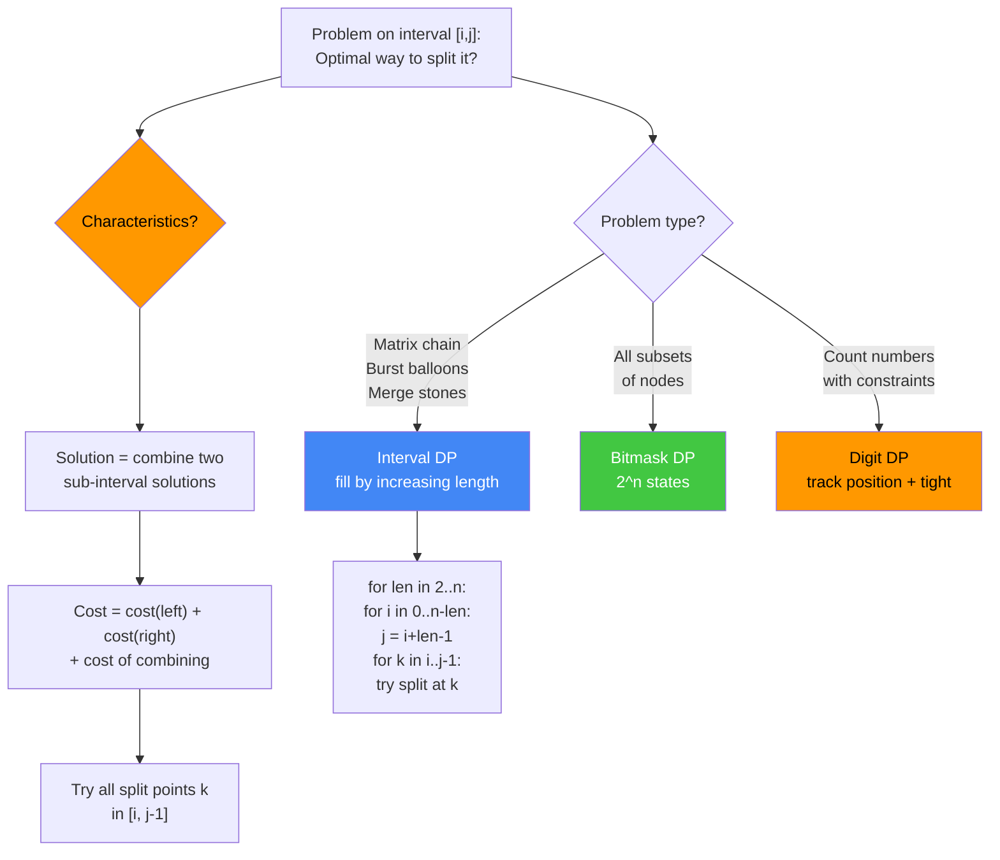
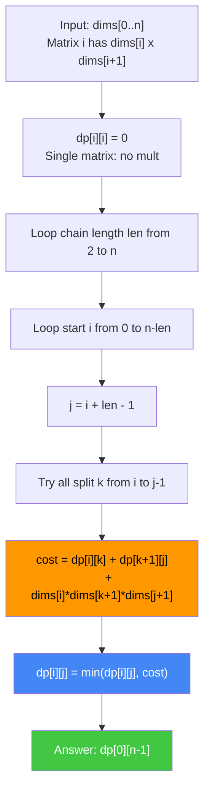
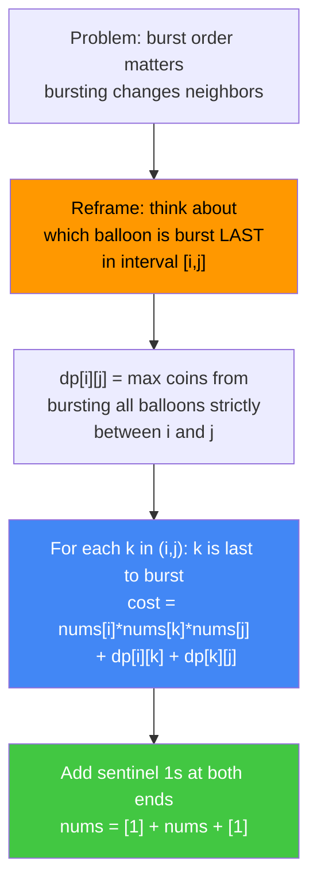
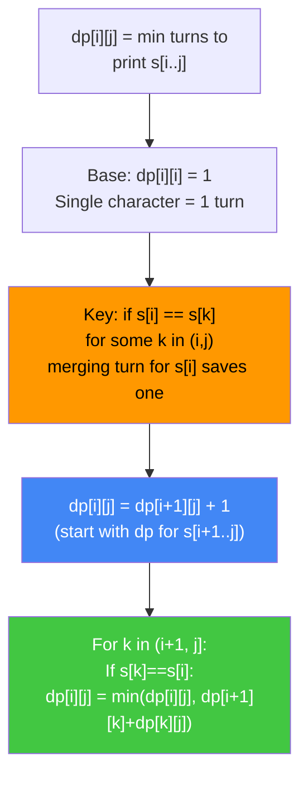
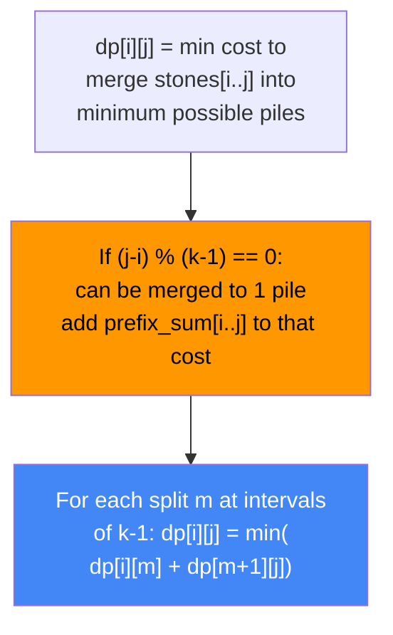
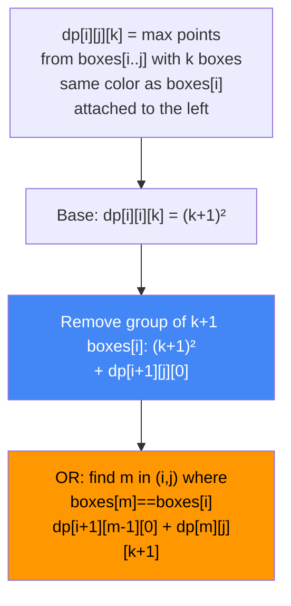
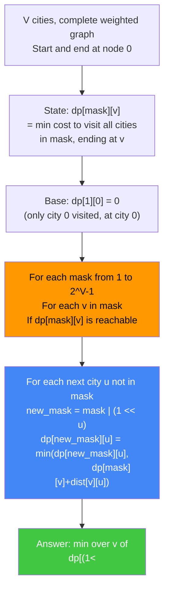
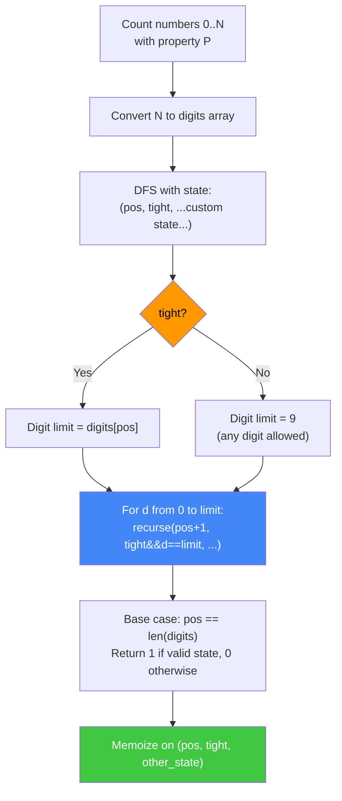

# DP: Interval, Bitmask, and Digit DP

Advanced DP patterns covering interval DP (Matrix Chain Multiplication, Burst Balloons, Strange Printer, Merge Stones, Zuma Game), bitmask DP (Traveling Salesman Problem), and digit DP basics. These are the hardest DP categories tested at senior FAANG level.

---

## Interval DP Pattern Recognition



---

## Matrix Chain Multiplication

Given n matrices, find the parenthesization minimizing total scalar multiplications.

### Matrix Chain Algorithm Flowchart


```
dims = [40, 20, 30, 10, 30]
Matrices: A0(40×20), A1(20×30), A2(30×10), A3(10×30)

Length 2: dp[0][1]=24000, dp[1][2]=6000, dp[2][3]=9000
Length 3: dp[0][2]=14000 (split k=0), dp[1][3]=12000 (split k=2)
Length 4: dp[0][3]=min(
  k=0: 0+12000+40*20*30=36000
  k=1: 24000+9000+40*30*30=69000
  k=2: 14000+0+40*10*30=26000  ← minimum
) = 26000

Optimal: ((A0 A1)(A2 A3))
```

### Python + Java Implementations
```python
def matrix_chain(dims: list) -> int:
    """Matrix chain multiplication. O(n³) time, O(n²) space."""
    n = len(dims) - 1  # number of matrices
    dp = [[0] * n for _ in range(n)]
    for length in range(2, n + 1):
        for i in range(n - length + 1):
            j = i + length - 1
            dp[i][j] = float('inf')
            for k in range(i, j):
                cost = dp[i][k] + dp[k + 1][j] + dims[i] * dims[k + 1] * dims[j + 1]
                dp[i][j] = min(dp[i][j], cost)
    return dp[0][n - 1]
```

```java
public class MatrixChain {
    public int matrixChainOrder(int[] dims) {
        int n = dims.length - 1;
        int[][] dp = new int[n][n];
        for (int len = 2; len <= n; len++) {
            for (int i = 0; i <= n - len; i++) {
                int j = i + len - 1;
                dp[i][j] = Integer.MAX_VALUE;
                for (int k = i; k < j; k++) {
                    int cost = dp[i][k] + dp[k + 1][j]
                             + dims[i] * dims[k + 1] * dims[j + 1];
                    dp[i][j] = Math.min(dp[i][j], cost);
                }
            }
        }
        return dp[0][n - 1];
    }
}
```

---

## Burst Balloons (LC 312)

Given n balloons each with a number, burst all balloons to maximize coins. Bursting balloon i gives `nums[i-1] * nums[i] * nums[i+1]` coins.

### Burst Balloons Key Insight


```
nums = [3, 1, 5, 8]  →  padded = [1, 3, 1, 5, 8, 1]

dp[i][j] = max coins from balloons strictly between i and j

Length 2 (adjacent pairs, no balloons between):
  All dp[i][i+1] = 0  (no balloon strictly between)

Length 3:
  dp[0][2]: k=1 (only option)
    cost = nums[0]*nums[1]*nums[2] + 0 + 0 = 1*3*1 = 3
  dp[1][3]: k=2 → 3*1*5=15
  dp[2][4]: k=3 → 1*5*8=40
  dp[3][5]: k=4 → 5*8*1=40

Length 4:
  dp[0][3]: k=1→3*3*5+dp[0][1]+dp[1][3]=45+0+0? No.
    k=1: nums[0]*nums[1]*nums[3] + dp[0][1]+dp[1][3] = 1*3*5+0+15=30
    k=2: nums[0]*nums[2]*nums[3] + dp[0][2]+dp[2][3] = 1*1*5+3+0=9
    max=30

...

dp[0][5] = 167  ← answer
```

### Python + Java Implementations
```python
def max_coins(nums: list) -> int:
    """Burst Balloons. O(n³) time, O(n²) space."""
    nums = [1] + nums + [1]
    n = len(nums)
    dp = [[0] * n for _ in range(n)]
    for length in range(2, n):  # length of interval (not counting endpoints)
        for i in range(0, n - length):
            j = i + length
            for k in range(i + 1, j):
                coins = nums[i] * nums[k] * nums[j]
                dp[i][j] = max(dp[i][j], dp[i][k] + dp[k][j] + coins)
    return dp[0][n - 1]
```

```java
public class BurstBalloons {
    public int maxCoins(int[] nums) {
        int n = nums.length;
        int[] padded = new int[n + 2];
        padded[0] = padded[n + 1] = 1;
        for (int i = 0; i < n; i++) padded[i + 1] = nums[i];
        n += 2;
        int[][] dp = new int[n][n];
        for (int len = 2; len < n; len++) {
            for (int i = 0; i + len < n; i++) {
                int j = i + len;
                for (int k = i + 1; k < j; k++) {
                    int coins = padded[i] * padded[k] * padded[j];
                    dp[i][j] = Math.max(dp[i][j], dp[i][k] + dp[k][j] + coins);
                }
            }
        }
        return dp[0][n - 1];
    }
}
```

**Key insight:** Instead of thinking about which balloon to burst first (changing neighbors), think about which balloon in the interval is burst LAST. When k is the last burst in `(i,j)`, its neighbors are exactly i and j (everything else already gone). This gives clean recurrence: `dp[i][j] = max over k of (dp[i][k] + dp[k][j] + nums[i]*nums[k]*nums[j])`.

---

## Strange Printer (LC 664)

A printer prints consecutive same characters in one turn. Find minimum turns to print string s.

### Strange Printer DP


```
s = "aaabbb"

dp[0][2] = 1 ("aaa" = one turn)
dp[3][5] = 1 ("bbb" = one turn)
dp[0][5]:
  s[0]='a', start with dp[1][5]+1=2+1=3
  k=1: s[1]='a'==s[0] → dp[1][1]+dp[1][5] = 1+2=3 (nope: dp[i+1][k]+dp[k][j])
       = dp[1][1]+dp[1][5] = 1+2=3
  k=2: s[2]='a'==s[0] → dp[1][2]+dp[2][5] = 1+2=3
  best = 2  (1 turn for 'aaa' + 1 turn for 'bbb')
```

```python
def strange_printer(s: str) -> int:
    """Strange Printer. O(n³) time, O(n²) space."""
    n = len(s)
    dp = [[0] * n for _ in range(n)]
    for i in range(n - 1, -1, -1):
        dp[i][i] = 1
        for j in range(i + 1, n):
            dp[i][j] = dp[i + 1][j] + 1  # print s[i] alone
            for k in range(i + 1, j + 1):
                if s[k] == s[i]:
                    val = (dp[i + 1][k] if k > i + 1 else 0) + dp[k][j]
                    dp[i][j] = min(dp[i][j], val)
    return dp[0][n - 1]
```

```java
public class StrangePrinter {
    public int strangePrinter(String s) {
        int n = s.length();
        int[][] dp = new int[n][n];
        for (int i = n - 1; i >= 0; i--) {
            dp[i][i] = 1;
            for (int j = i + 1; j < n; j++) {
                dp[i][j] = dp[i + 1][j] + 1;
                for (int k = i + 1; k <= j; k++) {
                    if (s.charAt(k) == s.charAt(i)) {
                        int left = (k > i + 1) ? dp[i + 1][k - 1] : 0;
                        dp[i][j] = Math.min(dp[i][j], left + dp[k][j]);
                    }
                }
            }
        }
        return dp[0][n - 1];
    }
}
```

---

## Minimum Cost to Merge Stones (LC 1000)

Given n piles, merge k consecutive piles into one with cost = sum of merged. Find minimum cost to reduce to 1 pile. (Possible only when `(n-1) % (k-1) == 0`.)

### Merge Stones DP


```python
def merge_stones(stones: list, k: int) -> int:
    """Minimum cost to merge stones. O(n³/k) time, O(n²) space."""
    n = len(stones)
    if (n - 1) % (k - 1) != 0:
        return -1
    prefix = [0] * (n + 1)
    for i in range(n):
        prefix[i + 1] = prefix[i] + stones[i]

    dp = [[0] * n for _ in range(n)]
    for length in range(k, n + 1):
        for i in range(n - length + 1):
            j = i + length - 1
            dp[i][j] = float('inf')
            for m in range(i, j, k - 1):
                dp[i][j] = min(dp[i][j], dp[i][m] + dp[m + 1][j])
            if (j - i) % (k - 1) == 0:
                dp[i][j] += prefix[j + 1] - prefix[i]
    return dp[0][n - 1]
```

```java
public class MergeStones {
    public int mergeStones(int[] stones, int k) {
        int n = stones.length;
        if ((n - 1) % (k - 1) != 0) return -1;
        int[] prefix = new int[n + 1];
        for (int i = 0; i < n; i++) prefix[i + 1] = prefix[i] + stones[i];
        int[][] dp = new int[n][n];
        for (int len = k; len <= n; len++) {
            for (int i = 0; i + len <= n; i++) {
                int j = i + len - 1;
                dp[i][j] = Integer.MAX_VALUE;
                for (int m = i; m < j; m += k - 1) {
                    if (dp[i][m] != Integer.MAX_VALUE && dp[m + 1][j] != Integer.MAX_VALUE)
                        dp[i][j] = Math.min(dp[i][j], dp[i][m] + dp[m + 1][j]);
                }
                if ((j - i) % (k - 1) == 0)
                    dp[i][j] += prefix[j + 1] - prefix[i];
            }
        }
        return dp[0][n - 1];
    }
}
```

---

## Zuma Game (LC 546)

Remove boxes to maximize points. Removing k consecutive same-colored boxes gives k² points.

### Zuma Game DP


```python
from functools import lru_cache

def remove_boxes(boxes: list) -> int:
    """Zuma Game. O(n⁴) time, O(n³) space."""
    @lru_cache(None)
    def dp(i, j, k):
        """Max points from boxes[i..j] with k extra same-color boxes on left."""
        if i > j:
            return 0
        # Accumulate consecutive same boxes at start
        while i < j and boxes[i] == boxes[i + 1]:
            i += 1; k += 1
        # Option 1: remove the group (k+1 boxes of same color)
        result = (k + 1) ** 2 + dp(i + 1, j, 0)
        # Option 2: find matching box m, merge groups
        for m in range(i + 1, j + 1):
            if boxes[m] == boxes[i]:
                result = max(result, dp(i + 1, m - 1, 0) + dp(m, j, k + 1))
        return result

    return dp(0, len(boxes) - 1, 0)
```

```java
public class ZumaGame {
    private int[][][] memo;

    public int removeBoxes(int[] boxes) {
        int n = boxes.length;
        memo = new int[n][n][n];
        return dp(boxes, 0, n - 1, 0);
    }

    private int dp(int[] boxes, int i, int j, int k) {
        if (i > j) return 0;
        if (memo[i][j][k] != 0) return memo[i][j][k];
        // Merge consecutive same-color boxes at start
        while (i < j && boxes[i] == boxes[i + 1]) { i++; k++; }
        // Remove group
        int result = (k + 1) * (k + 1) + dp(boxes, i + 1, j, 0);
        // Merge with matching box further right
        for (int m = i + 1; m <= j; m++) {
            if (boxes[m] == boxes[i]) {
                result = Math.max(result,
                    dp(boxes, i + 1, m - 1, 0) + dp(boxes, m, j, k + 1));
            }
        }
        return memo[i][j][k] = result;
    }
}
```

---

## Bitmask DP: Traveling Salesman Problem (TSP)

Find the shortest Hamiltonian cycle visiting all V cities exactly once. State: `dp[mask][v]` = minimum cost to reach node v having visited exactly the nodes in `mask`.

### TSP Bitmask DP Flowchart


```
Cities: 0,1,2,3 (V=4)
dist matrix:
     0   1   2   3
0 [  0   10  15  20 ]
1 [ 10    0  35  25 ]
2 [ 15  35    0  30 ]
3 [ 20  25  30   0  ]

Masks: 1=0001(only 0), ..., 15=1111(all)

dp[0001][0] = 0
dp[0011][1] = dp[0001][0]+dist[0][1] = 10
dp[0101][2] = dp[0001][0]+dist[0][2] = 15
dp[1001][3] = dp[0001][0]+dist[0][3] = 20
dp[0111][2] = dp[0011][1]+dist[1][2] = 10+35=45
dp[1011][3] = dp[0011][1]+dist[1][3] = 10+25=35
... (fill all masks)

dp[1111][1] + dist[1][0] = 35+10 = 45? ...
Optimal tour: 0→1→3→2→0 cost=10+25+30+15=80
```

### Python + Java Implementations
```python
def tsp(dist: list) -> int:
    """Traveling Salesman Problem with bitmask DP. O(2^V * V²) time."""
    V = len(dist)
    INF = float('inf')
    dp = [[INF] * V for _ in range(1 << V)]
    dp[1][0] = 0  # Start at city 0, only city 0 visited

    for mask in range(1, 1 << V):
        for v in range(V):
            if not (mask >> v & 1) or dp[mask][v] == INF:
                continue
            for u in range(V):
                if mask >> u & 1:
                    continue  # u already visited
                new_mask = mask | (1 << u)
                dp[new_mask][u] = min(dp[new_mask][u], dp[mask][v] + dist[v][u])

    full = (1 << V) - 1
    return min(dp[full][v] + dist[v][0] for v in range(1, V))
```

```java
public class TSP {
    public int tsp(int[][] dist) {
        int V = dist.length;
        int INF = Integer.MAX_VALUE / 2;
        int[][] dp = new int[1 << V][V];
        for (int[] row : dp) Arrays.fill(row, INF);
        dp[1][0] = 0;

        for (int mask = 1; mask < (1 << V); mask++) {
            for (int v = 0; v < V; v++) {
                if ((mask >> v & 1) == 0 || dp[mask][v] == INF) continue;
                for (int u = 0; u < V; u++) {
                    if ((mask >> u & 1) == 1) continue;
                    int newMask = mask | (1 << u);
                    dp[newMask][u] = Math.min(dp[newMask][u], dp[mask][v] + dist[v][u]);
                }
            }
        }
        int full = (1 << V) - 1;
        int ans = INF;
        for (int v = 1; v < V; v++) {
            if (dp[full][v] != INF) ans = Math.min(ans, dp[full][v] + dist[v][0]);
        }
        return ans;
    }
}
```

**Key insight:** Bitmask DP uses an integer's bits to represent a subset of nodes. `mask & (1 << v)` checks if v is in the set. `mask | (1 << u)` adds u to the set. With V cities, there are 2^V possible subsets × V possible ending nodes = 2^V × V states. Total: O(2^V × V²) time.

**When to use:** V ≤ 20 typically (memory 2^20 × 20 integers). Problems: Hamilton path/cycle, assignment problems, minimum cover of all nodes.

---

## Digit DP Basics

Count integers in range [0, N] satisfying some digit-level constraint. The key idea: iterate digit by digit, tracking whether we are still "tight" (bound by N's digits) and other state variables.

### Digit DP Template Flowchart


### Example: Count Numbers with Digit Sum ≤ K

```
Count numbers in [1, 100] where digit sum <= 10.

digits of 100 = [1, 0, 0]

State: (pos, tight, digit_sum_so_far)
Base: pos == 3 → return 1 if digit_sum_so_far <= 10 else 0

dp(0, True, 0):
  d=0: dp(1, False, 0) → all numbers 000..099 with sum<=10
  d=1: dp(1, True, 1) → numbers 100..100 with sum<=10
  ...
```

```python
from functools import lru_cache

def count_digit_sum_at_most(N: int, K: int) -> int:
    """Count numbers in [0, N] with digit sum <= K."""
    digits = list(map(int, str(N)))
    n = len(digits)

    @lru_cache(None)
    def dp(pos, tight, digit_sum):
        if digit_sum > K:
            return 0
        if pos == n:
            return 1  # valid number
        limit = digits[pos] if tight else 9
        total = 0
        for d in range(0, limit + 1):
            total += dp(pos + 1, tight and d == limit, digit_sum + d)
        return total

    return dp(0, True, 0) - 1  # subtract 0 if needed

# More complex example: count numbers in [lo, hi] with property
def count_in_range(lo: int, hi: int, K: int) -> int:
    return count_digit_sum_at_most(hi, K) - count_digit_sum_at_most(lo - 1, K)
```

```java
public class DigitDP {
    private int[] digits;
    private int K;
    private int[][][] memo;

    public int countDigitSum(int N, int k) {
        this.K = k;
        String s = Integer.toString(N);
        int n = s.length();
        digits = new int[n];
        for (int i = 0; i < n; i++) digits[i] = s.charAt(i) - '0';
        // memo[pos][tight][digitSum] — tight is 0 or 1
        memo = new int[n][2][k + 2];
        for (int[][] a : memo) for (int[] b : a) Arrays.fill(b, -1);
        int result = dp(0, 1, 0) - 1; // subtract 0
        return Math.max(0, result);
    }

    private int dp(int pos, int tight, int digitSum) {
        if (digitSum > K) return 0;
        if (pos == digits.length) return 1;
        if (memo[pos][tight][digitSum] != -1) return memo[pos][tight][digitSum];
        int limit = (tight == 1) ? digits[pos] : 9;
        int total = 0;
        for (int d = 0; d <= limit; d++) {
            total += dp(pos + 1, (tight == 1 && d == limit) ? 1 : 0, digitSum + d);
        }
        return memo[pos][tight][digitSum] = total;
    }
}
```

**Key insight:** The `tight` flag tracks whether we are still constrained by N's digits. When `tight=True`, the current digit d cannot exceed `digits[pos]`. When `tight=False` (because we chose d < `digits[pos]` at some earlier position), any digit 0-9 is free. Memoization is on `(pos, tight, custom_state)`.

---

## Common Interview Questions

**Q: Explain the key insight behind Burst Balloons interval DP.**
A: Instead of thinking about which balloon to burst first (which changes neighbors and makes the recurrence messy), think about which balloon in interval `(i,j)` is burst LAST. When k is the last burst, its neighbors are guaranteed to be i and j (everything else already gone). Recurrence: `dp[i][j] = max over k of dp[i][k] + dp[k][j] + nums[i]*nums[k]*nums[j]`. Add sentinel 1s at both ends to handle boundaries.

**Q: What is the template for interval DP problems?**
A: Always fill by increasing interval length. The outer loop is `length` from 2 to n; inner loops are `i` (start) and `k` (split point). The answer is `dp[0][n-1]`. Key question to identify interval DP: "Does the problem ask for optimal results on all contiguous subarrays/substrings, with cost depending on how they combine?"

**Q: How does Zuma Game extend beyond standard interval DP?**
A: Standard interval DP has `dp[i][j]`. Zuma needs `dp[i][j][k]` where k = extra same-color boxes attached left of i. This third dimension handles the "chain reaction" property where accumulating same-color boxes from different parts of the string increases score exponentially. LC 546 is a 3-D interval DP.

**Q: What constraints allow bitmask DP to work for TSP?**
A: V ≤ 20 (sometimes ≤ 25 with careful implementation). Time: O(2^V × V²). Space: O(2^V × V). For V=20: 2^20 × 20 ≈ 20M states, tractable. For V=30+: infeasible — need approximation algorithms. TSP bitmask DP gives exact answer in exponential time, which is optimal for NP-hard TSP.

**Q: Explain the `tight` flag in digit DP.**
A: `tight=True` means all digits chosen so far exactly match the upper bound N. Therefore the current digit is constrained: `d ≤ digits[pos]`. Once any digit `d < digits[pos]` is chosen, `tight` becomes False for all subsequent positions — any digit 0-9 is valid. This prevents counting numbers exceeding N while allowing all valid configurations within the bound.

**Q: Strange Printer — why is `dp[i][j] = dp[i+1][j] + 1` the starting point?**
A: Print s[i] alone as the first turn (cost 1), then optimally print the rest s[i+1..j]. This is the upper bound. We then try to reduce this by merging the turn for s[i] with some later occurrence: if s[k] == s[i], we can print s[i..k] in the same turn as s[k], saving one separate print. The recurrence finds the best such k.

**Q: In Matrix Chain Multiplication, what does the split point k represent?**
A: k is the index where we split the matrix chain into two sub-chains: (A_i × ... × A_k) and (A_{k+1} × ... × A_j). Each sub-chain is already optimally parenthesized (subproblem). The cost of combining them is `dims[i] × dims[k+1] × dims[j+1]` — the dimensions of the matrix product of the two sub-results. We try all k to find the minimum.

---

## Complexity Reference

| Algorithm | Time | Space | State Dimensions |
|-----------|------|-------|-----------------|
| Matrix Chain | O(n³) | O(n²) | 2D interval |
| Burst Balloons | O(n³) | O(n²) | 2D interval |
| Strange Printer | O(n³) | O(n²) | 2D interval |
| Merge Stones | O(n³/k) | O(n²) | 2D interval |
| Zuma Game | O(n⁴) | O(n³) | 3D (i, j, k) |
| TSP Bitmask | O(2^V × V²) | O(2^V × V) | mask + node |
| Digit DP | O(D × 2 × S) | same | pos + tight + state |

> D = number of digits in N, S = number of custom state values
