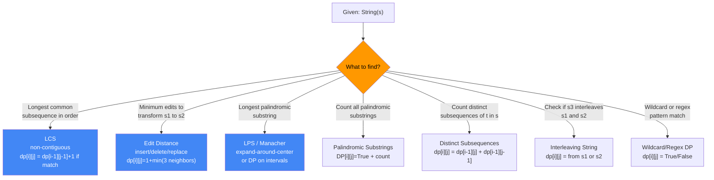
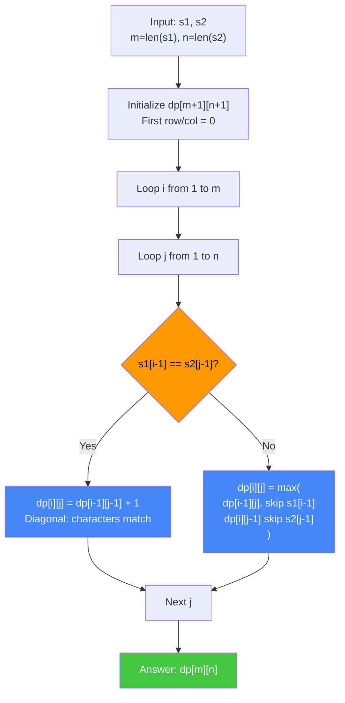
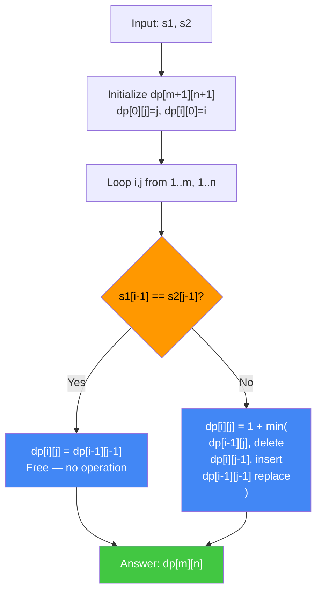
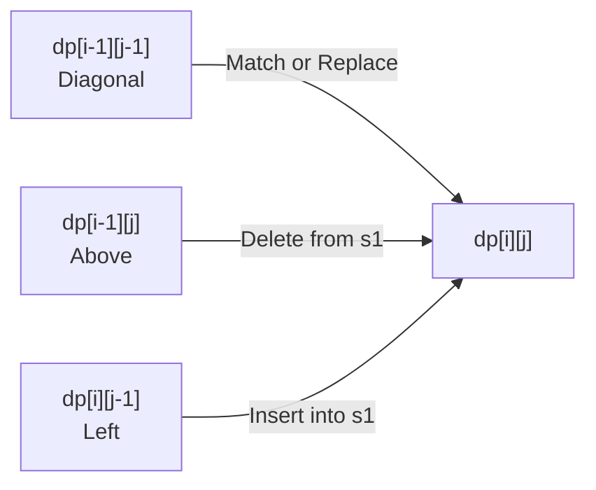
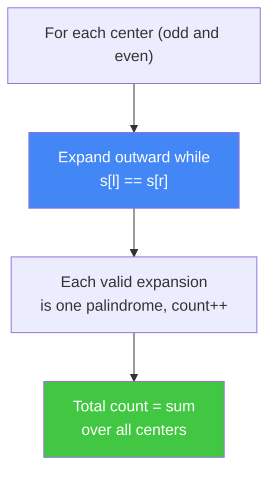
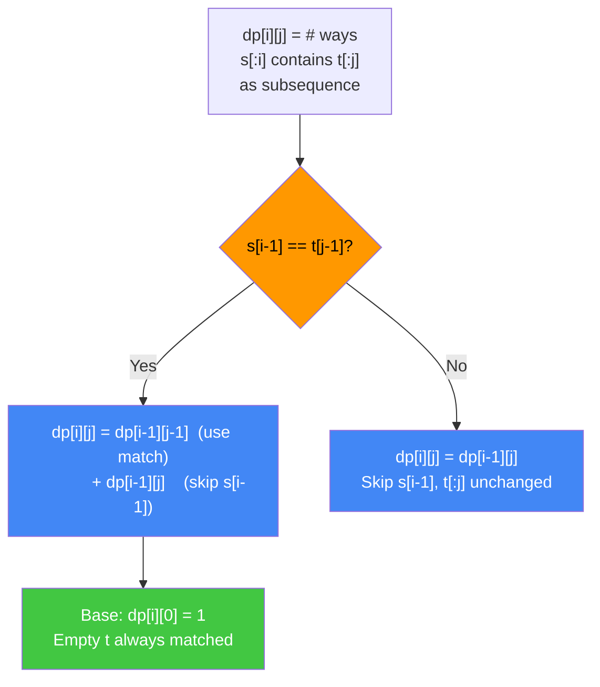
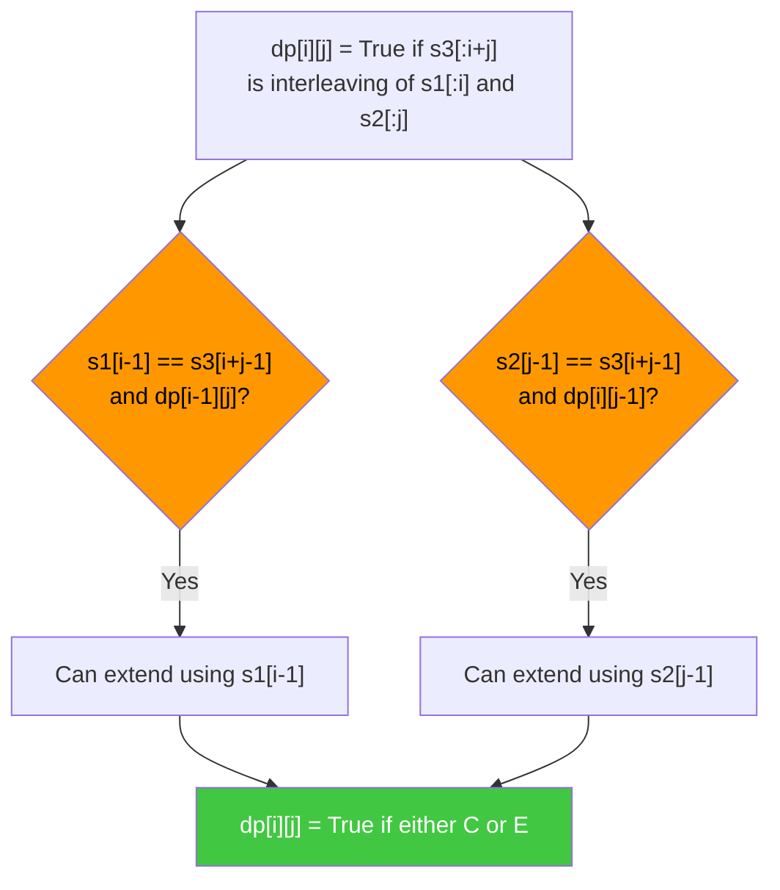
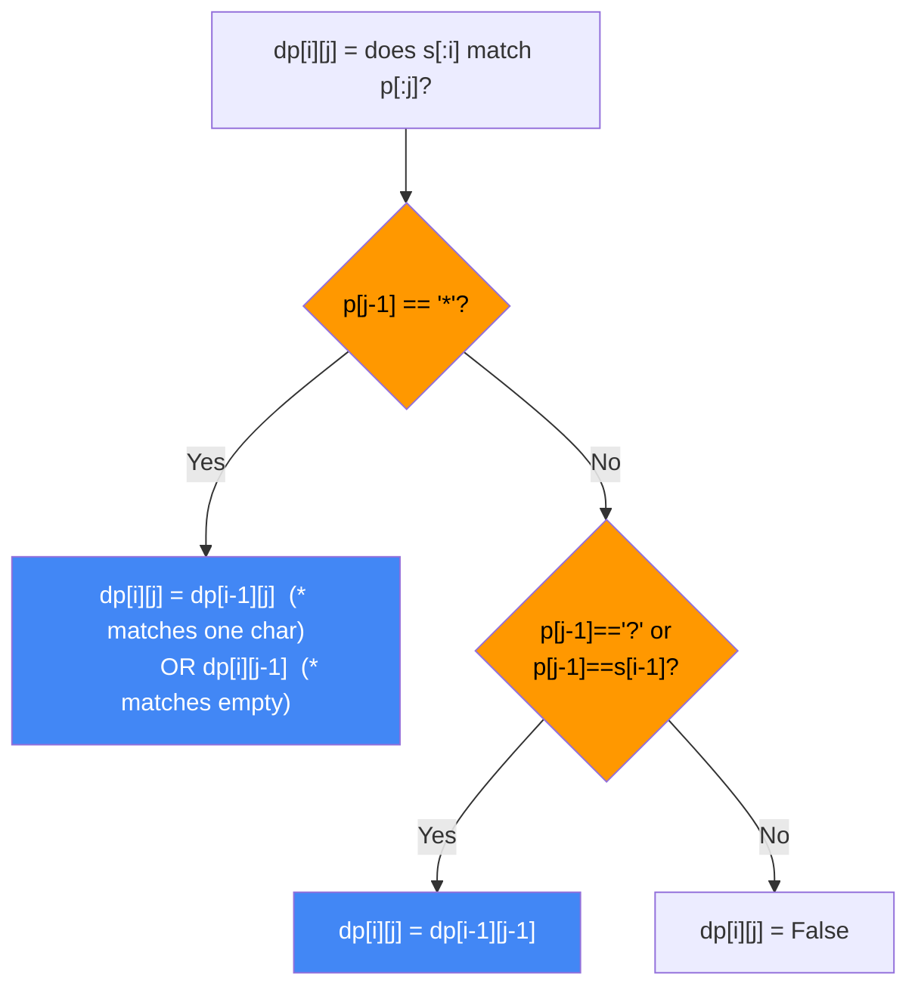

# DP on Strings

String dynamic programming problems covering LCS, Edit Distance, Longest Palindromic Substring, Palindromic Substrings, Distinct Subsequences, Interleaving String, and Wildcard/Regex Matching. All problems use 2-D DP tables where `dp[i][j]` encodes some relationship between prefixes of the input strings.

---

## String DP Pattern Recognition



---

## Algorithms Covered

| Algorithm                     | Time       | Space      | Key State          |
|-------------------------------|:----------:|:----------:|:------------------:|
| LCS                           | O(m × n)   | O(m × n)   | dp[i][j] = LCS len |
| Edit Distance                 | O(m × n)   | O(m × n)   | dp[i][j] = min ops |
| Longest Palindromic Substring | O(n²)      | O(n²)/O(1) | dp[i][j] = is_pal  |
| Palindromic Substrings        | O(n²)      | O(n²)      | count palindromes  |
| Distinct Subsequences         | O(m × n)   | O(m × n)   | dp[i][j] = count   |
| Interleaving String           | O(m × n)   | O(m × n)   | dp[i][j] = bool    |
| Wildcard Matching             | O(m × n)   | O(m × n)   | dp[i][j] = bool    |

---

## Longest Common Subsequence (LCS)

Find the longest sequence of characters appearing (in order, but not necessarily contiguous) in both strings.

### LCS Algorithm Flowchart


```
s1 = "ABCB"   s2 = "BDCAB"

       ""  B  D  C  A  B
  ""  [ 0  0  0  0  0  0 ]
   A  [ 0  0  0  0  1  1 ]
   B  [ 0  1  1  1  1  2 ]
   C  [ 0  1  1  2  2  2 ]
   B  [ 0  1  1  2  2  3 ]  ← LCS length = 3

Backtrack: 'B' at (4,5) → 'C' at (3,3) → 'A' at (1,4)
LCS = "ACB"
```

### Python + Java Implementations
```python
def lcs(s1: str, s2: str) -> str:
    """Return the LCS string. O(m*n) time and space."""
    m, n = len(s1), len(s2)
    dp = [[0] * (n + 1) for _ in range(m + 1)]
    for i in range(1, m + 1):
        for j in range(1, n + 1):
            if s1[i - 1] == s2[j - 1]:
                dp[i][j] = dp[i - 1][j - 1] + 1
            else:
                dp[i][j] = max(dp[i - 1][j], dp[i][j - 1])

    # Backtrack to reconstruct
    result = []
    i, j = m, n
    while i > 0 and j > 0:
        if s1[i - 1] == s2[j - 1]:
            result.append(s1[i - 1])
            i -= 1; j -= 1
        elif dp[i - 1][j] > dp[i][j - 1]:
            i -= 1
        else:
            j -= 1
    return ''.join(reversed(result))

def lcs_length(s1: str, s2: str) -> int:
    """LCS length with O(min(m,n)) space using two rows."""
    if len(s1) < len(s2):
        s1, s2 = s2, s1
    m, n = len(s1), len(s2)
    prev = [0] * (n + 1)
    for i in range(1, m + 1):
        curr = [0] * (n + 1)
        for j in range(1, n + 1):
            if s1[i - 1] == s2[j - 1]:
                curr[j] = prev[j - 1] + 1
            else:
                curr[j] = max(prev[j], curr[j - 1])
        prev = curr
    return prev[n]
```

```java
public class LCS {
    public int lcsLength(String s1, String s2) {
        int m = s1.length(), n = s2.length();
        int[][] dp = new int[m + 1][n + 1];
        for (int i = 1; i <= m; i++) {
            for (int j = 1; j <= n; j++) {
                if (s1.charAt(i - 1) == s2.charAt(j - 1)) {
                    dp[i][j] = dp[i - 1][j - 1] + 1;
                } else {
                    dp[i][j] = Math.max(dp[i - 1][j], dp[i][j - 1]);
                }
            }
        }
        return dp[m][n];
    }

    public String lcsString(String s1, String s2) {
        int m = s1.length(), n = s2.length();
        int[][] dp = new int[m + 1][n + 1];
        for (int i = 1; i <= m; i++) {
            for (int j = 1; j <= n; j++) {
                if (s1.charAt(i - 1) == s2.charAt(j - 1)) {
                    dp[i][j] = dp[i - 1][j - 1] + 1;
                } else {
                    dp[i][j] = Math.max(dp[i - 1][j], dp[i][j - 1]);
                }
            }
        }
        // Backtrack
        StringBuilder sb = new StringBuilder();
        int i = m, j = n;
        while (i > 0 && j > 0) {
            if (s1.charAt(i - 1) == s2.charAt(j - 1)) {
                sb.append(s1.charAt(i - 1));
                i--; j--;
            } else if (dp[i - 1][j] > dp[i][j - 1]) {
                i--;
            } else {
                j--;
            }
        }
        return sb.reverse().toString();
    }
}
```

**Key insight:** The diagonal move (`dp[i-1][j-1] + 1`) represents a match — both pointers advance together. The table encodes all 2^(m+n) subsequence possibilities implicitly. Horizontal/vertical moves skip one character in one of the strings.

---

## Edit Distance (Levenshtein)

Find the minimum number of single-character operations (insert, delete, substitute) to transform s1 into s2.

### Edit Distance Flowchart


### Operation Direction Map


```
s1 = "kitten"  s2 = "sitting"

       ""  s  i  t  t  i  n  g
  ""  [ 0  1  2  3  4  5  6  7 ]
   k  [ 1  1  2  3  4  5  6  7 ]
   i  [ 2  2  1  2  3  4  5  6 ]
   t  [ 3  3  2  1  2  3  4  5 ]
   t  [ 4  4  3  2  1  2  3  4 ]
   e  [ 5  5  4  3  2  2  3  4 ]
   n  [ 6  6  5  4  3  3  2  3 ]
                              ↑ Edit distance = 3
```

### Python + Java Implementations
```python
def edit_distance(s1: str, s2: str) -> int:
    """Levenshtein distance. O(m*n) time, O(m*n) space."""
    m, n = len(s1), len(s2)
    dp = [[0] * (n + 1) for _ in range(m + 1)]
    for i in range(m + 1):
        dp[i][0] = i
    for j in range(n + 1):
        dp[0][j] = j
    for i in range(1, m + 1):
        for j in range(1, n + 1):
            if s1[i - 1] == s2[j - 1]:
                dp[i][j] = dp[i - 1][j - 1]
            else:
                dp[i][j] = 1 + min(dp[i - 1][j], dp[i][j - 1], dp[i - 1][j - 1])
    return dp[m][n]

def edit_distance_optimized(s1: str, s2: str) -> int:
    """Space-optimized with two rows. O(min(m,n)) space."""
    if len(s1) < len(s2):
        s1, s2 = s2, s1
    m, n = len(s1), len(s2)
    prev = list(range(n + 1))
    for i in range(1, m + 1):
        curr = [i] + [0] * n
        for j in range(1, n + 1):
            if s1[i - 1] == s2[j - 1]:
                curr[j] = prev[j - 1]
            else:
                curr[j] = 1 + min(prev[j], curr[j - 1], prev[j - 1])
        prev = curr
    return prev[n]
```

```java
public class EditDistance {
    public int minDistance(String word1, String word2) {
        int m = word1.length(), n = word2.length();
        int[][] dp = new int[m + 1][n + 1];
        for (int i = 0; i <= m; i++) dp[i][0] = i;
        for (int j = 0; j <= n; j++) dp[0][j] = j;
        for (int i = 1; i <= m; i++) {
            for (int j = 1; j <= n; j++) {
                if (word1.charAt(i - 1) == word2.charAt(j - 1)) {
                    dp[i][j] = dp[i - 1][j - 1];
                } else {
                    dp[i][j] = 1 + Math.min(dp[i - 1][j - 1],
                                   Math.min(dp[i - 1][j], dp[i][j - 1]));
                }
            }
        }
        return dp[m][n];
    }
}
```

**Key insight:** Three directions encode three operations. Diagonal = substitute (or no-op when equal). Above = delete from s1. Left = insert from s2 into s1. Base case: transforming empty string requires i inserts/deletes.

---

## Longest Palindromic Substring

Find the longest substring of s that reads the same forwards and backwards.

### Approach Decision
```mermaid
graph TD
    A["Longest palindromic substring"] --> B{"Priority?"}
    B -->|Simplicity<br/>Table reuse| C["O(n²) DP<br/>dp[i][j] = is palindrome"]
    B -->|Must be O(n)| D["Manacher's Algorithm<br/>Mirror trick O(n)"]
    B -->|Space conscious| E["Expand around center<br/>O(n²) time, O(1) space"]

    style B fill:#ff9800,color:#000
    style C fill:#4287f5,color:#fff
    style D fill:#42c742,color:#fff
    style E fill:#4287f5,color:#fff
```

```
s = "babad"

DP approach (fill by length):
  Base: dp[i][i] = True for all i

  Length 2: dp[0][1]? 'b'=='a'? No
  Length 3: dp[0][2]? 'b'=='b' and dp[1][1]=T → True  "bab"
            dp[1][3]? 'a'=='a' and dp[2][2]=T → True  "aba"

  Longest = "bab" (length 3)

Expand around center:
  Center 0 (odd): "b"
  Center 0-1 (even): 'b'=='a'? No
  Center 1 (odd): 'a','b','a' → "aba" length 3
  Center 2 (odd): 'b','a','b' → "bab" length 3
```

### Python + Java Implementations
```python
def longest_palindrome_dp(s: str) -> str:
    """O(n²) DP approach."""
    n = len(s)
    dp = [[False] * n for _ in range(n)]
    start, max_len = 0, 1
    for i in range(n):
        dp[i][i] = True
    for length in range(2, n + 1):
        for i in range(n - length + 1):
            j = i + length - 1
            if s[i] == s[j]:
                if length == 2 or dp[i + 1][j - 1]:
                    dp[i][j] = True
                    if length > max_len:
                        start, max_len = i, length
    return s[start:start + max_len]

def longest_palindrome_expand(s: str) -> str:
    """Expand around center. O(n²) time, O(1) space."""
    def expand(l, r):
        while l >= 0 and r < len(s) and s[l] == s[r]:
            l -= 1; r += 1
        return s[l + 1:r]

    best = ""
    for i in range(len(s)):
        for p in [expand(i, i), expand(i, i + 1)]:
            if len(p) > len(best):
                best = p
    return best
```

```java
public class LongestPalindrome {
    public String longestPalindrome(String s) {
        int n = s.length();
        boolean[][] dp = new boolean[n][n];
        int start = 0, maxLen = 1;
        for (int i = 0; i < n; i++) dp[i][i] = true;
        for (int len = 2; len <= n; len++) {
            for (int i = 0; i <= n - len; i++) {
                int j = i + len - 1;
                if (s.charAt(i) == s.charAt(j) && (len == 2 || dp[i + 1][j - 1])) {
                    dp[i][j] = true;
                    if (len > maxLen) { start = i; maxLen = len; }
                }
            }
        }
        return s.substring(start, start + maxLen);
    }

    // Expand around center — O(1) space
    private int[] expandAroundCenter(String s, int l, int r) {
        while (l >= 0 && r < s.length() && s.charAt(l) == s.charAt(r)) {
            l--; r++;
        }
        return new int[]{l + 1, r - 1};
    }
}
```

---

## Palindromic Substrings (Count All)

Count the number of palindromic substrings in s (LC 647).

### Palindromic Substrings DP


```
s = "aaa"
Centers: (0), (0,1), (1), (1,2), (2)
  Center 0 (odd): "a"=1, expand: cannot → +1
  Center (0,1) (even): "aa"=1 → +1
  Center 1 (odd): "a"=1, "aaa"=1 → +2
  Center (1,2) (even): "aa"=1 → +1
  Center 2 (odd): "a"=1 → +1
Total = 6
```

```python
def count_substrings(s: str) -> int:
    """Count palindromic substrings. O(n²) time, O(1) space."""
    count = 0
    n = len(s)
    for center in range(2 * n - 1):
        l = center // 2
        r = l + center % 2
        while l >= 0 and r < n and s[l] == s[r]:
            count += 1
            l -= 1; r += 1
    return count
```

```java
public int countSubstrings(String s) {
    int count = 0, n = s.length();
    for (int center = 0; center < 2 * n - 1; center++) {
        int l = center / 2, r = l + center % 2;
        while (l >= 0 && r < n && s.charAt(l) == s.charAt(r)) {
            count++;
            l--; r++;
        }
    }
    return count;
}
```

---

## Distinct Subsequences

Count the number of distinct subsequences of string `t` in string `s` (LC 115).

### Distinct Subsequences DP


```
s = "rabbbit"  t = "rabbit"

       ""  r  a  b  b  i  t
  ""  [ 1  0  0  0  0  0  0 ]
   r  [ 1  1  0  0  0  0  0 ]
   a  [ 1  1  1  0  0  0  0 ]
   b  [ 1  1  1  1  0  0  0 ]
   b  [ 1  1  1  2  1  0  0 ]
   b  [ 1  1  1  3  3  0  0 ]
   i  [ 1  1  1  3  3  3  0 ]
   t  [ 1  1  1  3  3  3  3 ]  ← answer = 3
```

```python
def num_distinct(s: str, t: str) -> int:
    """Distinct subsequences of t in s. O(m*n) time and space."""
    m, n = len(s), len(t)
    dp = [[0] * (n + 1) for _ in range(m + 1)]
    for i in range(m + 1):
        dp[i][0] = 1  # empty t is always found once
    for i in range(1, m + 1):
        for j in range(1, n + 1):
            dp[i][j] = dp[i - 1][j]
            if s[i - 1] == t[j - 1]:
                dp[i][j] += dp[i - 1][j - 1]
    return dp[m][n]
```

```java
public int numDistinct(String s, String t) {
    int m = s.length(), n = t.length();
    long[][] dp = new long[m + 1][n + 1];
    for (int i = 0; i <= m; i++) dp[i][0] = 1;
    for (int i = 1; i <= m; i++) {
        for (int j = 1; j <= n; j++) {
            dp[i][j] = dp[i - 1][j];
            if (s.charAt(i - 1) == t.charAt(j - 1)) {
                dp[i][j] += dp[i - 1][j - 1];
            }
        }
    }
    return (int) dp[m][n];
}
```

---

## Interleaving String

Given s1, s2, s3, determine if s3 is formed by interleaving s1 and s2 (LC 97).

### Interleaving String DP


```
s1="aab", s2="axy", s3="aaxaby"

       ""  a  x  y
  ""  [ T  F  F  F ]
   a  [ T  T  F  F ]
   a  [ T  T  T  F ]
   b  [ F  T  T  T ]  ← dp[3][3]=True, interleaved!
```

```python
def is_interleave(s1: str, s2: str, s3: str) -> bool:
    """Check if s3 is an interleaving of s1 and s2."""
    m, n = len(s1), len(s2)
    if m + n != len(s3):
        return False
    dp = [[False] * (n + 1) for _ in range(m + 1)]
    dp[0][0] = True
    for i in range(1, m + 1):
        dp[i][0] = dp[i - 1][0] and s1[i - 1] == s3[i - 1]
    for j in range(1, n + 1):
        dp[0][j] = dp[0][j - 1] and s2[j - 1] == s3[j - 1]
    for i in range(1, m + 1):
        for j in range(1, n + 1):
            k = i + j - 1
            dp[i][j] = (dp[i - 1][j] and s1[i - 1] == s3[k]) or \
                       (dp[i][j - 1] and s2[j - 1] == s3[k])
    return dp[m][n]
```

```java
public boolean isInterleave(String s1, String s2, String s3) {
    int m = s1.length(), n = s2.length();
    if (m + n != s3.length()) return false;
    boolean[][] dp = new boolean[m + 1][n + 1];
    dp[0][0] = true;
    for (int i = 1; i <= m; i++)
        dp[i][0] = dp[i - 1][0] && s1.charAt(i - 1) == s3.charAt(i - 1);
    for (int j = 1; j <= n; j++)
        dp[0][j] = dp[0][j - 1] && s2.charAt(j - 1) == s3.charAt(j - 1);
    for (int i = 1; i <= m; i++) {
        for (int j = 1; j <= n; j++) {
            int k = i + j - 1;
            dp[i][j] = (dp[i - 1][j] && s1.charAt(i - 1) == s3.charAt(k)) ||
                       (dp[i][j - 1] && s2.charAt(j - 1) == s3.charAt(k));
        }
    }
    return dp[m][n];
}
```

---

## Wildcard Matching

Match a string s against a pattern p where `?` matches any single character and `*` matches any sequence (including empty). LC 44.

### Wildcard Matching DP


```python
def is_match_wildcard(s: str, p: str) -> bool:
    """Wildcard matching with ? and *. O(m*n) time."""
    m, n = len(s), len(p)
    dp = [[False] * (n + 1) for _ in range(m + 1)]
    dp[0][0] = True
    for j in range(1, n + 1):
        dp[0][j] = dp[0][j - 1] and p[j - 1] == '*'
    for i in range(1, m + 1):
        for j in range(1, n + 1):
            if p[j - 1] == '*':
                dp[i][j] = dp[i - 1][j] or dp[i][j - 1]
            elif p[j - 1] == '?' or p[j - 1] == s[i - 1]:
                dp[i][j] = dp[i - 1][j - 1]
    return dp[m][n]

def is_match_regex(s: str, p: str) -> bool:
    """Regex matching with . and *. LC 10."""
    m, n = len(s), len(p)
    dp = [[False] * (n + 1) for _ in range(m + 1)]
    dp[0][0] = True
    for j in range(2, n + 1):
        if p[j - 1] == '*':
            dp[0][j] = dp[0][j - 2]
    for i in range(1, m + 1):
        for j in range(1, n + 1):
            if p[j - 1] == '*':
                dp[i][j] = dp[i][j - 2]  # * matches zero
                if p[j - 2] == '.' or p[j - 2] == s[i - 1]:
                    dp[i][j] = dp[i][j] or dp[i - 1][j]  # * matches more
            elif p[j - 1] == '.' or p[j - 1] == s[i - 1]:
                dp[i][j] = dp[i - 1][j - 1]
    return dp[m][n]
```

```java
public class PatternMatching {
    public boolean isMatchWildcard(String s, String p) {
        int m = s.length(), n = p.length();
        boolean[][] dp = new boolean[m + 1][n + 1];
        dp[0][0] = true;
        for (int j = 1; j <= n; j++)
            dp[0][j] = dp[0][j - 1] && p.charAt(j - 1) == '*';
        for (int i = 1; i <= m; i++) {
            for (int j = 1; j <= n; j++) {
                char pc = p.charAt(j - 1);
                if (pc == '*') {
                    dp[i][j] = dp[i - 1][j] || dp[i][j - 1];
                } else if (pc == '?' || pc == s.charAt(i - 1)) {
                    dp[i][j] = dp[i - 1][j - 1];
                }
            }
        }
        return dp[m][n];
    }

    public boolean isMatchRegex(String s, String p) {
        int m = s.length(), n = p.length();
        boolean[][] dp = new boolean[m + 1][n + 1];
        dp[0][0] = true;
        for (int j = 2; j <= n; j++)
            if (p.charAt(j - 1) == '*') dp[0][j] = dp[0][j - 2];
        for (int i = 1; i <= m; i++) {
            for (int j = 1; j <= n; j++) {
                char pc = p.charAt(j - 1);
                if (pc == '*') {
                    dp[i][j] = dp[i][j - 2];
                    if (p.charAt(j - 2) == '.' || p.charAt(j - 2) == s.charAt(i - 1))
                        dp[i][j] = dp[i][j] || dp[i - 1][j];
                } else if (pc == '.' || pc == s.charAt(i - 1)) {
                    dp[i][j] = dp[i - 1][j - 1];
                }
            }
        }
        return dp[m][n];
    }
}
```

**Key insight for `*` in Wildcard:** `dp[i-1][j]` means `*` consumed one more character from s. `dp[i][j-1]` means `*` matches empty. Key difference from regex: Wildcard `*` matches any sequence, but regex `x*` matches zero or more of the preceding element.

---

## Common Interview Questions

**Q: Why is the LCS recurrence `dp[i-1][j-1]+1` when characters match, not checking all sub-arrays?**
A: Optimal substructure: any LCS of `s1[:i]` and `s2[:j]` ending with the matching character must have had its prefix from an LCS of `s1[:i-1]` and `s2[:j-1]`. You don't need to check all sub-arrays because the table already stores the answer for all shorter prefixes.

**Q: In edit distance, what do the three cell directions represent?**
A: Diagonal `dp[i-1][j-1]` = no-op (chars match) or substitute (chars differ, cost 1). Above `dp[i-1][j]` = delete from s1 (advance i, cost 1). Left `dp[i][j-1]` = insert from s2 into s1 (advance j, cost 1).

**Q: Explain the space-optimized form of LCS.**
A: `dp[i][j]` only depends on `dp[i-1][j]`, `dp[i][j-1]`, and `dp[i-1][j-1]`. Use two 1-D arrays (current and previous row) to reduce from O(m·n) to O(min(m,n)). Keep full table only when reconstructing the actual subsequence.

**Q: How does counting palindromic substrings differ from finding the longest one?**
A: Longest palindrome: track start/max_length, update when longer palindrome found. Count: increment counter for every valid expansion. Both use expand-around-center in O(n²) time, O(1) space. The DP approach uses O(n²) space and fills by substring length.

**Q: Distinct subsequences — why does `dp[i][j] = dp[i-1][j] + dp[i-1][j-1]` when chars match?**
A: When `s[i-1] == t[j-1]`: either skip `s[i-1]` (first term `dp[i-1][j]`, ignore this character and use other characters in s to match t[:j]) or use `s[i-1]` to match `t[j-1]` (second term `dp[i-1][j-1]`, both pointers advance). Both paths contribute distinct subsequences.

**Q: Interleaving String — why is the 2D DP necessary over 1D?**
A: We need to track how many characters from each of s1 and s2 have been consumed independently. At position `(i, j)` in the table, we've consumed i chars from s1 and j chars from s2, forming s3[:i+j]. A 1D approach cannot represent this two-dimensional state simultaneously.

**Q: What's the key difference between Wildcard `*` and Regex `.*`?**
A: Wildcard `*` alone matches any sequence (including empty) — one symbol that stands alone. Regex `.*` is two symbols: `.` (any char) followed by `*` (zero or more of preceding). In DP: wildcard `*` transitions are `dp[i-1][j]` (use *) and `dp[i][j-1]` (skip *). Regex `x*` checks if the preceding pattern element matches, then allows `dp[i-1][j]`.

**Q: What is the shortest common supersequence and how does it relate to LCS?**
A: The shortest common supersequence (SCS) of s1 and s2 is the shortest string containing both as subsequences. Its length = len(s1) + len(s2) - LCS_length(s1, s2). The SCS can be reconstructed by merging s1 and s2, using the LCS positions to avoid duplication.

---

## Complexity Reference

| Algorithm | Time | Space | Notes |
|-----------|------|-------|-------|
| LCS | O(m × n) | O(m × n) / O(min(m,n)) | 2-row optimization for length only |
| Edit Distance | O(m × n) | O(m × n) / O(n) | 1-row if no backtrack needed |
| LPS (DP) | O(n²) | O(n²) | Full table needed to count |
| LPS (Expand) | O(n²) | O(1) | Best for length/string only |
| Palindromic Substrings | O(n²) | O(1) | Expand each center |
| Distinct Subsequences | O(m × n) | O(m × n) | Numbers grow large, use long |
| Interleaving String | O(m × n) | O(m × n) | 1-row optimization possible |
| Wildcard Matching | O(m × n) | O(m × n) | 1-row optimization possible |
| Regex Matching | O(m × n) | O(m × n) | Same as wildcard structure |
