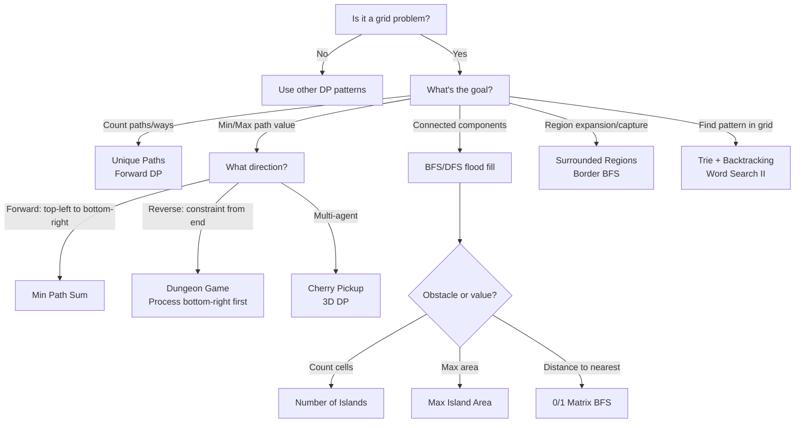
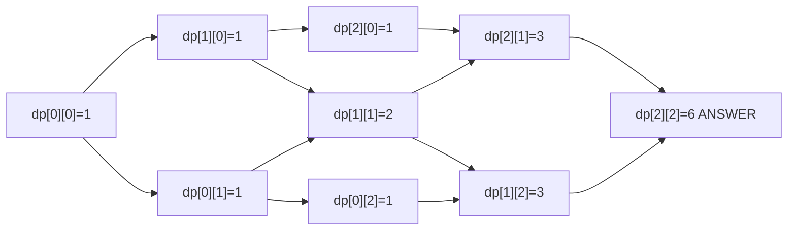
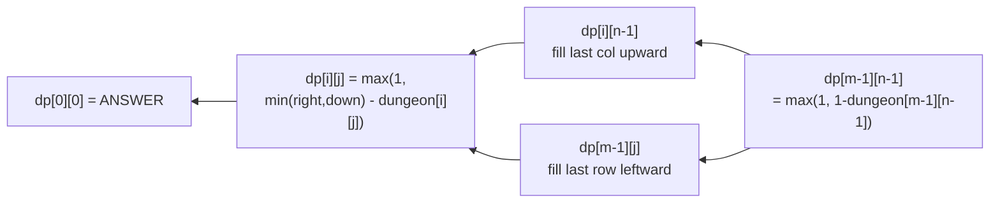
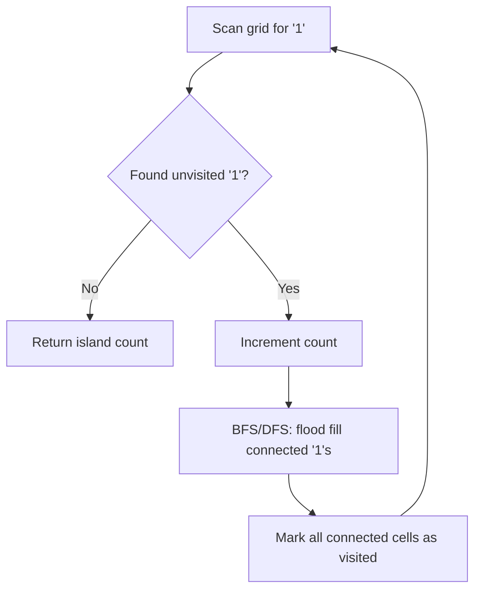

# Grid & 2D DP: Pattern Recognition & Decision Flowchart

A comprehensive guide to solving problems on 2D grids using dynamic programming and graph traversal. Grid problems involve filling or analyzing a 2D array with specific patterns, constraints, and traversal strategies.

---

## Understanding Grid DP

Grid DP involves solving problems on m×n 2D arrays where:
- **State**: `dp[i][j]` represents the optimal solution for the subgrid from `(0,0)` to `(i,j)`
- **Transition**: Each cell's value depends on neighbors (typically top and left for forward DP, bottom and right for reverse)
- **Key constraint**: Grid dimensions and movement rules (4-directional, only right/down, etc.)

---

## Grid Problem Patterns



---

## Universal Grid DP Template

```python
def grid_dp(grid):
    m, n = len(grid), len(grid[0])
    dp = [[0] * n for _ in range(m)]

    # Initialize first cell
    dp[0][0] = grid[0][0]

    # Fill first row
    for j in range(1, n):
        dp[0][j] = dp[0][j-1] + grid[0][j]  # adapt per problem

    # Fill first column
    for i in range(1, m):
        dp[i][0] = dp[i-1][0] + grid[i][0]  # adapt per problem

    # Fill rest of table
    for i in range(1, m):
        for j in range(1, n):
            dp[i][j] = combine(dp[i-1][j], dp[i][j-1], grid[i][j])

    return dp[m-1][n-1]
```

---

## 1. Unique Paths

**Problem:** Count paths in an m×n grid moving only right or down.

### DP State Visualization (3×3 grid)

```
dp[i][j] = number of ways to reach (i,j) from (0,0)

Step 1: Init row 0 and col 0 = 1 (only one direction possible)

  1  1  1
  1  0  0
  1  0  0

Step 2: Fill cell (1,1) = dp[0][1] + dp[1][0] = 1+1 = 2

  1  1  1
  1  2  0
  1  0  0

Step 3: Fill rest:

  1  1  1
  1  2  3
  1  3  6   <- Answer: 6 unique paths
```



### Python Implementation

```python
def unique_paths(m: int, n: int) -> int:
    """
    Count paths in m x n grid moving only right or down.
    Time: O(m*n), Space: O(m*n) standard / O(n) optimized
    """
    # Standard 2D DP
    dp = [[1] * n for _ in range(m)]
    for i in range(1, m):
        for j in range(1, n):
            dp[i][j] = dp[i-1][j] + dp[i][j-1]
    return dp[m-1][n-1]


def unique_paths_space_optimized(m: int, n: int) -> int:
    """
    Space-optimized: keep only one row.
    Time: O(m*n), Space: O(n)
    Key insight: dp[i][j] only needs dp[i-1][j] (above) and dp[i][j-1] (left in current row)
    """
    dp = [1] * n
    for i in range(1, m):
        for j in range(1, n):
            dp[j] += dp[j-1]  # dp[j] = old dp[j] (from above) + dp[j-1] (from left)
    return dp[n-1]


def unique_paths_with_obstacles(obstacle_grid: list[list[int]]) -> int:
    """
    Unique Paths II: grid has obstacles (1=blocked, 0=open).
    Time: O(m*n), Space: O(n)
    """
    m, n = len(obstacle_grid), len(obstacle_grid[0])
    if obstacle_grid[0][0] == 1 or obstacle_grid[m-1][n-1] == 1:
        return 0

    dp = [0] * n
    dp[0] = 1
    for i in range(m):
        for j in range(n):
            if obstacle_grid[i][j] == 1:
                dp[j] = 0
            elif j > 0:
                dp[j] += dp[j-1]
    return dp[n-1]
```

### Java Implementation

```java
public class UniquePaths {
    public int uniquePaths(int m, int n) {
        int[] dp = new int[n];
        Arrays.fill(dp, 1);
        for (int i = 1; i < m; i++) {
            for (int j = 1; j < n; j++) {
                dp[j] += dp[j-1];
            }
        }
        return dp[n-1];
    }

    public int uniquePathsWithObstacles(int[][] obstacleGrid) {
        int m = obstacleGrid.length, n = obstacleGrid[0].length;
        if (obstacleGrid[0][0] == 1 || obstacleGrid[m-1][n-1] == 1) return 0;
        int[] dp = new int[n];
        dp[0] = 1;
        for (int i = 0; i < m; i++) {
            for (int j = 0; j < n; j++) {
                if (obstacleGrid[i][j] == 1) dp[j] = 0;
                else if (j > 0) dp[j] += dp[j-1];
            }
        }
        return dp[n-1];
    }
}
```

**Complexity:** Time O(m*n), Space O(n) with optimization.

---

## 2. Minimum Path Sum

**Problem:** Find path from top-left to bottom-right with minimum sum. Can move only right or down.

### DP State Visualization

```
Grid:
  1  3  1
  1  5  1
  4  2  1

dp[i][j] = min cost to reach (i,j)

Init:
  1  4  5
  2  0  0
  6  0  0

After filling:
  1  4  5
  2  7  6
  6  8  7   <- Answer: 7 (path: 1->3->1->1->1)
```

### Python Implementation

```python
def min_path_sum(grid: list[list[int]]) -> int:
    """
    Find minimum cost path from top-left to bottom-right.
    Time: O(m*n), Space: O(1) by modifying grid in-place.
    """
    m, n = len(grid), len(grid[0])

    # Fill first row
    for j in range(1, n):
        grid[0][j] += grid[0][j-1]

    # Fill first column
    for i in range(1, m):
        grid[i][0] += grid[i-1][0]

    # Fill rest
    for i in range(1, m):
        for j in range(1, n):
            grid[i][j] += min(grid[i-1][j], grid[i][j-1])

    return grid[m-1][n-1]
```

### Java Implementation

```java
public class MinPathSum {
    public int minPathSum(int[][] grid) {
        int m = grid.length, n = grid[0].length;
        for (int i = 0; i < m; i++) {
            for (int j = 0; j < n; j++) {
                if (i == 0 && j == 0) continue;
                else if (i == 0) grid[i][j] += grid[i][j-1];
                else if (j == 0) grid[i][j] += grid[i-1][j];
                else grid[i][j] += Math.min(grid[i-1][j], grid[i][j-1]);
            }
        }
        return grid[m-1][n-1];
    }
}
```

---

## 3. Dungeon Game

**Problem:** Knight starts at top-left, must reach bottom-right. Each cell has a value (positive = gain health, negative = lose). Find minimum initial health needed. Knight dies if health <= 0.

### Why Reverse DP?

```
Forward DP fails: we can't decide if picking a high-value early cell is worth it
without knowing future costs. We need to work backwards from the destination.

Dungeon:
  -2  -3   3
  -5 -10   1
  10  30  -5

dp[i][j] = minimum health needed when entering cell (i,j)

Process bottom-right to top-left:
  dp[2][2] = max(1, 1 - (-5)) = max(1, 6) = 6
  dp[2][1] = max(1, 6 - 30) = max(1, -24) = 1
  dp[2][0] = max(1, 1 - 10) = max(1, -9) = 1
  dp[1][2] = max(1, 6 - 1) = max(1, 5) = 5
  dp[1][1] = max(1, min(dp[1][2], dp[2][1]) - (-10)) = max(1, min(5,1)+10) = 11
  dp[1][0] = max(1, min(dp[1][1], dp[2][0]) - (-5)) = max(1, min(11,1)+5) = 6
  dp[0][2] = max(1, 5 - 3) = max(1, 2) = 2
  dp[0][1] = max(1, min(dp[0][2], dp[1][1]) - (-3)) = max(1, 2+3) = 5
  dp[0][0] = max(1, min(dp[0][1], dp[1][0]) - (-2)) = max(1, min(5,6)+2) = 7

Answer: 7 minimum initial health
```



### Python Implementation

```python
def calculate_minimum_hp(dungeon: list[list[int]]) -> int:
    """
    Dungeon Game: minimum initial health to reach bottom-right.
    Key: process in reverse (bottom-right to top-left).
    Time: O(m*n), Space: O(m*n) -> can optimize to O(n)
    """
    m, n = len(dungeon), len(dungeon[0])
    dp = [[0] * n for _ in range(m)]

    # Base case: bottom-right cell
    dp[m-1][n-1] = max(1, 1 - dungeon[m-1][n-1])

    # Fill last row (can only go right -> process leftward)
    for j in range(n-2, -1, -1):
        dp[m-1][j] = max(1, dp[m-1][j+1] - dungeon[m-1][j])

    # Fill last column (can only go down -> process upward)
    for i in range(m-2, -1, -1):
        dp[i][n-1] = max(1, dp[i+1][n-1] - dungeon[i][n-1])

    # Fill rest (bottom-right to top-left)
    for i in range(m-2, -1, -1):
        for j in range(n-2, -1, -1):
            min_health_on_exit = min(dp[i+1][j], dp[i][j+1])
            dp[i][j] = max(1, min_health_on_exit - dungeon[i][j])

    return dp[0][0]
```

### Java Implementation

```java
public class DungeonGame {
    public int calculateMinimumHP(int[][] dungeon) {
        int m = dungeon.length, n = dungeon[0].length;
        int[][] dp = new int[m][n];

        dp[m-1][n-1] = Math.max(1, 1 - dungeon[m-1][n-1]);

        for (int j = n-2; j >= 0; j--)
            dp[m-1][j] = Math.max(1, dp[m-1][j+1] - dungeon[m-1][j]);

        for (int i = m-2; i >= 0; i--)
            dp[i][n-1] = Math.max(1, dp[i+1][n-1] - dungeon[i][n-1]);

        for (int i = m-2; i >= 0; i--) {
            for (int j = n-2; j >= 0; j--) {
                int minExit = Math.min(dp[i+1][j], dp[i][j+1]);
                dp[i][j] = Math.max(1, minExit - dungeon[i][j]);
            }
        }
        return dp[0][0];
    }
}
```

---

## 4. Maximal Square

**Problem:** Find the largest square containing only 1s in a binary matrix.

### DP Transition Insight

```
dp[i][j] = side length of largest square whose bottom-right corner is (i,j)

Transition: if matrix[i][j] == '1':
  dp[i][j] = min(dp[i-1][j], dp[i][j-1], dp[i-1][j-1]) + 1

Intuition: A 2x2 square needs all 4 corners. The limiting factor is
           the smallest square among top, left, and diagonal.

Matrix:
  1 0 1 0 0
  1 0 1 1 1
  1 1 1 1 1
  1 0 0 1 0

DP table:
  1 0 1 0 0
  1 0 1 1 1
  1 1 1 2 2
  1 0 0 1 0

Max value = 2, so largest square has side 2, area = 4.
```

### Python Implementation

```python
def maximal_square(matrix: list[list[str]]) -> int:
    """
    Find the area of the largest square of 1s.
    Time: O(m*n), Space: O(m*n) -> optimizable to O(n)
    """
    if not matrix:
        return 0
    m, n = len(matrix), len(matrix[0])
    dp = [[0] * n for _ in range(m)]
    max_side = 0

    for i in range(m):
        for j in range(n):
            if matrix[i][j] == '1':
                if i == 0 or j == 0:
                    dp[i][j] = 1
                else:
                    dp[i][j] = min(dp[i-1][j], dp[i][j-1], dp[i-1][j-1]) + 1
                max_side = max(max_side, dp[i][j])

    return max_side * max_side


def maximal_square_space_optimized(matrix: list[list[str]]) -> int:
    """
    Space-optimized version using single row + prev variable.
    Time: O(m*n), Space: O(n)
    """
    if not matrix:
        return 0
    m, n = len(matrix), len(matrix[0])
    dp = [0] * (n + 1)
    max_side = 0
    prev = 0  # tracks dp[i-1][j-1]

    for i in range(1, m + 1):
        for j in range(1, n + 1):
            temp = dp[j]
            if matrix[i-1][j-1] == '1':
                dp[j] = min(dp[j], dp[j-1], prev) + 1
                max_side = max(max_side, dp[j])
            else:
                dp[j] = 0
            prev = temp

    return max_side * max_side
```

### Java Implementation

```java
public class MaximalSquare {
    public int maximalSquare(char[][] matrix) {
        int m = matrix.length, n = matrix[0].length;
        int[] dp = new int[n + 1];
        int maxSide = 0, prev = 0;

        for (int i = 1; i <= m; i++) {
            for (int j = 1; j <= n; j++) {
                int temp = dp[j];
                if (matrix[i-1][j-1] == '1') {
                    dp[j] = Math.min(Math.min(dp[j], dp[j-1]), prev) + 1;
                    maxSide = Math.max(maxSide, dp[j]);
                } else {
                    dp[j] = 0;
                }
                prev = temp;
            }
        }
        return maxSide * maxSide;
    }
}
```

---

## 5. Number of Islands

**Problem:** Count distinct islands (connected regions of '1') in a binary grid.

### BFS vs DFS Comparison

```
Grid:
  1 1 0 0 0
  1 1 0 0 0
  0 0 1 0 0
  0 0 0 1 1

DFS from (0,0): marks (0,0),(0,1),(1,0),(1,1) as visited -> island 1
Next unvisited '1': (2,2) -> marks (2,2) -> island 2
Next unvisited '1': (3,3) -> marks (3,3),(3,4) -> island 3

Answer: 3 islands
```



### Python Implementation

```python
from collections import deque

def num_islands_dfs(grid: list[list[str]]) -> int:
    """
    Number of Islands using DFS.
    Time: O(m*n), Space: O(m*n) worst case for recursion stack.
    """
    if not grid:
        return 0
    m, n = len(grid), len(grid[0])
    count = 0

    def dfs(r: int, c: int):
        if r < 0 or r >= m or c < 0 or c >= n or grid[r][c] != '1':
            return
        grid[r][c] = '0'  # mark as visited
        dfs(r+1, c); dfs(r-1, c); dfs(r, c+1); dfs(r, c-1)

    for r in range(m):
        for c in range(n):
            if grid[r][c] == '1':
                count += 1
                dfs(r, c)
    return count


def num_islands_bfs(grid: list[list[str]]) -> int:
    """
    Number of Islands using BFS (avoids recursion stack issues).
    Time: O(m*n), Space: O(min(m,n)) for queue.
    """
    if not grid:
        return 0
    m, n = len(grid), len(grid[0])
    count = 0

    for r in range(m):
        for c in range(n):
            if grid[r][c] == '1':
                count += 1
                queue = deque([(r, c)])
                grid[r][c] = '0'
                while queue:
                    row, col = queue.popleft()
                    for dr, dc in [(1,0),(-1,0),(0,1),(0,-1)]:
                        nr, nc = row+dr, col+dc
                        if 0 <= nr < m and 0 <= nc < n and grid[nr][nc] == '1':
                            grid[nr][nc] = '0'
                            queue.append((nr, nc))
    return count
```

### Java Implementation

```java
import java.util.*;

public class NumberOfIslands {
    public int numIslands(char[][] grid) {
        int m = grid.length, n = grid[0].length, count = 0;
        for (int r = 0; r < m; r++) {
            for (int c = 0; c < n; c++) {
                if (grid[r][c] == '1') {
                    count++;
                    bfs(grid, r, c, m, n);
                }
            }
        }
        return count;
    }

    private void bfs(char[][] grid, int r, int c, int m, int n) {
        Queue<int[]> queue = new LinkedList<>();
        queue.offer(new int[]{r, c});
        grid[r][c] = '0';
        int[][] dirs = {{1,0},{-1,0},{0,1},{0,-1}};
        while (!queue.isEmpty()) {
            int[] cell = queue.poll();
            for (int[] d : dirs) {
                int nr = cell[0] + d[0], nc = cell[1] + d[1];
                if (nr >= 0 && nr < m && nc >= 0 && nc < n && grid[nr][nc] == '1') {
                    grid[nr][nc] = '0';
                    queue.offer(new int[]{nr, nc});
                }
            }
        }
    }
}
```

---

## 6. Surrounded Regions

**Problem:** Capture all regions of 'O' that are surrounded by 'X' (not connected to border).

### Key Insight: Border BFS

```
Grid:
  X X X X
  X O O X
  X X O X
  X O X X

Step 1: BFS from all border 'O' cells, mark connected 'O' as safe ('S')
  Border cells: none that are 'O' connected to safe zone in this example
  Actually (3,1) is border -> mark safe
  Check: (3,1)='O' is on border -> mark as 'S'
  BFS from (3,1): neighbors... all X

Step 2: Replace remaining 'O' with 'X', restore 'S' back to 'O'
  (1,1),(1,2),(2,2) were 'O' not connected to border -> become 'X'
  (3,1) was 'S' -> becomes 'O'

Result:
  X X X X
  X X X X
  X X X X
  X O X X
```

### Python Implementation

```python
def solve_surrounded_regions(board: list[list[str]]) -> None:
    """
    Capture all 'O' regions surrounded by 'X'. Modify in-place.
    Time: O(m*n), Space: O(m*n) for BFS queue.
    """
    if not board:
        return
    m, n = len(board), len(board[0])
    queue = deque()

    # Find all border 'O' cells
    for r in range(m):
        for c in range(n):
            if (r == 0 or r == m-1 or c == 0 or c == n-1) and board[r][c] == 'O':
                queue.append((r, c))
                board[r][c] = 'S'  # safe

    # BFS to mark all 'O' connected to border as safe
    while queue:
        r, c = queue.popleft()
        for dr, dc in [(1,0),(-1,0),(0,1),(0,-1)]:
            nr, nc = r+dr, c+dc
            if 0 <= nr < m and 0 <= nc < n and board[nr][nc] == 'O':
                board[nr][nc] = 'S'
                queue.append((nr, nc))

    # Restore: 'O' -> 'X' (captured), 'S' -> 'O' (safe)
    for r in range(m):
        for c in range(n):
            if board[r][c] == 'O':
                board[r][c] = 'X'
            elif board[r][c] == 'S':
                board[r][c] = 'O'
```

### Java Implementation

```java
public class SurroundedRegions {
    public void solve(char[][] board) {
        if (board == null || board.length == 0) return;
        int m = board.length, n = board[0].length;
        Queue<int[]> queue = new LinkedList<>();

        for (int r = 0; r < m; r++) {
            for (int c = 0; c < n; c++) {
                if ((r == 0 || r == m-1 || c == 0 || c == n-1) && board[r][c] == 'O') {
                    board[r][c] = 'S';
                    queue.offer(new int[]{r, c});
                }
            }
        }

        int[][] dirs = {{1,0},{-1,0},{0,1},{0,-1}};
        while (!queue.isEmpty()) {
            int[] cell = queue.poll();
            for (int[] d : dirs) {
                int nr = cell[0]+d[0], nc = cell[1]+d[1];
                if (nr >= 0 && nr < m && nc >= 0 && nc < n && board[nr][nc] == 'O') {
                    board[nr][nc] = 'S';
                    queue.offer(new int[]{nr, nc});
                }
            }
        }

        for (int r = 0; r < m; r++)
            for (int c = 0; c < n; c++)
                board[r][c] = board[r][c] == 'O' ? 'X' : (board[r][c] == 'S' ? 'O' : board[r][c]);
    }
}
```

---

## 7. 0/1 Matrix (Distance to Nearest Zero)

**Problem:** For each cell, find distance to nearest 0. Use multi-source BFS starting from all zeros simultaneously.

### Why Multi-Source BFS?

```
Matrix:
  0 0 0
  0 1 0
  1 1 1

Multi-source BFS: start from ALL zeros at once (level 0)
Level 0: enqueue (0,0),(0,1),(0,2),(1,0),(1,2)
Level 1: process level 0, update neighbors:
  (1,1) gets distance 1 (neighbor of (1,0) or (0,1))
  (2,0) gets distance 1 (neighbor of (1,0))
  (2,2) gets distance 1 (neighbor of (1,2))
Level 2: process level 1 cells:
  (2,1) gets distance 2 (neighbor of (2,0) or (2,2))

Result:
  0 0 0
  0 1 0
  1 2 1
```

### Python Implementation

```python
def update_matrix(mat: list[list[int]]) -> list[list[int]]:
    """
    Find distance to nearest 0 for each cell.
    Multi-source BFS from all zeros simultaneously.
    Time: O(m*n), Space: O(m*n)
    """
    m, n = len(mat), len(mat[0])
    dist = [[float('inf')] * n for _ in range(m)]
    queue = deque()

    # Seed BFS with all zero cells
    for r in range(m):
        for c in range(n):
            if mat[r][c] == 0:
                dist[r][c] = 0
                queue.append((r, c))

    while queue:
        r, c = queue.popleft()
        for dr, dc in [(1,0),(-1,0),(0,1),(0,-1)]:
            nr, nc = r+dr, c+dc
            if 0 <= nr < m and 0 <= nc < n:
                if dist[r][c] + 1 < dist[nr][nc]:
                    dist[nr][nc] = dist[r][c] + 1
                    queue.append((nr, nc))
    return dist
```

### Java Implementation

```java
public class ZeroOneMatrix {
    public int[][] updateMatrix(int[][] mat) {
        int m = mat.length, n = mat[0].length;
        int[][] dist = new int[m][n];
        Queue<int[]> queue = new LinkedList<>();

        for (int r = 0; r < m; r++) {
            for (int c = 0; c < n; c++) {
                if (mat[r][c] == 0) {
                    dist[r][c] = 0;
                    queue.offer(new int[]{r, c});
                } else {
                    dist[r][c] = Integer.MAX_VALUE;
                }
            }
        }

        int[][] dirs = {{1,0},{-1,0},{0,1},{0,-1}};
        while (!queue.isEmpty()) {
            int[] cell = queue.poll();
            for (int[] d : dirs) {
                int nr = cell[0]+d[0], nc = cell[1]+d[1];
                if (nr >= 0 && nr < m && nc >= 0 && nc < n &&
                    dist[cell[0]][cell[1]] + 1 < dist[nr][nc]) {
                    dist[nr][nc] = dist[cell[0]][cell[1]] + 1;
                    queue.offer(new int[]{nr, nc});
                }
            }
        }
        return dist;
    }
}
```

---

## 8. Bomb Enemy

**Problem:** Place a bomb to kill maximum enemies. Bomb kills in its row and column until hitting a wall ('W'). Return max kills.

### Precomputation Strategy

```
Grid:
  0 E 0 0
  E 0 W E
  0 E 0 0

For each empty cell, we need:
  row_hits[r][c] = enemies killed in row r from cell c
  col_hits[r][c] = enemies killed in col c from cell r

Optimization: Compute row_hits and col_hits with prefix logic.
  Row pass: when hitting a wall or start, reset counter and scan forward.
  Column pass: same but vertically.

Row hits (sweeping right from each W-separated segment):
  Row 0: [0,E,0,0] = [1,1,1,1] (whole row, no W)
  Row 1: [E,0|W|E] = [2,2 | 0 | 1] -> rowH = [2,2,0,1]
  Row 2: [0,E,0,0] = [1,1,1,1]

Col hits computed similarly.

For each empty cell (r,c): score = rowH[r][c] + colH[r][c]
```

### Python Implementation

```python
def max_killed_enemies(grid: list[list[str]]) -> int:
    """
    Bomb Enemy: find cell to place bomb for max enemy kills.
    Time: O(m*n), Space: O(m*n) for precomputed arrays.
    """
    if not grid:
        return 0
    m, n = len(grid), len(grid[0])
    row_hits = [[0] * n for _ in range(m)]
    col_hits = [[0] * n for _ in range(m)]

    # Compute row hits: scan left to right, reset at walls
    for r in range(m):
        count = 0
        # Right pass: fill from current wall segment
        for c in range(n):
            if grid[r][c] == 'W':
                count = 0
            elif grid[r][c] == 'E':
                count += 1
            row_hits[r][c] = count  # temporary
        # Now we need correct values: scan and assign
        # Better approach: for each cell, count in its segment
    
    # Cleaner implementation: for each row, scan segments between walls
    for r in range(m):
        for c in range(n):
            if grid[r][c] != 'W':
                # Count enemies in this row for cell c
                kills = 0
                for k in range(n):
                    if grid[r][k] == 'W':
                        if k < c:
                            kills = 0
                    elif grid[r][k] == 'E':
                        if k <= c:  # track left enemies up to c
                            pass
                # Simpler: precompute per segment
        
    # Clean precomputation using segment approach
    def compute_row_col():
        rh = [[0]*n for _ in range(m)]
        ch = [[0]*n for _ in range(m)]
        
        for r in range(m):
            # Scan each segment (separated by walls)
            c = 0
            while c < n:
                if grid[r][c] == 'W':
                    c += 1
                    continue
                # Count enemies in this segment
                seg_start = c
                enemies = 0
                while c < n and grid[r][c] != 'W':
                    if grid[r][c] == 'E':
                        enemies += 1
                    c += 1
                # Assign to all cells in segment
                for k in range(seg_start, c):
                    rh[r][k] = enemies
        
        for col in range(n):
            r = 0
            while r < m:
                if grid[r][col] == 'W':
                    r += 1
                    continue
                seg_start = r
                enemies = 0
                while r < m and grid[r][col] != 'W':
                    if grid[r][col] == 'E':
                        enemies += 1
                    r += 1
                for k in range(seg_start, r):
                    ch[k][col] = enemies
        
        return rh, ch
    
    rh, ch = compute_row_col()
    max_kills = 0
    for r in range(m):
        for c in range(n):
            if grid[r][c] == '0':
                max_kills = max(max_kills, rh[r][c] + ch[r][c])
    return max_kills
```

### Java Implementation

```java
public class BombEnemy {
    public int maxKilledEnemies(char[][] grid) {
        if (grid == null || grid.length == 0) return 0;
        int m = grid.length, n = grid[0].length;
        int[][] rh = new int[m][n], ch = new int[m][n];

        // Row precomputation
        for (int r = 0; r < m; r++) {
            int c = 0;
            while (c < n) {
                if (grid[r][c] == 'W') { c++; continue; }
                int start = c, enemies = 0;
                while (c < n && grid[r][c] != 'W') {
                    if (grid[r][c] == 'E') enemies++;
                    c++;
                }
                for (int k = start; k < c; k++) rh[r][k] = enemies;
            }
        }

        // Column precomputation
        for (int col = 0; col < n; col++) {
            int r = 0;
            while (r < m) {
                if (grid[r][col] == 'W') { r++; continue; }
                int start = r, enemies = 0;
                while (r < m && grid[r][col] != 'W') {
                    if (grid[r][col] == 'E') enemies++;
                    r++;
                }
                for (int k = start; k < r; k++) ch[k][col] = enemies;
            }
        }

        int max = 0;
        for (int r = 0; r < m; r++)
            for (int c = 0; c < n; c++)
                if (grid[r][c] == '0')
                    max = Math.max(max, rh[r][c] + ch[r][c]);
        return max;
    }
}
```

---

## 9. Cherry Pickup (3D DP)

**Problem:** Two people traverse n×n grid from (0,0) to (n-1,n-1) and back, collecting cherries. Both move simultaneously (modeled as two people going top-to-bottom). Maximize total cherries.

### 3D DP State Design

```
State: dp[t][r1][r2] where t = step number (0..2n-2)
  r1 = row of person 1 (c1 = t - r1)
  r2 = row of person 2 (c2 = t - r2)

Transition: for each step t, person 1 moves (dr1) and person 2 moves (dr2)
  where each move is {stay-in-row going right (0), go down (1)}

Both persons collect cherries at their cell, but if r1==r2, only count once.

Recurrence:
  dp[t+1][r1+dr1][r2+dr2] = max(
    dp[t][r1][r2] + cherry(r1, t-r1) + (r1!=r2 ? cherry(r2, t-r2) : 0)
  )

Space optimization: use two 2D arrays (current and previous step).
```

### Python Implementation

```python
def cherry_pickup(grid: list[list[int]]) -> int:
    """
    Cherry Pickup: two simultaneous paths top-left to bottom-right.
    Simulate as two people walking down together, step t means r1+c1 = t.
    Time: O(n^3), Space: O(n^2)
    """
    n = len(grid)
    NEG_INF = float('-inf')

    # dp[r1][r2] = max cherries when person1 is at row r1, person2 at row r2
    # Both at same step t means c1 = t - r1, c2 = t - r2
    dp = [[NEG_INF] * n for _ in range(n)]
    dp[0][0] = grid[0][0]

    for t in range(1, 2 * n - 1):
        ndp = [[NEG_INF] * n for _ in range(n)]
        for r1 in range(max(0, t - (n-1)), min(n, t+1)):
            c1 = t - r1
            if c1 < 0 or c1 >= n or grid[r1][c1] == -1:
                continue
            for r2 in range(r1, min(n, t+1)):  # r2 >= r1 by symmetry
                c2 = t - r2
                if c2 < 0 or c2 >= n or grid[r2][c2] == -1:
                    continue
                # Collect cherries (count once if same cell)
                cherries = grid[r1][c1]
                if r1 != r2:
                    cherries += grid[r2][c2]
                # Try all 4 combinations of previous positions
                best = NEG_INF
                for dr1 in (0, 1):
                    for dr2 in (0, 1):
                        pr1, pr2 = r1 - dr1, r2 - dr2
                        if 0 <= pr1 < n and 0 <= pr2 < n and dp[pr1][pr2] != NEG_INF:
                            best = max(best, dp[pr1][pr2])
                if best != NEG_INF:
                    ndp[r1][r2] = max(ndp[r1][r2], best + cherries)
        dp = ndp

    return max(0, dp[n-1][n-1])
```

### Java Implementation

```java
public class CherryPickup {
    public int cherryPickup(int[][] grid) {
        int n = grid.length;
        int[][] dp = new int[n][n];
        for (int[] row : dp) Arrays.fill(row, Integer.MIN_VALUE);
        dp[0][0] = grid[0][0];

        for (int t = 1; t < 2*n-1; t++) {
            int[][] ndp = new int[n][n];
            for (int[] row : ndp) Arrays.fill(row, Integer.MIN_VALUE);
            for (int r1 = Math.max(0, t-(n-1)); r1 < Math.min(n, t+1); r1++) {
                int c1 = t - r1;
                if (c1 < 0 || c1 >= n || grid[r1][c1] == -1) continue;
                for (int r2 = r1; r2 < Math.min(n, t+1); r2++) {
                    int c2 = t - r2;
                    if (c2 < 0 || c2 >= n || grid[r2][c2] == -1) continue;
                    int cherries = grid[r1][c1] + (r1 != r2 ? grid[r2][c2] : 0);
                    int best = Integer.MIN_VALUE;
                    for (int dr1 = 0; dr1 <= 1; dr1++)
                        for (int dr2 = 0; dr2 <= 1; dr2++) {
                            int pr1 = r1-dr1, pr2 = r2-dr2;
                            if (pr1 >= 0 && pr2 >= 0 && dp[pr1][pr2] != Integer.MIN_VALUE)
                                best = Math.max(best, dp[pr1][pr2]);
                        }
                    if (best != Integer.MIN_VALUE)
                        ndp[r1][r2] = Math.max(ndp[r1][r2], best + cherries);
                }
            }
            dp = ndp;
        }
        return Math.max(0, dp[n-1][n-1]);
    }
}
```

**Complexity:** Time O(n^3), Space O(n^2). The insight is reducing 4D state (r1,c1,r2,c2) to 3D using t=r1+c1=r2+c2.

---

## 10. Word Search II (Trie + Backtracking)

**Problem:** Given a board and a list of words, find all words that exist in the board.

### Trie Optimization

```
Naive approach: run Word Search I for each word -> O(W * N*M * 4^L)
Trie approach: build Trie of all words, then one backtracking pass -> O(N*M * 4^L)

Build Trie:
  words = ["oath","pea","eat","rain"]
  Trie nodes: root -> {o,p,e,r} -> ...

During backtracking from each cell:
  Follow Trie path with board letters
  When we reach a word-end node, record the word
  Optimization: remove words from Trie as found (prevents duplicates)
```

### Python Implementation

```python
def find_words(board: list[list[str]], words: list[str]) -> list[str]:
    """
    Word Search II: find all words from list that exist in board.
    Time: O(M*N*4^L + W*L) where L=max word length, W=num words.
    Space: O(W*L) for Trie.
    """
    # Build Trie
    trie = {}
    for word in words:
        node = trie
        for ch in word:
            node = node.setdefault(ch, {})
        node['#'] = word  # store word at end

    m, n = len(board), len(board[0])
    results = []

    def backtrack(r: int, c: int, node: dict):
        ch = board[r][c]
        if ch not in node:
            return
        next_node = node[ch]
        if '#' in next_node:
            results.append(next_node['#'])
            del next_node['#']  # avoid duplicates

        board[r][c] = '#'  # mark visited
        for dr, dc in [(1,0),(-1,0),(0,1),(0,-1)]:
            nr, nc = r+dr, c+dc
            if 0 <= nr < m and 0 <= nc < n and board[nr][nc] != '#':
                backtrack(nr, nc, next_node)
        board[r][c] = ch  # restore

        # Prune: remove empty Trie nodes (optimization)
        if not next_node:
            del node[ch]

    for r in range(m):
        for c in range(n):
            backtrack(r, c, trie)

    return results
```

### Java Implementation

```java
import java.util.*;

public class WordSearchII {
    private int[][] dirs = {{1,0},{-1,0},{0,1},{0,-1}};
    private List<String> result = new ArrayList<>();

    class TrieNode {
        TrieNode[] children = new TrieNode[26];
        String word = null;
    }

    public List<String> findWords(char[][] board, String[] words) {
        TrieNode root = new TrieNode();
        for (String w : words) {
            TrieNode node = root;
            for (char c : w.toCharArray()) {
                int idx = c - 'a';
                if (node.children[idx] == null) node.children[idx] = new TrieNode();
                node = node.children[idx];
            }
            node.word = w;
        }

        for (int r = 0; r < board.length; r++)
            for (int c = 0; c < board[0].length; c++)
                dfs(board, r, c, root);

        return result;
    }

    private void dfs(char[][] board, int r, int c, TrieNode node) {
        char ch = board[r][c];
        if (ch == '#' || node.children[ch - 'a'] == null) return;
        TrieNode next = node.children[ch - 'a'];
        if (next.word != null) {
            result.add(next.word);
            next.word = null;
        }
        board[r][c] = '#';
        for (int[] d : dirs) {
            int nr = r+d[0], nc = c+d[1];
            if (nr >= 0 && nr < board.length && nc >= 0 && nc < board[0].length)
                dfs(board, nr, nc, next);
        }
        board[r][c] = ch;
    }
}
```

---

## Complexity Summary

| Algorithm | Time | Space | Technique |
|-----------|------|-------|-----------|
| Unique Paths | O(m*n) | O(n) | Forward DP, space opt |
| Minimum Path Sum | O(m*n) | O(1) | In-place DP |
| Dungeon Game | O(m*n) | O(m*n) | Reverse DP |
| Maximal Square | O(m*n) | O(n) | Space-opt DP |
| Number of Islands | O(m*n) | O(m*n) | BFS/DFS flood fill |
| Surrounded Regions | O(m*n) | O(m*n) | Border BFS |
| 0/1 Matrix | O(m*n) | O(m*n) | Multi-source BFS |
| Bomb Enemy | O(m*n) | O(m*n) | Segment precomputation |
| Cherry Pickup | O(n^3) | O(n^2) | 3D DP, synchronous paths |
| Word Search II | O(M*N*4^L) | O(W*L) | Trie + backtracking |

---

## Interview Q&A

**Q1: When should you use reverse DP (process end to start)?**

A: Use reverse DP when constraints propagate backwards — i.e., the validity or cost of a choice depends on future states, not past ones. Dungeon Game is the classic example: minimum health at cell (i,j) depends on the health required at the next cell. Forward DP fails because we don't know the "budget" we'll need.

**Q2: How does space optimization work for 2D grid DP?**

A: For problems where `dp[i][j]` only depends on `dp[i-1][j]` (above) and `dp[i][j-1]` (left in same row), we can keep just one row array. Processing left to right, `dp[j]` before update = `dp[i-1][j]`, and `dp[j-1]` after update = `dp[i][j-1]`. For diagonal dependency (Maximal Square), we additionally need a `prev` variable to store `dp[i-1][j-1]`.

**Q3: What is the key insight behind Cherry Pickup's 3D DP reduction?**

A: Both paths start at (0,0) and end at (n-1,n-1). Since each step moves either right or down, after t steps, row + col = t for both persons. So position is fully determined by (t, r1, r2) — we don't need c1 and c2 explicitly (c1 = t - r1, c2 = t - r2). This reduces 4D state to 3D.

**Q4: Why does multi-source BFS work for 0/1 Matrix but not shortest path with weights?**

A: BFS gives shortest path in unweighted graphs because all edges have cost 1. Multi-source BFS seeds the queue with all source nodes (zeros) at distance 0 simultaneously. This is equivalent to adding a virtual source connected to all zeros with cost 0. For weighted grids, use Dijkstra's algorithm instead.

**Q5: What is the Trie pruning optimization in Word Search II?**

A: After finding a word, set its `word` marker to null to prevent reporting it again. After exploring a node completely, if its entire subtree is empty (all words found), remove it from the parent. This prevents revisiting dead branches and is crucial for performance when the word list is large.

**Q6: How do you handle the Surrounded Regions problem without modifying the grid?**

A: Use a Union-Find (DSU) structure. Create a virtual node representing "connected to border". For all border 'O' cells, union them with the virtual node. For all interior 'O' cells, union with their 'O' neighbors. At the end, any 'O' cell not in the same component as the virtual node gets captured.

**Q7: Why does Maximal Square use `min(top, left, diagonal) + 1`?**

A: For a square of side k to have its bottom-right corner at (i,j): the top side requires a square of side k-1 ending at (i-1,j), the left side requires one ending at (i,j-1), and the diagonal requires one ending at (i-1,j-1). All three must accommodate a square of side at least k-1, so we take the minimum and add 1.

**Q8: How would you find the maximum rectangle of 1s in a binary matrix?**

A: Treat each row as the base of a histogram. For each row, compute the height of consecutive 1s in each column. Then apply the "Largest Rectangle in Histogram" algorithm (monotonic stack) on each row's histogram. Time: O(m*n), Space: O(n).

**Q9: What is the difference between BFS and DFS for flood fill problems?**

A: Both work correctly. DFS uses O(area) stack space (recursion), risks stack overflow for large islands. BFS uses O(perimeter) queue space, safer for large grids. DFS is typically simpler to code. For very deep recursion (large grids), prefer BFS or iterative DFS.

**Q10: How do you count distinct islands (not just number)?**

A: During DFS/BFS, record the relative path taken from the starting cell (e.g., "DRDL" for down-right-down-left). Normalize by ensuring canonical form (e.g., always start from (0,0) relative). Add the canonical path to a set. The set size is the number of distinct islands.

---

## Common Mistakes and Pitfalls

1. **Wrong DP direction**: Dungeon Game must process bottom-right to top-left. Drawing the dependency graph first helps.
2. **Off-by-one in boundaries**: When filling first row/column, be careful about base cases.
3. **Modifying grid without restoring**: In backtracking-based problems (Word Search), always restore the cell after recursion.
4. **Forgetting obstacles**: Unique Paths with obstacles must set `dp[i][j] = 0` for blocked cells.
5. **Cherry Pickup symmetry**: Since both persons are symmetric, only compute `r1 <= r2` to avoid double counting.
6. **Multi-source BFS wrong initialization**: All sources must be enqueued BEFORE BFS starts (not discovered during BFS).
7. **Maximal Square diagonal**: Using `dp[i-1][j-1]` after the row/col has been updated — need `prev` variable.
