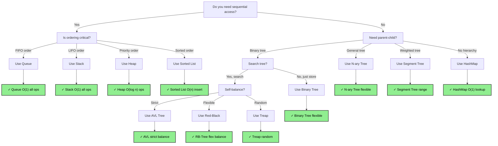
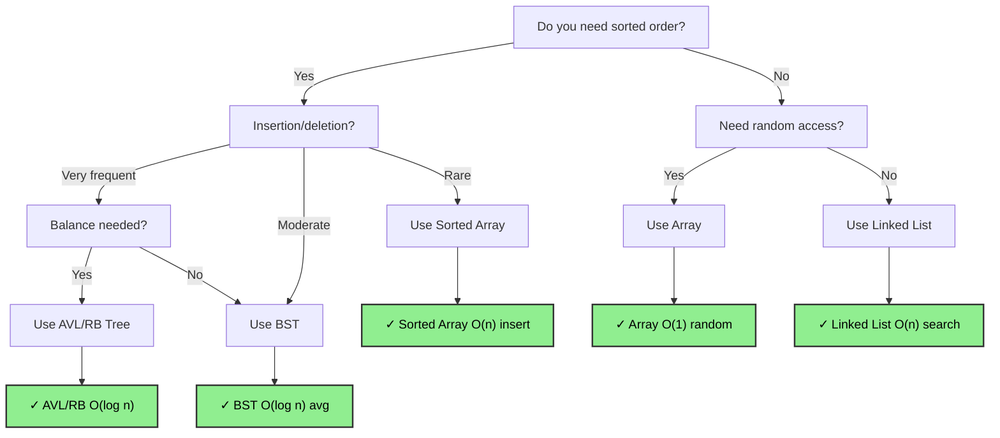
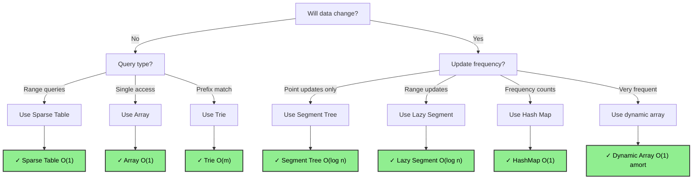
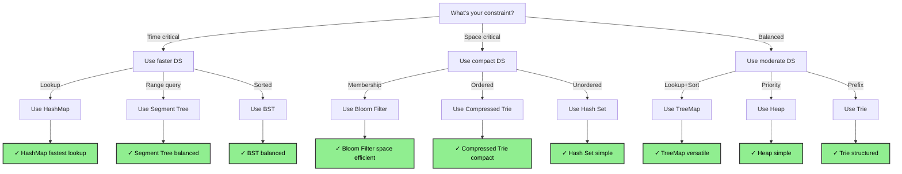
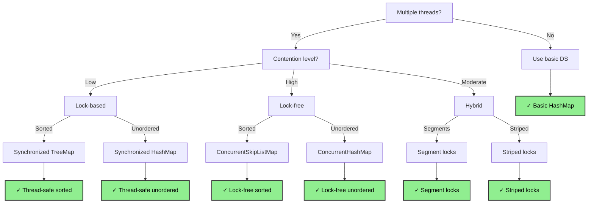
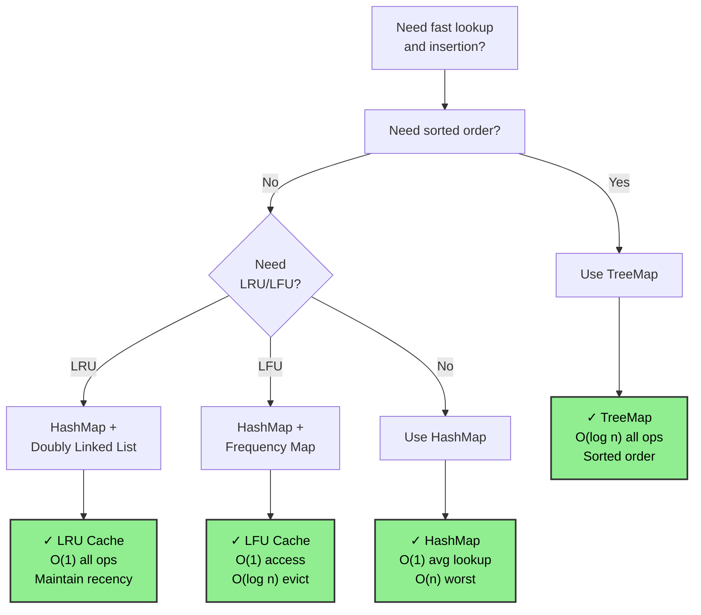
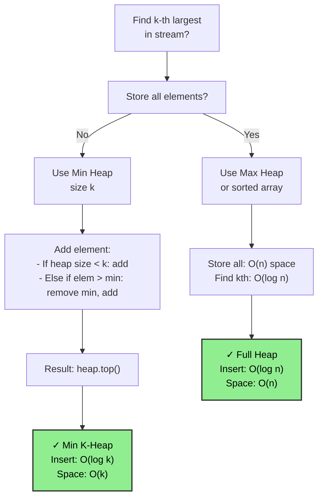

# Data Structure Selection Guide

## How to Use This Guide

When solving an interview problem, use this guide to quickly identify the best data structure for your use case:

1. **Start with the Main Decision Flowchart** below to navigate through your problem characteristics
2. **Check the Quick Decision Table** for common patterns and their recommended DS
3. **Review the Common Interview Scenarios** to see real-world examples similar to your problem
4. **Use complexity analysis** to verify your choice meets time/space constraints

This guide covers fundamental, intermediate, and advanced data structures to help you make optimal choices during interviews.

---

## Main Decision Flowchart (Comprehensive)

```mermaid
graph TD
    A["🎯 START: Data Structure Selection"] --> B["What are you storing?"]
    
    B -->|Key-Value pairs| C["What operations matter most?"]
    B -->|Sorted items| D["Do you need fast insertion/deletion?"]
    B -->|Items with priority| E["Min or Max priority?"]
    B -->|Hierarchical data| F["Need parent/child relationships?"]
    B -->|Network/Graph data| G["What graph operations?"]
    B -->|String data| H["Pattern matching needed?"]
    B -->|Range queries| I["Static or dynamic data?"]
    B -->|Membership testing| J["False positives acceptable?"]
    B -->|Caching/Eviction| K["Eviction policy?"]
    
    C -->|Fast lookup| L["Insertion/deletion?"]
    C -->|Update frequency high| M["Sorted needed?"]
    C -->|Sparse data| N["Use Hash variant"]
    
    L -->|Minimal| O["Use HashMap"]
    L -->|Frequent| M
    
    M -->|Yes| P["Use TreeMap/BST"]
    M -->|No| O
    
    D -->|Yes, balanced| Q["Insertion frequency?"]
    D -->|No, static array| R["Use Sorted Array"]
    
    Q -->|Very high| S["Use AVL Tree"]
    Q -->|Moderate| T["Use Red-Black Tree"]
    Q -->|Few ops| U["Use Skip List"]
    
    E -->|Min priority| V["Size bounded?"]
    E -->|Max priority| W["Size bounded?"]
    
    V -->|Yes, use k-heap| X["Use Min Heap<br/>size k"]
    V -->|No, dynamic| Y["Use Min Heap"]
    
    W -->|Yes, use k-heap| Z["Use Max Heap<br/>size k"]
    W -->|No, dynamic| AA["Use Max Heap"]
    
    F -->|Binary search tree| AB["Self-balance?"]
    F -->|N-ary tree| AC["Use N-ary Tree"]
    F -->|Weighted tree| AD["Use Segment/BIT"]
    
    AB -->|Yes| AE["Use AVL or RB"]
    AB -->|No| AF["Use BST"]
    
    G -->|Shortest path| AG["Weighted?"]
    G -->|Connected components| AH["Use Union Find"]
    G -->|Cycle detection| AI["Directed?"]
    G -->|MST| AJ["Dense or sparse?"]
    G -->|All-pairs distance| AK["Use Floyd-Warshall"]
    G -->|Topological sort| AL["Use DAG+DFS"]
    
    AG -->|Yes, all non-negative| AM["Use Dijkstra"]
    AG -->|Negative weights| AN["Use Bellman-Ford"]
    AG -->|No weights| AO["Use BFS"]
    
    AI -->|Yes| AP["Use DFS recursion"]
    AI -->|No| AQ["Use Union Find"]
    
    AJ -->|Dense| AR["Use Prim"]
    AJ -->|Sparse| AS["Use Kruskal"]
    
    H -->|Prefix matching| AT["Use Trie"]
    H -->|Single pattern| AU["Use KMP"]
    H -->|Multiple patterns| AV["Use Aho-Corasick"]
    H -->|Substring search| AW["Pattern in text?"]
    H -->|Longest palindrome| AX["Use Manacher"]
    
    AW -->|Single| AU
    AW -->|Many| AV
    AW -->|Indexed| AY["Use Suffix Tree"]
    
    I -->|Static, range query| AZ["Use Sparse Table"]
    I -->|Point updates| BA["Use Segment Tree"]
    I -->|Range updates| BB["Use Lazy Segment Tree"]
    I -->|Simple sums| BC["Use Fenwick Tree"]
    
    J -->|Yes, space critical| BD["Use Bloom Filter"]
    J -->|No, exact needed| BE["Use HashMap"]
    J -->|Ordered needed| BF["Use TreeSet"]
    
    K -->|LRU| BG["HashMap + DLL"]
    K -->|LFU| BH["HashMap + Heap"]
    K -->|TTL| BI["HashMap + Heap"]
    K -->|FIFO| BJ["Use Queue"]
    
    O --> BK["✓ HashMap<br/>O(1) avg lookup<br/>O(n) worst"]
    P --> BL["✓ TreeMap<br/>O(log n) all ops<br/>Sorted order"]
    N --> BM["✓ Hash variant<br/>Perfect hashing<br/>Cuckoo hash"]
    R --> BN["✓ Sorted Array<br/>O(log n) search<br/>O(n) insert/delete"]
    S --> BO["✓ AVL Tree<br/>Strict balance<br/>More rotations"]
    T --> BP["✓ RB Tree<br/>Flexible balance<br/>Fewer rotations"]
    U --> BQ["✓ Skip List<br/>Probabilistic<br/>Easy implement"]
    X --> BR["✓ Min K-Heap<br/>O(log k) insert<br/>O(k) space"]
    Y --> BS["✓ Min Heap<br/>O(log n) ops<br/>O(n) space"]
    Z --> BT["✓ Max K-Heap<br/>O(log k) insert<br/>O(k) space"]
    AA --> BU["✓ Max Heap<br/>O(log n) ops<br/>O(n) space"]
    AB --> BV["✓ BST<br/>O(log n) avg<br/>O(n) worst"]
    AC --> BW["✓ N-ary Tree<br/>Multi-child<br/>DFS/BFS"]
    AD --> BX["✓ Segment Tree<br/>Range operations<br/>O(log n) per"]
    AE --> BY["✓ AVL/RB Tree<br/>Self-balancing<br/>Guaranteed O(log n)"]
    AF --> BV
    AM --> BZ["✓ Dijkstra<br/>Priority queue<br/>O(V+E)logV"]
    AN --> CA["✓ Bellman-Ford<br/>Detects negatives<br/>O(VE)"]
    AO --> CB["✓ BFS<br/>Level-order<br/>O(V+E)"]
    AP --> CC["✓ DFS Stack<br/>Recursion<br/>O(V+E)"]
    AQ --> CD["✓ Union Find<br/>Nearly O(1)<br/>Path compression"]
    AR --> CE["✓ Prim Algo<br/>Priority queue<br/>O(E log V)"]
    AS --> CF["✓ Kruskal Algo<br/>Sort edges<br/>O(E log E)"]
    AT --> CG["✓ Trie<br/>O(m) per op<br/>m = length"]
    AU --> CH["✓ KMP<br/>O(n+m) match<br/>No preprocess"]
    AV --> CI["✓ Aho-Corasick<br/>O(n+m+z)<br/>z = matches"]
    AY --> CJ["✓ Suffix Tree<br/>O(n) build<br/>Complex"]
    AX --> CK["✓ Manacher<br/>O(n) palindrome<br/>Clever DP"]
    AZ --> CL["✓ Sparse Table<br/>O(1) query<br/>O(n log n) space"]
    BA --> CM["✓ Segment Tree<br/>O(log n) per op<br/>O(n) space"]
    BB --> CN["✓ Lazy Segment<br/>Range updates<br/>O(log n) deferred"]
    BC --> CO["✓ Fenwick Tree<br/>O(log n) per op<br/>Simpler code"]
    BD --> CP["✓ Bloom Filter<br/>O(k) constant<br/>Space efficient"]
    BE --> CQ["✓ HashMap<br/>Exact matching<br/>O(1) avg"]
    BF --> CR["✓ TreeSet<br/>Sorted + fast<br/>O(log n) ops"]
    BG --> CS["✓ HashMap+DLL<br/>O(1) all ops<br/>LRU order"]
    BH --> CT["✓ HashMap+Heap<br/>O(1) access<br/>O(log n) evict"]
    BI --> CU["✓ HashMap+Heap<br/>TTL tracking<br/>Time-based"]
    BJ --> CV["✓ Queue<br/>FIFO order<br/>O(1) all"]

    style A fill:#ffb3ba,color:#000,stroke:#333,stroke-width:2px
    style BK fill:#99ccff
    style BL fill:#99ccff
    style BN fill:#99ccff
    style BO fill:#99ccff
    style BP fill:#99ccff
    style BQ fill:#99ccff
    style BR fill:#99ccff
    style BS fill:#99ccff
    style BT fill:#99ccff
    style BU fill:#99ccff
    style BV fill:#99ccff
    style BW fill:#99ccff
    style BX fill:#99ccff
    style BY fill:#99ccff
    style BZ fill:#90ee90,color:#000,stroke:#333,stroke-width:2px
    style CA fill:#90ee90,color:#000,stroke:#333,stroke-width:2px
    style CB fill:#90ee90,color:#000,stroke:#333,stroke-width:2px
    style CC fill:#90ee90,color:#000,stroke:#333,stroke-width:2px
    style CD fill:#90ee90,color:#000,stroke:#333,stroke-width:2px
    style CE fill:#90ee90,color:#000,stroke:#333,stroke-width:2px
    style CF fill:#90ee90,color:#000,stroke:#333,stroke-width:2px
    style CG fill:#90ee90,color:#000,stroke:#333,stroke-width:2px
    style CH fill:#90ee90,color:#000,stroke:#333,stroke-width:2px
    style CI fill:#90ee90,color:#000,stroke:#333,stroke-width:2px
    style CJ fill:#90ee90,color:#000,stroke:#333,stroke-width:2px
    style CK fill:#90ee90,color:#000,stroke:#333,stroke-width:2px
    style CL fill:#90ee90,color:#000,stroke:#333,stroke-width:2px
    style CM fill:#90ee90,color:#000,stroke:#333,stroke-width:2px
    style CN fill:#90ee90,color:#000,stroke:#333,stroke-width:2px
    style CO fill:#90ee90,color:#000,stroke:#333,stroke-width:2px
    style CP fill:#90ee90,color:#000,stroke:#333,stroke-width:2px
    style CQ fill:#90ee90,color:#000,stroke:#333,stroke-width:2px
    style CR fill:#90ee90,color:#000,stroke:#333,stroke-width:2px
    style CS fill:#90ee90,color:#000,stroke:#333,stroke-width:2px
    style CT fill:#90ee90,color:#000,stroke:#333,stroke-width:2px
    style CU fill:#90ee90,color:#000,stroke:#333,stroke-width:2px
    style CV fill:#90ee90,color:#000,stroke:#333,stroke-width:2px
```

---

## Linear vs Hierarchical Data Structure Decision Tree

---

## Sorted vs Unsorted Collections Decision Tree

---

## Static vs Dynamic Structure Decision Tree

---

## Memory Efficiency vs Speed Tradeoff Decision Tree

---

## Concurrency Requirements Decision Tree

---

## Quick Decision Table

| Problem Characteristic | Recommended DS | Why | Complexity | Space |
|---|---|---|---|---|
| Fast key-value lookup | HashMap | O(1) average case, simple to implement | O(1) lookup | O(n) |
| Sorted key-value pairs | TreeMap / BST | Maintains order, O(log n) operations | O(log n) all ops | O(n) |
| Top K elements | Min Heap (max-k heap) | Efficient extraction of k largest | O(log k) per insert | O(k) |
| LRU Cache | HashMap + Doubly Linked List | O(1) access, maintains LRU order | O(1) all ops | O(capacity) |
| Autocomplete | Trie | Fast prefix matching, lexicographic order | O(m) per operation | O(alphabet × depth) |
| Range minimum query (static) | Sparse Table | O(1) query after preprocessing | O(1) query | O(n log n) |
| Range min/sum (dynamic) | Segment Tree | Handles point updates + range queries | O(log n) per op | O(n) |
| Range updates + queries | Lazy Segment Tree | Efficiently handles range modifications | O(log n) per op | O(n) |
| Frequency table | HashMap | Count occurrences, O(1) access | O(1) avg | O(n) |
| Sorted stream + find median | Two Heaps | Balanced min/max heaps track median | O(log n) insert | O(n) |
| Connected components | Union Find | Nearly O(1) with path compression | O(α(n)) per op | O(n) |
| Cycle detection | Graph + DFS/Union Find | Detects cycles in directed/undirected | O(V+E) | O(V) |
| Shortest path (unweighted) | BFS | Simple, optimal for unweighted graphs | O(V+E) | O(V) |
| Shortest path (weighted) | Dijkstra's Algorithm | Works with non-negative weights | O((V+E)logV) | O(V) |
| All-pairs shortest path | Floyd-Warshall | Works with negative weights (no cycles) | O(V^3) | O(V^2) |
| Substring matching | KMP / Rabin-Karp | Linear time pattern matching | O(n+m) KMP | O(m) |
| Autocorrect / Spell check | Trie | Fast prefix-based suggestions | O(m) | O(alphabet × depth) |
| Membership testing (prob ok) | Bloom Filter | O(k) constant time, space-efficient | O(k) hash | O(m bits) |
| Self-balancing sorted | AVL Tree | Strictly balanced, better search | O(log n) all ops | O(n) |
| Self-balancing flexible | Red-Black Tree | Fewer rotations, more flexible | O(log n) all ops | O(n) |
| Randomized balanced | Skip List | Simpler than tree balancing, O(log n) | O(log n) expected | O(n) |
| Randomized BST | Treap | Combines BST + heap properties | O(log n) expected | O(n) |
| String indexing | Suffix Tree | Preprocess string for fast queries | O(n) build, O(m+k) query | O(n) |
| Multiple pattern search | Aho-Corasick | Find all patterns in text simultaneously | O(n+m+z) | O(m) |
| Range queries (count/sum) | Fenwick Tree / BIT | Simpler than segment tree | O(log n) per op | O(n) |
| Heavy-light decomposition | Graph Trees | LCA, tree path queries | O(log^2 n) query | O(n log n) |
| Set membership, static | Sorted Array + Binary Search | Efficient if not updating | O(log n) search | O(n) |

---

## Common Interview Scenarios

### Scenario 1: "I need fast lookup and insertion"
**Example:** Design a cache with O(1) access and insertion.

**Real Interview:** "Design an LRU Cache" → HashMap + Doubly Linked List
- **When to use:** Need O(1) access, insertion, deletion with eviction
- **Alternative:** LFU Cache uses frequency instead of recency
- **Key insight:** Maintain both hash map (O(1) access) and linked list (O(1) reordering)

---

### Scenario 2: "I need to find the k-th largest element in a stream"
**Example:** Real-time analytics receiving continuous data.

**Real Interview:** "Kth Largest Element in Stream" (LeetCode 703)
- **When to use:** Continuous stream of data, want k-th largest
- **Space optimization:** Use Min Heap of size k instead of storing all
- **Time complexity:** O(log k) per insertion vs O(log n) if storing all

---

### Scenario 3: "I need autocomplete functionality"
**Example:** Search engine suggestions as user types.

**Decision Tree:**
- Fast prefix matching → **Trie**
  - Insert word: O(m) where m = word length
  - Search all words with prefix: O(p + n) where p = prefix length, n = results
  - Memory: O(alphabet size × total characters)
  - Order: Lexicographic by default

**Real Interview:** "Implement Autocomplete System" (LeetCode 642)

---

### Scenario 4: "I need range minimum query on a static array"
**Example:** Precomputed queries on immutable data.

**Decision Tree:**
- One-time preprocessing OK? Yes → **Sparse Table**
  - Preprocess: O(n log n)
  - Query: O(1)
  - Space: O(n log n)
  - Best when queries >> updates

**Real Interview:** "Range Sum Query - Immutable" or "Sparse Matrix"

---

### Scenario 5: "I need range queries with point updates"
**Example:** Interval sum queries where values change.

**Decision Tree:**
- Many queries + many updates → **Segment Tree**
  - Insert: O(log n)
  - Range query: O(log n)
  - Space: O(n)
  - Or use **Fenwick Tree** (simpler, better cache)

**Real Interview:** "Range Sum Query - Mutable" (LeetCode 307)

---

### Scenario 6: "I need to check if element exists very quickly (probably)"
**Example:** Web crawler checking millions of seen URLs.

**Decision Tree:**
- False positives acceptable? Yes → **Bloom Filter**
  - Insert: O(k) where k = number of hash functions
  - Lookup: O(k), constant time
  - Space: O(m bits) << O(n) for storing elements
  - No deletions possible

**Real Interview:** "Design a System - URL Deduplication"

---

### Scenario 7: "I need sorted order with frequent updates"
**Example:** Leaderboard with players joining/leaving.

**Decision Tree:**
- Need self-balancing? Yes → **AVL Tree or Red-Black Tree**
  - Insert/Delete/Search: O(log n)
  - Maintains balance → guaranteed O(log n)
  - AVL: stricter balance, more rotations
  - RB-Tree: flexible balance, fewer rotations
  - Alternative: **Skip List** (simpler, probabilistic)

**Real Interview:** "Design a Leaderboard" or "Frequency Tracker"

---

### Scenario 8: "I need to track connected components"
**Example:** Social network - count friend groups.

**Decision Tree:**
- Queries about component membership? → **Union Find**
  - Union: O(α(n)) amortized (nearly O(1))
  - Find: O(α(n)) amortized
  - Path compression + union by rank
  - No easy "which component" traversal

**Real Interview:** "Number of Connected Components in Undirected Graph" (LeetCode 323)

---

### Scenario 9: "I need to find the shortest path in a graph"
**Example:** GPS navigation, network routing.

**Decision Tree:**
- Unweighted edges? → **BFS**
  - Time: O(V + E)
  - Space: O(V)
  - Finds shortest path in unweighted graph
- Weighted edges, no negatives? → **Dijkstra's Algorithm**
  - Time: O((V + E) log V) with min-heap
  - Space: O(V)
  - Greedy approach with priority queue
- Negative weights? → **Bellman-Ford**
  - Time: O(V × E)
  - Space: O(V)
  - Detects negative cycles

**Real Interview:** "Network Delay Time" (LeetCode 743)

---

### Scenario 10: "I need to find all occurrences of a pattern in text"
**Example:** Text editor find-all feature.

**Decision Tree:**
- Single pattern? → **KMP Algorithm**
  - Time: O(n + m) where n = text length, m = pattern length
  - Space: O(m) for failure function
  - No preprocessing needed
- Multiple patterns? → **Aho-Corasick**
  - Build trie of patterns, run automaton on text
  - Time: O(n + m + z) where z = number of matches
  - Space: O(m × alphabet)
  - Alternative: Rabin-Karp for multiple patterns

**Real Interview:** "Implement strStr()" (LeetCode 28)

---

### Scenario 11: "I need to detect a cycle in a graph"
**Example:** Deadlock detection, circular dependency checker.

**Decision Tree:**
- Directed graph? → **DFS + recursion stack**
  - Time: O(V + E)
  - Space: O(V) recursion
  - Or use **Union Find** for undirected
- Undirected graph? → **DFS or Union Find**
  - DFS: Track parent, if revisit non-parent = cycle
  - Union Find: If both vertices in same set = cycle
  - Time: O(V + E)

**Real Interview:** "Course Schedule" (LeetCode 207)

---

### Scenario 12: "I need to maintain sorted order with median access"
**Example:** Real-time statistics, stock price analysis.

**Decision Tree:**
- Need fast median? → **Two Heaps (Min + Max)**
  - Min heap for larger half, max heap for smaller half
  - Insert: O(log n)
  - Find median: O(1)
  - Space: O(n)

**Real Interview:** "Find Median from Data Stream" (LeetCode 295)

---

### Scenario 13: "I need fast membership checking for many items"
**Example:** Database index, duplicate detection.

**Decision Tree:**
- False positives OK? → **Bloom Filter**
  - O(k) operations, very space-efficient
- Exact matching required? → **HashMap or Hash Set**
  - O(1) average case lookup
  - O(n) space
- Need sorted iteration? → **TreeSet / TreeMap**
  - O(log n) insert/lookup
  - O(n) space

**Real Interview:** "Two Sum", "Duplicate Detection"

---

### Scenario 14: "I need to find LCA (Lowest Common Ancestor) in a tree"
**Example:** File system hierarchy, organizational charts.

**Decision Tree:**
- Single queries on static tree? → **LCA with DFS**
  - Preprocess: O(n log n) with binary lifting
  - Query: O(log n)
- Many queries? → **Binary Lifting or Heavy-Light Decomposition**
  - Preprocess: O(n log n)
  - Query: O(log n) or O(log^2 n)

**Real Interview:** "Lowest Common Ancestor of a Binary Search Tree" (LeetCode 235)

---

### Scenario 15: "I need to solve a range update + range query problem"
**Example:** Classroom scheduling, interval merging.

**Decision Tree:**
- Only point updates? → **Segment Tree**
  - Insert: O(log n)
  - Range query: O(log n)
- Range updates needed? → **Lazy Segment Tree**
  - Range update: O(log n)
  - Range query: O(log n)
  - Defers updates for efficiency
  - Code complexity: High

**Real Interview:** "Range Addition" (LeetCode 370)

---

## Decision Quick Reference by Use Case

### Priority-Based Access
- **Min/Max Element**: Heap
- **K-Largest**: Min Heap with size k
- **K-Smallest**: Max Heap with size k

### Ordered Access
- **Sorted Insertion/Deletion**: AVL/RB Tree, Skip List
- **Sorted Static Data**: Sorted Array + Binary Search
- **Lexicographic Order**: Trie

### Search Optimization
- **Prefix Search**: Trie
- **Pattern Matching**: KMP, Rabin-Karp
- **Substring**: Suffix Tree, KMP

### Space-Time Tradeoff
- **Speed Critical**: Bloom Filter (space efficient)
- **Memory Critical**: Sparse Table (query efficient)
- **Balanced**: Segment Tree, HashMap

### Graph Operations
- **Connectivity**: Union Find, BFS/DFS
- **Shortest Path**: Dijkstra (weighted), BFS (unweighted)
- **Cycle Detection**: DFS, Union Find
- **Topological Sort**: DFS, Kahn's algorithm

### Caching
- **LRU**: HashMap + Doubly Linked List
- **LFU**: HashMap + Frequency List
- **TTL Cache**: HashMap + Min Heap

---

## Tips for Interview Success

1. **Name the structure first**: "I'll use a HashMap here" sounds more professional than "I'll use a fast lookup structure"

2. **Justify your choice**: Always explain the time/space tradeoff

3. **Consider alternatives**: Mention why you chose X over Y

4. **Handle edge cases**: Empty input, single element, duplicates

5. **Optimize iteratively**: Start simple, then optimize if time permits

6. **Code template**: Have quick implementations ready for:
   - HashMap operations
   - Heap operations (min/max)
   - BST traversals
   - Graph BFS/DFS
   - Trie insert/search

7. **Precomputed Tables**: Many problems benefit from preprocessing (Sparse Table, Trie)

