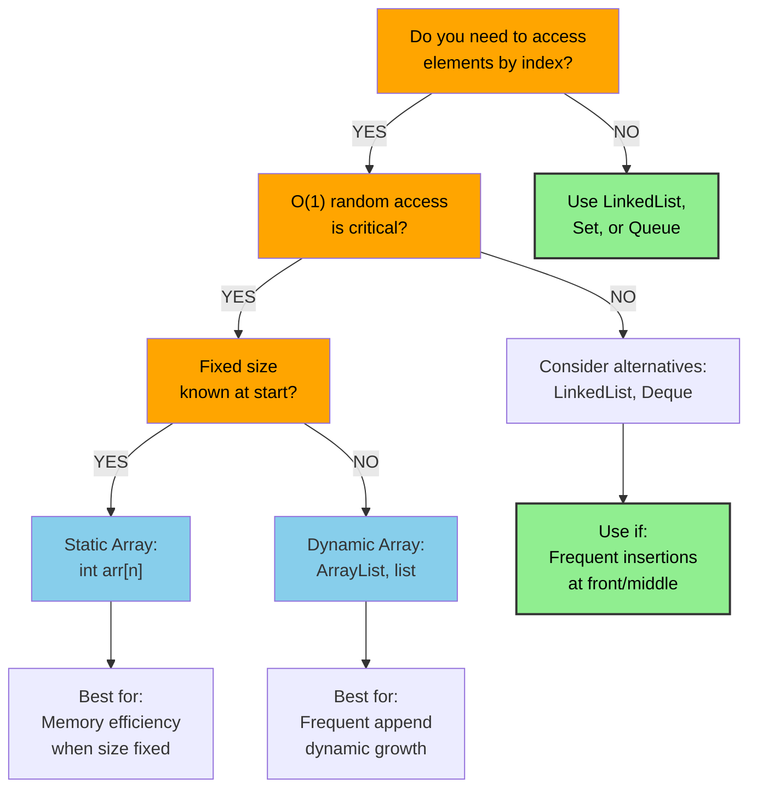
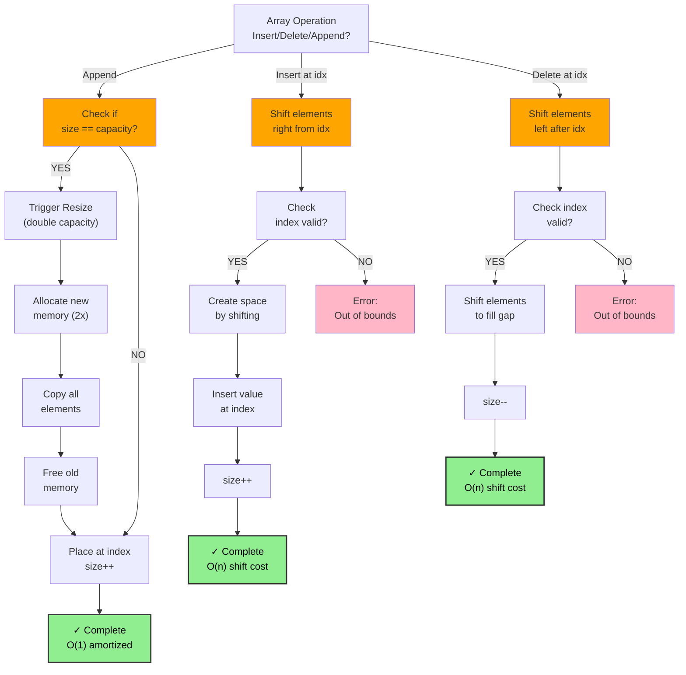
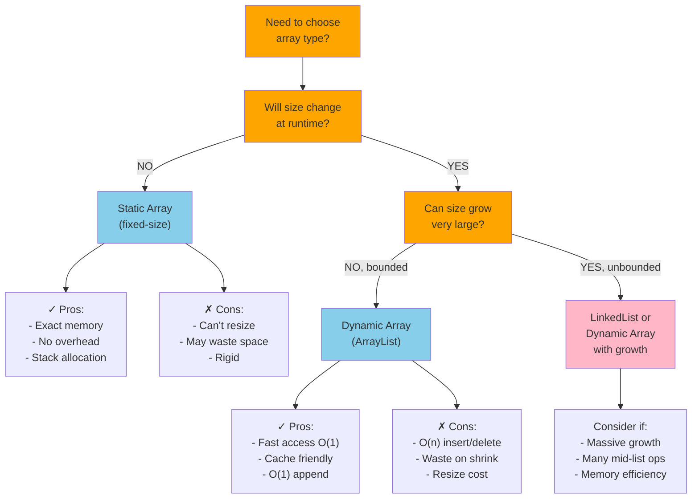
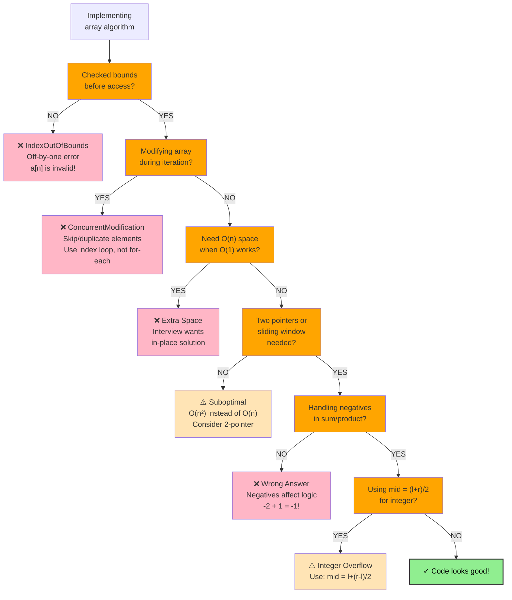

# Dynamic Array

## Overview

A **Dynamic Array** (also called a resizable array or ArrayList) is a random-access, contiguous block of memory that automatically resizes when it runs out of capacity. It combines O(1) indexed access with flexible size management.

**When to use it:**
- You need fast random access by index
- You're iterating over elements frequently
- You need a general-purpose ordered collection
- Cache performance matters (elements are stored contiguously)
- The size of the collection is not fixed at creation time

---

## When to Use: Decision Tree



---

## Visualization

### Basic Structure

```
Index:   [0]   [1]   [2]   [3]   [4]   [5]  (capacity=6, size=5)
Value:  [ 5 ] [ 3 ] [ 8 ] [ 1 ] [ 9 ] [   ]
         ↑                        ↑      ↑
        head                    tail   unused slot
```

### Append Operation

```
Before: [ 5 ][ 3 ][ 8 ][ 1 ][ 9 ][   ]  capacity=6, size=5

append(7):
Step 1: Check size < capacity  → 5 < 6  ✓ (no resize needed)
Step 2: Place 7 at index 5

After:  [ 5 ][ 3 ][ 8 ][ 1 ][ 9 ][ 7 ]  capacity=6, size=6
```

### Resize (Doubling Strategy)

```
Before: [ 5 ][ 3 ][ 8 ][ 1 ][ 9 ][ 7 ]  capacity=6, size=6  ← FULL

append(2):
Step 1: size == capacity → trigger resize
Step 2: Allocate new array of size 12 (2×)
Step 3: Copy all elements

Old:    [ 5 ][ 3 ][ 8 ][ 1 ][ 9 ][ 7 ]
         ↓    ↓    ↓    ↓    ↓    ↓
New:    [ 5 ][ 3 ][ 8 ][ 1 ][ 9 ][ 7 ][   ][   ][   ][   ][   ][   ]
                                         ↑ capacity=12, size=6

Step 4: Append 2 at index 6

Final:  [ 5 ][ 3 ][ 8 ][ 1 ][ 9 ][ 7 ][ 2 ][   ][   ][   ][   ][   ]
```

### Insert at Index (Shift Right)

```
Before: [ 5 ][ 3 ][ 8 ][ 1 ][ 9 ]
insert(1, 10)  →  insert value 10 at index 1

Step 1: Shift elements right from index 1 onward
        [ 5 ][ 3 ][ 8 ][ 1 ][ 9 ][ _ ]
                              ←shift←
        [ 5 ][ 3 ][ 8 ][ 1 ][ _ ][ 9 ]
                         ←shift←
        [ 5 ][ 3 ][ 8 ][ _ ][ 1 ][ 9 ]
                    ←shift←
        [ 5 ][ 3 ][ _ ][ 8 ][ 1 ][ 9 ]
              ←shift←
        [ 5 ][ _ ][ 3 ][ 8 ][ 1 ][ 9 ]

Step 2: Place 10 at index 1
After:  [ 5 ][10 ][ 3 ][ 8 ][ 1 ][ 9 ]
```

### Delete at Index (Shift Left)

```
Before: [ 5 ][10 ][ 3 ][ 8 ][ 1 ][ 9 ]
delete(2)  →  remove element at index 2

Step 1: Shift elements left from index 3 onward
        [ 5 ][10 ][ _ ][ 8 ][ 1 ][ 9 ]
              →shift→
        [ 5 ][10 ][ 8 ][ _ ][ 1 ][ 9 ]
                    →shift→
        [ 5 ][10 ][ 8 ][ 1 ][ _ ][ 9 ]
                         →shift→
        [ 5 ][10 ][ 8 ][ 1 ][ 9 ][ _ ]

After:  [ 5 ][10 ][ 8 ][ 1 ][ 9 ]   size=5
```

### Memory Layout (Contiguous)

```
RAM Address:   1000  1004  1008  1012  1016
               ┌────┬────┬────┬────┬────┐
               │  5 │  3 │  8 │  1 │  9 │
               └────┴────┴────┴────┴────┘
                 ↑ 4 bytes per int, sequential addresses
```

### Operation Flowchart: Insert, Delete, Append



---

### Static vs Dynamic Array Decision



---

## Operations & Complexity

| Operation            | Average Time | Worst Time | Space  |
|----------------------|:------------:|:----------:|:------:|
| Access by index      | O(1)         | O(1)       | O(1)   |
| Search (linear)      | O(n)         | O(n)       | O(1)   |
| Append (amortized)   | O(1)         | O(n)*      | O(1)   |
| Insert at index      | O(n)         | O(n)       | O(1)   |
| Delete at index      | O(n)         | O(n)       | O(1)   |
| Delete last (pop)    | O(1)         | O(1)       | O(1)   |
| Resize               | —            | O(n)       | O(n)   |
| Space (total)        | —            | —          | O(n)   |

> *Append is O(n) worst case when resize is triggered, but **amortized O(1)** due to the doubling strategy. Over n appends, total work = n + n/2 + n/4 + ... = O(n), so each append costs O(1) amortized.

---

## Key Properties

1. **Random access**: Any element can be accessed in O(1) using its index.
2. **Cache locality**: Elements are stored contiguously in memory, making iteration extremely cache-friendly.
3. **Amortized O(1) append**: The doubling strategy ensures that resizes happen infrequently enough that the amortized cost is O(1).
4. **Index validity**: Valid indices are in the range `[0, size-1]`. Out-of-bounds access raises an error.
5. **Capacity vs. size**: `capacity` is the allocated memory; `size` is the number of live elements. Always `size <= capacity`.
6. **Contiguous memory**: Unlike linked lists, there are no pointers—just raw indexed slots.
7. **Shift cost**: Insertions/deletions in the middle require O(n) shifts; prefer appending when possible.

---

## Common Interview Patterns

### 1. Two Pointers
Use two indices (`left`, `right`) moving toward or away from each other.
- **Use case**: Sorted array problems, palindrome checks, merging
- **Examples**: Remove duplicates in-place, Container with Most Water, Trapping Rain Water

```
left=0, right=n-1
[ 1 ][ 2 ][ 3 ][ 4 ][ 5 ][ 6 ]
  ↑                          ↑
 left                      right
```

### 2. Sliding Window
Maintain a window `[left, right]` and expand/shrink it based on a condition.
- **Use case**: Subarray/substring of size k, max/min in a range
- **Examples**: Maximum sum subarray of size k, Longest substring without repeating characters

```
Window size = 3
[ 2 ][ 1 ][ 5 ][ 1 ][ 3 ][ 2 ]
  ↑         ↑
 left      right

Slide →
[ 2 ][ 1 ][ 5 ][ 1 ][ 3 ][ 2 ]
        ↑         ↑
       left      right
```

### 3. Prefix Sum
Precompute cumulative sums so range queries become O(1).
- **Use case**: Range sum queries, equilibrium index
- **Examples**: Subarray Sum Equals K, Product of Array Except Self

```
Array:   [ 1 ][ 2 ][ 3 ][ 4 ][ 5 ]
Prefix:  [ 0 ][ 1 ][ 3 ][ 6 ][10 ][15 ]
                              ↑
                   sum(2..4) = prefix[5] - prefix[2] = 15 - 3 = 12
```

### 4. Kadane's Algorithm (Max Subarray)
Track a running max ending at each index.
- **Use case**: Maximum subarray sum, maximum product subarray
- **Key insight**: At each step, either extend the current subarray or start fresh

```
Array:   [-2][ 1][-3][ 4][-1][ 2][ 1][-5][ 4]
Running: [-2][ 1][-2][ 4][ 3][ 5][ 6][ 1][ 5]
                       ↑              ↑
                  reset here        global max = 6
```

### 5. In-place Manipulation (Dutch National Flag / Partition)
Rearrange elements without extra space by swapping.
- **Use case**: Sort colors, partition around pivot, move zeros

```
[ 2 ][ 0 ][ 2 ][ 1 ][ 1 ][ 0 ]
 swap 0s to left, 2s to right
→ [ 0 ][ 0 ][ 1 ][ 1 ][ 2 ][ 2 ]
```

---

## Common Mistakes Flowchart



---

## Interview Tips

**What interviewers look for:**
- Awareness of index bounds (off-by-one errors are the #1 mistake)
- Distinguishing O(1) amortized from O(1) worst-case for append
- Preference for two-pointer or sliding window over nested loops (O(n) vs O(n²))
- Knowing when to use a prefix sum array vs. computing on the fly
- Handling empty arrays and single-element arrays explicitly

**Common mistakes to avoid:**
- Forgetting to check empty array before accessing index 0
- Confusing `len(arr)` (size) with allocated capacity
- Modifying an array while iterating over it in a for-each loop
- Using `O(n)` extra space when the problem requires in-place solution
- Not considering negative numbers in sum/product problems
- Integer overflow when computing mid-index: use `mid = left + (right - left) // 2`

---

## Example Problems

| Problem | Pattern | Approach Hint |
|---------|---------|---------------|
| **Two Sum** | Hash Map + Array | Store complement in a map; one-pass O(n) |
| **Maximum Subarray** (Kadane's) | Dynamic Programming | Track `current_max` and `global_max` at each index |
| **Container With Most Water** | Two Pointers | Start from both ends; move the shorter pointer inward |
| **Rotate Array** | In-place / Reverse | Reverse whole array, then reverse two halves |
| **Find Minimum in Rotated Sorted Array** | Binary Search | Binary search with condition on pivot; O(log n) |

---

## Python Quick Reference

```python
# Creation
arr = []                   # empty dynamic array
arr = [1, 2, 3, 4, 5]     # initialized
arr = [0] * n              # n zeros

# Access
val = arr[0]               # O(1) - first element
val = arr[-1]              # O(1) - last element
val = arr[i]               # O(1) - index i

# Append / Remove
arr.append(x)              # O(1) amortized - add to end
arr.pop()                  # O(1) - remove from end
arr.insert(i, x)           # O(n) - insert at index i
arr.pop(i)                 # O(n) - remove at index i

# Slicing (creates a new list)
sub = arr[1:4]             # O(k) - elements at indices 1,2,3
rev = arr[::-1]            # O(n) - reversed copy

# Search
idx = arr.index(x)         # O(n) - first occurrence
exists = x in arr          # O(n) - membership test

# Sort
arr.sort()                 # O(n log n) - in-place (Timsort)
sorted_arr = sorted(arr)   # O(n log n) - returns new list

# Two-pointer template
left, right = 0, len(arr) - 1
while left < right:
    # process arr[left] and arr[right]
    left += 1
    right -= 1

# Sliding window template (fixed size k)
window_sum = sum(arr[:k])
for i in range(k, len(arr)):
    window_sum += arr[i] - arr[i - k]
    # process window_sum

# Prefix sum
prefix = [0] * (len(arr) + 1)
for i, v in enumerate(arr):
    prefix[i + 1] = prefix[i] + v
# Range sum [l, r] (0-indexed, inclusive):
range_sum = prefix[r + 1] - prefix[l]
```

---

## Java Quick Reference

```java
import java.util.ArrayList;
import java.util.Arrays;
import java.util.Collections;
import java.util.List;

// Creation
int[] arr = new int[5];                    // fixed-size, all zeros
int[] arr2 = {1, 2, 3, 4, 5};             // initialized
ArrayList<Integer> list = new ArrayList<>();
ArrayList<Integer> list2 = new ArrayList<>(Arrays.asList(1, 2, 3));

// Access
int val = arr[0];                          // O(1)
int val2 = list.get(0);                   // O(1)
int last = list.get(list.size() - 1);     // O(1)

// Append / Remove
list.add(x);                              // O(1) amortized
list.add(i, x);                           // O(n) - insert at index
list.remove(list.size() - 1);            // O(1) - remove last
list.remove(Integer.valueOf(x));          // O(n) - remove by value
list.remove(i);                           // O(n) - remove at index (int cast!)

// Search
int idx = list.indexOf(x);               // O(n)
boolean exists = list.contains(x);       // O(n)

// Sort
Arrays.sort(arr);                         // O(n log n) - in-place
Collections.sort(list);                   // O(n log n) - in-place

// Convert between array and list
Integer[] boxed = list.toArray(new Integer[0]);
List<Integer> fromArr = Arrays.asList(boxed);

// Two-pointer template
int left = 0, right = arr.length - 1;
while (left < right) {
    // process arr[left] and arr[right]
    left++;
    right--;
}

// Prefix sum
int[] prefix = new int[arr.length + 1];
for (int i = 0; i < arr.length; i++) {
    prefix[i + 1] = prefix[i] + arr[i];
}
// Range sum [l, r] (0-indexed, inclusive):
int rangeSum = prefix[r + 1] - prefix[l];
```
