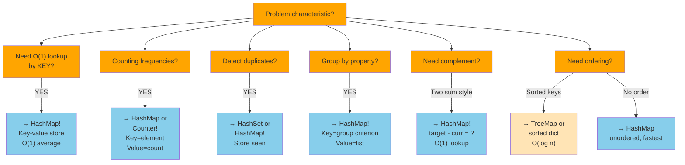

# HashMap / Hash Table

## Overview

A **HashMap** (Hash Table) is a data structure that maps **keys** to **values** using a **hash function** to compute an index (bucket) where the value is stored. It provides average O(1) time for insertions, deletions, and lookups — making it one of the most powerful tools in an SDE's toolkit.

**When to use it:**
- You need O(1) average-case lookup by key (not index)
- Counting frequencies (characters, words, elements)
- Detecting duplicates or previously seen elements
- Caching/memoization of expensive function results
- Grouping elements by a key (anagram groups, etc.)
- Two-sum style problems where you need complement lookups
- Graph adjacency lists and visited sets

---

## When to Use: HashMap Decision Tree



---

## Visualization

### Hash Function and Bucketing

```
Keys to insert: "apple", "banana", "cherry", "date"
Hash function: h(key) = sum(ord(chars)) % table_size (table_size = 7)

  "apple"  → h = (97+112+112+108+101) % 7 = 530 % 7 = 5   → bucket 5
  "banana" → h = (98+97+110+97+110+97) % 7 = 609 % 7 = 0  → bucket 0
  "cherry" → h = (99+104+101+114+114+121) % 7 = 653 % 7 = 2 → bucket 2
  "date"   → h = (100+97+116+101) % 7 = 414 % 7 = 1        → bucket 1

  Buckets:
  ┌───┬──────────────────────────────┐
  │ 0 │  "banana" → 2               │
  ├───┼──────────────────────────────┤
  │ 1 │  "date"   → 4               │
  ├───┼──────────────────────────────┤
  │ 2 │  "cherry" → 3               │
  ├───┼──────────────────────────────┤
  │ 3 │  (empty)                    │
  ├───┼──────────────────────────────┤
  │ 4 │  (empty)                    │
  ├───┼──────────────────────────────┤
  │ 5 │  "apple"  → 1               │
  ├───┼──────────────────────────────┤
  │ 6 │  (empty)                    │
  └───┴──────────────────────────────┘
```

### Collision Resolution: Chaining (Separate Chaining)

```
Two keys hash to the same bucket (collision!):
  h("listen") = 3
  h("silent") = 3  ← COLLISION

Chaining — each bucket holds a linked list:
  ┌───┬──────────────────────────────────────┐
  │ 0 │  null                                │
  ├───┼──────────────────────────────────────┤
  │ 1 │  null                                │
  ├───┼──────────────────────────────────────┤
  │ 2 │  null                                │
  ├───┼──────────────────────────────────────┤
  │ 3 │  ["listen":5] → ["silent":5] → null  │  ← both keys chained
  ├───┼──────────────────────────────────────┤
  │ 4 │  null                                │
  └───┴──────────────────────────────────────┘

Lookup("silent"):
  1. hash("silent") = 3
  2. Walk chain: "listen" ≠ "silent" → next
  3. "silent" == "silent" → found! return 5
```

### Collision Resolution: Open Addressing (Linear Probing)

```
Table size = 7, insert: "abc"(h=2), "xyz"(h=2 collision), "pqr"(h=2 collision)

Insert "abc" → h=2 → slot 2 empty → place
  [_][_][abc][_][_][_][_]
         ↑ h=2

Insert "xyz" → h=2 → slot 2 OCCUPIED → probe slot 3
  [_][_][abc][xyz][_][_][_]
              ↑ probe +1

Insert "pqr" → h=2 → slot 2 taken → slot 3 taken → slot 4 empty
  [_][_][abc][xyz][pqr][_][_]
                    ↑ probe +2

Lookup "xyz":
  h("xyz") = 2 → slot 2 → "abc" ≠ "xyz" → probe slot 3 → "xyz" = "xyz" → found!
```

### Resize / Rehashing

```
Load factor = size / capacity
When load_factor > 0.75 → rehash (double capacity)

Before rehash (capacity=4, size=3, load=0.75):
  ┌───┬───────────┐
  │ 0 │ "a"→1     │
  │ 1 │ "b"→2     │
  │ 2 │ (empty)   │
  │ 3 │ "c"→3     │
  └───┴───────────┘

After rehash (capacity=8):
  ┌───┬───────────┐
  │ 0 │ "a"→1     │  ← h("a") % 8 = new position
  │ 1 │ (empty)   │
  │ 2 │ (empty)   │
  │ 3 │ "b"→2     │  ← h("b") % 8 = new position
  │ 4 │ (empty)   │
  │ 5 │ "c"→3     │  ← h("c") % 8 = new position
  │ 6 │ (empty)   │
  │ 7 │ (empty)   │
  └───┴───────────┘
  All keys recomputed for new table size!
```

### Two Sum Pattern (Classic HashMap Usage)

```
nums = [2, 7, 11, 15], target = 9

  i=0, val=2:  complement = 9-2 = 7  → 7 not in map → store {2: 0}
  i=1, val=7:  complement = 9-7 = 2  → 2 IS in map at index 0 → return [0, 1]

  HashMap state:
  ┌──────────────┐
  │  2  →  0     │  (value → index)
  └──────────────┘
  Found: nums[0]=2 + nums[1]=7 = 9 ✓
```

### Frequency Count Pattern

```
s = "aabbbcccc"

Process each character:
  'a' → freq{'a':1}
  'a' → freq{'a':2}
  'b' → freq{'a':2, 'b':1}
  'b' → freq{'a':2, 'b':2}
  'b' → freq{'a':2, 'b':3}
  'c' → freq{'a':2, 'b':3, 'c':1}
  'c' → freq{'a':2, 'b':3, 'c':2}
  'c' → freq{'a':2, 'b':3, 'c':3}
  'c' → freq{'a':2, 'b':3, 'c':4}

Result: {'a':2, 'b':3, 'c':4}
```

---

## Operations & Complexity

| Operation       | Average Time | Worst Time | Space  | Notes                            |
|-----------------|:------------:|:----------:|:------:|----------------------------------|
| get(key)        | O(1)         | O(n)       | O(1)   | Worst case: all keys collide     |
| put(key, val)   | O(1)         | O(n)       | O(1)   | Amortized O(1) with rehashing    |
| delete(key)     | O(1)         | O(n)       | O(1)   |                                  |
| containsKey(k)  | O(1)         | O(n)       | O(1)   |                                  |
| iterate (keys)  | O(n)         | O(n)       | O(1)   | O(capacity) for sparse tables    |
| Rehash          | —            | O(n)       | O(n)   | Triggered at load_factor > 0.75  |
| Space (total)   | —            | —          | O(n)   | n key-value pairs stored         |

> The O(n) worst case for get/put/delete occurs when all keys hash to the same bucket (very unlikely with a good hash function). In practice, treat all operations as O(1).

---

## Key Properties

1. **Key uniqueness**: Each key maps to exactly one value; inserting a duplicate key overwrites the old value.
2. **Hash function**: Maps keys to bucket indices. A good hash function distributes keys uniformly to minimize collisions.
3. **Load factor**: Ratio of stored entries to total buckets. Java's HashMap rehashes at load factor > 0.75 by default.
4. **Collision handling**: Two main strategies:
   - **Chaining**: Each bucket holds a list of entries (Java's HashMap uses this + trees for long chains)
   - **Open addressing**: Probe for the next empty slot (simpler, better cache performance for small tables)
5. **Unordered**: Standard hashmaps do not guarantee key order. For sorted order, use TreeMap (Java) or sorted(dict) (Python).
6. **Python dict is ordered**: Since Python 3.7+, `dict` maintains insertion order, but that's an implementation detail — not guaranteed by the language spec until 3.7.
7. **Hashable keys**: Keys must be hashable (immutable in Python: int, str, tuple; NOT list or dict).
8. **HashSet vs HashMap**: A HashSet is a HashMap where only keys matter (values are ignored/dummy).

---

## Common Interview Patterns

### 1. Frequency Counting
Count occurrences of elements to answer questions about duplicates, most common, or exact counts.
- **Use case**: Top K Frequent Elements, Valid Anagram, First Unique Character

```
For each element:
    freq[element] = freq.get(element, 0) + 1
Then query freq[element] for O(1) count lookup
```

### 2. Two Sum / Complement Lookup
For each element, look up its complement (target - element) in a hashmap.
- **Use case**: Two Sum, Four Sum, Subarray Sum Equals K

```
For each nums[i]:
    complement = target - nums[i]
    if complement in seen: return answer
    seen[nums[i]] = i       ← store for future lookups
```

### 3. Grouping / Bucketing
Use a computed key to group elements with a common property.
- **Use case**: Group Anagrams, Top K Frequent Words, Isomorphic Strings

```
For each word:
    key = tuple(sorted(word))   ← canonical key for anagram group
    groups[key].append(word)
```

### 4. Sliding Window + HashMap
Combine a sliding window with a hashmap to track window contents and answer queries.
- **Use case**: Longest Substring Without Repeating Characters, Minimum Window Substring

```
Expand right pointer: add char to window freq map
Shrink left pointer when: window violates condition (freq > 1, etc.)
Answer = max window size seen
```

### 5. Prefix Sum + HashMap
Use a hashmap to store prefix sums so that subarray sum queries become O(1) lookups.
- **Use case**: Subarray Sum Equals K, Continuous Subarray Sum (multiple of k)

```
prefix_sum = 0
seen = {0: 1}    ← handle subarrays starting at index 0

For each nums[i]:
    prefix_sum += nums[i]
    if (prefix_sum - k) in seen:
        count += seen[prefix_sum - k]
    seen[prefix_sum] += 1
```

---

## Interview Tips

**What interviewers look for:**
- Reaching for a hashmap when you see "find if X exists", "count occurrences", or "find complement"
- Knowing that a hashmap trades space (O(n)) for time (O(1)) — explicitly state this trade-off
- Choosing the right hashmap variant: `Counter`, `defaultdict`, `dict` in Python; `HashMap`, `LinkedHashMap`, `TreeMap` in Java
- Understanding why worst-case is O(n) and when it can be triggered (adversarial hash collisions)
- For interview, saying "amortized O(1)" for put/get shows depth of knowledge

**Common mistakes to avoid:**
- Using a mutable type as a key in Python (list, dict) — will raise `TypeError: unhashable type`
- Confusing `dict.get(key, default)` vs `dict[key]` (latter raises `KeyError` if missing)
- Forgetting to handle the case where a key doesn't exist (use `.get()` or check `in` first)
- In "subarray sum = k" pattern: forgetting to seed `{0: 1}` in the prefix sum map
- Using `==` to compare by value vs `is` for identity — matters for custom objects as keys
- Not realizing that a `set` (HashSet) is sufficient when you only need membership, not a value

---

## Example Problems

| Problem | Pattern | Approach Hint |
|---------|---------|---------------|
| **Two Sum** | Complement Lookup | Store `val → index` in map; check `target - val` exists |
| **Group Anagrams** | Grouping | Key = sorted word (or char frequency tuple); group by key |
| **Top K Frequent Elements** | Frequency + Heap/Bucket Sort | Count freq; use heap or bucket sort (index = freq) for top-k |
| **Subarray Sum Equals K** | Prefix Sum + HashMap | Map prefix_sum → count; look up `prefix_sum - k` |
| **Longest Substring Without Repeating Chars** | Sliding Window + HashMap | Store char → last index; shrink window when duplicate found |

---

## Python Quick Reference

```python
# Creation
hmap = {}                          # empty dict
hmap = {'a': 1, 'b': 2}           # initialized
hmap = dict(a=1, b=2)             # from keyword args

# Insert / Update
hmap['key'] = 'value'             # O(1) - insert or overwrite

# Lookup
val = hmap['key']                  # O(1) - KeyError if missing
val = hmap.get('key')              # O(1) - None if missing
val = hmap.get('key', 0)          # O(1) - default 0 if missing

# Delete
del hmap['key']                    # O(1) - KeyError if missing
val = hmap.pop('key', None)        # O(1) - removes and returns; None if missing

# Membership
if 'key' in hmap: ...              # O(1)
if 'key' not in hmap: ...          # O(1)

# Iteration
for k in hmap:            pass    # iterate keys
for v in hmap.values():   pass    # iterate values
for k, v in hmap.items(): pass    # iterate key-value pairs

# Useful variants
from collections import defaultdict, Counter, OrderedDict

# defaultdict: never raises KeyError
freq = defaultdict(int)           # default value = int() = 0
freq['a'] += 1

# Counter: frequency counter
from collections import Counter
c = Counter("aabbcccc")           # Counter({'c':4,'a':2,'b':2})
c.most_common(2)                  # [('c',4), ('a',2)]

# Sorted keys (insertion order preserved in Python 3.7+)
for k in sorted(hmap): ...

# --- Two Sum ---
def two_sum(nums, target):
    seen = {}   # val → index
    for i, v in enumerate(nums):
        comp = target - v
        if comp in seen:
            return [seen[comp], i]
        seen[v] = i

# --- Group Anagrams ---
def group_anagrams(strs):
    groups = defaultdict(list)
    for s in strs:
        key = tuple(sorted(s))
        groups[key].append(s)
    return list(groups.values())

# --- Subarray Sum Equals K ---
def subarray_sum(nums, k):
    count = 0
    prefix = 0
    seen = {0: 1}           # prefix_sum → frequency
    for v in nums:
        prefix += v
        count += seen.get(prefix - k, 0)
        seen[prefix] = seen.get(prefix, 0) + 1
    return count

# --- Longest Substring Without Repeating Characters ---
def length_of_longest_substring(s):
    last_seen = {}   # char → last index
    left = max_len = 0
    for right, ch in enumerate(s):
        if ch in last_seen and last_seen[ch] >= left:
            left = last_seen[ch] + 1
        last_seen[ch] = right
        max_len = max(max_len, right - left + 1)
    return max_len
```

---

## Java Quick Reference

```java
import java.util.HashMap;
import java.util.LinkedHashMap;
import java.util.TreeMap;
import java.util.Map;
import java.util.HashSet;

// Creation
Map<String, Integer> map = new HashMap<>();
Map<String, Integer> ordered = new LinkedHashMap<>();  // insertion order
Map<String, Integer> sorted  = new TreeMap<>();        // sorted by key

// Insert / Update
map.put("key", 42);                  // O(1) - insert or overwrite

// Lookup
int val = map.get("key");            // O(1) - null if missing (NPE if int)
int val2 = map.getOrDefault("key", 0); // O(1) - safe default

// Delete
map.remove("key");                   // O(1) - no-op if missing
int removed = map.remove("key");     // O(1) - returns old value or null

// Membership
if (map.containsKey("key")) { }      // O(1)
if (map.containsValue(42)) { }       // O(n) - linear scan!

// Update with compute
map.put("a", map.getOrDefault("a", 0) + 1);      // increment
map.merge("a", 1, Integer::sum);                  // Java 8+ equivalent
map.compute("a", (k, v) -> v == null ? 1 : v+1); // Java 8+ general

// Iteration
for (Map.Entry<String, Integer> e : map.entrySet()) {
    String k = e.getKey();
    int v = e.getValue();
}
for (String k : map.keySet())   { }  // keys only
for (int v : map.values())      { }  // values only

// HashSet (keys only, no values)
HashSet<Integer> set = new HashSet<>();
set.add(x);              // O(1)
set.contains(x);         // O(1)
set.remove(x);           // O(1)


// --- Two Sum ---
public int[] twoSum(int[] nums, int target) {
    Map<Integer, Integer> seen = new HashMap<>();  // val → index
    for (int i = 0; i < nums.length; i++) {
        int comp = target - nums[i];
        if (seen.containsKey(comp))
            return new int[]{seen.get(comp), i};
        seen.put(nums[i], i);
    }
    return new int[]{};
}

// --- Group Anagrams ---
public List<List<String>> groupAnagrams(String[] strs) {
    Map<String, List<String>> groups = new HashMap<>();
    for (String s : strs) {
        char[] chars = s.toCharArray();
        Arrays.sort(chars);
        String key = new String(chars);
        groups.computeIfAbsent(key, k -> new ArrayList<>()).add(s);
    }
    return new ArrayList<>(groups.values());
}

// --- Subarray Sum Equals K ---
public int subarraySum(int[] nums, int k) {
    int count = 0, prefix = 0;
    Map<Integer, Integer> seen = new HashMap<>();
    seen.put(0, 1);
    for (int v : nums) {
        prefix += v;
        count += seen.getOrDefault(prefix - k, 0);
        seen.merge(prefix, 1, Integer::sum);
    }
    return count;
}

// --- Frequency Count ---
public Map<Character, Integer> charFreq(String s) {
    Map<Character, Integer> freq = new HashMap<>();
    for (char c : s.toCharArray())
        freq.merge(c, 1, Integer::sum);
    return freq;
}
```
