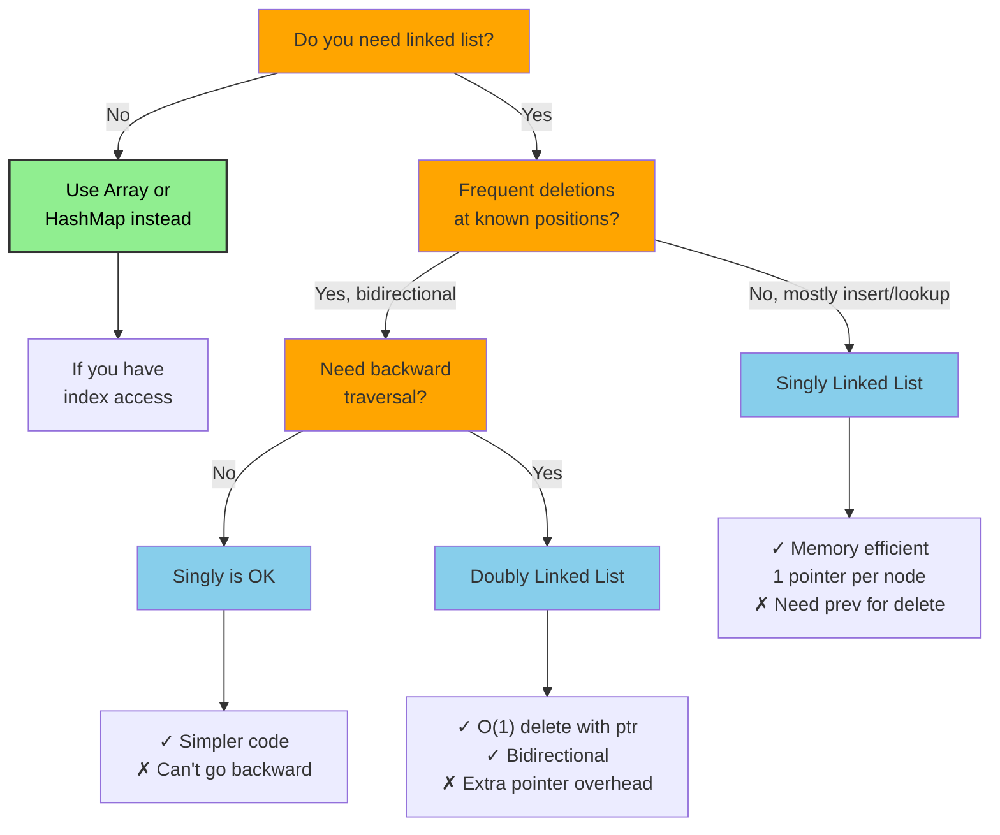
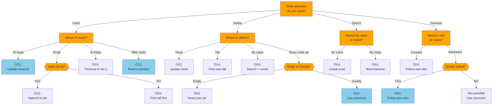
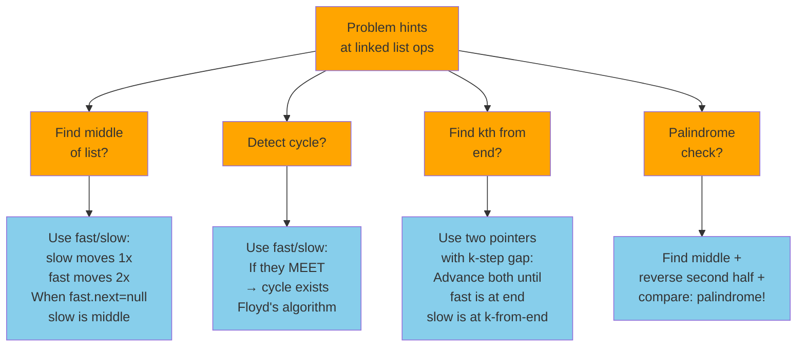

# Linked List (Singly + Doubly)

## Overview

A **Linked List** is a linear data structure where elements (nodes) are stored in non-contiguous memory locations. Each node holds a value and one or more pointers to neighboring nodes. Unlike arrays, linked lists do not support O(1) random access, but they excel at O(1) insertions and deletions when you already have a reference to the node.

**When to use it:**
- Frequent insertions/deletions at the front or middle (O(1) with a pointer)
- You don't need random access by index
- Implementing higher-level structures: stacks, queues, LRU caches, adjacency lists
- Memory usage is irregular and you can't pre-allocate a fixed block

**Variants:**
- **Singly Linked List**: Each node points to the next node only
- **Doubly Linked List**: Each node points to both the next and previous nodes
- **Circular Linked List**: The tail's `next` points back to the head

---

## When to Use: Singly vs Doubly Decision



---

## Visualization

### Singly Linked List

```
head                                    tail
 │                                       │
 ▼                                       ▼
┌───┬───┐   ┌───┬───┐   ┌───┬───┐   ┌───┬────┐
│ 5 │ ●─┼──▶│ 3 │ ●─┼──▶│ 8 │ ●─┼──▶│ 1 │null│
└───┴───┘   └───┴───┘   └───┴───┘   └───┴────┘
 val  next   val  next   val  next   val  next

Notation: [val|●] where ● is a pointer to the next node
```

### Doubly Linked List

```
        head                                          tail
         │                                             │
         ▼                                             ▼
      ┌────────────┐   ┌────────────┐   ┌────────────┐
null◀─┤prev│ 5 │next├──┤prev│ 3 │next├──┤prev│ 8 │next├──▶null
      └────────────┘◀──└────────────┘◀──└────────────┘
        [null|5|●]  ⟷  [●|3|●]  ⟷  [●|8|null]

Notation: [prev|val|next]
```

### Circular Singly Linked List

```
 head
  │
  ▼
┌───┬───┐   ┌───┬───┐   ┌───┬───┐   ┌───┬───┐
│ 5 │ ●─┼──▶│ 3 │ ●─┼──▶│ 8 │ ●─┼──▶│ 1 │ ●─┼──┐
└───┴───┘   └───┴───┘   └───┴───┘   └───┴───┘  │
  ▲                                              │
  └──────────────────────────────────────────────┘
                           tail.next = head
```

---

### Singly Linked List: Insert at Head

```
Before:  head → [3|●] → [8|●] → [1|null]

insertHead(5):
  Step 1: Create new node [5|●]
  Step 2: new_node.next = head          → [5|●] → [3|●] → [8|●] → [1|null]
  Step 3: head = new_node

After:   head → [5|●] → [3|●] → [8|●] → [1|null]
```

### Singly Linked List: Insert at Tail

```
Before:  head → [5|●] → [3|●] → [8|●] → [1|null]
                                           ↑ tail

insertTail(9):
  Step 1: Create new node [9|null]
  Step 2: tail.next = new_node
  Step 3: tail = new_node

After:   head → [5|●] → [3|●] → [8|●] → [1|●] → [9|null]
                                                     ↑ tail
```

### Singly Linked List: Insert After a Given Node

```
Before:  [5|●] → [3|●] → [8|●] → [1|null]

insertAfter(node=3, value=99):
  Step 1: Create new_node [99|●]
  Step 2: new_node.next = node.next     → new_node points to [8]
  Step 3: node.next = new_node          → [3] points to new_node

After:   [5|●] → [3|●] → [99|●] → [8|●] → [1|null]
                           ↑ inserted
```

### Singly Linked List: Delete a Node

```
Before:  head → [5|●] → [3|●] → [8|●] → [1|null]

deleteNode(value=3):
  Keep prev pointer; traverse until curr.val == 3

  prev=head[5], curr=[3]
  Step 1: prev.next = curr.next         → [5] now points to [8]
  Step 2: curr is garbage collected

After:   head → [5|●] → [8|●] → [1|null]
```

### Doubly Linked List: Delete a Node (O(1) with pointer)

```
Before:  null←[null|5|●]⟷[●|3|●]⟷[●|8|●]⟷[●|1|null]→null

deleteNode(node pointing to value=3):
  Step 1: node.prev.next = node.next    → [5].next = [8]
  Step 2: node.next.prev = node.prev    → [8].prev = [5]
  (No traversal needed!)

After:   null←[null|5|●]⟷[●|8|●]⟷[●|1|null]→null
```

### Reverse a Singly Linked List

```
Before:  head → [1|●] → [2|●] → [3|●] → [4|null]

Step 1:  prev=null, curr=[1]
         [1|●] → [2|●] → [3|●] → [4|null]

Step 2:  next=curr.next=[2], curr.next=prev=null, prev=curr=[1], curr=[2]
         null ←[1|null]  [2|●] → [3|●] → [4|null]

Step 3:  next=[3], curr.next=[1], prev=[2], curr=[3]
         null ←[1|null] ←[2|●]  [3|●] → [4|null]

Step 4:  next=[4], curr.next=[2], prev=[3], curr=[4]
         null ←[1|null] ←[2|●] ←[3|●]  [4|null]

Step 5:  next=null, curr.next=[3], prev=[4], curr=null
         null ←[1|null] ←[2|●] ←[3|●] ←[4|●]

After:   head → [4|●] → [3|●] → [2|●] → [1|null]
```

### Linked List Operation Decision Tree



---

## Operations & Complexity

### Singly Linked List

| Operation              | Time   | Space  | Notes                          |
|------------------------|:------:|:------:|--------------------------------|
| Access by index        | O(n)   | O(1)   | Must traverse from head        |
| Search                 | O(n)   | O(1)   | Linear scan                    |
| Insert at head         | O(1)   | O(1)   | Update head pointer            |
| Insert at tail         | O(1)*  | O(1)   | O(1) only if tail pointer kept |
| Insert at index        | O(n)   | O(1)   | Traverse to index-1, then link |
| Insert after node      | O(1)   | O(1)   | Given a pointer to the node    |
| Delete at head         | O(1)   | O(1)   | Update head pointer            |
| Delete at tail         | O(n)   | O(1)   | Must traverse to find new tail |
| Delete by value        | O(n)   | O(1)   | Find node + update prev.next   |
| Delete given node ptr  | O(n)*  | O(1)   | Need prev node (singly)        |
| Space (total)          | —      | O(n)   | n nodes × (val + 1 pointer)    |

### Doubly Linked List

| Operation              | Time   | Space  | Notes                          |
|------------------------|:------:|:------:|--------------------------------|
| Access by index        | O(n)   | O(1)   | Can start from head or tail    |
| Insert at head         | O(1)   | O(1)   |                                |
| Insert at tail         | O(1)   | O(1)   | Tail pointer always maintained |
| Delete given node ptr  | O(1)   | O(1)   | Use prev/next pointers         |
| Delete at head/tail    | O(1)   | O(1)   |                                |
| Space (total)          | —      | O(n)   | n nodes × (val + 2 pointers)   |

---

## Key Properties

1. **Non-contiguous memory**: Nodes can be anywhere in RAM; connected only through pointers.
2. **No random access**: To reach index `i`, you must traverse from head — O(n).
3. **Dynamic size**: No pre-allocation; grows/shrinks one node at a time.
4. **Pointer overhead**: Each node stores 1 (singly) or 2 (doubly) extra pointers.
5. **Singly vs. Doubly trade-off**: Doubly linked lists use more memory but allow O(1) deletion given a node pointer.
6. **Sentinel/Dummy nodes**: A dummy head (and tail) node simplifies edge cases — no null checks for empty list.
7. **Fast prepend**: O(1) insert at head is the primary advantage over arrays.

---

## Common Interview Patterns

### 1. Fast and Slow Pointers (Floyd's Cycle Detection)
Use two pointers moving at different speeds (1x and 2x) to detect cycles or find midpoints.
- **Use case**: Detect cycle, find middle, find start of cycle, palindrome check

```
Cycle detection:
  slow  fast
   ↓     ↓
  [1] → [2] → [3] → [4] → [5]
                      ↑         |
                      └─────────┘

slow moves 1 step, fast moves 2 steps
If they ever meet → cycle exists!

Find middle (no cycle):
List: [1] → [2] → [3] → [4] → [5] → null
After loop: slow is at [3] (middle)
```

### 2. Reverse a Linked List (Iterative + Recursive)
Fundamental technique required in many problems.
- **Use case**: Reverse entire list, reverse in groups, palindrome check
- **Key**: Maintain `prev`, `curr`, `next` pointers

```
prev=null  curr=head
  null  [1|●]→[2|●]→[3|●]→null
  
After reversing:
  null←[1|●] [2|●]→[3|●]→null
  Move pointers forward each step
```

### 3. Merge Two Sorted Lists
Use a dummy head to simplify pointer management.
- **Use case**: Merge k sorted lists (heap), sort linked list (merge sort)

```
L1: [1|●] → [3|●] → [5|null]
L2: [2|●] → [4|●] → [6|null]

dummy → [1|●] → [2|●] → [3|●] → [4|●] → [5|●] → [6|null]
```

### 4. Two-Pointer for Kth from End
Use two pointers with a gap of k between them.
- **Use case**: Remove nth node from end, find kth from last

```
Remove 2nd from end of [1]→[2]→[3]→[4]→[5]:

fast   slow
  ↓     ↓
[1]→[2]→[3]→[4]→[5]→null

Advance fast by k=2 steps:
         slow      fast
          ↓          ↓
[1]→[2]→[3]→[4]→[5]→null

Move both until fast is null → slow is at node before target
```

### 5. Dummy/Sentinel Head Node
Prepend a dummy node to avoid special-casing empty list or head operations.
- **Use case**: Insertion/deletion near head, merging lists, partitioning

```
Without dummy (edge case when deleting head):
  if node_to_delete == head: head = head.next  ← special case

With dummy head:
  dummy → [1] → [2] → [3] → null
  All deletions look the same: prev.next = curr.next
  Return dummy.next as the real head
```

---

### Fast/Slow Pointers Pattern Recognition



---

## Interview Tips

**What interviewers look for:**
- Drawing the pointer diagram before writing code — shows you think visually
- Handling edge cases: empty list, single node, operation at head/tail
- Using a dummy/sentinel node to simplify boundary conditions
- Correct pointer update order (especially during reversal — update next BEFORE moving)
- Recognizing when fast/slow pointers apply

**Common mistakes to avoid:**
- Losing the rest of the list by overwriting `curr.next` before saving `next = curr.next`
- Off-by-one in "k from end" problems (clarify 0-indexed vs 1-indexed)
- Forgetting to update `tail` when inserting at the end
- Not handling the case where the node to delete is the head
- Circular list → infinite loop if you check `curr != null` instead of `curr != head`
- In doubly linked list, forgetting to update BOTH `prev.next` and `next.prev`

---

## Example Problems

| Problem | Pattern | Approach Hint |
|---------|---------|---------------|
| **Reverse Linked List** | Iterative/Recursive | Track prev, curr, next; rewire one node at a time |
| **Linked List Cycle** | Fast/Slow Pointers | Floyd's algorithm; meet → cycle, no meet → no cycle |
| **Merge Two Sorted Lists** | Dummy Head + Two Pointers | Use dummy node; greedily pick smaller node |
| **LRU Cache** | Doubly LL + HashMap | HashMap for O(1) lookup; DLL for O(1) move-to-front |
| **Reorder List** | Find Middle + Reverse + Merge | Split at middle, reverse second half, interleave |

---

## Python Quick Reference

```python
# Node definition
class ListNode:
    def __init__(self, val=0, next=None):
        self.val = val
        self.next = next

# Doubly linked node
class DListNode:
    def __init__(self, val=0):
        self.val = val
        self.prev = None
        self.next = None

# Build a list from array
def build(arr):
    dummy = ListNode(0)
    curr = dummy
    for v in arr:
        curr.next = ListNode(v)
        curr = curr.next
    return dummy.next  # head

# Traverse
def traverse(head):
    curr = head
    while curr:
        print(curr.val, end=" -> ")
        curr = curr.next

# Reverse iteratively
def reverse(head):
    prev, curr = None, head
    while curr:
        nxt = curr.next     # save next
        curr.next = prev    # reverse link
        prev = curr         # advance prev
        curr = nxt          # advance curr
    return prev             # new head

# Detect cycle (Floyd's)
def has_cycle(head):
    slow = fast = head
    while fast and fast.next:
        slow = slow.next
        fast = fast.next.next
        if slow == fast:
            return True
    return False

# Find middle
def find_middle(head):
    slow = fast = head
    while fast and fast.next:
        slow = slow.next
        fast = fast.next.next
    return slow  # middle node

# Merge two sorted lists
def merge_sorted(l1, l2):
    dummy = ListNode(0)
    curr = dummy
    while l1 and l2:
        if l1.val <= l2.val:
            curr.next = l1
            l1 = l1.next
        else:
            curr.next = l2
            l2 = l2.next
        curr = curr.next
    curr.next = l1 or l2
    return dummy.next

# Remove nth from end (one-pass)
def remove_nth_from_end(head, n):
    dummy = ListNode(0, head)
    fast = slow = dummy
    for _ in range(n + 1):
        fast = fast.next
    while fast:
        slow = slow.next
        fast = fast.next
    slow.next = slow.next.next
    return dummy.next
```

---

## Java Quick Reference

```java
// Node definition
class ListNode {
    int val;
    ListNode next;
    ListNode(int val) { this.val = val; }
    ListNode(int val, ListNode next) { this.val = val; this.next = next; }
}

// Doubly linked node
class DListNode {
    int val;
    DListNode prev, next;
    DListNode(int val) { this.val = val; }
}

// Reverse iteratively
public ListNode reverse(ListNode head) {
    ListNode prev = null, curr = head;
    while (curr != null) {
        ListNode next = curr.next;  // save next
        curr.next = prev;           // reverse link
        prev = curr;                // advance prev
        curr = next;                // advance curr
    }
    return prev;                    // new head
}

// Detect cycle (Floyd's)
public boolean hasCycle(ListNode head) {
    ListNode slow = head, fast = head;
    while (fast != null && fast.next != null) {
        slow = slow.next;
        fast = fast.next.next;
        if (slow == fast) return true;
    }
    return false;
}

// Find middle
public ListNode findMiddle(ListNode head) {
    ListNode slow = head, fast = head;
    while (fast != null && fast.next != null) {
        slow = slow.next;
        fast = fast.next.next;
    }
    return slow;
}

// Merge two sorted lists
public ListNode mergeSorted(ListNode l1, ListNode l2) {
    ListNode dummy = new ListNode(0), curr = dummy;
    while (l1 != null && l2 != null) {
        if (l1.val <= l2.val) { curr.next = l1; l1 = l1.next; }
        else                  { curr.next = l2; l2 = l2.next; }
        curr = curr.next;
    }
    curr.next = (l1 != null) ? l1 : l2;
    return dummy.next;
}

// Remove nth from end
public ListNode removeNthFromEnd(ListNode head, int n) {
    ListNode dummy = new ListNode(0, head);
    ListNode fast = dummy, slow = dummy;
    for (int i = 0; i <= n; i++) fast = fast.next;
    while (fast != null) {
        slow = slow.next;
        fast = fast.next;
    }
    slow.next = slow.next.next;
    return dummy.next;
}

// Java built-in: LinkedList (doubly linked, implements Deque)
import java.util.LinkedList;
LinkedList<Integer> ll = new LinkedList<>();
ll.addFirst(1);    // O(1) - add to head
ll.addLast(2);     // O(1) - add to tail
ll.removeFirst();  // O(1) - remove from head
ll.removeLast();   // O(1) - remove from tail
ll.get(i);         // O(n) - index access (traversal!)
```
