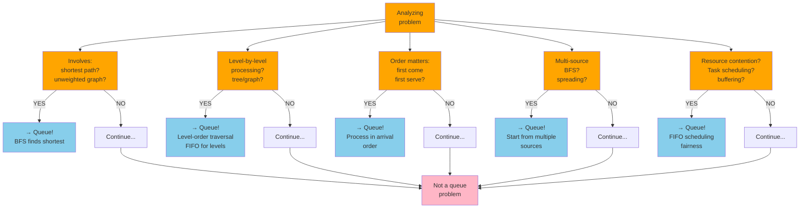
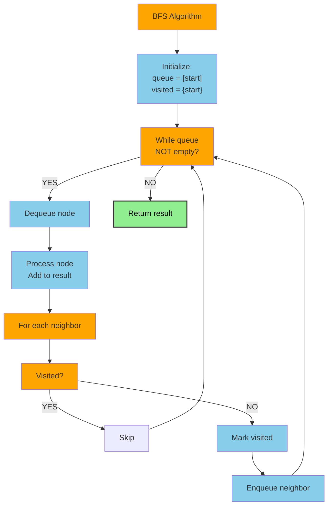
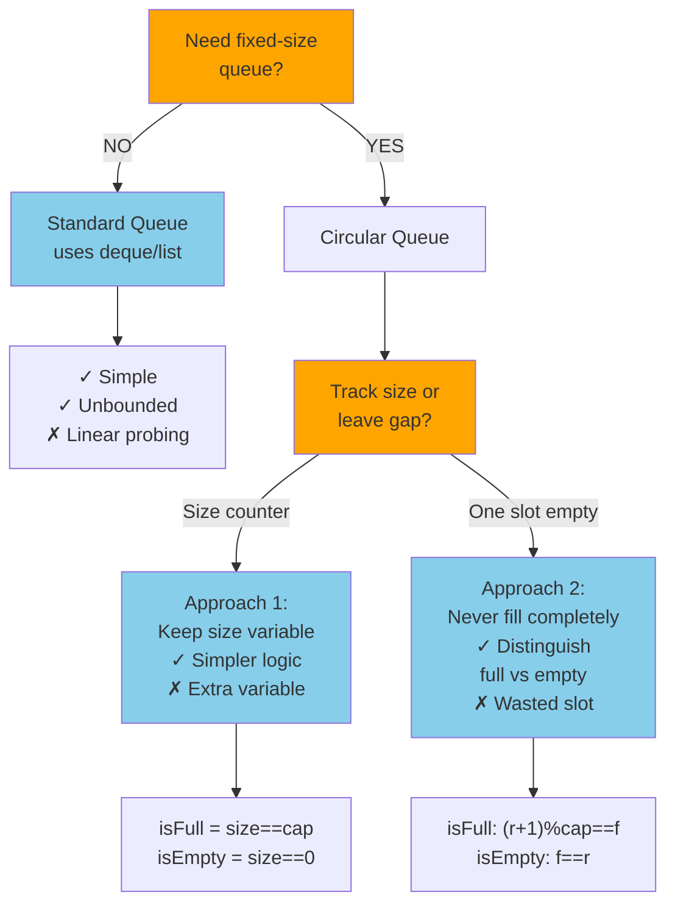
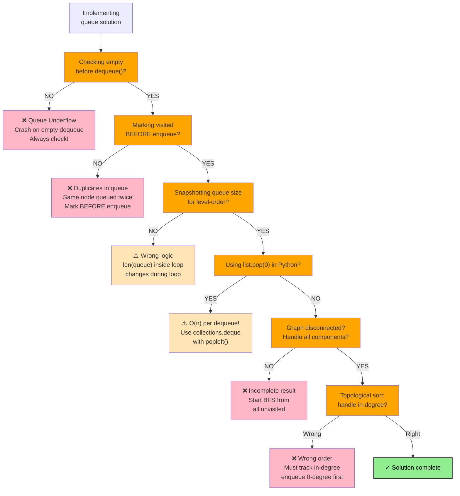

# Queue & Circular Queue

## Overview

A **Queue** is a linear data structure that follows the **FIFO** (First In, First Out) principle. Elements are added at the **rear** (enqueue) and removed from the **front** (dequeue) — like a line at a ticket counter.

A **Circular Queue** (ring buffer) connects the tail back to the head, allowing the buffer to reuse empty slots at the front after dequeues, making it memory-efficient for fixed-size queues.

**When to use a Queue:**
- BFS traversal of trees and graphs
- Processing tasks in the order they arrive (scheduling, print queues)
- Level-order traversal
- Sliding window (with deque variant)
- Producer-consumer pipelines

**When to use a Circular Queue:**
- Fixed-size buffer with efficient reuse (I/O buffers, audio streams)
- When you don't want to shift elements on dequeue
- Implementing bounded queues in embedded/real-time systems

---

## When to Use: Queue Problem Recognition



---

## Visualization

### Standard Queue

```
ENQUEUE (rear) →→→→→→→→→→→→→→→ DEQUEUE (front)

         ┌──────────────────────────────┐
 rear ──▶│  9 │  1 │  8 │  3 │  5     │◀── front
         └──────────────────────────────┘

Enqueue adds to the right (rear).
Dequeue removes from the left (front).
```

### Enqueue Sequence

```
Start (empty):     enqueue(5):    enqueue(3):    enqueue(8):    enqueue(1):
  front=rear=-1    front=0,rear=0 front=0,rear=1 front=0,rear=2 front=0,rear=3
  [  ][  ][  ][  ] [ 5][  ][  ][  ] [ 5][ 3][  ][  ] [ 5][ 3][ 8][  ] [ 5][ 3][ 8][ 1]
                    ↑  ↑              ↑        ↑         ↑           ↑    ↑              ↑
                   F=R              front    rear       F            R   F               R
```

### Dequeue Sequence

```
Before:   [ 5][ 3][ 8][ 1]
           ↑              ↑
          front           rear

dequeue()→5:    dequeue()→3:    dequeue()→8:    dequeue()→1:
  [ _][ 3][ 8][ 1]    [ _][ _][ 8][ 1]    [ _][ _][ _][ 1]    [ _][ _][ _][ _]
       ↑          ↑         ↑         ↑              ↑    ↑       (front > rear → empty)
      front      rear      front     rear           F    R
```

### Circular Queue (Ring Buffer)

```
Capacity = 6

Initial state:
  ┌───┬───┬───┬───┬───┬───┐
  │   │   │   │   │   │   │
  └───┴───┴───┴───┴───┴───┘
    0   1   2   3   4   5
  front=-1, rear=-1, size=0

After enqueue(A, B, C, D):
  ┌───┬───┬───┬───┬───┬───┐
  │ A │ B │ C │ D │   │   │
  └───┴───┴───┴───┴───┴───┘
    0   1   2   3   4   5
    ↑               ↑
  front=0         rear=3

After dequeue() x2 (removes A, B):
  ┌───┬───┬───┬───┬───┬───┐
  │   │   │ C │ D │   │   │
  └───┴───┴───┴───┴───┴───┘
    0   1   2   3   4   5
            ↑   ↑
         front=2 rear=3

After enqueue(E, F, G):  ← wraps around!
  ┌───┬───┬───┬───┬───┬───┐
  │ G │   │ C │ D │ E │ F │
  └───┴───┴───┴───┴───┴───┘
    0   1   2   3   4   5
    ↑       ↑
  rear=0  front=2

The key formula:  rear = (rear + 1) % capacity
                  front = (front + 1) % capacity
```

### Ring Buffer Wrap-around Diagram

```
         ┌──────────────────────────────────────┐
         │                                      │
         ▼                                      │
  ┌─────┬─────┬─────┬─────┬─────┬─────┐        │
  │  G  │  _  │  C  │  D  │  E  │  F  │        │
  └─────┴─────┴─────┴─────┴─────┴─────┘        │
    [0]   [1]   [2]   [3]   [4]   [5]           │
     ↑           ↑                              │
   rear         front                           │
                  │                             │
                  └─────────────────────────────┘
                  (logical order: C→D→E→F→G)
```

### BFS Algorithmic Flowchart



### Circular Queue Implementation Choice



### BFS Level-Order Traversal (Queue in Action)

```
Tree:          1
             /   \
            2     3
           / \   / \
          4   5 6   7

Queue state during BFS:
Step 1: enqueue root     Q: [1]
Step 2: dequeue 1        Q: []      → visit 1, enqueue 2, 3
Step 3:                  Q: [2, 3]  → dequeue 2, visit 2, enqueue 4, 5
Step 4:                  Q: [3, 4, 5] → dequeue 3, visit 3, enqueue 6, 7
Step 5:                  Q: [4, 5, 6, 7] → dequeue 4, visit 4 (no children)
...

Level order output: 1  |  2 3  |  4 5 6 7
```

---

## Operations & Complexity

### Standard Queue

| Operation     | Time   | Space  | Notes                              |
|---------------|:------:|:------:|------------------------------------|
| enqueue(x)    | O(1)   | O(1)   | Add to rear                        |
| dequeue()     | O(1)   | O(1)   | Remove from front; error if empty  |
| peek/front()  | O(1)   | O(1)   | View front without removing        |
| isEmpty()     | O(1)   | O(1)   | Check size == 0                    |
| size()        | O(1)   | O(1)   |                                    |
| Space (total) | —      | O(n)   |                                    |

### Circular Queue (Array-based)

| Operation     | Time   | Space  | Notes                              |
|---------------|:------:|:------:|------------------------------------|
| enqueue(x)    | O(1)   | O(1)   | rear = (rear+1) % cap              |
| dequeue()     | O(1)   | O(1)   | front = (front+1) % cap            |
| peek/front()  | O(1)   | O(1)   |                                    |
| isFull()      | O(1)   | O(1)   | size == capacity                   |
| isEmpty()     | O(1)   | O(1)   | size == 0                          |
| Space (total) | —      | O(n)   | Fixed allocation of n slots        |

---

## Key Properties

1. **FIFO order**: The first element enqueued is the first to be dequeued.
2. **Two-ended access**: Enqueue at rear, dequeue from front — no random access.
3. **Circular queue advantage**: Eliminates the need to shift elements or waste space after dequeues.
4. **Full vs. empty ambiguity**: In a circular queue, `front == rear` could mean full or empty — resolve with a `size` counter or leave one slot empty.
5. **BFS backbone**: Queues are the natural structure for BFS because BFS explores level by level (FIFO order).
6. **Array-based vs. linked list**: Array-based has O(1) cache-friendly access; linked list has no capacity limit.
7. **Deque generalization**: A double-ended queue (deque) is strictly more powerful than a queue.

---

## Common Interview Patterns

### 1. BFS / Level-Order Traversal
Process nodes level by level using a queue. Process all nodes at depth d before any at depth d+1.
- **Use case**: Shortest path in unweighted graph, level-order tree traversal, minimum steps

```
Level-by-level processing:
  while queue not empty:
      for each node in current level (range len(queue)):
          dequeue node
          process node
          enqueue all unvisited neighbors
```

### 2. Sliding Window Maximum (Monotonic Deque)
Use a deque as a monotonic decreasing queue to track the max in a sliding window.
- **Use case**: Sliding Window Maximum, Jump Game VI

```
Window [2, 1, 5, 3] of size k=3:
  Deque stores indices, values in decreasing order.
  When new element > deque front → pop from front (it'll never be the max)
  When deque front is outside window → pop from rear
```

### 3. Multi-Source BFS
Start BFS from multiple source nodes simultaneously.
- **Use case**: Walls and Gates, Rotting Oranges, 01 Matrix

```
Initialize queue with ALL source nodes at step 0:
  queue = [(r0,c0,0), (r1,c1,0), ...]  ← all sources at distance 0
  BFS spreads outward from all sources simultaneously
```

### 4. Topological Sort (Kahn's Algorithm)
Process nodes with in-degree 0 using a queue (BFS-based topological sort).
- **Use case**: Course Schedule, Task ordering with dependencies

```
Step 1: Compute in-degree for all nodes
Step 2: Enqueue all nodes with in-degree = 0
Step 3: Dequeue → add to result → reduce neighbor in-degrees
        → enqueue any neighbor that reaches in-degree 0
```

### 5. Simulate a Queue Using Two Stacks
Classic interview problem — implement queue with push-stack and pop-stack.
- **Key insight**: Amortized O(1) — each element is moved at most once

```
push_stack: [5, 3, 8]   (enqueue here)
pop_stack:  []           (dequeue from here)

dequeue(): if pop_stack empty, pour push_stack into pop_stack
           push_stack: []   pop_stack: [8, 3, 5]
           dequeue returns 5 (bottom of push → FIFO order restored)
```

---

## Common Queue Mistakes



---

## Interview Tips

**What interviewers look for:**
- Immediately recognizing BFS as the right algorithm for shortest-path in unweighted graphs
- Knowing the level-separation trick (snapshot `len(queue)` at the start of each level)
- Handling disconnected graphs in BFS (visit tracking with a `visited` set)
- Circular queue: correct modular arithmetic and full/empty detection
- Multi-source BFS for grid problems with multiple starting points

**Common mistakes to avoid:**
- Dequeuing from an empty queue (always check `isEmpty()`)
- Forgetting to mark nodes as visited BEFORE enqueueing them (not after dequeuing) — prevents duplicates in BFS
- In circular queue, off-by-one in full condition: `(rear + 1) % cap == front` (one-slot-empty approach) vs `size == cap` (size-counter approach)
- Using a list as a queue in Python (`pop(0)` is O(n)!) — use `collections.deque` instead
- In level-order, not snapshotting queue size: `for _ in range(len(q))` must be computed BEFORE the inner loop

---

## Example Problems

| Problem | Pattern | Approach Hint |
|---------|---------|---------------|
| **Binary Tree Level Order Traversal** | BFS | Snapshot queue size per level; dequeue and enqueue children |
| **Rotting Oranges** | Multi-Source BFS | Enqueue all rotten oranges at t=0; BFS spreads contamination |
| **Number of Islands** | BFS / DFS | BFS from each unvisited '1'; mark all connected land as visited |
| **Course Schedule** | Topological Sort (Kahn's) | Build in-degree map; BFS from 0-in-degree nodes |
| **Design Circular Queue** | Circular Buffer | Array + front/rear pointers + size counter; modular arithmetic |

---

## Python Quick Reference

```python
from collections import deque

# Standard Queue using collections.deque (O(1) both ends)
queue = deque()

# Enqueue (add to rear)
queue.append(5)       # O(1)
queue.append(3)

# Dequeue (remove from front)
val = queue.popleft() # O(1) - returns 5

# Peek (front)
front = queue[0]      # O(1)

# Check empty
if not queue:
    print("empty")

# Size
n = len(queue)


# --- BFS Template ---
def bfs(graph, start):
    visited = {start}
    queue = deque([start])
    while queue:
        node = queue.popleft()
        # process node
        for neighbor in graph[node]:
            if neighbor not in visited:
                visited.add(neighbor)   # mark BEFORE enqueuing
                queue.append(neighbor)


# --- Level-Order Traversal ---
def level_order(root):
    if not root:
        return []
    result = []
    queue = deque([root])
    while queue:
        level_size = len(queue)      # snapshot current level size
        level = []
        for _ in range(level_size):
            node = queue.popleft()
            level.append(node.val)
            if node.left:  queue.append(node.left)
            if node.right: queue.append(node.right)
        result.append(level)
    return result


# --- Circular Queue (Manual Implementation) ---
class CircularQueue:
    def __init__(self, capacity):
        self.cap = capacity
        self.data = [None] * capacity
        self.front = self.rear = -1
        self.size = 0

    def enqueue(self, val):
        if self.size == self.cap:
            raise Exception("Queue is full")
        if self.front == -1:
            self.front = 0
        self.rear = (self.rear + 1) % self.cap
        self.data[self.rear] = val
        self.size += 1

    def dequeue(self):
        if self.size == 0:
            raise Exception("Queue is empty")
        val = self.data[self.front]
        self.front = (self.front + 1) % self.cap
        self.size -= 1
        if self.size == 0:
            self.front = self.rear = -1
        return val

    def peek(self):
        if self.size == 0:
            raise Exception("Queue is empty")
        return self.data[self.front]

    def is_empty(self): return self.size == 0
    def is_full(self):  return self.size == self.cap


# --- Queue from Two Stacks ---
class MyQueue:
    def __init__(self):
        self.in_stack = []
        self.out_stack = []

    def push(self, x):
        self.in_stack.append(x)

    def pop(self):
        self._transfer()
        return self.out_stack.pop()

    def peek(self):
        self._transfer()
        return self.out_stack[-1]

    def empty(self):
        return not self.in_stack and not self.out_stack

    def _transfer(self):
        if not self.out_stack:
            while self.in_stack:
                self.out_stack.append(self.in_stack.pop())
```

---

## Java Quick Reference

```java
import java.util.ArrayDeque;
import java.util.Deque;
import java.util.LinkedList;
import java.util.Queue;

// Standard Queue (prefer ArrayDeque over LinkedList)
Queue<Integer> queue = new ArrayDeque<>();

// Enqueue
queue.offer(5);           // O(1) - returns false if full (preferred)
queue.add(3);             // O(1) - throws exception if full

// Dequeue
int val = queue.poll();   // O(1) - returns null if empty (preferred)
int val2 = queue.remove();// O(1) - throws exception if empty

// Peek (front)
int front = queue.peek(); // O(1) - returns null if empty
int front2 = queue.element(); // O(1) - throws exception if empty

// Check empty / size
boolean empty = queue.isEmpty();
int size = queue.size();


// --- BFS Template ---
public void bfs(Map<Integer, List<Integer>> graph, int start) {
    Set<Integer> visited = new HashSet<>();
    Queue<Integer> queue = new ArrayDeque<>();
    visited.add(start);
    queue.offer(start);
    while (!queue.isEmpty()) {
        int node = queue.poll();
        // process node
        for (int neighbor : graph.getOrDefault(node, List.of())) {
            if (!visited.contains(neighbor)) {
                visited.add(neighbor);   // mark BEFORE enqueueing
                queue.offer(neighbor);
            }
        }
    }
}

// --- Level-Order Traversal ---
public List<List<Integer>> levelOrder(TreeNode root) {
    List<List<Integer>> result = new ArrayList<>();
    if (root == null) return result;
    Queue<TreeNode> queue = new ArrayDeque<>();
    queue.offer(root);
    while (!queue.isEmpty()) {
        int levelSize = queue.size();    // snapshot current level
        List<Integer> level = new ArrayList<>();
        for (int i = 0; i < levelSize; i++) {
            TreeNode node = queue.poll();
            level.add(node.val);
            if (node.left != null)  queue.offer(node.left);
            if (node.right != null) queue.offer(node.right);
        }
        result.add(level);
    }
    return result;
}

// --- Circular Queue (Array-based) ---
class CircularQueue {
    private int[] data;
    private int front = -1, rear = -1, size = 0, cap;

    public CircularQueue(int capacity) {
        this.cap = capacity;
        this.data = new int[capacity];
    }

    public boolean enqueue(int val) {
        if (size == cap) return false;
        if (front == -1) front = 0;
        rear = (rear + 1) % cap;
        data[rear] = val;
        size++;
        return true;
    }

    public int dequeue() {
        if (size == 0) throw new RuntimeException("Empty");
        int val = data[front];
        front = (front + 1) % cap;
        size--;
        if (size == 0) front = rear = -1;
        return val;
    }

    public int peek()      { return size == 0 ? -1 : data[front]; }
    public boolean isEmpty() { return size == 0; }
    public boolean isFull()  { return size == cap; }
}
```
