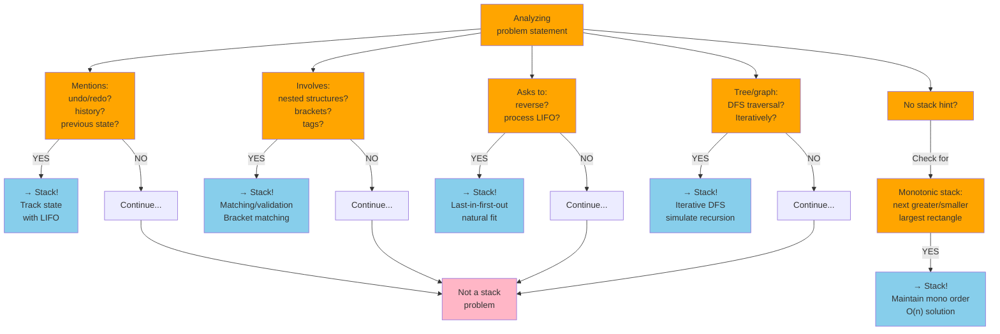
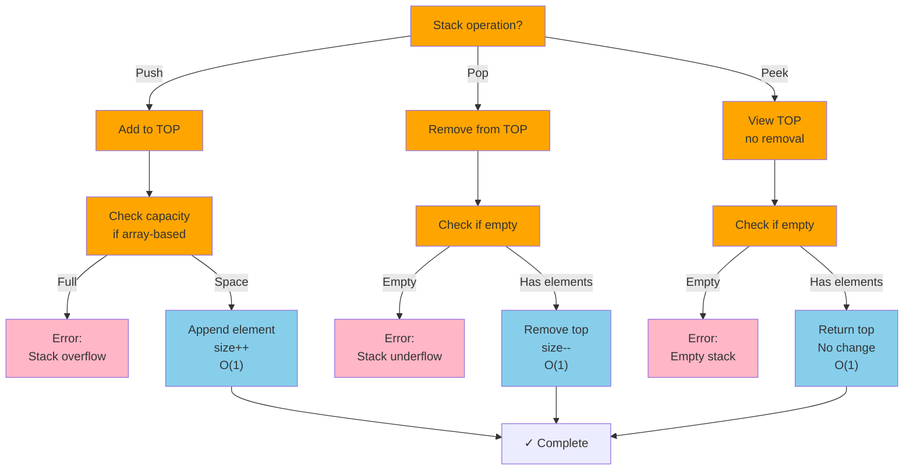
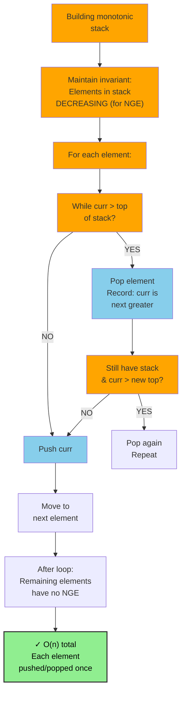

# Stack

## Overview

A **Stack** is a linear data structure that follows the **LIFO** (Last In, First Out) principle. The last element added is the first one to be removed — like a stack of plates. Operations happen exclusively at one end, called the **top**.

**When to use it:**
- Tracking state that needs to be undone (undo/redo, function call stack)
- Parsing nested structures (parentheses, HTML tags, expressions)
- DFS traversal of trees and graphs (iterative)
- Maintaining a "most recently seen" element
- Evaluating postfix expressions or converting infix to postfix
- Monotonic stack problems (next greater/smaller element)

---

## When to Use: Stack Problem Recognition



---

## Visualization

### Basic Stack Structure

```
     ┌─────┐
     │  5  │ ← TOP (most recently pushed)
     ├─────┤
     │  3  │
     ├─────┤
     │  8  │
     ├─────┤
     │  1  │
     └─────┘ ← BOTTOM (oldest element)
```

### Push Operations

```
Start:     push(1):   push(8):   push(3):   push(5):
┌─────┐    ┌─────┐    ┌─────┐    ┌─────┐    ┌─────┐
│     │    │     │    │     │    │  3  │◀── │  5  │◀── pushed
│     │    │     │    │  8  │◀── │  8  │    │  3  │
│     │    │  1  │◀── │  1  │    │  1  │    │  8  │
└─────┘    └─────┘    └─────┘    └─────┘    └─────┘
(empty)    size=1     size=2     size=3     size=4
```

### Pop Operations

```
Before:    pop()→5:   pop()→3:   pop()→8:   pop()→1:
┌─────┐    ┌─────┐    ┌─────┐    ┌─────┐    ┌─────┐
│  5  │──▶ │     │    │     │    │     │    │     │
│  3  │    │  3  │──▶ │     │    │     │    │     │
│  8  │    │  8  │    │  8  │──▶ │     │    │     │
│  1  │    │  1  │    │  1  │    │  1  │──▶ │     │
└─────┘    └─────┘    └─────┘    └─────┘    └─────┘
size=4     size=3     size=2     size=1   (empty)
```

### Peek (no removal)

```
     ┌─────┐
     │  5  │ ← peek() returns 5 (top stays!)
     ├─────┤
     │  3  │
     ├─────┤
     │  8  │
     └─────┘
     Stack unchanged after peek
```

### Implementation using Array vs Linked List

```
Array-based (top pointer grows right):
   bottom                    top
    │                         │
    ▼                         ▼
   [1][8][3][5][  ][  ][  ][  ]
    0  1  2  3        ← top index = 3

Linked List-based (push/pop at head):
   top
    │
    ▼
  [5|●] → [3|●] → [8|●] → [1|null]
  (head is always the top of the stack)
```

### Monotonic Stack (Next Greater Element)

```
Array: [2, 1, 5, 3, 6, 4, 8, 9, 7]

Process each element; pop when current > top of stack:

  i=0, val=2:  stack=[2]
  i=1, val=1:  1 < 2, push → stack=[2,1]
  i=2, val=5:  5 > 1, pop 1 → NGE[1]=5; 5 > 2, pop 2 → NGE[2]=5; push 5 → stack=[5]
  i=3, val=3:  3 < 5, push → stack=[5,3]
  i=4, val=6:  6 > 3, pop 3 → NGE[3]=6; 6 > 5, pop 5 → NGE[5]=6; push 6 → stack=[6]
  ...

Result: NGE = [5, 5, 6, 6, 8, 8, 9, -1, -1]
```

### Valid Parentheses Example

```
Input: "({[]})"

Char  Action            Stack
 (    push (            [ ( ]
 {    push {            [ (, { ]
 [    push [            [ (, {, [ ]
 ]    ] matches [, pop  [ (, { ]
 }    } matches {, pop  [ ( ]
 )    ) matches (, pop  [ ]

Empty stack at end → VALID ✓

Input: "({)"
Char  Action            Stack
 (    push (            [ ( ]
 {    push {            [ (, { ]
 )    ) does NOT match {  → INVALID ✗
```

### Stack Operation Flowchart



### Monotonic Stack Logic



---

## Operations & Complexity

| Operation     | Time   | Space  | Notes                              |
|---------------|:------:|:------:|------------------------------------|
| push(x)       | O(1)   | O(1)   | Add to top                         |
| pop()         | O(1)   | O(1)   | Remove from top; error if empty    |
| peek/top()    | O(1)   | O(1)   | View top without removing          |
| isEmpty()     | O(1)   | O(1)   | Check if size == 0                 |
| size()        | O(1)   | O(1)   | Return number of elements          |
| Search        | O(n)   | O(1)   | Must pop elements to find          |
| Space (total) | —      | O(n)   | n elements stored                  |

---

## Key Properties

1. **LIFO order**: The most recently pushed element is always the first to be popped.
2. **Single-end access**: All operations (push, pop, peek) happen at the top only.
3. **No random access**: Cannot access elements in the middle without popping.
4. **Unbounded (linked list impl.) vs. bounded (array impl.)**: Array-based stacks have a maximum capacity.
5. **Function call stack**: Programming languages use a call stack; recursion implicitly uses a stack.
6. **Monotonic stack invariant**: In a monotonic increasing stack, elements are always in increasing order from bottom to top; popping happens when the invariant would be violated.
7. **Overflow/Underflow**: Stack overflow = push to full (array-based); stack underflow = pop from empty — always check!

---

## Common Interview Patterns

### 1. Matching / Validation (Brackets, Tags)
Use a stack to match opening delimiters with their corresponding closing delimiters.
- **Use case**: Valid parentheses, decode string, path simplification

```
Opening: ( { [   →  push
Closing: ) } ]   →  pop and verify match
At end: stack must be empty
```

### 2. Monotonic Stack (Next Greater / Smaller Element)
Maintain a stack where elements are in monotonically increasing or decreasing order. Pop when the current element violates the order.
- **Use case**: Next greater element, largest rectangle in histogram, daily temperatures

```
Monotone DECREASING stack (for next greater):
  stack always: bottom [large ... small] top
  When arr[i] > stack.top → stack.top found its NGE
  Pop all smaller, then push arr[i]
```

### 3. Iterative DFS / Tree Traversal
Replace recursion with an explicit stack to avoid call-stack overflow.
- **Use case**: Inorder/preorder/postorder iteratively, graph DFS

```
Preorder iterative:
  stack = [root]
  while stack:
      node = stack.pop()
      visit(node)
      if node.right: stack.push(node.right)
      if node.left:  stack.push(node.left)
```

### 4. Expression Evaluation (Postfix / RPN)
Evaluate postfix expressions by pushing operands and applying operators on pop.
- **Use case**: Evaluate Reverse Polish Notation, basic calculator

```
"2 3 + 4 *"  →  (2+3)*4 = 20

Token  Stack
  2    [2]
  3    [2, 3]
  +    pop 3,2 → 2+3=5 → push 5  → [5]
  4    [5, 4]
  *    pop 4,5 → 5*4=20 → push 20 → [20]
Result: 20
```

### 5. Min/Max Stack
Augment the stack to track the minimum (or maximum) at each level.
- **Use case**: Min Stack, sliding window maximum (use deque variant)

```
Main stack:  [3][5][2][1][4]
Min stack:   [3][3][2][1][1]
              ↑ tracks running minimum at each push
getMin() = min_stack.top() → O(1)
```

---

## Common Stack Pitfalls

```mermaid
graph TD
    START["Implementing<br/>stack solution"]
    
    START --> C1["Checking empty<br/>before pop()?"]
    C1 -->|NO| E1["❌ Stack Underflow<br/>Crash on empty pop<br/>Always check!"]
    C1 -->|YES| C2
    
    C2["Using correct<br/>data structure?"]
    C2 -->|list.pop(0)| E2["⚠️ O(n) operation!<br/>Wrong end removed<br/>Use deque.popleft()"]
    C2 -->|OK| C3
    
    C3["Bracket matching:<br/>checking TYPE?"]
    C3 -->|Wrong| E3["❌ } doesn't<br/>match (<br/>Must match types"]
    C3 -->|Correct| C4
    
    C4["Monotonic problem?"]
    C4 -->|No handling| E4["⚠️ Suboptimal<br/>O(n²) nested loop<br/>Use monotonic O(n)"]
    C4 -->|Handled| C5
    
    C5["Edge case:<br/>empty input?"]
    C5 -->|Unchecked| E5["❌ Wrong answer<br/>Empty string is<br/>valid parentheses"]
    C5 -->|Checked| C6
    
    C6["Remaining elements<br/>after loop?"]
    C6 -->|Ignored| E6["❌ Wrong answer<br/>Remaining = no pair<br/>Handle separately"]
    C6 -->|Handled| PASS["✓ Solution complete"]
    
    style C1 fill:#FFA500
    style C2 fill:#FFA500
    style C3 fill:#FFA500
    style C4 fill:#FFA500
    style C5 fill:#FFA500
    style C6 fill:#FFA500
    style E1 fill:#FFB6C6
    style E2 fill:#FFE4B5
    style E3 fill:#FFB6C6
    style E4 fill:#FFE4B5
    style E5 fill:#FFB6C6
    style E6 fill:#FFB6C6
    style PASS fill:#90ee90,color:#000,stroke:#333,stroke-width:2px
```

---

## Interview Tips

**What interviewers look for:**
- Immediately recognizing stack problems: "undo", "nested", "most recent", "previous state"
- Checking `isEmpty()` before `pop()` or `peek()`
- Knowing the monotonic stack pattern — it's very common in medium/hard problems
- Drawing the stack state at each step to verify correctness
- Using Python's list as a stack (append/pop) or Java's Deque interface

**Common mistakes to avoid:**
- Popping from an empty stack (always check `isEmpty()` first)
- Using `Stack` class in Java (legacy, synchronized) — prefer `Deque<Integer> stack = new ArrayDeque<>()`
- In monotonic stack problems, off-by-one: remember to handle remaining elements in the stack after the loop (they have no NGE → set to -1)
- Forgetting that `peek()` doesn't remove the element
- In bracket matching, checking wrong bracket type: `}` should only match `{`, not any opener

---

## Example Problems

| Problem | Pattern | Approach Hint |
|---------|---------|---------------|
| **Valid Parentheses** | Matching | Push openers, pop and verify on closer; empty at end = valid |
| **Daily Temperatures** | Monotonic Stack | Decreasing monotonic stack; when warmer day found, pop and record gap |
| **Largest Rectangle in Histogram** | Monotonic Stack | Increasing monotonic stack; pop when shorter bar found, calc area |
| **Min Stack** | Augmented Stack | Parallel min-stack tracking minimum at each push level |
| **Decode String** | Stack + Count | Push current string/count on `[`, pop and repeat on `]` |

---

## Python Quick Reference

```python
# Python list as stack
stack = []

# Push
stack.append(5)    # O(1)
stack.append(3)

# Pop
val = stack.pop()  # O(1) - returns 3 (LIFO)

# Peek (top)
top = stack[-1]    # O(1) - no removal

# Check empty
if not stack:
    print("empty")

# Size
n = len(stack)


# --- Valid Parentheses ---
def is_valid(s: str) -> bool:
    match = {')': '(', '}': '{', ']': '['}
    stack = []
    for ch in s:
        if ch in '({[':
            stack.append(ch)
        else:
            if not stack or stack[-1] != match[ch]:
                return False
            stack.pop()
    return not stack


# --- Monotonic Stack: Next Greater Element ---
def next_greater(nums):
    n = len(nums)
    result = [-1] * n
    stack = []   # stores indices
    for i in range(n):
        while stack and nums[i] > nums[stack[-1]]:
            idx = stack.pop()
            result[idx] = nums[i]
        stack.append(i)
    return result


# --- Min Stack ---
class MinStack:
    def __init__(self):
        self.stack = []      # (value, current_min)

    def push(self, val):
        curr_min = min(val, self.stack[-1][1] if self.stack else val)
        self.stack.append((val, curr_min))

    def pop(self):
        self.stack.pop()

    def top(self):
        return self.stack[-1][0]

    def getMin(self):
        return self.stack[-1][1]
```

---

## Java Quick Reference

```java
import java.util.ArrayDeque;
import java.util.Deque;

// Prefer ArrayDeque over Stack class (not synchronized, faster)
Deque<Integer> stack = new ArrayDeque<>();

// Push
stack.push(5);         // O(1) - adds to front (top)
stack.addFirst(3);     // O(1) - equivalent

// Pop
int val = stack.pop();         // O(1) - removes from front
int val2 = stack.removeFirst();// O(1) - equivalent

// Peek
int top = stack.peek();        // O(1) - no removal
int top2 = stack.peekFirst();  // O(1) - equivalent

// Check empty
if (stack.isEmpty()) { }
int size = stack.size();


// --- Valid Parentheses ---
public boolean isValid(String s) {
    Deque<Character> stack = new ArrayDeque<>();
    for (char c : s.toCharArray()) {
        if (c == '(' || c == '{' || c == '[') {
            stack.push(c);
        } else {
            if (stack.isEmpty()) return false;
            char top = stack.pop();
            if (c == ')' && top != '(') return false;
            if (c == '}' && top != '{') return false;
            if (c == ']' && top != '[') return false;
        }
    }
    return stack.isEmpty();
}

// --- Monotonic Stack: Next Greater Element ---
public int[] nextGreater(int[] nums) {
    int n = nums.length;
    int[] result = new int[n];
    Arrays.fill(result, -1);
    Deque<Integer> stack = new ArrayDeque<>(); // stores indices
    for (int i = 0; i < n; i++) {
        while (!stack.isEmpty() && nums[i] > nums[stack.peek()]) {
            result[stack.pop()] = nums[i];
        }
        stack.push(i);
    }
    return result;
}

// --- Min Stack ---
class MinStack {
    private Deque<int[]> stack = new ArrayDeque<>(); // [value, currentMin]

    public void push(int val) {
        int min = stack.isEmpty() ? val : Math.min(val, stack.peek()[1]);
        stack.push(new int[]{val, min});
    }

    public void pop()      { stack.pop(); }
    public int top()       { return stack.peek()[0]; }
    public int getMin()    { return stack.peek()[1]; }
}
```
