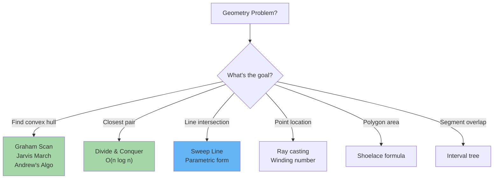

# Computational Geometry: Essential Algorithms

Computational geometry solves problems about points, lines, polygons, and their relationships efficiently.

---

## When Geometry Appears in Interviews



**When to expect geometry:**
- Given coordinates, find hull/extreme points
- Distance optimization (closest pair)
- Area/perimeter calculations
- Intersection detection
- Polygon containment

---

## 1. Convex Hull (Graham Scan)

**Problem:** Given points in 2D plane, find smallest convex polygon containing all points.

**Algorithm:** Sort by polar angle from lowest point, then sweep counterclockwise removing right turns.

```
Points: (0,0), (1,1), (2,0), (2,2), (0,2)

Step 1: Find lowest point (break ties by leftmost): (0,0)

Step 2: Sort by polar angle from (0,0):
  (2,0) angle=0°
  (1,1) angle≈45°
  (2,2) angle≈63°
  (0,2) angle=90°

Step 3: Sweep, remove right turns (ccw check):
  Hull = [(0,0), (2,0)]
  Add (1,1): CCW? Yes → Hull = [(0,0), (2,0), (1,1)]
  Add (2,2): CCW? Yes → Hull = [(0,0), (2,0), (1,1), (2,2)]
  Add (0,2): CCW? Yes → Hull = [(0,0), (2,0), (1,1), (2,2), (0,2)]

Result: Convex hull vertices in CCW order
```

### Key: Cross Product for CCW Test

```
Cross product of vectors (p1→p2) and (p2→p3):
  cp = (p2.x - p1.x) * (p3.y - p1.y) - (p2.y - p1.y) * (p3.x - p1.x)
  
  cp > 0: left turn (CCW) ✓
  cp < 0: right turn (clockwise) ✗
  cp = 0: collinear
```

### Complexity
| Operation | Time |
|-----------|------|
| Find starting point | O(n) |
| Sort by angle | O(n log n) |
| Sweep & check | O(n) |
| **Total** | **O(n log n)** |

### Implementation

**Python:**
```python
def convex_hull_graham(points):
    def cross(o, a, b):
        return (a[0] - o[0]) * (b[1] - o[1]) - (a[1] - o[1]) * (b[0] - o[0])
    
    points = sorted(set(points))
    if len(points) <= 1:
        return points
    
    # Build lower hull
    lower = []
    for p in points:
        while len(lower) >= 2 and cross(lower[-2], lower[-1], p) <= 0:
            lower.pop()
        lower.append(p)
    
    # Build upper hull
    upper = []
    for p in reversed(points):
        while len(upper) >= 2 and cross(upper[-2], upper[-1], p) <= 0:
            upper.pop()
        upper.append(p)
    
    return lower[:-1] + upper[:-1]

def point_in_convex_polygon(point, hull):
    """Check if point is inside convex polygon"""
    for i in range(len(hull)):
        p1, p2 = hull[i], hull[(i + 1) % len(hull)]
        if cross(p1, p2, point) < 0:
            return False
    return True
```

**Java:**
```java
import java.util.*;

public class ConvexHull {
    static class Point implements Comparable<Point> {
        int x, y;
        Point(int x, int y) { this.x = x; this.y = y; }
        
        @Override
        public int compareTo(Point p) {
            return x == p.x ? y - p.y : x - p.x;
        }
    }
    
    static long cross(Point o, Point a, Point b) {
        return (long)(a.x - o.x) * (b.y - o.y) - (long)(a.y - o.y) * (b.x - o.x);
    }
    
    public static List<Point> convexHull(int[][] points) {
        List<Point> pts = new ArrayList<>();
        for (int[] p : points) {
            pts.add(new Point(p[0], p[1]));
        }
        Collections.sort(pts);
        
        List<Point> lower = new ArrayList<>();
        for (Point p : pts) {
            while (lower.size() >= 2 && cross(lower.get(lower.size()-2), lower.get(lower.size()-1), p) <= 0) {
                lower.remove(lower.size()-1);
            }
            lower.add(p);
        }
        
        List<Point> upper = new ArrayList<>();
        for (int i = pts.size() - 1; i >= 0; i--) {
            Point p = pts.get(i);
            while (upper.size() >= 2 && cross(upper.get(upper.size()-2), upper.get(upper.size()-1), p) <= 0) {
                upper.remove(upper.size()-1);
            }
            upper.add(p);
        }
        
        lower.remove(lower.size()-1);
        upper.remove(upper.size()-1);
        lower.addAll(upper);
        return lower;
    }
}
```

---

## 2. Closest Pair of Points

**Problem:** Find two points with minimum distance from n points.

**Naive:** Check all pairs — O(n²).
**Optimal (Divide & Conquer):** Recursively solve left/right halves, then check strip between. O(n log n).

```
Divide: Split by x-coordinate median
Conquer: Closest pair in left half, right half
Combine: Check strip of width 2*d around median

Key: Strip contains at most 6 points (by packing argument)
So checking strip is O(n)
```

### Complexity
| Approach | Time |
|----------|------|
| Naive (all pairs) | O(n²) |
| **Divide & Conquer** | **O(n log n)** |

### Implementation

**Python:**
```python
def closest_pair(points):
    points = sorted(points)
    return closest_pair_rec(points)[0]

def distance(p1, p2):
    return ((p1[0] - p2[0])**2 + (p1[1] - p2[1])**2)**0.5

def closest_pair_rec(points):
    if len(points) <= 1:
        return (float('inf'), None, None)
    
    if len(points) == 2:
        d = distance(points[0], points[1])
        return (d, points[0], points[1])
    
    mid = len(points) // 2
    left_half = points[:mid]
    right_half = points[mid:]
    
    d1, p1a, p1b = closest_pair_rec(left_half)
    d2, p2a, p2b = closest_pair_rec(right_half)
    
    if d1 < d2:
        d, pa, pb = d1, p1a, p1b
    else:
        d, pa, pb = d2, p2a, p2b
    
    # Check strip around median
    median_x = points[mid][0]
    strip = [p for p in points if abs(p[0] - median_x) < d]
    
    for i in range(len(strip)):
        for j in range(i + 1, min(i + 7, len(strip))):
            d_strip = distance(strip[i], strip[j])
            if d_strip < d:
                d, pa, pb = d_strip, strip[i], strip[j]
    
    return (d, pa, pb)
```

**Java:**
```java
import java.util.*;

public class ClosestPair {
    static class Point implements Comparable<Point> {
        double x, y;
        Point(double x, double y) { this.x = x; this.y = y; }
        
        @Override
        public int compareTo(Point p) {
            return Double.compare(this.x, p.x);
        }
    }
    
    static double distance(Point p1, Point p2) {
        return Math.sqrt((p1.x - p2.x) * (p1.x - p2.x) + (p1.y - p2.y) * (p1.y - p2.y));
    }
    
    static class Pair {
        double dist;
        Point p1, p2;
        Pair(double dist, Point p1, Point p2) {
            this.dist = dist;
            this.p1 = p1;
            this.p2 = p2;
        }
    }
    
    static Pair closestPair(List<Point> points) {
        Collections.sort(points);
        return closestPairRec(points).get(0);
    }
    
    static List<Pair> closestPairRec(List<Point> points) {
        if (points.size() <= 1) {
            return Arrays.asList(new Pair(Double.MAX_VALUE, null, null));
        }
        if (points.size() == 2) {
            return Arrays.asList(new Pair(distance(points.get(0), points.get(1)), points.get(0), points.get(1)));
        }
        
        int mid = points.size() / 2;
        List<Point> left = points.subList(0, mid);
        List<Point> right = points.subList(mid, points.size());
        
        Pair p1 = closestPairRec(left).get(0);
        Pair p2 = closestPairRec(right).get(0);
        
        Pair best = p1.dist < p2.dist ? p1 : p2;
        
        List<Point> strip = new ArrayList<>();
        for (Point p : points) {
            if (Math.abs(p.x - points.get(mid).x) < best.dist) {
                strip.add(p);
            }
        }
        Collections.sort(strip, (a, b) -> Double.compare(a.y, b.y));
        
        for (int i = 0; i < strip.size(); i++) {
            for (int j = i + 1; j < Math.min(i + 7, strip.size()); j++) {
                double d = distance(strip.get(i), strip.get(j));
                if (d < best.dist) {
                    best = new Pair(d, strip.get(i), strip.get(j));
                }
            }
        }
        
        return Arrays.asList(best);
    }
}
```

---

## 3. Polygon Area (Shoelace Formula)

**Problem:** Given vertices of a polygon in order, compute its area.

**Formula:** Area = 1/2 * |sum of (x_i * y_(i+1) - x_(i+1) * y_i)|

```
Vertices: (0,0), (2,0), (2,2), (0,2)

Sum = (0*0 - 2*0) + (2*2 - 2*0) + (2*2 - 0*2) + (0*0 - 0*2)
    = 0 + 4 + 4 + 0 = 8

Area = |8| / 2 = 4 ✓
```

### Implementation

**Python:**
```python
def polygon_area(vertices):
    """Compute area using shoelace formula"""
    n = len(vertices)
    if n < 3:
        return 0
    
    area = 0
    for i in range(n):
        x1, y1 = vertices[i]
        x2, y2 = vertices[(i + 1) % n]
        area += x1 * y2 - x2 * y1
    
    return abs(area) / 2

def point_in_polygon(point, vertices):
    """Ray casting algorithm"""
    x, y = point
    n = len(vertices)
    inside = False
    
    p1x, p1y = vertices[0]
    for i in range(1, n + 1):
        p2x, p2y = vertices[i % n]
        if y > min(p1y, p2y):
            if y <= max(p1y, p2y):
                if x <= max(p1x, p2x):
                    if p1y != p2y:
                        xinters = (y - p1y) * (p2x - p1x) / (p2y - p1y) + p1x
                    if p1x == p2x or x <= xinters:
                        inside = not inside
        p1x, p1y = p2x, p2y
    
    return inside
```

**Java:**
```java
public class PolygonArea {
    public static double polygonArea(int[][] vertices) {
        int n = vertices.length;
        if (n < 3) return 0;
        
        double area = 0;
        for (int i = 0; i < n; i++) {
            int x1 = vertices[i][0], y1 = vertices[i][1];
            int x2 = vertices[(i + 1) % n][0], y2 = vertices[(i + 1) % n][1];
            area += x1 * y2 - x2 * y1;
        }
        
        return Math.abs(area) / 2.0;
    }
}
```

---

## Common Geometry Interview Questions

- **"Given points, find convex hull."** Use Graham scan or Andrew's monotone chain. O(n log n).

- **"Find the two closest points."** Divide and conquer: split by x-median, recurse, check strip. O(n log n).

- **"Check if point is inside polygon."** Ray casting: cast ray from point, count boundary crossings. Odd = inside.

- **"Given line segments, find all intersections."** Sweep line: sort events by x, maintain active segments, check adjacent pairs. O((n + k) log n) where k = intersections.

- **"Compute area of union of rectangles."** Coordinate compression + sweep line + segment tree. O(n² log n).

- **"Rotate/transform points."** Use rotation matrix. Counterclockwise by θ: [cos(θ) -sin(θ); sin(θ) cos(θ)].

---

## Geometry Checklist

- ✓ Cross product for orientation (ccw/cw)
- ✓ Distance formula: sqrt((x1-x2)² + (y1-y2)²)
- ✓ Convex hull: Graham or Andrew's monotone chain
- ✓ Closest pair: Divide & conquer O(n log n)
- ✓ Point in polygon: Ray casting
- ✓ Polygon area: Shoelace formula
- ✓ Line intersection: Parametric or slope-intercept
- ✓ Avoid floating point errors: use exact arithmetic where possible
