# Graph Algorithms

Eight fundamental graph algorithms covering shortest paths (single-source and all-pairs), minimum spanning trees, strongly connected components, topological ordering, and heuristic pathfinding — the complete set required for FAANG-level graph interview questions.

---

## Master Algorithm Decision Tree

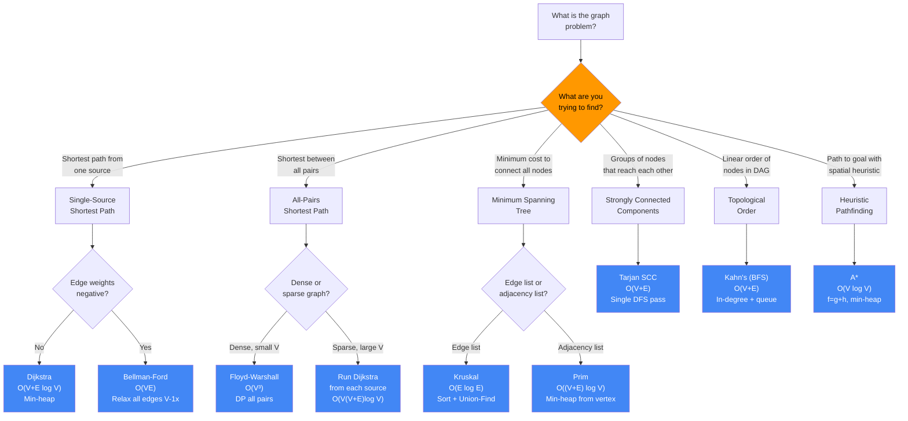

---

## Algorithms Covered

| Algorithm                  | Time              | Space     | Graph Type          | Purpose                      |
|----------------------------|:-----------------:|:---------:|:-------------------:|------------------------------|
| Dijkstra                   | O((V+E) log V)    | O(V+E)    | Directed/Undirected | Single-source shortest path  |
| Bellman-Ford               | O(V·E)            | O(V)      | Directed            | SSSP with negative edges     |
| Floyd-Warshall             | O(V³)             | O(V²)     | Directed/Undirected | All-pairs shortest path      |
| Kruskal's MST              | O(E log E)        | O(V)      | Undirected          | Minimum spanning tree        |
| Prim's MST                 | O((V+E) log V)    | O(V+E)    | Undirected          | Minimum spanning tree        |
| Tarjan's SCC               | O(V+E)            | O(V)      | Directed            | Strongly connected components|
| Topological Sort (Kahn's)  | O(V+E)            | O(V)      | Directed (DAG)      | Dependency ordering          |
| A* Search                  | O(V log V)        | O(V)      | Grid / weighted     | Heuristic shortest path      |

> V = vertices, E = edges

---

## Dijkstra's Algorithm

Single-source shortest paths for graphs with non-negative edge weights. Maintains a min-heap of `(distance, node)` pairs. At each step, extract the node with the smallest known distance and relax all its outgoing edges. Stale heap entries (outdated distances) are detected and skipped.

### Dijkstra Algorithm Flowchart
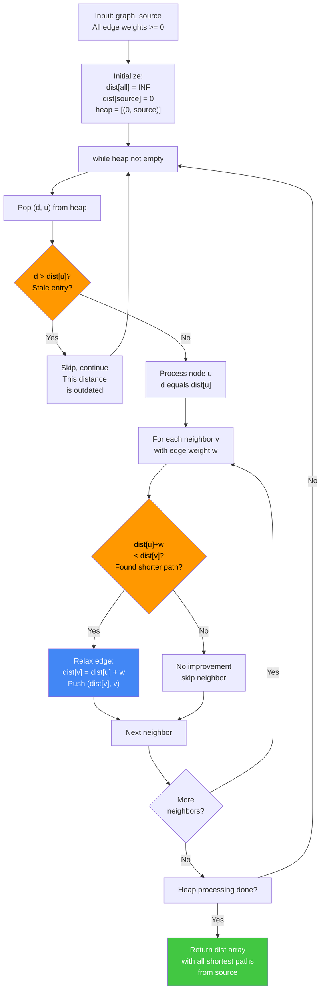

### Non-Negative Weight Check & Problem Recognition
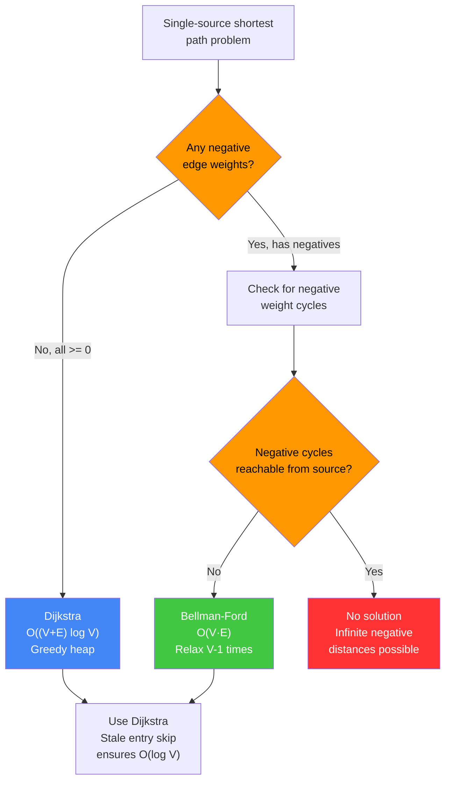

```
Graph:
  A --1--> B --2--> C
  |        |        |
  4        5        1
  |        |        |
  v        v        v
  C -----> D <------+

Adjacency: A:[B=1,C=4], B:[C=2,D=5], C:[D=1], D:[]

Initial: dist={A:0}, heap=[(0,A)]

Step 1: pop (0,A) → relax edges
  B: 0+1=1 < inf → dist[B]=1, push (1,B)
  C: 0+4=4 < inf → dist[C]=4, push (4,C)
  heap: [(1,B),(4,C)]

Step 2: pop (1,B) → relax edges
  C: 1+2=3 < 4   → dist[C]=3, push (3,C)
  D: 1+5=6 < inf → dist[D]=6, push (6,D)
  heap: [(3,C),(4,C),(6,D)]

Step 3: pop (3,C) → relax edges
  D: 3+1=4 < 6   → dist[D]=4, push (4,D)
  heap: [(4,C),(6,D),(4,D)]

Step 4: pop (4,C) → stale! dist[C]=3 < 4 → skip

Step 5: pop (4,D) → no outgoing edges

Step 6: pop (6,D) → stale! dist[D]=4 < 6 → skip

Final distances from A:
  A:0  B:1  C:3  D:4

Path A→D: D←C←B←A  →  [A, B, C, D]
```

**Key insight:** The stale-entry skip (`if d > dist[u]: continue`) is essential for correctness and efficiency. Dijkstra's greedy property — each node is finalized when first popped — is only valid when all edge weights are non-negative. One negative edge can invalidate the greedy assumption.

**When to use:** Road networks, network routing, any shortest-path problem with non-negative weights. LC 743, 787, 1631. Use Bellman-Ford when negative weights are present.

---

## Bellman-Ford Algorithm

Single-source shortest paths that handles negative-weight edges. Relaxes every edge in the graph V-1 times (the maximum number of edges on any shortest path without a cycle). A final relaxation pass detects negative-weight cycles: if any distance still decreases, a negative cycle is reachable.

### Bellman-Ford Algorithm Flowchart
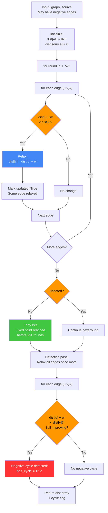

### Relaxation Rounds & Early Exit
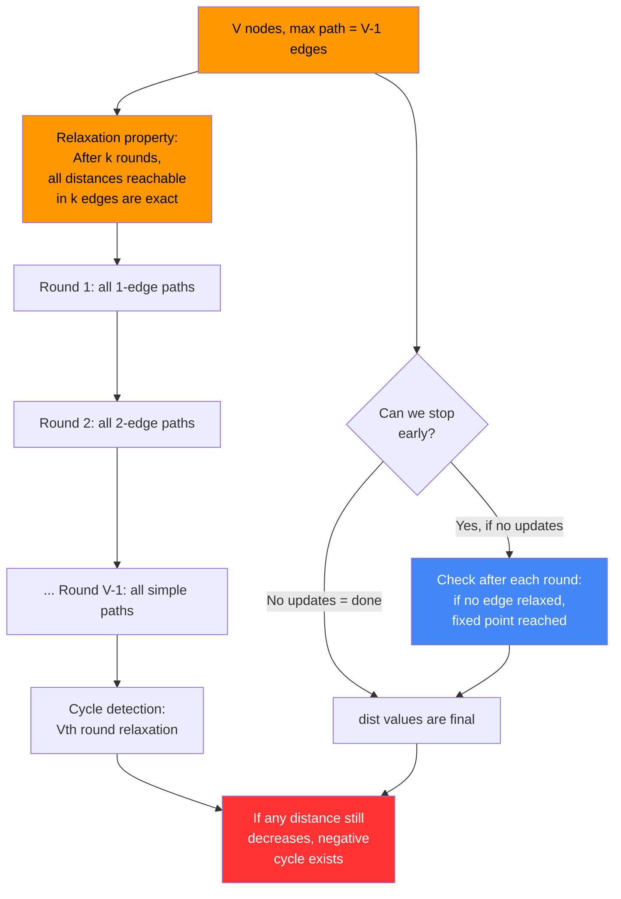

```
Graph: A--1-->B, A--4-->C, B--(-3)-->C, B--2-->D, C--3-->D

edges: [(A,B,1),(A,C,4),(B,C,-3),(B,D,2),(C,D,3)]
V=4 nodes → 3 relaxation rounds

Initial: dist={A:0, B:inf, C:inf, D:inf}

Round 1 (relax all edges once):
  (A,B,1):  dist[A]+1=1  < inf → dist[B]=1
  (A,C,4):  dist[A]+4=4  < inf → dist[C]=4
  (B,C,-3): dist[B]-3=-2 < 4  → dist[C]=-2
  (B,D,2):  dist[B]+2=3  < inf → dist[D]=3
  (C,D,3):  dist[C]+3=1  < 3  → dist[D]=1
  After R1: {A:0, B:1, C:-2, D:1}

Round 2: no distances improve → early exit (updated=False)

Detection pass (V-th relaxation):
  No edge relaxes → has_negative_cycle = False

Final: {A:0, B:1, C:-2, D:1}

--- Negative cycle example ---
Graph: A--1-->B, B--(-2)-->C, C--(-1)-->A
  (total cycle weight: 1-2-1 = -2 < 0)

After 2 rounds, dist[A] keeps decreasing.
Detection pass: dist[A] + 1 > dist[B]? No → dist[B] decreases → cycle=True
```

**Key insight:** V-1 relaxation rounds are sufficient because the shortest simple path uses at most V-1 edges. The Vth round can only relax if a cycle is traversed — and a decreasing cycle must be negative. Early exit when no update occurs skips unnecessary rounds.

**When to use:** When the graph may have negative edge weights but must detect or handle negative cycles. Currency arbitrage detection, OSPF/RIP routing protocols. Do NOT use when all weights are non-negative — Dijkstra is O((V+E) log V) vs. Bellman-Ford's O(V·E).

---

## Floyd-Warshall Algorithm

All-pairs shortest paths using dynamic programming on an N×N distance matrix. The key recurrence: for each intermediate node k, update `dist[i][j]` if routing through k gives a shorter path than the current direct route.

### Floyd-Warshall Algorithm Flowchart
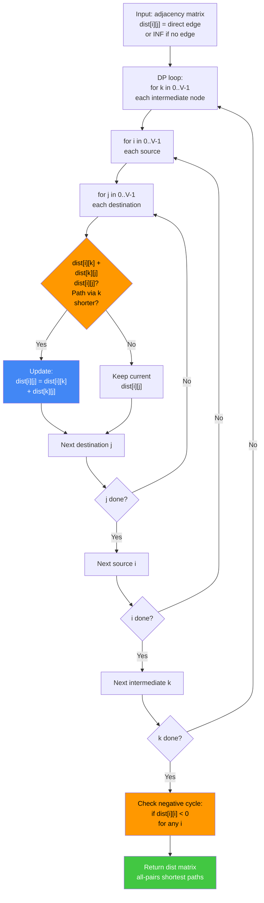

### All-Pairs vs Per-Source Decision
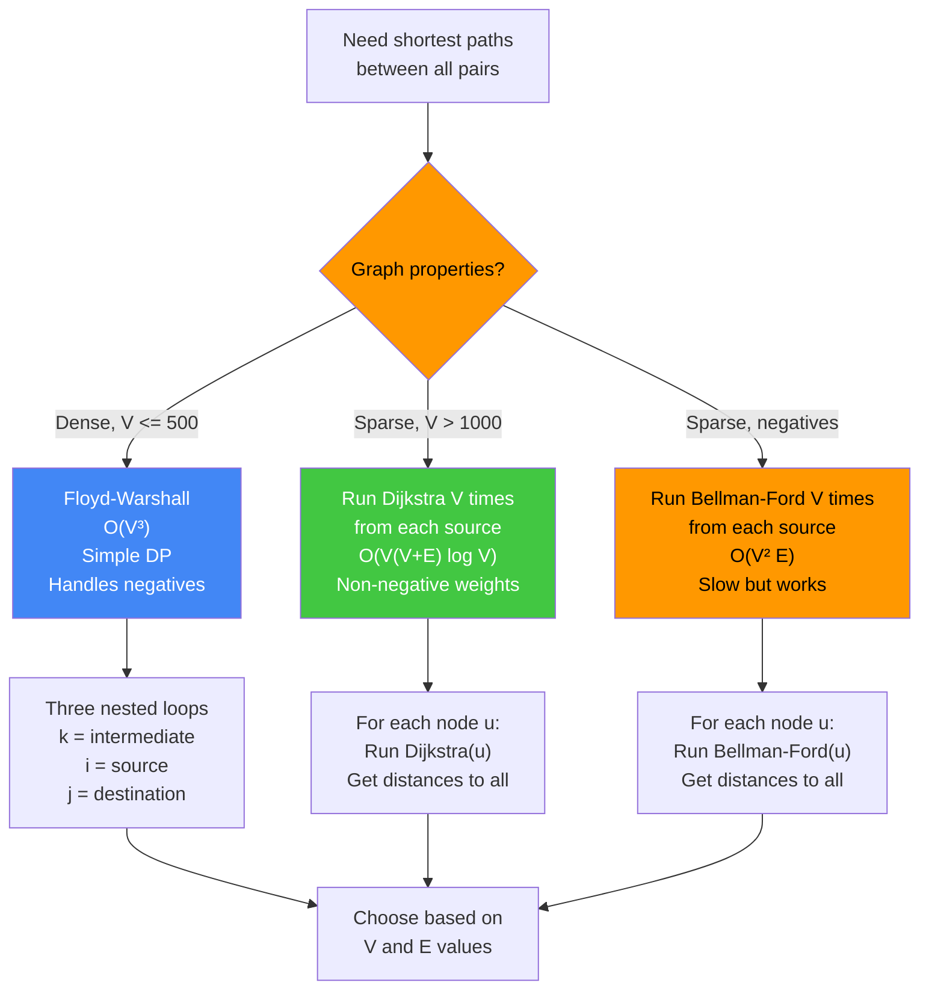

```
Input adjacency matrix (INF = no direct edge):

     0    1    2    3
0 [  0    3  INF    7 ]
1 [  8    0    2  INF ]
2 [  5  INF    0    1 ]
3 [  2  INF  INF    0 ]

Outer loop: for k in 0..3 (each intermediate node)
Inner loops: for all pairs (i, j):
  dist[i][j] = min(dist[i][j], dist[i][k] + dist[k][j])

After k=0 (route via node 0):
  dist[1][3]: min(INF, dist[1][0]+dist[0][3]) = min(INF, 8+7) = 15
  dist[2][1]: min(INF, dist[2][0]+dist[0][1]) = min(INF, 5+3) = 8
  dist[3][1]: min(INF, dist[3][0]+dist[0][1]) = min(INF, 2+3) = 5
  dist[3][2]: min(INF, dist[3][0]+dist[0][2]) = min(INF, 2+INF) = INF
  ...

After all k:
     0    1    2    3
0 [  0    3    5    6 ]
1 [  5    0    2    3 ]
2 [  3    6    0    1 ]
3 [  2    5    7    0 ]

E.g., shortest path 0→2: 0→3→0? No. 0→1→2: 3+2=5 ✓
Negative cycle detection: if dist[i][i] < 0 for any i, a negative cycle exists.
```

**Key insight:** The DP state is "shortest path from i to j using only nodes 0..k as intermediates." After processing all k nodes, the full shortest-path problem is solved. The algorithm is correct even with negative edges (but not negative cycles). Time O(V³) is only acceptable for small dense graphs (V ≤ 500 in competitive programming).

**When to use:** Small dense graphs where all-pairs distances are needed. Network reachability, transitive closure, detecting negative cycles. For sparse graphs with V > 1000, run Dijkstra from each source instead.

---

## Kruskal's MST

Minimum Spanning Tree by greedily adding the cheapest edge that does not form a cycle. Sort all edges by weight, then process in order: add the edge if its two endpoints are in different components (checked using Union-Find with path compression and union by rank).

### Kruskal's MST Algorithm Flowchart
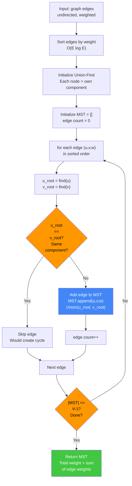

### MST Algorithm Choice: Kruskal vs Prim
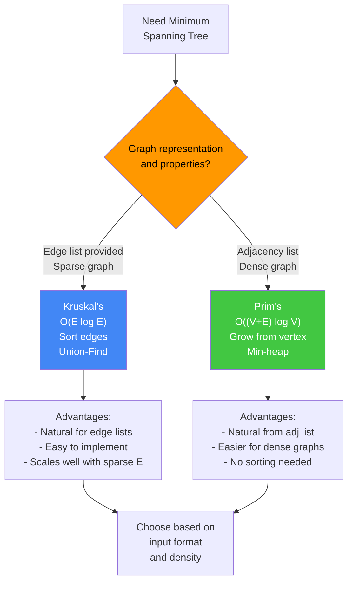

```
Vertices: {0,1,2,3,4}
Edges (sorted by weight): (2,3,4),(4,2,3),(5,0,3),(6,0,2),(10,0,1),(15,1,4)

Union-Find: parent={0:0,1:1,2:2,3:3,4:4}

Process (2,3,4): find(3)=3, find(4)=4 → different → UNION, add edge
  MST: [(2,3,4)]   total=2
  parent: 4→3 (or 3→4)

Process (4,2,3): find(2)=2, find(3)=3 → different → UNION, add edge
  MST: [(2,3,4),(4,2,3)]   total=6
  parent: 3→2 (merged component: {2,3,4})

Process (5,0,3): find(0)=0, find(3)→find(2)=2 → different → UNION, add edge
  MST: [(2,3,4),(4,2,3),(5,0,3)]   total=11
  parent: 2→0 (component: {0,2,3,4})

Process (6,0,2): find(0)=0, find(2)→0 → SAME → skip (would form cycle)

Process (10,0,1): find(0)=0, find(1)=1 → different → UNION, add edge
  MST: [(2,3,4),(4,2,3),(5,0,3),(10,0,1)]   total=21
  |MST| = V-1 = 4 → DONE

Final MST edges: [(2,3,4),(4,2,3),(5,0,3),(10,0,1)]
Total weight: 21
```

**Key insight:** A spanning tree of V nodes has exactly V-1 edges. Kruskal's terminates as soon as V-1 edges are added. The Union-Find with path compression ensures `find` and `union` run in near-O(1) amortized time (inverse Ackermann function). The sorting step dominates at O(E log E).

**When to use:** Sparse graphs (E close to V). Natural when edges are already provided as a sorted list. Kruskal's is easier to implement from scratch than Prim's when graph is given as an edge list. LC 1135, 1584.

---

## Prim's MST

Grow the MST one vertex at a time by always adding the cheapest edge that connects a visited vertex to an unvisited vertex. Uses a min-heap of `(weight, from, to)` edges. At each step, pop the minimum-weight edge and add the destination if not yet visited.

### Prim's MST Algorithm Flowchart
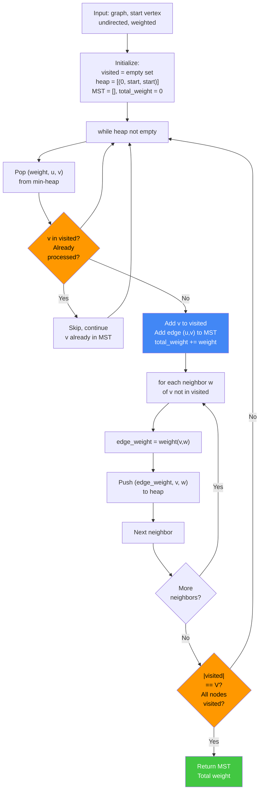

### Prim's vs Kruskal Comparison
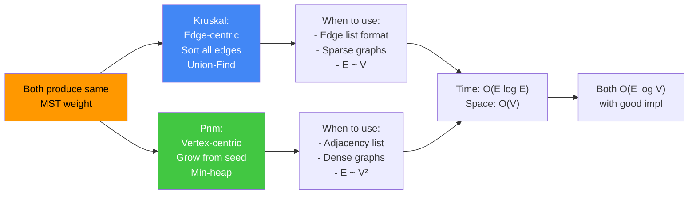

```
Graph (undirected):
  0 --10-- 1
  |  \     |
  6   5   15
  |    \   |
  2 --4-- 3 --2-- 4

Adjacency: 0:[(1,10),(2,6),(3,5)], 1:[(0,10),(4,15)],
           2:[(0,6),(3,4)], 3:[(0,5),(2,4),(4,2)], 4:[(1,15),(3,2)]

Start at node 0:
  heap=[(0,0,0)]  visited={}

Pop (0,0,0): visit 0, skip seed edge (u==v)
  Push: (10,0,1),(6,0,2),(5,0,3)
  heap=[(5,0,3),(6,0,2),(10,0,1)]

Pop (5,0,3): visit 3, add edge 0→3 weight=5
  Push: (4,3,2),(2,3,4)  (skip 0, already visited)
  MST: [(0,3,5)]  total=5
  heap=[(2,3,4),(6,0,2),(10,0,1),(4,3,2)]

Pop (2,3,4): visit 4, add edge 3→4 weight=2
  Push: (15,4,1) (skip 3)
  MST: [(0,3,5),(3,4,2)]  total=7
  heap=[(4,3,2),(6,0,2),(10,0,1),(15,4,1)]

Pop (4,3,2): visit 2, add edge 3→2 weight=4
  Push: (6,2,0)→skip (0 visited)
  MST: [(0,3,5),(3,4,2),(3,2,4)]  total=11

Pop (6,0,2): 2 already visited → skip

Pop (10,0,1): visit 1, add edge 0→1 weight=10
  MST: [(0,3,5),(3,4,2),(3,2,4),(0,1,10)]  total=21

|MST|=4=V-1 → done.  Total weight: 21
```

**Key insight:** Prim's and Kruskal's produce the same MST weight (the MST is unique when all edge weights are distinct). Prim's is vertex-centric (grow from a seed), Kruskal's is edge-centric (sort all edges). Prim's with a Fibonacci heap achieves O(E + V log V) — better for dense graphs.

**When to use:** Dense graphs (E close to V²). Graph given as an adjacency list from a source node. Prim's naturally handles connected components by choosing a start vertex. LC 1135, 1584.

---

## Tarjan's SCC

Finds all Strongly Connected Components (groups of nodes where every node can reach every other) in a directed graph using a single DFS pass. Maintains a discovery timestamp (`index`) and a low-link value (`low_link[v]` = smallest index reachable from v's subtree). A node v is an SCC root when `low_link[v] == index[v]`.

### Tarjan's SCC Algorithm Flowchart
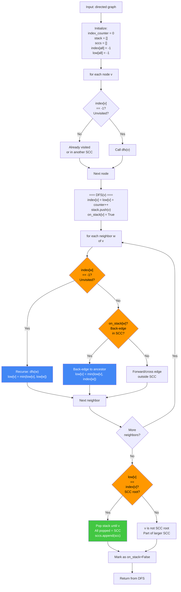

### SCC Detection Decision Tree
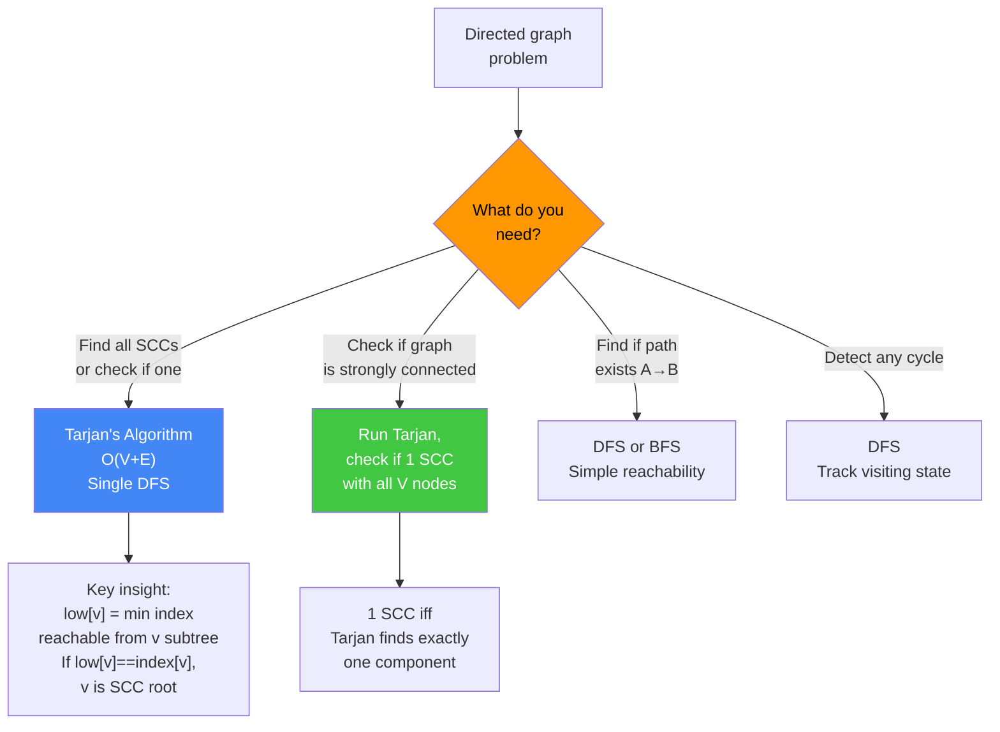

```
Graph (directed):
  0→1, 1→2, 2→0, 2→3, 3→4, 4→5, 5→3

DFS from 0 (index order):

Visit 0: index[0]=low[0]=0, stack=[0]
  Visit 1: index[1]=low[1]=1, stack=[0,1]
    Visit 2: index[2]=low[2]=2, stack=[0,1,2]
      Edge 2→0: 0 on stack → low[2]=min(2,index[0])=0
      Edge 2→3:
        Visit 3: index[3]=low[3]=3, stack=[0,1,2,3]
          Edge 3→4:
            Visit 4: index[4]=low[4]=4, stack=[0,1,2,3,4]
              Edge 4→5:
                Visit 5: index[5]=low[5]=5, stack=[0,1,2,3,4,5]
                  Edge 5→3: 3 on stack → low[5]=min(5,3)=3
                  low[5]==5? No (low[5]=3≠index[5]=5)... wait:
                  low[5]=3, index[5]=5 → NOT a root
                Back at 4: low[4]=min(4,low[5])=min(4,3)=3
              low[4]=3≠index[4]=4 → not a root
            Back at 3: low[3]=min(3,low[4])=3
          low[3]=3=index[3]=3 → ROOT!
          Pop stack until 3: pop 5,4,3 → SCC=[5,4,3]

      Back at 2: low[2]=min(0,low[3]) = 0
    low[2]=0≠index[2]=2 → not a root
  Back at 1: low[1]=min(1,low[2])=0
  low[1]=0≠1 → not a root
Back at 0: low[0]=min(0,low[1])=0
low[0]=0=index[0]=0 → ROOT!
Pop stack until 0: pop 2,1,0 → SCC=[2,1,0]

Final SCCs: [[3,4,5], [0,1,2]]
```

**Key insight:** `low_link[v]` tracks the lowest discovery index reachable via DFS tree edges and back-edges from v's subtree. When `low_link[v] == index[v]`, no back-edge leaves v's subtree to an older node — meaning v's subtree forms a closed SCC.

**When to use:** Detect cycles in directed graphs, find 2-SAT solutions, decompose a graph into its SCC condensation DAG. LC 1192 (critical connections), 1568. Key prerequisite for many advanced graph problems.

---

## Topological Sort (Kahn's Algorithm)

Produce a linear ordering of nodes in a DAG such that for every directed edge u→v, u appears before v. Kahn's BFS-based approach: compute in-degrees of all nodes, start with all zero-in-degree nodes, repeatedly remove a node and decrement its neighbors' in-degrees, adding newly zero-degree nodes to the queue. A cycle is detected when the output ordering is shorter than the total node count.

### Kahn's Topological Sort Algorithm Flowchart
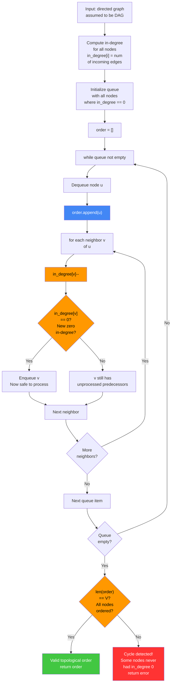

### DAG Cycle Detection & Ordering
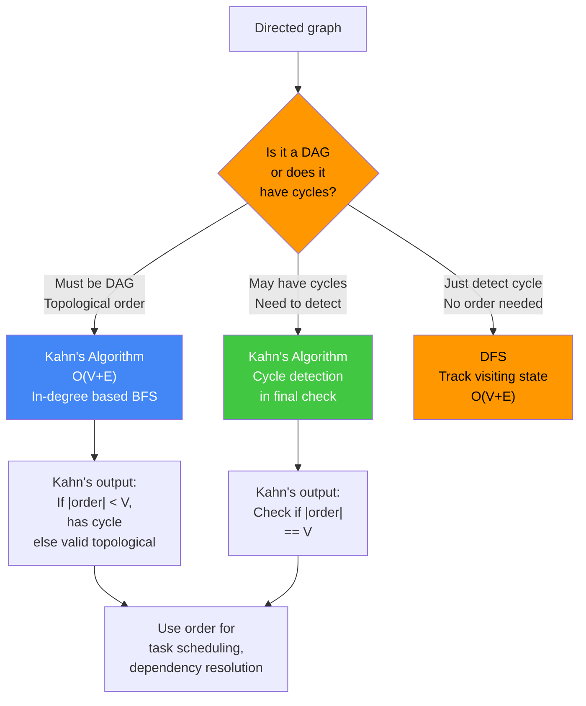

```
DAG:
  5→2, 5→0, 4→0, 4→1, 2→3, 3→1

In-degree computation:
  node: 0  1  2  3  4  5
  in:   2  2  1  1  0  0

Initial queue (in-degree 0): [5, 4]  (or [4, 5])

Process 5: order=[5], decrement neighbors 2 and 0
  in-degree: 0:1, 2:0 → add 2 to queue
  queue=[4,2]

Process 4: order=[5,4], decrement neighbors 0 and 1
  in-degree: 0:0, 1:1 → add 0 to queue
  queue=[2,0]

Process 2: order=[5,4,2], decrement neighbor 3
  in-degree: 3:0 → add 3 to queue
  queue=[0,3]

Process 0: order=[5,4,2,0], no outgoing edges
  queue=[3]

Process 3: order=[5,4,2,0,3], decrement neighbor 1
  in-degree: 1:0 → add 1 to queue
  queue=[1]

Process 1: order=[5,4,2,0,3,1]

len(order)=6 = len(nodes)=6 → no cycle

--- Cycle detection ---
Graph: 0→1, 1→2, 2→0
  in-degree: 0:1, 1:1, 2:1
  No zero-in-degree node → queue empty immediately
  order=[] length 0 ≠ 3 → has_cycle=True
```

**Key insight:** Any node that enters the queue has no remaining unprocessed predecessors, so it is safe to emit. When a cycle exists, all nodes in the cycle have in-degree >= 1 forever — they never enter the queue, so the output is incomplete.

**When to use:** Build systems (Makefile, Gradle), course prerequisite scheduling (LC 207, 210), dependency resolution, detecting cycles in directed graphs. Kahn's is preferred over DFS-based topological sort when cycle detection is also needed.

---

## A* Search (2-D Grid)

Informed shortest-path search that uses a heuristic function to guide exploration toward the goal. Each node has a score `f(n) = g(n) + h(n)` where `g(n)` is the actual cost from start and `h(n)` is the heuristic estimate to the goal (Manhattan distance for grid movement). Nodes are expanded in order of `f` score via a min-heap.

```
Grid (0=passable, 1=blocked), start=(0,0), goal=(4,4):

  . . . . .        S = start (0,0)
  X X . X .        G = goal  (4,4)
  . . . . .        X = blocked
  . X X X .
  . . . . G

h(node) = |row - 4| + |col - 4|  (Manhattan distance)

Initial: g={(0,0):0}, f={(0,0):8}, heap=[(8,(0,0))]

Pop (8,(0,0)): expand neighbors
  (0,1): g=1, h=7, f=8  → push (8,(0,1))
  (1,0): blocked → skip

Pop (8,(0,1)): expand
  (0,2): g=2, h=6, f=8  → push (8,(0,2))
  (1,1): blocked → skip
  (0,0): g=1 not < g[0,0]=0 → skip

Pop (8,(0,2)): expand
  (0,3): g=3, h=5, f=8
  (1,2): g=3, h=5, f=8  (not blocked)

... algorithm continues preferring nodes with lower f scores
    (nodes along the top row have consistent f=8 due to
     Manhattan distance being admissible)

Path found: (0,0)→(0,1)→(0,2)→(1,2)→(2,2)→(2,3)→(2,4)→(3,4)→(4,4)
Cost: 8 steps
```

**Key insight:** A* is optimal and complete when the heuristic is admissible (never overestimates the true cost) and consistent (h(n) <= cost(n→n') + h(n')). Manhattan distance is both admissible and consistent for grid movement without diagonals. A* with h=0 reduces to Dijkstra; A* with a perfect heuristic expands only nodes on the optimal path.

**When to use:** Grid pathfinding, map navigation (GPS), game AI movement. A* is preferred over Dijkstra when a goal node is known and a good heuristic is available — it expands far fewer nodes. LC 1091 (BFS on grid), 675 (A* or BFS with state).

---

## Choosing the Right Algorithm

| Scenario                                               | Algorithm               |
|--------------------------------------------------------|-------------------------|
| Shortest path, non-negative weights, single source     | Dijkstra                |
| Shortest path, negative weights or cycle detection     | Bellman-Ford            |
| Shortest path between all pairs                        | Floyd-Warshall          |
| MST, sparse graph or edge list input                   | Kruskal                 |
| MST, dense graph or adjacency list input               | Prim                    |
| Strongly connected components in directed graph        | Tarjan's SCC            |
| Topological order, cycle detection in DAG              | Kahn's (BFS)            |
| Shortest path to specific goal with spatial heuristic  | A*                      |

**Key decision factors:**
- Negative weights? → Bellman-Ford (single source) or Floyd-Warshall (all pairs).
- All-pairs needed? → Floyd-Warshall for dense/small graphs; Dijkstra × V for sparse.
- MST: Kruskal for edge-list input, Prim for adjacency-list with a known start vertex.
- Goal-directed pathfinding on a grid? → A* with Manhattan heuristic.

---

## Common Interview Questions

- **Why can't Dijkstra handle negative edge weights?** Dijkstra's greedy invariant is: once a node is popped from the heap, its distance is final. A negative edge could allow a path through an already-popped node to have a shorter distance, violating the invariant. Example: A→B=1, A→C=2, C→B=-2; Dijkstra finalizes B at distance 1 but the true shortest is A→C→B=0.
- **What is the difference between Kruskal's and Prim's MST algorithms?** Kruskal's is edge-centric: sort all edges, use Union-Find to avoid cycles. Prim's is vertex-centric: grow a tree from a seed using a priority queue of crossing edges. Both produce the same MST weight. Kruskal's is simpler from an edge list; Prim's is more natural from an adjacency list.
- **How does Tarjan's algorithm detect SCC roots?** A node v is an SCC root when `low_link[v] == index[v]`, meaning no node in v's DFS subtree has a back-edge to an ancestor outside the subtree. At this point, all nodes above v on the DFS stack (up to and including v) form an SCC.
- **Explain the difference between topological sort and BFS.** BFS explores nodes in order of distance (hop count) from a source, regardless of edge direction. Topological sort is only valid for DAGs and produces a linear ordering where each node's predecessors appear before it. Kahn's algorithm is BFS-based but uses in-degree rather than distance.
- **What makes a heuristic admissible for A*?** A heuristic h(n) is admissible if it never overestimates the true cost to reach the goal from n. Manhattan distance is admissible for grid movement without diagonals because any path must traverse at least |Δrow| + |Δcol| steps. If h is inadmissible, A* may skip the optimal path.
- **How do you reconstruct the shortest path from Dijkstra's output?** During relaxation, store a predecessor map `pred[v] = u` whenever `dist[u] + w < dist[v]`. To reconstruct the path to a destination, walk backwards: `dest → pred[dest] → pred[pred[dest]] → ... → start`, then reverse.
- **When would you choose Floyd-Warshall over running Dijkstra from each source?** Floyd-Warshall has O(V³) time and is simpler to implement. For dense graphs (E ~ V²), running Dijkstra from each source costs O(V · (V+E) log V) = O(V³ log V) — worse. Floyd-Warshall wins for small dense graphs. For large sparse graphs (E ~ V), per-source Dijkstra at O(V · (V+E) log V) = O(V² log V) wins.
- **How does Kahn's algorithm detect cycles?** If a cycle exists, all nodes in the cycle maintain in-degree >= 1 throughout the algorithm — they can never enter the BFS queue. After the queue empties, `len(order) < len(total_nodes)` indicates that some nodes were never processed, proving a cycle exists. The unprocessed nodes are exactly those in or downstream of cycles.
- **How do you detect negative cycles with Bellman-Ford?** Run V-1 relaxation rounds normally. Then perform one additional (Vth) relaxation pass. If any edge `(u, v, w)` still satisfies `dist[u] + w < dist[v]`, a negative cycle is reachable from the source. The node v updated in the Vth pass is on or reachable from a negative cycle.
- **When should you use Prim's vs Kruskal's?** Choose Kruskal's when edges are provided as a list and the graph is sparse (E ~ V). Choose Prim's when the graph is dense (E ~ V²) or given as an adjacency list from a known start vertex. Kruskal's dominates when sorting edges is cheap; Prim's is better for dense graphs where sorting all edges would be expensive (E log E can be large when E ~ V²).
- **How does topological sort relate to cycle detection?** Kahn's topological sort naturally detects cycles: if the output ordering has fewer nodes than the total node count, a cycle exists. Nodes in cycles can never have their in-degree reduced to 0 (because their cycle predecessor always maintains in-degree ≥ 1). DFS-based topological sort detects cycles by identifying back edges (reaching a gray/visiting node).
- **Difference between Kahn's BFS and DFS approaches for topological sort?** Kahn's (BFS): iterative, processes nodes in in-degree order, naturally detects cycles via output length check. DFS-based: recursive, post-order finish times reversed give topological order, detects cycles via back edges (gray node encountered). Both are O(V+E). Kahn's is preferred for cycle detection; DFS post-order is useful when you also need SCC analysis.
- **How does A* guarantee optimality?** A* is optimal when the heuristic is admissible (h(n) ≤ true cost to goal) and consistent (h(n) ≤ cost(n→n') + h(n')). Consistency implies that when a node is first popped from the heap, its g-score is optimal (similar to Dijkstra's invariant). An admissible but inconsistent heuristic may still find the optimal path but may re-expand nodes.
- **Find all bridges in a graph (Tarjan's bridge finding).** A bridge is an edge whose removal disconnects the graph. Use DFS with discovery times and low-link values. Edge (u, v) is a bridge if `low[v] > disc[u]` (the subtree rooted at v cannot reach u or any ancestor of u via a back-edge). This differs from SCC: for bridges, use `low[v] > disc[u]` (strict); for articulation points use `low[v] >= disc[u]`.
- **Explain Tarjan's SCC algorithm with a concrete example.** Maintain a stack of nodes and two arrays: `disc[v]` (discovery time) and `low[v]` (lowest disc reachable from v's subtree). DFS assigns disc[v]=low[v]=counter++, pushes v on stack. For each neighbor w: if unvisited, recurse and update `low[v] = min(low[v], low[w])`; if w is on stack (back-edge), `low[v] = min(low[v], disc[w])`. After all neighbors, if `low[v]==disc[v]`, pop the stack until v — all popped nodes form one SCC.

---

## Java Implementations

### Dijkstra (Java)
```java
import java.util.*;

public class Dijkstra {
    public int[] dijkstra(Map<Integer, List<int[]>> graph, int src, int V) {
        int[] dist = new int[V];
        Arrays.fill(dist, Integer.MAX_VALUE);
        dist[src] = 0;
        // PriorityQueue: [distance, node]
        PriorityQueue<int[]> heap = new PriorityQueue<>(Comparator.comparingInt(a -> a[0]));
        heap.offer(new int[]{0, src});
        while (!heap.isEmpty()) {
            int[] top = heap.poll();
            int d = top[0], u = top[1];
            if (d > dist[u]) continue;  // stale entry
            for (int[] edge : graph.getOrDefault(u, List.of())) {
                int v = edge[0], w = edge[1];
                if (dist[u] + w < dist[v]) {
                    dist[v] = dist[u] + w;
                    heap.offer(new int[]{dist[v], v});
                }
            }
        }
        return dist;
    }
}
```

### Bellman-Ford (Java)
```java
public class BellmanFord {
    public int[] bellmanFord(int V, int[][] edges, int src) {
        int[] dist = new int[V];
        Arrays.fill(dist, Integer.MAX_VALUE);
        dist[src] = 0;
        for (int round = 0; round < V - 1; round++) {
            boolean updated = false;
            for (int[] e : edges) {
                int u = e[0], v = e[1], w = e[2];
                if (dist[u] != Integer.MAX_VALUE && dist[u] + w < dist[v]) {
                    dist[v] = dist[u] + w;
                    updated = true;
                }
            }
            if (!updated) break;  // early exit
        }
        // Negative cycle detection
        for (int[] e : edges) {
            if (dist[e[0]] != Integer.MAX_VALUE && dist[e[0]] + e[2] < dist[e[1]])
                throw new IllegalStateException("Negative cycle detected");
        }
        return dist;
    }
}
```

### Floyd-Warshall (Java)
```java
public class FloydWarshall {
    public int[][] floydWarshall(int[][] dist, int V) {
        int[][] d = new int[V][V];
        for (int i = 0; i < V; i++) d[i] = dist[i].clone();
        for (int k = 0; k < V; k++)
            for (int i = 0; i < V; i++)
                for (int j = 0; j < V; j++)
                    if (d[i][k] != Integer.MAX_VALUE && d[k][j] != Integer.MAX_VALUE)
                        d[i][j] = Math.min(d[i][j], d[i][k] + d[k][j]);
        // Negative cycle: d[i][i] < 0
        return d;
    }
}
```

### Kruskal's MST (Java)
```java
public class Kruskal {
    int[] parent, rank;
    int find(int x) {
        if (parent[x] != x) parent[x] = find(parent[x]);
        return parent[x];
    }
    boolean union(int x, int y) {
        int px = find(x), py = find(y);
        if (px == py) return false;
        if (rank[px] < rank[py]) { int t = px; px = py; py = t; }
        parent[py] = px;
        if (rank[px] == rank[py]) rank[px]++;
        return true;
    }
    public int kruskal(int V, int[][] edges) {
        Arrays.sort(edges, Comparator.comparingInt(e -> e[2]));
        parent = new int[V]; rank = new int[V];
        for (int i = 0; i < V; i++) parent[i] = i;
        int cost = 0, count = 0;
        for (int[] e : edges) {
            if (union(e[0], e[1])) {
                cost += e[2];
                if (++count == V - 1) break;
            }
        }
        return cost;
    }
}
```

### Prim's MST (Java)
```java
public class Prim {
    public int prim(Map<Integer, List<int[]>> graph, int V) {
        boolean[] visited = new boolean[V];
        PriorityQueue<int[]> heap = new PriorityQueue<>(Comparator.comparingInt(a -> a[0]));
        heap.offer(new int[]{0, 0, 0});  // weight, from, to
        int total = 0;
        while (!heap.isEmpty()) {
            int[] e = heap.poll();
            int w = e[0], v = e[2];
            if (visited[v]) continue;
            visited[v] = true;
            total += w;
            for (int[] next : graph.getOrDefault(v, List.of())) {
                if (!visited[next[0]]) heap.offer(new int[]{next[1], v, next[0]});
            }
        }
        return total;
    }
}
```

### Tarjan's SCC (Java)
```java
public class TarjanSCC {
    int[] disc, low;
    boolean[] onStack;
    Deque<Integer> stack;
    List<List<Integer>> sccs;
    int timer;

    public List<List<Integer>> tarjan(Map<Integer, List<Integer>> graph, int V) {
        disc = new int[V]; low = new int[V];
        Arrays.fill(disc, -1);
        onStack = new boolean[V];
        stack = new ArrayDeque<>();
        sccs = new ArrayList<>();
        timer = 0;
        for (int v = 0; v < V; v++)
            if (disc[v] == -1) dfs(graph, v);
        return sccs;
    }

    private void dfs(Map<Integer, List<Integer>> graph, int v) {
        disc[v] = low[v] = timer++;
        stack.push(v); onStack[v] = true;
        for (int w : graph.getOrDefault(v, List.of())) {
            if (disc[w] == -1) {
                dfs(graph, w);
                low[v] = Math.min(low[v], low[w]);
            } else if (onStack[w]) {
                low[v] = Math.min(low[v], disc[w]);
            }
        }
        if (low[v] == disc[v]) {
            List<Integer> scc = new ArrayList<>();
            while (true) {
                int w = stack.pop(); onStack[w] = false; scc.add(w);
                if (w == v) break;
            }
            sccs.add(scc);
        }
    }
}
```

### Topological Sort / Kahn's (Java)
```java
public class TopologicalSort {
    public List<Integer> kahnSort(Map<Integer, List<Integer>> graph, int V) {
        int[] inDeg = new int[V];
        for (int u = 0; u < V; u++)
            for (int v : graph.getOrDefault(u, List.of())) inDeg[v]++;
        Queue<Integer> queue = new LinkedList<>();
        for (int i = 0; i < V; i++) if (inDeg[i] == 0) queue.offer(i);
        List<Integer> order = new ArrayList<>();
        while (!queue.isEmpty()) {
            int u = queue.poll(); order.add(u);
            for (int v : graph.getOrDefault(u, List.of()))
                if (--inDeg[v] == 0) queue.offer(v);
        }
        return order.size() == V ? order : Collections.emptyList(); // empty = cycle
    }
}
```

### A* Search (Java)
```java
public class AStar {
    int[] dr = {-1,1,0,0}, dc = {0,0,-1,1};

    public int astar(int[][] grid, int[] start, int[] goal) {
        int m = grid.length, n = grid[0].length;
        int[][] g = new int[m][n];
        for (int[] row : g) Arrays.fill(row, Integer.MAX_VALUE);
        g[start[0]][start[1]] = 0;
        PriorityQueue<int[]> heap = new PriorityQueue<>(Comparator.comparingInt(a -> a[0]));
        heap.offer(new int[]{heuristic(start, goal), start[0], start[1]});
        while (!heap.isEmpty()) {
            int[] curr = heap.poll();
            int r = curr[1], c = curr[2];
            if (r == goal[0] && c == goal[1]) return g[r][c];
            if (curr[0] - heuristic(new int[]{r,c}, goal) > g[r][c]) continue;
            for (int d = 0; d < 4; d++) {
                int nr = r + dr[d], nc = c + dc[d];
                if (nr < 0 || nr >= m || nc < 0 || nc >= n || grid[nr][nc] == 1) continue;
                int ng = g[r][c] + 1;
                if (ng < g[nr][nc]) {
                    g[nr][nc] = ng;
                    heap.offer(new int[]{ng + heuristic(new int[]{nr,nc}, goal), nr, nc});
                }
            }
        }
        return -1;
    }

    private int heuristic(int[] a, int[] b) {
        return Math.abs(a[0]-b[0]) + Math.abs(a[1]-b[1]);
    }
}
```

---

## Additional Algorithms

### Bipartite Check (BFS Coloring)

A graph is bipartite if nodes can be 2-colored such that no adjacent nodes share a color. Equivalent to containing no odd-length cycles.

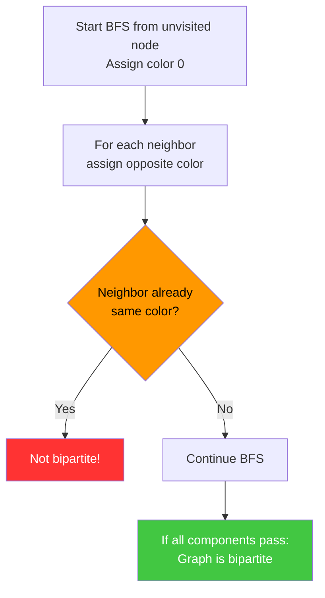

```python
from collections import deque

def is_bipartite(graph: dict, V: int) -> bool:
    """BFS 2-coloring check for bipartite. O(V+E)."""
    color = [-1] * V
    for start in range(V):
        if color[start] != -1:
            continue
        color[start] = 0
        queue = deque([start])
        while queue:
            u = queue.popleft()
            for v in graph.get(u, []):
                if color[v] == -1:
                    color[v] = 1 - color[u]
                    queue.append(v)
                elif color[v] == color[u]:
                    return False  # conflict: not bipartite
    return True
```

```java
public boolean isBipartite(Map<Integer, List<Integer>> graph, int V) {
    int[] color = new int[V];
    Arrays.fill(color, -1);
    for (int start = 0; start < V; start++) {
        if (color[start] != -1) continue;
        color[start] = 0;
        Queue<Integer> queue = new LinkedList<>();
        queue.offer(start);
        while (!queue.isEmpty()) {
            int u = queue.poll();
            for (int v : graph.getOrDefault(u, List.of())) {
                if (color[v] == -1) { color[v] = 1 - color[u]; queue.offer(v); }
                else if (color[v] == color[u]) return false;
            }
        }
    }
    return true;
}
```

**When to use:** Matching algorithms (Hungarian, Hopcroft-Karp), scheduling with two groups, conflict detection. A graph with an odd cycle is not bipartite.

---

### Johnson's Algorithm (All-Pairs Shortest Paths, Sparse Graphs)

Johnson's algorithm efficiently computes all-pairs shortest paths on sparse graphs with possibly negative edges (but no negative cycles). It uses Bellman-Ford once to reweight edges (making all non-negative), then runs Dijkstra from each vertex.

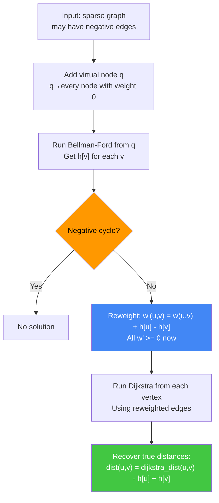

```python
import heapq

def johnson(V: int, edges: list) -> list:
    """Johnson's all-pairs shortest paths. O(V² log V + VE) time."""
    INF = float('inf')
    # Add virtual source q = V
    augmented = edges + [(V, v, 0) for v in range(V)]

    # Bellman-Ford from virtual source
    h = [INF] * (V + 1)
    h[V] = 0
    for _ in range(V):
        for u, v, w in augmented:
            if h[u] + w < h[v]:
                h[v] = h[u] + w

    # Check negative cycle
    for u, v, w in augmented:
        if h[u] + w < h[v]:
            raise ValueError("Negative cycle detected")

    # Build reweighted adjacency list
    graph = {i: [] for i in range(V)}
    for u, v, w in edges:
        graph[u].append((v, w + h[u] - h[v]))

    # Dijkstra from each source
    def dijkstra(src):
        dist = [INF] * V
        dist[src] = 0
        heap = [(0, src)]
        while heap:
            d, u = heapq.heappop(heap)
            if d > dist[u]:
                continue
            for v, w in graph[u]:
                if dist[u] + w < dist[v]:
                    dist[v] = dist[u] + w
                    heapq.heappush(heap, (dist[v], v))
        return dist

    result = []
    for u in range(V):
        dist = dijkstra(u)
        result.append([dist[v] - h[u] + h[v] if dist[v] < INF else INF
                       for v in range(V)])
    return result
```

**Key insight:** Reweighting via `w'(u,v) = w(u,v) + h[u] - h[v]` preserves path optimality while eliminating negative edges. Since `h[v]` is the shortest distance from virtual source q to v, the reweighting satisfies the reduced cost property. Total complexity: O(V·E + V² log V) — better than Floyd-Warshall's O(V³) for sparse graphs.

---

### Euler Path / Circuit Detection

An Euler path visits every edge exactly once. An Euler circuit is an Euler path that starts and ends at the same vertex.

```mermaid
graph TD
    A["Undirected or Directed Graph"] --> B{"Directed or Undirected?"}
    B -->|Undirected| C{"Degree conditions?"}
    B -->|Directed| D{"In/Out-degree conditions?"}
    C -->|All even degrees| E["Euler Circuit exists"]
    C -->|Exactly 2 odd degrees| F["Euler Path exists<br/>start/end at odd-degree nodes"]
    C -->|Otherwise| G["No Euler path/circuit"]
    D -->|All in-deg == out-deg| H["Euler Circuit exists"]
    D -->|Exactly one node: out-deg=in-deg+1 (start)<br/>one node: in-deg=out-deg+1 (end)| I["Euler Path exists"]
    D -->|Otherwise| G

    style E fill:#42c742,color:#fff
    style F fill:#42c742,color:#fff
    style H fill:#42c742,color:#fff
    style I fill:#42c742,color:#fff
    style G fill:#ff3333,color:#fff
```

```python
from collections import defaultdict, deque

def has_euler_circuit(adj: dict, V: int, directed: bool = False) -> bool:
    """Check if Euler circuit exists."""
    if directed:
        in_deg = defaultdict(int)
        out_deg = defaultdict(int)
        for u in adj:
            out_deg[u] += len(adj[u])
            for v in adj[u]:
                in_deg[v] += 1
        return all(in_deg[u] == out_deg[u] for u in range(V))
    else:
        return all(len(adj[u]) % 2 == 0 for u in range(V))

def hierholzer_euler_circuit(adj: dict, start: int) -> list:
    """Find Euler circuit using Hierholzer's algorithm. O(E)."""
    stack = [start]
    path = []
    adj_copy = {u: list(vs) for u, vs in adj.items()}
    while stack:
        v = stack[-1]
        if adj_copy.get(v):
            u = adj_copy[v].pop()
            stack.append(u)
        else:
            path.append(stack.pop())
    return path[::-1]
```

```java
public boolean hasEulerCircuit(int[] degree, int V) {
    for (int i = 0; i < V; i++)
        if (degree[i] % 2 != 0) return false;
    return true;
}
```

**Key insight:** Euler circuit requires all vertices to have even degree (undirected) or equal in/out-degree (directed). Hierholzer's algorithm finds the circuit in O(E) by iteratively building a path and splicing in circuits found along the way.

**When to use:** Chinese postman problem, route inspection, DNA fragment assembly, drawing puzzles without lifting pen.

---

### Tarjan's Bridge Finding

A bridge is an edge whose removal disconnects the graph. Uses DFS with discovery and low-link values.

```python
def find_bridges(graph: dict, V: int) -> list:
    """Find all bridges using Tarjan's bridge algorithm. O(V+E)."""
    disc = [-1] * V
    low = [-1] * V
    bridges = []
    timer = [0]

    def dfs(u, parent):
        disc[u] = low[u] = timer[0]
        timer[0] += 1
        for v in graph.get(u, []):
            if disc[v] == -1:
                dfs(v, u)
                low[u] = min(low[u], low[v])
                if low[v] > disc[u]:  # bridge condition (strict >)
                    bridges.append((u, v))
            elif v != parent:
                low[u] = min(low[u], disc[v])

    for i in range(V):
        if disc[i] == -1:
            dfs(i, -1)
    return bridges
```

```java
public List<int[]> findBridges(Map<Integer, List<Integer>> graph, int V) {
    int[] disc = new int[V], low = new int[V];
    Arrays.fill(disc, -1);
    List<int[]> bridges = new ArrayList<>();
    int[] timer = {0};
    for (int i = 0; i < V; i++)
        if (disc[i] == -1) dfs(graph, i, -1, disc, low, timer, bridges);
    return bridges;
}
private void dfs(Map<Integer,List<Integer>> graph, int u, int parent,
                  int[] disc, int[] low, int[] timer, List<int[]> bridges) {
    disc[u] = low[u] = timer[0]++;
    for (int v : graph.getOrDefault(u, List.of())) {
        if (disc[v] == -1) {
            dfs(graph, v, u, disc, low, timer, bridges);
            low[u] = Math.min(low[u], low[v]);
            if (low[v] > disc[u]) bridges.add(new int[]{u, v});
        } else if (v != parent) {
            low[u] = Math.min(low[u], disc[v]);
        }
    }
}
```

**Bridge vs Articulation Point:** Bridge condition: `low[v] > disc[u]` (strict). Articulation point condition: `low[v] >= disc[u]` (non-strict, except root which needs ≥ 2 children in DFS tree).
