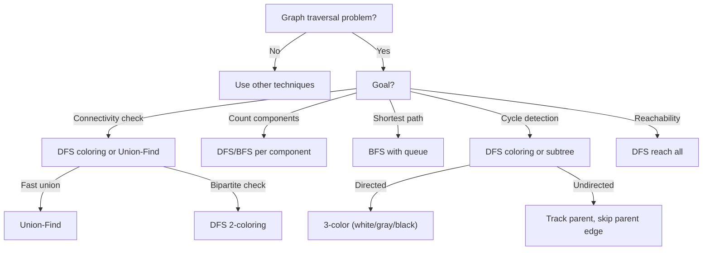
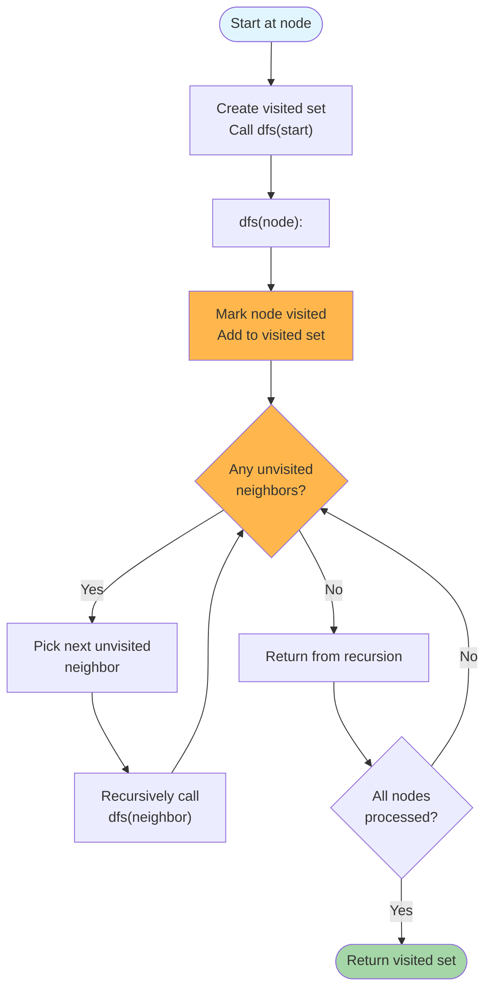
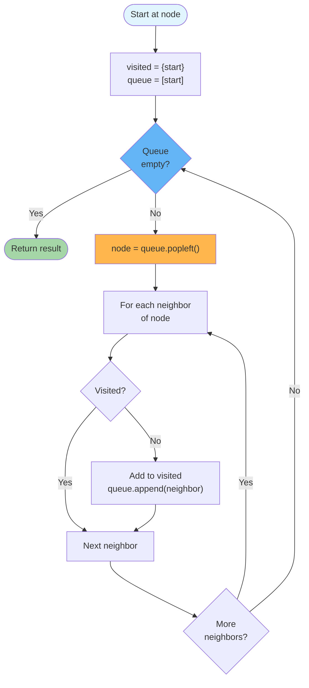
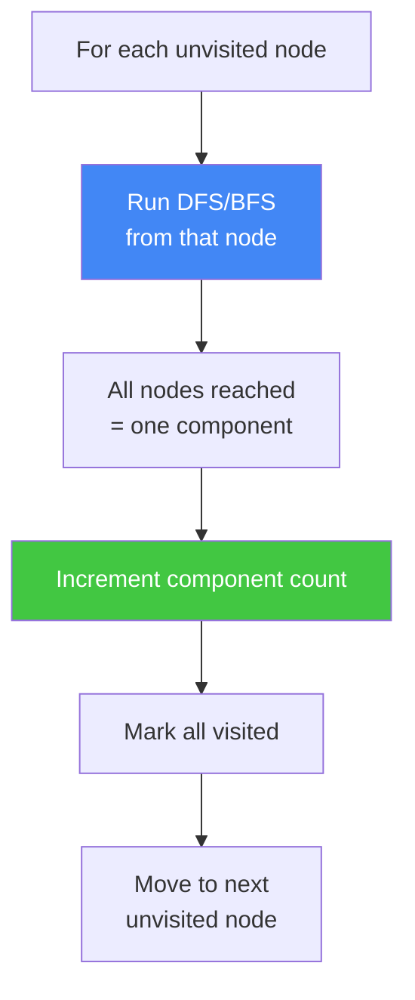
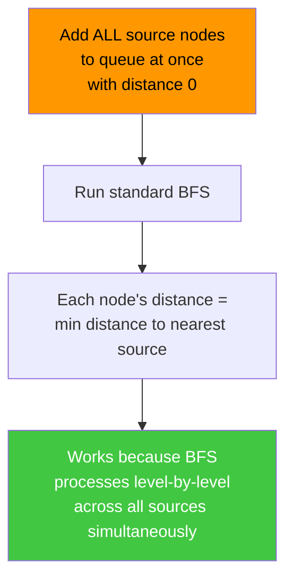
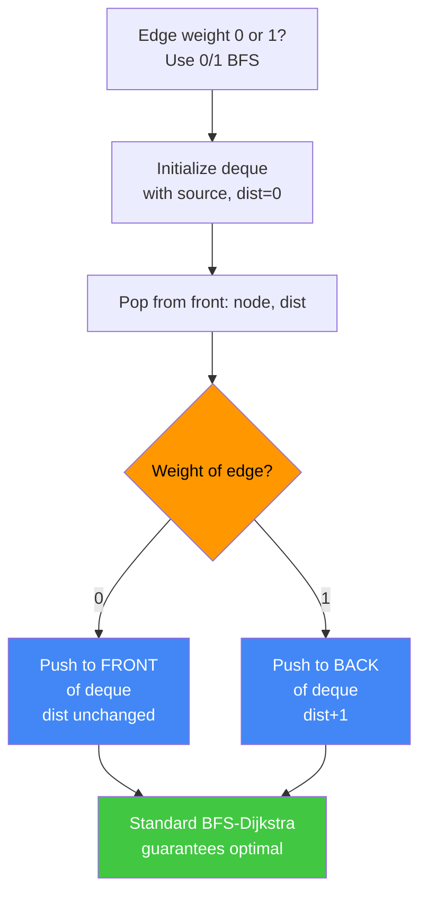

# Graph Traversals: DFS vs BFS vs Union-Find Patterns

A comprehensive guide to graph traversal algorithms and their applications. Graph traversals systematically explore nodes and edges to solve connectivity, reachability, cycle detection, and path-finding problems. This guide covers when to use each approach, detailed examples with step-by-step traces, and common patterns.

---

## What is Graph Traversal?

Graph traversal means visiting every reachable node in a graph using one of three primary strategies:

1. **DFS (Depth-First Search)**: Explore deeply along one path before backtracking. Natural for recursion and stack-based iteration. Used for topological sort, cycle detection, and component discovery.
2. **BFS (Breadth-First Search)**: Explore all neighbors before moving deeper. Uses a queue. Guarantees shortest path in unweighted graphs.
3. **Union-Find**: Maintain disjoint sets of connected components. Optimal for offline connectivity queries and Kruskal's MST algorithm.

### Core Insight

For DFS and BFS, both visit every node and edge exactly once in O(V+E) time. The difference is the **order** of visitation and what you can infer from that order.

---

## Traversal Decision Flowchart



---

## Depth-First Search (DFS)

Explore a graph by following edges as far as possible before backtracking. Start at a node, mark it visited, then recursively visit all unvisited neighbors. DFS naturally exposes the graph's recursive structure.

### Example: Basic DFS Traversal

```
Graph (adjacency list):
  0 → [1, 2]
  1 → [0, 3]
  2 → [0]
  3 → [1]

Start at node 0:
  Visit 0, mark visited
  Explore neighbor 1 (first in list)
    Visit 1, mark visited
    Explore neighbor 0 (already visited, skip)
    Explore neighbor 3
      Visit 3, mark visited
      Explore neighbor 1 (already visited, skip)
      No more neighbors, backtrack
    No more neighbors, backtrack
  Explore neighbor 2
    Visit 2, mark visited
    Explore neighbor 0 (already visited, skip)
    No more neighbors, backtrack
  No more neighbors, done

Visited order (DFS): [0, 1, 3, 2]
```

### DFS Flowchart



**Key insight:** DFS processes nodes in stack order (last-in, first-out). The recursion stack implicitly maintains the frontier of unexplored edges. For backtracking problems, DFS naturally explores all possible paths.

**When to use:** Topological sort, finding all paths, detecting cycles (with coloring), finding strongly connected components, backtracking problems.

---

## Breadth-First Search (BFS)

Explore a graph level by level using a queue. All nodes at distance k are visited before any node at distance k+1. BFS guarantees the shortest path in unweighted graphs.

### Example: BFS Traversal with Distance

```
Graph (adjacency list):
  0 → [1, 2]
  1 → [0, 3]
  2 → [0, 3]
  3 → [1, 2]

Start at node 0:

Initial: queue = [(0, 0)], visited = {0}

Step 1: Process (0, dist=0)
  Neighbors: 1, 2
  Add unvisited: (1, 1), (2, 1)
  Queue now: [(1, 1), (2, 1)]
  Visited: {0, 1, 2}

Step 2: Process (1, dist=1)
  Neighbors: 0, 3
  0 already visited, skip
  Add unvisited: (3, 2)
  Queue now: [(2, 1), (3, 2)]
  Visited: {0, 1, 2, 3}

Step 3: Process (2, dist=1)
  Neighbors: 0, 3
  Both already visited, skip
  Queue now: [(3, 2)]

Step 4: Process (3, dist=2)
  Neighbors: 1, 2
  Both already visited, skip
  Queue now: []

Distances from node 0:
  0 → 0
  1 → 1
  2 → 1
  3 → 2
```

### BFS Flowchart



**Key insight:** BFS processes nodes in queue order (first-in, first-out), guaranteeing that all nodes at distance d are processed before any node at distance d+1. This automatically finds shortest paths.

**When to use:** Shortest path in unweighted graphs, level-order traversal, connected components, minimum moves problems.

---

## Cycle Detection in Directed Graphs (DFS Coloring)

Use three colors to track node state during DFS: white (unvisited), gray (visiting), black (fully processed). A back edge (to a gray node) indicates a cycle.

### Example: Detecting Cycles with DFS Coloring

```
Graph (directed):
  0 → [1]
  1 → [2]
  2 → [0, 3]  ← edge 2→0 creates cycle
  3 → []

DFS Coloring:

Start: all white, color = [0, 0, 0, 0]

Process node 0:
  color[0] = 1 (gray, now visiting)
  Explore neighbor 1
    color[1] = 1 (gray)
    Explore neighbor 2
      color[2] = 1 (gray)
      Explore neighbor 0
        color[0] = 1 (gray) ← Back edge! Cycle found!
        Return True
      Explore neighbor 3
        color[3] = 1 (gray)
        No neighbors
        color[3] = 2 (black)
      color[2] = 2 (black)
    color[1] = 2 (black)
  color[0] = 2 (black)

Result: Cycle detected!

---

No-cycle example:
Graph:
  0 → [1, 2]
  1 → [3]
  2 → [3]
  3 → []

DFS order: 0 (gray) → 1 (gray) → 3 (gray, black) → 2 (gray) → 3 (already black, not gray, no cycle) → 0 (black)

Result: No cycle
```

**Key insight:** When visiting a gray node from an edge, we've found a back edge within the current DFS tree, indicating a cycle. Black nodes are already processed and can be safely skipped.

**When to use:** Detecting cycles in directed graphs, topological sort validation, detecting deadlock in resource allocation.

---

## Cycle Detection in Undirected Graphs

For undirected graphs, track the parent of each node during DFS. If we encounter a visited neighbor that is NOT the parent, we've found a cycle.

### Example: Undirected Cycle Detection

```
Graph (undirected):
  0 — 1
  |   |
  2 — 3

As adjacency list:
  0 → [1, 2]
  1 → [0, 3]
  2 → [0, 3]
  3 → [1, 2]

DFS from node 0, parent=-1:
  Visit 0, mark visited
  Process neighbor 1 (not parent)
    Visit 1, mark visited
    Process neighbor 0 (is parent, skip)
    Process neighbor 3 (not visited)
      Visit 3, mark visited
      Process neighbor 1 (is parent, skip)
      Process neighbor 2 (not visited)
        Visit 2, mark visited
        Process neighbor 0 (is parent, skip)
        Process neighbor 3 (already visited, not parent) ← Cycle!
        Return True

Result: Cycle detected (0-1-3-2-0)
```

**Key insight:** Undirected graphs have undirected edges, so we track parent to avoid immediately revisiting the parent node. Any visited non-parent neighbor indicates a cycle.

**When to use:** Detecting cycles in undirected graphs, validating tree structures, finding bridges and articulation points.

---

## Bipartite Graph Check (2-Coloring)

A graph is bipartite if it can be 2-colored such that no adjacent nodes have the same color. Use DFS or BFS to attempt 2-coloring; if a conflict occurs, the graph is not bipartite.

### Example: Bipartite Check with DFS

```
Bipartite graph (try 2-coloring):
  0 — 1
  |   |
  2 — 3

DFS 2-coloring:
  color[0] = RED
  color[1] = BLUE (neighbor of 0)
  color[3] = RED (neighbor of 1)
  color[2] = BLUE (neighbor of 0)
  
  Check edge 2-3:
    color[2] = BLUE, color[3] = RED ✓ Different colors

Result: Bipartite! ✓

---

Non-bipartite graph (odd cycle):
  0 — 1
  |   |
  2   |
  |   |
  \_  |
    3/

Edges: 0-1, 1-3, 3-0, 0-2
Color: 0=RED, 1=BLUE, 3=RED, 2=BLUE
Check edge 0-3: both RED ✗ Conflict!

Result: Not bipartite
```

**Key insight:** A graph is bipartite if and only if it contains no odd-length cycles. 2-coloring detects odd cycles by conflict.

**When to use:** Matching problems, determining if a graph is bipartite, constraint satisfaction with two groups.

---

## Union-Find (Disjoint Set Union)

Maintain disjoint sets of nodes and efficiently query/update their connectivity. Two operations: `find(x)` (which set contains x?) and `union(x, y)` (merge sets containing x and y).

### Example: Union-Find for Connected Components

```
Graph: nodes 0-5
Edges: (0,1), (1,2), (3,4), (4,5)

Initial parent: [0, 1, 2, 3, 4, 5]

Process (0,1):
  find(0) = 0, find(1) = 1 → different sets
  union(0, 1): parent[1] = 0
  parent: [0, 0, 2, 3, 4, 5]

Process (1,2):
  find(1): parent[1]=0, find(0)=0 → root=0
  find(2) = 2 → different roots
  union(1, 2): find(1)=0, so parent[2] = 0
  parent: [0, 0, 0, 3, 4, 5]

Process (3,4):
  find(3) = 3, find(4) = 4 → different sets
  union(3, 4): parent[4] = 3
  parent: [0, 0, 0, 3, 3, 5]

Process (4,5):
  find(4): parent[4]=3, find(3)=3 → root=3
  find(5) = 5 → different roots
  union(4, 5): find(4)=3, so parent[5] = 3
  parent: [0, 0, 0, 3, 3, 3]

Connected components:
  find(0) = 0
  find(1) = 0
  find(2) = 0
  find(3) = 3
  find(4) = 3
  find(5) = 3

Components: {0, 1, 2} and {3, 4, 5}
```

**Key insight:** With path compression and union by rank, union-find achieves nearly O(1) amortized per operation. Much more efficient than running DFS repeatedly for connectivity queries.

**When to use:** Detecting connected components, Kruskal's MST algorithm, cycle detection in undirected graphs, equivalence classes.

---

## Traversal Template Patterns

### DFS (Recursive)

The most natural and readable form. Each recursive call represents visiting a node and exploring its neighbors.

```python
def dfs(graph, start):
    """Recursive DFS traversal."""
    visited = set()
    
    def dfs_helper(node):
        visited.add(node)
        for neighbor in graph[node]:
            if neighbor not in visited:
                dfs_helper(neighbor)
    
    dfs_helper(start)
    return visited
```

**Space:** O(h) where h is max recursion depth (tree height or diameter).
**Complexity:** O(V + E) to visit all nodes and edges once.

### DFS (Iterative Stack-Based)

Avoids recursion to prevent stack overflow on large graphs. Maintains an explicit stack instead of call stack.

```python
def dfs_iterative(graph, start):
    """Iterative DFS using explicit stack."""
    visited = set()
    stack = [start]
    
    while stack:
        node = stack.pop()
        if node in visited:
            continue
        visited.add(node)
        
        # Add neighbors in reverse order to maintain left-to-right processing
        for neighbor in reversed(graph[node]):
            if neighbor not in visited:
                stack.append(neighbor)
    
    return visited
```

**Space:** O(V) for explicit stack.
**Complexity:** O(V + E).

### BFS (Queue-Based for Shortest Path)

Uses a queue to process nodes level-by-level, guaranteeing shortest path in unweighted graphs.

```python
from collections import deque

def bfs(graph, start):
    """BFS with distance tracking."""
    visited = {start}
    queue = deque([(start, 0)])  # (node, distance)
    distances = {start: 0}
    
    while queue:
        node, dist = queue.popleft()
        for neighbor in graph[node]:
            if neighbor not in visited:
                visited.add(neighbor)
                distances[neighbor] = dist + 1
                queue.append((neighbor, dist + 1))
    
    return distances
```

**Space:** O(V) for queue (width of graph).
**Complexity:** O(V + E).

### DFS Coloring (Cycle Detection in Directed Graphs)

Uses 3-coloring: white (unvisited), gray (visiting), black (done). Detects back edges.

```python
def detect_cycle_directed(graph):
    """Detect cycle in directed graph using DFS coloring."""
    n = len(graph)
    color = [0] * n  # 0=white, 1=gray, 2=black
    
    def dfs(node):
        if color[node] == 1:
            return True  # Back edge — cycle!
        if color[node] == 2:
            return False  # Already processed
        
        color[node] = 1  # Mark as visiting
        for neighbor in graph[node]:
            if dfs(neighbor):
                return True
        color[node] = 2  # Mark as done
        return False
    
    for i in range(n):
        if color[i] == 0:
            if dfs(i):
                return True
    return False
```

**Space:** O(V) for color array + O(h) recursion.
**Complexity:** O(V + E).

### Bipartite Check (2-Coloring with DFS)

Color graph with 2 colors; if conflict, not bipartite.

```python
def is_bipartite(graph):
    """Check if graph is bipartite using DFS 2-coloring."""
    n = len(graph)
    color = [-1] * n  # -1=unvisited, 0=red, 1=blue
    
    def dfs(node, c):
        color[node] = c
        for neighbor in graph[node]:
            if color[neighbor] == -1:
                if not dfs(neighbor, 1 - c):
                    return False
            elif color[neighbor] == c:
                return False  # Adjacent nodes same color
        return True
    
    for i in range(n):
        if color[i] == -1:
            if not dfs(i, 0):
                return False
    return True
```

**Space:** O(V).
**Complexity:** O(V + E).

## Problem Categories & Implementation Guide

| Category | Algorithm | Approach | Time | Space | Use When |
|----------|-----------|----------|------|-------|----------|
| Connected Components | Count Islands | DFS/BFS per island | O(m·n) | O(m·n) | Finding groups of connected cells |
| Bipartite Check | 2-Coloring | DFS coloring | O(V+E) | O(V) | Validating graph structure |
| Cycle Detection (Directed) | DFS 3-coloring | Coloring + back edges | O(V+E) | O(V) | Detecting cycles, topological sort |
| Cycle Detection (Undirected) | DFS parent tracking | Skip parent edge | O(V+E) | O(V) | Validating tree structures |
| Shortest Path (unweighted) | BFS | Queue-based level order | O(V+E) | O(V) | Finding minimum hops |
| All reachable nodes | DFS | Recursive or iterative | O(V+E) | O(V) | Connectivity analysis |
| Connected Components (count) | Union-Find | Path compression | O(α(V))* | O(V) | Counting groups efficiently |
| MST (minimum spanning tree) | Kruskal + Union-Find | Sort edges, union | O(E log E) | O(E) | Minimum cost connectivity |

*α is inverse Ackermann function, practically constant

---

## DFS vs BFS Comparison

| Aspect | DFS | BFS |
|--------|-----|-----|
| **Data Structure** | Stack (implicit or explicit) | Queue |
| **Path Type** | Any/all paths | Shortest path (unweighted) |
| **Space** | O(h) - recursion/max depth | O(w) - max breadth |
| **Time** | O(V+E) | O(V+E) |
| **Shortest Path** | ✗ (without BFS) | ✓ (unweighted) |
| **Connected Components** | ✓ | ✓ |
| **Cycle Detection** | ✓ (with coloring) | ✓ (with coloring) |
| **Topological Sort** | ✓ (DFS-based) | ✗ (use Kahn's) |
| **All Paths** | ✓ (with backtracking) | ✗ |
| **Recursion Safe** | ✗ (stack overflow risk) | ✓ (queue is explicit) |

### Decision Matrix

Choose DFS when:
- You need **all paths** or **backtracking** — DFS explores all branches naturally
- You're doing **topological sorting** — DFS post-order gives correct order
- You need **cycle detection in directed graphs** — use 3-coloring
- Graph **depth is small** but width is large — avoids queue memory

Choose BFS when:
- You need **shortest path** in unweighted graph — BFS guarantees optimal
- Graph **width is small** but depth is large — avoids stack overflow
- You need **level-by-level** processing — natural for tree traversal
- You want **safer iteration** on large graphs — no recursion limits

---

## Special Cases & Implementation Patterns

### Grid Traversal (2D Graph)

Grids are implicit graphs where adjacent cells are connected. Use 4-directional or 8-directional movement.

```python
def grid_dfs(grid, i, j, visited):
    """DFS on 2D grid with boundary checks."""
    if i < 0 or i >= len(grid) or j < 0 or j >= len(grid[0]):
        return
    if (i, j) in visited or grid[i][j] == '0':
        return
    
    visited.add((i, j))
    
    # 4 directions: right, down, left, up
    for di, dj in [(0, 1), (1, 0), (0, -1), (-1, 0)]:
        grid_dfs(grid, i + di, j + dj, visited)
```

**Key points:**
- Check bounds first to avoid index errors
- Check visited status before processing
- Check cell value (obstacle detection) before marking visited
- 4-way or 8-way movement depends on problem

### Undirected Cycle Detection (Parent Tracking)

For undirected graphs, track the parent to avoid immediately revisiting it.

```python
def has_cycle_undirected(graph, n):
    """Detect cycle in undirected graph."""
    visited = set()
    
    def dfs(node, parent):
        visited.add(node)
        for neighbor in graph[node]:
            if neighbor == parent:
                continue  # Skip parent edge (only first occurrence)
            if neighbor in visited:
                return True  # Found cycle
            if dfs(neighbor, node):
                return True
        return False
    
    for i in range(n):
        if i not in visited:
            if dfs(i, -1):
                return True
    return False
```

**Why parent tracking?** In an undirected edge u-v, when you visit v from u, the reverse edge v-u exists but shouldn't count as revisiting. Track parent to skip one such edge.

### Directed Cycle Detection (3-Coloring)

Use white/gray/black coloring to detect back edges (cycles in directed graphs).

```python
def has_cycle_directed(graph, n):
    """Detect cycle in directed graph using 3-coloring."""
    color = [0] * n  # 0=white, 1=gray, 2=black
    
    def dfs(node):
        if color[node] == 1:
            return True  # Back edge — cycle detected!
        if color[node] == 2:
            return False  # Already fully processed
        
        color[node] = 1  # Mark as visiting (gray)
        for neighbor in graph[node]:
            if dfs(neighbor):
                return True
        color[node] = 2  # Mark as done (black)
        return False
    
    for i in range(n):
        if color[i] == 0:
            if dfs(i):
                return True
    return False
```

**Why 3 colors?**
- White (0): Never visited
- Gray (1): Currently visiting (on current DFS path)
- Black (2): Fully processed (all descendants visited)

A gray node in the current recursion path means a back edge → cycle.

### Union-Find (Disjoint Set Union)

Efficiently track and merge connected components.

```python
class UnionFind:
    """Disjoint Set Union with path compression and union by rank."""
    
    def __init__(self, n):
        self.parent = list(range(n))
        self.rank = [0] * n
    
    def find(self, x):
        """Find root with path compression."""
        if self.parent[x] != x:
            self.parent[x] = self.find(self.parent[x])  # Compress path
        return self.parent[x]
    
    def union(self, x, y):
        """Union by rank."""
        px, py = self.find(x), self.find(y)
        if px == py:
            return False  # Already in same set
        
        # Union by rank — attach smaller tree under larger
        if self.rank[px] < self.rank[py]:
            px, py = py, px
        self.parent[py] = px
        if self.rank[px] == self.rank[py]:
            self.rank[px] += 1
        return True
    
    def connected(self, x, y):
        """Check if x and y are in same component."""
        return self.find(x) == self.find(y)
```

**Complexity:** With path compression and union by rank, nearly O(1) amortized per operation (O(α(n)) where α is inverse Ackermann, practically constant).

---

## Choosing the Right Algorithm

| Problem | Pick | Why |
|---------|------|-----|
| Shortest path in unweighted graph | BFS | Guarantees minimum hops |
| Detect cycle (directed) | DFS 3-coloring | Back edges indicate cycles |
| Detect cycle (undirected) | DFS parent tracking | Simple parent skip detects cycles |
| Find all connected components | DFS/BFS (each component) | Process all nodes once per component |
| Bipartite check | DFS/BFS 2-coloring | Color conflict = not bipartite |
| Shortest path in weighted graph | Dijkstra (not DFS/BFS) | Handle edge weights |
| Count components (many queries) | Union-Find | O(α(n)) per operation |
| Topological sort | DFS post-order | Reverse finish times gives ordering |
| Find strongly connected components | Tarjan or Kosaraju | SCC requires special algorithms |
| Find bridges/articulation points | DFS with low-link values | Special DFS-based algorithms |

---

## Common Interview Questions

**Q: What's the difference between DFS and BFS in terms of space usage?**
A: DFS space depends on maximum recursion depth (tree height). BFS space depends on maximum queue width (largest level in graph). For unbalanced graphs, DFS uses O(n) worst case; for balanced, BFS uses O(w) per level.

**Q: Why do you need 3 colors for cycle detection in directed graphs but not undirected?**
A: In undirected graphs, each edge goes both ways, so the parent check prevents immediate revisits. In directed graphs, edges are one-way, so a node can be reached from different paths. The gray color (currently visiting) distinguishes back edges that indicate cycles from already-processed nodes.

**Q: Trace DFS 3-coloring on graph 0→1→2, 2→0. Does it detect the cycle?**
A: Yes. Start node 0 (gray). Visit 1 (gray). Visit 2 (gray). Visit neighbor 0 — it's gray! Back edge detected. Return True immediately.

**Q: Why is parent tracking sufficient for undirected cycle detection but not directed?**
A: In undirected graphs, when you reach a visited non-parent neighbor, you've found a second path to that neighbor (a cycle). Directed graphs need color tracking because you might reach a node from multiple paths, and only reaching a gray (currently-visiting) node indicates a back edge.

**Q: What's the advantage of Union-Find over DFS for counting connected components?**
A: For a single query, DFS is O(V+E). For k queries, Union-Find is O(k·α(n)) vs DFS's O(k·(V+E)). Also, Union-Find handles dynamic edge additions efficiently, whereas DFS must recompute.

**Q: How do you find ALL paths from s to t in a graph?**
A: Use DFS with backtracking. Maintain a current path list. When reaching target, add path copy to results. Backtrack (pop from path) after recursion. Don't use visited set or mark nodes visited globally — mark per-path instead to explore all paths.

**Q: What's the difference between topological sort via DFS vs Kahn's algorithm?**
A: DFS (Tarjan): Post-order finish times reversed give order. Works on DAGs. Kahn's: Use in-degree; process 0-in-degree nodes, decrement neighbors. Both O(V+E), but Kahn's is iterative (no stack overflow risk).

**Q: Bipartite check: if graph has multiple components, does 2-coloring still work?**
A: Yes. Run BFS/DFS from each unvisited node. If any component fails 2-coloring (color conflict), graph is not bipartite.

---

## Common Mistakes

1. **Forgetting to mark visited:** Leads to infinite loops. Always mark a node visited before processing neighbors.
2. **Wrong parent tracking:** In undirected cycle detection, `if neighbor == parent: continue` only skips one edge. With multiple edges between same nodes, this fails.
3. **Confusing directed vs undirected cycle detection:** Directed needs 3-coloring; undirected needs parent tracking. Wrong approach gives false results.
4. **Stack overflow with recursive DFS:** Large graphs with deep paths overflow Python's recursion limit (~1000). Use iterative DFS for safety.
5. **BFS on weighted graphs:** BFS gives shortest hops, not shortest weight. Use Dijkstra for weighted shortest path.
6. **Misusing Union-Find:** Union-Find is for static/offline queries. For dynamic edge additions, DFS might be clearer.

---

## Optimization Opportunities

**Early Termination:**
- If goal is found, return immediately rather than traversing entire graph
- For bipartite check, return False on first color conflict

**Memoization:**
- Cache results of subgraph reachability if same subgraphs queried multiple times
- In topological sort, cache already-processed nodes

**Space Optimization:**
- Use iterative DFS instead of recursive to save O(h) call stack
- Union-Find uses only O(V) space; more efficient than graph adjacency list for connectivity

**Algorithmic Choices:**
- Union-Find for multiple connectivity queries (amortized O(α(n)))
- BFS for shortest path (guarantees optimal)
- DFS for topological sort and all paths
- Kahn's algorithm for topological sort if you prefer iteration over recursion

---

## Java Implementations

### DFS (Recursive + Iterative) — Java
```java
import java.util.*;

public class GraphTraversals {

    // Recursive DFS
    public Set<Integer> dfsRecursive(Map<Integer, List<Integer>> graph, int start) {
        Set<Integer> visited = new HashSet<>();
        dfsHelper(graph, start, visited);
        return visited;
    }
    private void dfsHelper(Map<Integer, List<Integer>> graph, int node, Set<Integer> visited) {
        visited.add(node);
        for (int neighbor : graph.getOrDefault(node, List.of())) {
            if (!visited.contains(neighbor)) dfsHelper(graph, neighbor, visited);
        }
    }

    // Iterative DFS
    public Set<Integer> dfsIterative(Map<Integer, List<Integer>> graph, int start) {
        Set<Integer> visited = new HashSet<>();
        Deque<Integer> stack = new ArrayDeque<>();
        stack.push(start);
        while (!stack.isEmpty()) {
            int node = stack.pop();
            if (visited.contains(node)) continue;
            visited.add(node);
            List<Integer> neighbors = graph.getOrDefault(node, List.of());
            for (int i = neighbors.size() - 1; i >= 0; i--)
                if (!visited.contains(neighbors.get(i))) stack.push(neighbors.get(i));
        }
        return visited;
    }

    // BFS with distance tracking
    public Map<Integer, Integer> bfs(Map<Integer, List<Integer>> graph, int start) {
        Map<Integer, Integer> distances = new HashMap<>();
        distances.put(start, 0);
        Queue<Integer> queue = new LinkedList<>();
        queue.offer(start);
        while (!queue.isEmpty()) {
            int node = queue.poll();
            for (int neighbor : graph.getOrDefault(node, List.of())) {
                if (!distances.containsKey(neighbor)) {
                    distances.put(neighbor, distances.get(node) + 1);
                    queue.offer(neighbor);
                }
            }
        }
        return distances;
    }
}
```

### Cycle Detection (Directed + Undirected) — Java
```java
public class CycleDetection {

    // Directed: 3-coloring (0=white, 1=gray, 2=black)
    public boolean hasCycleDirected(Map<Integer, List<Integer>> graph, int V) {
        int[] color = new int[V];
        for (int i = 0; i < V; i++)
            if (color[i] == 0 && dfsCycle(graph, i, color)) return true;
        return false;
    }
    private boolean dfsCycle(Map<Integer, List<Integer>> graph, int node, int[] color) {
        color[node] = 1;  // gray: currently visiting
        for (int neighbor : graph.getOrDefault(node, List.of())) {
            if (color[neighbor] == 1) return true;  // back edge = cycle
            if (color[neighbor] == 0 && dfsCycle(graph, neighbor, color)) return true;
        }
        color[node] = 2;  // black: fully processed
        return false;
    }

    // Undirected: parent tracking
    public boolean hasCycleUndirected(Map<Integer, List<Integer>> graph, int V) {
        Set<Integer> visited = new HashSet<>();
        for (int i = 0; i < V; i++) {
            if (!visited.contains(i) && dfsUndirected(graph, i, -1, visited)) return true;
        }
        return false;
    }
    private boolean dfsUndirected(Map<Integer, List<Integer>> graph,
                                   int node, int parent, Set<Integer> visited) {
        visited.add(node);
        for (int neighbor : graph.getOrDefault(node, List.of())) {
            if (neighbor == parent) continue;
            if (visited.contains(neighbor)) return true;
            if (dfsUndirected(graph, neighbor, node, visited)) return true;
        }
        return false;
    }
}
```

### Union-Find — Java
```java
public class UnionFind {
    private int[] parent, rank;
    private int components;

    public UnionFind(int n) {
        parent = new int[n]; rank = new int[n];
        components = n;
        for (int i = 0; i < n; i++) parent[i] = i;
    }
    public int find(int x) {
        if (parent[x] != x) parent[x] = find(parent[x]);
        return parent[x];
    }
    public boolean union(int x, int y) {
        int px = find(x), py = find(y);
        if (px == py) return false;
        if (rank[px] < rank[py]) { int t = px; px = py; py = t; }
        parent[py] = px;
        if (rank[px] == rank[py]) rank[px]++;
        components--;
        return true;
    }
    public boolean connected(int x, int y) { return find(x) == find(y); }
    public int getComponents() { return components; }
}
```

---

## Additional Patterns

### Finding All Connected Components



```python
def count_components(graph: dict, V: int) -> int:
    """Count connected components via DFS. O(V+E)."""
    visited = set()
    count = 0

    def dfs(node):
        visited.add(node)
        for neighbor in graph.get(node, []):
            if neighbor not in visited:
                dfs(neighbor)

    for node in range(V):
        if node not in visited:
            dfs(node)
            count += 1
    return count

def get_all_components(graph: dict, V: int) -> list:
    """Return list of lists, each is one connected component."""
    visited = set()
    components = []

    def dfs(node, comp):
        visited.add(node)
        comp.append(node)
        for neighbor in graph.get(node, []):
            if neighbor not in visited:
                dfs(neighbor, comp)

    for node in range(V):
        if node not in visited:
            comp = []
            dfs(node, comp)
            components.append(comp)
    return components
```

```java
public int countComponents(Map<Integer, List<Integer>> graph, int V) {
    boolean[] visited = new boolean[V];
    int count = 0;
    for (int i = 0; i < V; i++) {
        if (!visited[i]) { dfsCount(graph, i, visited); count++; }
    }
    return count;
}
private void dfsCount(Map<Integer, List<Integer>> graph, int node, boolean[] visited) {
    visited[node] = true;
    for (int neighbor : graph.getOrDefault(node, List.of()))
        if (!visited[neighbor]) dfsCount(graph, neighbor, visited);
}
```

---

### Transitive Closure

Compute for all pairs (i, j) whether there is a path from i to j. Uses Floyd-Warshall-style DP or repeated DFS/BFS.

```python
def transitive_closure(graph: dict, V: int) -> list:
    """Compute transitive closure using DFS from each node. O(V*(V+E))."""
    reach = [[False] * V for _ in range(V)]

    def dfs(src, curr):
        reach[src][curr] = True
        for neighbor in graph.get(curr, []):
            if not reach[src][neighbor]:
                dfs(src, neighbor)

    for node in range(V):
        reach[node][node] = True  # reflexive
        dfs(node, node)
    return reach

def transitive_closure_fw(adj: list) -> list:
    """Floyd-Warshall transitive closure. O(V³)."""
    V = len(adj)
    reach = [row[:] for row in adj]
    for i in range(V):
        reach[i][i] = 1
    for k in range(V):
        for i in range(V):
            for j in range(V):
                reach[i][j] = reach[i][j] or (reach[i][k] and reach[k][j])
    return reach
```

```java
public boolean[][] transitiveClosure(boolean[][] adj, int V) {
    boolean[][] reach = new boolean[V][V];
    for (int i = 0; i < V; i++) {
        reach[i] = adj[i].clone();
        reach[i][i] = true;
    }
    for (int k = 0; k < V; k++)
        for (int i = 0; i < V; i++)
            for (int j = 0; j < V; j++)
                reach[i][j] = reach[i][j] || (reach[i][k] && reach[k][j]);
    return reach;
}
```

---

### Multi-Source BFS

Start BFS from multiple sources simultaneously. Used when you need shortest distance from any of several sources to all other nodes.



```python
from collections import deque

def multi_source_bfs(grid: list, sources: list) -> list:
    """
    Multi-source BFS on a grid.
    Returns distance grid where each cell = dist to nearest source.
    O(m*n) time and space.
    """
    m, n = len(grid), len(grid[0])
    dist = [[-1] * n for _ in range(m)]
    queue = deque()

    # Initialize all sources with distance 0
    for r, c in sources:
        dist[r][c] = 0
        queue.append((r, c, 0))

    directions = [(0,1),(0,-1),(1,0),(-1,0)]
    while queue:
        r, c, d = queue.popleft()
        for dr, dc in directions:
            nr, nc = r + dr, c + dc
            if 0 <= nr < m and 0 <= nc < n and dist[nr][nc] == -1:
                dist[nr][nc] = d + 1
                queue.append((nr, nc, d + 1))
    return dist
```

```java
public int[][] multiSourceBFS(int[][] grid, List<int[]> sources) {
    int m = grid.length, n = grid[0].length;
    int[][] dist = new int[m][n];
    for (int[] row : dist) Arrays.fill(row, -1);
    Queue<int[]> queue = new LinkedList<>();
    for (int[] src : sources) {
        dist[src[0]][src[1]] = 0;
        queue.offer(new int[]{src[0], src[1]});
    }
    int[][] dirs = {{0,1},{0,-1},{1,0},{-1,0}};
    while (!queue.isEmpty()) {
        int[] curr = queue.poll();
        int r = curr[0], c = curr[1];
        for (int[] d : dirs) {
            int nr = r + d[0], nc = c + d[1];
            if (nr >= 0 && nr < m && nc >= 0 && nc < n && dist[nr][nc] == -1) {
                dist[nr][nc] = dist[r][c] + 1;
                queue.offer(new int[]{nr, nc});
            }
        }
    }
    return dist;
}
```

**When to use:** 0-1 matrix distance (LC 542), walls and gates (LC 286), rotting oranges (LC 994). Multi-source BFS is O(m·n) — the same as running BFS once, because the simultaneous initialization means the wavefront expands from all sources in parallel.

---

### 0/1 BFS (Deque-Based for 0-1 Edge Weights)

When edges have weight 0 or 1 only, use a double-ended queue (deque). Edges with weight 0 push to the front; edges with weight 1 push to the back. Achieves O(V+E) — faster than Dijkstra's O((V+E) log V).



```python
from collections import deque

def zero_one_bfs(graph: dict, V: int, src: int) -> list:
    """
    0/1 BFS for graphs with edge weights 0 or 1.
    O(V+E) time — better than Dijkstra's O((V+E) log V).
    graph: {node: [(neighbor, weight), ...]} where weight is 0 or 1
    """
    dist = [float('inf')] * V
    dist[src] = 0
    dq = deque([(0, src)])

    while dq:
        d, u = dq.popleft()
        if d > dist[u]:
            continue
        for v, w in graph.get(u, []):
            new_dist = dist[u] + w
            if new_dist < dist[v]:
                dist[v] = new_dist
                if w == 0:
                    dq.appendleft((new_dist, v))  # 0-weight: front
                else:
                    dq.append((new_dist, v))      # 1-weight: back
    return dist
```

```java
public int[] zeroOneBFS(Map<Integer, List<int[]>> graph, int V, int src) {
    int[] dist = new int[V];
    Arrays.fill(dist, Integer.MAX_VALUE);
    dist[src] = 0;
    Deque<int[]> deque = new ArrayDeque<>();
    deque.offerFirst(new int[]{src, 0});
    while (!deque.isEmpty()) {
        int[] curr = deque.pollFirst();
        int u = curr[0], d = curr[1];
        if (d > dist[u]) continue;
        for (int[] edge : graph.getOrDefault(u, List.of())) {
            int v = edge[0], w = edge[1];
            if (dist[u] + w < dist[v]) {
                dist[v] = dist[u] + w;
                if (w == 0) deque.offerFirst(new int[]{v, dist[v]});
                else        deque.offerLast(new int[]{v, dist[v]});
            }
        }
    }
    return dist;
}
```

**Key insight:** 0/1 BFS generalizes BFS (all weights 0) and standard BFS-on-unweighted (all weights 1). The deque maintains the invariant that the front always has the minimum distance — front for 0-weight (distance unchanged) and back for 1-weight (distance +1). This replaces the priority queue of Dijkstra with O(1) push operations.

**When to use:** Minimum path with teleporters (weight 0) and roads (weight 1), minimum flips to reach a goal, minimum number of turns in a maze. LC 1368, 1066, 2290.

---

## Additional Interview Questions

**Q: How do you find all connected components in an undirected graph?**
A: Iterate through all nodes. For each unvisited node, run DFS/BFS — all nodes reachable from it form one component. Mark them visited. Increment component counter. Total time O(V+E). Alternatively, use Union-Find: process all edges, call `union(u,v)` for each — the number of distinct roots is the component count.

**Q: What is transitive closure and how do you compute it efficiently?**
A: Transitive closure is the matrix `T[i][j] = True` if there is any directed path from i to j. Use Floyd-Warshall variant: `T[i][j] |= T[i][k] & T[k][j]` for each intermediate k. O(V³) time, O(V²) space. Alternative: DFS from each node — O(V·(V+E)) time, better for sparse graphs.

**Q: When do you use multi-source BFS over standard BFS?**
A: Multi-source BFS is used when you need the shortest distance from the nearest of multiple sources to every other node. Running standard BFS from each source would be O(S·(V+E)) where S is the source count. Multi-source BFS achieves O(V+E) by initializing all sources simultaneously at distance 0. Example: distance to nearest gate in a maze.

**Q: Why is 0/1 BFS faster than Dijkstra for 0-1 weighted graphs?**
A: Dijkstra uses a min-heap which has O(log V) per operation. 0/1 BFS uses a deque with O(1) push/pop. Both are correct, but 0/1 BFS's total time is O(V+E) vs Dijkstra's O((V+E) log V). The deque works because with only two distinct weights (0 and 1), the deque invariant (front = minimum) is always maintainable with simple front/back pushes — no comparison-based sorting needed.

**Q: How does cycle detection differ in directed vs undirected graphs?**
A: Directed: use DFS 3-coloring (white/gray/black). A gray neighbor found during DFS is a back edge = cycle. Undirected: track parent node. An already-visited neighbor that is not the parent = cycle. Cannot use the directed approach on undirected graphs — every undirected edge (u,v) would look like a back-edge from v to u, giving false cycle reports. Cannot use undirected approach on directed graphs — cross-edges would be missed.

**Q: Explain bipartite graphs — what property makes BFS 2-coloring correct?**
A: A graph is bipartite iff it has no odd-length cycle. BFS 2-coloring attempts to color alternately: neighbor gets opposite color. If a conflict (two adjacent nodes same color) arises, an odd cycle exists — the path from one node to itself through the edge is odd-length. BFS guarantees we assign the correct color layer by layer, so any conflict is genuine. If no conflict exists in any connected component, the graph is bipartite.

**Q: How do you handle disconnected graphs in DFS/BFS?**
A: Wrap the traversal in an outer loop over all nodes. If a node hasn't been visited, start a new DFS/BFS from it. This covers all connected components. Without this outer loop, isolated nodes or disconnected components will be missed. Union-Find automatically handles disconnected graphs by maintaining separate component roots.

---

## Extended Complexity Reference

| Algorithm | Time | Space | Use Case |
|-----------|------|-------|----------|
| DFS (recursive) | O(V+E) | O(h) call stack | Paths, cycles, components |
| DFS (iterative) | O(V+E) | O(V) explicit stack | Large graphs, no stack overflow |
| BFS | O(V+E) | O(V) queue | Shortest hops, level order |
| Cycle detect (directed) | O(V+E) | O(V) color array | DAG validation |
| Cycle detect (undirected) | O(V+E) | O(V) visited+parent | Tree validation |
| Union-Find | O(α(V)) per op | O(V) | Component queries, Kruskal |
| All components | O(V+E) | O(V) | Component enumeration |
| Transitive closure (DFS) | O(V·(V+E)) | O(V²) | Sparse graphs |
| Transitive closure (FW) | O(V³) | O(V²) | Dense graphs |
| Multi-source BFS | O(V+E) | O(V+E) | Nearest source distances |
| 0/1 BFS | O(V+E) | O(V) | 0-1 weighted shortest path |
