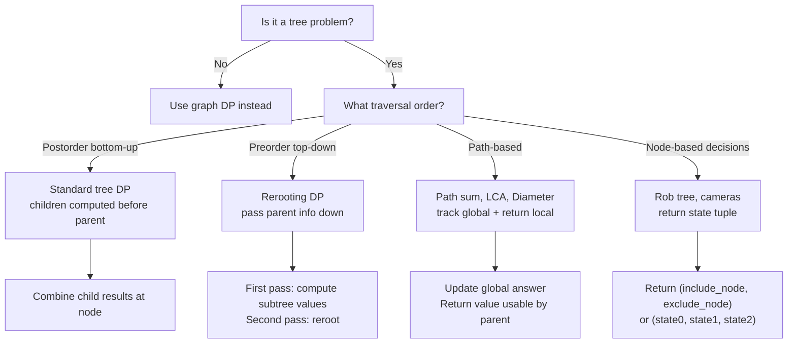
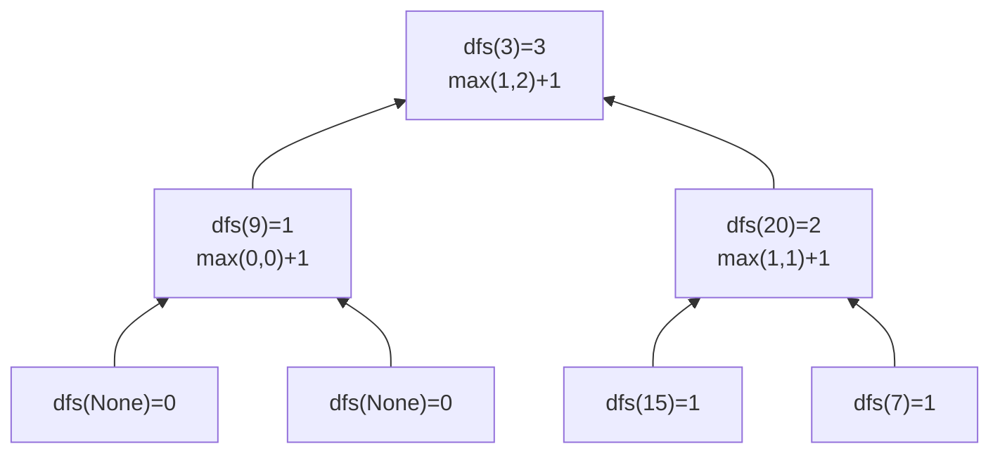
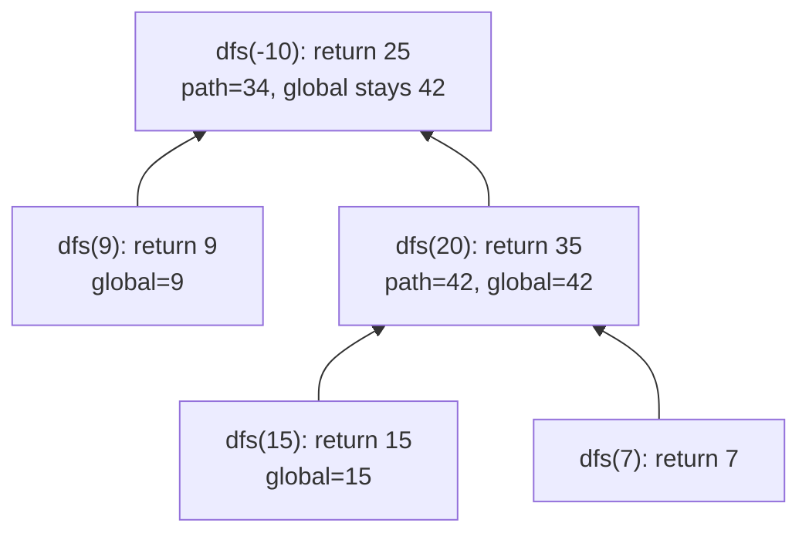
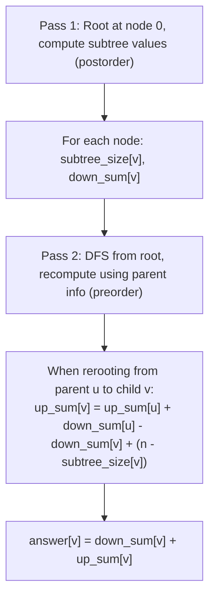

# Tree DP: Pattern Recognition & Implementation Guide

A comprehensive guide to solving problems on tree structures using dynamic programming. Tree DP exploits the recursive structure of trees to solve optimization problems efficiently.

---

## What is Tree DP?

Tree DP combines two key ideas:
1. **Recursive structure**: Trees naturally decompose into independent subtrees
2. **Optimal substructure**: Optimal solution to parent problem can be built from optimal solutions to child problems

**Core insight:** For a given node, compute a value that depends on values from children. This allows O(n) algorithms: visit each node once, compute in O(1) per node using postorder traversal (children first, then parent).

---

## Tree DP Pattern Flowchart



---

## Standard Tree DP Template

```python
from typing import Optional

class TreeNode:
    def __init__(self, val=0, left=None, right=None):
        self.val = val
        self.left = left
        self.right = right

def tree_dp(root: Optional[TreeNode]):
    def dfs(node: Optional[TreeNode]):
        if not node:
            return base_case  # 0, float('-inf'), (0,0), etc.

        left_result = dfs(node.left)
        right_result = dfs(node.right)

        # Combine at current node
        current_result = combine(node.val, left_result, right_result)
        return current_result

    return dfs(root)
```

---

## Algorithm Library

| Algorithm | Pattern | Time | Space | Return Type |
|-----------|---------|------|-------|-------------|
| Max Depth | Postorder | O(n) | O(h) | int (height) |
| Diameter | Postorder + global | O(n) | O(h) | int (height), global diameter |
| Max Path Sum | Postorder + global | O(n) | O(h) | int (max arm), global sum |
| House Robber III | Postorder states | O(n) | O(h) | (rob, skip) tuple |
| Balanced Check | Postorder | O(n) | O(h) | int (height, -1 if unbalanced) |
| LCA | Postorder search | O(n) | O(h) | node |
| Path Sum III | Prefix sum DFS | O(n) | O(n) | int count |
| Distribute Coins | Postorder | O(n) | O(h) | int (excess coins) |
| Binary Tree Cameras | Postorder states | O(n) | O(h) | int (0/1/2 state) |
| Vertical Order | BFS + sorting | O(n log n) | O(n) | dict of lists |
| Rerooting DP | Two-pass | O(n) | O(n) | list (answer per node as root) |

---

## 1. Maximum Depth / Height

**Problem:** Find the maximum depth of a binary tree (longest root-to-leaf path).

### Execution Trace

```
Tree:
      3
     / \
    9  20
       / \
      15   7

dfs(3):
  dfs(9):
    dfs(None) = 0 (left)
    dfs(None) = 0 (right)
    return max(0, 0) + 1 = 1
  dfs(20):
    dfs(15):
      return max(0,0)+1 = 1
    dfs(7):
      return max(0,0)+1 = 1
    return max(1, 1) + 1 = 2
  return max(1, 2) + 1 = 3

Answer: 3
```



### Python Implementation

```python
def max_depth(root: Optional[TreeNode]) -> int:
    """
    Maximum depth of binary tree.
    Time: O(n), Space: O(h) where h = height of tree.
    """
    if not root:
        return 0
    return max(max_depth(root.left), max_depth(root.right)) + 1


def max_depth_iterative(root: Optional[TreeNode]) -> int:
    """
    Iterative BFS approach for maximum depth.
    Time: O(n), Space: O(w) where w = max width of tree.
    """
    if not root:
        return 0
    from collections import deque
    queue = deque([root])
    depth = 0
    while queue:
        depth += 1
        for _ in range(len(queue)):
            node = queue.popleft()
            if node.left:
                queue.append(node.left)
            if node.right:
                queue.append(node.right)
    return depth


def min_depth(root: Optional[TreeNode]) -> int:
    """
    Minimum depth: length of shortest root-to-LEAF path.
    Careful: single-child nodes don't count as leaves!
    """
    if not root:
        return 0
    if not root.left and not root.right:
        return 1  # leaf node
    if not root.left:
        return min_depth(root.right) + 1
    if not root.right:
        return min_depth(root.left) + 1
    return min(min_depth(root.left), min_depth(root.right)) + 1
```

### Java Implementation

```java
public class MaxDepth {
    public int maxDepth(TreeNode root) {
        if (root == null) return 0;
        return Math.max(maxDepth(root.left), maxDepth(root.right)) + 1;
    }

    // Iterative BFS
    public int maxDepthBFS(TreeNode root) {
        if (root == null) return 0;
        Queue<TreeNode> queue = new LinkedList<>();
        queue.offer(root);
        int depth = 0;
        while (!queue.isEmpty()) {
            depth++;
            int size = queue.size();
            for (int i = 0; i < size; i++) {
                TreeNode node = queue.poll();
                if (node.left != null) queue.offer(node.left);
                if (node.right != null) queue.offer(node.right);
            }
        }
        return depth;
    }
}
```

---

## 2. Diameter of Binary Tree

**Problem:** Find the longest path between any two nodes (path need not pass through root).

### Key Insight: Diameter vs Height

```
The diameter at any node = left_height + right_height
But the diameter of the TREE = max over all nodes

Tree:
        1
       / \
      2   3
     / \
    4   5

dfs(4): height=1, update diameter=0 (leaf)
dfs(5): height=1, update diameter=0 (leaf)
dfs(2): height=max(1,1)+1=2, diameter at node 2 = 1+1 = 2, update global_max=2
dfs(3): height=1, update diameter=0 (leaf)
dfs(1): height=max(2,1)+1=3, diameter at node 1 = 2+1 = 3, update global_max=3

Answer: 3 (path: 4->2->1->3 or 5->2->1->3)
```

### Python Implementation

```python
def diameter_of_binary_tree(root: Optional[TreeNode]) -> int:
    """
    Diameter of binary tree: longest path between any two nodes.
    Time: O(n), Space: O(h).
    Key: diameter at node = left_height + right_height.
    """
    max_diameter = [0]

    def dfs(node: Optional[TreeNode]) -> int:
        if not node:
            return 0
        left_h = dfs(node.left)
        right_h = dfs(node.right)
        # Update diameter if path through this node is longer
        max_diameter[0] = max(max_diameter[0], left_h + right_h)
        return max(left_h, right_h) + 1  # return height to parent

    dfs(root)
    return max_diameter[0]
```

### Java Implementation

```java
public class DiameterBinaryTree {
    private int maxDiameter = 0;

    public int diameterOfBinaryTree(TreeNode root) {
        dfs(root);
        return maxDiameter;
    }

    private int dfs(TreeNode node) {
        if (node == null) return 0;
        int left = dfs(node.left);
        int right = dfs(node.right);
        maxDiameter = Math.max(maxDiameter, left + right);
        return Math.max(left, right) + 1;
    }
}
```

---

## 3. Maximum Path Sum (through any node)

**Problem:** Find the maximum sum path between any two nodes. Path can start and end at any node.

### Execution Trace

```
Tree:
       -10
       /  \
      9   20
         /  \
        15   7

dfs(-10):
  dfs(9):
    left = dfs(None) = 0, right = dfs(None) = 0
    global_max = max(-inf, 0+0+9) = 9  (path through node 9 = just 9)
    return max(0+9, 0+9) = 9 (but we can ignore negative arms)
    actually return max(9, 0) = 9  (don't extend downward if negative)
  dfs(20):
    dfs(15): returns max(15, 0) = 15, global_max = max(9, 15) = 15
    dfs(7): returns max(7, 0) = 7, global_max = max(15, 7) = 15
    path through 20: 15+20+7 = 42, global_max = max(15, 42) = 42
    return max(15, 7) + 20 = 35  (best arm going down)
  path through -10: 9 + (-10) + 35 = 34, global_max = max(42, 34) = 42
  return max(9, 35) + (-10) = 25

Answer: 42
```



### Python Implementation

```python
def max_path_sum(root: Optional[TreeNode]) -> int:
    """
    Maximum path sum through any two nodes.
    Time: O(n), Space: O(h).
    Key: at each node, choose best arm (or nothing if negative).
    """
    global_max = [float('-inf')]

    def dfs(node: Optional[TreeNode]) -> int:
        if not node:
            return 0
        # Max gain from going into left/right subtree (ignore if negative)
        left_gain = max(dfs(node.left), 0)
        right_gain = max(dfs(node.right), 0)

        # Path through this node (could be best answer)
        path_sum = node.val + left_gain + right_gain
        global_max[0] = max(global_max[0], path_sum)

        # Return the best single arm (parent can extend in one direction only)
        return node.val + max(left_gain, right_gain)

    dfs(root)
    return global_max[0]
```

### Java Implementation

```java
public class MaxPathSum {
    private int globalMax = Integer.MIN_VALUE;

    public int maxPathSum(TreeNode root) {
        dfs(root);
        return globalMax;
    }

    private int dfs(TreeNode node) {
        if (node == null) return 0;
        int leftGain = Math.max(dfs(node.left), 0);
        int rightGain = Math.max(dfs(node.right), 0);
        globalMax = Math.max(globalMax, node.val + leftGain + rightGain);
        return node.val + Math.max(leftGain, rightGain);
    }
}
```

---

## 4. House Robber III (Rob Tree)

**Problem:** Rob houses arranged in a binary tree. Cannot rob two directly connected nodes. Maximize money.

### State Design: (rob_node, skip_node)

```
Tree:
      3
     / \
    2   3
     \   \
      3   1

For each node, return (rob, skip):
  rob = max money if we rob this node
  skip = max money if we skip this node

Leaf nodes:
  dfs(3) bottom-left: rob=3, skip=0
  dfs(1) bottom-right: rob=1, skip=0

dfs(2) (left child of root):
  left=(0,0), right=(rob=3, skip=0)
  rob_node = 2 + left.skip + right.skip = 2 + 0 + 0 = 2
  skip_node = max(left.rob, left.skip) + max(right.rob, right.skip) = 0 + 3 = 3
  return (rob=2, skip=3)

dfs(3) (right child of root):
  left=(0,0), right=(rob=1, skip=0)
  rob_node = 3 + 0 + 0 = 3
  skip_node = 0 + max(1, 0) = 1
  return (rob=3, skip=1)

dfs(3) (root):
  left=(2,3), right=(3,1)
  rob_node = 3 + left.skip + right.skip = 3 + 3 + 1 = 7
  skip_node = max(2,3) + max(3,1) = 3 + 3 = 6
  return (rob=7, skip=6)

Answer: max(7, 6) = 7
```

### Python Implementation

```python
def rob_tree(root: Optional[TreeNode]) -> int:
    """
    House Robber III: cannot rob adjacent nodes in tree.
    Time: O(n), Space: O(h).
    Return (rob_current, skip_current) from each subtree.
    """
    def dfs(node: Optional[TreeNode]) -> tuple[int, int]:
        if not node:
            return (0, 0)  # (rob, skip)

        left_rob, left_skip = dfs(node.left)
        right_rob, right_skip = dfs(node.right)

        # If we rob current node, children must be skipped
        rob_current = node.val + left_skip + right_skip

        # If we skip current node, children can be robbed or skipped (take best)
        skip_current = max(left_rob, left_skip) + max(right_rob, right_skip)

        return (rob_current, skip_current)

    rob, skip = dfs(root)
    return max(rob, skip)
```

### Java Implementation

```java
public class HouseRobberIII {
    public int rob(TreeNode root) {
        int[] result = dfs(root);
        return Math.max(result[0], result[1]);
    }

    private int[] dfs(TreeNode node) {
        if (node == null) return new int[]{0, 0};
        int[] left = dfs(node.left);
        int[] right = dfs(node.right);
        // result[0] = rob current, result[1] = skip current
        int robCurrent = node.val + left[1] + right[1];
        int skipCurrent = Math.max(left[0], left[1]) + Math.max(right[0], right[1]);
        return new int[]{robCurrent, skipCurrent};
    }
}
```

---

## 5. Balanced Binary Tree

**Problem:** Determine if a binary tree is height-balanced (every subtree has left and right heights differing by at most 1).

### Early Termination with Sentinel

```
Tree (unbalanced):
      1
     /
    2
   /
  3

dfs(3): height = 1 (balanced)
dfs(2): left=1, right=0, |1-0|=1 -> height=2 (balanced)
dfs(1): left=2, right=0, |2-0|=2 -> UNBALANCED! return -1 as sentinel

Convention: return -1 if subtree is unbalanced, else return height.
This propagates the "unbalanced" signal up without extra state.
```

### Python Implementation

```python
def is_balanced(root: Optional[TreeNode]) -> bool:
    """
    Check if binary tree is height-balanced.
    Time: O(n), Space: O(h).
    Use -1 as sentinel for "unbalanced subtree".
    """
    def dfs(node: Optional[TreeNode]) -> int:
        if not node:
            return 0
        left_h = dfs(node.left)
        if left_h == -1:
            return -1  # propagate unbalanced signal
        right_h = dfs(node.right)
        if right_h == -1:
            return -1
        if abs(left_h - right_h) > 1:
            return -1  # this node causes imbalance
        return max(left_h, right_h) + 1

    return dfs(root) != -1
```

### Java Implementation

```java
public class BalancedBinaryTree {
    public boolean isBalanced(TreeNode root) {
        return dfs(root) != -1;
    }

    private int dfs(TreeNode node) {
        if (node == null) return 0;
        int left = dfs(node.left);
        if (left == -1) return -1;
        int right = dfs(node.right);
        if (right == -1) return -1;
        if (Math.abs(left - right) > 1) return -1;
        return Math.max(left, right) + 1;
    }
}
```

---

## 6. Lowest Common Ancestor (LCA)

**Problem:** Find the lowest common ancestor of two nodes p and q in a binary tree.

### Execution Trace

```
Tree:
      3
     / \
    5   1
   / \ / \
  6  2 0  8
    / \
   7   4

LCA(5, 4):
  dfs(3):
    dfs(5):
      dfs(6): 6!=5, 6!=4, no children match -> return None
      dfs(2):
        dfs(7): 7!=5, 7!=4 -> return None
        dfs(4): 4==4 -> return node(4)   <- found p or q!
        left=None, right=node(4), neither is None -> neither is both
        return node(4)
      left=None, right=node(4)
      5==5 -> return node(5)   <- found the other!
    dfs(1):
      ... None (neither 5 nor 4 in right subtree)
      return None
    left=node(5), right=None -> not both found at root
    return node(5)   <- but wait, this is wrong...

Correct logic:
  dfs returns node if it found p or q in its subtree.
  If BOTH left and right return non-None, current node is LCA.
  If only one side found, the found node is either LCA or still being searched.

  dfs(5): 5==p, so return node(5) immediately (don't need to check subtree)
          because LCA is either 5 itself or an ancestor.
  
Wait - correct algorithm: Search continues through subtree even after finding p.

Correct trace for LCA(5,1):
  dfs(6): None (neither)
  dfs(7): None, dfs(4): None -> dfs(2): None
  dfs(5): left=None, right=None, node==5=p -> return node(5)
  dfs(0): None, dfs(8): None -> dfs(1): node==1=q -> return node(1)
  dfs(3): left=node(5), right=node(1), BOTH non-None -> return node(3) = LCA!
```

### Python Implementation

```python
def lowest_common_ancestor(root: Optional[TreeNode],
                            p: TreeNode, q: TreeNode) -> Optional[TreeNode]:
    """
    Find LCA of p and q in binary tree.
    Time: O(n), Space: O(h).
    Key: if both subtrees return non-None, current node is LCA.
    """
    if not root:
        return None
    if root == p or root == q:
        return root  # found one of the targets

    left = lowest_common_ancestor(root.left, p, q)
    right = lowest_common_ancestor(root.right, p, q)

    if left and right:
        return root  # p and q are in different subtrees -> this is LCA
    return left or right  # one side has both, or neither


def lca_bst(root: Optional[TreeNode], p: TreeNode, q: TreeNode) -> Optional[TreeNode]:
    """
    LCA in Binary Search Tree — faster using BST property.
    Time: O(h), Space: O(h).
    """
    if not root:
        return None
    if p.val < root.val and q.val < root.val:
        return lca_bst(root.left, p, q)
    if p.val > root.val and q.val > root.val:
        return lca_bst(root.right, p, q)
    return root  # p and q straddle root, or one equals root
```

### Java Implementation

```java
public class LowestCommonAncestor {
    public TreeNode lowestCommonAncestor(TreeNode root, TreeNode p, TreeNode q) {
        if (root == null || root == p || root == q) return root;
        TreeNode left = lowestCommonAncestor(root.left, p, q);
        TreeNode right = lowestCommonAncestor(root.right, p, q);
        if (left != null && right != null) return root;
        return left != null ? left : right;
    }
}
```

---

## 7. Path Sum III (prefix sum)

**Problem:** Count paths that sum to a target. Path must go downward but need not start/end at root/leaf.

### Prefix Sum Technique

```
Tree:
      10
     /  \
    5   -3
   / \    \
  3   2   11
 / \   \
3  -2   1

Target = 8

Prefix sums (root to current node):
At 10: prefix = 10, prefix-8=2, is 2 in seen{0:1}? NO -> seen={0:1,10:1}
  At 5: prefix = 15, prefix-8=7, not in seen -> seen={0:1,10:1,15:1}
    At 3: prefix = 18, prefix-8=10, YES! count += seen[10] = 1 -> count=1
      At 3: prefix=21, 21-8=13, no -> count stays 1
      At -2: prefix=16, 16-8=8, 8 in seen? no (seen has 0,10,15,18) -> no
    At 2: prefix=17, 17-8=9, no
      At 1: prefix=18, 18-8=10, YES! count += 1 -> count=2 (path: 10->5->2->1 skipping nothing, but 10+5+2+1=18-10=8? Wait: 5+2+1=8 yes!)
  At -3: prefix=7, 7-8=-1, no
    At 11: prefix=18, 18-8=10, YES! count += 1 -> count=3

Answer: 3 (paths: [5,3], [5,2,1], [-3,11])
```

### Python Implementation

```python
def path_sum_iii(root: Optional[TreeNode], target_sum: int) -> int:
    """
    Count paths summing to targetSum (must go downward).
    Uses prefix sum technique for O(n) solution.
    Time: O(n), Space: O(n) for prefix sum map.
    """
    from collections import defaultdict
    prefix_count = defaultdict(int)
    prefix_count[0] = 1
    count = [0]

    def dfs(node: Optional[TreeNode], current_sum: int):
        if not node:
            return
        current_sum += node.val
        # Paths ending at current node with sum = targetSum
        count[0] += prefix_count[current_sum - target_sum]
        prefix_count[current_sum] += 1

        dfs(node.left, current_sum)
        dfs(node.right, current_sum)

        # Backtrack: remove current sum from map
        prefix_count[current_sum] -= 1

    dfs(root, 0)
    return count[0]
```

### Java Implementation

```java
import java.util.*;

public class PathSumIII {
    private int count = 0;

    public int pathSum(TreeNode root, int targetSum) {
        Map<Long, Integer> prefixCount = new HashMap<>();
        prefixCount.put(0L, 1);
        dfs(root, 0L, targetSum, prefixCount);
        return count;
    }

    private void dfs(TreeNode node, long currentSum, int target,
                     Map<Long, Integer> prefixCount) {
        if (node == null) return;
        currentSum += node.val;
        count += prefixCount.getOrDefault(currentSum - target, 0);
        prefixCount.merge(currentSum, 1, Integer::sum);
        dfs(node.left, currentSum, target, prefixCount);
        dfs(node.right, currentSum, target, prefixCount);
        prefixCount.merge(currentSum, -1, Integer::sum);
    }
}
```

**Note:** Use `long` in Java to prevent integer overflow when summing node values.

---

## 8. Distribute Coins

**Problem:** Each node has some coins. In one move, a coin can move along an edge. Find minimum moves to give every node exactly 1 coin.

### Flow / Excess Concept

```
Tree:
      3
     / \
    0   0

Each node needs 1 coin. Node 3 has 3 coins (excess = +2).
Nodes 0 have 0 coins (excess = -1 each).

Flow: excess coins must flow along edges.
Moves = sum of |flow| across each edge.

dfs(left=0): excess = 0 - 1 = -1, moves += |−1| = 1 (1 coin flows in)
dfs(right=0): excess = 0 - 1 = -1, moves += |−1| = 1

dfs(root=3): excess = 3 - 1 + (-1) + (-1) = 0
  moves from left arm = 1, from right arm = 1
  Total moves = 2

Answer: 2 (one coin from root to left, one from root to right)
```

### Python Implementation

```python
def distribute_coins(root: Optional[TreeNode]) -> int:
    """
    Minimum moves to give each node exactly 1 coin.
    Time: O(n), Space: O(h).
    Key: excess at each node = coins - 1 + sum(child excesses).
         Moves = sum of |excess| across all edges.
    """
    moves = [0]

    def dfs(node: Optional[TreeNode]) -> int:
        if not node:
            return 0
        left_excess = dfs(node.left)
        right_excess = dfs(node.right)

        # All excess must flow through this node's edges
        moves[0] += abs(left_excess) + abs(right_excess)

        # Return excess to parent: coins this node has minus what it needs (1)
        # plus any excess/deficit from children
        return node.val - 1 + left_excess + right_excess

    dfs(root)
    return moves[0]
```

### Java Implementation

```java
public class DistributeCoins {
    private int moves = 0;

    public int distributeCoins(TreeNode root) {
        dfs(root);
        return moves;
    }

    private int dfs(TreeNode node) {
        if (node == null) return 0;
        int left = dfs(node.left);
        int right = dfs(node.right);
        moves += Math.abs(left) + Math.abs(right);
        return node.val - 1 + left + right;
    }
}
```

---

## 9. Binary Tree Cameras

**Problem:** Place minimum cameras to monitor every node. Camera at node monitors: itself, parent, and direct children.

### 3-State Greedy DP

```
States:
  0 = node is NOT covered (needs camera from parent)
  1 = node has a camera
  2 = node IS covered (but no camera, covered by child camera)

Rules (postorder):
  If any child returns 0 (not covered), MUST place camera at current node -> return 1
  If any child returns 1 (has camera), current node IS covered -> return 2
  Otherwise (both children are covered/2), current node is NOT covered -> return 0

After DFS, if root returns 0, it's not covered -> add 1 more camera.

Tree:
      0
     / \
    0   0

dfs(left leaf): no children, defaults -> return 0 (not covered, hope parent covers)
dfs(right leaf): same -> return 0
dfs(root): children are 0, 0 -> must place camera! cameras=1, return 1
Root returns 1 -> root covered.

Answer: 1

More complex:
      0
     /
    0
   /
  0
 /
0

dfs(deepest leaf): return 0
dfs(3rd level): child=0 -> place camera! cameras=1, return 1
dfs(2nd level): child=1 -> covered, return 2
dfs(root): child=2 -> not covered, return 0
Root returns 0 -> add camera! cameras=2

Answer: 2
```

### Python Implementation

```python
def min_camera_cover(root: Optional[TreeNode]) -> int:
    """
    Minimum cameras to cover all nodes.
    Time: O(n), Space: O(h).
    Greedy: place cameras as high as possible (don't place at leaves if avoidable).
    """
    cameras = [0]
    NOT_COVERED = 0
    HAS_CAMERA = 1
    COVERED = 2

    def dfs(node: Optional[TreeNode]) -> int:
        if not node:
            return COVERED  # null nodes are "covered" (don't need monitoring)

        left = dfs(node.left)
        right = dfs(node.right)

        # If any child is not covered, must place camera here
        if left == NOT_COVERED or right == NOT_COVERED:
            cameras[0] += 1
            return HAS_CAMERA

        # If any child has a camera, this node is covered by that camera
        if left == HAS_CAMERA or right == HAS_CAMERA:
            return COVERED

        # Both children are covered but no camera nearby; this node is unmonitored
        return NOT_COVERED

    # Check if root itself needs coverage
    if dfs(root) == NOT_COVERED:
        cameras[0] += 1

    return cameras[0]
```

### Java Implementation

```java
public class BinaryTreeCameras {
    private int cameras = 0;
    private static final int NOT_COVERED = 0;
    private static final int HAS_CAMERA = 1;
    private static final int COVERED = 2;

    public int minCameraCover(TreeNode root) {
        if (dfs(root) == NOT_COVERED) cameras++;
        return cameras;
    }

    private int dfs(TreeNode node) {
        if (node == null) return COVERED;
        int left = dfs(node.left);
        int right = dfs(node.right);
        if (left == NOT_COVERED || right == NOT_COVERED) {
            cameras++;
            return HAS_CAMERA;
        }
        if (left == HAS_CAMERA || right == HAS_CAMERA) return COVERED;
        return NOT_COVERED;
    }
}
```

---

## 10. Vertical Order Traversal

**Problem:** Return node values grouped by column (left to right), within column sorted by row then value.

### Coordinate Assignment

```
Tree:
      3
     / \
    9  20
       / \
      15   7

Assign coordinates: root=(row=0, col=0)
  left child: (row+1, col-1)
  right child: (row+1, col+1)

Node 3: (0, 0)
Node 9: (1, -1)
Node 20: (1, 1)
Node 15: (2, 0)
Node 7: (2, 2)

Group by col:
  col=-1: [(row=1, val=9)] -> [9]
  col=0:  [(row=0, val=3), (row=2, val=15)] -> [3, 15]
  col=1:  [(row=1, val=20)] -> [20]
  col=2:  [(row=2, val=7)] -> [7]

Answer: [[9], [3,15], [20], [7]]
```

### Python Implementation

```python
from collections import defaultdict

def vertical_order(root: Optional[TreeNode]) -> list[list[int]]:
    """
    Vertical order traversal: group by column, sort by row then value.
    Time: O(n log n) for sorting. Space: O(n).
    """
    if not root:
        return []

    col_map = defaultdict(list)  # col -> list of (row, val)

    def dfs(node: Optional[TreeNode], row: int, col: int):
        if not node:
            return
        col_map[col].append((row, node.val))
        dfs(node.left, row + 1, col - 1)
        dfs(node.right, row + 1, col + 1)

    dfs(root, 0, 0)

    result = []
    for col in sorted(col_map.keys()):
        # Sort by row, then by value (for ties in position)
        sorted_nodes = sorted(col_map[col], key=lambda x: (x[0], x[1]))
        result.append([val for _, val in sorted_nodes])

    return result
```

### Java Implementation

```java
import java.util.*;

public class VerticalOrderTraversal {
    public List<List<Integer>> verticalTraversal(TreeNode root) {
        Map<Integer, List<int[]>> colMap = new TreeMap<>(); // sorted by col
        dfs(root, 0, 0, colMap);

        List<List<Integer>> result = new ArrayList<>();
        for (List<int[]> nodes : colMap.values()) {
            nodes.sort((a, b) -> a[0] != b[0] ? a[0] - b[0] : a[1] - b[1]);
            List<Integer> col = new ArrayList<>();
            for (int[] node : nodes) col.add(node[1]);
            result.add(col);
        }
        return result;
    }

    private void dfs(TreeNode node, int row, int col,
                     Map<Integer, List<int[]>> colMap) {
        if (node == null) return;
        colMap.computeIfAbsent(col, k -> new ArrayList<>()).add(new int[]{row, node.val});
        dfs(node.left, row + 1, col - 1, colMap);
        dfs(node.right, row + 1, col + 1, colMap);
    }
}
```

---

## 11. Rerooting DP Technique

**Problem:** Compute answer for every node if it were the root (e.g., sum of distances to all other nodes).

### Two-Pass Algorithm



### Example: Sum of Distances in Tree

```
Tree (undirected):
  0 - 1 - 2
  |
  3 - 4
  |
  5

n=6 nodes.

Pass 1 (rooted at 0):
  subtree_size[0]=6, subtree_size[1]=2, subtree_size[2]=1
  subtree_size[3]=3, subtree_size[4]=1, subtree_size[5]=1

  down_sum[0] = sum of distances from node 0 to all others
              = 1(to1)+2(to2)+1(to3)+2(to4)+2(to5) = 8

Pass 2 (reroot to neighbor 1):
  When we move root from 0 to 1:
    Nodes in subtree of 1 (size=2): get 1 closer -> save 2
    Nodes NOT in subtree of 1 (size=4): get 1 farther -> cost 4
  down_sum[1] = down_sum[0] - subtree_size[1] + (n - subtree_size[1])
             = 8 - 2 + 4 = 10? 

  Wait, let's verify: distances from 1: to 0=1, to 2=1, to 3=2, to 4=3, to 5=3 = 10. Correct!

General formula:
  answer[v] = answer[parent] - subtree_size[v] + (n - subtree_size[v])
```

### Python Implementation

```python
from collections import defaultdict

def sum_of_distances_in_tree(n: int, edges: list[list[int]]) -> list[int]:
    """
    For each node, compute sum of distances to all other nodes.
    Uses Rerooting DP in two passes.
    Time: O(n), Space: O(n).
    """
    graph = defaultdict(list)
    for u, v in edges:
        graph[u].append(v)
        graph[v].append(u)

    subtree_size = [1] * n
    answer = [0] * n

    # Pass 1: Postorder - compute subtree sizes and distances from root 0
    def dfs1(node: int, parent: int):
        for child in graph[node]:
            if child != parent:
                dfs1(child, node)
                subtree_size[node] += subtree_size[child]
                # Distance to all nodes in child's subtree, each +1 for edge
                answer[node] += answer[child] + subtree_size[child]

    dfs1(0, -1)

    # Pass 2: Preorder - reroot to each node using parent's answer
    def dfs2(node: int, parent: int):
        for child in graph[node]:
            if child != parent:
                # Rerooting formula:
                # Nodes in child's subtree: get 1 closer (subtree_size[child] fewer moves)
                # Nodes outside child's subtree: get 1 farther (n - subtree_size[child] more moves)
                answer[child] = (answer[node]
                                  - subtree_size[child]
                                  + (n - subtree_size[child]))
                dfs2(child, node)

    dfs2(0, -1)
    return answer


# Example with node value sums (generic rerooting template)
def rerooting_template(n: int, edges: list[list[int]], values: list[int]) -> list[int]:
    """
    Generic rerooting template: compute sum of values in subtrees.
    Adapt combine() for your specific problem.
    """
    graph = defaultdict(list)
    for u, v in edges:
        graph[u].append(v)
        graph[v].append(u)

    down = [0] * n  # contribution from subtree rooted at each node
    size = [1] * n
    ans = [0] * n

    def dfs_down(u: int, parent: int):
        down[u] = values[u]
        for v in graph[u]:
            if v != parent:
                dfs_down(v, u)
                down[u] += down[v]
                size[u] += size[v]

    def dfs_up(u: int, parent: int, up_val: int):
        # Total = contribution from subtree + contribution from rest of tree
        ans[u] = down[u] + up_val

        for v in graph[u]:
            if v != parent:
                # When v is root: rest of tree seen from v
                # = everything u sees - v's subtree + values from u and rest
                new_up = up_val + (down[u] - down[v]) + values[u]
                dfs_up(v, u, new_up)

    dfs_down(0, -1)
    dfs_up(0, -1, 0)
    return ans
```

### Java Implementation

```java
import java.util.*;

public class SumOfDistances {
    int[] answer, subtreeSize;
    List<List<Integer>> graph;
    int n;

    public int[] sumOfDistancesInTree(int n, int[][] edges) {
        this.n = n;
        answer = new int[n];
        subtreeSize = new int[n];
        graph = new ArrayList<>();
        for (int i = 0; i < n; i++) graph.add(new ArrayList<>());
        Arrays.fill(subtreeSize, 1);

        for (int[] e : edges) {
            graph.get(e[0]).add(e[1]);
            graph.get(e[1]).add(e[0]);
        }

        dfs1(0, -1);
        dfs2(0, -1);
        return answer;
    }

    private void dfs1(int node, int parent) {
        for (int child : graph.get(node)) {
            if (child != parent) {
                dfs1(child, node);
                subtreeSize[node] += subtreeSize[child];
                answer[node] += answer[child] + subtreeSize[child];
            }
        }
    }

    private void dfs2(int node, int parent) {
        for (int child : graph.get(node)) {
            if (child != parent) {
                answer[child] = answer[node] - subtreeSize[child] + (n - subtreeSize[child]);
                dfs2(child, node);
            }
        }
    }
}
```

---

## Complexity Summary

| Algorithm | Time | Space | Key Technique |
|-----------|------|-------|---------------|
| Max Depth | O(n) | O(h) | Postorder, return height |
| Diameter | O(n) | O(h) | Postorder + global max |
| Max Path Sum | O(n) | O(h) | Postorder + global, ignore negatives |
| House Robber III | O(n) | O(h) | Postorder, return (rob, skip) |
| Balanced Check | O(n) | O(h) | Postorder, sentinel -1 |
| LCA | O(n) | O(h) | Postorder search, both sides |
| Path Sum III | O(n) | O(n) | Prefix sum DFS + backtrack |
| Distribute Coins | O(n) | O(h) | Postorder, return excess |
| Tree Cameras | O(n) | O(h) | Postorder, 3-state greedy |
| Vertical Order | O(n log n) | O(n) | DFS with coordinates |
| Rerooting DP | O(n) | O(n) | Two-pass DFS |

---

## Interview Q&A

**Q1: What is the difference between postorder and rerooting DP?**

A: Postorder DP computes answers assuming a fixed root (usually node 0 or the given root). It's O(n) with a single DFS. Rerooting DP computes answers for EVERY node as the root. It requires two passes: postorder (bottom-up, compute subtree info) then preorder (top-down, reuse parent's answer for the child's perspective). Both are O(n) total.

**Q2: Why use a tuple return in House Robber III instead of a global variable?**

A: Returning `(rob, skip)` avoids shared mutable state and makes the recursion cleaner and more functional. The parent node can directly use both states to compute its own. A global variable would work too, but would require passing extra parameters or using closure variables, and is harder to reason about.

**Q3: How do you handle null nodes in tree DP base cases?**

A: The base case for null nodes should return the identity element for the operation being computed: 0 for sums, 0 for height, `(0, 0)` for rob/skip, COVERED for camera problems, and inf/-inf for min/max when null should not be considered. Getting base cases wrong is the #1 source of tree DP bugs.

**Q4: What is the key insight for Max Path Sum that makes it O(n)?**

A: Each node only returns the best single "arm" (one direction downward) to its parent, never the full through-path. The through-path sum (left_arm + node + right_arm) is only used to update the global maximum. This separates "what's useful for the parent" (single arm) from "what could be the answer" (full through-path).

**Q5: When should you use LCA vs other approaches for path queries on trees?**

A: LCA is O(log n) with binary lifting for trees with many queries. For a single query, simple DFS is O(n). LCA is needed when finding the unique path between two nodes, computing path distances (dist(u,v) = depth[u] + depth[v] - 2*depth[LCA(u,v)]), or path aggregation (max/min on root-to-node path) with precomputation.

**Q6: How does the prefix sum technique in Path Sum III achieve O(n)?**

A: The naive approach checks all root-to-node paths for each node: O(n^2). With prefix sums, we maintain a running sum from root to current node and a hashmap of how many times each prefix sum has occurred. A path ending at current node with sum = target exists if `currentSum - target` is in the map. Backtracking removes the current sum after returning, so the map always reflects only the current root-to-node path. Each node is visited once: O(n).

**Q7: Explain the rerooting formula: `answer[v] = answer[parent] - subtree_size[v] + (n - subtree_size[v])`**

A: When we move the root from `parent` to `v`: all nodes in `v`'s subtree (`subtree_size[v]` nodes) are now 1 step closer to the root (they no longer have the root-to-v edge counted), saving `subtree_size[v]` in total distance. All nodes NOT in `v`'s subtree (`n - subtree_size[v]` nodes) are now 1 step farther, costing `n - subtree_size[v]` extra. Net change: `-(subtree_size[v]) + (n - subtree_size[v])`.

**Q8: Why does Binary Tree Cameras treat null nodes as COVERED?**

A: Null nodes don't need monitoring. If we treated them as NOT_COVERED, every leaf node would be forced to place a camera (to "cover" its null children), which is suboptimal. Treating null as COVERED means leaf nodes return NOT_COVERED themselves, pushing the camera responsibility to the parent — which is the greedy insight (place cameras as high as possible).

**Q9: What is the space complexity for iterative vs recursive tree DP?**

A: Recursive uses O(h) call stack space where h = height. For balanced trees h = O(log n), for skewed trees h = O(n). Iterative with explicit stack uses the same O(h). The recursion limit in Python (default 1000) can be an issue for large unbalanced trees — use `sys.setrecursionlimit()` or convert to iterative using an explicit stack.

**Q10: How would you compute tree diameter using BFS instead of DP?**

A: BFS approach: (1) BFS from any node, find the farthest node u. (2) BFS from u, find the farthest node v. (3) Distance(u, v) = diameter. This works because the farthest node from any node is always a diameter endpoint. Time: O(n), Space: O(n). This is elegant but the DP approach generalizes to weighted trees and other metrics more easily.

---

## Common Mistakes and Pitfalls

1. **Wrong null base case**: `return 0` is correct for height/sum; `return float('-inf')` for max; `return (0,0)` for rob.
2. **Mixing postorder and preorder**: Write separate DFS functions for the two passes in rerooting DP.
3. **Not copying paths**: When collecting root-to-leaf paths, `result.append(path[:])` not `result.append(path)`.
4. **LCA assuming nodes exist**: LCA algorithm assumes both p and q exist in the tree. If they might not, add presence checks.
5. **Integer overflow**: In Java, use `long` for path sums when node values can be large (range ±10^4, depth up to n=10^4 → sum up to 10^8 which fits int, but be aware).
6. **Diameter vs radius**: Diameter = longest path between any two nodes. "Height" = depth of deepest leaf. Don't confuse these.
7. **Rerooting off-by-one**: The formula applies to trees with unit edge weights. For weighted edges, adjust by edge weight instead of 1.
8. **Tree Cameras greedy**: The greedy works bottom-up. If you try top-down (place cameras at roots of subtrees), you may miss optimal placements.
