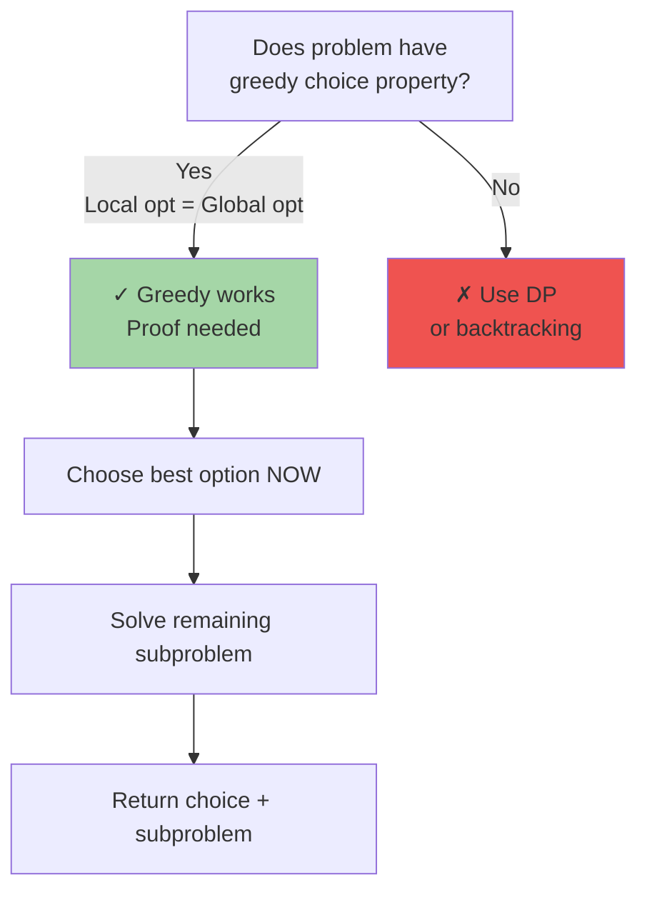

# Greedy Algorithms: Patterns & Decision Rules

A greedy algorithm makes locally optimal choices at each step, hoping to find a global optimum. Unlike DP, it never reconsiders earlier decisions. This works only when the problem exhibits the "greedy choice property" — a globally optimal solution contains optimal solutions to subproblems.

---

## When Greedy Works vs. Fails



**Key Insight:** A greedy solution must prove that:
1. **Greedy choice property**: An optimal solution contains a greedy choice
2. **Optimal substructure**: The subproblem after the greedy choice is also optimal

---

## Master Greedy Patterns

| Category | Examples | Key Insight |
|----------|----------|------------|
| **Interval Scheduling** | Activity Selection, Meeting Rooms | Sort by end time, always take earliest end |
| **Fractional/0-1 Knapsack** | Knapsack, Load Balancing | Sort by value/weight, take greedily |
| **Huffman Coding** | Data compression | Build tree from smallest frequencies |
| **Greedy Graph** | MST (Kruskal/Prim), Dijkstra | Build incrementally, add minimum cost |
| **String/Array** | Jump Game, Container With Most Water | Greedy pointer movement |
| **Coin Change (Canonical)** | Coin changing | Take largest coin greedily (works for real currencies) |

---

## 1. Activity Selection / Interval Scheduling

**Problem:** Given activities with start and end times, select maximum number of non-overlapping activities.

**Greedy Strategy:** Sort by end time, always pick activity ending earliest, skip overlapping.

```
Input: activities = [(1,3), (3,5), (4,7), (2,6), (5,8)]
Sorted by end: [(1,3), (3,5), (2,6), (4,7), (5,8)]

Pick (1,3) → end=3
Next (3,5): 3 <= 3? Yes (point contact OK) → Pick
Next (2,6): 2 < 5? No, skip
Next (4,7): 4 < 5? No, skip
Next (5,8): 5 <= 5? Yes → Pick

Result: [(1,3), (3,5), (5,8)] — 3 activities
```

### Complexity
| Aspect | Value |
|--------|-------|
| Time | O(n log n) for sorting |
| Space | O(1) |
| Correctness | Greedy choice property: activity ending earliest leaves most room for future activities |

### Implementation

**Python:**
```python
def activity_selection(activities):
    # Sort by end time
    activities.sort(key=lambda x: x[1])
    
    selected = [activities[0]]
    last_end = activities[0][1]
    
    for start, end in activities[1:]:
        if start >= last_end:  # No overlap (point contact OK)
            selected.append((start, end))
            last_end = end
    
    return selected
```

**Java:**
```java
import java.util.*;

public class ActivitySelection {
    public static List<int[]> selectActivities(int[][] activities) {
        Arrays.sort(activities, (a, b) -> a[1] - b[1]);
        
        List<int[]> selected = new ArrayList<>();
        selected.add(activities[0]);
        int lastEnd = activities[0][1];
        
        for (int i = 1; i < activities.length; i++) {
            if (activities[i][0] >= lastEnd) {
                selected.add(activities[i]);
                lastEnd = activities[i][1];
            }
        }
        return selected;
    }
}
```

---

## 2. Fractional Knapsack

**Problem:** Given items with weight and value, maximize value in knapsack of capacity W. Items can be split (fractional).

**Greedy Strategy:** Sort by value/weight ratio, take items greedily in descending order.

```
Items: (weight, value)
  (10, 60), (20, 100), (30, 120)
Capacity: 50

Ratios: 6.0, 5.0, 4.0
Sorted by ratio desc: (10,60) ratio 6, (20,100) ratio 5, (30,120) ratio 4

Take (10,60): capacity left = 40, value = 60
Take (20,100): capacity left = 20, value = 160
Take fraction of (30,120): take (20/30)*120 = 80, value = 240

Total: 240 (better than 0/1 knapsack of 220)
```

### Complexity
| Aspect | Value |
|--------|-------|
| Time | O(n log n) for sorting |
| Space | O(1) |
| Correctness | Greedy choice property: always take item with best ratio next |

### Implementation

**Python:**
```python
def fractional_knapsack(items, capacity):
    # Sort by value/weight ratio descending
    items.sort(key=lambda x: x[1]/x[0], reverse=True)
    
    total_value = 0.0
    remaining = capacity
    
    for weight, value in items:
        if remaining <= 0:
            break
        
        if weight <= remaining:
            total_value += value
            remaining -= weight
        else:
            # Take fraction
            fraction = remaining / weight
            total_value += value * fraction
            remaining = 0
    
    return total_value
```

**Java:**
```java
import java.util.*;

public class FractionalKnapsack {
    public static double solve(double[][] items, double capacity) {
        Arrays.sort(items, (a, b) -> Double.compare(b[1]/b[0], a[1]/a[0]));
        
        double totalValue = 0.0;
        double remaining = capacity;
        
        for (double[] item : items) {
            double weight = item[0], value = item[1];
            if (remaining <= 0) break;
            
            if (weight <= remaining) {
                totalValue += value;
                remaining -= weight;
            } else {
                double fraction = remaining / weight;
                totalValue += value * fraction;
                remaining = 0;
            }
        }
        return totalValue;
    }
}
```

---

## 3. Jump Game (Greedy Pointer Movement)

**Problem:** Given array where each element is max jump length, can you reach the last index?

**Greedy Strategy:** Track farthest reachable index. If current index exceeds it, unreachable.

```
Input: [2, 3, 1, 1, 4]
Index:  0  1  2  3  4

i=0: can_reach=0, val=2 → farthest=max(0,0+2)=2
i=1: can_reach=1, 1<=2 OK, val=3 → farthest=max(2,1+3)=4
i=2: can_reach=2, 2<=4 OK, val=1 → farthest=max(4,2+1)=4
Reached farthest=4 >= last=4 ✓

Output: True
```

### Complexity
| Aspect | Value |
|--------|-------|
| Time | O(n) single pass |
| Space | O(1) |
| Correctness | Greedy choice property: always move to position that reaches farthest |

### Implementation

**Python:**
```python
def can_jump(nums):
    farthest = 0
    for i in range(len(nums)):
        if i > farthest:
            return False
        farthest = max(farthest, i + nums[i])
    return True

def jump_game_ii(nums):
    """Minimum jumps to reach end"""
    jumps = 0
    current_end = 0
    farthest = 0
    
    for i in range(len(nums) - 1):
        farthest = max(farthest, i + nums[i])
        if i == current_end:
            jumps += 1
            current_end = farthest
    
    return jumps
```

**Java:**
```java
public class JumpGame {
    public static boolean canJump(int[] nums) {
        int farthest = 0;
        for (int i = 0; i < nums.length; i++) {
            if (i > farthest) return false;
            farthest = Math.max(farthest, i + nums[i]);
        }
        return true;
    }
    
    public static int jumpGameII(int[] nums) {
        int jumps = 0, currentEnd = 0, farthest = 0;
        
        for (int i = 0; i < nums.length - 1; i++) {
            farthest = Math.max(farthest, i + nums[i]);
            if (i == currentEnd) {
                jumps++;
                currentEnd = farthest;
            }
        }
        return jumps;
    }
}
```

---

## 4. Container With Most Water

**Problem:** Given array of heights, find two indices i, j that form container with max area.

**Greedy Strategy:** Use two pointers starting at ends. Move inward from the shorter side (only it can improve area).

```
Input: [1, 8, 6, 2, 5, 4, 8, 3, 7]

Left=0 (h=1), Right=8 (h=7): area = min(1,7) * 8 = 8
Left side is shorter (1 < 7) → move left++

Left=1 (h=8), Right=8 (h=7): area = min(8,7) * 7 = 49
Right side is shorter (7 < 8) → move right--

Left=1 (h=8), Right=7 (h=3): area = min(8,3) * 6 = 18
Continue...

Max area = 49
```

### Complexity
| Aspect | Value |
|--------|-------|
| Time | O(n) single pass |
| Space | O(1) |
| Correctness | Greedy choice property: moving inward from taller side can't improve area |

### Implementation

**Python:**
```python
def max_area(heights):
    left, right = 0, len(heights) - 1
    max_area = 0
    
    while left < right:
        area = min(heights[left], heights[right]) * (right - left)
        max_area = max(max_area, area)
        
        if heights[left] < heights[right]:
            left += 1
        else:
            right -= 1
    
    return max_area
```

**Java:**
```java
public class ContainerWithMostWater {
    public static int maxArea(int[] heights) {
        int left = 0, right = heights.length - 1;
        int maxArea = 0;
        
        while (left < right) {
            int area = Math.min(heights[left], heights[right]) * (right - left);
            maxArea = Math.max(maxArea, area);
            
            if (heights[left] < heights[right]) {
                left++;
            } else {
                right--;
            }
        }
        return maxArea;
    }
}
```

---

## 5. Huffman Coding (Compression)

**Problem:** Build optimal prefix-free code for characters given frequencies.

**Greedy Strategy:** Repeatedly merge two smallest-frequency nodes until tree is built.

```
Frequencies: a=5, b=9, c=12, d=13, e=16

Step 1: Merge a(5) + b(9) = ab(14)
        Nodes: ab(14), c(12), d(13), e(16)

Step 2: Merge c(12) + d(13) = cd(25)
        Nodes: ab(14), cd(25), e(16)

Step 3: Merge ab(14) + e(16) = abe(30)
        Nodes: cd(25), abe(30)

Step 4: Merge cd(25) + abe(30) = root(55)

Tree built. Codes:
  a: 100, b: 101, c: 00, d: 01, e: 11

Average code length = 2.2 bits (optimal)
```

### Complexity
| Aspect | Value |
|--------|-------|
| Time | O(n log n) with heap |
| Space | O(n) for tree |
| Correctness | Greedy choice property: always merge smallest frequencies |

### Implementation

**Python:**
```python
import heapq
from collections import defaultdict

def huffman_codes(frequencies):
    if len(frequencies) == 1:
        # Edge case: single character
        char, freq = list(frequencies.items())[0]
        return {char: '0'}
    
    # Build min heap of (freq, unique_id, node)
    heap = []
    for i, (char, freq) in enumerate(frequencies.items()):
        heapq.heappush(heap, (freq, i, char))
    
    counter = len(frequencies)
    codes = {}
    
    while len(heap) > 1:
        freq1, _, node1 = heapq.heappop(heap)
        freq2, _, node2 = heapq.heappop(heap)
        
        merged_freq = freq1 + freq2
        heapq.heappush(heap, (merged_freq, counter, (node1, node2)))
        counter += 1
    
    _, _, root = heap[0]
    dfs(root, '', codes)
    return codes

def dfs(node, code, codes):
    if isinstance(node, str):  # Leaf
        codes[node] = code
    else:
        dfs(node[0], code + '0', codes)
        dfs(node[1], code + '1', codes)
```

**Java:**
```java
import java.util.*;

public class HuffmanCoding {
    class Node implements Comparable<Node> {
        int freq;
        String char_;
        Node left, right;
        
        Node(int freq, String char_) {
            this.freq = freq;
            this.char_ = char_;
        }
        
        @Override
        public int compareTo(Node other) {
            return this.freq - other.freq;
        }
    }
    
    public Map<String, String> buildCodes(Map<String, Integer> frequencies) {
        PriorityQueue<Node> heap = new PriorityQueue<>();
        
        for (Map.Entry<String, Integer> entry : frequencies.entrySet()) {
            heap.offer(new Node(entry.getValue(), entry.getKey()));
        }
        
        while (heap.size() > 1) {
            Node left = heap.poll();
            Node right = heap.poll();
            
            Node parent = new Node(left.freq + right.freq, null);
            parent.left = left;
            parent.right = right;
            heap.offer(parent);
        }
        
        Map<String, String> codes = new HashMap<>();
        dfs(heap.peek(), "", codes);
        return codes;
    }
    
    private void dfs(Node node, String code, Map<String, String> codes) {
        if (node.char_ != null) {
            codes.put(node.char_, code);
        } else {
            dfs(node.left, code + '0', codes);
            dfs(node.right, code + '1', codes);
        }
    }
}
```

---

## Common Interview Questions

- **Activity Selection vs. Interval Scheduling Maximization:** Sort by end time and greedily pick earliest end. Proof: if opt solution differs, we can swap the first differing activity without losing feasibility.

- **When does greedy fail on 0/1 Knapsack?** Counterexample: W=10, items (6,30), (3,27), (4,25). Greedy by ratio takes (4,25) + (3,27)=52, but opt is (6,30)+(3,27)=57. Use DP instead.

- **Why is Huffman optimal?** Exchange argument: if any two leaves have different depths, we can swap parent-child to reduce avg code length, contradicting optimality.

- **Dijkstra vs. Greedy on DAGs:** Dijkstra works for non-negative weights. On DAGs, greedy (topological sort + relax) also works in O(V+E). On negative weights, neither works; use Bellman-Ford.

- **Jump Game Greedy Proof:** At each position, we know the farthest we can reach. If we can't reach position i from any earlier position, it's impossible. Otherwise, greedy jumps optimize for reaching the end.

---

## Choosing the Right Greedy Pattern

| Problem Type | Greedy Approach | Proof Strategy |
|--------------|-----------------|----------------|
| Interval/Activity | Sort by end, pick earliest | Exchange argument |
| Knapsack (fractional) | Sort by ratio, take greedily | Exchange + swap |
| Huffman/Tree | Merge smallest repeatedly | Induction on tree depth |
| Shortest Path (DAG/non-neg weights) | Relax minimum | Induction on distance |
| Jump/Pointer Movement | Maximize reach/pointer | Reachability invariant |

**Golden Rule:** Always verify greedy choice property and optimal substructure with a proof sketch before implementing!
