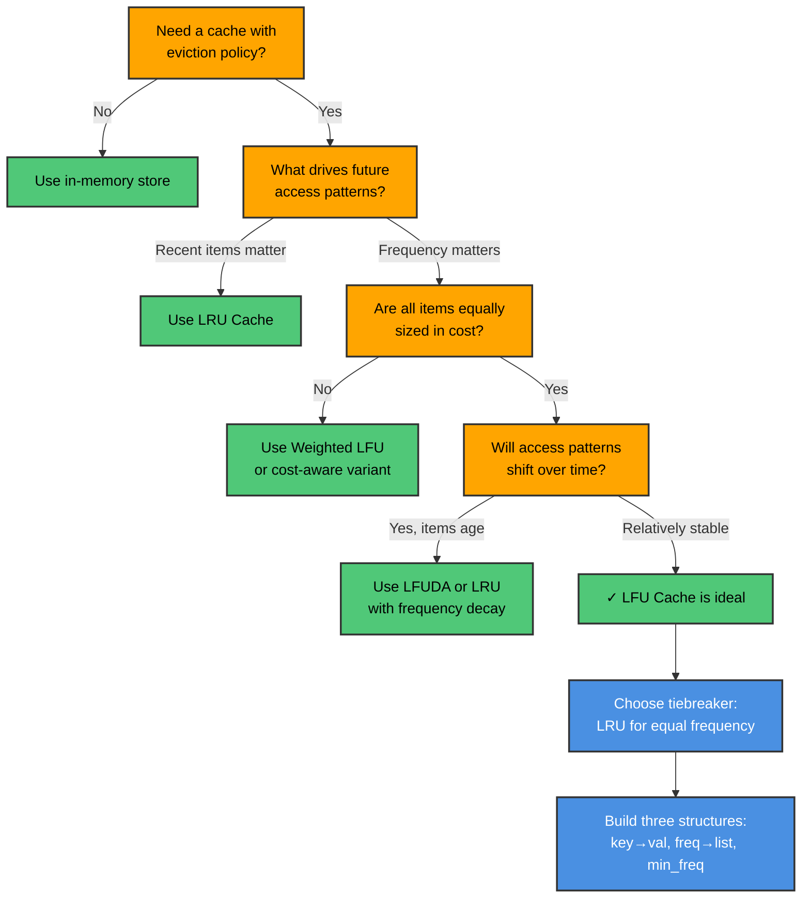
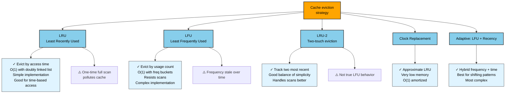
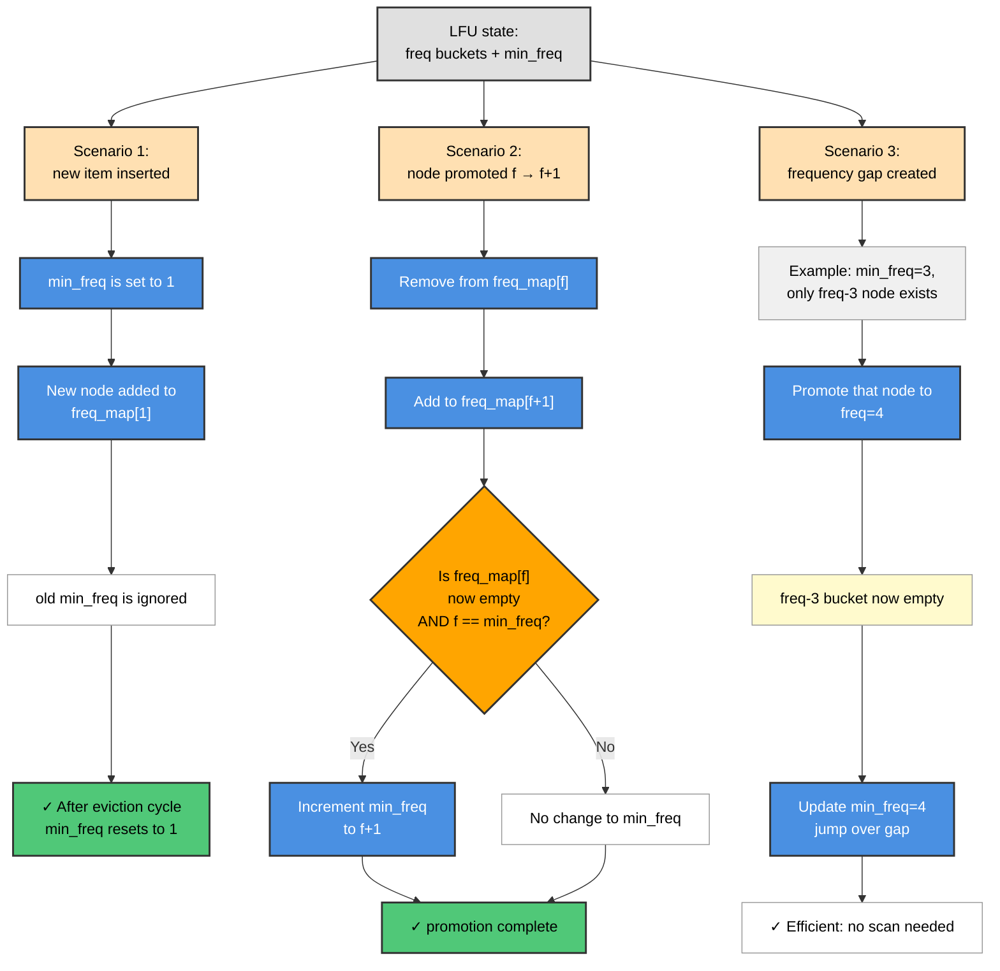
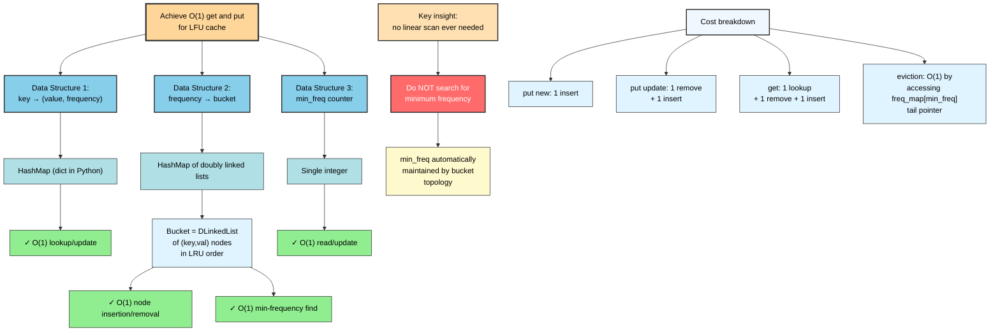
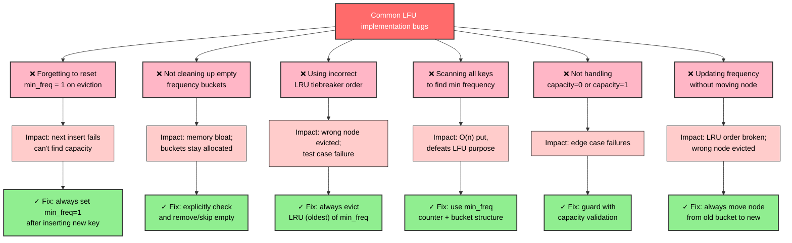

# LFU Cache

A cache eviction policy that always discards the item accessed the fewest number of times, using LRU order to break ties among equally-frequent items.

---

## Overview

An LFU (Least Frequently Used) Cache tracks an access count for every cached item. When capacity is reached and a new item must be inserted, the item with the lowest access frequency is evicted. If multiple items share the minimum frequency, the least recently used among them is removed (LRU tiebreaking), making the policy fully deterministic.

The key engineering challenge is achieving O(1) get and put. A naive approach scans all items to find the minimum frequency in O(n). The optimal solution uses three coordinated data structures: a key→node map for O(1) lookup, a frequency→doubly-linked-list map where each list holds all nodes at that frequency in LRU order, and a single `min_freq` integer maintained in O(1). When a node's frequency increases it is moved from bucket f to bucket f+1; when bucket f becomes empty and f == min_freq, min_freq is incremented. A new insert always resets min_freq to 1.

LFU suits workloads with stable popularity distributions — CDN caches, DNS caches, database buffer pools for hot pages — where repeatedly-accessed items should survive eviction much longer than one-hit wonders. LRU is generally preferred when recency is a better predictor of future access than historical frequency.

---

## Flowcharts

### Problem Recognition: When to Use LFU Cache



### LFU vs LRU vs LRU-2 Decision Tree



### LFU Cache: Insert vs Update vs Eviction Decision

```mermaid
graph TD
    A["LFU Operation"]:::decision
    
    A -->|put(key, val)| B{Key exists?}:::decision
    B -->|No| C["Check capacity"]:::step
    C -->|Available slot| C1["freq=1, reset min_freq=1"]:::action
    C1 --> C2["Insert at freq=1 bucket<br/>MRU end"]:::action
    C2 --> C3["✓ new item added"]:::success
    C -->|Full| C4["Evict from min_freq<br/>LRU position"]:::action
    C4 --> C5["Remove LRU node from<br/>freq_map[min_freq]"]:::action
    C5 --> C6{"freq bucket<br/>empty now?"}:::decision
    C6 -->|Yes, was min_freq| C7["increment min_freq"]:::action
    C6 -->|No| C8["No change"]:::note
    C7 --> C9["Insert new item<br/>at freq=1"]:::action
    C9 --> C3
    
    B -->|Yes| D["Update value"]:::action
    D --> D1["Increment frequency<br/>from f to f+1"]:::action
    D1 --> D2["Move node from<br/>freq_map[f] to freq_map[f+1]"]:::action
    D2 --> D3["Append to MRU end<br/>of new bucket"]:::action
    D3 --> D4{"Was bucket f<br/>now empty?"}:::decision
    D4 -->|Yes, was min_freq| D5["increment min_freq"]:::action
    D4 -->|No| D6["No change"]:::note
    D5 --> D7["✓ node updated & promoted"]:::success
    D6 --> D7
    
    A -->|get(key)| E["Lookup in key_map"]:::action
    E --> E1{"Key found?"}:::decision
    E1 -->|No| E2["Return nil"]:::output
    E1 -->|Yes| E3["Same as put-update:<br/>promote to f+1"]:::action
    E3 --> E4["✓ value returned,<br/>frequency incremented"]:::success
    
    classDef decision fill:#FFA500,stroke:#333,stroke-width:2px,color:#000
    classDef action fill:#4A90E2,stroke:#333,stroke-width:2px,color:#fff
    classDef step fill:#B0E0E6,stroke:#333,stroke-width:1px,color:#000
    classDef note fill:#FFFFFF,stroke:#999,stroke-width:1px,color:#000
    classDef output fill:#D3D3D3,stroke:#333,stroke-width:1px,color:#000
    classDef success fill:#50C878,stroke:#333,stroke-width:2px,color:#000
```

### Frequency Bucket Management: min_freq Transitions



### Complexity Analysis: O(1) Implementation Requirements



### Common Mistakes & Implementation Pitfalls



---

## ASCII Visualization

```
LFU Cache, capacity=3.  State after: put(A), put(B), put(C), get(A), get(A), get(B)

freq_map:
  freq=1 -> [C]                     (C is LRU victim if eviction needed)
  freq=2 -> [B]
  freq=3 -> [A]

  min_freq = 1   (always tracks the smallest occupied frequency bucket)

key_map:   A->(val_a, freq=3)   B->(val_b, freq=2)   C->(val_c, freq=1)

Each freq bucket is a doubly linked list (head <-> nodes <-> tail):

freq=1 bucket:    [HEAD] <-> [C, freq=1] <-> [TAIL]
                              ^ LRU end (evict from here)

freq=2 bucket:    [HEAD] <-> [B, freq=2] <-> [TAIL]

Now put(D) triggers eviction (capacity=3, all slots taken):
  1. Evict from freq_map[min_freq=1] -> remove C (LRU of freq-1 bucket)
  2. Insert D with freq=1, reset min_freq=1

freq_map after:
  freq=1 -> [D]
  freq=2 -> [B]
  freq=3 -> [A]

Tiebreaking example (two items at min_freq):
  freq=1 -> [HEAD] <-> [X] <-> [Y] <-> [TAIL]
             LRU end ^                   ^ MRU end
  Eviction removes X (arrived/accessed earlier)
```

---

## Operations & Complexity

| Operation | Average | Worst | Notes                                               |
|-----------|---------|-------|-----------------------------------------------------|
| `get(key)`| O(1)    | O(1)  | Lookup in key_map + move node to freq+1 bucket      |
| `put(key, val)` | O(1) | O(1) | Insert at freq=1 or update + promote existing key |
| Space     | O(n)    | O(n)  | n = capacity; freq buckets together hold n nodes    |

- O(1) requires the doubly linked list + min_freq trick (LFUCacheOptimal).
- A simpler implementation using Counter + OrderedDict achieves O(1) get but O(n) put due to minimum-frequency scan.

---

## Key Invariants

- Every key in `key_map` is in **exactly one** frequency bucket in `freq_map`.
- `min_freq` always equals the smallest frequency with a non-empty bucket.
- When a new item is inserted, `min_freq` is reset to **1** — the new item always has the lowest possible frequency.
- When `freq_map[f]` becomes empty and `f == min_freq`, `min_freq` is incremented to `f+1`.
- Within each frequency bucket, nodes are maintained in **LRU order**: the head side is the oldest (eviction candidate), the tail side is the most recently accessed.
- Accessing a node (get or put-update) moves it from bucket `f` to bucket `f+1` and appends it at the MRU end of the new bucket.

---

## Common Interview Questions

- **What is the difference between LRU and LFU eviction?** LRU evicts the item not accessed for the longest time (recency); LFU evicts the item accessed the fewest total times (frequency). LFU is more resistant to one-time scans polluting the cache.
- **How do you achieve O(1) get and put for LFU?** Three structures: key→node hashmap, freq→DLinkedList hashmap, and a `min_freq` counter. Moving a node between frequency buckets and updating `min_freq` are both O(1).
- **When does LFU degrade in practice?** When access patterns shift over time: an item popular long ago accumulates high frequency and is unfairly protected even after its usefulness expires (frequency aging problem). Solutions include frequency decay or LFUDA (LFU with Dynamic Aging).
- **What is the LRU tiebreaking rule and why does it matter?** Among all items at `min_freq`, the least recently used is evicted. Without this rule, eviction would be non-deterministic and could fail LeetCode 460 test cases.
- **Implement LFU cache** (LeetCode 460) — the canonical interview problem. Must handle capacity=1 edge case and the min_freq reset on every new insertion.
- **Compare LFU to LRU implementation complexity.** LRU needs one doubly linked list + one hashmap; LFU needs two hashmaps + per-frequency doubly linked lists + min_freq tracking — significantly more complex.

---

## Implementation Notes

- **min_freq reset on insert**: every new key starts at frequency 1, so `min_freq = 1` after any eviction+insert cycle. Forgetting this reset is the most common bug.
- **Empty bucket cleanup**: after removing a node from `freq_map[f]`, check if the bucket is empty. If so and `f == min_freq`, increment `min_freq`. Do not delete empty buckets eagerly when using `defaultdict` — they will be recreated on the next access to that frequency.
- **OrderedDict as ordered set**: `freq_map[f][key] = None` uses the OrderedDict purely for its insertion-order `popitem(last=False)` behavior, not for stored values. This is the pattern used by LFUCacheSimple.
- **Sentinel nodes in doubly linked list**: the `_FreqBucket` uses head/tail sentinel nodes so that `append` and `remove` never need null checks — every real node has valid `prev` and `next` pointers.
- **Capacity=0 edge case**: the constructor rejects non-positive capacity with a `ValueError`; LeetCode's variant uses capacity=0 to mean all puts are no-ops.
- **Duplicate puts**: calling `put(key, val)` for an existing key must update the value and increment its frequency — treat it as a "get + update", not as a new insert.

---

## References

- [LeetCode 460 — LFU Cache (problem statement and constraints)](https://leetcode.com/problems/lfu-cache/)
- [Wikipedia — Cache replacement policies — LFU](https://en.wikipedia.org/wiki/Cache_replacement_policies#Least-frequently_used_(LFU))
- [Einziger, G. & Friedman, R. (2014). TinyLFU: A Highly Efficient Cache Admission Policy. IEEE Transactions on Storage.](https://arxiv.org/abs/1512.00727)
