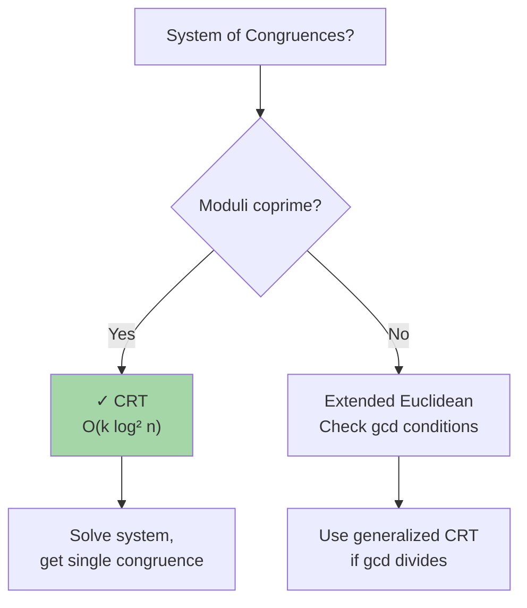

# Chinese Remainder Theorem: Solving Modular Systems

The Chinese Remainder Theorem (CRT) solves systems of linear congruences with coprime moduli in O(k log² n) time where k = number of congruences.

---

## When to Use CRT



**CRT applies to:**
- Find x where x ≡ a₁ (mod m₁), x ≡ a₂ (mod m₂), ...
- Moduli m₁, m₂, ... are pairwise coprime
- Need to recover number from residues

---

## CRT Theorem

**Statement:** If m₁, m₂, ..., mₖ are pairwise coprime, the system:
```
x ≡ a₁ (mod m₁)
x ≡ a₂ (mod m₂)
...
x ≡ aₖ (mod mₖ)
```

has a unique solution modulo M = m₁ × m₂ × ... × mₖ.

**Solution formula:**
```
x = Σ(aᵢ × Mᵢ × yᵢ) mod M
where Mᵢ = M / mᵢ
      yᵢ = Mᵢ⁻¹ (mod mᵢ)
```

---

## Example: Reconstruct Number from Residues

```
Find x such that:
  x ≡ 2 (mod 3)
  x ≡ 3 (mod 5)
  x ≡ 2 (mod 7)

Step 1: M = 3 × 5 × 7 = 105

Step 2: Compute Mᵢ values:
  M₁ = 105 / 3 = 35
  M₂ = 105 / 5 = 21
  M₃ = 105 / 7 = 15

Step 3: Find modular inverses:
  y₁ = 35⁻¹ (mod 3) = 2⁻¹ (mod 3) = 2  (since 2×2=4≡1 mod 3)
  y₂ = 21⁻¹ (mod 5) = 1⁻¹ (mod 5) = 1  (since 1×1=1 mod 5)
  y₃ = 15⁻¹ (mod 7) = 1⁻¹ (mod 7) = 1  (since 1×1=1 mod 7)

Step 4: Compute solution:
  x = (2×35×2 + 3×21×1 + 2×15×1) mod 105
    = (140 + 63 + 30) mod 105
    = 233 mod 105
    = 23

Verify:
  23 mod 3 = 2 ✓
  23 mod 5 = 3 ✓
  23 mod 7 = 2 ✓
```

---

## Implementation

### Basic CRT (Pairwise Coprime)

**Python:**
```python
def extended_gcd(a, b):
    if b == 0:
        return a, 1, 0
    gcd, x1, y1 = extended_gcd(b, a % b)
    x = y1
    y = x1 - (a // b) * y1
    return gcd, x, y

def mod_inverse(a, m):
    gcd, x, _ = extended_gcd(a, m)
    if gcd != 1:
        return None
    return (x % m + m) % m

def chinese_remainder_theorem(residues, moduli):
    """
    Solve system x ≡ residues[i] (mod moduli[i])
    Assumes moduli are pairwise coprime
    Returns (solution, modulus_product)
    """
    if not residues or not moduli:
        return None
    
    M = 1
    for m in moduli:
        M *= m
    
    result = 0
    for i, (a, m) in enumerate(zip(residues, moduli)):
        M_i = M // m
        y_i = mod_inverse(M_i, m)
        result += a * M_i * y_i
    
    return result % M, M

# Example
residues = [2, 3, 2]
moduli = [3, 5, 7]
solution, M = chinese_remainder_theorem(residues, moduli)
print(f"x = {solution} (mod {M})")  # x = 23 (mod 105)
```

**Java:**
```java
public class ChineseRemainderTheorem {
    public static long[] extendedGcd(long a, long b) {
        if (b == 0) {
            return new long[]{a, 1, 0};
        }
        long[] result = extendedGcd(b, a % b);
        long gcd = result[0], x1 = result[1], y1 = result[2];
        long x = y1;
        long y = x1 - (a / b) * y1;
        return new long[]{gcd, x, y};
    }
    
    public static long modInverse(long a, long m) {
        long[] result = extendedGcd(a, m);
        long gcd = result[0];
        long x = result[1];
        if (gcd != 1) return -1;
        return ((x % m) + m) % m;
    }
    
    public static long[] crt(long[] residues, long[] moduli) {
        long M = 1;
        for (long m : moduli) {
            M *= m;
        }
        
        long result = 0;
        for (int i = 0; i < residues.length; i++) {
            long Mi = M / moduli[i];
            long yi = modInverse(Mi, moduli[i]);
            result += residues[i] * Mi * yi;
        }
        
        return new long[]{result % M, M};
    }
}
```

---

## Generalized CRT: Non-Coprime Moduli

When moduli are **not** pairwise coprime, use extended CRT if solution exists.

**Condition:** Solution exists iff for all pairs (i, j):
```
gcd(mᵢ, mⱼ) divides (aᵢ - aⱼ)
```

**Algorithm:** Merge congruences pairwise.

```python
def merge_congruences(a1, m1, a2, m2):
    """Merge x ≡ a1 (mod m1) and x ≡ a2 (mod m2)"""
    gcd, x, y = extended_gcd(m1, m2)
    
    if (a2 - a1) % gcd != 0:
        return None  # No solution
    
    lcm = m1 * m2 // gcd
    k = (a2 - a1) // gcd
    solution = (a1 + k * x * m1) % lcm
    
    return solution, lcm

def generalized_crt(residues, moduli):
    """Handle non-coprime moduli"""
    a, m = residues[0], moduli[0]
    
    for i in range(1, len(residues)):
        result = merge_congruences(a, m, residues[i], moduli[i])
        if result is None:
            return None
        a, m = result
    
    return a, m
```

---

## Applications

| Problem | Technique | Notes |
|---------|-----------|-------|
| **Reconstruct from residues** | CRT | Used in distributed systems |
| **Compute modular exp fast** | CRT + Fast Pow | Split by CRT, compute separately |
| **Solve linear Diophantine** | Extended GCD | Special case of CRT |
| **Chinese postman** | Graph + CRT | Residue constraints |
| **Periodic sequences** | CRT | Find period from cycle info |

---

## CRT vs Alternatives

| Problem | CRT | Method |
|---------|-----|--------|
| Single congruence | - | Direct |
| System (coprime) | ✓ O(k log² n) | Solve by hand |
| System (non-coprime) | ✓ Generalized | Check gcd |
| Modular exponentiation | ✓ Optimized | Standard pow if small |

---

## Complexity Analysis

**Standard CRT:**
```
k congruences, each modulus ≤ n:
- Extended GCD: O(log n) per pair
- k pairs: O(k log n)
- Compute inverse: O(log n)
- Total: O(k log² n)
```

**Generalized CRT:**
```
- Merge all congruences: O(k log² n) (same as standard)
```

---

## Common Interview Questions

- **"Solve the system x ≡ 2 (mod 3), x ≡ 3 (mod 5)."** Use CRT. M=15, M₁=5, M₂=3. y₁=5⁻¹ mod 3=2, y₂=3⁻¹ mod 5=2. x=(2×5×2 + 3×3×2) mod 15 = 38 mod 15 = 8.

- **"What if moduli aren't coprime?"** Check gcd(mᵢ, mⱼ) divides (aᵢ - aⱼ). If yes, use generalized CRT (merge pairwise).

- **"How does CRT optimize modular exponentiation?"** For a^b mod (p×q): compute a^b mod p and a^b mod q separately (faster if p, q small), then reconstruct via CRT.

- **"Why does CRT work?"** By Bézout's identity, coprime moduli allow expressing 1 = u×m₁ + v×m₂. Scaling gives basis for reconstruction.

---

## CRT Checklist

- ✓ Understand CRT statement and conditions (pairwise coprime)
- ✓ Extended GCD: compute ax + by = gcd(a,b)
- ✓ Modular inverse: a⁻¹ mod m via extended GCD
- ✓ Formula: x = Σ(aᵢ × Mᵢ × yᵢ) mod M
- ✓ Generalized CRT: merge pairwise for non-coprime
- ✓ Check solvability: gcd(mᵢ, mⱼ) | (aᵢ - aⱼ)
- ✓ Apply to modular exponentiation optimization
- ✓ Verify solution by substituting back
