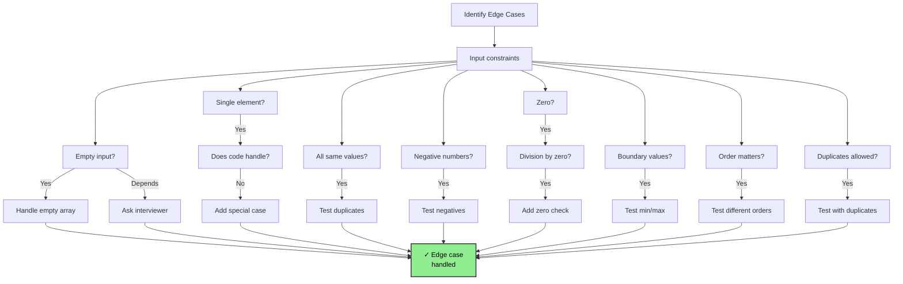
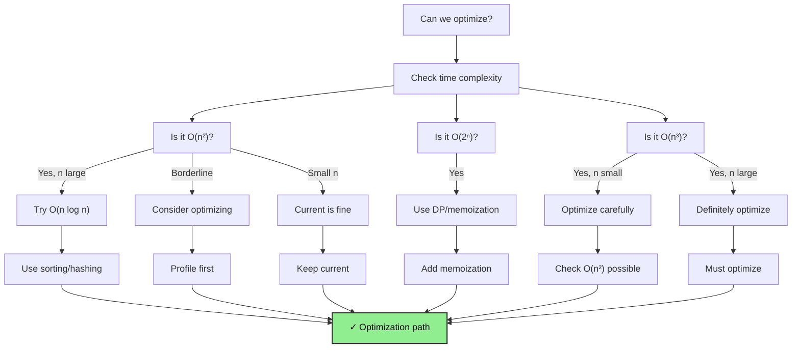
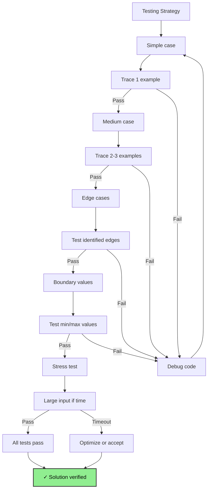
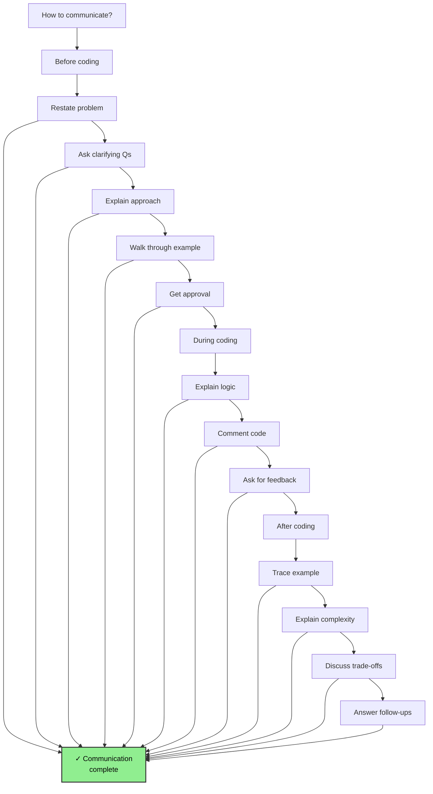
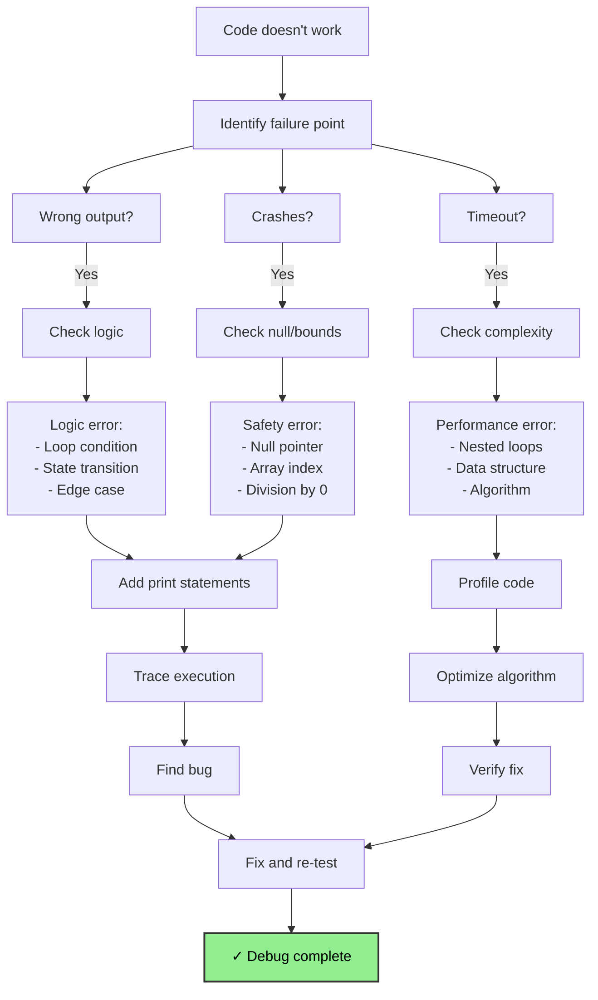
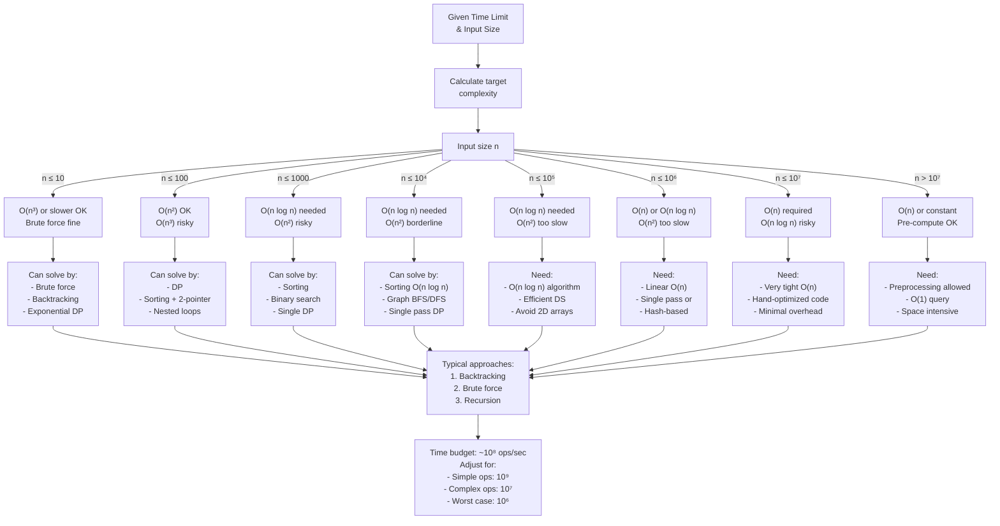

# General Problem-Solving Flowchart

## How to Use This Guide

This guide presents a systematic framework for solving interview problems from start to finish. Follow the flowchart step-by-step to ensure you don't miss critical details and arrive at an optimal solution.

**Duration:** Apply this 15-25 minute framework depending on problem complexity. In 45-minute interviews, you should spend:
- 5-7 minutes: Understanding and planning
- 15-20 minutes: Implementing
- 5-8 minutes: Testing and optimization
- 2-3 minutes: Complexity analysis

---

## The Interview Problem-Solving Framework (Enhanced)

```mermaid
graph TD
    A["🎯 START: Interview Problem Received"] --> B["Step 1: Clarify & Understand"]
    
    B --> C["Ask clarifying questions:<br/>- Input/output format?<br/>- Range of input?<br/>- Duplicates allowed?<br/>- Empty input?<br/>- Modify input OK?<br/>- Special constraints?<br/>- Examples provided?"]
    
    C --> D["Restate problem:<br/>- Repeat back<br/>- Show examples<br/>- List assumptions<br/>- Confirm with interviewer"]
    
    D --> E["Document:<br/>- Write problem statement<br/>- Note edge cases<br/>- Mark constraints"]
    
    E --> F["Step 2: Identify Constraints"]
    
    F --> G["Analyze input size:<br/>- Is n ≤ 10? 100? 1K? 10K?<br/>- What about m, k, etc?<br/>- Time limit implications<br/>- 10⁶-10⁸ operations/sec?"]
    
    F --> H["Identify constraints:<br/>- Time limit? Memory limit?<br/>- Sorted input?<br/>- All positive numbers?<br/>- Modulo required?<br/>- In-place required?"]
    
    E --> I["Identify patterns:<br/>- Subarray/substring?<br/>- Interval problem?<br/>- Tree/graph problem?<br/>- DP problem?<br/>- Greedy possible?"]
    
    I --> J["Step 3: Plan Approach"]
    
    J --> K["Identify operations needed:<br/>- Lookup frequency?<br/>- Insertion/deletion?<br/>- Range queries?<br/>- Ordering needed?<br/>- Caching needed?"]
    
    K --> L["Select data structure:<br/>- Use DS Selection Guide<br/>- Justify choice<br/>- Consider alternatives"]
    
    L --> M["Select algorithm:<br/>- Use Algorithm Guide<br/>- Verify complexity OK<br/>- Check against constraints"]
    
    M --> N["Walk through approach:<br/>- Trace 2-3 examples<br/>- Verify correctness<br/>- Identify edge cases"]
    
    N --> O{"Does approach<br/>work?"}
    
    O -->|No| P["Revise:<br/>- Change DS?<br/>- Change algorithm?<br/>- Try different approach"]
    
    P --> N
    
    O -->|Yes| Q["Get interviewer OK:<br/>- Explain approach<br/>- Ask for approval<br/>- Ask to proceed"]
    
    Q --> R["Step 4: Code the Solution"]
    
    R --> S["Edge case handling:<br/>- Add null/empty checks<br/>- Handle boundaries<br/>- Test edge cases first"]
    
    S --> T["Implement main logic:<br/>- Code step-by-step<br/>- Clear variable names<br/>- Add comments for complex"]
    
    T --> U["Code quality:<br/>- DRY principle<br/>- Early returns<br/>- Clear structure"]
    
    U --> V["Code review:<br/>- Check syntax<br/>- Verify logic<br/>- Spot obvious bugs"]
    
    V --> W["Step 5: Test Thoroughly"]
    
    W --> X["Test cases:<br/>- Simple example<br/>- Medium complexity<br/>- Large input<br/>- Edge cases"]
    
    X --> Y["Identified edge cases:<br/>- Empty input<br/>- Single element<br/>- All same values<br/>- Negative/zero<br/>- Boundary values"]
    
    Y --> Z["Trace execution:<br/>- Manual walkthrough<br/>- Print debugging<br/>- Verify state changes"]
    
    Z --> AA{"All tests<br/>pass?"}
    
    AA -->|No| AB["Debug:<br/>- Identify root cause<br/>- Fix logic issue<br/>- Re-test"]
    
    AB --> Z
    
    AA -->|Yes| AC["Verify correctness<br/>one more time"]
    
    AC --> AD["Step 6: Analyze Complexity"]
    
    AD --> AE["Time complexity:<br/>- Count all operations<br/>- Identify loop nesting<br/>- Account for DS ops<br/>- Check against limits"]
    
    AD --> AF["Space complexity:<br/>- Variables/DS size<br/>- Recursion depth<br/>- Hidden allocations<br/>- Stack vs heap"]
    
    AF --> AG["Verify against constraints:<br/>- Time OK?<br/>- Space OK?<br/>- Match requirements?"]
    
    AG --> AH{"Can we<br/>optimize?"}
    
    AH -->|Easy win| AI["Optimize:<br/>- Better DS?<br/>- Better algorithm?<br/>- Reduce overhead?<br/>- Re-code and test"]
    
    AI --> AD
    
    AH -->|No or risky| AJ["Present solution"]
    
    AJ --> AK["Step 7: Discuss & Refine"]
    
    AK --> AL["Discuss complexity:<br/>- Time analysis<br/>- Space analysis<br/>- Trade-offs made<br/>- Why this approach"]
    
    AL --> AM["Discuss alternatives:<br/>- Other DS choices?<br/>- Other algorithms?<br/>- Space-time tradeoffs?<br/>- Why not X?"]
    
    AM --> AN["Answer follow-ups:<br/>- Change for new constraint?<br/>- Handle duplicates better?<br/>- Optimize space?<br/>- Optimize time?<br/>- Parallel version?"]
    
    AN --> AO["Step 8: Final Review"]
    
    AO --> AP["Code correctness:<br/>- No bugs visible<br/>- Edge cases handled<br/>- Logic sound"]
    
    AO --> AQ["Communication:<br/>- Explained clearly<br/>- Answered questions<br/>- Good discussion"]
    
    AQ --> AR["✅ DONE:<br/>Clean solution<br/>Good explanation<br/>Problem solved"]
    
    style A fill:#ffb3ba,color:#000,stroke:#333,stroke-width:2px
    style AR fill:#90ee90,color:#000,stroke:#333,stroke-width:2px
    
    classDef step fill:#ffe6e6
    class B,F,J,R,W,AD,AK,AO step
```



---

## Edge Case Identification Flowchart



---

## Optimization Opportunity Detection Tree



---

## Testing Strategy Flowchart



---

## Interview Communication Flowchart



---

## Debugging Decision Tree



---

## Complexity Analysis Decision Tree



### Complexity Reference Quick Table

| Input Size | Acceptable Complexity | Achievable Operations | Example |
|---|---|---|---|
| n ≤ 10 | O(n³), O(2ⁿ) | Brute force, all subsets | Permutation generation |
| n ≤ 100 | O(n²), O(n² log n) | Nested loops | Selection sort on small data |
| n ≤ 1,000 | O(n²) tight, O(n log n) safe | ~10⁶ operations | Bubble sort, 2D DP |
| n ≤ 10,000 | O(n log n), O(n√n) | ~10⁷ operations | Merge sort, complex DP |
| n ≤ 100,000 | O(n log n) | ~10⁶ operations | Quick sort, Dijkstra |
| n ≤ 1,000,000 | O(n), O(n log n) | ~10⁷ operations | Hash lookup, BFS |
| n > 1,000,000 | O(n), O(1) with preprocessing | ~10⁸ operations | Streaming, precompute |

**Time calculation:** Operations ÷ (10⁶ to 10⁹) ≈ seconds (depending on operation complexity)

---

## Common Pitfalls & How to Avoid

### 1. Not Reading Carefully

**❌ Pitfall:** Miss key constraint like "sorted" or "in-place"

**Solution:**
- Reread problem statement word-by-word
- Circle important keywords
- Ask clarifying questions
- Restate problem to interviewer

**Example:** "Is the array sorted?" changes HashMap O(1) vs BST O(log n)

---

### 2. Wrong Data Structure Choice

**❌ Pitfall:** Use array when HashMap needed, or vice versa

**Solution:**
- Identify critical operations first (lookup vs insertion vs deletion)
- Match DS to operation frequency
- Use DS Selection Guide (ds_selection_guide.md)

**Example:** 
- Need fast lookup → HashMap
- Need ordered traversal → TreeMap or BST
- Need k-largest → Min Heap

---

### 3. Not Handling Edge Cases

**❌ Pitfall:** Code works for main case but fails on: empty input, single element, all duplicates

**Solution:**
- Explicitly list edge cases
- Test each one before submission
- Add boundary checks in code

**Edge case checklist:**
```
□ Empty input (array length 0)
□ Single element
□ Two elements
□ All same values
□ All negative/all positive (if applicable)
□ Maximum/minimum constraints
□ Null/None values
```

---

### 4. Inefficient Time Complexity

**❌ Pitfall:** O(n²) solution on n=10⁶ input (100 billion operations = timeout)

**Solution:**
- Calculate required complexity before coding
- Use complexity reference table
- Don't optimize prematurely but aim for required complexity first

**Example:**
- n=10⁶: Need O(n) or O(n log n)
- n=1000: Can do O(n²) or even O(n²·log n)

---

### 5. Space Leak or Unbounded Memory

**❌ Pitfall:** Store all intermediate results, hit memory limit

**Solution:**
- Calculate space needed upfront
- Use rolling arrays for DP when possible
- Clean up large temporary structures
- Consider streaming/online algorithms

**Example:** Don't store all prefixes; compute on the fly

---

### 6. Off-by-One Errors in Loops

**❌ Pitfall:** `for i in range(n)` vs `for i in range(n-1)`, fence-post errors

**Solution:**
- Be careful with array indexing
- Use inclusive/exclusive bounds clearly
- Test with small arrays: n=1, n=2, n=3

**Debug technique:**
```python
# Instead of: for i in range(n)
# Trace: what's the last value of i?
# If you need 0 to n-1: range(n) ✓
# If you need 0 to n-2: range(n-1) ✓
```

---

### 7. Inefficient String/Array Concatenation

**❌ Pitfall:** `result = "" + str(x)` in loop = O(n²) on strings

**Solution:**
- Use list and join: `result = []; result.append(x); ''.join(result)`
- Or StringBuilder equivalent in Java
- For array building, append not extend

**Java example:**
```java
StringBuilder sb = new StringBuilder();
for (char c : arr) {
    sb.append(c);
}
return sb.toString(); // O(n)
// NOT: String s = ""; for ... s += c; // O(n²)
```

---

### 8. Not Verifying Algorithm Correctness

**❌ Pitfall:** Implement algorithm without understanding it

**Solution:**
- Trace through algorithm with at least 2 examples
- Verify loop invariants
- Check base cases and termination

**Example:** Before coding binary search, trace with: [1,3], [1,3,5], [2,4,6,8]

---

### 9. Confusing Similar Data Structures

**❌ Pitfall:** Use HashMap when should use TreeMap (need sorted order)

**Solution:**
- Know when each DS is appropriate
- Review before coding:
  - HashMap: Fast lookup, no order
  - TreeMap: Fast lookup, sorted order
  - Heap: Fast min/max, no random access
  - Trie: Fast prefix matching

---

### 10. Not Communicating Progress

**❌ Pitfall:** Silent coding, interviewer can't follow your logic

**Solution:**
- Explain approach before coding
- Name variables clearly
- Add comments for non-obvious logic
- Ask for feedback at key points

---

## Step-by-Step Walkthrough Example

### Problem: "Two Sum"
Find two numbers that add to target value.

#### Step 1: Clarify
```
Q: Can I use the same element twice?
A: No, must be different indices.

Q: Can array have duplicates?
A: Yes.

Q: What if no solution exists?
A: Return empty array or [-1, -1].

Q: Can array be empty?
A: No, at least 2 elements.
```

#### Step 2: Constraints
```
Input: array of n numbers, 1 ≤ n ≤ 10⁵
Time: Should be < 1 second → O(n) or O(n log n)
Space: Not specified → O(n) acceptable
```

#### Step 3: Plan
```
Option 1: Brute force O(n²)
- Try every pair
- Problem: Too slow for n=10⁵

Option 2: Sort + two pointers O(n log n)
- Sort array
- Use two pointers
- Good for space-conscious

Option 3: HashMap O(n)
- For each number, check if (target - number) exists
- Best for time

✓ CHOOSE: HashMap (optimal)
```

#### Step 4: Code
```python
def twoSum(nums, target):
    seen = {}
    for i, num in enumerate(nums):
        complement = target - num
        if complement in seen:
            return [seen[complement], i]
        seen[num] = i
    return []
```

#### Step 5: Test
```
Test 1: nums=[2,7,11,15], target=9
- i=0, num=2: complement=7, not seen, seen={2:0}
- i=1, num=7: complement=2, FOUND seen[2]=0, return [0,1] ✓

Test 2: nums=[3,3], target=6
- i=0, num=3: complement=3, not seen, seen={3:0}
- i=1, num=3: complement=3, FOUND seen[3]=0, return [0,1] ✓

Test 3: nums=[1,2], target=4
- i=0, num=1: complement=3, not seen, seen={1:0}
- i=1, num=2: complement=2, not seen, seen={1:0,2:1}
- return [] ✓
```

#### Step 6: Complexity Analysis
```
Time: O(n) - single pass through array
Space: O(n) - hashmap stores up to n elements

Within constraints? ✓
Can optimize? No, O(n) is optimal for this approach
```

#### Step 7: Discussion
```
Interviewer: Can you optimize space?
Answer: Not with this approach. Could use two-pointer on sorted array:
- Space: O(1) if no output array (or O(n) for sorted copy)
- Time: O(n log n) due to sort
- Trade-off: Better space, worse time

I chose HashMap because time is usually more important in interviews,
and O(n) time with O(n) space is better than O(n log n) time.
```

---

## Interview Day Tips

### Before You Start Coding
1. **Read problem twice** - catch constraints
2. **Ask clarifying questions** - 2-3 minutes well spent
3. **State your approach** - "I'll use HashMap and iterate once"
4. **Trace with example** - before any code
5. **Get approval** - "Does this approach sound good?"

### While Coding
1. **Name variables clearly** - `complement` not `c`, `seen_numbers` not `s`
2. **Write edge case handling first** - empty input, single element
3. **Add comments for complex logic** - but not obvious parts
4. **Code slowly and deliberately** - no rushing
5. **Compile/run as you go** - test incrementally

### After Coding
1. **Walkthrough with example** - trace through your code
2. **Test edge cases** - empty, single, duplicates, boundary
3. **Explain complexity** - time AND space
4. **Discuss trade-offs** - why this over alternatives
5. **Answer follow-up questions** - show flexibility

---

## Problem-Solving Checklist

### Pre-Implementation
- [ ] Reread problem statement
- [ ] Clarify ambiguous parts with interviewer
- [ ] Identify input/output formats
- [ ] List all edge cases
- [ ] State algorithm approach
- [ ] Verify approach with examples
- [ ] Estimate time/space

### During Implementation
- [ ] Handle edge cases first
- [ ] Use clear variable names
- [ ] Comment non-obvious code
- [ ] Avoid common pitfalls (off-by-one, string concat, etc)
- [ ] Test incrementally

### Post-Implementation
- [ ] Manually trace with example
- [ ] Test with edge cases
- [ ] Calculate actual complexity
- [ ] Verify against time/space limits
- [ ] Discuss alternatives
- [ ] Answer follow-up questions

---

## Common Interview Follow-up Questions

**"Can you optimize the space complexity?"**
- Trade time for space? (e.g., sort array for two-pointer)
- Use auxiliary structures? (e.g., index structures)
- Use in-place modifications? (if input modifiable)

**"What if you can't modify the input?"**
- Use different approach that doesn't mutate
- Or use copy of input

**"How would this change if n was 10⁹?"**
- Would you use streaming/online algorithm?
- Preprocess/index data?
- Use external sorting/data structures?

**"How would you test this in production?"**
- Unit tests for edge cases
- Property-based testing
- Fuzz testing
- Performance benchmarks

**"How would you explain this to someone else?"**
- Teach out loud
- Draw diagrams
- Use simple examples
- Start with brute force, then optimize

---

## Practice Problem Structure

Use this structure when practicing:

```
PROBLEM: [Name & link]
CATEGORY: [Sorting/DP/Graph/etc]
DIFFICULTY: [Easy/Medium/Hard]

UNDERSTANDING:
- Input: [Format & constraints]
- Output: [Format & constraints]
- Examples: [At least 3]
- Edge cases: [List]

APPROACH:
- DS needed: [Which and why]
- Algorithm: [Which and why]
- Time: [Complexity]
- Space: [Complexity]

IMPLEMENTATION:
- Code
- Comments

TESTING:
- Test cases traced
- Edge cases verified

REVIEW:
- Complexity verified
- Alternatives discussed
- Mistakes learned
```

Use this framework for every problem you practice. After 20-30 problems, it becomes second nature!

