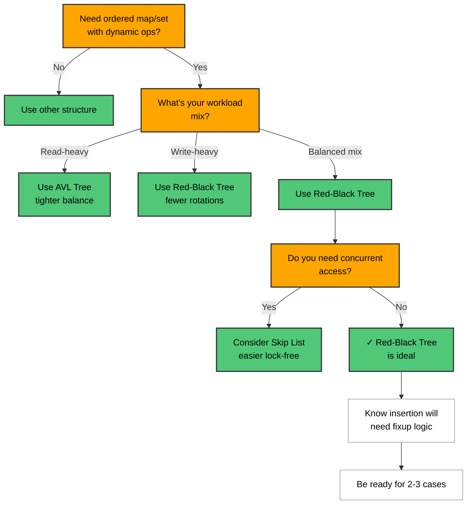
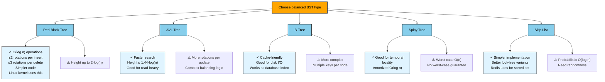
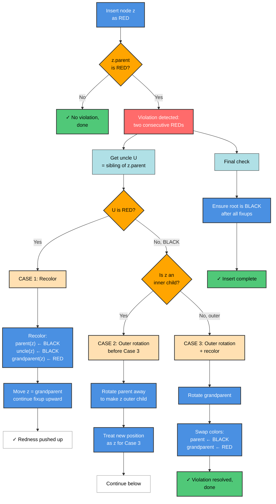
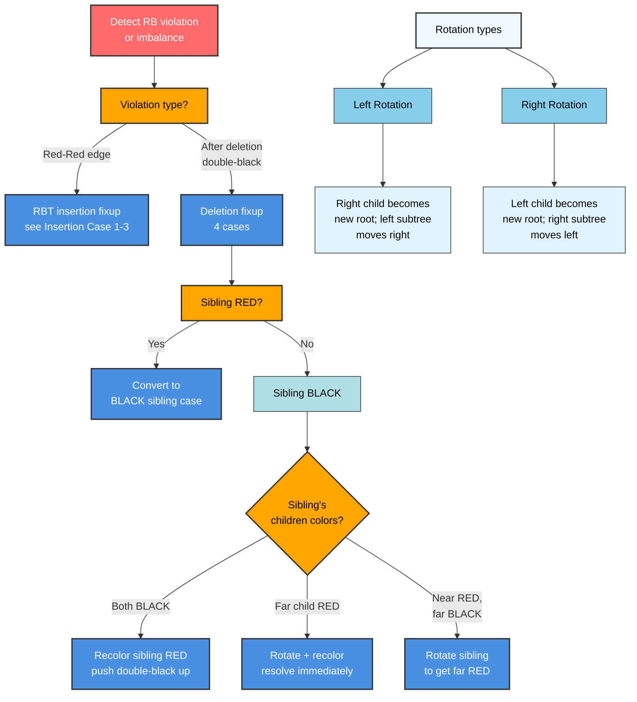
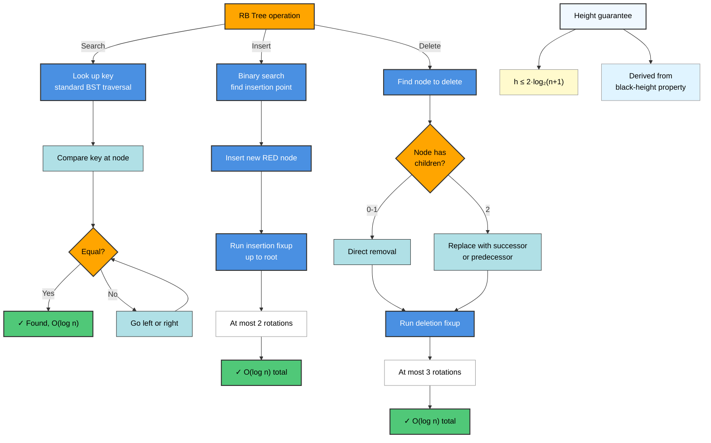
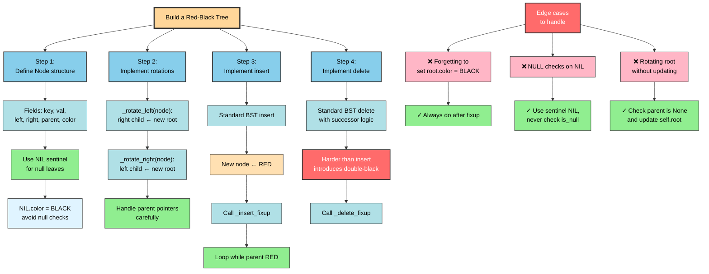
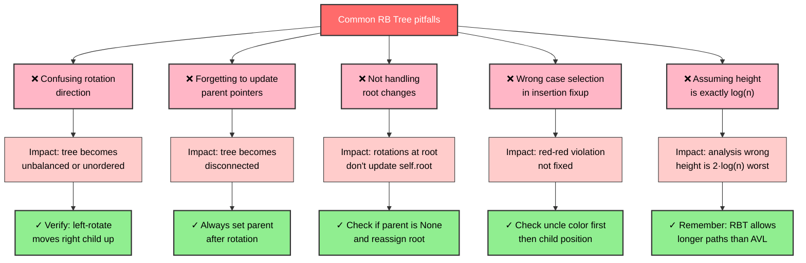

# Red-Black Tree

## Overview

A Red-Black Tree (RBT) is a self-balancing BST that uses a one-bit color field (RED/BLACK)
on each node to enforce near-perfect balance. Every path from a node to a NULL leaf passes
through the same number of black nodes — this guarantees O(log n) height, bounding all
operations to O(log n) worst case.

Used in: Linux CFS scheduler (tasks keyed by virtual runtime), Java `TreeMap`/`TreeSet`,
C++ `std::map`/`std::set`, C++ STL associative containers.

---

## Flowcharts

### Problem Recognition: When to Use Red-Black Tree



### RB Tree vs Balanced BST Alternatives



### Insertion Fixup Case Selection



### Rotation & Recoloring Decision Tree



### Operation Selection & Complexity Guarantees



### Implementation Approach & Edge Cases



### Common Mistakes & Debugging



---

## ASCII Visualization

### Basic RB Tree Structure

```
            [30,B]
           /       \
       [20,R]     [40,B]
       /    \         \
   [10,B] [25,B]    [50,R]

B = BLACK,  R = RED
NULLs (leaves) are implicitly BLACK
```

### RB Properties

```
1. Every node is RED or BLACK.
2. Root is BLACK.
3. Every NULL leaf is BLACK.
4. If a node is RED, both children are BLACK (no two consecutive reds).
5. For each node, all paths to descendant NULLs contain the same
   number of BLACK nodes (black-height invariant).
```

---

## Insertion Fixup — All 3 Cases

After inserting a RED node z, if z's parent is RED, we have a violation.
Let P = parent, G = grandparent, U = uncle.

### Case 1: Uncle is RED (recolor)

```
       G(B)                  G(R)  <- push redness up
      /    \      -->        /    \
   P(R)   U(R)           P(B)   U(B)
   /                      /
  z(R)                   z(R)
  (continue upward from G)
```

### Case 2: Uncle is BLACK, z is inner child (rotate to make outer)

```
       G(B)                  G(B)
      /    \     LR -->      /    \
   P(R)   U(B)           z(R)   U(B)
      \                   /
      z(R)              P(R)
  (z is right child of P which is left child of G)
  Action: left-rotate P, then treat P as new z for Case 3
```

### Case 3: Uncle is BLACK, z is outer child (rotate + recolor)

```
       G(B)                  P(B)
      /    \     LL -->      /    \
   P(R)   U(B)           z(R)   G(R)
   /                               \
  z(R)                             U(B)
  Action: right-rotate G, swap colors of P and G
```

### Rotation Diagrams

```
Right Rotation on G:              Left Rotation on P:
      G                                  P
     / \           -->                  / \
    P   C                              A   G
   / \                                    / \
  A   B                                  B   C

G's left child B becomes P's right child.
```

---

## Operations & Complexity

| Operation | Best    | Average  | Worst    | Space  |
|-----------|---------|----------|----------|--------|
| Search    | O(1)    | O(log n) | O(log n) | O(1)   |
| Insert    | O(log n)| O(log n) | O(log n) | O(log n) stack |
| Delete    | O(log n)| O(log n) | O(log n) | O(log n) stack |
| Space     | —       | O(n)     | O(n)     | —      |

Height guarantee: h <= 2 * log₂(n+1)

---

## Key Properties / Invariants

1. **Black-height**: bh(T) = number of black nodes on any root-to-null path.
   This is the same for every path (property 5).
2. **Height bound**: A RBT with n internal nodes has height at most 2*log₂(n+1).
3. **Insertion** always adds a RED node (doesn't change black-height, minimizes fixup).
4. **Fixup rotations**: at most 2 rotations on insertion; at most 3 on deletion.
5. **vs AVL**: AVL is more strictly balanced (faster search), RBT has fewer rotations
   (faster insert/delete). Linux kernel uses RBT for this reason.

---

## Common Interview Patterns

| Pattern | Notes |
|---------|-------|
| Order statistics | Augment with `size` subtree field -> rank/select in O(log n) |
| Interval tree | Augment with `max_end` in subtree -> interval overlap queries |
| Balanced BST properties | RBT, AVL, B-tree — know trade-offs |
| Design TreeMap | Describe RBT with in-order traversal for sorted keys |
| Why O(log n) guaranteed? | Black-height argument: no path can be 2x longer than shortest |

---

## Interview Tips

- You almost never have to implement a full RBT in an interview. Know the **properties** and
  the **why** behind them.
- The key insight for property 5 (black-height): the shortest path is all-black with length
  bh; the longest path alternates RED-BLACK with length 2*bh. So max height = 2*bh.
- Deletion is harder than insertion — introduces a "double-black" node concept with 4 cases.
  Know that at most 3 rotations fix a deletion.
- When comparing RBT vs AVL: "RBT is preferred when write-heavy; AVL preferred when
  read-heavy because AVL is more tightly balanced."
- `TreeMap` in Java uses RBT internally — useful to mention in system design.

---

## Example Problems

1. **LeetCode 1382** — Balance a BST (explains BST balancing concepts).
2. **Design a data structure** supporting `insert`, `delete`, `getRandom` in O(log n).
3. **Order statistics**: kth smallest element in a BST — augment RBT with subtree size.
4. **Interval scheduling with overlaps** — interval tree built on RBT.
5. **Linux CFS process scheduler** — describe how RBT stores runnable tasks.

---

## Python Quick Reference

```python
# Python's sortedcontainers.SortedList uses a B-tree variant;
# For interview purposes, use the built-in bisect module or
# roll your own simple RBT skeleton.

RED, BLACK = True, False

class RBNode:
    def __init__(self, key, val=None):
        self.key = key
        self.val = val
        self.color = RED
        self.left = self.right = self.parent = None

class RedBlackTree:
    def __init__(self):
        self.NIL = RBNode(None)        # sentinel leaf
        self.NIL.color = BLACK
        self.root = self.NIL

    def _rotate_left(self, x):
        y = x.right
        x.right = y.left
        if y.left is not self.NIL:
            y.left.parent = x
        y.parent = x.parent
        if x.parent is None:
            self.root = y
        elif x is x.parent.left:
            x.parent.left = y
        else:
            x.parent.right = y
        y.left = x
        x.parent = y

    def _rotate_right(self, x):
        y = x.left
        x.left = y.right
        if y.right is not self.NIL:
            y.right.parent = x
        y.parent = x.parent
        if x.parent is None:
            self.root = y
        elif x is x.parent.right:
            x.parent.right = y
        else:
            x.parent.left = y
        y.right = x
        x.parent = y

    def insert(self, key, val=None):
        z = RBNode(key, val)
        z.left = z.right = z.parent = self.NIL
        y, x = None, self.root
        while x is not self.NIL:
            y = x
            x = x.left if z.key < x.key else x.right
        z.parent = y
        if y is None:
            self.root = z
        elif z.key < y.key:
            y.left = z
        else:
            y.right = z
        self._insert_fixup(z)

    def _insert_fixup(self, z):
        while z.parent and z.parent.color == RED:
            if z.parent is z.parent.parent.left:
                uncle = z.parent.parent.right
                if uncle.color == RED:             # Case 1
                    z.parent.color = BLACK
                    uncle.color = BLACK
                    z.parent.parent.color = RED
                    z = z.parent.parent
                else:
                    if z is z.parent.right:        # Case 2
                        z = z.parent
                        self._rotate_left(z)
                    z.parent.color = BLACK         # Case 3
                    z.parent.parent.color = RED
                    self._rotate_right(z.parent.parent)
            else:
                uncle = z.parent.parent.left
                if uncle.color == RED:
                    z.parent.color = BLACK
                    uncle.color = BLACK
                    z.parent.parent.color = RED
                    z = z.parent.parent
                else:
                    if z is z.parent.left:
                        z = z.parent
                        self._rotate_right(z)
                    z.parent.color = BLACK
                    z.parent.parent.color = RED
                    self._rotate_left(z.parent.parent)
        self.root.color = BLACK

    def search(self, key):
        x = self.root
        while x is not self.NIL and x.key != key:
            x = x.left if key < x.key else x.right
        return x.val if x is not self.NIL else None

# Usage
rbt = RedBlackTree()
for k in [30, 20, 40, 10, 25, 50]:
    rbt.insert(k, k * 10)
print(rbt.search(25))  # 250
```

---

## Java Quick Reference

```java
// Java's TreeMap/TreeSet use Red-Black Tree internally.
// In interviews, use TreeMap directly:

import java.util.TreeMap;
import java.util.TreeSet;

TreeMap<Integer, String> map = new TreeMap<>();
map.put(30, "thirty");
map.put(10, "ten");
map.put(50, "fifty");

// Useful TreeMap methods:
map.floorKey(25);          // largest key <= 25  -> 10
map.ceilingKey(25);        // smallest key >= 25 -> 30
map.firstKey();            // min key            -> 10
map.lastKey();             // max key            -> 50
map.subMap(10, true, 30, true);  // range [10, 30]
map.headMap(30);           // keys < 30
map.tailMap(30);           // keys >= 30

// For order statistics (rank/select), use:
// Apache Commons: TreeList or augment manually
// Or use a policy-based data structure (C++) equivalent

// Key RBT properties to state in interviews:
// - Height <= 2 * log2(n+1)
// - All operations O(log n) worst case
// - At most 2 rotations per insert, 3 per delete
```
