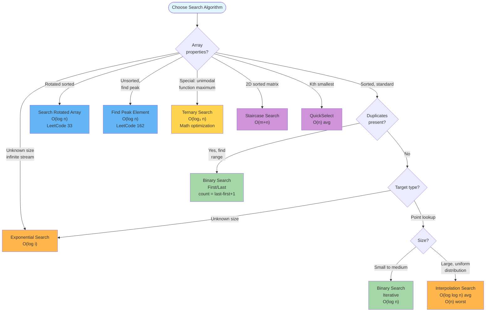
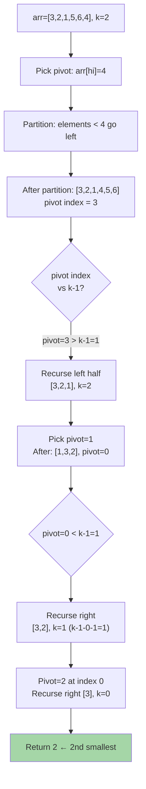
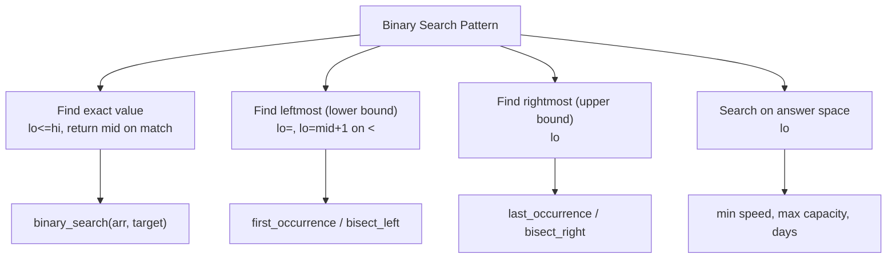

# Searching Algorithms

Nine algorithms for locating elements in sorted arrays, rotated arrays, and unsorted sequences — ranging from the foundational binary search and its variants to specialized techniques like exponential search and interpolation search, all running in O(log n) or better.

---

## Master Algorithm Selection Flowchart



---

## Complete Algorithm Complexity Reference

| Algorithm                   | Best   | Average      | Worst    | Space      | Use Case                              |
|-----------------------------|:------:|:------------:|:--------:|:----------:|-----------------------------------------|
| Binary Search (iterative)   | O(1)   | O(log n)     | O(log n) | O(1)       | Default sorted array search           |
| Binary Search (recursive)   | O(1)   | O(log n)     | O(log n) | O(log n)   | Teaching, recursive formulations      |
| Binary Search First         | O(1)   | O(log n)     | O(log n) | O(1)       | First occurrence, lower bound         |
| Binary Search Last          | O(1)   | O(log n)     | O(log n) | O(1)       | Last occurrence, upper bound          |
| Search Rotated Array        | O(1)   | O(log n)     | O(log n) | O(1)       | Rotated sorted arrays                 |
| Find Peak Element           | O(1)   | O(log n)     | O(log n) | O(1)       | Any local maximum                     |
| Jump Search                 | O(1)   | O(√n)        | O(√n)    | O(1)       | Sorted arrays, backward jumps costly  |
| Fibonacci Search            | O(1)   | O(log n)     | O(log n) | O(1)       | Non-random access media               |
| Ternary Search              | O(1)   | O(log₃ n)    | O(log n) | O(1)       | Unimodal function maximum             |
| Exponential Search          | O(1)   | O(log n)     | O(log n) | O(1)       | Unknown size / infinite arrays        |
| Interpolation Search        | O(1)   | O(log log n) | O(n)     | O(1)       | Uniform distribution, huge arrays     |
| QuickSelect (kth smallest)  | O(n)   | O(n)         | O(n²)    | O(1)       | Kth order statistics                  |
| 2D Matrix Staircase         | O(1)   | O(m+n)       | O(m+n)   | O(1)       | Row+col sorted matrix                 |
| Median of Two Sorted Arrays | O(log(min(m,n))) | same | same  | O(1)       | Merge statistics without merging      |

---

## Binary Search (Iterative)

Maintain a `[lo, hi]` search window over a sorted array. Each iteration computes the midpoint and compares `arr[mid]` to the target, halving the window by moving `lo` or `hi`.

```
arr = [1, 3, 5, 7, 9, 11, 13, 15]   target = 7
idx:   0  1  2  3  4   5   6   7

lo=0, hi=7 → mid = 0 + (7-0)//2 = 3
  arr[3] = 7 == target → return 3

target = 11
lo=0, hi=7 → mid=3, arr[3]=7  < 11 → lo = 4
lo=4, hi=7 → mid=5, arr[5]=11 == 11 → return 5

target = 6 (not in array)
lo=0, hi=7 → mid=3, arr[3]=7  > 6  → hi = 2
lo=0, hi=2 → mid=1, arr[1]=3  < 6  → lo = 2
lo=2, hi=2 → mid=2, arr[2]=5  < 6  → lo = 3
lo=3 > hi=2 → return -1
```

### Algorithm Decision Flowchart

```mermaid
flowchart TD
    Start([Input: sorted arr, target]) --> Init["lo = 0, hi = n-1"]
    Init --> Loop{lo <= hi?}
    Loop -->|No| NotFound["return -1"]
    Loop -->|Yes| CalcMid["mid = lo + (hi-lo)//2"]
    CalcMid --> Cmp{arr[mid] vs target?}
    Cmp -->|==| Found["return mid"]
    Cmp -->|<| GoRight["lo = mid + 1"]
    Cmp -->|>| GoLeft["hi = mid - 1"]
    GoRight --> Loop
    GoLeft --> Loop
    
    style Found fill:#a5d6a7
    style NotFound fill:#ef5350
    style Loop fill:#ffb74d
```

**Key insight:** Use `mid = lo + (hi - lo) // 2` to avoid integer overflow. Loop invariant: target is in `arr[lo..hi]` if it exists.

### Python Implementation

```python
def binary_search(arr: list, target) -> int:
    """
    Iterative binary search. O(log n) time, O(1) space.

    Example:
        binary_search([1,3,5,7,9], 7) -> 3
        binary_search([1,3,5,7,9], 4) -> -1
    """
    lo, hi = 0, len(arr) - 1
    while lo <= hi:
        mid = lo + (hi - lo) // 2
        if arr[mid] == target:
            return mid
        elif arr[mid] < target:
            lo = mid + 1
        else:
            hi = mid - 1
    return -1


def binary_search_insert_position(arr: list, target) -> int:
    """
    Find insertion position (leftmost index where target could be inserted).
    Equivalent to Python's bisect_left.
    """
    lo, hi = 0, len(arr)
    while lo < hi:
        mid = lo + (hi - lo) // 2
        if arr[mid] < target:
            lo = mid + 1
        else:
            hi = mid
    return lo


print(binary_search([1, 3, 5, 7, 9, 11, 13, 15], 7))   # 3
print(binary_search([1, 3, 5, 7, 9, 11, 13, 15], 6))   # -1
print(binary_search_insert_position([1, 3, 5, 7, 9], 6)) # 3
```

### Java Implementation

```java
public class BinarySearch {
    public static int search(int[] arr, int target) {
        int lo = 0, hi = arr.length - 1;
        while (lo <= hi) {
            int mid = lo + (hi - lo) / 2;
            if (arr[mid] == target)      return mid;
            else if (arr[mid] < target)  lo = mid + 1;
            else                         hi = mid - 1;
        }
        return -1;
    }

    public static int insertPosition(int[] arr, int target) {
        int lo = 0, hi = arr.length;
        while (lo < hi) {
            int mid = lo + (hi - lo) / 2;
            if (arr[mid] < target) lo = mid + 1;
            else                   hi = mid;
        }
        return lo;
    }

    public static void main(String[] args) {
        int[] arr = {1, 3, 5, 7, 9, 11, 13, 15};
        System.out.println(search(arr, 7));          // 3
        System.out.println(search(arr, 6));          // -1
        System.out.println(insertPosition(arr, 6));  // 3
    }
}
```

---

## Binary Search (Recursive)

```python
def binary_search_recursive(arr: list, target, lo: int = 0, hi: int = None) -> int:
    """Recursive binary search. O(log n) time, O(log n) space."""
    if hi is None:
        hi = len(arr) - 1
    if lo > hi:
        return -1
    mid = lo + (hi - lo) // 2
    if arr[mid] == target:
        return mid
    elif arr[mid] < target:
        return binary_search_recursive(arr, target, mid + 1, hi)
    else:
        return binary_search_recursive(arr, target, lo, mid - 1)
```

```java
// Java recursive binary search
public static int searchRecursive(int[] arr, int target, int lo, int hi) {
    if (lo > hi) return -1;
    int mid = lo + (hi - lo) / 2;
    if (arr[mid] == target)     return mid;
    if (arr[mid] < target)      return searchRecursive(arr, target, mid + 1, hi);
    return searchRecursive(arr, target, lo, mid - 1);
}
```

---

## Binary Search — First and Last Occurrence

```
arr = [1, 2, 2, 2, 3, 3, 4, 5]   target = 2

FIRST occurrence:
lo=0, hi=7 → mid=3, arr[3]=2 == target → result=3, hi=2
lo=0, hi=2 → mid=1, arr[1]=2 == target → result=1, hi=0
lo=0, hi=0 → mid=0, arr[0]=1 < target  → lo=1
lo=1 > hi=0 → return result=1

LAST occurrence (target=3):
lo=0, hi=7 → mid=3, arr[3]=2 < 3 → lo=4
lo=4, hi=7 → mid=5, arr[5]=3 == 3 → result=5, lo=6
lo=6, hi=7 → mid=6, arr[6]=4 > 3 → hi=5
lo=6 > hi=5 → return result=5

Count of 3 = last - first + 1 = 5 - 4 + 1 = 2
```

### Python Implementation

```python
def first_occurrence(arr: list, target) -> int:
    """Find leftmost index of target. -1 if not found. O(log n)."""
    lo, hi = 0, len(arr) - 1
    result = -1
    while lo <= hi:
        mid = lo + (hi - lo) // 2
        if arr[mid] == target:
            result = mid
            hi = mid - 1  # keep searching left
        elif arr[mid] < target:
            lo = mid + 1
        else:
            hi = mid - 1
    return result


def last_occurrence(arr: list, target) -> int:
    """Find rightmost index of target. -1 if not found. O(log n)."""
    lo, hi = 0, len(arr) - 1
    result = -1
    while lo <= hi:
        mid = lo + (hi - lo) // 2
        if arr[mid] == target:
            result = mid
            lo = mid + 1  # keep searching right
        elif arr[mid] < target:
            lo = mid + 1
        else:
            hi = mid - 1
    return result


def count_occurrences(arr: list, target) -> int:
    f = first_occurrence(arr, target)
    if f == -1:
        return 0
    return last_occurrence(arr, target) - f + 1


arr = [1, 2, 2, 2, 3, 3, 4, 5]
print(first_occurrence(arr, 2))     # 1
print(last_occurrence(arr, 2))      # 3
print(count_occurrences(arr, 2))    # 3
print(count_occurrences(arr, 6))    # 0
```

### Java Implementation

```java
public static int firstOccurrence(int[] arr, int target) {
    int lo = 0, hi = arr.length - 1, result = -1;
    while (lo <= hi) {
        int mid = lo + (hi - lo) / 2;
        if (arr[mid] == target) { result = mid; hi = mid - 1; }
        else if (arr[mid] < target) lo = mid + 1;
        else hi = mid - 1;
    }
    return result;
}

public static int lastOccurrence(int[] arr, int target) {
    int lo = 0, hi = arr.length - 1, result = -1;
    while (lo <= hi) {
        int mid = lo + (hi - lo) / 2;
        if (arr[mid] == target) { result = mid; lo = mid + 1; }
        else if (arr[mid] < target) lo = mid + 1;
        else hi = mid - 1;
    }
    return result;
}

public static int countOccurrences(int[] arr, int target) {
    int f = firstOccurrence(arr, target);
    return f == -1 ? 0 : lastOccurrence(arr, target) - f + 1;
}
```

---

## Search in Rotated Sorted Array

```
arr = [4, 5, 6, 7, 0, 1, 2]   target = 0
idx:   0  1  2  3  4  5  6

lo=0, hi=6 → mid=3, arr[3]=7
  arr[lo]=4 <= arr[mid]=7 → left half [4..7] is sorted
  0 NOT in [4, 7] → search right: lo=4

lo=4, hi=6 → mid=5, arr[5]=1
  arr[lo]=0 <= arr[mid]=1 → left half [0..1] sorted
  0 IN [0, 1) → search left: hi=4

lo=4, hi=4 → mid=4, arr[4]=0 == target → return 4
```

### Python Implementation

```python
def search_rotated(arr: list[int], target: int) -> int:
    """
    Search rotated sorted array (no duplicates). O(log n).
    LeetCode 33.
    """
    lo, hi = 0, len(arr) - 1
    while lo <= hi:
        mid = lo + (hi - lo) // 2
        if arr[mid] == target:
            return mid
        # Left half is sorted
        if arr[lo] <= arr[mid]:
            if arr[lo] <= target < arr[mid]:
                hi = mid - 1
            else:
                lo = mid + 1
        # Right half is sorted
        else:
            if arr[mid] < target <= arr[hi]:
                lo = mid + 1
            else:
                hi = mid - 1
    return -1


def search_rotated_with_duplicates(arr: list[int], target: int) -> bool:
    """
    Search rotated sorted array WITH duplicates. O(log n) avg, O(n) worst.
    LeetCode 81.
    """
    lo, hi = 0, len(arr) - 1
    while lo <= hi:
        mid = lo + (hi - lo) // 2
        if arr[mid] == target:
            return True
        # Cannot determine which half is sorted due to duplicates
        if arr[lo] == arr[mid] == arr[hi]:
            lo += 1
            hi -= 1
        elif arr[lo] <= arr[mid]:
            if arr[lo] <= target < arr[mid]:
                hi = mid - 1
            else:
                lo = mid + 1
        else:
            if arr[mid] < target <= arr[hi]:
                lo = mid + 1
            else:
                hi = mid - 1
    return False


print(search_rotated([4, 5, 6, 7, 0, 1, 2], 0))      # 4
print(search_rotated([4, 5, 6, 7, 0, 1, 2], 3))      # -1
print(search_rotated_with_duplicates([2,5,6,0,0,1,2], 0))  # True
print(search_rotated_with_duplicates([2,5,6,0,0,1,2], 3))  # False
```

### Java Implementation

```java
public static int searchRotated(int[] arr, int target) {
    int lo = 0, hi = arr.length - 1;
    while (lo <= hi) {
        int mid = lo + (hi - lo) / 2;
        if (arr[mid] == target) return mid;
        if (arr[lo] <= arr[mid]) {
            if (arr[lo] <= target && target < arr[mid]) hi = mid - 1;
            else lo = mid + 1;
        } else {
            if (arr[mid] < target && target <= arr[hi]) lo = mid + 1;
            else hi = mid - 1;
        }
    }
    return -1;
}

public static boolean searchRotatedDuplicates(int[] arr, int target) {
    int lo = 0, hi = arr.length - 1;
    while (lo <= hi) {
        int mid = lo + (hi - lo) / 2;
        if (arr[mid] == target) return true;
        if (arr[lo] == arr[mid] && arr[mid] == arr[hi]) { lo++; hi--; }
        else if (arr[lo] <= arr[mid]) {
            if (arr[lo] <= target && target < arr[mid]) hi = mid - 1;
            else lo = mid + 1;
        } else {
            if (arr[mid] < target && target <= arr[hi]) lo = mid + 1;
            else hi = mid - 1;
        }
    }
    return false;
}
```

---

## Find Peak Element

```
arr = [1, 2, 1, 3, 5]

lo=0, hi=4 → mid=2
  arr[2]=1 < arr[3]=3 → ascending → peak right → lo=3

lo=3, hi=4 → mid=3
  arr[3]=3 < arr[4]=5 → ascending → peak right → lo=4

lo=4, hi=4 → lo==hi → return 4  (arr[4]=5 is peak)
```

### Python Implementation

```python
def find_peak(arr: list[int]) -> int:
    """
    Find any peak element index. O(log n). LeetCode 162.
    Peak: arr[i] > arr[i-1] and arr[i] > arr[i+1] (boundaries = -inf).
    """
    lo, hi = 0, len(arr) - 1
    while lo < hi:
        mid = lo + (hi - lo) // 2
        if arr[mid] < arr[mid + 1]:
            lo = mid + 1  # ascending: peak to the right
        else:
            hi = mid      # descending: peak at mid or left
    return lo


def find_all_peaks(arr: list[int]) -> list[int]:
    """Find all peak indices. O(n)."""
    n = len(arr)
    peaks = []
    for i in range(n):
        left_ok = (i == 0 or arr[i] > arr[i - 1])
        right_ok = (i == n - 1 or arr[i] > arr[i + 1])
        if left_ok and right_ok:
            peaks.append(i)
    return peaks


print(find_peak([1, 2, 3, 1]))     # 2
print(find_peak([1, 2, 1, 3, 5])) # 4
print(find_all_peaks([3, 1, 4, 1, 5, 9, 2, 6]))  # [0, 2, 5, 7]
```

### Java Implementation

```java
public static int findPeak(int[] arr) {
    int lo = 0, hi = arr.length - 1;
    while (lo < hi) {
        int mid = lo + (hi - lo) / 2;
        if (arr[mid] < arr[mid + 1]) lo = mid + 1;
        else hi = mid;
    }
    return lo;
}
```

---

## Jump Search

**Core idea:** Jump in fixed steps of `√n`, then do linear search backward when the block containing the target is found. Better than linear search when backward jumps are costly (magnetic tapes, linked lists at sorted positions).

```
arr = [0, 1, 1, 2, 3, 5, 8, 13, 21, 34, 55, 89, 144]
target = 55, n=13, step=√13≈3

Jump:
  arr[0]=0  < 55 → jump to index 3
  arr[3]=2  < 55 → jump to index 6
  arr[6]=8  < 55 → jump to index 9
  arr[9]=34 < 55 → jump to index 12
  arr[12]=144 >= 55 → stop, search backward from index 9

Linear backward search from index 9 to 12:
  arr[9]=34  != 55
  arr[10]=55 == 55 → return 10

Total comparisons: 4 jumps + 2 linear = 6 (vs log₂(13)≈3.7 for binary search)
```

### Python Implementation

```python
import math

def jump_search(arr: list, target) -> int:
    """
    Jump search on sorted array. O(√n) time, O(1) space.
    Optimal step size = √n.

    Better than binary search when:
    - The array is on disk (sequential reads cheaper than random)
    - Backward jumps are expensive
    """
    n = len(arr)
    step = int(math.sqrt(n))
    prev = 0

    # Find the block containing target
    while prev < n and arr[min(step, n) - 1] < target:
        prev = step
        step += int(math.sqrt(n))
        if prev >= n:
            return -1

    # Linear search backward in the block
    while prev < min(step, n):
        if arr[prev] == target:
            return prev
        if arr[prev] > target:
            return -1
        prev += 1
    return -1


arr = [0, 1, 1, 2, 3, 5, 8, 13, 21, 34, 55, 89, 144]
print(jump_search(arr, 55))  # 10
print(jump_search(arr, 20))  # -1
print(jump_search(arr, 0))   # 0
```

### Java Implementation

```java
public static int jumpSearch(int[] arr, int target) {
    int n = arr.length;
    int step = (int) Math.sqrt(n);
    int prev = 0;

    while (prev < n && arr[Math.min(step, n) - 1] < target) {
        prev = step;
        step += (int) Math.sqrt(n);
        if (prev >= n) return -1;
    }
    while (prev < Math.min(step, n)) {
        if (arr[prev] == target) return prev;
        if (arr[prev] > target)  return -1;
        prev++;
    }
    return -1;
}

public static void main(String[] args) {
    int[] arr = {0, 1, 1, 2, 3, 5, 8, 13, 21, 34, 55, 89, 144};
    System.out.println(jumpSearch(arr, 55));  // 10
    System.out.println(jumpSearch(arr, 20));  // -1
}
```

**When to prefer Jump over Binary Search:**
- Sequential disk reads (magnetic tape, block storage) are much faster than random reads
- Array is stored on read-once media
- Step size can be tuned (smaller step → more jumps but less backtrack; larger → fewer jumps, more backtrack)

---

## Fibonacci Search

**Core idea:** Use Fibonacci numbers as natural division points. Avoids division operation (uses only addition/subtraction). Good when division is expensive or array is not random-access.

```
arr = [10, 22, 35, 40, 45, 50, 80, 82, 85, 90, 100]
target = 85, n=11

Fibonacci numbers ≥ n=11: 1, 1, 2, 3, 5, 8, 13
Use: fib=13, fib1=8, fib2=5

offset = -1

Step 1: idx = min(offset + fib2, n-1) = min(-1+5, 10) = 4
  arr[4]=45 < 85 → target in right portion
  offset=4, fib=8, fib1=5, fib2=3

Step 2: idx = min(4+3, 10) = 7
  arr[7]=82 < 85 → target in right
  offset=7, fib=5, fib1=3, fib2=2

Step 3: idx = min(7+2, 10) = 9
  arr[9]=90 > 85 → target in left
  fib=3, fib1=2, fib2=1

Step 4: idx = min(7+1, 10) = 8
  arr[8]=85 == 85 → return 8
```

### Python Implementation

```python
def fibonacci_search(arr: list, target) -> int:
    """
    Fibonacci search. O(log n) time, O(1) space.
    Advantage: uses only addition/subtraction, no division.

    Example:
        fibonacci_search([10,22,35,40,45,50,80,82,85,90,100], 85) -> 8
    """
    n = len(arr)
    fib2 = 0   # (m-2)th Fibonacci number
    fib1 = 1   # (m-1)th Fibonacci number
    fib = 1    # mth Fibonacci number

    # Find smallest Fibonacci number >= n
    while fib < n:
        fib2 = fib1
        fib1 = fib
        fib = fib1 + fib2

    offset = -1

    while fib > 1:
        idx = min(offset + fib2, n - 1)
        if arr[idx] < target:
            fib = fib1
            fib1 = fib2
            fib2 = fib - fib1
            offset = idx
        elif arr[idx] > target:
            fib = fib2
            fib1 = fib1 - fib2
            fib2 = fib - fib1
        else:
            return idx

    if fib1 and offset + 1 < n and arr[offset + 1] == target:
        return offset + 1
    return -1


arr = [10, 22, 35, 40, 45, 50, 80, 82, 85, 90, 100]
print(fibonacci_search(arr, 85))  # 8
print(fibonacci_search(arr, 50))  # 5
print(fibonacci_search(arr, 60))  # -1
```

### Java Implementation

```java
public static int fibonacciSearch(int[] arr, int target) {
    int n = arr.length;
    int fib2 = 0, fib1 = 1, fib = 1;
    while (fib < n) { fib2 = fib1; fib1 = fib; fib = fib1 + fib2; }
    int offset = -1;
    while (fib > 1) {
        int idx = Math.min(offset + fib2, n - 1);
        if      (arr[idx] < target) { fib = fib1; fib1 = fib2; fib2 = fib - fib1; offset = idx; }
        else if (arr[idx] > target) { fib = fib2; fib1 -= fib2; fib2 = fib - fib1; }
        else return idx;
    }
    if (fib1 == 1 && offset + 1 < n && arr[offset + 1] == target) return offset + 1;
    return -1;
}
```

---

## Exponential Search

```
arr = [1, 2, 3, 4, 5, 6, 7, 8, 9, 10, ... , 1000]
target = 7

Phase 1 — Find range by doubling:
  bound=1: arr[1]=2 <= 7 → double
  bound=2: arr[2]=3 <= 7 → double
  bound=4: arr[4]=5 <= 7 → double
  bound=8: arr[8]=9 > 7 → stop

Range found: [bound//2, bound] = [4, 8]

Phase 2 — Binary search in arr[4..8]:
  lo=4, hi=8 → mid=6, arr[6]=7 == target → return 6

Complexity: O(log 7) = O(3) << O(log 1000) = O(10)
```

### Python Implementation

```python
def exponential_search(arr: list, target) -> int:
    """
    Exponential search for sorted arrays of unknown/large size.
    Time: O(log i) where i is target's index. Space: O(1).

    Advantages:
    - Works on unbounded/infinite sorted arrays
    - O(log i) when target is near start (i << n)
    - Adapts to target position automatically
    """
    n = len(arr)
    if n == 0:
        return -1
    if arr[0] == target:
        return 0

    # Phase 1: find range by doubling
    bound = 1
    while bound < n and arr[bound] < target:
        bound *= 2

    # Phase 2: binary search in [bound//2, min(bound, n-1)]
    lo, hi = bound // 2, min(bound, n - 1)
    while lo <= hi:
        mid = lo + (hi - lo) // 2
        if arr[mid] == target:
            return mid
        elif arr[mid] < target:
            lo = mid + 1
        else:
            hi = mid - 1
    return -1


def exponential_search_trace(arr: list, target) -> int:
    """Same as above with printed trace for learning."""
    n = len(arr)
    if arr[0] == target:
        print(f"Found at index 0 immediately")
        return 0
    bound = 1
    print(f"Phase 1 - doubling bounds:")
    while bound < n and arr[bound] < target:
        print(f"  bound={bound}: arr[{bound}]={arr[bound]} < {target} → double")
        bound *= 2
    print(f"  bound={bound}: stop, search [{bound//2}, {min(bound,n-1)}]")
    lo, hi = bound // 2, min(bound, n - 1)
    while lo <= hi:
        mid = lo + (hi - lo) // 2
        print(f"Phase 2 - binary: lo={lo}, hi={hi}, mid={mid}, arr[{mid}]={arr[mid]}")
        if arr[mid] == target:
            return mid
        elif arr[mid] < target:
            lo = mid + 1
        else:
            hi = mid - 1
    return -1


arr = list(range(1, 1001))
print(exponential_search(arr, 7))    # 6
print(exponential_search(arr, 500))  # 499
print(exponential_search(arr, 1000)) # 999
```

### Java Implementation

```java
public static int exponentialSearch(int[] arr, int target) {
    int n = arr.length;
    if (n == 0) return -1;
    if (arr[0] == target) return 0;

    int bound = 1;
    while (bound < n && arr[bound] < target) bound *= 2;

    int lo = bound / 2, hi = Math.min(bound, n - 1);
    while (lo <= hi) {
        int mid = lo + (hi - lo) / 2;
        if      (arr[mid] == target) return mid;
        else if (arr[mid] < target)  lo = mid + 1;
        else                         hi = mid - 1;
    }
    return -1;
}

public static void main(String[] args) {
    int[] arr = new int[1000];
    for (int i = 0; i < 1000; i++) arr[i] = i + 1;
    System.out.println(exponentialSearch(arr, 7));    // 6
    System.out.println(exponentialSearch(arr, 500));  // 499
}
```

---

## Ternary Search

```
target function f(x) is unimodal: f increases then decreases

lo=0, hi=100 (searching for maximum of f on [0,100])
  third = (hi-lo)/3 = 33
  m1=33, m2=66: if f(m1) < f(m2) → maximum in [m1, hi] → lo=m1

  ... repeat until lo~hi
```

### Python Implementation

```python
def ternary_search_array(arr: list, target) -> int:
    """
    Ternary search on sorted array. O(log₃ n). 
    Note: binary search is FASTER for sorted arrays (fewer comparisons total).
    """
    lo, hi = 0, len(arr) - 1
    while hi - lo >= 3:
        third = (hi - lo) // 3
        mid1 = lo + third
        mid2 = hi - third
        if arr[mid1] == target:
            return mid1
        if arr[mid2] == target:
            return mid2
        if target < arr[mid1]:
            hi = mid1 - 1
        elif target > arr[mid2]:
            lo = mid2 + 1
        else:
            lo = mid1 + 1
            hi = mid2 - 1
    for i in range(lo, hi + 1):
        if arr[i] == target:
            return i
    return -1


def ternary_search_max(f, lo: float, hi: float, eps: float = 1e-9) -> float:
    """
    Find maximum of unimodal function f on [lo, hi].
    Real use case: optimization, not sorted array lookup.
    """
    while hi - lo > eps:
        m1 = lo + (hi - lo) / 3
        m2 = hi - (hi - lo) / 3
        if f(m1) < f(m2):
            lo = m1
        else:
            hi = m2
    return (lo + hi) / 2


# Find maximum of -(x-5)^2 + 25 on [0, 10]  → expected x=5
import math
f = lambda x: -(x - 5) ** 2 + 25
max_x = ternary_search_max(f, 0, 10)
print(f"Maximum at x={max_x:.6f}, f(x)={f(max_x):.6f}")  # x=5.000000, f=25.000000
```

---

## Order Statistics — QuickSelect (Kth Smallest)

**Core idea:** Partition the array around a pivot (like QuickSort). If pivot lands at index k, it IS the kth smallest. Otherwise recurse into only ONE half. Expected O(n) time.

### QuickSelect Partition Diagram



### Python Implementation

```python
import random

def quickselect(arr: list, k: int) -> int:
    """
    Find kth smallest element (1-indexed). Modifies arr in-place.
    Time: O(n) average, O(n²) worst (use random pivot to avoid).
    Space: O(1) iterative.

    Example:
        quickselect([3,2,1,5,6,4], 2) -> 2 (2nd smallest)
    """
    def partition(lo: int, hi: int) -> int:
        pivot_idx = random.randint(lo, hi)
        arr[pivot_idx], arr[hi] = arr[hi], arr[pivot_idx]
        pivot = arr[hi]
        store = lo
        for i in range(lo, hi):
            if arr[i] < pivot:
                arr[store], arr[i] = arr[i], arr[store]
                store += 1
        arr[store], arr[hi] = arr[hi], arr[store]
        return store

    lo, hi = 0, len(arr) - 1
    k -= 1  # convert to 0-indexed
    while lo <= hi:
        p = partition(lo, hi)
        if p == k:
            return arr[p]
        elif p < k:
            lo = p + 1
        else:
            hi = p - 1
    return -1  # should not reach here


def kth_largest(arr: list, k: int) -> int:
    """Find kth largest. Converts to kth smallest problem."""
    return quickselect(arr[:], len(arr) - k + 1)


# Examples
print(quickselect([3, 2, 1, 5, 6, 4], 2))   # 2
print(quickselect([3, 2, 3, 1, 2, 4, 5, 5, 6], 4))  # 3
print(kth_largest([3, 2, 1, 5, 6, 4], 2))   # 5
```

### Java Implementation

```java
import java.util.Random;

public class QuickSelect {
    private static final Random rand = new Random();

    private static int partition(int[] arr, int lo, int hi) {
        int pivotIdx = lo + rand.nextInt(hi - lo + 1);
        int tmp = arr[pivotIdx]; arr[pivotIdx] = arr[hi]; arr[hi] = tmp;
        int pivot = arr[hi], store = lo;
        for (int i = lo; i < hi; i++) {
            if (arr[i] < pivot) {
                tmp = arr[store]; arr[store] = arr[i]; arr[i] = tmp;
                store++;
            }
        }
        tmp = arr[store]; arr[store] = arr[hi]; arr[hi] = tmp;
        return store;
    }

    public static int kthSmallest(int[] arr, int k) {
        int lo = 0, hi = arr.length - 1;
        k--; // 0-indexed
        while (lo <= hi) {
            int p = partition(arr, lo, hi);
            if      (p == k) return arr[p];
            else if (p < k)  lo = p + 1;
            else             hi = p - 1;
        }
        return -1;
    }

    public static void main(String[] args) {
        System.out.println(kthSmallest(new int[]{3,2,1,5,6,4}, 2)); // 2
        System.out.println(kthSmallest(new int[]{3,2,1,5,6,4}, 5)); // 5
    }
}
```

---

## Search in 2D Sorted Matrix

### Problem Variants

```mermaid
flowchart TD
    A["2D Matrix Search"] --> B{Row+Col<br/>both sorted?}
    B -->|Rows sorted, cols sorted<br/>Matrix I type| C["Staircase: O(m+n)\nStart top-right"]
    B -->|Rows sorted (left-right)\nfirst element of row i+1\n> last element of row i| D["Binary Search: O(log mn)\nFlatten mentally"]
    A --> E{Only rows sorted?}
    E -->|Yes| F["Binary search each row\nO(m log n)"]
```

### Staircase Search Trace (Row + Col Sorted)

```
matrix = [
  [1,  4,  7,  11, 15],
  [2,  5,  8,  12, 19],
  [3,  6,  9,  16, 22],
  [10, 13, 14, 17, 24],
  [18, 21, 23, 26, 30]
]
target = 5

Start at top-right: row=0, col=4, val=15
  15 > 5 → move left: col=3, val=11
  11 > 5 → move left: col=2, val=7
  7  > 5 → move left: col=1, val=4
  4  < 5 → move down: row=1, col=1, val=5
  5 == 5 → FOUND at (1,1)

Total steps: 5 (vs m*n=25 for brute force, log(mn)≈4.6 for flat binary)
```

### Python Implementation

```python
def search_matrix_staircase(matrix: list[list[int]], target: int) -> bool:
    """
    Search m×n matrix where each row and column is sorted.
    Start from top-right: eliminate row or column each step.
    Time: O(m+n), Space: O(1). LeetCode 240.
    """
    if not matrix or not matrix[0]:
        return False
    m, n = len(matrix), len(matrix[0])
    row, col = 0, n - 1  # start top-right
    while row < m and col >= 0:
        if matrix[row][col] == target:
            return True
        elif matrix[row][col] > target:
            col -= 1  # eliminate current column
        else:
            row += 1  # eliminate current row
    return False


def search_matrix_binary(matrix: list[list[int]], target: int) -> bool:
    """
    Search m×n matrix where rows are sorted and row i+1 starts after row i ends.
    Binary search treating matrix as flat sorted array.
    Time: O(log(mn)), Space: O(1). LeetCode 74.
    """
    if not matrix or not matrix[0]:
        return False
    m, n = len(matrix), len(matrix[0])
    lo, hi = 0, m * n - 1
    while lo <= hi:
        mid = lo + (hi - lo) // 2
        val = matrix[mid // n][mid % n]
        if val == target:
            return True
        elif val < target:
            lo = mid + 1
        else:
            hi = mid - 1
    return False


matrix1 = [
    [1,  4,  7,  11, 15],
    [2,  5,  8,  12, 19],
    [3,  6,  9,  16, 22],
    [10, 13, 14, 17, 24],
    [18, 21, 23, 26, 30]
]
print(search_matrix_staircase(matrix1, 5))   # True
print(search_matrix_staircase(matrix1, 20))  # False

matrix2 = [[1,3,5,7],[10,11,16,20],[23,30,34,60]]
print(search_matrix_binary(matrix2, 3))   # True
print(search_matrix_binary(matrix2, 13))  # False
```

### Java Implementation

```java
public static boolean searchMatrixStaircase(int[][] matrix, int target) {
    if (matrix == null || matrix.length == 0) return false;
    int row = 0, col = matrix[0].length - 1;
    while (row < matrix.length && col >= 0) {
        if      (matrix[row][col] == target) return true;
        else if (matrix[row][col] > target)  col--;
        else                                  row++;
    }
    return false;
}

public static boolean searchMatrixBinary(int[][] matrix, int target) {
    if (matrix == null || matrix.length == 0) return false;
    int m = matrix.length, n = matrix[0].length;
    int lo = 0, hi = m * n - 1;
    while (lo <= hi) {
        int mid = lo + (hi - lo) / 2;
        int val = matrix[mid / n][mid % n];
        if      (val == target) return true;
        else if (val < target)  lo = mid + 1;
        else                    hi = mid - 1;
    }
    return false;
}
```

---

## Median of Two Sorted Arrays

**Core idea:** Binary search on the shorter array. Find a partition of both arrays such that the left half of both combined equals the right half. O(log(min(m,n))).

### Partition Concept

```mermaid
flowchart TD
    A["Arrays: A=[1,3,5] B=[2,4,6]"] --> B["Partition A at i, B at j\nwhere i+j = (m+n+1)/2"]
    B --> C["Check: A[i-1] <= B[j] AND B[j-1] <= A[i]"]
    C -->|Yes| D["Left max = max(A[i-1], B[j-1])\nRight min = min(A[i], B[j])"]
    D --> E{Even total length?}
    E -->|Yes| F["Median = (left_max + right_min) / 2"]
    E -->|No| G["Median = left_max"]
    C -->|A[i-1] > B[j]| H["Move i left: hi = i-1"]
    C -->|B[j-1] > A[i]| I["Move i right: lo = i+1"]
```

```
A = [1, 3, 5], m=3
B = [2, 4, 6], n=3
total = 6, half = (3+3+1)//2 = 3

Binary search on A for partition i in [0..m]:
  lo=0, hi=3 → i=1 (mid), j=3-1=2
  A partition: [1] | [3, 5]
  B partition: [2, 4] | [6]
  Check: A[0]=1 <= B[2]=6? Yes
         B[1]=4 <= A[1]=3? No → i too small → lo=2

  i=2, j=1
  A partition: [1,3] | [5]
  B partition: [2] | [4, 6]
  Check: A[1]=3 <= B[1]=4? Yes
         B[0]=2 <= A[2]=5? Yes → VALID!

  left_max = max(3, 2) = 3
  right_min = min(5, 4) = 4
  Median = (3 + 4) / 2.0 = 3.5
```

### Python Implementation

```python
def find_median_sorted_arrays(nums1: list[int], nums2: list[int]) -> float:
    """
    Median of two sorted arrays. O(log(min(m,n))). LeetCode 4.
    Binary search on the shorter array.
    """
    A, B = nums1, nums2
    if len(A) > len(B):
        A, B = B, A  # ensure A is the shorter array
    m, n = len(A), len(B)
    half = (m + n + 1) // 2
    lo, hi = 0, m

    while lo <= hi:
        i = lo + (hi - lo) // 2  # partition A at i
        j = half - i             # partition B at j

        # Boundary values
        a_left  = A[i - 1] if i > 0 else float('-inf')
        a_right = A[i]     if i < m else float('inf')
        b_left  = B[j - 1] if j > 0 else float('-inf')
        b_right = B[j]     if j < n else float('inf')

        if a_left <= b_right and b_left <= a_right:
            # Valid partition found
            if (m + n) % 2 == 1:
                return float(max(a_left, b_left))
            else:
                return (max(a_left, b_left) + min(a_right, b_right)) / 2.0
        elif a_left > b_right:
            hi = i - 1  # i too large
        else:
            lo = i + 1  # i too small

    return 0.0


print(find_median_sorted_arrays([1, 3], [2]))          # 2.0
print(find_median_sorted_arrays([1, 2], [3, 4]))       # 2.5
print(find_median_sorted_arrays([1, 3, 5], [2, 4, 6])) # 3.5
print(find_median_sorted_arrays([], [1]))               # 1.0
```

### Java Implementation

```java
public static double findMedianSortedArrays(int[] nums1, int[] nums2) {
    int[] A = nums1, B = nums2;
    if (A.length > B.length) { int[] tmp = A; A = B; B = tmp; }
    int m = A.length, n = B.length;
    int half = (m + n + 1) / 2;
    int lo = 0, hi = m;

    while (lo <= hi) {
        int i = lo + (hi - lo) / 2;
        int j = half - i;
        int aLeft  = (i > 0) ? A[i-1] : Integer.MIN_VALUE;
        int aRight = (i < m) ? A[i]   : Integer.MAX_VALUE;
        int bLeft  = (j > 0) ? B[j-1] : Integer.MIN_VALUE;
        int bRight = (j < n) ? B[j]   : Integer.MAX_VALUE;

        if (aLeft <= bRight && bLeft <= aRight) {
            if ((m + n) % 2 == 1) return Math.max(aLeft, bLeft);
            return (Math.max(aLeft, bLeft) + Math.min(aRight, bRight)) / 2.0;
        } else if (aLeft > bRight) hi = i - 1;
        else lo = i + 1;
    }
    return 0.0;
}

public static void main(String[] args) {
    System.out.println(findMedianSortedArrays(new int[]{1,3}, new int[]{2}));       // 2.0
    System.out.println(findMedianSortedArrays(new int[]{1,2}, new int[]{3,4}));     // 2.5
}
```

---

## Binary Search on Answer Space

**Core idea:** Many optimization problems that ask "minimize X" or "find minimum value satisfying condition" can be solved by binary searching on the answer rather than the input.

### Template

```python
def binary_search_on_answer(lo: int, hi: int, feasible) -> int:
    """
    Binary search on the answer space.
    feasible(mid) returns True if mid satisfies the constraint.
    Find minimum mid where feasible(mid) is True.
    """
    result = hi
    while lo <= hi:
        mid = lo + (hi - lo) // 2
        if feasible(mid):
            result = mid
            hi = mid - 1  # try smaller
        else:
            lo = mid + 1  # mid too small
    return result
```

### Example: Koko Eating Bananas (LC 875)

```python
def min_eating_speed(piles: list[int], h: int) -> int:
    """
    Minimum speed k such that Koko can eat all bananas in h hours.
    Binary search on speed k in [1, max(piles)].
    Time: O(n log max_pile).
    """
    import math

    def can_eat(speed: int) -> bool:
        return sum(math.ceil(p / speed) for p in piles) <= h

    lo, hi = 1, max(piles)
    while lo < hi:
        mid = lo + (hi - lo) // 2
        if can_eat(mid):
            hi = mid
        else:
            lo = mid + 1
    return lo


print(min_eating_speed([3, 6, 7, 11], 8))      # 4
print(min_eating_speed([30, 11, 23, 4, 20], 5)) # 30
```

### Example: Minimum Days to Make m Bouquets (LC 1482)

```python
def min_days(bloom_day: list[int], m: int, k: int) -> int:
    """
    Minimum days to make m bouquets of k adjacent flowers.
    Binary search on day d in [min(bloom_day), max(bloom_day)].
    """
    if m * k > len(bloom_day):
        return -1

    def can_make(d: int) -> bool:
        bouquets = consecutive = 0
        for day in bloom_day:
            if day <= d:
                consecutive += 1
                if consecutive == k:
                    bouquets += 1
                    consecutive = 0
            else:
                consecutive = 0
        return bouquets >= m

    lo, hi = min(bloom_day), max(bloom_day)
    while lo < hi:
        mid = lo + (hi - lo) // 2
        if can_make(mid):
            hi = mid
        else:
            lo = mid + 1
    return lo if can_make(lo) else -1


print(min_days([1,10,3,10,2], 3, 1))  # 3
print(min_days([1,10,3,10,2], 3, 2))  # -1
```

---

## Interpolation Search

```
arr = [10, 20, 30, 40, 50, 60, 70, 80, 90, 100]   target = 70

pos = 0 + (70-10) * (9-0) // (100-10) = 0 + 60*9//90 = 6
arr[6] = 70 == target → return 6 in ONE step!

Worst case (exponential distribution): O(n)
Average case (uniform distribution):   O(log log n)
```

### Python Implementation

```python
def interpolation_search(arr: list, target) -> int:
    """
    Interpolation search. O(log log n) avg (uniform), O(n) worst.
    Only use when data is uniformly distributed!

    Example:
        interpolation_search([10,20,30,40,50,60,70,80,90,100], 70) -> 6
    """
    lo, hi = 0, len(arr) - 1
    while lo <= hi and arr[lo] != arr[hi] and arr[lo] <= target <= arr[hi]:
        # Linear interpolation formula
        pos = lo + (target - arr[lo]) * (hi - lo) // (arr[hi] - arr[lo])
        if pos < lo or pos > hi:
            break
        if arr[pos] == target:
            return pos
        elif arr[pos] < target:
            lo = pos + 1
        else:
            hi = pos - 1
    if lo <= hi and arr[lo] == target:
        return lo
    return -1


arr = [10, 20, 30, 40, 50, 60, 70, 80, 90, 100]
print(interpolation_search(arr, 70))   # 6
print(interpolation_search(arr, 100))  # 9
print(interpolation_search(arr, 55))   # -1
```

### Java Implementation

```java
public static int interpolationSearch(int[] arr, int target) {
    int lo = 0, hi = arr.length - 1;
    while (lo <= hi && arr[lo] != arr[hi] && target >= arr[lo] && target <= arr[hi]) {
        int pos = lo + (target - arr[lo]) * (hi - lo) / (arr[hi] - arr[lo]);
        if (pos < lo || pos > hi) break;
        if      (arr[pos] == target) return pos;
        else if (arr[pos] < target)  lo = pos + 1;
        else                         hi = pos - 1;
    }
    return (lo <= hi && arr[lo] == target) ? lo : -1;
}
```

---

## Choosing the Right Algorithm

| Situation                                         | Pick                      | Time     |
|---------------------------------------------------|---------------------------|----------|
| General sorted array lookup                       | Binary Search (iterative) | O(log n) |
| Sorted array, find first/last of duplicate values | Binary Search First/Last  | O(log n) |
| Sorted array, rotated at unknown pivot            | Search Rotated Array      | O(log n) |
| Find any local maximum in array                   | Find Peak Element         | O(log n) |
| Sorted array of unknown size / infinite stream    | Exponential Search        | O(log i) |
| Uniform distribution, very large sorted table    | Interpolation Search      | O(log log n) |
| Find maximum of unimodal function                 | Ternary Search            | O(log n) |
| Backward jumps expensive (disk/tape)              | Jump Search               | O(√n)    |
| No division, non-random access media              | Fibonacci Search          | O(log n) |
| Kth smallest/largest element                      | QuickSelect               | O(n) avg |
| Row+col sorted 2D matrix                          | Staircase Search          | O(m+n)   |
| Fully sorted 2D matrix (row then row)             | Flat Binary Search        | O(log mn)|
| Median of two sorted arrays                       | Binary search partition   | O(log min(m,n)) |
| "Minimize maximum" / "find minimum satisfying k" | Binary search on answer   | O(n log range) |

---

## Common Interview Questions

### Q1: Loop invariant for binary search — why `lo <= hi` not `lo < hi`?

**A:** The invariant is: if target exists in the array, it is in `arr[lo..hi]`. Using `lo <= hi` ensures single-element ranges are still checked; `lo < hi` would skip them and miss targets at the last remaining element.

```python
# WRONG — misses single-element ranges:
while lo < hi:
    mid = (lo + hi) // 2
    if arr[mid] < target: lo = mid + 1
    else: hi = mid  # never converges if target == arr[mid] and lo==hi

# CORRECT:
while lo <= hi:
    mid = lo + (hi - lo) // 2
    if arr[mid] == target: return mid
    elif arr[mid] < target: lo = mid + 1
    else: hi = mid - 1
```

### Q2: How do you find the kth smallest in two sorted arrays without merging?

```python
def kth_smallest_two_arrays(A: list, B: list, k: int) -> int:
    """
    Find kth smallest element of two sorted arrays.
    O(log(m+n)) time. Alternative to median problem.
    """
    def find_kth(a, ai, b, bi, k):
        if ai >= len(a):
            return b[bi + k - 1]
        if bi >= len(b):
            return a[ai + k - 1]
        if k == 1:
            return min(a[ai], b[bi])

        half = k // 2
        a_val = a[ai + half - 1] if ai + half - 1 < len(a) else float('inf')
        b_val = b[bi + half - 1] if bi + half - 1 < len(b) else float('inf')
        if a_val <= b_val:
            return find_kth(a, ai + half, b, bi, k - half)
        else:
            return find_kth(a, ai, b, bi + half, k - half)

    return find_kth(A, 0, B, 0, k)

print(kth_smallest_two_arrays([1,3,5,7], [2,4,6,8], 5))  # 5
```

### Q3: Why is ternary search NOT faster than binary search on sorted arrays?

**A:** Ternary search makes 2 comparisons per step to eliminate 1/3 of range. Binary makes 1 comparison to eliminate 1/2. Total comparisons: binary = O(log₂ n), ternary = O(2 × log_{1.5} n) ≈ 2.4 × log₂ n. Binary wins.

Only use ternary search when the array is not sorted but the function is unimodal (has a single peak/valley) — like finding the maximum of a parabola.

### Q4: Search in a sorted array where size is unknown (LC 702)

```python
def search_unknown_size(reader, target: int) -> int:
    """
    reader.get(i) returns arr[i] or 2^31-1 if out of bounds.
    Exponential search: double bound until out of bounds, then binary search.
    """
    if reader.get(0) == target:
        return 0
    bound = 1
    while reader.get(bound) < target:
        bound *= 2

    lo, hi = bound // 2, bound
    while lo <= hi:
        mid = lo + (hi - lo) // 2
        val = reader.get(mid)
        if val == target:
            return mid
        elif val < target:
            lo = mid + 1
        else:
            hi = mid - 1
    return -1
```

### Q5: Implement binary search on answer — "Ship packages in D days" (LC 1011)

```python
def ship_within_days(weights: list[int], days: int) -> int:
    """
    Minimum ship capacity to ship all packages in 'days' days.
    Binary search on capacity in [max(weights), sum(weights)].
    Time: O(n log sum).
    """
    def can_ship(capacity: int) -> bool:
        current = 0
        days_needed = 1
        for w in weights:
            if current + w > capacity:
                days_needed += 1
                current = 0
            current += w
        return days_needed <= days

    lo, hi = max(weights), sum(weights)
    while lo < hi:
        mid = lo + (hi - lo) // 2
        if can_ship(mid):
            hi = mid
        else:
            lo = mid + 1
    return lo

print(ship_within_days([1,2,3,4,5,6,7,8,9,10], 5))  # 15
print(ship_within_days([3,2,2,4,1,4], 3))             # 6
```

### Q6: QuickSelect worst case and how to fix it

**A:** Naive QuickSelect with fixed pivot (e.g., always last element) degrades to O(n²) on sorted or nearly-sorted input.

```python
# Solution 1: Random pivot (expected O(n))
def partition_random(arr, lo, hi):
    import random
    pivot_idx = random.randint(lo, hi)
    arr[pivot_idx], arr[hi] = arr[hi], arr[pivot_idx]
    # ... standard partition

# Solution 2: Median of medians (guaranteed O(n) worst case)
def median_of_medians(arr, k):
    """
    True O(n) worst-case using 'median of medians' pivot selection.
    Divide into groups of 5, find median of each group,
    recursively find median of those medians.
    Rarely used in practice due to large constants.
    """
    if len(arr) <= 5:
        return sorted(arr)[k]
    chunks = [sorted(arr[i:i+5]) for i in range(0, len(arr), 5)]
    medians = [c[len(c)//2] for c in chunks]
    pivot = median_of_medians(medians, len(medians) // 2)
    low  = [x for x in arr if x < pivot]
    mid  = [x for x in arr if x == pivot]
    high = [x for x in arr if x > pivot]
    if k < len(low):
        return median_of_medians(low, k)
    elif k < len(low) + len(mid):
        return pivot
    else:
        return median_of_medians(high, k - len(low) - len(mid))
```

### Q7: How do you count elements in a sorted array less than a given value?

```python
def count_less_than(arr: list[int], x: int) -> int:
    """Count elements strictly less than x. O(log n)."""
    lo, hi = 0, len(arr)
    while lo < hi:
        mid = lo + (hi - lo) // 2
        if arr[mid] < x:
            lo = mid + 1
        else:
            hi = mid
    return lo  # equivalent to bisect_left

print(count_less_than([1,2,2,3,3,4,5], 3))  # 2 (elements 1,2,2)
print(count_less_than([1,2,2,3,3,4,5], 1))  # 0
```

### Q8: Find minimum in rotated sorted array (LC 153)

```python
def find_min_rotated(arr: list[int]) -> int:
    """
    Find minimum element in rotated sorted array.
    Key: minimum is where arr[mid] > arr[hi] → min is in right half.
    O(log n).
    """
    lo, hi = 0, len(arr) - 1
    while lo < hi:
        mid = lo + (hi - lo) // 2
        if arr[mid] > arr[hi]:
            lo = mid + 1  # min is in right half
        else:
            hi = mid      # min is at mid or left
    return arr[lo]


def find_min_rotated_with_duplicates(arr: list[int]) -> int:
    """With duplicates: shrink hi when arr[mid]==arr[hi]."""
    lo, hi = 0, len(arr) - 1
    while lo < hi:
        mid = lo + (hi - lo) // 2
        if arr[mid] > arr[hi]:
            lo = mid + 1
        elif arr[mid] < arr[hi]:
            hi = mid
        else:
            hi -= 1  # can't determine, shrink hi
    return arr[lo]

print(find_min_rotated([3, 4, 5, 1, 2]))        # 1
print(find_min_rotated([4, 5, 6, 7, 0, 1, 2]))  # 0
print(find_min_rotated_with_duplicates([2,2,2,0,1]))  # 0
```

---

## Binary Search Patterns Cheatsheet



### Decision Rules
- Default to iterative binary search — O(log n), O(1) space, no edge cases.
- If duplicates matter, use First or Last occurrence, not plain binary search.
- For rotated arrays, always identify the sorted half before checking target range.
- For "minimize the maximum" or "maximize the minimum" → binary search on answer.
- Interpolation and ternary are theoretical curiosities unless you can guarantee the data distribution.
- QuickSelect beats sorting (O(n) vs O(n log n)) when only ONE order statistic is needed.
- Staircase O(m+n) beats flat binary O(log mn) only when m and n are very different in size.
