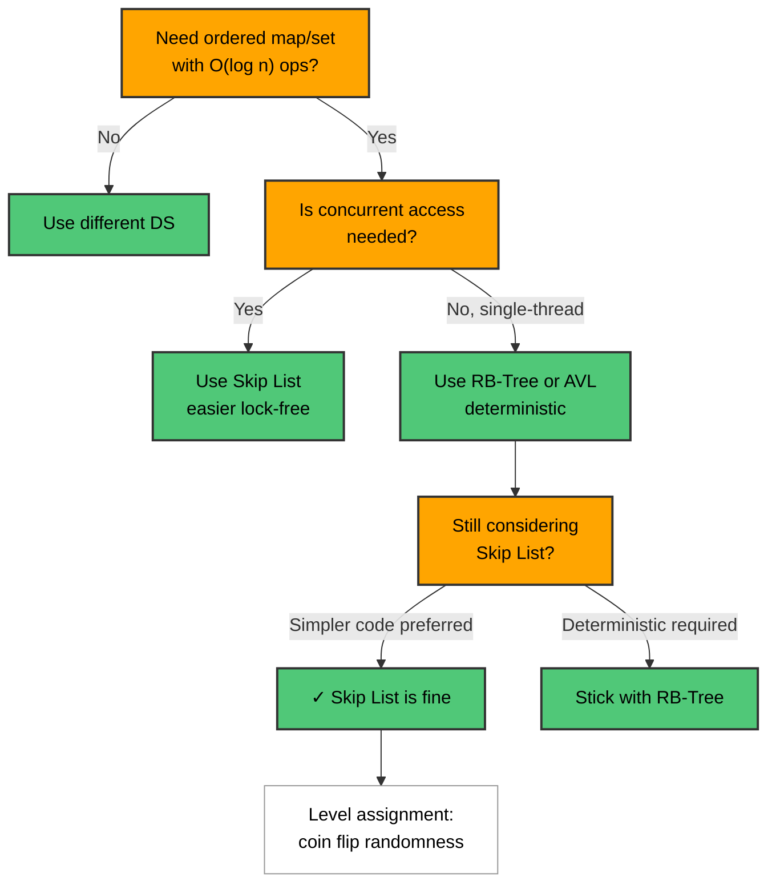
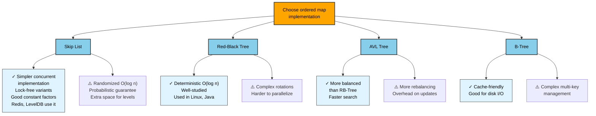
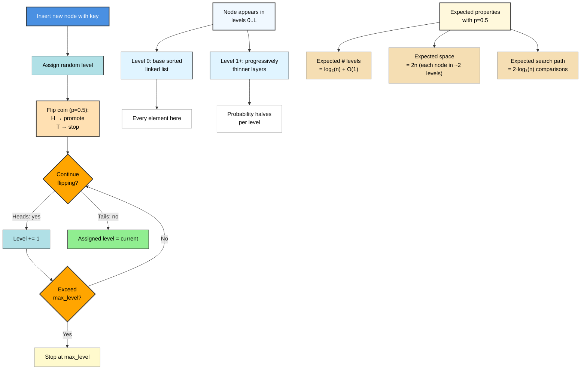
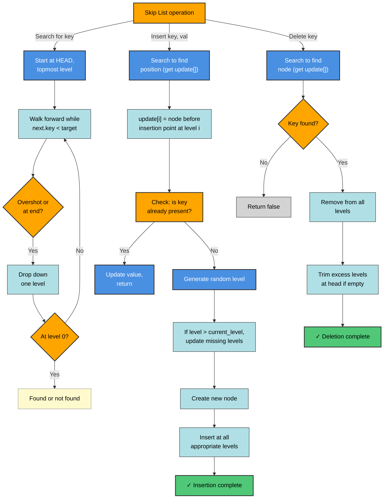
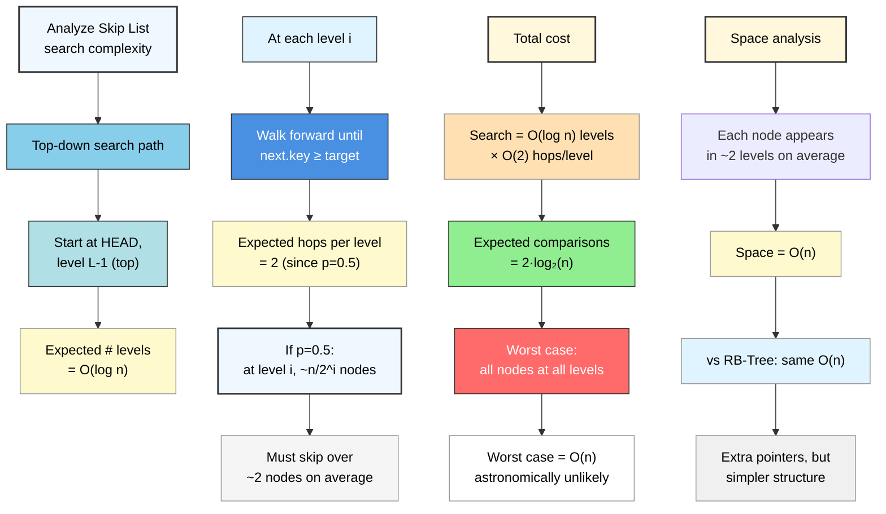
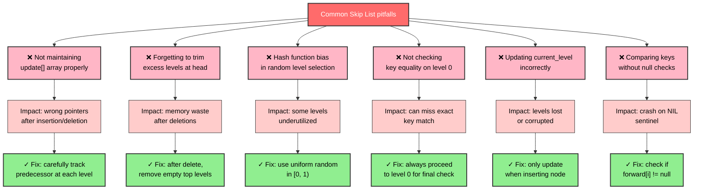

# Skip List

## Overview

A Skip List is a probabilistic data structure built on top of a sorted linked list.
It adds express lanes — extra levels of forward pointers — so that searches can skip
over large sections of the list, achieving O(log n) average-case performance without
the rotational complexity of balanced BSTs.

Invented by William Pugh (1990), skip lists are used in Redis sorted sets, LevelDB
memtables, and Java's `ConcurrentSkipListMap`.

---

## Flowcharts

### Problem Recognition: When to Use Skip List



### Skip List vs Balanced Tree Alternatives



### Level Assignment & Promotion Strategy



### Search & Update Operations



### Complexity Analysis: Search Path Cost



### Common Mistakes & Implementation Pitfalls



---

## ASCII Visualization

```
Inserting: 10, 20, 30, 50, 70, 90  (some nodes randomly promoted)

Level 3: HEAD ─────────────────────────────────> 50 ────────────────> NIL
Level 2: HEAD ────────────> 20 ──────────────> 50 ──────> 70 ───────> NIL
Level 1: HEAD ──> 10 ──> 20 ──────────> 50 ──────────> 70 ──> 90 ───> NIL
Level 0: HEAD ──> 10 ──> 20 ──> 30 ──> 50 ──> 70 ──> 90 ─────────── > NIL
          (base layer: sorted linked list with ALL elements)
```

### Search for 70 — walk top-down

```
Start at HEAD, Level 3
  HEAD -> 50 (50 < 70, advance)  50 -> NIL  (stop, drop to Level 2)
Level 2 from 50:
  50 -> 70 (70 == 70, FOUND)
```

### Node Promotion (coin flip)

```
New node with key=40:
  Flip coin: H (promote to L1)
  Flip coin: H (promote to L2)
  Flip coin: T (stop)   -> node lives in levels 0, 1, 2
```

---

## Operations & Complexity

| Operation | Average   | Worst  | Notes                          |
|-----------|-----------|--------|--------------------------------|
| Search    | O(log n)  | O(n)   | Probabilistic guarantee        |
| Insert    | O(log n)  | O(n)   | Random level assignment        |
| Delete    | O(log n)  | O(n)   | Must update all level pointers |
| Space     | O(n) avg  |O(n log n)| Each node in ~2 levels avg  |

- Average assumes promotion probability p = 0.5 and max level = log₂(n).
- Worst case occurs when every node promotes to all levels (degenerate).

---

## Key Properties / Invariants

1. **Level 0** is the complete sorted linked list — every element is here.
2. Each level i is a **subset** of level i-1.
3. A node at level k also appears at all levels 0..k.
4. HEAD sentinel has `-inf` key and spans all levels; NIL sentinel terminates each level.
5. **Promotion probability**: node promoted to level k with probability p^k.
   With p = 0.5 and n elements, expected levels = log₂(n).
6. No false ordering: keys are always in ascending order on every level.

---

## Common Interview Patterns

| Pattern | Description |
|---------|-------------|
| Design ordered map | Use skip list instead of BST when concurrent access is needed |
| Range queries | Walk level 0 from found node; all elements in range are adjacent |
| Rank / order statistics | Augment each forward pointer with a `span` count |
| Floor/ceiling queries | Stop one step before overshooting; that node is floor |

---

## Interview Tips

- When asked "why skip list over balanced BST?" — answer: simpler concurrent implementation
  (CAS on forward pointers vs tree rotations), lock-free variants exist.
- The expected number of comparisons is **2 log₂ n** — close to a balanced BST.
- If asked to implement: start with the `update[]` array pattern; it holds the predecessor
  at each level, enabling pointer surgery in O(log n).
- Know that Redis uses a **augmented** skip list (with `span` field) to support rank queries.
- Worst case is O(n) but astronomically unlikely with random coin flips.

---

## Example Problems

1. **Design Skiplist** (LeetCode 1206) — implement `search`, `add`, `erase`.
2. **Design a Data Structure that Supports Range Sum Queries** — augmented skip list.
3. **Redis Sorted Set design** — use skip list + hash map for O(log n) rank and score ops.
4. **Concurrent ordered map** — explain why skip list beats AVL/Red-Black for lock-free design.

---

## Python Quick Reference

```python
# Source: python/new_ds/skip_list.py
import random

MAX_LEVEL = 16
P = 0.5

class SkipListNode:
    def __init__(self, key, val, level):
        self.key = key
        self.val = val
        self.forward = [None] * (level + 1)

class SkipList:
    def __init__(self, max_level=MAX_LEVEL, p=P):
        self.max_level = max_level
        self.p = p
        self.current_level = 0
        self.size = 0
        self._head = SkipListNode(float('-inf'), None, max_level)

    def _random_level(self):
        level = 0
        while random.random() < self.p and level < self.max_level:
            level += 1
        return level

    def _find_update(self, key):
        update = [None] * (self.max_level + 1)
        cur = self._head
        for i in range(self.current_level, -1, -1):
            while cur.forward[i] and cur.forward[i].key < key:
                cur = cur.forward[i]
            update[i] = cur
        return update

    def insert(self, key, val):
        update = self._find_update(key)
        candidate = update[0].forward[0]
        if candidate and candidate.key == key:
            candidate.val = val
            return
        lvl = self._random_level()
        if lvl > self.current_level:
            for i in range(self.current_level + 1, lvl + 1):
                update[i] = self._head
            self.current_level = lvl
        node = SkipListNode(key, val, lvl)
        for i in range(lvl + 1):
            node.forward[i] = update[i].forward[i]
            update[i].forward[i] = node
        self.size += 1

    def search(self, key):
        cur = self._head
        for i in range(self.current_level, -1, -1):
            while cur.forward[i] and cur.forward[i].key < key:
                cur = cur.forward[i]
        cur = cur.forward[0]
        return cur.val if cur and cur.key == key else None

    def delete(self, key):
        update = self._find_update(key)
        target = update[0].forward[0]
        if not target or target.key != key:
            return False
        for i in range(self.current_level + 1):
            if update[i].forward[i] is not target:
                break
            update[i].forward[i] = target.forward[i]
        while self.current_level > 0 and not self._head.forward[self.current_level]:
            self.current_level -= 1
        self.size -= 1
        return True

# Usage
sl = SkipList()
sl.insert(3, "three")
sl.insert(1, "one")
print(sl.search(3))   # "three"
sl.delete(1)
print(1 in sl)        # False (uses __contains__ -> search)
```

---

## Java Quick Reference

```java
// Source: java/new_ds/SkipList.java
import java.util.Random;

public class SkipList<K extends Comparable<K>, V> {
    private static final int MAX_LEVEL = 16;
    private static final double P = 0.5;

    private static class Node<K, V> {
        K key; V val;
        Node<K, V>[] forward;
        @SuppressWarnings("unchecked")
        Node(K key, V val, int level) {
            this.key = key; this.val = val;
            forward = new Node[level + 1];
        }
    }

    private final Node<K, V> head;
    private int currentLevel = 0;
    private final Random rng = new Random();

    @SuppressWarnings("unchecked")
    public SkipList() {
        head = new Node<>(null, null, MAX_LEVEL);
    }

    private int randomLevel() {
        int level = 0;
        while (rng.nextDouble() < P && level < MAX_LEVEL) level++;
        return level;
    }

    public V search(K key) {
        Node<K, V> cur = head;
        for (int i = currentLevel; i >= 0; i--)
            while (cur.forward[i] != null && cur.forward[i].key.compareTo(key) < 0)
                cur = cur.forward[i];
        cur = cur.forward[0];
        return (cur != null && cur.key.compareTo(key) == 0) ? cur.val : null;
    }

    @SuppressWarnings("unchecked")
    public void insert(K key, V val) {
        Node<K, V>[] update = new Node[MAX_LEVEL + 1];
        Node<K, V> cur = head;
        for (int i = currentLevel; i >= 0; i--) {
            while (cur.forward[i] != null && cur.forward[i].key.compareTo(key) < 0)
                cur = cur.forward[i];
            update[i] = cur;
        }
        Node<K, V> candidate = cur.forward[0];
        if (candidate != null && candidate.key.compareTo(key) == 0) {
            candidate.val = val; return;
        }
        int lvl = randomLevel();
        if (lvl > currentLevel) {
            for (int i = currentLevel + 1; i <= lvl; i++) update[i] = head;
            currentLevel = lvl;
        }
        Node<K, V> node = new Node<>(key, val, lvl);
        for (int i = 0; i <= lvl; i++) {
            node.forward[i] = update[i].forward[i];
            update[i].forward[i] = node;
        }
    }
}
```
