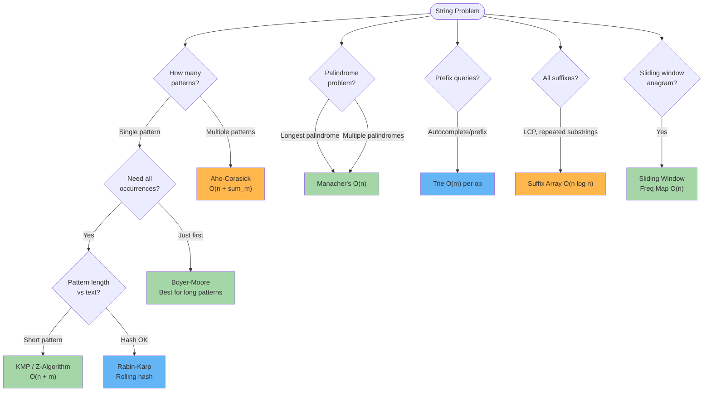
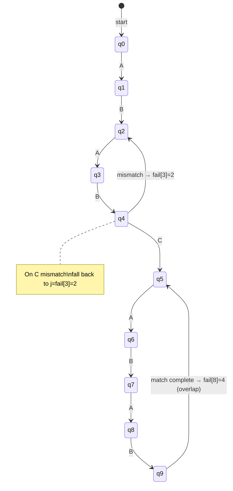
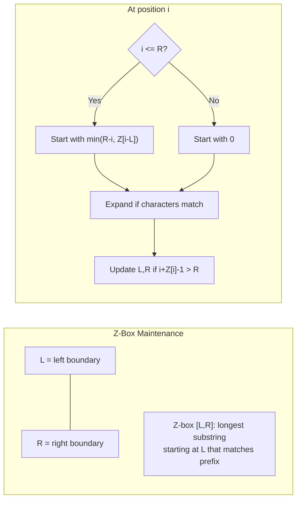
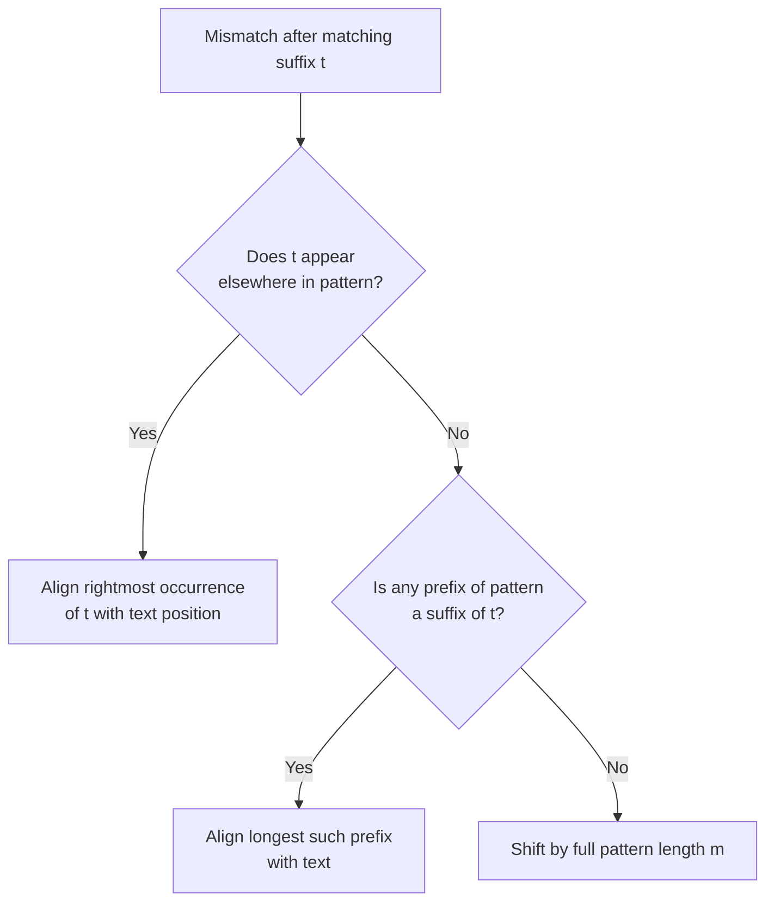
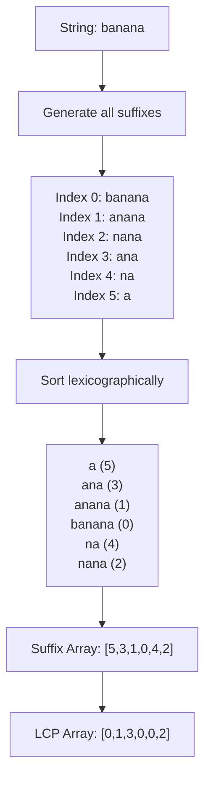
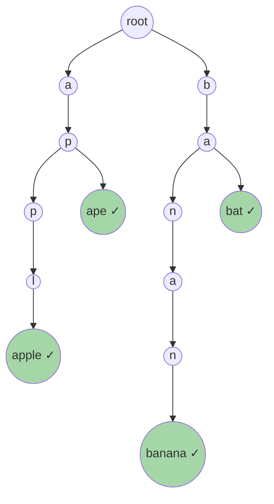

# String Algorithms

## Overview

String algorithms form a core pillar of SDE interviews. They combine clever preprocessing (failure functions, hash arrays, transformed strings) with linear-time scans to solve problems that naive approaches handle in O(n²) or worse.

**When to use:**
- Substring search (exact match, multiple patterns, approximate match)
- Palindrome detection and enumeration
- Duplicate/repeated substring detection
- Anagram / permutation detection in a stream
- Data compression (run-length encoding, LZ-family)
- String comparison and equality checks in O(1) after preprocessing

---

## Algorithm Complexity Reference

| Algorithm                   | Time            | Space      | Best Use Case                                |
|-----------------------------|:---------------:|:----------:|----------------------------------------------|
| KMP                         | O(n + m)        | O(m)       | Single pattern, no hash overhead             |
| Rabin-Karp                  | O(n + m) avg    | O(1)       | Multiple patterns, duplicate detection       |
| Z-Algorithm                 | O(n + m)        | O(n + m)   | Pattern search, period detection             |
| Aho-Corasick                | O(n + sum(m))   | O(sum(m))  | Multiple patterns simultaneously             |
| Boyer-Moore                 | O(n/m) best     | O(m + σ)   | Long patterns, large alphabets               |
| Manacher's                  | O(n)            | O(n)       | All palindromic substrings                   |
| Suffix Array                | O(n log n)      | O(n)       | All suffix queries, LCP                      |
| Trie                        | O(m) per op     | O(n·m)     | Prefix queries, autocomplete                 |
| String Hashing              | O(n) pre        | O(n)       | O(1) substring equality                     |
| Anagram Detection           | O(n)            | O(1)       | Permutation in sliding window               |
| Longest Common Substring    | O(n × m)        | O(min(n,m))| DP substring match                          |
| Run-Length Encoding         | O(n)            | O(n)       | Compress repeated characters                |

---

## Algorithm Selection Flowchart



---

## Algorithms

### 1. KMP — Knuth-Morris-Pratt

**Core idea:** Preprocess the pattern into a *failure function* (prefix function) that, on a mismatch, tells us the farthest we can shift without missing a match. The text pointer never moves backward.

#### Failure Function Construction

```
pattern = "A B A B C A B A B"
index  =   0 1 2 3 4 5 6 7 8

i=1: B != A, length=0    → failure[1] = 0
i=2: A == A, length=1    → failure[2] = 1
i=3: B == B, length=2    → failure[3] = 2
i=4: C != A, fall back to failure[1]=0 → C != A → failure[4] = 0
i=5: A == A, length=1    → failure[5] = 1
i=6: B == B, length=2    → failure[6] = 2
i=7: A == A, length=3    → failure[7] = 3
i=8: B == B, length=4    → failure[8] = 4

failure = [0, 0, 1, 2, 0, 1, 2, 3, 4]
```

#### Failure Function State Diagram



#### KMP Search Step-by-Step

```
text    = "A B A B D A B A C D A B A B C A B A B"
pattern = "A B A B C A B A B"
failure = [0, 0, 1, 2, 0, 1, 2, 3, 4]

i=0..3: A=A B=B A=A B=B  → j advances to 4
i=4: text[4]=D vs pattern[4]=C  → MISMATCH at j=4
       fall back: j = failure[3] = 2
       text[4]=D vs pattern[2]=A → MISMATCH at j=2
       fall back: j = failure[1] = 0
       text[4]=D vs pattern[0]=A → MISMATCH at j=0 → advance i

i=5..9: A=A B=B A=A B=B C=C  → j advances to 5
i=10..18: A B A B C A B A B → FULL MATCH at start=10
          j = failure[8] = 4  (continue for overlapping)

Result: match at index 10
```

#### Python Implementation

```python
def kmp_failure(pattern: str) -> list[int]:
    """Build KMP failure (prefix) function. O(m) time and space."""
    m = len(pattern)
    fail = [0] * m
    j = 0
    for i in range(1, m):
        while j > 0 and pattern[i] != pattern[j]:
            j = fail[j - 1]
        if pattern[i] == pattern[j]:
            j += 1
        fail[i] = j
    return fail


def kmp_search(text: str, pattern: str) -> list[int]:
    """
    Find all start indices of pattern in text using KMP.
    Time: O(n + m), Space: O(m)

    Example:
        kmp_search("abcabcabc", "abc") -> [0, 3, 6]
    """
    if not pattern:
        return []
    n, m = len(text), len(pattern)
    fail = kmp_failure(pattern)
    results = []
    j = 0
    for i in range(n):
        while j > 0 and text[i] != pattern[j]:
            j = fail[j - 1]
        if text[i] == pattern[j]:
            j += 1
        if j == m:
            results.append(i - m + 1)
            j = fail[j - 1]  # allow overlapping matches
    return results


# Example
print(kmp_search("ABABDABABCABABCABAB", "ABABCABAB"))  # [10]
print(kmp_search("aababab", "abab"))                    # [1, 3]
```

#### Java Implementation

```java
import java.util.*;

public class KMP {
    public static int[] buildFailure(String pattern) {
        int m = pattern.length();
        int[] fail = new int[m];
        for (int i = 1, j = 0; i < m; i++) {
            while (j > 0 && pattern.charAt(i) != pattern.charAt(j))
                j = fail[j - 1];
            if (pattern.charAt(i) == pattern.charAt(j))
                fail[i] = ++j;
        }
        return fail;
    }

    public static List<Integer> search(String text, String pattern) {
        List<Integer> result = new ArrayList<>();
        if (pattern.isEmpty()) return result;
        int n = text.length(), m = pattern.length();
        int[] fail = buildFailure(pattern);
        for (int i = 0, j = 0; i < n; i++) {
            while (j > 0 && text.charAt(i) != pattern.charAt(j))
                j = fail[j - 1];
            if (text.charAt(i) == pattern.charAt(j)) j++;
            if (j == m) {
                result.add(i - m + 1);
                j = fail[j - 1];
            }
        }
        return result;
    }

    public static void main(String[] args) {
        System.out.println(search("ABABDABABCABABCABAB", "ABABCABAB")); // [10]
        System.out.println(search("aababab", "abab"));                   // [1, 3]
    }
}
```

---

### 2. Rabin-Karp — Rolling Hash

**Core idea:** Hash the pattern once, then slide a same-length window over the text. Each slide recomputes the hash in O(1) by removing the leading character's contribution and adding the new trailing character.

#### Rolling Hash Computation

```
text    = "G E E K S   F O R   G E E K S"
pattern = "G E E K S"   (m=5)

BASE = 256, MOD = 2147483647

h = BASE^(m-1) mod MOD   (coefficient of leading char)

Initial window: "GEEKS"
  hash = G*256^4 + E*256^3 + E*256^2 + K*256 + S

Slide: remove 'G', add ' '
  new_hash = (BASE * (old_hash - G * h) + ' ') mod MOD
             ↑ O(1) — no loop needed

Window:  G E E K S     hash match → verify → MATCH at i=0
         E E K S ' '   no match
         ...
         G E E K S     hash match → verify → MATCH at i=10
```

#### Python Implementation

```python
def rabin_karp(text: str, pattern: str) -> list[int]:
    """
    Rabin-Karp single pattern search using polynomial rolling hash.
    Time: O(n+m) average, O(nm) worst (all collisions). Space: O(1).
    """
    BASE, MOD = 256, (1 << 31) - 1
    n, m = len(text), len(pattern)
    if m > n:
        return []
    h = pow(BASE, m - 1, MOD)
    p_hash = w_hash = 0
    for i in range(m):
        p_hash = (BASE * p_hash + ord(pattern[i])) % MOD
        w_hash = (BASE * w_hash + ord(text[i])) % MOD

    results = []
    for i in range(n - m + 1):
        if p_hash == w_hash and text[i:i + m] == pattern:
            results.append(i)
        if i < n - m:
            w_hash = (BASE * (w_hash - ord(text[i]) * h) + ord(text[i + m])) % MOD
            if w_hash < 0:
                w_hash += MOD
    return results


def rabin_karp_multi(text: str, patterns: list[str]) -> dict:
    """
    Search multiple patterns simultaneously using rolling hash with a set.
    Time: O(n*L + sum_m), Space: O(k) where k = number of patterns.
    """
    from collections import defaultdict
    result = defaultdict(list)
    pattern_set = {p: set() for p in patterns}
    lengths = set(len(p) for p in patterns)
    pattern_hashes = {}
    BASE, MOD = 131, (1 << 61) - 1

    for p in patterns:
        h = 0
        for c in p:
            h = (BASE * h + ord(c)) % MOD
        pattern_hashes[h] = pattern_hashes.get(h, []) + [p]

    for length in lengths:
        if length > len(text):
            continue
        h = pow(BASE, length - 1, MOD)
        w_hash = 0
        for c in text[:length]:
            w_hash = (BASE * w_hash + ord(c)) % MOD
        for i in range(len(text) - length + 1):
            if w_hash in pattern_hashes:
                for p in pattern_hashes[w_hash]:
                    if len(p) == length and text[i:i + length] == p:
                        result[p].append(i)
            if i < len(text) - length:
                w_hash = (BASE * (w_hash - ord(text[i]) * h) + ord(text[i + length])) % MOD
                if w_hash < 0:
                    w_hash += MOD
    return dict(result)
```

#### Java Implementation

```java
import java.util.*;

public class RabinKarp {
    private static final long BASE = 256, MOD = 2147483647L;

    public static List<Integer> search(String text, String pattern) {
        int n = text.length(), m = pattern.length();
        List<Integer> result = new ArrayList<>();
        if (m > n) return result;

        long h = 1, pHash = 0, wHash = 0;
        for (int i = 0; i < m - 1; i++) h = (h * BASE) % MOD;
        for (int i = 0; i < m; i++) {
            pHash = (BASE * pHash + pattern.charAt(i)) % MOD;
            wHash = (BASE * wHash + text.charAt(i)) % MOD;
        }
        for (int i = 0; i <= n - m; i++) {
            if (pHash == wHash && text.substring(i, i + m).equals(pattern))
                result.add(i);
            if (i < n - m) {
                wHash = (BASE * (wHash - text.charAt(i) * h % MOD + MOD) + text.charAt(i + m)) % MOD;
            }
        }
        return result;
    }
}
```

---

### 3. Z-Algorithm

**Core idea:** Build the Z-array of the concatenated string `S = pattern + '$' + text`. `Z[i]` = length of the longest prefix of S that matches S[i..]. A Z-value equal to `|pattern|` signals a full match.

#### Z-Array Construction (Detailed Trace)

```
S = "A A B $ A A B X A A B"
     0 1 2 3 4 5 6 7 8 9 10

Z[0] = 0 by convention (entire string matches itself; omitted)

i=1: Expand: S[1]=A == S[0]=A → match; S[2]=B == S[1]=A? No → Z[1]=1
     Update Z-box: L=1, R=1

i=2: i<=R=1? No. Expand: S[2]=B vs S[0]=A → No → Z[2]=0

i=3: '$': always 0 → Z[3]=0

i=4: i>R=1. Expand: S[4]=A==S[0]=A; S[5]=A==S[1]=A; S[6]=B==S[2]=B → 3 chars match
     S[7]=X vs S[3]='$' → stop → Z[4]=3, update L=4, R=6

i=5: i<=R=6. mirror = i-L = 1. Z[mirror]=Z[1]=1. R-i = 1.
     min(R-i, Z[mirror]) = min(1,1) = 1. Try expand: S[6]=B vs S[1]=A? No → Z[5]=1

i=6: i<=R=6. mirror=2. Z[2]=0. min(0,0)=0. Expand: S[6]=B vs S[0]=A → No → Z[6]=0

i=7: i>R. Expand: S[7]=X vs S[0]=A → No → Z[7]=0

i=8: i>R. Expand: S[8]=A==S[0]; S[9]=A==S[1]; S[10]=B==S[2] → Z[8]=3, L=8, R=10

Z = [0, 1, 0, 0, 3, 1, 0, 0, 3, ...]

Z[4]=3 == |pattern|=3 → match at text[4-(3+1)] = text[0]
Z[8]=3 == |pattern|=3 → match at text[8-(3+1)] = text[4]
```

#### Z-Algorithm Visualization



#### Python Implementation

```python
def z_function(s: str) -> list[int]:
    """
    Build Z-array: Z[i] = length of longest prefix of s matching s[i:].
    Time: O(n), Space: O(n).
    """
    n = len(s)
    z = [0] * n
    l, r = 0, 0
    for i in range(1, n):
        if i < r:
            z[i] = min(r - i, z[i - l])
        while i + z[i] < n and s[z[i]] == s[i + z[i]]:
            z[i] += 1
        if i + z[i] > r:
            l, r = i, i + z[i]
    return z


def z_search(text: str, pattern: str) -> list[int]:
    """
    Find all occurrences of pattern in text using Z-algorithm.
    Concatenate pattern + '$' + text, then find positions where Z[i] == len(pattern).

    Example:
        z_search("aababab", "abab") -> [1, 3]
    """
    if not pattern:
        return []
    combined = pattern + '$' + text
    z = z_function(combined)
    m = len(pattern)
    results = []
    for i in range(m + 1, len(combined)):
        if z[i] == m:
            results.append(i - m - 1)
    return results


def find_period(s: str) -> int:
    """Find smallest period of string s using Z-array."""
    z = z_function(s)
    n = len(s)
    for p in range(1, n):
        if n % p == 0 and z[p] == n - p:
            return p
    return n


# Examples
print(z_search("AABAABXAABAAB", "AABAA"))  # Finds all positions
print(find_period("abcabcabc"))             # 3
```

#### Java Implementation

```java
import java.util.*;

public class ZAlgorithm {
    public static int[] zFunction(String s) {
        int n = s.length();
        int[] z = new int[n];
        for (int i = 1, l = 0, r = 0; i < n; i++) {
            if (i < r) z[i] = Math.min(r - i, z[i - l]);
            while (i + z[i] < n && s.charAt(z[i]) == s.charAt(i + z[i]))
                z[i]++;
            if (i + z[i] > r) { l = i; r = i + z[i]; }
        }
        return z;
    }

    public static List<Integer> search(String text, String pattern) {
        List<Integer> result = new ArrayList<>();
        if (pattern.isEmpty()) return result;
        String combined = pattern + "$" + text;
        int[] z = zFunction(combined);
        int m = pattern.length();
        for (int i = m + 1; i < combined.length(); i++) {
            if (z[i] == m) result.add(i - m - 1);
        }
        return result;
    }

    public static void main(String[] args) {
        System.out.println(search("aababab", "abab")); // [1, 3]
    }
}
```

---

### 4. Manacher's Algorithm

**Core idea:** Insert `#` separators to unify odd/even palindromes. Maintain a right-boundary `R` and its center `C`. If position `i` is inside `[C - R, R]`, initialise its palindrome radius from the mirror position, avoiding redundant expansions.

#### '#' Transform and Radius Array

```
Original: "a b b a"
          0 1 2 3

Transformed T: "# a # b # b # a #"
               0 1 2 3 4 5 6 7 8

Compute p[i] = palindrome radius at i:
  i=4: '#', expand T[3]='b' vs T[5]='b' → match
            T[2]='#' vs T[6]='#' → match
            T[1]='a' vs T[7]='a' → match
            T[0]='#' vs T[8]='#' → match
            T[-1] OOB → stop → p[4]=4  ← max palindrome "abba"

p = [0, 1, 0, 1, 4, 1, 0, 1, 0]
         ↑ max is p[4]=4 at center 4

start in original = (4 - 4) / 2 = 0,  length = 4 → "abba" ✓
```

#### Python Implementation

```python
def manacher(s: str) -> str:
    """
    Find longest palindromic substring using Manacher's algorithm.
    Time: O(n), Space: O(n).

    Example:
        manacher("babad") -> "bab" or "aba"
        manacher("cbbd")  -> "bb"
    """
    t = '#' + '#'.join(s) + '#'
    n = len(t)
    p = [0] * n
    c = r = 0
    for i in range(n):
        if i < r:
            p[i] = min(r - i, p[2 * c - i])
        while i - p[i] - 1 >= 0 and i + p[i] + 1 < n and t[i - p[i] - 1] == t[i + p[i] + 1]:
            p[i] += 1
        if i + p[i] > r:
            c, r = i, i + p[i]
    max_len = max(p)
    center = p.index(max_len)
    start = (center - max_len) // 2
    return s[start:start + max_len]


def all_palindromic_substrings_count(s: str) -> int:
    """Count all distinct palindromic substrings using Manacher."""
    t = '#' + '#'.join(s) + '#'
    n = len(t)
    p = [0] * n
    c = r = 0
    for i in range(n):
        if i < r:
            p[i] = min(r - i, p[2 * c - i])
        while i - p[i] - 1 >= 0 and i + p[i] + 1 < n and t[i - p[i] - 1] == t[i + p[i] + 1]:
            p[i] += 1
        if i + p[i] > r:
            c, r = i, i + p[i]
    # Each p[i] contributes ceil(p[i]/2) palindromes centered at i
    return sum((v + 1) // 2 for v in p)
```

#### Java Implementation

```java
public class Manacher {
    public static String longestPalindrome(String s) {
        if (s == null || s.isEmpty()) return "";
        StringBuilder sb = new StringBuilder("#");
        for (char c : s.toCharArray()) { sb.append(c); sb.append('#'); }
        String t = sb.toString();
        int n = t.length();
        int[] p = new int[n];
        int c = 0, r = 0;
        for (int i = 0; i < n; i++) {
            if (i < r) p[i] = Math.min(r - i, p[2 * c - i]);
            while (i - p[i] - 1 >= 0 && i + p[i] + 1 < n
                   && t.charAt(i - p[i] - 1) == t.charAt(i + p[i] + 1))
                p[i]++;
            if (i + p[i] > r) { c = i; r = i + p[i]; }
        }
        int maxLen = 0, center = 0;
        for (int i = 0; i < n; i++) if (p[i] > maxLen) { maxLen = p[i]; center = i; }
        int start = (center - maxLen) / 2;
        return s.substring(start, start + maxLen);
    }

    public static void main(String[] args) {
        System.out.println(longestPalindrome("babad")); // bab
        System.out.println(longestPalindrome("cbbd"));  // bb
    }
}
```

---

### 5. Aho-Corasick — Multiple Pattern Matching

**Core idea:** Build a trie from all patterns. Add failure links (like KMP failure function but across trie nodes) and output links. A single O(n) scan of the text then finds ALL occurrences of ALL patterns simultaneously.

#### Automaton State Diagram

```mermaid
stateDiagram-v2
    [*] --> root: start
    root --> s1: h
    s1 --> s2: e
    s2 --> s3: r
    s3 --> s4: s
    s4 --> OUTPUT_hers: hers
    root --> s5: s
    s5 --> s6: h
    s6 --> s7: e
    s7 --> s8: a
    s8 --> OUTPUT_shea: shea
    s7 --> OUTPUT_he: he
    s2 --> OUTPUT_he_via_output: [output link to he]
    note right of s6: fail link to s1 (h)
    note right of s2: fail link to root
```

#### Goto / Failure / Output Functions

```
Patterns: ["he", "she", "his", "hers"]

Trie (goto function):
  root --h--> 1 --e--> 2 --r--> 3 --s--> 4  (hers)
  root --s--> 5 --h--> 6 --e--> 7 --r--> 8  (she → output at 7)
  root --h--> 1 --i--> 9 --s--> 10            (his)
                           (he → output at 2)

Failure links (BFS construction):
  f[1]=root, f[2]=root, f[5]=root
  f[6]=1 (suffix 'h' matches goto(root,'h')=1)
  f[7]=2 (suffix 'he' matches path root→h→e=2)
  f[7] has output link to 2 (which outputs "he")

Text = "ahershers"
  a: stay root
  h: goto 1
  e: goto 2 → output "he" at position 2
  r: goto 3
  s: goto 4 → output "hers" at position 4; follow output links
  h: follow fail? goto(fail[4], 'h') = ... eventually goto 1 again
  ...
```

#### Python Implementation

```python
from collections import deque

class AhoCorasick:
    """
    Aho-Corasick automaton for multiple pattern matching.
    Build: O(sum of pattern lengths)
    Search: O(n + number_of_matches)
    """
    def __init__(self):
        self.goto = [{}]        # goto[state][char] = next_state
        self.fail = [0]         # failure links
        self.output = [[]]      # output[state] = list of pattern indices ending here
        self.patterns = []

    def add_pattern(self, pattern: str):
        """Insert a pattern into the trie."""
        state = 0
        idx = len(self.patterns)
        self.patterns.append(pattern)
        for ch in pattern:
            if ch not in self.goto[state]:
                self.goto[state][ch] = len(self.goto)
                self.goto.append({})
                self.fail.append(0)
                self.output.append([])
            state = self.goto[state][ch]
        self.output[state].append(idx)

    def build(self):
        """Build failure links using BFS. Call after all add_pattern() calls."""
        q = deque()
        for ch, s in self.goto[0].items():
            self.fail[s] = 0
            q.append(s)
        while q:
            r = q.popleft()
            for ch, s in self.goto[r].items():
                q.append(s)
                state = self.fail[r]
                while state != 0 and ch not in self.goto[state]:
                    state = self.fail[state]
                self.fail[s] = self.goto[state].get(ch, 0)
                if self.fail[s] == s:
                    self.fail[s] = 0
                self.output[s] = self.output[s] + self.output[self.fail[s]]

    def search(self, text: str) -> list[tuple]:
        """
        Search text for all patterns. Returns list of (end_index, pattern).
        """
        state = 0
        results = []
        for i, ch in enumerate(text):
            while state != 0 and ch not in self.goto[state]:
                state = self.fail[state]
            state = self.goto[state].get(ch, 0)
            for idx in self.output[state]:
                pat = self.patterns[idx]
                results.append((i - len(pat) + 1, pat))
        return results


# Example usage
ac = AhoCorasick()
for p in ["he", "she", "his", "hers"]:
    ac.add_pattern(p)
ac.build()
print(ac.search("ahershers"))
# [(1, 'he'), (1, 'hers'), (5, 'she'), (5, 'he'), (5, 'hers')]
```

#### Java Implementation

```java
import java.util.*;

public class AhoCorasick {
    private final int[][] go;
    private final int[] fail;
    private final List<List<Integer>> output;
    private final List<String> patterns;
    private int size;
    private static final int ALPHA = 26;

    public AhoCorasick(int maxNodes) {
        go = new int[maxNodes][ALPHA];
        fail = new int[maxNodes];
        output = new ArrayList<>();
        patterns = new ArrayList<>();
        for (int[] row : go) Arrays.fill(row, -1);
        output.add(new ArrayList<>());
        size = 1;
    }

    public void addPattern(String pattern) {
        int state = 0;
        int idx = patterns.size();
        patterns.add(pattern);
        for (char ch : pattern.toCharArray()) {
            int c = ch - 'a';
            if (go[state][c] == -1) {
                go[size] = new int[ALPHA];
                Arrays.fill(go[size], -1);
                output.add(new ArrayList<>());
                go[state][c] = size++;
            }
            state = go[state][c];
        }
        output.get(state).add(idx);
    }

    public void build() {
        Queue<Integer> q = new LinkedList<>();
        for (int c = 0; c < ALPHA; c++) {
            if (go[0][c] == -1) go[0][c] = 0;
            else { fail[go[0][c]] = 0; q.add(go[0][c]); }
        }
        while (!q.isEmpty()) {
            int r = q.poll();
            output.get(r).addAll(output.get(fail[r]));
            for (int c = 0; c < ALPHA; c++) {
                if (go[r][c] == -1)
                    go[r][c] = go[fail[r]][c];
                else {
                    fail[go[r][c]] = go[fail[r]][c];
                    q.add(go[r][c]);
                }
            }
        }
    }

    public List<int[]> search(String text) {
        List<int[]> result = new ArrayList<>();
        int state = 0;
        for (int i = 0; i < text.length(); i++) {
            state = go[state][text.charAt(i) - 'a'];
            for (int idx : output.get(state)) {
                String p = patterns.get(idx);
                result.add(new int[]{i - p.length() + 1, idx});
            }
        }
        return result;
    }
}
```

---

### 6. Boyer-Moore Algorithm

**Core idea:** Scan the pattern right-to-left while sliding left-to-right over text. Two heuristics drive large skips: **Bad Character** (shift so the bad-character in text aligns with its rightmost occurrence in pattern) and **Good Suffix** (shift so a matched suffix realigns with a matching prefix or another occurrence in pattern).

#### Bad Character & Good Suffix Trace

```
text    = "T R U S T   N O   O N E"
pattern = "N O"

Bad Character Rule:
  Precompute: rightmost[c] = last position of char c in pattern
  rightmost['N'] = 0, rightmost['O'] = 1

Alignment at text[0..1] = "TR":
  Compare pattern right-to-left: pattern[1]='O' vs text[1]='R'
  Mismatch: bad char = 'R', not in pattern → skip = 2 (m)

Alignment at text[2..3] = "US":
  pattern[1]='O' vs text[3]='S' → mismatch
  'S' not in pattern → skip 2

Alignment at text[4..5] = "T ":
  pattern[1]='O' vs text[5]=' ' → mismatch → skip 2

Alignment at text[6..7] = "NO":
  pattern[1]='O' vs text[7]='O' → match
  pattern[0]='N' vs text[6]='N' → match → FOUND at 6

Total comparisons: 6 (vs naive: 12)
```

#### Good Suffix Rule Diagram



#### Python Implementation

```python
def boyer_moore(text: str, pattern: str) -> list[int]:
    """
    Boyer-Moore with bad character rule.
    Time: O(n/m) best, O(nm) worst. Space: O(sigma).

    Example:
        boyer_moore("ABAAABCD", "ABC") -> [4]
    """
    def bad_char_table(pattern: str) -> dict:
        table = {}
        for i, c in enumerate(pattern):
            table[c] = i
        return table

    n, m = len(text), len(pattern)
    if m == 0:
        return []
    bad_char = bad_char_table(pattern)
    results = []
    s = 0  # shift of pattern with respect to text
    while s <= n - m:
        j = m - 1
        while j >= 0 and pattern[j] == text[s + j]:
            j -= 1
        if j < 0:
            results.append(s)
            # Shift to align next character
            bc = bad_char.get(text[s + m], -1) if s + m < n else -1
            s += (m - bc) if s + m < n else 1
        else:
            bc = bad_char.get(text[s + j], -1)
            s += max(1, j - bc)
    return results


def good_suffix_table(pattern: str) -> list[int]:
    """Build good suffix shift table for Boyer-Moore."""
    m = len(pattern)
    shift = [m] * (m + 1)
    border = [0] * (m + 1)

    # Phase 1: preprocessing
    i, j = m, m + 1
    border[i] = j
    while i > 0:
        while j <= m and pattern[i - 1] != pattern[j - 1]:
            if shift[j] == m:
                shift[j] = j - i
            j = border[j]
        i -= 1
        j -= 1
        border[i] = j

    # Phase 2: suffix shifts
    j = border[0]
    for i in range(m + 1):
        if shift[i] == m:
            shift[i] = j
        if i == j:
            j = border[j]
    return shift


print(boyer_moore("ABAAABCD", "ABC"))      # [4]
print(boyer_moore("AABAACAADAABAAABAA", "AABA"))  # [0, 9, 13]
```

#### Java Implementation

```java
import java.util.*;

public class BoyerMoore {
    public static List<Integer> search(String text, String pattern) {
        List<Integer> result = new ArrayList<>();
        int n = text.length(), m = pattern.length();
        if (m == 0) return result;

        // Bad character table
        int[] bad = new int[256];
        Arrays.fill(bad, -1);
        for (int i = 0; i < m; i++) bad[pattern.charAt(i)] = i;

        int s = 0;
        while (s <= n - m) {
            int j = m - 1;
            while (j >= 0 && pattern.charAt(j) == text.charAt(s + j)) j--;
            if (j < 0) {
                result.add(s);
                s += (s + m < n) ? m - bad[text.charAt(s + m)] : 1;
            } else {
                s += Math.max(1, j - bad[text.charAt(s + j)]);
            }
        }
        return result;
    }

    public static void main(String[] args) {
        System.out.println(search("ABAAABCD", "ABC"));           // [4]
        System.out.println(search("AABAACAADAABAAABAA", "AABA")); // [0, 9, 13]
    }
}
```

---

### 7. Suffix Array

**Core idea:** A suffix array is the sorted array of all suffixes of a string. Combined with the LCP (Longest Common Prefix) array, it enables O(log n) substring search and solves many string problems in O(n log n) total.

#### Suffix Array Construction Trace



```
String: "banana"
Suffixes (index, suffix):
  0: banana
  1: anana
  2: nana
  3: ana
  4: na
  5: a

Sorted:
  5: a         SA[0]=5
  3: ana        SA[1]=3  LCP with prev: 1 (a)
  1: anana      SA[2]=1  LCP with prev: 3 (ana)
  0: banana     SA[3]=0  LCP with prev: 0
  4: na         SA[4]=4  LCP with prev: 0
  2: nana       SA[5]=2  LCP with prev: 2 (na)

SA  = [5, 3, 1, 0, 4, 2]
LCP = [0, 1, 3, 0, 0, 2]

Longest repeated substring: max(LCP) = 3 → "ana"
```

#### Python Implementation

```python
def build_suffix_array_naive(s: str) -> list[int]:
    """
    Naive suffix array construction. O(n^2 log n).
    Use for interviews; mention SA-IS for O(n) production.
    """
    n = len(s)
    suffixes = sorted(range(n), key=lambda i: s[i:])
    return suffixes


def build_lcp_array(s: str, sa: list[int]) -> list[int]:
    """
    Build LCP array using Kasai's algorithm. O(n).
    LCP[i] = longest common prefix of sa[i] and sa[i-1].
    """
    n = len(s)
    rank = [0] * n
    for i, v in enumerate(sa):
        rank[v] = i

    lcp = [0] * n
    h = 0
    for i in range(n):
        if rank[i] > 0:
            j = sa[rank[i] - 1]
            while i + h < n and j + h < n and s[i + h] == s[j + h]:
                h += 1
            lcp[rank[i]] = h
            if h > 0:
                h -= 1
    return lcp


def longest_repeated_substring(s: str) -> str:
    """Find longest repeated substring using suffix array + LCP."""
    sa = build_suffix_array_naive(s)
    lcp = build_lcp_array(s, sa)
    max_lcp = max(lcp)
    if max_lcp == 0:
        return ""
    idx = lcp.index(max_lcp)
    return s[sa[idx]:sa[idx] + max_lcp]


def count_distinct_substrings(s: str) -> int:
    """Count distinct substrings using SA + LCP. O(n log n)."""
    n = len(s)
    sa = build_suffix_array_naive(s)
    lcp = build_lcp_array(s, sa)
    return n * (n + 1) // 2 - sum(lcp)


# Examples
s = "banana"
sa = build_suffix_array_naive(s)
lcp = build_lcp_array(s, sa)
print(f"SA: {sa}")         # [5, 3, 1, 0, 4, 2]
print(f"LCP: {lcp}")       # [0, 1, 3, 0, 0, 2]
print(longest_repeated_substring(s))   # "ana"
print(count_distinct_substrings("abc"))  # 6
```

#### Java Implementation

```java
import java.util.*;

public class SuffixArray {
    public static int[] buildSA(String s) {
        int n = s.length();
        Integer[] sa = new Integer[n];
        for (int i = 0; i < n; i++) sa[i] = i;
        Arrays.sort(sa, (a, b) -> s.substring(a).compareTo(s.substring(b)));
        return Arrays.stream(sa).mapToInt(Integer::intValue).toArray();
    }

    public static int[] buildLCP(String s, int[] sa) {
        int n = s.length();
        int[] rank = new int[n], lcp = new int[n];
        for (int i = 0; i < n; i++) rank[sa[i]] = i;
        for (int i = 0, h = 0; i < n; i++) {
            if (rank[i] > 0) {
                int j = sa[rank[i] - 1];
                while (i + h < n && j + h < n && s.charAt(i + h) == s.charAt(j + h)) h++;
                lcp[rank[i]] = h;
                if (h > 0) h--;
            }
        }
        return lcp;
    }

    public static String longestRepeatedSubstring(String s) {
        int[] sa = buildSA(s);
        int[] lcp = buildLCP(s, sa);
        int maxLCP = 0, idx = 0;
        for (int i = 1; i < lcp.length; i++) {
            if (lcp[i] > maxLCP) { maxLCP = lcp[i]; idx = i; }
        }
        return s.substring(sa[idx], sa[idx] + maxLCP);
    }

    public static void main(String[] args) {
        String s = "banana";
        System.out.println(Arrays.toString(buildSA(s)));   // [5, 3, 1, 0, 4, 2]
        System.out.println(longestRepeatedSubstring(s));   // ana
    }
}
```

---

### 8. Trie (Prefix Tree)

**Core idea:** Each node represents a single character. Paths from root to marked nodes spell out inserted words. Enables O(m) insert/search/prefix-check regardless of dictionary size.

#### Trie Structure Diagram



#### Python Implementation

```python
class TrieNode:
    __slots__ = ['children', 'is_end', 'count']
    def __init__(self):
        self.children = {}
        self.is_end = False
        self.count = 0  # number of words passing through this node


class Trie:
    """
    Trie supporting insert, search, startsWith, delete, and wildcard search.
    Time: O(m) per operation, Space: O(n*m) total for n words of length m.
    """
    def __init__(self):
        self.root = TrieNode()

    def insert(self, word: str) -> None:
        node = self.root
        for ch in word:
            if ch not in node.children:
                node.children[ch] = TrieNode()
            node = node.children[ch]
            node.count += 1
        node.is_end = True

    def search(self, word: str) -> bool:
        """Return True if exact word exists in trie."""
        node = self.root
        for ch in word:
            if ch not in node.children:
                return False
            node = node.children[ch]
        return node.is_end

    def starts_with(self, prefix: str) -> bool:
        """Return True if any word starts with prefix."""
        node = self.root
        for ch in prefix:
            if ch not in node.children:
                return False
            node = node.children[ch]
        return True

    def delete(self, word: str) -> bool:
        """Delete word from trie. Returns True if word existed."""
        def _delete(node: TrieNode, word: str, depth: int) -> bool:
            if depth == len(word):
                if not node.is_end:
                    return False
                node.is_end = False
                return len(node.children) == 0
            ch = word[depth]
            if ch not in node.children:
                return False
            should_delete = _delete(node.children[ch], word, depth + 1)
            if should_delete:
                del node.children[ch]
                return not node.is_end and len(node.children) == 0
            return False
        return _delete(self.root, word, 0)

    def wildcard_search(self, pattern: str) -> bool:
        """Search with '.' matching any single character."""
        def _dfs(node: TrieNode, i: int) -> bool:
            if i == len(pattern):
                return node.is_end
            ch = pattern[i]
            if ch == '.':
                return any(_dfs(child, i + 1) for child in node.children.values())
            if ch not in node.children:
                return False
            return _dfs(node.children[ch], i + 1)
        return _dfs(self.root, 0)

    def autocomplete(self, prefix: str) -> list[str]:
        """Return all words starting with prefix."""
        node = self.root
        for ch in prefix:
            if ch not in node.children:
                return []
            node = node.children[ch]
        results = []
        def _dfs(node: TrieNode, path: str):
            if node.is_end:
                results.append(path)
            for ch, child in node.children.items():
                _dfs(child, path + ch)
        _dfs(node, prefix)
        return results


# Example usage
trie = Trie()
for w in ["apple", "app", "ape", "bat", "ban"]:
    trie.insert(w)
print(trie.search("apple"))        # True
print(trie.search("ap"))           # False
print(trie.starts_with("ap"))      # True
print(trie.wildcard_search("a.e")) # True (ape)
print(trie.autocomplete("ap"))     # ['app', 'apple', 'ape']
trie.delete("app")
print(trie.search("app"))          # False
print(trie.search("apple"))        # True (apple still exists)
```

#### Java Implementation

```java
import java.util.*;

public class Trie {
    private static class TrieNode {
        TrieNode[] children = new TrieNode[26];
        boolean isEnd;
    }

    private final TrieNode root = new TrieNode();

    public void insert(String word) {
        TrieNode node = root;
        for (char c : word.toCharArray()) {
            int idx = c - 'a';
            if (node.children[idx] == null)
                node.children[idx] = new TrieNode();
            node = node.children[idx];
        }
        node.isEnd = true;
    }

    public boolean search(String word) {
        TrieNode node = root;
        for (char c : word.toCharArray()) {
            int idx = c - 'a';
            if (node.children[idx] == null) return false;
            node = node.children[idx];
        }
        return node.isEnd;
    }

    public boolean startsWith(String prefix) {
        TrieNode node = root;
        for (char c : prefix.toCharArray()) {
            int idx = c - 'a';
            if (node.children[idx] == null) return false;
            node = node.children[idx];
        }
        return true;
    }

    public List<String> autocomplete(String prefix) {
        TrieNode node = root;
        for (char c : prefix.toCharArray()) {
            int idx = c - 'a';
            if (node.children[idx] == null) return new ArrayList<>();
            node = node.children[idx];
        }
        List<String> results = new ArrayList<>();
        dfs(node, new StringBuilder(prefix), results);
        return results;
    }

    private void dfs(TrieNode node, StringBuilder sb, List<String> results) {
        if (node.isEnd) results.add(sb.toString());
        for (int i = 0; i < 26; i++) {
            if (node.children[i] != null) {
                sb.append((char)('a' + i));
                dfs(node.children[i], sb, results);
                sb.deleteCharAt(sb.length() - 1);
            }
        }
    }

    public static void main(String[] args) {
        Trie trie = new Trie();
        for (String w : new String[]{"apple", "app", "ape", "bat"}) trie.insert(w);
        System.out.println(trie.search("apple"));    // true
        System.out.println(trie.startsWith("ap"));   // true
        System.out.println(trie.autocomplete("ap")); // [app, apple, ape]
    }
}
```

---

### 9. Minimum Window Substring

**Core idea:** Sliding window with two pointers. Expand right until all required characters are covered, then contract left to find the minimum window. Track character frequencies and a `formed` counter.

#### Sliding Window Trace

```
s = "ADOBECODEBANC",  t = "ABC"
need = {A:1, B:1, C:1}, formed = 0, required = 3

Expand right:
  r=0 'A': have[A]=1 == need[A]=1 → formed=1
  r=1 'D': no change
  r=2 'O': no change
  r=3 'B': have[B]=1 == need[B]=1 → formed=2
  r=4 'E': no change
  r=5 'C': have[C]=1 == need[C]=1 → formed=3 ← window [0..5]="ADOBEC"

Contract left:
  l=0 'A': remove A; have[A]=0 < need[A]=1 → formed=2; min_window="ADOBEC"

Expand right again:
  r=6 'O', r=7 'D', r=8 'E': no change
  r=9 'B': have[B]=2, no change in formed
  r=10 'A': have[A]=1 == need[A] → formed=3; window [1..10]="DOBECODEBA"

Contract left:
  l=1 'D': no change; window [2..10]="OBECODEBA"
  l=2 'O': no change; window [3..10]="BECODEBA"
  ...
  l=9 'B' wait... let's skip to end

Final answer: "BANC" (indices 10..13)
```

#### Python Implementation

```python
from collections import Counter

def min_window(s: str, t: str) -> str:
    """
    Minimum window substring containing all chars of t.
    Time: O(|s| + |t|), Space: O(|s| + |t|).
    LeetCode 76.
    """
    if not t or not s:
        return ""
    need = Counter(t)
    window = {}
    formed = 0
    required = len(need)
    l = 0
    min_len = float('inf')
    min_start = 0

    for r, ch in enumerate(s):
        window[ch] = window.get(ch, 0) + 1
        if ch in need and window[ch] == need[ch]:
            formed += 1
        while formed == required:
            if r - l + 1 < min_len:
                min_len = r - l + 1
                min_start = l
            left_ch = s[l]
            window[left_ch] -= 1
            if left_ch in need and window[left_ch] < need[left_ch]:
                formed -= 1
            l += 1

    return "" if min_len == float('inf') else s[min_start:min_start + min_len]


print(min_window("ADOBECODEBANC", "ABC"))  # "BANC"
print(min_window("a", "a"))                # "a"
print(min_window("a", "aa"))               # ""
```

#### Java Implementation

```java
import java.util.*;

public class MinWindowSubstring {
    public static String minWindow(String s, String t) {
        if (s.isEmpty() || t.isEmpty()) return "";
        Map<Character, Integer> need = new HashMap<>();
        for (char c : t.toCharArray()) need.merge(c, 1, Integer::sum);
        Map<Character, Integer> window = new HashMap<>();
        int formed = 0, required = need.size();
        int l = 0, minLen = Integer.MAX_VALUE, minStart = 0;

        for (int r = 0; r < s.length(); r++) {
            char ch = s.charAt(r);
            window.merge(ch, 1, Integer::sum);
            if (need.containsKey(ch) && window.get(ch).equals(need.get(ch)))
                formed++;
            while (formed == required) {
                if (r - l + 1 < minLen) { minLen = r - l + 1; minStart = l; }
                char lc = s.charAt(l++);
                window.merge(lc, -1, Integer::sum);
                if (need.containsKey(lc) && window.get(lc) < need.get(lc))
                    formed--;
            }
        }
        return minLen == Integer.MAX_VALUE ? "" : s.substring(minStart, minStart + minLen);
    }

    public static void main(String[] args) {
        System.out.println(minWindow("ADOBECODEBANC", "ABC")); // BANC
    }
}
```

---

### 10. Longest Common Substring — DP

**Core idea:** `dp[i][j]` = length of the longest common substring *ending* at `s1[i-1]` and `s2[j-1]`. Characters must be contiguous (unlike LCS subsequence).

#### DP Table Trace

```
s1 = "a b c d e f"
s2 = "b c d f g h"

     ""  b  c  d  f  g  h
  ""  0   0  0  0  0  0  0
  a   0   0  0  0  0  0  0
  b   0   1  0  0  0  0  0
  c   0   0  2  0  0  0  0
  d   0   0  0  3  0  0  0   ← dp[4][4]=3 = "bcd" (max so far)
  e   0   0  0  0  0  0  0   ← chain broken
  f   0   0  0  0  1  0  0

max_len = 3, end at s1[4] → LCS = s1[1..3] = "bcd"
```

#### Python Implementation (Space-Optimized)

```python
def longest_common_substring(s1: str, s2: str) -> str:
    """
    DP approach: O(n*m) time, O(min(n,m)) space with rolling array.
    """
    if len(s1) > len(s2):
        s1, s2 = s2, s1  # ensure s1 is shorter for space optimization
    n, m = len(s1), len(s2)
    dp = [0] * (n + 1)
    max_len = 0
    end_pos = 0
    for j in range(1, m + 1):
        # Process right-to-left to avoid overwriting needed values
        new_dp = [0] * (n + 1)
        for i in range(1, n + 1):
            if s1[i - 1] == s2[j - 1]:
                new_dp[i] = dp[i - 1] + 1
                if new_dp[i] > max_len:
                    max_len = new_dp[i]
                    end_pos = i
        dp = new_dp
    return s1[end_pos - max_len:end_pos]


print(longest_common_substring("abcdef", "bcdfgh"))  # "bcd"
print(longest_common_substring("zxabcdezy", "yzabcde"))  # "abcde"
```

---

### 11. String Hashing — Polynomial Rolling Hash

**Core idea:** Precompute prefix hashes so any substring hash can be retrieved in O(1):

```
prefix[i] = s[0]*BASE^(i-1) + s[1]*BASE^(i-2) + ... + s[i-1]
hash(l, r) = prefix[r+1] - prefix[l] * BASE^(r-l+1)   (mod MOD)
```

#### Python Implementation

```python
class StringHash:
    """
    Polynomial rolling hash for O(1) substring equality queries.
    Uses double hashing to minimize collision probability.
    """
    def __init__(self, s: str):
        self.n = len(s)
        BASE1, MOD1 = 131, (1 << 61) - 1
        BASE2, MOD2 = 137, (1 << 31) - 1
        self.prefix1 = [0] * (self.n + 1)
        self.prefix2 = [0] * (self.n + 1)
        self.pw1 = [1] * (self.n + 1)
        self.pw2 = [1] * (self.n + 1)
        self.MOD1, self.MOD2 = MOD1, MOD2
        self.BASE1, self.BASE2 = BASE1, BASE2
        for i, c in enumerate(s):
            self.prefix1[i + 1] = (self.prefix1[i] * BASE1 + ord(c)) % MOD1
            self.prefix2[i + 1] = (self.prefix2[i] * BASE2 + ord(c)) % MOD2
            self.pw1[i + 1] = self.pw1[i] * BASE1 % MOD1
            self.pw2[i + 1] = self.pw2[i] * BASE2 % MOD2

    def get_hash(self, l: int, r: int) -> tuple:
        """Get hash of s[l..r] (inclusive). O(1)."""
        h1 = (self.prefix1[r + 1] - self.prefix1[l] * self.pw1[r - l + 1]) % self.MOD1
        h2 = (self.prefix2[r + 1] - self.prefix2[l] * self.pw2[r - l + 1]) % self.MOD2
        return (h1, h2)

    def equal(self, l1: int, r1: int, l2: int, r2: int) -> bool:
        """Check if s[l1..r1] == s[l2..r2] in O(1)."""
        return r1 - l1 == r2 - l2 and self.get_hash(l1, r1) == self.get_hash(l2, r2)
```

---

### 12. Anagram Detection — Sliding Window

#### Python Implementation

```python
from collections import Counter

def find_anagrams(s: str, p: str) -> list[int]:
    """
    Find all start indices of p's anagrams in s.
    Time: O(n), Space: O(1) — fixed 26-char alphabet.
    LeetCode 438.
    """
    if len(p) > len(s):
        return []
    pc, wc = Counter(p), Counter(s[:len(p)])
    res = [0] if pc == wc else []
    for i in range(len(p), len(s)):
        wc[s[i]] += 1
        old = s[i - len(p)]
        wc[old] -= 1
        if wc[old] == 0:
            del wc[old]
        if wc == pc:
            res.append(i - len(p) + 1)
    return res


print(find_anagrams("cbaebabacd", "abc"))  # [0, 6]
print(find_anagrams("abab", "ab"))         # [0, 1, 2]
```

---

### 13. Run-Length Encoding / Decoding

#### Python Implementation

```python
def rle_encode(s: str) -> str:
    """Run-length encode. 'AABBBCC' -> 'A2B3C2'."""
    if not s:
        return ""
    result = []
    count = 1
    for i in range(1, len(s)):
        if s[i] == s[i - 1]:
            count += 1
        else:
            result.append(s[i - 1] + (str(count) if count > 1 else ''))
            count = 1
    result.append(s[-1] + (str(count) if count > 1 else ''))
    return ''.join(result)


def rle_decode(s: str) -> str:
    """Decode run-length encoded string. 'A2B3C2' -> 'AABBBCC'."""
    result = []
    i = 0
    while i < len(s):
        ch = s[i]
        i += 1
        count_str = ""
        while i < len(s) and s[i].isdigit():
            count_str += s[i]
            i += 1
        count = int(count_str) if count_str else 1
        result.append(ch * count)
    return ''.join(result)


print(rle_encode("AAABBBCCDDDDE"))   # A3B3C2D4E
print(rle_decode("A3B3C2D4E"))       # AAABBBCCDDDDE
```

---

## Common Interview Q&A

### Q1: When should I choose KMP over Rabin-Karp?

**A:** Use KMP when:
- You need **guaranteed** O(n+m) worst case (Rabin-Karp degrades to O(nm) on hash collisions)
- You're doing a single pattern search
- The pattern has a repetitive structure that KMP exploits via its failure function

Use Rabin-Karp when:
- You have **multiple patterns** (hash each pattern, search with a single window)
- You need to detect **duplicate substrings** of a fixed length (store hashes in a set)
- You need to find **matching substrings across two different strings** (compare hashes)

```python
# When to use Rabin-Karp: find if any window of length k is repeated
def has_repeated_substring_of_length_k(s, k):
    BASE, MOD = 131, (1 << 61) - 1
    h = pow(BASE, k - 1, MOD)
    w = 0
    seen = set()
    for i in range(len(s)):
        w = (w * BASE + ord(s[i])) % MOD
        if i >= k:
            w = (w - ord(s[i - k]) * h * BASE % MOD + 2 * MOD) % MOD
        if i >= k - 1:
            if w in seen:
                return True
            seen.add(w)
    return False
```

### Q2: Implement LeetCode 28 (Find Index of First Occurrence) using KMP

```python
def str_str(haystack: str, needle: str) -> int:
    """
    LeetCode 28. O(n+m) time, O(m) space using KMP.
    Returns -1 if not found, else first occurrence index.
    """
    if not needle:
        return 0
    m = len(needle)
    fail = [0] * m
    j = 0
    for i in range(1, m):
        while j > 0 and needle[i] != needle[j]:
            j = fail[j - 1]
        if needle[i] == needle[j]:
            j += 1
        fail[i] = j
    j = 0
    for i, c in enumerate(haystack):
        while j > 0 and c != needle[j]:
            j = fail[j - 1]
        if c == needle[j]:
            j += 1
        if j == m:
            return i - m + 1
    return -1

print(str_str("hello", "ll"))       # 2
print(str_str("sadbutsad", "sad"))  # 0
print(str_str("leetcode", "leeto")) # -1
```

### Q3: When does Aho-Corasick outperform running KMP for each pattern?

**A:** KMP for k patterns on text of length n costs O(k*(n+m)). Aho-Corasick costs O(sum(patterns) + n + matches), independent of k. The break-even point is roughly when k*n >> sum(patterns) + n, which happens when k > ~2-3 patterns on long texts. In practice, use Aho-Corasick whenever k >= 5 or the text is very long.

```python
# Comparison:
# KMP for k patterns: O(k * (n + m))
# Aho-Corasick:       O(sum_m + n + output)

# For k=100 patterns of avg length 10 on text of length 10^6:
# KMP:          100 * (10^6 + 10) = ~10^8 operations
# Aho-Corasick: 1000 + 10^6 + output = ~10^6 operations  ← 100x faster
```

### Q4: Solve Longest Palindromic Substring without Manacher's (expand around center)

```python
def longest_palindrome_expand(s: str) -> str:
    """
    Expand around center approach. O(n^2) time, O(1) space.
    Simpler than Manacher but 2x slower.
    """
    def expand(l: int, r: int) -> tuple:
        while l >= 0 and r < len(s) and s[l] == s[r]:
            l -= 1
            r += 1
        return l + 1, r - 1

    start = end = 0
    for i in range(len(s)):
        # Odd length palindrome (e.g., "aba")
        l, r = expand(i, i)
        if r - l > end - start:
            start, end = l, r
        # Even length palindrome (e.g., "abba")
        l, r = expand(i, i + 1)
        if r - l > end - start:
            start, end = l, r
    return s[start:end + 1]

print(longest_palindrome_expand("babad"))   # "bab"
print(longest_palindrome_expand("cbbd"))    # "bb"
print(longest_palindrome_expand("racecar")) # "racecar"
```

### Q5: Implement Trie to solve Word Search II (LC 212)

```python
def find_words(board: list[list[str]], words: list[str]) -> list[str]:
    """
    LeetCode 212. Find all words from list that exist in board.
    Uses Trie for O(m*4^L) where L = max word length.
    Much faster than running DFS for each word independently.
    """
    trie = Trie()
    for w in words:
        trie.insert(w)

    rows, cols = len(board), len(board[0])
    result = set()

    def dfs(node: TrieNode, r: int, c: int, path: str):
        if node.is_end:
            result.add(path)
        if r < 0 or r >= rows or c < 0 or c >= cols:
            return
        ch = board[r][c]
        if ch == '#' or ch not in node.children:
            return
        board[r][c] = '#'  # mark visited
        for dr, dc in [(0,1),(0,-1),(1,0),(-1,0)]:
            dfs(node.children[ch], r + dr, c + dc, path + ch)
        board[r][c] = ch   # restore

    for r in range(rows):
        for c in range(cols):
            dfs(trie.root, r, c, "")
    return list(result)
```

### Q6: How do you check if s2 contains a permutation of s1 (LC 567)?

```python
def check_inclusion(s1: str, s2: str) -> bool:
    """
    LeetCode 567. Sliding window with frequency arrays + match counter.
    Time: O(n), Space: O(1).
    """
    if len(s1) > len(s2):
        return False
    p_freq = [0] * 26
    w_freq = [0] * 26
    for c in s1:
        p_freq[ord(c) - 97] += 1
    matches = 0
    # Count initial matches
    for c in s2[:len(s1)]:
        w_freq[ord(c) - 97] += 1
    matches = sum(1 for i in range(26) if p_freq[i] == w_freq[i])
    if matches == 26:
        return True
    for i in range(len(s1), len(s2)):
        # Add right character
        add_idx = ord(s2[i]) - 97
        if w_freq[add_idx] == p_freq[add_idx]:
            matches -= 1
        w_freq[add_idx] += 1
        if w_freq[add_idx] == p_freq[add_idx]:
            matches += 1
        # Remove left character
        rm_idx = ord(s2[i - len(s1)]) - 97
        if w_freq[rm_idx] == p_freq[rm_idx]:
            matches -= 1
        w_freq[rm_idx] -= 1
        if w_freq[rm_idx] == p_freq[rm_idx]:
            matches += 1
        if matches == 26:
            return True
    return False

print(check_inclusion("ab", "eidbaooo"))  # True
print(check_inclusion("ab", "eidboaoo"))  # False
```

### Q7: Implement Suffix Array-based distinct substring count

```python
def count_distinct_substrings_detailed(s: str) -> int:
    """
    Count distinct substrings using SA + LCP in O(n log n).
    Key insight: total substrings = n*(n+1)/2; duplicates are tracked by LCP array.
    """
    n = len(s)
    sa = build_suffix_array_naive(s)
    lcp = build_lcp_array(s, sa)
    # Total substrings minus shared prefixes tracked by LCP
    total = n * (n + 1) // 2
    duplicate = sum(lcp)
    return total - duplicate

print(count_distinct_substrings_detailed("aab"))   # 5 (a, aa, aab, ab, b)
print(count_distinct_substrings_detailed("abcd"))  # 10
```

### Q8: Explain Boyer-Moore's O(n/m) best-case time complexity

**A:** The bad character heuristic causes large jumps when the pattern is long and characters in text don't appear in the pattern. Example:

```
text    = "AAAAAAAAAAA...A" (all A's, length n)
pattern = "BBBBB...B"      (all B's, length m)

At each alignment position:
- Check rightmost char of pattern (B) vs text char (A)
- A not in pattern → shift entire pattern length m
- Total shifts: ceil(n/m) → O(n/m) comparisons
```

This is why Boyer-Moore is popular for large-alphabet strings (DNA, natural language) with long patterns.

### Q9: When should you use Suffix Array over KMP?

```
Problem Type                         KMP         Suffix Array
─────────────────────────────────────────────────────────────
Single pattern search                O(n+m)      O(n log n + m log n) — slower
All occurrences of pattern           O(n+m)      O(n log n + m log n) — slower
Longest repeated substring           O(n) (Z)    O(n log n) — cleaner API
Number of distinct substrings        O(n^2) set  O(n log n) via LCP
LCP queries between suffix pairs     Hard        O(1) with RMQ on LCP array
Substring search with many queries   O(n+m each) O(n log n) + O(m log n) each
```

Use suffix array when you need **multiple different queries** on the same string, especially longest repeated substring, distinct substring count, or when you need an offline index structure.

### Q10: How does the Z-algorithm relate to KMP?

**A:** Both compute the same fundamental information about the pattern — self-overlapping prefixes. The KMP failure function `f[i]` equals the length of the longest proper prefix of `pattern[0..i]` that is also a suffix. Z-algorithm computes the same for all positions. The conversion between them:

```python
def z_to_failure(z: list[int]) -> list[int]:
    """Convert Z-array to KMP failure function."""
    m = len(z)
    fail = [0] * m
    for i in range(1, m):
        if z[i] > 0:
            for j in range(z[i] - 1, 0, -1):
                if fail[i + j - 1] != 0:
                    break
                fail[i + j - 1] = j
    return fail
```

Choose Z-algorithm when you find it more intuitive; choose KMP when the failure function's "restart" semantic is clearer for your problem.

---

## Key Invariants & Tricks

### KMP Failure Function
- `failure[i]` = length of longest **proper** prefix of `pattern[0..i]` that is also a suffix.
- On mismatch at `j`, set `j = failure[j-1]` — do **not** reset `j` to 0 unless `j == 0`.
- The text pointer `i` never decreases — O(n) total across the entire search.

### Rabin-Karp Rolling Hash
- Precompute `h = BASE^(m-1) mod MOD` before the slide loop.
- After subtraction, always add MOD before taking `%` to avoid negative values.
- Collision = hash match but string mismatch — always verify with `==` on hash match.
- Double hashing (`(h1, h2)` pair) reduces collision probability to ~1/(MOD1 × MOD2).

### Z-Algorithm
- `Z[0]` is conventionally 0 (the whole string trivially matches itself).
- The sentinel character `'$'` must not appear in text or pattern.
- Z-box `[L, R]`: before expanding at `i`, initialise `Z[i] = min(R - i, Z[i - L])`.

### Manacher's
- Transformed string length: `2n + 1` (n chars + n+1 `#`s).
- `p[i]` in the transformed string = palindrome length in original.
- Start index in original: `(centerIdx - maxLen) / 2`.
- Mirror position of `i` w.r.t. center `C`: `mirror = 2*C - i`.

### Aho-Corasick
- Always add a sentinel character so failure links don't loop at root.
- Output links are transitive: `output[s] += output[fail[s]]` during BFS.
- Build the automaton once in O(sum_m), search is O(n + matches).

### Suffix Array
- SA-IS algorithm builds SA in O(n) but is complex; use O(n log^2 n) prefix-doubling for interviews.
- LCP array via Kasai's algorithm: O(n) using rank array — do NOT recompute from scratch.
- Key formula: distinct substrings = n*(n+1)/2 - sum(LCP).

### Anagram Sliding Window
- Track a `matches` integer (count of chars with equal frequency in both arrays).
- On adding a right char: if new freq equals pattern freq → `matches++`, if one over → `matches--`.
- On removing a left char: if new freq equals pattern freq → `matches++`, if one under → `matches--`.
- Window is an anagram iff `matches == 26`.

### Edge Cases Checklist
- Empty pattern → return 0 or [] depending on problem
- Pattern longer than text → immediate return []
- All same characters (e.g., "aaaa" search "aa") → overlapping matches
- Single character pattern → linear scan equivalent
- Unicode strings → use `ord()` carefully, not just `a-z` indexing

---

## When to Use

| Situation                                          | Algorithm                            |
|----------------------------------------------------|--------------------------------------|
| Single exact pattern in long text                  | KMP or Z-Algorithm                   |
| Multiple patterns at once                          | Aho-Corasick                         |
| Multiple patterns with hash                        | Rabin-Karp multi-pattern             |
| Longest palindromic substring                      | Manacher's O(n)                      |
| Substring equality in O(1) after preprocessing    | String Hashing                       |
| All anagram positions                              | Sliding window frequency map         |
| Longest shared contiguous substring               | DP (LCS substring)                   |
| Compress data with long repeated runs              | Run-Length Encoding                  |
| Detect repeated substrings of fixed length         | Rabin-Karp + hash set                |
| Prefix queries (autocomplete)                      | Trie                                 |
| Longest repeated / distinct substring counts       | Suffix Array + LCP                   |
| All palindromic substring counts                   | Manacher's + ceil(p[i]/2) sum        |
| Pattern with wildcards                             | Trie wildcard DFS                    |
| Large alphabet, long patterns                      | Boyer-Moore                          |

---

## Common Interview Questions Table

| Problem                                                  | Algorithm / Pattern                   |
|----------------------------------------------------------|---------------------------------------|
| Find the Index of the First Occurrence (LC 28)          | KMP                                   |
| Repeated DNA Sequences (LC 187)                          | Rabin-Karp rolling hash               |
| Longest Palindromic Substring (LC 5)                     | Manacher's / expand-around-centre     |
| Find All Anagrams in a String (LC 438)                   | Sliding window + frequency map        |
| Permutation in String (LC 567)                           | Sliding window + frequency map        |
| Longest Common Prefix (LC 14)                            | Trie or vertical scan                 |
| Minimum Window Substring (LC 76)                         | Sliding window + two pointers         |
| String Compression (LC 443)                              | Run-length encoding (in-place)        |
| Longest Repeating Character Replacement (LC 424)         | Sliding window                        |
| Shortest Palindrome (LC 214)                             | KMP failure function on reverse       |
| Count Distinct Substrings                                | Suffix array or rolling hash set      |
| Maximum XOR of Two Numbers (LC 421)                      | Binary Trie                           |
| Word Search II (LC 212)                                  | Trie + DFS backtracking               |
| Stream of Characters (LC 1032)                           | Aho-Corasick                          |
| Longest Duplicate Substring (LC 1044)                   | Binary search + Rabin-Karp            |
